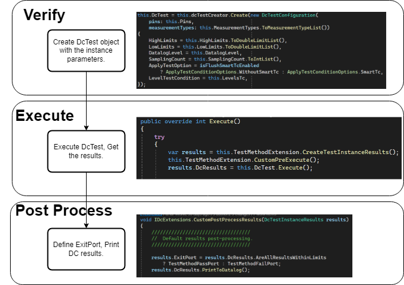

[[_TOC_]]


# DcBusinessLogic
Dc BusinessLogic (replacing the DcService) is providing the logics required to perform the DC test methods.
There are three main sections:

 - **DcTest** - Handles the creation of Dc measurement request.
 - **DcResults** - Handles the evaluated Dc measurement results.
 - **DcPrinting** - Handles the Dc printouts (console and datalog).

# Capabilites

## DcTest:

### Simple usage workflow (From PrimeDcTestMethod):



For DcTest creation, a ***DcTestCreator*** is initialized through the constructor by the Dependency injection system.
The creator instance points to a ***Create()*** method which gets a ***DcTestConfiguration*** object as argument.

***DcTestConfiguration:***
A class that represents the required data to run DC test (Pins, Measurement types, Limits and etc...).

Those are the parameters (Requierd parametes are constructor arguments, and optional are properties of DcTestConfiguration):
|Parameter Name  | Required | Type | Details |
|--|--|--|--|
|Pins| Yes | String | Represent the pins for measuring.|
|MeasurementTypes|Yes| Enum | Represent the desired measurements per pin or group - Voltage/Current |
| HighLimits | No | Doubles | Default value of 5555.5555 |
|LowLimits| No | Doubles | Default value of -5555.5555 |
|SamplingCounts| No |Integers| depend on pins|
|DataLogLevel|No|Enum |Default Value - print only Fail Values|
|ApplyTestCondition|No|Enum|Default value of none.|
|LevelTestCondition|No|Level|Defines a level to be executed.|

**DataLogLevel:**
Defines the logging level of the measurements.
```json
All:
All measurements.

FAIL_ONLY:
Only failures.

COMPRESS:
2_tname_MyTP::MyDcTest_pc
2_strgval_3|xxHPCC_DPIN_PMU_slcA_100ohm=0.199986|0.153711|0.177756|xxHPCC_DPIN_PMU_slcA_2Kohm=0.299988|xxHPCC_DPIN_PMU_slcA_50ohm1=0.399990
2_comnt_passPins_08004|08007|08001

PINMAP_COMPRESS:
2_tname_MyTP::MyDcTest_pc
2_strgval_3|100=0.199986|0.153711|0.177756|101=0.299988|102=0.399990
2_comnt_passPins_08004|08007|08001

PIN_DETAIL:
2_tname_MyTestInstanceName_MySuperPinGroup1_MyPinName1_MyCustomPostFix
2_mrslt_0.3450
2_msunit_V
2_tname_MyTestInstanceName_MyPinName2_MyCustomPostFix
2_mrslt_-0.0230
2_msunit_V
2_comnt_FailData_2

NONE [Default Value]:
No datalog.
```

****Note**: When using "PINMAP_COMPRESS" it is required to use with the PinService.json aleph file. This will provide the mapping of the id with the pin name. Example of the json file format:

PinService.json:
```csharp
{

  "$schema": "PinServiceConfiguration.schema.json",
  "Pins": [
    {
      "Name": "xxHPCC_DPIN_PMU_slcA_Short",
      "Id": 100
    },
    {
      "Name": "xxHPCC_DPIN_PMU_slcA_50ohm1",
      "Id": 101
    },
    {
      "Name": "xxHPCC_DPIN_PMU_slcA_50ohm2",
      "Id": 102
    }
  ]
}
```
Here's how to define the aleph file in the env file:
```
ALEPH_FILES = "./ServiceInitFile.txt;" +  
  ./Modules/VminSearch/InputFiles/simple_fivrDomain.json;" + 
  "./Modules/Module1/InputFiles/PinService.json";
```
Click [here](https://dev.azure.com/mit-us/PrimeWiki/_wiki/wikis/PrimeWiki.wiki/90035/Aleph) to learn more on aleph file. 

**ApplyTestConditionOptions**:
Defines the behavior of the provided Level Test Condition:
```json
None [Default Value]:
The execution of provided TestCondition will be skipped.

WithoutSmartTc:
In cases where LevelTc provided, it will be ALWAYS applied to hardware.

SmartTc:
In cases where LevelTc provided.
1. SmartTc Enabled - skip applying if the LevelTc name applied before under same smartTCCategory type.
2. SmartTc Disabled - LevelTc will be applied.
```

## Basic Code Sample:

Creating DcTest object - this is done in the Verify:
```
            this.DcTest = this.dcTestCreator.Create(new DcTestConfiguration(
                pins: this.Pins,
                measurementTypes: this.MeasurementTypes.ToMeasurementTypeList())
            {
                HighLimits = this.HighLimits.ToDoubleLimitList(),
                LowLimits = this.LowLimits.ToDoubleLimitList(),
                DatalogLevel = this.DatalogLevel,
                SamplingCount = this.SamplingCount.ToIntList(),
                ApplyTestOption = isFlushSmartTcEnabled ? ApplyTestConditionOptions.WithoutSmartTc : ApplyTestConditionOptions.SmartTc,
                LevelTestCondition = this.LevelsTc,
            });
```
Executing the DcTest and receive the results:
```
results.DcResults = this.DcTest.Execute();
```
Post process data after execution:
```
        void IDcExtensions.CustomPostProcessResults(DcTestInstanceResults results)
        {
            results.ExitPort = results.DcResults.AreAllResultsWithinLimits ? TestMethodPassPort : TestMethodFailPort;
            results.DcResults.PrintToDatalog();
        }
```

Loop over all measurements example:
```
 void IDcExtensions.CustomPostProcessResults(DcTestInstanceResults results)
{
    if (results?.DcResults == null)
    {
        Prime.Services.ConsoleService.PrintDebug(() => "CustomPostProcessResults: [results] is null, setting exit port to 0.", this.SessionContext);
        results.ExitPort = 0;
        return; // check if null
    }

    // Get all of the pin groups
    var dcGroupResults = results.DcResults.ResultsPerGroupPerPin;

    // check if empty
    if (dcGroupResults == null || dcGroupResults.Count == 0)
    {
        Prime.Services.ConsoleService.PrintDebug(() => "CustomPostProcessResults: GetAllPinGroupsDcResults returned null or .Count==0. Setting exit port to 0.", this.SessionContext);
        results.ExitPort = 0;
        return; // is empty
    }

    // setup iTUFF writer and set precision to 8 (10 n<unit> measurement)
    var ituffWriter = Prime.Services.DatalogService.GetItuffMrsltWriter();
    ituffWriter.SetPrecision(8);
    var failure = false;

    // loop over pin results, get a group and then loop again
    foreach (var pinDcResults in dcGroupResults)
    {
        var pinDc = pinDcResults.Value;
        foreach (var pins in pinDc)
        {
            // get results and get an average if multiple pins measured
            var pinVals = pins.Value.SelectMany(resBlock => resBlock.Measurements);
            var outputVal = -9999.0;

            if (pinVals != null && pinVals.Count() >= 1)
            {
                outputVal = pinVals.Average();
            }
            else
            {
                Prime.Services.ConsoleService.PrintDebug(() => "No values found", this.SessionContext);
                failure = true;
            }

            // if SharedStoragePrefix is set populate shared storage with results
            if (!string.IsNullOrEmpty(this.sharedStoragePrefix))
            {
                Prime.Services.ConsoleService.PrintDebug(() => string.Format("DcPrint saving {0}_{1} = {2}", this.sharedStoragePrefix, pins.Key, outputVal), this.SessionContext);
                Prime.Services.SharedStorageService.InsertRowAtTable(this.sharedStoragePrefix + "_" + pins.Key, outputVal, Prime.SharedStorageService.Context.DUT, ResetPolicy.RESET_AT_DEVICE_START, this.SessionContext);
            }

            // Write to iTUFF the test name and the pin name
            ituffWriter.SetTnamePostfix("_" + pins.Key);
            ituffWriter.SetData(outputVal);
            Prime.Services.DatalogService.WriteToItuff(ituffWriter, this.SessionContext);
        }
    }

    // copied from base implementation.
    if (!failure)
    {
        var areDcResultsWithinLimits = results.DcResults.AreAllResultsWithinLimits;
        results.ExitPort = areDcResultsWithinLimits ? (ushort)1 : (ushort)0;
    }

    return;
}
```


On top of above capabilities, DcBusinessLogic still provide the functionalities of the old DcCommon parsing methods under the class **DcParamsResolver**.
