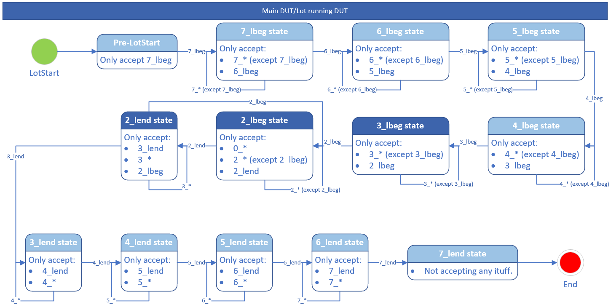
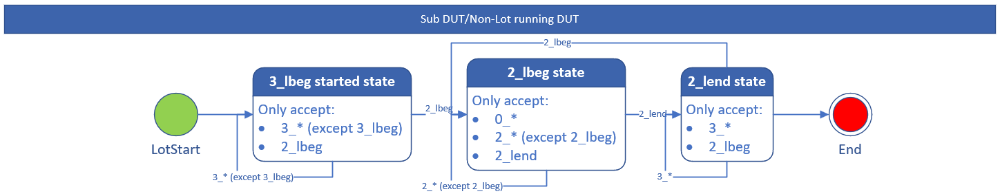

[[_TOC_]]
## Ituff level rule.
- To throw fatal exception when ituff level is out of order.
- To enable it, set **ENABLE_ITUFF_DATALOG_VALIDATION = "TRUE"** in test program environment file.

### Sequence diagram of ituff level rule,
- Main Dut  
  
- Sub Dut  
