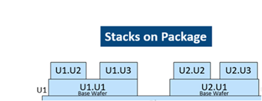
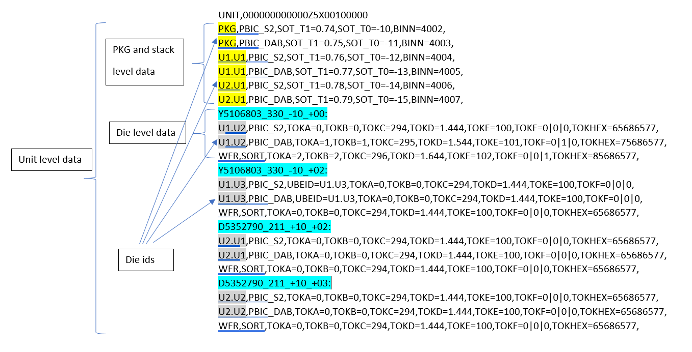
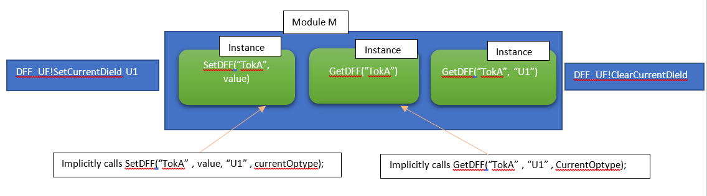
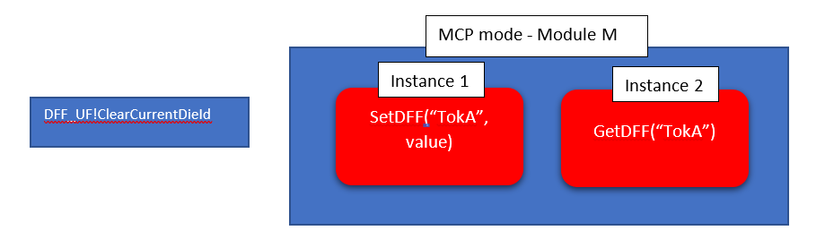
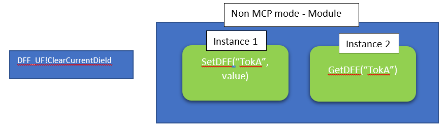
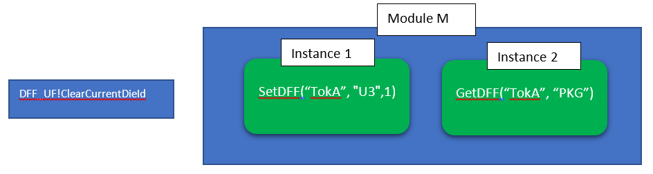

[[_TOC_]]

## Prerequisites

This Service is using Aleph initialization. Please refer to Aleph documentation

[Link to Aleph Documentation](https://dev.azure.com/mit-us/PrimeWiki/_wiki/wikis/PrimeWiki.wiki/28879/Special-ENV-Variables-in-Prime)

### Supported versions
Starting Prime v2.00.00

### Overview
Dff infrastructure is designed to support Intel Foveros products, where dies are placed upon stacks as shown in the below picture. The hierarchy can change between products and some products can have multiple stack level (stack upon a stack)

The infrastructure was designed for work in Hybrid mode (Evergreen instances and Prime instances in the same TP) where user can configure in which run time library the DFF database will be located. Regardless the DFF database location - both Evergreen and Prime instances can set or get DFF data -  which is shared for both libraries.

### Dependencies of DFF Service

Dff Service requires these UserVars to be configured:-

|UserVars|UserVar Type|Valid Options|Remark|
|-|-|-|-
|DffVars.TP_TYPE|String|CLASS or SORT|This uservar determine if DffService should follow SORT's requirements or CLASS requirements.|
|DffVars.SKIP_UBE_FILE|Boolean|TRUE or FALSE|This uservar determine if DffService should skip all UBE file related operation or not. Set this to TRUE if the execution doesn't have UBE files loaded. TRUE is only valid if TP_TYPE is SORT. Setting this to TRUE on a CLASS TP will fail init.|
|DffVars.READ_OPTYPE|String|Any Optype String|The optype to read DFF data from in UBE File. Read Optype tokens in MTL (where first_socket_upload == ReadOptype) are eligible for DFFRead Inititalization.|
|DffVars.WRITE_OPTYPE|String|Any Optype String|Uservar	The current optype executing. Write Optype tokens in MTL (where first_socket_upload == WriteOptype) are eligible for DFFRead Initialization and DFF Upload in iTuff.|
|DffVars.WRITE_MODE|String|Refer to DFF Write Mode Table|Sets the DFF Write Controls to utilize when uploading data. See WRITE_MODE Table for more details on other WRITE mode available.|
|DffVars.MTL_FILE_PATH|String|Any String for file path|Define the path for MTL file to be read from.|
|DffVars.PRINT_MEGATOKEN|Boolean|TRUE or FALSE|When value is FALSE, will not print megatoken. If no uservar defined or value is TRUE, will print megatoken as usual.|
* Function of “ReadOptype” and “WriteOptye” in which_socket file is still valid and can be overwritten by DFFVars.ReadOptypes and DFFVars.WriteOptypes. Also, these uservars will be populated/overwrite by the value from the which_socket file during init in Hybrid mode.

DFF Write Mode:

| WRITE_MODE | Write/Read OpType Setup | DESCRIPTION  | MEGATOKEN  | SkippedDFF |
|--|--|--|--|--|
| **WRITE** | Different  Example: READ_OPTYPE = "PBIC_S2"; WRITE_OPTYPE = "PBIC_DAB"; | Default mode | Print all Tokens where DFF Type = WRITE | None |
| **LOCALWRITE ("PROTECTEDWRITE")** | Same  Example: READ_OPTYPE = "PBIC_DAB"; WRITE_OPTYPE = "PBIC_DAB"; | Preserve pre-existing data for current optype and allow new tokens | print DFF's Latest Value to MegaToken for DFF Type = Write and print DFF's Original value to megatoken for DFF Type = Protected| print DFF's latest value to SkippedDFF for DFF's Type = PROTECTED && m_original != m_latest |
| **NOUPLOAD/UNDEFINED** | Same  Example: READ_OPTYPE = "PBIC_DAB"; WRITE_OPTYPE = "PBIC_DAB"; | LOCALWRITE with No Megatoken Output | None | print DFF's Latest Value to DFF_DATA for DFF Type = Read-Write and print DFF's Original Value for DFF_DATA for DFF Type = Protected and print DFF's Latest Value to SkippedDFF for DFF Type = Protected && original value != latest value and SkippedDFFOriginal will contain pre-existing data and print DFF’s Latest Value to SkippedDFF for new tokens. *If EVG template is used for “LOTSTART”, UNDEFINED needs to be used. |
#### **Note
* For the Read and Write OpType setup, if the setup doesn't follow with the write_mode, the DffRead Initialization will build token incorrectly.

### Access Type of Populated Token

By the uservar settings above, with tokens declared in Mtl file, the table below shows the access type of Dff tokens being populate in Prime DffRead.

| AccessType | Condition | Example (from Mtl file and UserVar) |
|--|--|--|
| Read-only | When first_socket_upload= ReadOptype | <first_socket_upload>PBIC_S2</first_socket_upload>  * String READ_OPTYPE = "PBIC_S2"; * String WRITE_MODE = "WRITE";|
| Read-only | When first_socket_upload= WriteOptype and upload_process_step!= ProcessStep and upload_process_step!= N/A |<first_socket_upload>PBIC_ DAB</first_socket_upload> <upload_process_step>CLASS</upload_process_step>  * String SC_CURRENT_PROCESS_STEP = "CLASSHOT"; * String READ_OPTYPE = "PBIC_S2"; * String WRITE_OPTYPE = "PBIC_DAB"; * String WRITE_MODE = "WRITE";|
| Read-Write | When first_socket_upload= WriteOptype and ( upload_process_step= ProcessStep or upload_process_step= N/A) | 	<first_socket_upload>PBIC_ DAB</first_socket_upload> <upload_process_step>N/A</upload_process_step>  <first_socket_upload>PBIC_ DAB</first_socket_upload> <upload_process_step>CLASSHOT</upload_process_step>  * String SC_CURRENT_PROCESS_STEP = "CLASSHOT"; * String READ_OPTYPE = "PBIC_S2"; * String WRITE_OPTYPE = "PBIC_DAB"; * String WRITE_MODE = "WRITE";|
| Read-Write | When TokenName is either "TIME", "OLB", "OLBBINCD" ||
| Protected | When WriteMode = LocalWrite/NoUpload  All Read-Write tokens is converted to protected |	<first_socket_upload>PBIC_ DAB</first_socket_upload> <upload_process_step>N/A</upload_process_step>  <first_socket_upload>PBIC_ DAB</first_socket_upload> <upload_process_step>CLASSHOT</upload_process_step>  * String SC_CURRENT_PROCESS_STEP = "CLASSHOT"; * String READ_OPTYPE = "PBIC_S2"; * String WRITE_OPTYPE = "PBIC_DAB"; * String WRITE_MODE = "LOCALWRITE";
| Protected | When WriteMode = LocalWrite/NoUpload When ReadOptype = WriteOptype All tokens that are Read-Write will convert to protected ||

### New UBE format supporting Foveros products

Note: Starting from Prime 13.2.1, we support "NULL" and "EMPTY" and it can be duplicates for ult.
Refer to tickets: https://dev.azure.com/mit-us/PRIME/_workitems/edit/58839/ and https://dev.azure.com/mit-us/PRIME/_workitems/edit/57338 for the request details.
 
**Legacy Evergreen DFF infrastructure**

*Init flow*
Read UBE file

::: mermaid
 graph LR;
 A[UbeRead]
:::

*Main flow*

::: mermaid
 graph LR;
 A[Start] -->|Decodes ULT|B[FuseRead]
B --> |Populates DFF for ULT| C[UBERead]
C --> |DFF 2 GSDS| D[DFFCheck]
D --> E[...]
E --> |Validate| F[DFFCheck]
:::

- UBERead reads UBE file and populates DFF database
- DFFCheck (DFF2GSDS mode) generates GSDSs representing DFF
- During the flow users read / modify those GSDS
- DFFCheck (VALIDATE mode) checks the correctness of the DFF data applied during TP execiton

**Hybrid DFF infrastructure**

DFF db is on Prime

- Evergreen's UBERead is not supported (will fail INIT)
- Evergreen's DFFCheck is not supported (will fail INIT)
- Prime's ULTDecoder test method will be used to decode and ULT
- Get / Set DFF operations will be performed on the DFF data directly (and not through GSDS like in DFFCheck usage model)

::: mermaid
 graph LR;
 A[Start] -->|Decodes ULT|B[Prime's ULTDecoder]
B --> |Populates DFF for ULT| C[Prime's DFFRead]
C --> |sets current die id|D[Evg's DFF_UF!SetCurrentDieId]
D --> |Hybrid usage|E[...]
E --> |Prints DFF mega token|F[Prime's DevideEnd]
:::

- Prime's ULTDecoder test method used to decode the ULT data. You can find more details in ULTDecoder Test Method wiki.
- Prime's DFFRead test method will be used to populate DFF data for current socket ULTs. You can find more details in DFFRead Test Method wiki.

Dff data will be populated in the below order. For each Dff token

::: mermaid
 graph LR;
 A[Start] -->|initializing with default value|B[MTL]
B --> |overriding with _read_optype_ data| C[UBE]
C --> |overriding with current optype data|D[SC_DFF_INFO]
D --> |overriding data set in the current socket|E[Current Socket]
:::

- Evergreen's DFF_UF!SerCurrentDieId user function is called to set die id for DFF operations

In Hybrid TP DFF database can be implemented either on Evergreen or on Prime -  but not in both.
This is determined by adding support in Prime and Evergreen for environemnt file variable - _DFF_DB_LOCATION_
- DFF_DB_LOCATION = "PRIME" - indicates that the DFF database is managed by Prime (default)
- DFF_DB_LOCATION = "EVG" - indicates that the DFF database is managed by Evergreen

Starting Prime v12.0.0 this variable is optional and if it's not defined, it will point to Prime's DFF DB by default.

### Current die id for get/set Dff operations
Get/Set dff data operations support setting/getting the data for specific die.
But if some TP segment uses those operations for the same unit DFF level (PKG, stack or die) – default DFF level id can be defined in using EVG user function – DFF_UF!SetCurrentDieId.
It accepts as a parameter the die id (U1 or U1.U2 for example).
Usage:  DFF_UF!SetCurrentDieId U1.U2
In order to clear the current die id (for example in the end of module flow) this UF should be used -  DFF_UF!ClearCurrentDieId
If the current die id is set -  set/get DFF operations will perform on the single die id specified there (multiple ids are not allowed).

- Set DFF operation will be performed on the current socket data only
- In Get DFF operations the data will be pulled from from the optype refined in DFFRead's "read_optype". You can find more details in DFFRead Test Method wiki.
- Each get/set DFF operation must be performed in specific die id context

### SetDff operation
    SetDff(<TokenName>(mandatory), value(mandatory), <DieID> (optional))
    SetDff(<TokenName.FieldName>(mandatory), value(mandatory), <DieID> (optional))
- Set DFF operation will be performed on the current socket data only
- If die ID was not specified - get the data based on latest value from the current DFF ID
- Assuming that current die was set by EVG UF SetCurrentDieId
- Set operation updates the value for current optype always
- SetDFF data for die ID which was not specified in FuseRead – will fail
- Using the second SetDff operation users can set specific field in the token (for individual tokens)
- During set operation validation check of the value against MTL will be applied and instance will pass/fail accordingly
- Information will print to ITUFF when SetDff operation fail

        2_tname_SETDFF_<TokenName>.<FieldName>_<Die ID>_<TestInstanceName>
        2_strgval_<Kill Status>,<Fail Type>,<Value Set>,<Current Value>
- The ITUFF print line will truncate when the line characters exceed 3900, and it will show "_TRUNCATED" at the end of the line.
- Console message are available when LogLevel is set to PRIME_DEBUG.

        SET DFF - [<TokenName>.<FieldName>][<Die ID>][<TestInstanceName>] - [<Kill Status>][<Validation Result>][<Fail Type>] = <Value Set>
- Descriptions for datalogging above

    |Field|Description|
    |-|-|
    |TokenName|Token to Set|
    |FieldName|Optional: Field Provided by User when setting. If not provided, skip printing <.FieldName>|
    |Die ID|Die ID Used during Set DFF|
    |TestInstanceName|Current Test Instance Name|
    |Kill Status|Token's Kill Status according to enabled modules|
    |Validation Results|PASS or FAIL|
    |Fail Type|Print first encountered fail when validating according to priority defined as below. Empty if PASS|
    |Value Set|The new value for the token|
    |Current Value|Original value that is in the token|
- The Fail Type Acronyms are as follow, with descending priority order of the validation MTL rules check

    |Fail Type|Description|Valid when Kill Status is|
    |-|-|-|
    |DAV|DFF token Access Violation |KILL & NON-KILL|
    |DNE|DFF token Not Exist|KILL & NON-KILL|
    |DNEF|DFF token Field Not Exist|KILL & NON-KILL|
    |DDC|DFF token Delimiter Count Check|KILL & NON-KILL|
    |DINC|DFF token Invalid Character Check|KILL & NON-KILL|
    |DRO|DFF token Required/Optional Check|KILL Only|
    |DFC|DFF token Format Check|KILL Only|
    |DSL|DFF token String Length Check|KILL Only|
    |DRCAV/DRCDV|DFF token Range Check Allowed/Disallowed Values|KILL Only|
    |DLE|DFF token custom String Length Check|KILL Only|
- The DLE fail is depends on UserVar Integer DFF_MAX_LENGTH, it will fail on EndOfFlow Validation if Dff token value string exceed uservar value. The check will skip if uservar is not exist.
- The set operation will exit on first fail encounter, which following the priority order from the table above.
- DRO, DFC, DSL and DRCAV/DRCDV will show only specific per field information when the set operation with whole token that has multiple fields.
- Tokens that successfully modify, will exclude from the list for End of Flow Validation.
- Tokens that attempt to SetDff operation but fail will have fail flag attached, until the tokens are successfully set new value only the fail flag is clear. The Fail Flag will be reflect in End Of Flow Validations
- During SetDff operation, certain type of characters is not allowed to be set to make sure it doesn't break ITUFF compatibility. Non-allowed characters are listed below:
  - , -> _Comma_
  - = -> _Equal Sign_
  - _Empty Space_
  - " -> _Double Quote_
  - ' -> _Single Quote_

### GetDff operation

    GetDFF(<TokenName>(mandatory), <DieID> (optional), <optype> (optiona))
    GetDFF(<TokenName. FieldName>(mandatory), <DieID> (optional), <optype> (optiona))
    GetDffFromUbe(<TokenName>(mandatory), <DieID> (mandatory), <optype> (mandatory))

- If optype was not specified - get the data from optype indicated by Dffread test method "read_optype" parameter
- If die ID was not specified - get the data based on latest value from the current die ID
- Current die is should be set by EVG UF "DFF_UF!SetCurrentDieId"
- GetDFF data for die ID which was not specified in ULTdecoder test method's "DieId" parameter – will fail
- Using the second GetDff operation users can get specific field in the token (for individual tokens)
- GetDffFromUbe will force to get token directly from UBE file memory(which only contain active dieId's).

### Usages
**Case1:** Reusing the same flow for different dies. There should be a possibility to set/reset “active” die within the flow bookends

- If need to run the flow for U2 – run DFF_UF!SetCurrentDieId U2
- To reset the current die id – run DFF_UF!ClearCurrentDieId  - with no parameters
- Module can be reused for any die ID execution
- User can put on “debug” mode to print what the active die is for the GET/SET instance.
- TPI set "DFF_UF!SetCurrentDieId U1" instance in the beginning of flow. Module owner to set again if change is needed.  It is module owner’s responsibility to set back per TPI configuration at the end of their module.

**Case 2:** Active die is not set , get/set DFF data without die indication -  fails since cannot resolve the active die

- Set/Get operations will fail in MCP mode, since no active die was set

- In non MCP mode – this flow will pass (no expectation to set active die)

**Case 3:**  Active die is not set but, in the flow, Set operations specifies for which die to perform it

- Module cannot be reused for other dies
- **In hybrid TP mode (Prime + Evergreen) this mode will be supported from Prime instances only and not in Evergreen instances !**

### End of Flow(EOF) Validation TestMethod

- It's similar to GSDStoDFF in DFFCheck from Evergreen.

- The test method test instance strongly advise to locating it at the end of main flow.

- The EOF Validation is validating the unused DFF tokens and fields against MTL, and the summary of failed SetDff in Main Flow

- Information on Unused tokens Validations and summary of failed SetDff in Main Flow(DMFF & DMFFN) are datalog to console(when LogLevel=PRIME_DEBUG) and ITUFF stream.

**ITUFF**

    2_tname_<TestInstanceName>_DVO
    2_mrslt_<total number of fails>
    2_tname_<TestInstanceName>_DKM
    2_strgval_<Enabled Module>
    2_tname_<TestInstanceName>_<Fail Type>_<Die ID>
    2_strgval_<Token Names>
        *Will appear new set of 2_tname and 2_strgval wben there is multiple Fail Types or multiple Die IDs

    2_tname_<TestInstanceName>_DMFF_<Die ID>
    2_strgval_<Token Names>
        *Will appear wben there is SetDff failure and multiple set of 2_tname and 2_strgval wben there is multiple Die IDs

    2_tname_<TestInstanceName>_DMFFN_<Die ID>
    2_strgval_<Token Names>
        *Will appear wben there is SetDff failure(NONKILL) and multiple set of 2_tname and 2_strgval wben there is multiple Die IDs
**Console Log**

    DFF End of Flow Results:
	     Failures Identified: <total number of fails> of Inline Validate of fails + <total number of fails> of EOF fails
    	     Enabled Modules: <Enabled Module>
	     Tokens Not Set During Flow:
		     [<Die ID>] = <Token Names>
		         *Will appear new line when more Die ID have unused token
    Failing Validation Results:
		 Fail Type Description 			 = <TOKEN.FIELD>,<VALUE>,<TOKEN2>,<VALUE2>
		 ----------------------------------------------------------------------------
		 <Fail Type Description>		 = <TOKEN.FIELD>,<VALUE>,<TOKEN2>,<VALUE2>

- Descriptions for datalogging above

    |Field|Description|
    |-|-|
    |TestInstanceName|Current Test Instance Name|
    |Total number of fails|total count of Inline Validate of fails and EOF validation fails|
    |Enabled Module|DFF Kill Mode from DFFRead enabled Modules Parameter|
    |Fail Type|show first encountered fail when validating according to priority defined as below|
    |Die ID|Die ID Used during Set DFF|
    |TokenNames|Tokens involved(if there is field name, <TOKEN.FIELD>), separated by comma|
    |Value|token current value|
- Fail Type and other involved Acronyms

    |Fail Type|Description|Valid when Kill Status is|
    |-|-|-|
    |DVO|Total Count of SetDff Failures|KILL & NON-KILL|
    |DKM|DFF Kill Mode|KILL & NON-KILL|
    |DNS|DFF tokens and fields that not touch in Main Flow|KILL & NON-KILL|
    |DAV|DFF token Access Violation|KILL & NON-KILL|
    |DNE|DFF token Not Exist|KILL & NON-KILL|
    |DNEF|DFF token Field Not Exist|KILL & NON-KILL|
    |DDC|DFF token Delimiter Count Check|KILL & NON-KILL|
    |DINC|DFF token Invalid Character Check|KILL & NON-KILL|
    |DRO|DFF token Required/Optional Check|KILL Only|
    |DFC|DFF token Format Check|KILL Only|
    |DSL|DFF token String Length Check|KILL Only|
    |DRCAV/DRCDV|DFF token Range Check Allowed/Disallowed Values|KILL Only|
    |DMFF|DFF Main Flow Fail Flag|KILL & NON-KILL|
    |DMFFN|DFF Main Flow Fail Flag (NONKILL)|KILL Only|

## Additional Information
- Starting Prime 9.0, DFFService supports multiple read-optype. To enable this, simply add multiple read-optype in the DFFVars.READ_OPTYPE i.e. "BI,SORT,PBIC_DAB".
- It is delimited by "," with no space.
- It also supports MPS. However, user need to put the READ_OPTYPE that's equal to WRITE_OPTYPE as the last element i.e:
 `READ_OPTYPE = "SORT,BI,PBIC_DAB"` and `WRITE_OPTYPE = "PBIC_DAB"`. If it's not defined as the last optype in read optype, DFFRead will error out.
- Starting Prime 12.0, binary range verification will be enabled for numbers up to 64 bits.
- Note when enabling **compression on a DFF** token it will only work if the content of the token is binary. If the content contains other values from 1 or 0 (binary), the compression will not work.