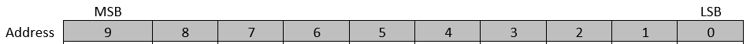

[[_TOC_]]

# Acronyms/Jargon

- DPS: Device Power Supply. Resource provided by the tester that connects to some pin(s) on your DUT.
- FIVR: Fully Integrated Voltage Regulator. Tester cannot modulate voltage of IPs connected to FIVR via pin, a pattern must be run to send data to the FIVR so it can modulate unit's voltage.
- PatMod: Pattern modify.
- IP: Intellectual property. Refers to a section of the DUT that performs a unique task that Intel sells to the customer. Ex. Graphics would be considered an IP, each core can be considered an IP.

# Prerequisites

<p style="font-size: 20px;"><span style="color: #cf6679;">This Service makes use of Aleph initialization for parsing and validation of the configuration file. Please refer to Aleph documentation for details.</span></p>

# What is VoltageService?
Voltage service provides users APIs to control how the tester supplies voltage to the DUT (ex. setting voltages on a DPS pin), or abstractions that control the unit's internal voltage regulators (ex. controlling unit's FIVR via setting values on a pattern VIA PatConfigService).

Much of the VoltageService APIs make use of configurations called "voltage domains". Instead of defining voltage parameters via source code, VoltageService loads a configuration file that contain an array of configurations called "voltage domains". Users can call as many domains as needed during a given API call.

Depending on the product under test and its requirements, the voltage can be applied through different ways:

## Modulating voltage VIA "DPS"
VoltageService can modulate voltage to the DUT by controlling the DPS resource of the tester. DPS resource(s) connect to some pin(s) on your DUT.

You can set the voltages of DPS pins with test conditions and/or TOS pin attributes (you can refer to the TOS User Guide for info on pin attributes). Modulating voltage VIA test condition can be used in conjunction with an External Trigger in the pattern and a TriggerMap, managed by the FunctionalService.

## Modulating voltage VIA "FIVR"
When a unit contains some IP that's connected to FIVR circuits, the tester cannot modulate the voltage to said IP through DPS pins. To change the voltage to the IP, the PDEs must run a pattern that sends the desired voltage value to the FIVR circuit(s), the FIVR in turn will set the outgoing voltage to the IP to the value contained within the pattern.

It's possible to create a unique pattern for every possible voltage value the user would like to send to the FIVR, but this approach would greatly increase the number of loaded patterns, bloating tester memory. To avoid pattern bloat, VoltageService provides voltage domain configurations that performs pattern modifications on FIVR patterns.

Instead of creating multiple patterns for each voltage + FIVR combination, users can provide a FIVR voltage domain along with the desired voltage value to VoltageService APIs. VoltageService will then utilize PatConfigService to modify the area of the pattern that sends the desired voltage to the FIVR.

# VoltageService configuration files
The majority of VoltageService APIs use parameters that are set using configuration files that are loaded during INIT. For most products, if your test methodology utilizes VoltageService APIs, creation of these files are mandatory.

## Voltage domain configuration
This json file defines the options available to your test program for modulating voltage to the DUT. The "Domains" field allows users to define an array of configurations called "voltage domains".

The voltage domain configuration can contain FIVR and DPS voltage domain declarations within the "Domains" field. Each voltage domain targets either FIVR or DPS, utilizing elements that correspond to the desired methodology. Individual voltage domains cannot contain elements from both methodologies; you must make a voltage domain that contains either FIVR or DPS elements. Voltage domains are inferred to be FIVR or DPS depending on the elements present within the declaration.

When calling a VoltageService API that requires the user to provide a list of domains, the list must exclusively contain domains from one methodology. You cannot provide a list with DPS and FIVR domains within the same API call.

The configuration also provides the ability to define auxillary operations called "rails" that can augment the execution of domain(s). These operations can be appended to the execution of any domain/domain group/condition VIA VoltageService APIs.

To load this file in your test program, you must name it using the following file format:

Format file name: {customer file name}*.voltageDomain.json*

The path to the voltage domain configuration must be provided to your test program's ENV file within the "ALEPH_FILES" field.

### Configuration example
```json
{
  "DisabledDomains": {
      "type": "UserVar",
      "value": "Voltage::TestVars.DisabledDomains"
  },
  "Domains" : [
    {
      "name" : "IO1",
      "pattern_modify" : {
          "initial_voltage" : {
              "multiplier" : 256,
              "configuration" : "PatModConfiguration0",
              "pattern_regex": "fivr.*",
              "number_of_targets" : 1
          }
      },
      "default_value" : 0.45
    },
    {
      "name" : "IO2",
      "pattern_modify" : {
          "initial_voltage" : {
              "multiplier" : 256,
              "configuration" : "PatModConfiguration2",
              "pattern_regex": "fivr.*",
              "number_of_targets" : 1
          }
      },
      "default_value" : 0.45
    },
    {
      "name" : "CORE0",
      "pattern_modify" : {
          "initial_voltage" : {
              "multiplier" : 256,
              "configuration" : "PatModConfiguration1",
              "number_of_targets": 3,
              "ratio": 2
          },
          "offset" : {
              "type" : "calibration",
              "magnitude_configuration" : "MagnitudeConfiguration1",
              "magnitude_pattern_regex": "fivr.*",
              "magnitude_ratio": 2,
              "sign_configuration" : "SignConfiguration1",
              "sign_pattern_regex": "fivr.*",
              "sign_ratio": 2
          }
      },
      "dac_calibration" : {
          "slope" : "SlopeDACValue",
          "offset" : "OffsetDACValue"
      },
      "default_value": 0.45
    },
    {
      "name" : "CORE1",
      "pattern_modify" : {
          "initial_voltage" : {
              "multiplier" : 256,
              "configuration" : "PatModConfiguration1",
              "number_of_targets": 1
          },
          "offset" : {
              "type" : "calibration",
              "magnitude_configuration" : "MagnitudeConfiguration2",
              "sign_configuration" : "SignConfiguration2"
          }
      },
      "dac_calibration" : {
          "slope" : "SlopeDACValue",
          "offset" : "OffsetDACValue"
      },
      "default_value": 0.45
    },
    {
      "name" : "CORE2",
      "pattern_modify" : {
        "initial_voltage" : {
          "multiplier" : 256,
          "configuration" : "PatModConfiguration1",
          "number_of_targets": 1
        },
        "offset" : {
          "type" : "calibration",
          "magnitude_configuration" : "MagnitudeConfiguration2",
          "sign_configuration" : "SignConfiguration2"
        }
      },
      "dac_calibration" : {
        "slope" : "SlopeDACValue",
        "offset" : "OffsetDACValue"
      },
      "default_value": 0.45,
      "restore_value": 0.1
    },
    {
        "name" : "DPS_DOMAIN",
        "dps_pin" : "HDDPS_VLC_16ohm1"
    }
  ],
  "DomainGroups" : [
    {
        "name": "I012",
        "domains" : [
            "IO1",
            "IO2"
        ]
    },
    {
        "name": "CORE01",
        "domains": [
            "CORE0",
            "CORE1"
        ]
    },
    {
        "name" : "DPS_GROUP",
        "domains": [
            "DPS_DOMAIN"
        ]
    }
  ],
  "DlvrPins": [
    {
      "pin_name" : "VCC_H",
      "voltage_expression" :[
        {
          "expression_name" : "First_Expression",
          "expression_value" : "max(SA,CORE)+0.5"
        },
                {
          "expression_name" : "Second_Expression",
          "expression_value" : "min(SA,CORE)+0.5"
        }
      ],
      "min": 0.5,
      "max" : 2.0,
      "step_size" : 0.1
    }
  ],
  "PatternModify" : [
    {
        "pattern_modify_name" : "PatternModify0",
        "module" : "Module",
        "group" : "SWITCH",
        "selector" : "0.675 > max(SA, CORE)",
        "set_point_for_true" : "ON_CONFIG_SET",
        "set_point_for_false" : "OFF_CONFIG_SET"
    },
    {
        "pattern_modify_name" : "PowerSwitchDlvrPowerSupply",
        "module" : "PowerSwitchDlvrPowerSupply",
        "group" : "PowerSwitchA",
        "selector" : "0.675 > CORE0",
        "set_point_for_true" : "OffPowerSwitch",
        "set_point_for_false" : "OnPowerSwitch"
    }
  ],
  "TimingAttributes" : [
    {
      "pin_name" : "ClockPin",
      "domain" : "DDR_STF",
      "attributes" : [
          {
              "name" : "TFall",
              "expression" : "(SA/0.5)*PERIOD",
              "step_size" : 0.0000000001
          }
      ],
      "required_attributes" : [
          {
              "name" : "EdgeCounter",
              "value" : "Off"
          }
      ]
    }
  ]
}
```

### Description of fields
- _**DisabledDomains**_: Optional. Allows for disabling voltage domains defined within the file.
  - _**type**_: Required. Defines the source for retrieving the name of the voltage domain to disable. Allowed values are "Literal" or "UserVar". Literal will use the provided value as the voltage domain to disable. UserVar will retrieve the voltage domain name  from a user variable.
  - _**value**_: Required. For "Literal" type, provide a comma separated list of domains to be disabled. For "UserVar" type, provide the name of the user var that points to a comma separated list of voltage domains to disable.
- _**Domains**_: Optional. A list of voltage domain configurations for the VoltageService to use. This field can define voltage domains to be used by FIVR and/or DPS methodologies.
  - _**name**_: The name the voltage domain will be referenced by. Provide this name whenever VoltageService APIs require a domain for execution.
  - _**dps_pin**_: DPS only. Required (for DPS domains). The name of the DPS pin to use for this domain.
  - _**pattern_modify**_: FIVR only. Required (for FIVR domains). This field is used is to group all the required definitions of each pattern modification needed for a specific domain (for both, calculations for converting from voltage to internal units and the corresponding target pattern modify configurations). Depending on the product and the domain, there are up to three pattern modification targets (to set internal DUT FIVR configuration registers): one for an initial value (always required) and two additional (optional) configurations for offset magnitude and offset sign.
    - _**initial_voltage**_: Configuration for the pattern modification that sets the initial voltage value when this domain is in use..
      - **_multiplier_**: Optional. Multiplies the voltage to set by this integer value before converting to binary.
      - _**configuration**_: Required. The pat mod or fuse configuration to use when performing the pattern modify. Matches to a pat mod or fuse configuration defined in a PatModConfig file or FuseConfig file (see Patconfig service for more details on defining these configurations).
      - **_pattern_regex_**: Optional. A regex for filtering patterns to pat mod. If the configuration in use contains a regex, **pattern_regex** is used to filter from the list of patterns returned by the configuration.
      - **_number_of_targets_**: Required. Duplicates the binary string by this integer value before providing it to PatconfigService. Used in cases where the provided configuration targets more than one register.
      - **_ratio_**:  Optional. Allows user to provide a ratio to their pat mod data, duplicating each bit of the binary data by the value of ratio. By default, this value is 1 (no duplication). Overrides the ratio defined within the configuration if one is defined. See PatConfigService documentation for more information on ratio behavior.
   - **_default_value_**: FIVR only. Required (for FIVR domains). Field to provide a positive double value used in cases where VoltageService attempts to apply a negative value using this domain.
   - **_restore_value_**: FIVR only. Required (for FIVR domains). Field to provide a positive double value used when `Restore()` is called on the objects created with this domain.
   - **_offset_**: FIVR only. Optional. Used for configuring the calculation settings for offset when this domain is in use.
      - _**type**_: Defines how to perform the conversion calculation of required offset value (explained in calculations section). There are two available options: *vid* or *calibration*
      - _**magnitude_configuration**_: Optional. The pat mod or fuse configuration to use when performing the pattern modify. Matches to a pat mod or fuse configuration defined in a PatModConfig file or FuseConfig file (see Patconfig service for more details on defining these configurations).
      - _**magnitude_pattern_regex**_: Optional. A regex for filtering patterns to pat mod. If the magnitude configuration in use contains a regex, **pattern_regex** is used to filter from the list of patterns returned by the configuration.
      - _**magnitude_ratio**_: Optional field. Allows user to provide a ratio to their "magnitude" pat mod data, duplicating each bit of the binary data by the value of ratio. By default, this value is 1 (no duplication). Overrides the ratio defined within the configuration if one is defined.
      - _**sign_configuration**_: Optional. The pat mod or fuse configuration to use when performing the pattern modify. Matches to a pat mod or fuse configuration defined in a PatModConfig file or FuseConfig file (see Patconfig service for more details on defining these configurations).
      - _**sign_pattern_regex**_: Optional. A regex for filtering patterns to pat mod. If the sign configuration in use contains a regex, **pattern_regex** is used to filter from the list of patterns returned by the configuration.
      - _**sign_ratio**_: Optional field. Allows user to provide a ratio to their "sign" pat mod data, duplicating each bit of the binary data by the value of ratio. By default, this value is 1 (no duplication). Overrides the ratio defined within the configuration if one is defined.
      - _**invert_sign**_: Optional. Boolean field to invert the current sign convention. If *TRUE*  the sign conversion will be inverted when the offset calculation is complete.
  - _**dac_calibration**_: Optional. Configuration for DAC calibration, augmenting the calculated voltage value before converting to binary. Values must be inserted into shared storage by some previous test instance.
      - _**slope**_: Keyword to access a double value in shared storage that the whole lot references (must be inserted into LOT context by SharedStorage API). Multiplies the voltage value to set before converting to binary.
      - _**offset**_: Keyword to access a double value in shared storage that the whole lot references (must be inserted into LOT context by SharedStorage API). Added to the voltage value after all multiplication is performed before converting to binary.
- _**DomainGroups**_: Optional. Used for grouping multiple domains into one name to be provided to VoltageService APIs. Only one type of domain is supported per group; mixing DPS and FIVR domains in a group is not supported.
  - _**name**_: The name to use when providing this domain group to a VoltageService API. Can be used in place of a single voltage domain for VoltageService APIs that request voltage domains for execution.
  - _**domains**_: A list of domain names that this domain group contains. All domains defined in this field will be used when this domain group is provided to VoltageService APIs.
- _**DlvrPins**_: Optional [rail configurations](#Rail-Configurations). Used for setting voltages on DLVR pins after executing the domains provided to a VoltageService API.
  - _**pin_name**_: The name of the DLVR pin to target. This field is also used to identify this rail configuration.
  - _**voltage_expression**_: A list of [expressions](#Expression-engine) used to calculate the voltage to apply. By default, the first expression defined is used.
  - _**min**_: Field to provide a minimum value to apply to DLVR pin. If the expression result is lower, this value will override the applied value to the DVLR pin.
  - _**max**_: Field to provide a maximum value to apply to DLVR pin. If the expression result is higher, this value will override the applied value to the DLVR pin.
  - _**step_size**_: Field to provide a step size for the jumps in new values applied to DLVR pins (explained in RailSetups section).
- _**PatternModify**_: Optional [rail configurations](#Rail-Configurations). A list of pat mods to configurations to use after executing the domains provided to a VoltageService API.
  - _**pattern_modify_name**_: The name of this rail configuration. Used when providing this rail configuration to voltage objects.
  - _**module**_: The name of the module to use for this rail configuration. Refers to the name of a module within a PatConfigSetPoint configuration file (see PatconfigService for more details on defining this configuration).
  - _**group**_: The name of the group to use from the defined module within your PatConfigSetPoint file.
  - _**selector**_: An [expression](#Expression-engine) that evaluates to a boolean value. Used to choose which set point configuration to use for this pat mod.
  - _**set_point_for_true**_: The name of the set point to use from your chosen group when the expression evaluates to "true".
  - _**set_point_for_false**_: The name of the set point to use from your chosen group when the expression evaluates to "false".
- _**TimingAttributes**_: Optional [rail configurations](#Rail-Configurations). A list of configurations to modify pin attributes to the targeted pin after executing the domains provided to a VoltageService API.
  - _**pin_name**_: The name of the pin to target when modifying attributes.
  - _**domain**_: The name of a domain that's defined within resource file that's targeting the tester HPCC resource. Used for retrieving the currently applied period value to the given domain. Required when using the ```PERIOD``` keyword for this timing expression.
  - _**attributes**_: A list of pin attributes to modify with numerical values.
    - _**name**_: The name of the attribute to modify for the given pin.
    - _**expression**_: The [expression](#Expression-engine) to use when calculating the value to apply to the pin attribute.
    - _**step_size**_: A value representing the minimum absolute difference required between the current value and the new value (calculated by the expression) for the new value to apply. If the new value does not meet this delta, the attribute will not be applied. Must be provided as a positive value.
  - _**required_attributes**_: A list that pin attributes to modify with string literals. Also can be used for numerical values that are not calculated by an expression.
      - _**name**_: The name of the attribute to modify for the targeted pin.
      - _**value**_: The value to use for the targeted attribute.


### Disabling domains in configuration.
VoltageService allows users to provide a list of domains to disable within their domain configuration file VIA the *DisabledDomains* field.

Disabling domains prevents the configuration from loading into memory, causing all calls to the domain to be ignored.

#### Example
A domain configuration defines five domains (CORE0-CORE5). Let's say that we no longer require CORE3 or CORE5, but do not want to remove the definitions from the file. We can set up the *DisabledDomains* like so:
```json
...
"DisabledDomains": {
    "type": "Literal",
    "value": "CORE3,CORE5"
},
...
```

Let's say that we create a VoltageService object using domains "CORE0,CORE1,CORE2,CORE3,CORE4,CORE5" (or a domain group/FIVR condition that defines all these domains). Below would be the voltage values that would normally be applied per domain:

$$
Voltage\_targets =
\begin{cases}
      CORE0, & Enabled, & value\_to\_apply = 0.1V\\
      CORE1, & Enabled, & value\_to\_apply = 0.2V\\
      CORE2, & Enabled, & value\_to\_apply = 0.3V\\
      CORE3, & Disabled, & value\_to\_apply = 0.4V \\
      CORE4, & Enabled, & value\_to\_apply = 0.5V\\
      CORE5, & Disabled, & value\_to\_apply = 0.6V\\
\end{cases}
$$

When loading a test program using our previously defined *DisabledDomains*, the following domains will ignored:

$$
Voltage\_Values =
\begin{cases}
      CORE0, & 0.1V\\
      CORE1, & 0.2V\\
      CORE2, & 0.3V\\
      CORE3, & Ignored\\
      CORE4, & 0.5V\\
      CORE5, & Ignored\\
\end{cases}
$$

**Note:** Some VoltageService APIs required that you provide a list of voltage values to set along with your domain. In these cases, you're still required to populate a value per domain, even if that domain is disabled.

## FIVR condition configuration
This configurations allows you to augment a FIVR domain, utilizing a pre-exising domain with a different voltage value or guardband.

To load this file in your test program, you must name it using the following file format:

Format file name: {customer file name}*.fivrCondition.json*

The path to the FIVR condition configuration must be provided to your test program's ENV file within the "ALEPH_FILES" field.

### Example file
```json
{
  "Conditions": [
    {
      "name": "FIVR_VLOAD_CORE0123_LC",
      "domains": [
        {
          "name": "FIVR_VLOAD_CORE0_LC",
          "voltage": {
            "type": "Literal",
            "value": "0.75"
          }
        },
        {
          "name": "FIVR_VLOAD_CORE1_LC",
          "voltage": {
            "type": "SharedStorage",
            "value": "FIVR_VLOAD_CORE1_LC"
          },
          "guard_band": {
            "type": "Literal",
            "value": "0.0"
          }
        },
        {
          "name": "FIVR_VLOAD_CORE2_LC",
          "voltage": {
            "type": "Literal",
            "value": "0.85"
          },
          "guard_band": {
            "type": "SharedStorage",
            "value": "FIVR_VLOAD_CORE0_LC_GUARD_BAND"
          }
        },
        {
          "name": "FIVR_VLOAD_CORE3_LC",
          "voltage": {
            "type": "Literal",
            "value": "0.65"
          }
        }
      ]
    },
    {
      "name": "FIVR_VLOAD_CORE0123_Literal",
      "domains": [
        {
          "name": "FIVR_VLOAD_CORE0_LC",
          "voltage": {
            "type": "Literal",
            "value": "0.75"
          }
        },
        {
          "name": "FIVR_VLOAD_CORE1_LC",
          "voltage": {
            "type": "Literal",
            "value": "0.8"
          }
        },
        {
          "name": "FIVR_VLOAD_CORE2_LC",
          "voltage": {
            "type": "Literal",
            "value": "0.85"
          }
        },
        {
          "name": "FIVR_VLOAD_CORE3_LC",
          "voltage": {
            "type": "Literal",
            "value": "0.65"
          }
        }
      ]
    },
    {
      "name": "FIVR_GUARDBAND_VLOAD_CORE0_LC",
      "domains": [
        {
          "name": "FIVR_VLOAD_CORE0_LC",
          "voltage": {
            "type": "Literal",
            "value": "0.75"
          },
          "guard_band": {
            "type": "Literal",
            "value": "0.01"
          }
        }
      ]
    },
    {
      "name": "CONDITION_OF_GROUPS",
      "domains": [
        {
          "name": "DOMAIN_GROUP_CORE01",
          "voltage": {
            "type": "Literal",
            "value": "0.75"
          }
        },
        {
          "name": "DOMAIN_GROUP_CORE23",
          "voltage": {
            "type": "Literal",
            "value": "0.8"
          }
        }
      ]
    }
  ]
}
```

### Description of fields
-  _**Conditions**_: Contains a list of all of the conditions that are defined within this file. Each condition can be called by name to augment the execution of some voltage domain(s).
  - _**name**_: The name of the FIVR condition. Provide this value to VoltageService APIs that request a FIVR condition to use this configuration.
  - _**domains**_: All of the domains that this condition will use when provided to a VoltageService API.
    - _**name**_: The name of the voltage domain to augment. The given value must match an existing FIVR voltage domain in your voltage domains configuration file.
    - _**voltage**_: The voltage value to set on the provided domain. The provided value can be a key to use to retrieve the value from SharedStorage, or a string literal that represents a numeric voltage value to use.
      - _**type**_: Set to *Literal* to interpret the *value* field as the voltage to set. Set to *SharedStorage* to use *value* as a SharedStorage key, then retrieve the double value from SharedStorage (specifically from the `Double` table and `DUT` context). See SharedStorageService documentation for more details on how to insert these values dynamically throughout test program execution.
      - _**value**: Value to be apply to the domain when this condition is called. Usage of this field depends on *type* field.
    - _**guard_band**_: Optional. Guard band value (static or dynamic) which will be added to the `Value` field.
      - _**type**_: Set to *Literal* to interpret the *value* field as the guardband to use. Set to *SharedStorage* to use *value* as a SharedStorage key, then retrieve the double value from SharedStorage (specifically from the `Double` table and `DUT` context). See SharedStorageService documentation for more details on how to insert these values dynamically throughout test program execution.
      - _**value**_: Value to add to voltage before setting on the desired domain when this condition is called. Usage of this field depends on *type* field.

# FIVR: Transforming input voltage to binary format
When modulating voltages using FIVR, the provided decimal value for voltage must be converted to a binary format that FIVR can read. To do this, VoltageService uses parameters set by the user to transform the input voltage before converting to binary.

## Transform for independent domains
In the ideal case there are no domain dependencies and with only one internal register per domain is enough to set the required voltage. There are two known common cases:
1. The register to set directly represents the required voltage value, in which case, the only conversion required is a multiplier to convert from the input voltage value to an integer value (number of steps that represent that voltage in the internal FIVR logic) required by the internal register (calibration adjustments for DAC would also be handled internally by internal FIVR logic).
2. The register to set must already consider the per DUT DAC calibration. So, the input voltage must be adjusted following a linear equation.

Both cases can be handled with one single formula:

$$initial\_voltage\_set\_value = input\_voltage * multiplier * dac\_calibration\_slope + dac\_calibration\_offset$$

Given that calibration values are optional, in this equation the default used values are:
- dac_calibration_slope = 1
- dac_calibration_offset = 0

With these default values the first case is addressed. For the second case it is expected that the user fills the calibration fields with appropriate references and sets the multiplier field to '1'.

## Transform for dependent domains
In a less ideal case, some domains share the same internal register to set the required voltage, not allowing to use this register to set independent voltages for each of these domains. The workaround to be able to set independent voltages on such domains is through additional setting registers for each one, that allow to set an offset from the common value set to the shared register.
These dependent domains are identified directly from configuration files, grouping those that share a common pattern modify configuration under the 'initial_voltage' section.
If one of these dependent domains is the target for a voltage apply, all detected dependent domains would also be also applied, using the maximum value  (this choice could not be ideal and the common value to use could change in the future) from the grouped domains providing a target input voltage.

### Dependent domains with VID offset method

$$initial\_voltage\_set\_value = common\_voltage * multiplier$$

$$offset\_magnitud\_set\_value = \mid (input\_voltage - common\_voltage) * dac\_calibration\_slope \mid $$

$$
offset\_sign\_set\_value=
    \begin{cases}
      Positive, & \text{if}\ (input\_voltage - common\_voltage) \geq 0 \\
      Negative, & \text{otherwise}
    \end{cases}
$$

### Dependent domains with Calibration offset method

$$initial\_voltage\_set\_value = common\_voltage * multiplier$$

$$offset\_magnitud\_set\_value = \mid (input\_voltage - common\_voltage) * dac\_calibration\_slope + dac\_calibration\_offset \mid $$

$$
offset\_sign\_set\_value=
    \begin{cases}
      Positive, & \text{if}\ ((input\_voltage - common\_voltage) * dac\_calibration\_slope + dac\_calibration\_offset) \geq 0 \\
      Negative, & \text{otherwise}
    \end{cases}
$$


### Transform for dependent domains without sign configuration fuse
Due to the _**sign configuration**_ field being optional the case where only a _**magnitude configuration**_ is provided can happen. In this case the previous methods of calculating apply, be it _**VID**_ or _**Calibration**_ still apply. Main difference is that if the pattern modify configuration size is _**N**_ bits only _**N-1**_ bits will be used for setting the offset magnitue. Meanwhile the sign value will be fit into **1 bit** and the **most significant bit** will contain the resulting sign value.

For example if you had a 10 bit magnitude configuration such as:



When the offset magnitude value is calculated it will be fit into bit **0** to bit **8**. Meanwhile the resulting offset sign will be set in the MSB bit **9**.

### Transform for dependent domains with invert sign enabled

When invert sign is enabled the sign convention of both **Calibration** and **VID** is inverted when calculating the sign bit. This works for both cases where only a magnitude configuration is provided and where both magnitude and sign configurations are provided.

Current sign convertion works like this:
|Sign magnitue|Sign Bit Value|
|-|-|
|`Positive`|0|
|`Negative`|1|

When utilizing invert sign on an offset configuration the convention now becomes:
|Sign magnitue|Sign Bit Value|
|-|-|
|`Positive`|1|
|`Negative`|0|

This needs to be configured **for each domain that requires this change**  when calculating sign offset value.

# Applying negative voltage values
Applying negative values to a Power Supply is not allowed, and because of that the customers need to consider the behavior when a negative value is sent to be applied to a pin or domain.

To begin with, the behavior between DPS and FIVR is different. When an IVoltage object is created to use a DPS pin, either as a DPS domain or DPS pin, the voltage object will perform a hardware measurement of the pin voltage value, and this value is saved to be applied in the case that a negative value is sent to be applied. In the case of FIVR, there is an optional field (with default value `0.0 V`) in the FIVR's definition, intended to set a safe value to be applied to the domain instead of the negative value.

When the negative value is sent to be applied to a domain group, in the case of the DPS domain group, the value to apply will be the saved voltage from the hardware measurement in the moment of the IVoltage object creation, for each DPS domains in the group. In the case of FIVR domain group, the value to applied will the `maximum` of the defaul values of the FIVR domains in the group.

## Negative values in repeated domains
A behavior to consider regarding the domains, is that the `repeated domain` feature is resolved during the creation of the IVoltage object, while `negative values` is resolved during the application of the voltages. To understand the interactions between these capabilities working together, let's understand these cases:

### Case Negative value to single domains
This case just override the negative value and no repeated management is required.

Following table shows incoming data:
|Target|Value|Default value|
|-|-|-|
|`SingleDomain`|-0.6|0.8|
|`OtherSingleDomain`|0.7|0.8|

Following table shows applied values:
|Target|Applied value|
|-|-|
|`SingleDomain`|0.8|
|`OtherSingleDomain`|0.7|

### Case 2: Same negative value to a repeated domain
This case presents a repeated domain where the value to apply is the same negative number. The resolution process is as follows: first, the maximun of the incoming values will be taken to apply because of the repetition domain, in this case `-0.6` is the maximum. Then, the is a resulted negative number that is going to be repleaced by the default value, so at the end `0.8` is applied once to the domain.

Following table shows incoming data:
|Target|Value|Default value|
|-|-|-|
|`SingleDomain`|-0.6|0.8|
|`SingleDomain`|-0.6|0.8|

Following table shows applied values:
|Target|Applied value|
|-|-|
|`SingleDomain`|0.8|

### Case 3: Different values to a repeated domain, one of them is negative
This case presents a repeated domain with two different values to be applied, one of them is negative. The resolution process is as follows: first, the maximun of the incoming values will be taken to apply because of the repetition domain, in this case `0.7` is the maximum. Then, because of the resulted number is positive, there is nothing else to be resolved, at the end `0.7` is applied.

Following table shows incoming data:
|Target|Value|Default value|
|-|-|-|
|`SingleDomain`|0.7|0.8|
|`SingleDomain`|-0.6|0.8|

Following table shows applied values:
|Target|Applied value|
|-|-|
|`SingleDomain`|0.7|

# FIVR Restore

There is an optional capability to set-up FIVR restore values that will be applied once `Restore()` is called. There are two main ways to configure restore values to a FIVR domain.

1. Setting a per domain value in the configuration file under **restore_value** keyword in the json (refer to example above). This value can't be negative and can only be used in FIVR domains.
2. API `void SetFivrRestoreValues(Dictionary<string, double> domainRestoreValues)` allows configuring restore values to the object directly via code. It expects a dictionary of DomainName -> RestoreValue. Note value can't be negative and domainName can be a group.

### Additional notes

If defining restore values via json file and later on calling `SetFivrRestoreValues` API it will override any restore values taken from the file. Consider the object automatically gets the restore value for each domain the object was created with, it also only considers domains that are enabled.

When utilizing restore values from the file and creating an `IVoltage` object with FIVR domain groups it is expected each group member has the same restore value defined in the file or no restore values are used at all.
Example:
```
DomainGroupName = "CORE01";
Elements = "CORE0", "CORE1";
```
Given a group with 2 elements which both domains have a restore value such as:
```
CORE0_restoreValue = 0.1;
CORE1_restoreValue = 0.2;
```
If an object is created targeting the domainGroup `CORE01` it will fail due to it having different restore values. Same idea applies if only one of the domains has a restore value. This is done to ensue same behavior as utilizing the API since in the case of setting a restore value to a group it would se the same value to all domains in the group.

If this is not the required behavior it is possible to not use a group and instead target `CORE0` and 'CORE1' separately in the object.

# Rail Configurations
Rail configurations allow for augmenting the usage voltage domain(s)/domain group(s)/condition(s) by executing extra operations after the domain is applied.

You can use as many rail configurations<sup>1</sup> as desired for APIs that support usage of rails.

Rail configurations cannot be configured to trigger VIA VoltageService configurations, they must be supplied as an extra parameter to VoltageService APIs.

Check the documentation of a given test method (or check-in with your friendly local user code developer) to determine if a given test class supports the use of rails with voltage domains/domain groups/conditions.

The types of configurations you can define are [DLVR Pins](#DLVR-Pins), [Pattern Modify](#Pattern-Modify) and [Timing Attributes](#Timing-Attributes) configurations.

**Notes:**

1) You cannot provide duplicate rail definitions to within the same call to a VoltageService API. Duplicate calls to any given rail will cause the service to throw.

## DLVR Pins
This configuration will apply a voltage value to the provided DLVR pin when used.

### Voltage expressions
Voltage expressions are [expressions](#Expression-engine) used to resolve the voltage value to apply to the DLVR pin.

The expressions can reference voltage values set to FIVR domains, DLVR pins, and DPS pins.

This configuration can create more than one expression to be used within the configuration. By default, the first expression will be used. Other expressions can targeted by using the VoltageService APIs.

Here's an example of calculating a voltage expression:

Let's say that **SA**, **CORE0**, and **RING0** are domains that are defined in your voltage domain file. These domains can be referenced like so:

`0.5 + max(SA, RING0)` => Take the largest value between the two domains. Add it to the constant `0.5`.</br>
`2.0 * SA + CORE0` => Multiplies a constant to SA, then add the result to CORE0

### Voltage range (min and max)
In order to protect the pin, you must define a minimum and maximum value for the given pin. If the evaluated value exceeds the range, the service will apply the upper/lower limit.

The upper limit is used when the evaluated value exceeds the maximum value, and the lower limit is used when the evaluated value is below the minimum value.

If the range between the [minumim, maximum] is smaller than the provided step size, the service will throw an exception.

### Step size
In cases where a domain has already applied a value to the targeted pin, the expression value is used only when the absolute difference between the two current and new value exceeds the defined step size.

## Pattern Modify
This configuration will modify a pattern with with one of two provided setpoints, depending on the evaluated expression provided to rail configuration's selector field.

### Set points
Set points define what settings are to be used when performing the pat mod.

This configuration requires that you create a PatConfigSetPoints configuration file for this rail configuration to reference. You can learn about this file by reading the Prime.Service.PatConfigService documentation.

### Selector
The selector is an [expression](#Expression-engine) that evaluates to some boolean value. This value is used to determine the set point to use for this pat mod.

In order to provide an example of the PatternModify selector expression, let's say that **SA**, **CORE0**, and **RING0** are well-defined domains, so some valid expressions are as follows:
 * Next expression will return true if SA is higher than CORE0, otherwise will return false: **SA > CORE0**
 * Next expression will return true if SA is equal to a constant, otherwise will return false: **SA == 0.75**

Allowed equalities and inequalities: ```=, ==, <>, !=, <, <=, >, >=```.

So, the setpoint to execute is as follows:

$$
setpoint\_to\_execute=
    \begin{cases}
      set\_point\_for\_true, & \text{boolean expression return TRUE} \\
      set\_point\_for\_false, & \text{boolean expression return FALSE}
    \end{cases}
$$

## Timing Attributes
This rail configuration is intended to changing the values of the attributes of a specific timing pin. Every pin attribute value is the result of an expression that could or couldn't depend on previously applied domain values. The expression in this configuration has a protected keyword: ```PERIOD```, this keyword is used when the user wants to input expressions that use the tester period value for the given domain in this configuration, it is **optional**. Every timing attribute configuration must be defined in [domain configuration file](#FIVR-domains).

In order to provide an example of the attribute value expression, let's say that **SA**, **CORE0**, and **RING0** are well-defined domains and we configured the domain for the example pin as **D0**, so some valid expressions are as follows:
 * Next expression will take the maximum value from SA and RING0 and will add it an offset: **0.5 + max(SA, RING0)**
 * Next expression will multiply a constant to SA and add the result to CORE0: **2.0*SA + CORE0**
 * Next expression will multiply a constant to the period value given by the tester for the configured domain D0: **2.0*PERIOD**

Allowed mathematical operations: ```min, max, avg, sum, abs, ceil, floor, round, roundn, exp, log, log10, logn, pow, root, sqrt, clamp, inrange, swap```.

It's important to note that the resulted expression value will be applied only if the difference between the previously applied attribute value is higher than the step size,. As follows:

$$
attribute\_value\_to\_apply=
    \begin{cases}
      current\_attribute\_value, &  step\_size > abs(value\_resolved\_by\_expression - current\_attribute\_value)\\
      value\_resolved\_by\_expression, & step\_size <= abs(value\_resolved\_by\_expression - current\_attribute\_value)
    \end{cases}
$$

### Required Attributes
Optional field for providing additional attributes that are required for successfully applying expression based attributes. None of the attributes defined here support expression syntax, the value provided will be sent directly to TOS when applying the timing attributes.

Mainly useful for cases when configuring attributes such as __Compare__, __EdgeCounter__ which are mandatory when configuring certain attributes (mainly applies to TOS4 and beyond). Example:
```json
"TimingAttributes" : [
    {
      "pin_name": "ClockPin",
      "domain": "DDR_STF",
      "attributes": [
        {
          "name": "TFall",
          "expression": "(SA/0.5)*PERIOD",
          "step_size": 0.0000000001
        }
      ]
    },
    {
      "pin_name": "ClockPin2",
      "domain": "DDR_STF",
      "attributes": [
        {
          "name": "TFall",
          "expression": "(SA/0.5)*PERIOD",
          "step_size": 0.0000000001
        }
      ],
      "required_attributes" : [
        {
          "name": "EdgeCounter",
          "value" : "Off"
        }
      ]
    }
  ]
```
# Service Interfaces
Voltage Service provides methods to create objects to apply voltage values to specific domains (which should be previously defined and loaded from corresponding configuration file) or a power supply pin. Managing to apply voltages values to five domains or dps pin, depends on the type of returned voltage object, which is selected using a specific create API.

Every provided API returns an [IVoltage](#IVoltage) object, where ```IVoltage``` is a common interface for all types of objects, but depending on what the customer is going do to, it's required to use a specific interface that implements the needed functionalities.

All the availble interfaces are as follows:
- [IVoltage](#IVoltage)
- [IVForcePinAttribute](#IVForcePinAttribute)
- [IFivrDomains](#IFivrDomains)
- [IFivrCondition](#IFivrCondition)
- [IFivrDomainsAndCondition](#IFivrDomainsAndCondition)
- [IFivrDomainsAndConditionWithRails](#IFivrDomainsAndCondition)
- [IVForcePinAttributeWithRails](#IVForcePinAttributeWithRails)

### IVoltage
This interface is the common interface, this means all objects are IVoltage objects.
This interface is helpul in a API or method parameter level, no matter which specific object the customer sends, it is for sure an IVoltage object.

To understand how to use IVoltage interface, let's see following example:

``` csharp
    void ApplyConditionToVoltageObject(IVoltage voltageObject)
    {
        if (voltageObject is IFivrConditionVoltage voltage)
        {
            voltage.ApplyCondition();
        }
    }
```

### IVForcePinAttribute
This interface is to modify the ``VForce`` pin attribute. The modification could be done through ``CreateVForceForPinAttribute`` method applying the voltage value to the ``hardware`` or through ``CreateVForceForPinTestCondition`` modifying the voltage value to the ``level test condition``. This interface has a method called ``Restore()`` that allows restoring the original value of the ``VForce`` to hardware. In conjuction to the last method it also has a method called ``GetRestoreValues()`` that allows obtaining each restore value for each pin.

### IFivrDomains
FIVR voltage objects provided by Voltage service can be created providing the domain names (which should be previously defined and loaded from the corresponding configuration file) to be used in order to apply the required voltage values providing them as inputs to the apply method of such object.

### IFivrCondition
This interface manages a condition, which is a collection of domains with the corresponding voltage value required for each of them in a second configuration file format. If this option is used the Apply method won't require any input as the required voltage values will be used as defined for the corresponding condition for each included domain.

### IFivrDomainsAndCondition
This interface could be considered as a combination of an [IFivrDomains](#IFivrDomains) object and [IFivrCondition](#IFivrCondition) object. This means that an IFivrDomainsAndCondition object can executes all methods from both previous objects.

### IFivrDomainsAndConditionWithRails
This interface can be considered a combination of [IFivrDomainsAndCondition](#IFivrDomainsAndCondition) object with support for [Rail Configurations](#Rail-Configurations). In this interface the user provides the different rail configuration names to execute and the DLVR pin attributes (if using a DLVR pin rail configuration) required in conjunction to the previous attributes of the IFivrDomainsAndCondition object.

### IVForcePinAttributeWithRails
This interface allows using DPS domains with support for [Rail Configurations](#Rail-Configurations). The object can be creating by providing the DPS domain names (which are defined in the corresponding configuration file) to be used in order to apply the required voltage (Vforce) values provided as inputs to the apply method of such object. In this interface the user provides the different rail configuration names to execute and the DLVR pin attributes (if using a DLVR pin rail configuration).

## CreateVForceForPinAttribute interface

|IVoltage CreateVForceForPinAttribute(List<string> pinNames, Dictionary<string, Dictionary<string, string>> attributes)|
|--|

The _**CreateVForceForPinAttribute**_ method returns an IVoltage test object interface which gives access to voltage operations that can be performed unto DPS pins.

### Parameters

| _**Parameter Name**_ | _**Type**_  | _**Description**_  |
|-----------------------|---|---|
| pinNames | List<string>| A list containing the names of the DPS pins. Repeated pin names are supported. |
| attributes | Dictionary<string, Dictionary<string, string>> | The attributes and its values per pin to apply with the application of the VForce. |

### Return Value
IVoltage test object interface for the DPS pins.

### Usage Example
The following C# code excerpt exemplifies the usage of the CreateVForceForPinAttribute:
``` csharp
using Prime.VoltageService;

(...)

private IVoltage dpsPinVoltage;

(...)

// Parameters are hard-coded only to simplify the example. This should be avoided.
List<string> pinNames = new List<string>{ "PinOne", "PinTwo"};
Dictionary<string, Dictionary<string, string>> attributes= new Dictionary<string, Dictionary<string, string>>{
   {"PinOne", { "AtributeNameOne", "AtributeValueOne" }, { "AtributeNameTwo", "AtributeValueTwo" }},
   {"PinTwo", { "AtributeNameOne", "AtributeValueOne" }, { "AtributeNameTwo", "AtributeValueTwo" }},

this.dpsPinVoltage= Prime.Services.VoltageService.CreateVForceForPinTestCondition(pinNames, attributes);
```
For correct use of this handler all required attributes to set a VForce value for the given pin must be present.

## CreateVForceForPinTestCondition interface

|IVoltage CreateVForceForPinTestCondition(List<string> pinNames, string testConditionName)|
|--|

The _**CreateVForceForPinTestCondition**_ method returns an IVoltage test object interface which gives access to voltage operations that can be performed unto a Test Condition.

### Parameters

| _**Parameter Name**_ | _**Type**_  | _**Description**_  |
|-----------------------|---|---|
| pinNames | List<string>| A list containing the names of the pins to which the voltage must be applied to. |
| testConditionName | string  | The name of the test condition to modify. |

### Return Value
IVoltage test object interface for Test Conditions.

### Usage Example
The following C# code excerpt exemplifies the usage of the CreateVForceForPinTestConditionmethod:
``` csharp
using Prime.VoltageService;

(...)

private IVoltage testConditionVoltage;

(...)

// Parameters are hard-coded only to simplify the example. This should be avoided.
List<string> pinNames = new List<string>{ "PinOne", "PinTwo", "PinThree" };
string testCondition = "MyTestCondition";

this.testConditionVoltage = Prime.Services.VoltageService.CreateVForceForPinTestCondition(pinNames, testCondition);
```

For this voltage handler to properly work, a pattern must be configured with the "EXTTrigger" instruction along with the propper TriggerMap and levels configuration in the TP. Additionaly the Functional Service in charge of running the corresponding plist must be configured to handle the TriggerMap as exemplified in the following code snippet.

``` csharp
using Prime.FunctionalService;

(...)

private ICaptureFailureTest funcTest;

(...)

// Parameters are hard-coded only to simplify the example. This should be avoided.
string patlist = "MyPlist";
string levelsTc = "MyLevelsFile";
string levelsTc = "MyTimingsFile";
string triggerMapName = "MyTriggerMap";
this.funcTest = Prime.Services.FunctionalService.CreateCaptureFailureTest(patlist, levelsTc, timingsTc, 1);
this.funcTest.SetTriggerMap(triggerMapName);

```

## CreateFivrForDomains interface
| IFivrDomains CreateFivrForDomains(List<string> domainNames, string plist)|
|--|

The _**CreateFivrForDomains**_ method returns and IVoltage test object interface which gives access to voltage operations that can be performed unto a list of domains.

### Parameters
| _**Parameter Name**_ | _**Type**_  | _**Description**_  |
|-----------------------|---|---|
| domainNames | List<string>| A list containing the names of the domains to which the voltage must be applied to. Repeated domains (not domain groups) are supported. |
| pilst | string | Instance's plist name. |

### Return value
IVoltage test object interface for FIVR domain object.

### Usage Example
The following C# code exceprt exemplifies the usage of the CreateFivrForDomains method:
``` csharp
using Prime.VoltageService;

(...)

private IVoltage fivrForDomains;

(...)

// Parameters are hard-coded only to simplify the example. This should be avoided.
List<string> domainNames = new List<string>{ "SA", "CORE0", "RING0" };
string plist = "PlistName";

this.fivrForDomains= Prime.Services.VoltageService.CreateFivrForDomains(domainNames, plist);
```

## CreateFivrForCondition interface
|IFivrCondition CreateFivrForCondition(string conditionName, string plist)|
|--|
The _**CreateFivrForCondition**_ method returns an IVoltage test object interface which gives access to voltage operations that can be performed unto a specific domain conditions.

### Parameters
| _**Parameter Name**_ | _**Type**_  | _**Description**_  |
|-----------------------|---|---|
| conditionName | string  | The name of the domain condition to modify. Repeated domains (not domain groups) are supported. |
| pilst | string | Instance's plist name. |

### Return value
IVoltage test object interface for the domain condition object.

### Usage Example
The folowing C# code excerpt exemplifies the usage of the CreateFivrForCondition method:
``` csharp
using Prime.VoltageService;

(...)

private IVoltage domainConditionObject;

(...)

// Parameters are hard-coded only to simplify the example. This should be avoided.
string plist = "PlistName";
string conditionName = "ALL_DOMAINS";

this.domainConditionObject= Prime.Services.VoltageService.CreateFivrForCondition(conditionName, plist);
```
## CreateFivrForDomainsAndCondition interface

|IFivrDomainsAndCondition CreateFivrForDomainsAndCondition(List<string> domainNames, string conditionName, string plist)|
|--|

The _**CreateFivrForDomainsAndCondition**_ method returns and IVoltage test object interface which gives access to voltage operations that can be performed unto a list of domains and a specific condition name.

### Parameters
| _**Parameter Name**_ | _**Type**_  | _**Description**_  |
|-----------------------|---|---|
| domainNames | List<string>| A list containing the names of the domains to which the voltage must be applied to. Repeated domains (not domain groups) are supported. |
| conditionName | string  | The name of the domain condition to modify. |
| pilst | string | Instance's plist name. |

### Return value
IVoltage test object interface for domain object with domain support and domain condition.
### Usage Example
The following C# code excerpt exemplifies the usage of the CreateFivrDomainsAndCondition method:
``` csharp
using Prime.VoltageService;

(...)

private IVoltage domainsAndConditionObject;

(...)

// Parameters are hard-coded only to simplify the example. This should be avoided.
List<string> domainNames = new List<string>{ "SA", "CORE0", "RING0" };
string plist = "PlistName";
string conditionName = "ALL_DOMAINS";

this.domainsAndConditionObject= Prime.Services.VoltageService.CreateFivrDomainsAndConditionWithRails(domainNames, conditionName, plist);
```

## CreateFivrDomainsAndConditionWithRails interface

|IVoltage CreateFivrDomainsAndConditionWithRails(List<string> domainNames, string conditionName, List<string> railConfigurationNames, Dictionary<string, Dictionary<string, string>> dlvrPinAttributes, string plist)|
|--|

The _**CreateFivrDomainsAndConditionWithRails**_ method returns an IVoltage test object interface which gives access to voltage operations that can be performed unto a list of domains, a specific domain condition and many rail configurations.

### Parameters

| _**Parameter Name**_ | _**Type**_  | _**Description**_  |
|-----------------------|---|---|
| domainNames | List<string>| A list containing the names of the domains to which the voltage must be applied to. Repeated domains (not domain groups) are supported. |
| conditionName | string  | The name of the domain condition to modify. |
| plist | string | Instance's plist name. |
| railConfigurations | List<string> | A list containing the names of the rail configurations to modify or apply. |
| dlvrPinAttributes | Dictionary<string, Dictionary<string, string>> | A list of pin attribute names and their values per dlvr pin names to apply as rail configuration. |


### Return Value
IVoltage test object interface for domain object with domain support, domain condition and rail configuration support.

### Usage Example 1
The following C# code excerpt exemplifies the usage of the CreateDomainObjectWithConditionAndRailSupport method:
``` csharp
using Prime.VoltageService;

(...)

private IVoltage domainObjectWithConditionAndRailSupport;

(...)

// Parameters are hard-coded only to simplify the example. This should be avoided.
List<string> domainNames = new List<string>{ "SA", "CORE0", "RING0" };
string plist = "PlistName";
string conditionName = "ALL_DOMAINS";
List<string> railConfigurationNames = new List<string>{"PinOne", "ConfigSetPointOne", "PinTwo"};
Dictionary<string, Dictionary<string, string>> dlvrPinAttributes = new Dictionary<string, Dictionary<string, string>>{
   {"PinOne", { "AtributeNameOne", "AtributeValueOne" }, { "AtributeNameTwo", "AtributeValueTwo" }},
   {"PinTwo", { "AtributeNameOne", "AtributeValueOne" }, { "AtributeNameTwo", "AtributeValueTwo" }},
};

this.domainObjectWithConditionAndRailSupport = Prime.Services.VoltageService.CreateFivrDomainsAndConditionWithRails(domainNames, conditionName, plist, railConfigurationNames, dlvrPinAttributes);
```
### Interface overload
This interface in particular has a second implementation which is made to be used when the rail configurations to be applied do not include DLVR pins, which in turn does not require DLVR pin attributes.
|IVoltage CreateFivrDomainsAndConditionWithRails(List<string> domainNames, string conditionName, string plist, List<string> railConfigurationNames)|
|--|
### Usage Example 2
``` csharp
using Prime.VoltageService;

(...)

private IVoltage domainObjectWithConditionAndRailSupport;

(...)

// Parameters are hard-coded only to simplify the example. This should be avoided.
List<string> domainNames = new List<string>{ "SA", "CORE0", "RING0" };
string plist = "PlistName";
string conditionName = "ALL_DOMAINS";
List<string> railConfigurationNames = new List<string>{"ConfigSetPointOne", "TimingPin"};

this.domainObjectWithConditionAndRailSupport = Prime.Services.VoltageService.CreateFivrDomainsAndConditionWithRails(domainNames, conditionName, plist, railConfigurationNames);
```

## CreateVForcePinAttributeWithRails interface
This method returns an IVoltage test object interface which gives access to voltage operations that can be performed unto a list of DPS domains and many rail configurations.

### Parameters

| _**Parameter Name**_ | _**Type**_  | _**Description**_  |
|-----------------------|---|---|
| domainNames | List<string>| A list containing the names of the domains to which the voltage must be applied to. Repeated domains (not domain groups) are supported. |
| domainPinAttributes | Dictionary<string, Dictionary<string, string>> | The list of attributes and values per pin to use. |
| railConfigurations | List<string> | A list containing the names of the rail configurations to modify or apply. |
| dlvrPinAttributes | Dictionary<string, Dictionary<string, string>> | A list of pin attribute names and their values per dlvr pin names to apply as rail configuration. |

### Return Value
IVoltage test object interface for DPS domain object with domain support, and rail configuration support.

### Usage Example 1
The following C# code excerpt exemplifies the usage of the CreateVForcePinAttributeWithRails method:
``` csharp
using Prime.VoltageService;

(...)

private IVoltage dpsDomainObjectWithRailSupport;

(...)

// Parameters are hard-coded only to simplify the example. This should be avoided.
List<string> domainNames = new List<string>{ "DPS1", "DPS2", "DPS3" };
List<string> railConfigurationNames = new List<string>{"PinOne", "ConfigSetPointOne", "PinTwo"};
Dictionary<string, Dictionary<string, string>> dlvrPinAttributes = new Dictionary<string, Dictionary<string, string>>{
   {"PinOne", { "AtributeNameOne", "AtributeValueOne" }, { "AtributeNameTwo", "AtributeValueTwo" }},
   {"PinTwo", { "AtributeNameOne", "AtributeValueOne" }, { "AtributeNameTwo", "AtributeValueTwo" }},
};
Dictionary<string, Dictionary<string, string>> domainPinAttributes = new Dictionary<string, Dictionary<string, string>>{
   {"DomainPin1", { "AtributeNameOne", "AtributeValueOne" }, { "AtributeNameTwo", "AtributeValueTwo" }},
   {"DomainPin2", { "AtributeNameOne", "AtributeValueOne" }, { "AtributeNameTwo", "AtributeValueTwo" }},
};

this.dpsDomainObjectWithRailSupport = Prime.Services.VoltageService.CreateVForcePinAttributeWithRails(domainNames, domainPinAttributes, railConfigurationNames, dlvrPinAttributes);
```

### Interface overload
This interface also has a second implementation which is made to be used when the rail configurations to be applied do not include DLVR pins, which in turn does not require DLVR pin attributes.
|IVoltage CreateVForcePinAttributeWithRails(List<string> domainNames,Dictionary<string, Dictionary<string, string>> domainPinAttributes, List<string> railConfigurationNames)|
|--|

## OverrideExpression interface
This method override the DLVR expression.
New expression must be defined at the .json file under DlvrPins section.

### Parameters

| _**Parameter Name**_ | _**Type**_  | _**Description**_  |
|-----------------------|---|---|
| RailHandlerType | railHandlerType| Enum that describe which rail handler expression is override.|
| expressionName | string | expression name to set, must be defined at the input file. |
| configName | string | dlvr Pin name.  |

### Return Value
No return value.


### Usage Example 1
The following C# code excerpt exemplifies the usage of the OverrideExpression method:
``` csharp
using Prime.VoltageService;

(...)

private IVoltage dpsDomainObjectWithRailSupport;

(...)

// Parameters are hard-coded only to simplify the example. This should be avoided.
List<string> domainNames = new List<string>{ "DPS1", "DPS2", "DPS3" };
List<string> railConfigurationNames = new List<string>{"PinOne", "ConfigSetPointOne", "PinTwo"};
Dictionary<string, Dictionary<string, string>> dlvrPinAttributes = new Dictionary<string, Dictionary<string, string>>{
   {"PinOne", { "AtributeNameOne", "AtributeValueOne" }, { "AtributeNameTwo", "AtributeValueTwo" }},
   {"PinTwo", { "AtributeNameOne", "AtributeValueOne" }, { "AtributeNameTwo", "AtributeValueTwo" }},
};
Dictionary<string, Dictionary<string, string>> domainPinAttributes = new Dictionary<string, Dictionary<string, string>>{
   {"DomainPin1", { "AtributeNameOne", "AtributeValueOne" }, { "AtributeNameTwo", "AtributeValueTwo" }},
   {"DomainPin2", { "AtributeNameOne", "AtributeValueOne" }, { "AtributeNameTwo", "AtributeValueTwo" }},
};

this.dpsDomainObjectWithRailSupport = Prime.Services.VoltageService.CreateVForcePinAttributeWithRails(domainNames, domainPinAttributes, railConfigurationNames, dlvrPinAttributes);
this.dpsDomainObjectWithRailSupport.OverrideExpression(railHandlerType.DLVR,"DPS1","ExpressionToOverride");
```


# Common Parameters
Some common parameters are provided from the Prime Kernel in order to enable further functionality in all Test Methods which run a plist, this without the need of adding additional code to interact with the Voltage Service. For information regarding general aspects of Common Parameters please refer to the [Common Parameters](https://dev.azure.com/mit-us/PRIME/_wiki/wikis/PRIME.wiki/1979/Common-Parameters) documentation.

## Fivr Condition common parameters
This set of common parameters allows the user to set a FivrCondition in any Test Method which runs a plist. The two parameters must be used in conjunction in order to effectively enable the feature. The provided parameters are as follows:
- **FivrConditionName**: specifies the name of the Fivr Condition to apply. The appropriate configuration files must exist as specified in previous sections.
- **FivrConditionPlistParamName**: specifies the name of the parameter which points to the plist to execute (**not** the plist name itself). This is required since User Code may exist where the parameter name is not standardized, the feature should still be available under these circumstances.

Please refer to the following example:

```c
Test PrimeFuncCaptureCtvTestMethod FivrConditionCommonParameter_P1
{
   Patlist = "MyPlist";
   FivrConditionName = "FIVR_CORE0_LC";
   FivrConditionPlistParamName = "Patlist";
   ...
}
```
Here, a Fivr Condition "FIVR_CORE0_LC" is applied in a PrimeFuncCaptureCtvTestMethod test instance, and "FivrConditionPlistParamName" is given the value of "Patlist" which is the name of the parameter that points to the plist name for this specific Test Method.

In order for this to work the configuration files described above for Fivr Conditions must be in place as well as the enabling of these common parameters for the "PrimeFuncCaptureCtvTestMethod". The latter is achieved by copying the "PrimeFuncCaptureCtvTestMethodCommonParams.xml" from Prime's resources\preheaders\CommonParams folder into the Test Program's supersedes\preheaders folder and modifying that xml file to import the Fivr Condition common parameters as follows:

```xml
<?xml version="1.0" encoding="utf-8"?>
<TestLibraryInterfaces xmlns:xsi="http://www.w3.org/2001/XMLSchema-instance" xmlns:xsd="http://www.w3.org/2001/XMLSchema" xsi:schemaLocation="http://vtsm.intel.com/2009/TestLibraryInterfaces file:///C:/Intel/hdmt/hdmtOS_3.4.4.5_Release/TOSRelease/bin/release/TestLibraryInterfaces.xsd" xmlns="http://vtsm.intel.com/2009/TestLibraryInterfaces">
  <TestLibrary name="PrimeTestInstance">
    <TestClass name="PrimeFuncCaptureCtvTestMethodCommonParams" />
    <Imports>
      <FileName>FivrConditionCommonParam.xml</FileName>
    </Imports>
    <PublicBases/>
    <Parameters/>
    <ExitPorts/>
  </TestLibrary>
</TestLibraryInterfaces>

```

# Expression engine
Parameters that support expression parsing are powered by *NCalc*.

NCalc allows for the following list of mathematical operations for inputs that support expression usage:

```min, max, avg, sum, abs, ceil, floor, round, roundn, exp, log, log10, logn, pow, root, sqrt, clamp, inrange, swap```.

Refer to the [NCalc documentation](https://ncalc.github.io/ncalc/articles/expressions.html) for info on what expressions are supported.

# Exceptions
Here are exposed all exceptions you could get while using Voltage Service:

| Object interface    | Exception message (example) | Root cause |
| ------------------- | -----------------------       | --------------------------------------------- |
| IVForcePinAttribute | Different quantity of values. Expected quantity of=[3], and not of=[5]. | Creating this object for DPS or test condition managing, is required to pass a list of pins, and then a list of voltage values to apply to the pins, the voltage list quantity must be the same quantity as pin list. This exception is raised when list quantities are mismatched. |
| IVForcePinAttribute | Pin list should not be empty. | Creating this object for DPS or test condition managing, is required to pass a list of pins. This exception is raised when pin list is empty. |
| IVForcePinAttribute | Pin=[DDR99999] does not exist. | Creating this object for DPS or test condition managing, is required to pass a list of pins. This exception is raised when a pin name provided in pin list does not exist. |
| IVForcePinAttribute | Test Condition=[TestCondition_0] does not exist. | Creating this object for test condition managing, is required to pass the test condition name. This exception is raised when an invalid test condition is provided. |
| IVForcePinAttribute | Pin=[DDR0] has no attributes indicated. | Creating this object for DPS or test condition, a list of pins must be provided and a list of pin attributes too. This exception is raised when is not provide the pin attributes of any pin provided in the list. |
| IFivrDomains, IFivrDomainsAndCondition, IFivrDomainsAndConditionWithRails | Domain list should not be empty. | Creating an object that manages a FIVR domain, a list of domains must be provided. This exception is raised when the domain list is empty. |
| IFivrDomains, IFivrDomainsAndCondition, IFivrDomainsAndConditionWithRails | Domain=[CORE0] is present more than one time in domain list. | Creating an object that manages a FIVR domain, a list of domains must be provided and some names could be a domain group. This exception is raised when the same domain is provided in the list and is part of an indicated domain group. |
| IFivrDomains, IFivrDomainsAndCondition, IFivrDomainsAndConditionWithRails | Domain=[CORE_0] is pointed by domain group=[DOMAIN_GROUP_1] and other domain group. | Creating an object that manages a FIVR domain, a list of domains must be provided and some names could be a domain group. This exception is raised when more than one domain group is provided and at least two domain groups are pointing to at least the same domain. |
| IFivrDomains, IFivrDomainsAndCondition, IFivrDomainsAndConditionWithRails | Name=[CORE_9999] is not a valid domain nor domain group. | Creating an object that manages a FIVR domain, a list of domains must be provided and some names could be a domain group. This exception is raised when a string in the domain list is not recognized as a valid domain nor a valid domain group. |
| IFivrCondition, IFivrDomainsAndCondition, IFivrDomainsAndConditionWithRails | Condition name should not be __*empty*__. | Creating an object that manages a FIVR condition with an empty value, will raise this exception. |
| IFivrCondition, IFivrDomainsAndCondition, IFivrDomainsAndConditionWithRails | The FIVR condition=[ConditionCore0123] has repeated domain names. | While creating an object that manages a FIVR condition, the five condition name must be provided. This exception is raised when the FIVR condition provided, __ConditionCore0123__ in this example, has a same domain name repeated. |
| IFivrCondition, IFivrDomainsAndCondition, IFivrDomainsAndConditionWithRails | Condition name=[FivrConditionDoesNotExist] does not exist in the Shared Storage. | Creating an object that manages a FIVR condition with an __*invalid*__ value, will raise this exception. |
| IFivrCondition, IFivrDomainsAndCondition, IFivrDomainsAndConditionWithRails | Domain=[CORE1000] does not exist in the Shared Storage. | Creating an object that manages a FIVR domain, a list of domains must be provided. This exception is raised when a string provided in the domain list is not recognized as a valid domain name. |
| IFivrDomainsAndConditionWithRails | DLVR pin=[DLVR_PIN_0] is not defined as a rail configuration=[DLVR_PIN_1,RAIL_CONFIG_1,RAIL_CONFIG_1] | This exception could be raised while creating a voltage object that support rail configurations. The exception is caused when it is indicated a DLVR pin in the pin attributes parameter, but not in the list of rail configurations. In this example, the __RAIL_CONFIG_1__ is the repeated value. |
| IFivrDomainsAndConditionWithRails | Fail creating IVoltage object due to at least a rail configuration is repeated=[RAIL_0,RAIL_1,RAIL_1,RAIL_2] | This exception could be raised while creating a voltage object that support rail configurations. The exception is caused when a rail name is repeated in rail list parameter, in this example the repeated name is __RAIL_1__. |
| IFivrDomainsAndConditionWithRails | There is missing pin attributes for pin name=[DDR0]. | Creating as voltage object that supports rail configurations, a list of pins must be provided and a list of pin attributes too. This exception is raised when is not provide the pin attributes of any pin provided in the list. |

# Version tracking

| **Date**   | **Prime release** | **Author**    | **Comments** |
| ---------- | ----------- | ------------- | ------------ |
| May 17<sup>th</sup>, 2022 | 10.00.00       | Andrea Gomez Montero | Changing the Fivr Condition .json file format.|