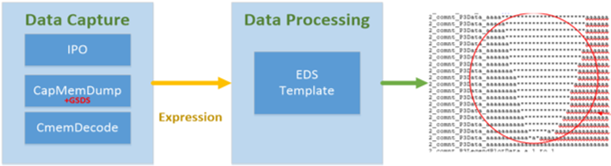
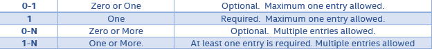
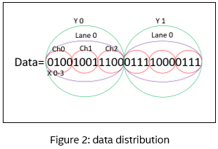
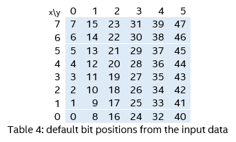
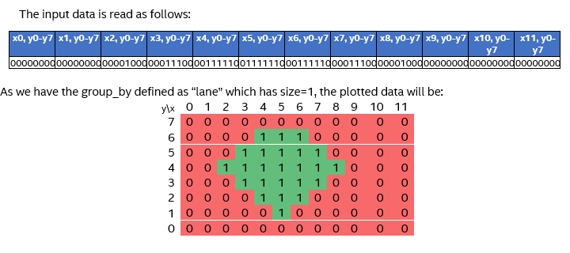
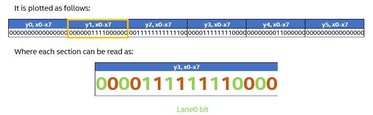
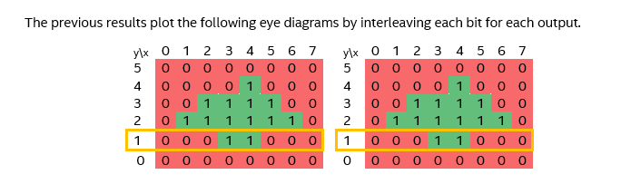
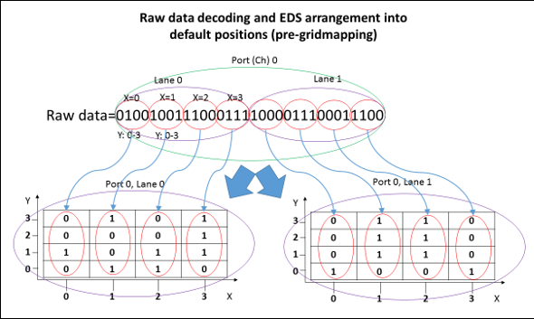

[[_TOC_]]

## REP for AnalogMargining

## Overview

Data collected from a test is referred to as raw data. This data can be used in processing eye diagrams using ACIO loopback (with DFX).

The data is obtained via CTV (capture this vector) and later converted into an Eye Diagram.

An expression will be used as input raw data, but any string of data could be used as such.

## Methodology

### Overview

In order to generate the Diagrams, there will be two items required by the test method:

1- The raw data (which will be provided in an expression input. plist and SharedStorage are supported) 

2- A configurations definition by UserCode or input file.

The test method arranges the captured data and displays it in iTUFF, where the expected Eye Diagrams can be seen: 

 

The last figure shows how the Data capture components are independent of the Data ones. 

The source of the raw data and how this is stored and handled will rely on existing test methods such as IPO for iteration and pattern modification, and CapMemDump or CmemDecode for data storage.

The data distribution comes in multiple forms, such as layers (i.e. ports and lanes) of varying size. This is why the configuration file is controllable enough to support various data distributions. This results in different plots, each with their own outcome.
 
With the resulting data, the code is able to show all the expected Diagrams, as well as values of interest, such as height, width, top, left, bottom, right and center for every diagram. 

In addition, if the data is grouped, the values of interest are displayed for the best and worst groups obtained per grouping layers. 

### Input File Definition Example
```
{
	"configurations": [
	{
	  "configurationName": "name",
	  "description": "description.",
	  "layout": {
		"layoutName": "name",
		"xAxisData": {
		  "axisName": "name",
		  "axisUnits": "units",
		  "axisMultiplier": multiplierForXAxis
		},
		"yAxisData": {
		  "axisName": "name",
		  "axisUnits": "units",
		  "axisMultiplier": multiplierForYAxis
		},
		"layers": [
		  {
			"layerName": "first_layer_name",
			"layerSize": first_layer_size
		  },
		  {
			"layerName": "second_layer_name",
			"layerSize": second_layer_size
		  },
		  {
			"layerName": "third_layer_name",
			"layerSize": third_layer_size
		  }
		],
		"gridMapping": [
		  {
			"beginX": beginX,
			"endX": endX,
			"beginY": beginY,
			"endY": endY
		  },
		  {
			"beginX": beginX,
			"endX": endX,
			"beginY": beginY,
			"endY": endY
		  },
		  {
			"beginX": beginX,
			"endX": endX,
			"beginY": beginY,
			"endY": endY
		  }
		]
	  },
	  "output": {
        "parametersInput": [
          {
            "parameter": "Width",
            "highLimit": high_limit,
            "lowLimit": low_limit
          },
          {
            "parameter": "Center"
          }
        ]
      },
	  "defeature":
	{
		"layerName":     "port",
		"defeatureLogic": "negative",
		"sharedStorage": "DDR_DEFEATURE",
		"sharedStorageMap":
		[
			{
				"dieId": "U1", 
				"bitSequence": [1,0]
			}
		]
	},
	"pinFinder": 
	{
		"layerName": "lane",
		"pinFinderMap": [
			{
				"dieId": "U1",
				"bitSequence": [
					"DDR00_SA_DQ1",
					"DDR00_SA_DQ0",
					"DDR01_SA_DQ0",
					"DDR01_SA_DQ1"
				]
			},
			{
				"dieId": "U2",
				"bitSequence": [
					"DDR00_SB_DQ0",
					"DDR00_SB_DQ1",
					"DDR01_SB_DQ1",
					"DDR01_SB_DQ0"
				]
			}
		]
	},
	"sharedStorage": {
		"parameters": "CenterX,CenterY",
		"tokenPrefix": "DDR_EYEDIAGRAM",
		"base": 2,
		"reverse": true,
		"stringSize": 8
	},
	}
  ]
}
```
### User Code Extension

There are list of extensions that the test method offer to the user:

```

1- Dictionary<string, Configuration> LoadConfigurations() : Defining list of configurations by the user.

2- Dictionary<string, string> GetDataFromInput() : Get ctv data per keyInput list from the user.

3- List<IDatalogFormatBase> GetItuffDataFormat(Dictionary<string, List<string>> ituffData) : provide the user with plot summary for the diagram measurements (Hieght, Width, Top, Center, Bottom, Right, Left) and get list of datalog format list according to the user choice.

```

Follow the example below:

**Example 1:**

	/// <summary>
    /// This class is intended to extended the test method PrimeAnalogMarginingTestMethod.
    /// </summary>
    [PrimeTestMethod]
    public class AnalogMargining : PrimeAnalogMarginingTestMethod, IAnalogMarginingExtensions
    {
        /// <summary>
        /// Defining configurations, which been determines by the user.
        /// </summary>
        /// <returns>List of configurations.</returns>
        Dictionary<string, Configuration> IAnalogMarginingExtensions.LoadConfigurations()
        {
            var configurations = new Dictionary<string, Configuration>()
			{
                {
                    "name",
                    new Configuration()
                    {
                        Name = "name",
                        Description = "description",
                        Layout = new Layout()
                        {
                            Name = "name",
                            XAxisData = new AxisData() { axisName = "name", axisUnits = "units", axisMultiplier = multiplierForXAxis },
                            YAxisData = new AxisData() { axisName = "name", axisUnits = "units", axisMultiplier = multiplierForYAxis },
                            LayersInput = new List<Layer>()
                            {
                                new Layer("first_layer_name", first_layer_size),
                                new Layer("second_layer_name", second_layer_size),
                                new Layer("third_layer_name", third_layer_size),
                                new Layer("fourth_layer_name", fourth_layer_size),
                            },
                            GridDimensionsList = new List<GridDimensions>()
							{
								new GridDimensions(beginX, endX, beginY, endY),
								new GridDimensions(beginX, endX, beginY, endY),
								new GridDimensions(beginX, endX, beginY, endY),
							}
                        },					
                    }
                },
            };
            return configurations;
        }

        /// <summary>
        /// Getting ctvs from the user.
        /// </summary>
        /// <returns>ctvs data list.</returns>
        Dictionary<string, string> IAnalogMarginingExtensions.GetDataFromInput()
        {
            return new Dictionary<string, string>() { { "pinName", "00000000000000000000000000000000000000000000000000000001000000000000000100000000" } };
        }
    }
	

### Parameters



#### Test Method Parameters


| **Parameter Name**            |  **Required?**        | **Description**              | **Type** |
| ------------------            | ------------- | --------------- | ------------------------------------------------------------------------------------------------------ |
| CtvLogicMode                 | No          | POSITIVE: 1 equals pass and 0 equals fail; <br/> NEGATIVE: 0 equals pass and 1 equals failDefault value is POSITIVE | String  |
| PrintPlotsMode                              | No        | ENABLED, DISABLED. Turns on or off the printing of the plots resulting from the “mode” parameter. <br/> Default option is DISABLED  | String  |
| OutputMode                              | No          | ALL, FAIL_ONLY. <br/> Filters the printed iTUFF data. <br/> If kill limits are set, FAIL_ONLY mode prints only the plots that failed limits check | String  |
| Patlist                              | No           | The Plist name  | String  |
| TimingsTc                               | No           | Levels test condition required for plist execution  | TimingCondition |
| LevelsTc                              | No          | 	Timing test condition required for plist execution | LevelsCondition  |
| PrePlist                                   |No         | PrePlist name  | String |
| CtvCapturePins                                 | No         | Comma separated list of pins for which CTV data should be captured    | CommaSeparatedString |
| CtvDataSharedStorageKey                                 | No         | The key to get the ctv data input from shared storage   | String |
| ConfigurationInputFile                                 | No         | The json input file path to get the configuration data    | String |


#### User Codes Parameters


| **Parameter Name**            |  **Cardinality**        | **Description**              | **Type** |
| ------------------            | ------------- | --------------- | ------------------------------------------------------------------------------------------------------ |
| Configurations                 | 1          | Configuration list defined by the user in user code file.     | Dictionary   |
| Configuration                              | 1-N         | The configuration definition to use in the TM  | class  |
| Name                              | 1           | The configuration name | String  |
| Description                              | 1           | The configuration description  | String  |
| AxisData                                   |1         | class defines the xAis data and yAxis data for single configuration which is common for all its layouts                               | class |
| LayersInput                                 | 1         | List of layers        | List |
| Layer                                 | 3 - N         | Define single Layer, which has unique name and if it grouped by or not. <br/> Layer defines once for all the layouts and each layout define new sizes for this layer         | class |
| Layout                             | 1          | class which defines single layout, which contains unique name and layer sizes  | class|
| GridDimensionsList                          |1           | List of dimentions which matches single GridMapping    | List |
| GridDimensions                          | 1-N           | class which defines the grid dimentions to mapping the ctvs    | class |
| Defeature                          | 1           | class which defines the Defeature object from input file   | class |
| Output                          | 1           | Contains list of parameters data to print to ituff   | class |
| PerPinMap                          | 1           | class which defines the PerPinMap object from input file   | class |
| PinFinder                          | 1           | class which defines the PinFinder object from input file   | class |
| SharedStorage                          | 1           | class which defines the SharedStorage object from input file, to indicates which parameters to store to shared storage at the end of execution  | class |

### Typical Usage Models

#### Plotting methodology

The test method supports two ways to map data input to the plotted diagram: with and without custom grids.

The sequence of the layer definitions is important to determine the succession in which the data is plotted into the diagram: 

the order of how the layers are specified in this field must match the order from previously defined in the layout tag.

The following examples show this process in detail for one diagram only. Notice that the layer definition will vary among the examples. 

The sequence in which the data is taken from the input to plot it in the Diagram depends on the order in which the layers are defined in the user code. 

For example, the input data is read as seen in Figure 2 for the input provided in Example 2:

**Example 2:**

	/// <summary>
    /// This class is intended to extended the test method PrimeAnalogMarginingTestMethod.
    /// </summary>
    [PrimeTestMethod]
    public class SingleLayout : PrimeAnalogMarginingTestMethod, IAnalogMarginingExtensions
    {
        /// <summary>
        /// Defining configurations, which been determines by the user.
        /// </summary>
        /// <returns>List of configurations.</returns>
        Dictionary<string, Configuration> IAnalogMarginingExtensions.LoadConfigurations()
        {
            var configurations = new Dictionary<string, Configuration>()
            {
				{
					"config",
					new Configuration()
					{
						Name = "config",
						Description = string.Empty,
						Layout = new Layout()
						{
							Name = "layout1",
							XAxisData = new AxisData() { AxisName = "x" },
                            YAxisData = new AxisData() { AxisName = "y" },
							LayersInput = new List<Layer>()
							{
								new Layer("Y", 2),
                                new Layer("Lane", 2),
                                new Layer("Ch", 3),
                                new Layer("X", 4),
							},
						},
					}					
				},
                
            };
            return configurations;
        }

        /// <summary>
        /// Getting ctvs from the user.
        /// </summary>
        /// <returns>ctvs data list.</returns>
        Dictionary<string, string> IAnalogMarginingExtensions.GetDataFromInput()
        {
			return new Dictionary<string, string>() { { string.Empty, "010010011100011110000111" } };
        }
    }
	



**Example 3:**

The default plotting grid is shown Table 4. The numbers in the grid represent the bit position from the input data and how they’re plotted:



**Example 4:**

**Vertical plotting. 8 ‘y’ bits per each ‘x’ index**


	/// <summary>
    /// This class is intended to extended the test method PrimeAnalogMarginingTestMethod.
    /// </summary>
	[PrimeTestMethod]
    public class VerticalPlotting : PrimeAnalogMarginingTestMethod, IAnalogMarginingExtensions
    {
        /// <summary>
        /// Defining configurations, which been determines by the user.
        /// </summary>
        /// <returns>List of configurations.</returns>
        Dictionary<string, Configuration> IAnalogMarginingExtensions.LoadConfigurations()
        {
            var configurations = new Dictionary<string, Configuration>()
            {
				{
					"Example",
					 new Configuration()
					{
						Name = "Example",
						Description = string.Empty,
						Layout = new Layout()
						{
							name: "layout1",,
							XAxisData = new AxisData() { AxisName = "x" },
							YAxisData = new AxisData() { AxisName = "y" },
							LayersInput = new List<Layer>()
							{
								new Layer("lane", 1),
								new Layer("y", 12),
								new Layer("x", 8),
							},
						},
					}
				},
            };
            return configurations;
        }

        /// <summary>
        /// Getting ctvs from the user.
        /// </summary>
        /// <returns>ctvs data list.</returns>
        Dictionary<string, string> IAnalogMarginingExtensions.GetDataFromInput()
        {
			return new Dictionary<string, string>() { { string.Empty, "000000000000000000001000000111000011111001111110001111100001110000001000000000000000000000000000" } };
        }
    }
	
	
Example 4 configuration requires input data to have 1*12*8 = 96 bits.



**Example 5:**

Horizontal plotting not using ‘x’ and ‘y’ as inner layers.

	/// <summary>
    /// This class is intended to extended the test method PrimeAnalogMarginingTestMethod.
    /// </summary>
    [PrimeTestMethod]
    public class SingleLayout : PrimeAnalogMarginingTestMethod, IAnalogMarginingExtensions
    {
        /// <summary>
        /// Defining configurations, which been determines by the user.
        /// </summary>
        /// <returns>List of configurations.</returns>
        Dictionary<string, Configuration> IAnalogMarginingExtensions.LoadConfigurations()
        {
            var configurations = new Dictionary<string, Configuration>()
            {
				{
					"config",
				    new Configuration()
					{
						Name = "config",
						Description = string.Empty,
						Layout = new Layout()
						{
							Name = "layout1",
							XAxisData = new AxisData() { AxisName = "x" },
							YAxisData = new AxisData() { AxisName = "y" },
							LayersInput = new List<Layer>()
							{
                                new Layer("y", 6),
                                new Layer("x", 8),
								new Layer("lane", 2),
							},
						},
					}
				},
            };
            return configurations;
        }

        /// <summary>
        /// Getting ctvs from the user.
        /// </summary>
        /// <returns>ctvs data list.</returns>
        Dictionary<string, string> IAnalogMarginingExtensions.GetDataFromInput()
        {
			return new Dictionary<string, string>() { { string.Empty, "000000000000000000000011110000000011111111111100000011111111000000000000110000000000000000000000" } };
        }
    }







**Example 7:**

Example with custom grid.

Once the raw data order of the incoming data is decoded and distributed, the next step will be to arrange the graphs according to their expected distribution or data flow. 

If the incoming data has a different order, then gridmapping rearranges the incoming plots (EDS plots) into a new order, defined by grids. These grids require a beginning and ending position on ‘x’ and ‘y’, which in turn establish filling order. 

The data will be dumped on the first grid. Once it is filled, will move to the next one. 


	/// <summary>
    /// This class is intended to extended the test method PrimeAnalogMarginingTestMethod.
    /// </summary>
    [PrimeTestMethod]
    public class SingleLayout : PrimeAnalogMarginingTestMethod, IAnalogMarginingExtensions
    {
        /// <summary>
        /// Defining configurations, which been determines by the user.
        /// </summary>
        /// <returns>List of configurations.</returns>
        Dictionary<string, Configuration> IAnalogMarginingExtensions.LoadConfigurations()
        {
            var configurations = new Dictionary<string, Configuration>()
            {
				{
					"config",
					new Configuration()
					{
						Name = "config",
						Description = string.Empty,
						Layout = new Layout()
						{
							Name = "layout1",
							XAxisData = new AxisData() { AxisName = "x" },
							YAxisData = new AxisData() { AxisName = "y" },
							LayersInput = new List<Layer>()
							{
								new Layer("port", 1),
								new Layer("lane", 2),
								new Layer("y", 4),
								new Layer("x", 4),
							},
							GridDimensionsList = new List<GridDimensions>()
							{
								new GridDimensions(0, 1, 0, 1),
								new GridDimensions(1, 0, 3, 2),
								new GridDimensions(2, 2, 0, 3),
								new GridDimensions(3, 3, 3, 0),
							},
						},
					}	
				},
            };
            return configurations;
        }

        /// <summary>
        /// Getting ctvs from the user.
        /// </summary>
        /// <returns>ctvs data list.</returns>
        Dictionary<string, string> IAnalogMarginingExtensions.GetDataFromInput()
        {
			return new Dictionary<string, string>() { { string.Empty, "01001001110001111000011100011100" } };
        }
    }
	
	


The gridmapping must take all elements of the raw data into account once. This means that each space cannot hold more than one bit.


### The test method parameter "Mode" for printing output:

The print mode is specified by the test instance parameter “Mode”. It defines which plots will be printed to iTUFF.

Possible values:

ALL: prints all plots processed from input data expression.

FAIL_ONLY: If kill limits are set in the .xml configuration file, the test instance prints only the plots that failed limits check.

Default value is FAIL_ONLY.

####Example:

Let the following instances have different mode parameter only:

	Test TestWith2Layouts AnalogMargining_TestWith2Layouts_ModeALL_P1
	{
		Patlist = "analogMargining_list";
		LevelsTc = "AnalogMargining::basic_func_lvl_nom";
		TimingsTc = "AnalogMargining::basic_func_timing_10MHz_20MHz";
		CtvCapturePins = "xxHPCC_DPIN_Dig_slcA_AA0";
		CtvLogic = "POSITIVE";
		PrintPlots = "ENABLED";
		Mode = "ALL";
		ConfigurationInputFile = "";
	}

	Test TestWith2Layouts AnalogMargining_TestWith2Layouts_ModeAll_P1
	{
		Patlist = "analogMargining_list";
		LevelsTc = "AnalogMargining::basic_func_lvl_nom";
		TimingsTc = "AnalogMargining::basic_func_timing_10MHz_20MHz";
		CtvCapturePins = "xxHPCC_DPIN_Dig_slcA_AA0";
		CtvLogic = "POSITIVE";
		PrintPlots = "ENABLED";
		Mode = "ALL";
		ConfigurationInputFile = "";
	}

	Test TestWith2Layouts AnalogMargining_TestWith2Layouts_ModeFailOnly_P1
	{
		Patlist = "analogMargining_list";
		LevelsTc = "AnalogMargining::basic_func_lvl_nom";
		TimingsTc = "AnalogMargining::basic_func_timing_10MHz_20MHz";
		CtvCapturePins = "xxHPCC_DPIN_Dig_slcA_AA0";
		CtvLogic = "POSITIVE";
		PrintPlots = "ENABLED";
		Mode = "FAIL_ONLY";
		ConfigurationInputFile = "";
	}

	
In this case, we’ll assume that the limits setup are:

width  low="0" high="5"

height low="0" high="4"

The iTUFF printing for the AnalogMarginingTest_ModeAll instance will be:

	2_tname_AnalogMarginingTest_ModeAll_grp_y5x6_width
	2_strgval_1|4
	2_tname_AnalogMarginingTest_ModeAll_grp_y5x6_x_center
	2_strgval_1|2
	2_tname_AnalogMarginingTest_ModeAll_grp_y5x6_height
	2_strgval_1|4
	2_tname_AnalogMarginingTest_ModeAll_grp_y5x6_y_center
	2_strgval_1|2

However the iTUFF printing for the AnalogMarginingTest_ModeFailOnly instance will be empty, as the width and height values did not exceed the limits (see the highlighted values in the iTUFF for AnalogMarginingTest_ModeAll instance).

Now, if we change the limits to:

width  low="0" high="1"

height low="0" high="4"

The AnalogMarginingTest_ModeFailOnly instance will print:

	2_tname_AnalogMarginingTest_ModeAll_grp_y5x6_width
	2_strgval_1|4
	2_tname_AnalogMarginingTest_ModeAll_grp_y5x6_x_center
	2_strgval_1|2


However the iTUFF printing for the AnalogMarginingTest_ModeFailOnly instance will be empty, as the width and height values did not exceed the limits.

Now, if we change the limits to:

width  low="0" high="1"

height low="0" high="4"

The AnalogMarginingTest_ModeFailOnly instance will print:

	2_tname_AnalogMarginingTest_ModeAll_grp_y5x6_width
	2_strgval_1|4
	2_tname_AnalogMarginingTest_ModeAll_grp_y5x6_x_center
	2_strgval_1|2

Note that the height value is not shown. The valid range for height value was [0,4] and the measured height was 4 (the value is within the limits) so it is not printed when the print_mode is FAIL_ONLY.

### The test method parameter "CtvLogic":

The input data is binary and thus does not contain ‘*’ or ‘a’ characters.

The test class parameter CtvLogic defines how the input data is transformed to ‘*’ or ‘a’ characters.

Depending on the CtvLogic value, the binary values will be transformed differently:

CtvLogic = POSITIVE:

	binary 1 from input data is transformed to ‘*’
	
	binary 0 from input data is transformed to ‘a’
	
CtvLogic = NEGATIVE:

	binary 1 from input data is transformed to ‘a’
	
	binary 0 from input data is transformed to ‘*’

####Example:

The following test instances AnalogMarginingTest1 and AnalogMarginingTest2 will provide the same plotting results as the CtvLogic parameter is changed:

AnalogMarginingTest1:

	Test AnalogMarginingTest1 AnalogMarginingTest1_P1
	{
		Patlist = "analogMargining_list";
		LevelsTc = "AnalogMargining::basic_func_lvl_nom";
		TimingsTc = "AnalogMargining::basic_func_timing_10MHz_20MHz";
		CtvCapturePins = "xxHPCC_DPIN_Dig_slcA_AA0";
		CtvLogic = "POSITIVE";
		...
	}
	
	/// <summary>
	/// Getting ctvs from the user.
	/// </summary>
	/// <returns>ctvs data list.</returns>
	Dictionary<string, string> IAnalogMarginingExtensions.GetDataFromInput()
	{
		return new Dictionary<string, string>() { { string.Empty, "100100" } };
	}
		
AnalogMarginingTest2:
		
	Test AnalogMarginingTest2 AnalogMarginingTest2_P1
	{
		Patlist = "analogMargining_list";
		LevelsTc = "AnalogMargining::basic_func_lvl_nom";
		TimingsTc = "AnalogMargining::basic_func_timing_10MHz_20MHz";
		CtvCapturePins = "xxHPCC_DPIN_Dig_slcA_AA0";
		CtvLogic = "NEGATIVE";
		...
	}
	
	/// <summary>
	/// Getting ctvs from the user.
	/// </summary>
	/// <returns>ctvs data list.</returns>
	Dictionary<string, string> IAnalogMarginingExtensions.GetDataFromInput()
	{
		return new Dictionary<string, string>() { { string.Empty, "011011" } };
	}


AnalogMarginingTest1 reads 100100 as \*aa\*aa, with CtvLogic = POSITIVE.

AnalogMarginingTest2 reads 011011 as \*aa\*aa, with CtvLogic = NEGATIVE.

###Summary data description:

This mode shows all data (passing and failures) on ituff, including width, height, x center and y center. 

The syntax in ituff is shown below:

	2_tname_<TestInstance>_<Config>_width
	2_strgval_<NoF>|<width>

	2_tname_<TestInstance>_<Config>_x_center
	2_strgval_<NoF>|<xCenter>

	2_tname_<TestInstance>_<Config>_height
	2_strgval_<NoF>|<height>

	2_tname_<TestInstance>_<Config>_y_center
	2_strgval_<NoF>|<yCenter>


Where:

•	<TestInstance>: test instance name.

•	<Config>: configuration used.

•	<NoF>: Number of failures.

•	<Lane>: second level of layers.

•	<Port>: first level of layers.

•	<width>: diagram’s width.

•	<xCenter>: diagram’s center on the X axis.

•	<height>: diagram’s height.

•	<yCenter>: diagram’s center on the Y axis.

####For example:

	2_tname_ANALOGMARGINING_EXECUTE_ModeAll_PlotsEnabled_POSITIVE_SinglePlot_5x5y_P1_SinglePlot_5x5y_width
	2_strgval_1|4
	2_tname_ANALOGMARGINING_EXECUTE_ModeAll_PlotsEnabled_POSITIVE_SinglePlot_5x5y_P1_SinglePlot_5x5y_x_center
	2_strgval_1|2
	2_tname_ANALOGMARGINING_EXECUTE_ModeAll_PlotsEnabled_POSITIVE_SinglePlot_5x5y_P1_SinglePlot_5x5y_height
	2_strgval_1|5
	2_tname_ANALOGMARGINING_EXECUTE_ModeAll_PlotsEnabled_POSITIVE_SinglePlot_5x5y_P1_SinglePlot_5x5y_y_center
	2_strgval_1||2


### The test method parameter "PrintPlots":

The PrintPlots parameter specifies if the plots will be written to iTUFF or only the summary data that was explained in previous section “Summary data description”.

Possible values:

Enabled: the test class will print the summary data of the plots and the plot data. Example:

	2_tname_ANALOGMARGINING_EXECUTE_ModeAll_PlotsEnabled_NEGATIVE_SinglePlot_4x5y_P1_SinglePlot_4x5y_width
	2_strgval_1|2
	2_tname_ANALOGMARGINING_EXECUTE_ModeAll_PlotsEnabled_NEGATIVE_SinglePlot_4x5y_P1_SinglePlot_4x5y_x_center
	2_strgval_1|1
	2_tname_ANALOGMARGINING_EXECUTE_ModeAll_PlotsEnabled_NEGATIVE_SinglePlot_4x5y_P1_SinglePlot_4x5y_height
	2_strgval_1|3
	2_tname_ANALOGMARGINING_EXECUTE_ModeAll_PlotsEnabled_NEGATIVE_SinglePlot_4x5y_P1_SinglePlot_4x5y_y_center
	2_strgval_1|2
	2_comnt_Plot3Start_ANALOGMARGINING_EXECUTE_ModeAll_PlotsEnabled_NEGATIVE_SinglePlot_4x5y_P1_SinglePlot_4x5y_layout1_port0_lane[0]
	2_comnt_PLOT_PXName,x
	2_comnt_PLOT_PYName,y
	2_comnt_PLOT_PXStart,0
	2_comnt_PLOT_PYStart,0
	2_comnt_PLOT_PXStop,3
	2_comnt_PLOT_PYStop,4
	2_comnt_PLOT_PXStep,4
	2_comnt_PLOT_PYStep,5
	2_comnt_P3Data_aa*a
	2_comnt_P3Data_a*aa
	2_comnt_P3Data_a**a
	2_comnt_P3Data_a*aa
	2_comnt_P3Data_aaaa
	2_comnt_Plot3End_ANALOGMARGINING_EXECUTE_ModeAll_PlotsEnabled_NEGATIVE_SinglePlot_4x5y_P1_SinglePlot_4x5y _port0_lane[0]


Disabled: the test class will print the summary data of a plot only. Example:

	2_tname_ANALOGMARGINING_EXECUTE_ModeAll_PlotsDisabled_NEGATIVE_SinglePlot_4x5y_P1_SinglePlot_4x5y_width
	2_strgval_1|2
	2_tname_ANALOGMARGINING_EXECUTE_ModeAll_PlotsDisabled_NEGATIVE_SinglePlot_4x5y_P1_SinglePlot_4x5y_x_center
	2_strgval_1|1
	2_tname_ANALOGMARGINING_EXECUTE_ModeAll_PlotsDisabled_NEGATIVE_SinglePlot_4x5y_P1_SinglePlot_4x5y_height
	2_strgval_1|3
	2_tname_ANALOGMARGINING_EXECUTE_ModeAll_PlotsDisabled_NEGATIVE_SinglePlot_4x5y_P1_SinglePlot_4x5y_y_center
	2_strgval_1|2


### The user code parameter "Output": 

Attribute in the config list to choose which options will be printed to ituff (center, width, height, ..) if the parameter has limits so we will print the limits as well.

Name = "Example",  Output = "width,height,center" (without limits)
	
	2_tname_ANALOGMARGINING_EXECUTE_ModeAll_PlotsEnabled_NEGATIVE_SinglePlot_4x5y_P1_SinglePlot_4x5y_width
	2_strgval_1|2
	2_tname_ANALOGMARGINING_EXECUTE_ModeAll_PlotsEnabled_NEGATIVE_SinglePlot_4x5y_P1_SinglePlot_4x5y_x_center
	2_strgval_1|1
	2_tname_ANALOGMARGINING_EXECUTE_ModeAll_PlotsEnabled_NEGATIVE_SinglePlot_4x5y_P1_SinglePlot_4x5y_height
	2_strgval_1|3
	2_tname_ANALOGMARGINING_EXECUTE_ModeAll_PlotsEnabled_NEGATIVE_SinglePlot_4x5y_P1_SinglePlot_4x5y_y_center
	2_strgval_1|2
	2_comnt_Plot3Start_ANALOGMARGINING_EXECUTE_ModeAll_PlotsEnabled_NEGATIVE_SinglePlot_4x5y_P1_SinglePlot_4x5y_layout1_port0_lane[0]
	2_comnt_PLOT_PXName,x
	2_comnt_PLOT_PYName,y
	2_comnt_PLOT_PXStart,0
	2_comnt_PLOT_PYStart,0
	2_comnt_PLOT_PXStop,3
	2_comnt_PLOT_PYStop,4
	2_comnt_PLOT_PXStep,4
	2_comnt_PLOT_PYStep,5
	2_comnt_P3Data_aa*a
	2_comnt_P3Data_a*aa
	2_comnt_P3Data_a**a
	2_comnt_P3Data_a*aa
	2_comnt_P3Data_aaaa
	2_comnt_Plot3End_ANALOGMARGINING_EXECUTE_ModeAll_PlotsEnabled_NEGATIVE_SinglePlot_4x5y_P1_SinglePlot_4x5y _port0_lane[0]

Name = "Example",  Output = "width,center"

	2_tname_ANALOGMARGINING_EXECUTE_ModeAll_PlotsEnabled_NEGATIVE_SinglePlot_4x5y_P1_SinglePlot_4x5y_width
	2_strgval_1|2
	2_tname_ANALOGMARGINING_EXECUTE_ModeAll_PlotsEnabled_NEGATIVE_SinglePlot_4x5y_P1_SinglePlot_4x5y_x_center
	2_strgval_1|1
	2_tname_ANALOGMARGINING_EXECUTE_ModeAll_PlotsEnabled_NEGATIVE_SinglePlot_4x5y_P1_SinglePlot_4x5y_y_center
	2_strgval_1|2
	2_comnt_Plot3Start_ANALOGMARGINING_EXECUTE_ModeAll_PlotsEnabled_NEGATIVE_SinglePlot_4x5y_P1_SinglePlot_4x5y_layout1_port0_lane[0]
	2_comnt_PLOT_PXName,x
	2_comnt_PLOT_PYName,y
	2_comnt_PLOT_PXStart,0
	2_comnt_PLOT_PYStart,0
	2_comnt_PLOT_PXStop,3
	2_comnt_PLOT_PYStop,4
	2_comnt_PLOT_PXStep,4
	2_comnt_PLOT_PYStep,5
	2_comnt_P3Data_aa*a
	2_comnt_P3Data_a*aa
	2_comnt_P3Data_a**a
	2_comnt_P3Data_a*aa
	2_comnt_P3Data_aaaa
	2_comnt_Plot3End_ANALOGMARGINING_EXECUTE_ModeAll_PlotsEnabled_NEGATIVE_SinglePlot_4x5y_P1_SinglePlot_4x5y _port0_lane[0]

Name = "Example",  Output = "width"

	2_tname_ANALOGMARGINING_EXECUTE_ModeAll_PlotsEnabled_NEGATIVE_SinglePlot_4x5y_P1_SinglePlot_4x5y_x_center
	2_strgval_1|1
	2_tname_ANALOGMARGINING_EXECUTE_ModeAll_PlotsEnabled_NEGATIVE_SinglePlot_4x5y_P1_SinglePlot_4x5y_height
	2_strgval_1|3
	2_tname_ANALOGMARGINING_EXECUTE_ModeAll_PlotsEnabled_NEGATIVE_SinglePlot_4x5y_P1_SinglePlot_4x5y_y_center
	2_strgval_1|2
	2_comnt_Plot3Start_ANALOGMARGINING_EXECUTE_ModeAll_PlotsEnabled_NEGATIVE_SinglePlot_4x5y_P1_SinglePlot_4x5y_layout1_port0_lane[0]
	2_comnt_PLOT_PXName,x
	2_comnt_PLOT_PYName,y
	2_comnt_PLOT_PXStart,0
	2_comnt_PLOT_PYStart,0
	2_comnt_PLOT_PXStop,3
	2_comnt_PLOT_PYStop,4
	2_comnt_PLOT_PXStep,4
	2_comnt_PLOT_PYStep,5
	2_comnt_P3Data_aa*a
	2_comnt_P3Data_a*aa
	2_comnt_P3Data_a**a
	2_comnt_P3Data_a*aa
	2_comnt_P3Data_aaaa
	2_comnt_Plot3End_ANALOGMARGINING_EXECUTE_ModeAll_PlotsEnabled_NEGATIVE_SinglePlot_4x5y_P1_SinglePlot_4x5y _port0_lane[0]


## Version tracking

| **Date**                  | **Version** | **Author**        | **Comments**    |
| ------------------------- | ----------- | ----------------- | --------------- |
| aug 18<sup>th</sup>, 2022 | 1.0.0       | Awaisy, Gadeer    | Initial version |
| july 2<sup>nd</sup>, 2023 | 1.0.0       | Awaisy, Gadeer    | Adding support for input fie data |
| march 4<sup>th</sup>, 2024 | 1.0.0       | Awaisy, Gadeer    | Renaming the test method and remove ALL_COMPPRESSED  mode |
| jan 26<sup>th</sup>, 2025 | 1.0.0       | Awaisy, Gadeer    | Merging Limits and Ituff section in input file |