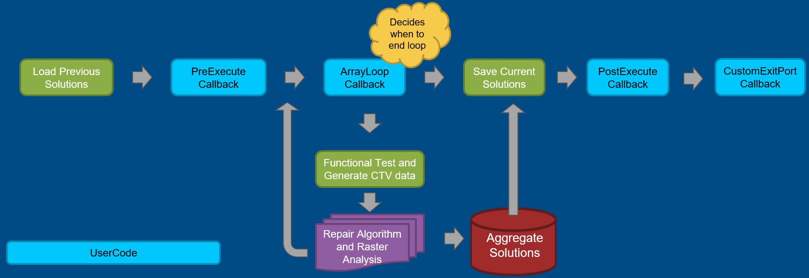
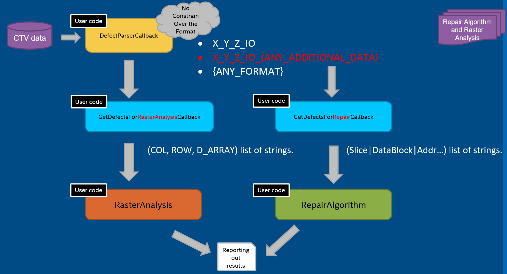

[[_TOC_]]

## REP for ArrayRepair

This **REP** is intended to describe the ArrayRepair Prime TestMethod.

In this document, you will find the below sections:

  - **Methodology** – A detailed description of this TestMethod intention and purpose

  - **Parameters** – A table describes each instance parameter (Name, Type, Default, Required?)

  - **Console output** – A detailed description of what is printed to console by this TestMethod

  - **Custom User Code hooks** – A list of functions available to the user code to override

  - **TPL Samples** – Examples of how to use this TestMethod in a TPL file

  - **Exit Ports** - A table describes each exit port

  - **Additional Dependencies** – More to consider for this TestMethod to operate

  - **Version tracking** – With author names, so you always have a name to address

  - **Acronyms** - Definition of acronyms used in this document
## Methodology

The ArrayRepair test method provides the structure to execute customized array repair. As you can see from the below picture.
The user will be able to adjust the loops (i.e. which data block to run),
set custom exit port, even the algorithm to repair the defects by implementing the usercode. 
These callbacks are embedded in the test method. 
The detailed explanation will be provided in **Custom User Code Hooks**



The repair algorithm and raster analysis (purple block in above picture) are also composed of different usercode blocks. 
These usercode callbacks should be implemented according to product specs as the way to treat defects by parsing CTV may be different.
The overall structure for repair and raster analysis are shown below. 
Note that if users failed to provide the repair algorithm, there will still be generic algorithm provided as default.



### Verify

  - Validate Mask Pins

  - Validate Ctv Pins
  
  - Validate Resource Json file
  
  - Validate RasterConfig Json file

  - Create Handler for Functional Test to be run at Execute 
    - This will validate the Patlist, TimingsTc, LevelsTc.
  
  - Run VerifyCallback function

### Execute

  - Reset Resources Status 
    - The resources may already been used from previous sockets, so it will read from SharedStorage key ARRAY_FUSING_USED_RESOURCES. The key was populated by ArrayFusing TestMethod. 

  - Run PreExecuteCallback function
  
  - Apply test conditions and execute functional test to get CTV or Failure data

  - Run DefectParserCallback function to return defects in user desired format
  
  - Run GetDefectsForRasterAnalysisCallback to convert to raster analysis input format
  
  - Run RasterAnalysisCallback
  
  - Run GetDefectsForRepairCallback to convert to repair algorithm input format
  
  - Run RepairCallback
 
  - Write Solution to SharedStorage and Print to Console/Datalog.
    - The SharedStorage Key to save the solution is ARRAY_REPAIR_SOLUTION.
  
  - Run PostExecuteCallback function.


## Test Instance Parameters

The table below lists and describes the test instance parameters supported by the ArrayRepair test method

| **Parameter Name**    | **Required?** | **Type**        | **Values**                                                                   | **Comments*                        |
| --------------------- | ------------- | --------------- | -----------------------------------------------------------------------------| ---------------------------------- |
| Patlist               | Yes           | Plist           | Plist name to be executed                                                    |                                    |
| TimingsTc             | Yes           | TimingCondition | Levels test condition required for plist execution                           |                                    |
| LevelsTc              | Yes           | LevelsCondition | Timing test condition required for plist execution                           |                                    |
| PrePlist              | No            | String          | PrePlist name to be executed                                                 |                                    |
| MaskPins              | No            | String          | Comma separated list of pins for which the fail data capture will be skipped |                                    |
| CtvPinNames           | Yes           | String          | Comma separated list of pins for which CTV data should be captured           |                                    |
| ArrayName             | Yes           | String          | Array name to run repair                                                     |The array name in resource json file|
| ResourcesFile         | Yes           | File            | Resource Json file path                                                      |                                    |
| RasterConfigFile      | No            | File            | Raster Config Json file path                                                 |                                    |
| TotalFailCaptureCount | No            | UnsignedInteger | Number of failures to capture in Plist execution                             |Default value is 1                  |

**Notes:**
- The Resources and RasterConfig JSON file parsing is done during the template Verify.

- Resources File Example:
```
{
    "Arrays": [
        {
            "Name": "MLC",
            "Resources": [
                {
                    "Id": 1,
                    "Name": "S1|HS1|Q1|Row1",
                    "Type": "Column",
                    "RepairPath": "Slice01|HalfSlice01|Q1"
                },
                {
                    "Id": 2,
                    "Name": "S1|HS1|Q2|Col1",
                    "Type": "Row",
                    "RepairPath": "Slice01|HalfSlice01|Q2"
                },
                {
                    "Id": 3,
                    "Name": "S1|HS1|Row1",
                    "Type": "Row",
                    "RepairPath": "Slice01|HalfSlice01"
                },
                {
                    "Id": 4,
                    "Name": "S1|HS2|Q1|Col1",
                    "Type": "Column",
                    "RepairPath": "Slice01|HalfSlice02|Q1"
                },
                {
                    "Id": 5,
                    "Name": "S1|HS2|Row1",
                    "Type": "Row",
                    "RepairPath": "Slice01|HalfSlice02"
                },
                {
                    "Id": 6,
                    "Name": "S1|Col1",
                    "Type": "Column",
                    "RepairPath": "Slice01"
                }
            ]
        }
    ]
}
```

- Raster Config File Example:
```
{
"Arrays":[
    {
        "Name": "MLC",
        "Rows": 24,
        "Cols": 20,
        "RasterReduceParams":
            {
                "RowDec": 24,
                "ColDec":20,
                "RowPF":3,
                "ColPF":3,
                "MAF": 1024,
                "MAS":0,
                "BitDensity": 0.33
            }
    }
]
}
```

## Console output (debug mode)

Console window will show the step-by-step repair.

The first pictures show first step to use Resource Id = [1] to solve defect with value [2].


Then it continues the flow until all the resources have been used or defects been all repaired.


The final results are printed.

## Custom User Code Hooks

ArrayRepair test method supports the following extensions:

| **Callback Names**                      | **Inputs**           | **Output**                                  | **Description**                      |
| --------------------------------------- | -------------------- | ------------------------------------------- | ------------------------------------ |
| **VerifyCallback**                      | None                 | None                                        | run at the end of verify             |
| **PreExecuteCallback**                  | None                 | None                                        | run at the beginning of execute      |
| **ArrayLoopCallback**                   | None                 | True - continue loop, False - exit loop     | determine when to stop loops         |
| **SkipLoopCallback**                    | None                 | True - skip one iteration, False - continue | determine when skip one iteration    |
| **GetDynamicPinMask**                   | None                 | List of mask pins.                          | return mask pins                     |
| **DefectParserCallback**                | CTV or Failure Data  | Logical Defects                             | default return empty list(defects)   | 
| **GetDefectsForRasterAnalysisCallback** | Logical Defects      | Raster form Defects                         | default return empty list(defects)   |
| **GetDefectsForRepairCallback**         | Logical Defects      | Repair form Defects                         | default return input list(defects)   |
| **RasterAnalysisCallback**              | Raster form Defects  | string to print to R-file                   | default to call raster analysis nuget|
| **RepairCallback**                      | Repair form Defects  | repair solutions                            | default to run array redundancy      | 
| **PostExecuteCallback**                 | Repair solutions     | None                                        | run at then end of execute           |
| **CustomExitPort**                      | None                 | User Reserved Port.                         | only 2 to 10 is allowed              | 

The callback execute orders are shown on the **Methodology** part.

For detail explanation of the default repair algorithm (array redundancy), please click the [download link](./.attachments/ArrayRepair/ArrayRepair/DefaultRepairAlgorithm.pptx).

-Example user codes:

With the following demo code, we see that users can control the loops to run first two and last times.
In total this loop runs 32 times but skip 29 times in the middle.
```python
/// <inheritdoc/>
void IArrayRepairExtensions.PreExecuteCallback()
{
    this.dBSelect = 0;
    this.dBEnableString = "11000000000000000000000000000001"; // 1 means keep, 0 means skip.
    Prime.Services.ConsoleService.PrintDebug($"[UserCode] [PreExecuteCallback] DBEnableString is initialized to {this.dBEnableString} before ArrayRepair Execute().");
}

/// <inheritdoc/>
bool IArrayRepairExtensions.ArrayLoopCallback()
{    
    while (this.IsDbSkipped())
    {
        this.dBSelect++;
        if (this.dBSelect == this.dBEnableString.Length)
        {
            return false;
        }
    }
    
    this.PatmodToDBselect();
    this.dBSelect++;
    return true;
    
}

private bool IsDbSkipped()
{
    Prime.Services.ConsoleService.PrintDebug($"[UserCode] DBSelect is {this.dBSelect}.");

    if (this.dBSelect < this.dBEnableString.Length && this.dBEnableString[this.dBSelect] == '1')
    {
        Prime.Services.ConsoleService.PrintDebug(
            $"[UserCode] [SkipLoopCallback] DBEnableString is {this.dBEnableString} and the {this.dBSelect}th bit is 1. We keep this iteration");
        return false;
    }

    Prime.Services.ConsoleService.PrintDebug(
        $"[UserCode] [SkipLoopCallback] DBEnableString is {this.dBEnableString} and the {this.dBSelect}th bit is not 1 or out of bound. We skip this iteration");
    return true;
}
```
## TPL Samples

Here is a test instance example using the ArrayRepair test method

```python
Import PrimeArrayRepairTestMethod.xml;

Test PrimeArrayRepairTestMethod ArrayRepair_NotRepairableTest_P1
{
   Patlist = "ArrayRepair_plist";
   TimingsTc = "ArrayRepair::basic_arrayrepair_timing_10MHz_20MHz";
   LevelsTc = "ArrayRepair::SampleArrayRepairTestMethodTC";
   CtvPinNames = "xxHPCC_DPIN_Dig_slcA_A0";
   ResourcesFile = "~HDMT_TPL_DIR/Modules/ArrayRepair/ArrayRepair/InputFiles/test.ArrayRepair.json";
   RasterConfigFile = "~HDMT_TPL_DIR/Modules/ArrayRepair/ArrayRepair/InputFiles/test.RasterConfig.json";
   ArrayName = "MLC";
   LogLevel = "PRIME_DEBUG";
}
```


## Exit Ports

The test method supports the following exit ports:


| **Exit Port** | **Condition** | **Description**                              |
| ------------- | ------------- | -------------------------------------------- |
| **-2**        | ***Alarm***   | Any alarm condition                          |
| **-1**        | ***Error***   | Any software condition error                 |
| **0**         | ***Fail***    | Failing condition.                           |
| **1**         | ***Pass***    | Passing condition                            |
| **2 to 10**   | ***Fail***    | User Reserved Port.                          |

## Acronyms

Definition of acronyms used in this document:

  - **REP**: P**r**ime T**e**st-Method S**p**ecification
  - **TPL**: Test Programming Language


## Version tracking

| **Date**                  | **Version** | **Author**           | **Comments**                           |
| ------------------------- | ----------- | -------------------- | -------------------------------------- |
| Feb 03<sup>rd</sup>, 2022 | 1.0.0       | Chun-Yu (Joseph) Yang| Initial version                        |
| Aug 21<sup>th</sup>, 2022 | 1.0.1       | Brian Morera         | Adding TotalFailCaptureCount parameter |