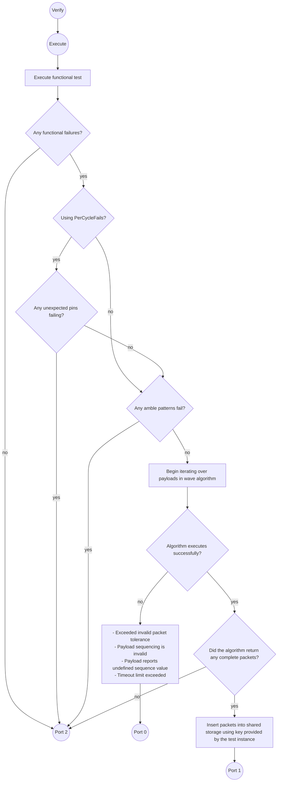

# PrimeCapturePacketsTestMethod test instance Guide
[_TOC_]

This doc is intended to help you get started with using the **PrimeCapturePacketsTestMethod**, or otherwise known as ***CapturePackets***.

# Terms used:
- **Payload**: Some binary data collected from the unit. A subset of a packet. Multiple payloads are required to form a single packet. Payloads are generated from functional test execution's functional data (CTV, or PerCycleFails, legacy terms are DMEM/DFM respectively) data.
- **Packet**:  Some binary data collected from the unit. A collection of payloads. Contains information about status of unit's arrays. Utilized by other array test methods. 
- **Wave algorithm**: Algorithm used to combine payloads into a packet.
- **Per cycle fails**: Pattern failures reported by the tester. The tester reports a failure on a "per cycle" basis, describing which pins failed to match the strobe on the cycle.
- **CTV**: Capture This Vector. An instruction placed on content that tells the tester to record the logical signal on the pins indicated by the test instance.
- **DFM**: Data fail memory. Legacy term used to describe "per cycle fails".
- **DMEM**: Unsure what this stands for... "data memory"?. Legacy term used to describe "CTV" data.
- **BIST**: Built-in Self Test. Logic circuit within a unit that performs validation on other parts of the unit's circuits. 
- **CABIST**: Combined Architecture Built-In Self Test. Intel's array-test solution.
- **STF**: Structural Test Fabric. DFT (design for test) architecture used in Intel products.
- **SharedStorage**: PRIME's solution for sharing data between test instances. Works as a look-up dictionary, where keys point to values.\

# Use Cases

Used for the collection of STF packets generated by a unit's CABIST engines. 

***CapturePackets*** executes a functional test, then uses data collected from the test to generate payloads from each cycle for packet generation. The payloads collected from the functional test are processed into packets using the "wave" algorithm.

The test method can collect payloads by reading PerCycleFails (legacy term is DFM) or CTV data (legacy term is DMEM).

# Parameters

| **Name**               | **Required?**                                                               | **Type**                | **Description**                                                                                                                                                                                                                                                                                                      |
|------------------------|-----------------------------------------------------------------------------|-------------------------|----------------------------------------------------------------------------------------------------------------------------------------------------------------------------------------------------------------------------------------------------------------------------------------------------------------------|
| LevelsTC               | Yes                                                                         | String                  | Levels condition to apply for the functional test                                                                                                                                                                                                                                                                    |
| TimingsTC              | Yes                                                                         | String                  | Timings condition to apply for the functional test                                                                                                                                                                                                                                                                   |
| PatList                | Yes                                                                         | String                  | Plist to execute for the functional test                                                                                                                                                                                                                                                                             |
| PrePlist               | No                                                                          | String                  | Plist to execute before executing PatList                                                                                                                                                                                                                                                                            |
| MaskPins               | No                                                                          | String                  | Pins to mask for functional test execution.                                                                                                                                                                                                                                                                          |
| TotalCaptureCount      | No (default = 1000000)                                                      | Int                     | Maximum number of fails allowed to be captured by the functional test.                                                                                                                                                                                                                                               |
| ApplyEndSequence       | No (default = disabled)                                                     | String                  | To apply the end sequence after functional test execution.                                                                                                                                                                                                                                                           |
| KeyForSharedStorage    | Yes                                                                         | String                  | Key to use to insert the concatenated packet data into SharedStorage.                                                                                                                                                                                                                                                |
| FunctionalDataToUse    | Yes                                                                         | String                  | "CTV", "PerCycleFails". The type of data to use when capturing data on your designated pins. Legacy terms for these are "DMEM" and "DFM" data respectively.                                                                                                                                                          |
| Sequence               | Yes                                                                         | CommaSeperatedIntString | The expected sequence for incoming payloads.                                                                                                                                                                                                                                                                         |
| DataPins               | Yes                                                                         | CommaSeperatedString    | Names of pins whose values are used to construct packet data.                                                                                                                                                                                                                                                        |
| IdPins                 | Yes                                                                         | CommaSeperatedString    | Names of pins whose values are used to determine the id value of the incoming packet                                                                                                                                                                                                                                 |
| ValidPins              | Yes                                                                         | CommaSeperatedString    | Names of pins whose values are used to determine if the incoming packet data is valid. If not valid, the data will not be used for packet construction                                                                                                                                                               |
| ValidValues            | Yes                                                                         | CommaSeperatedString    | A list of binary values that correspond to the concatenated values of the ValidPins for a given cycle. If you define ~n~ number of valid pins, you must define valid values with ~n~ number of bits. There is no limit to the # of values that can be defined in this parameter, but do not define duplicate values. |
| PacketSize             | Yes                                                                         | Int                     | The expected size of a complete packet.                                                                                                                                                                                                                                                                              |
| Timeout                | Optional (default = no timeout enabled. Will execute for as long as needed) | Int                     | The amount of time in (ms) to execute the test method before exiting out port 0.                                                                                                                                                                                                                                     |
| ReversePacketOutput    | Optional (default = false)                                                  | String                  | "True"/"False". Determines if the packets should be reversed before storing in shared storage.                                                                                                                                                                                                                       |
| InvalidPacketTolerance | Optional (default = 0)                                                      | Int                     | The number of allowed invalid packets before algorithm is considered failing, causing the test instance to exit port 0.                                                                                                                                                                                              |

## (Data/Id/Valid)Pins =
These params designate which pins define which type of value for each payload collected during functional test execution.

The order of pins in these parameters determines how the binary for Data/Id/Valid values are constructed for each payload reported by the functional test.

The first pin in each list (pin left aligned in the parameter's text) will be used for the MSB bit of the binary value. The last pin in the list will be used for the LSB.

Ex.

A test instance in your test program declares the following parameters:

* DataPins = "pinJ,pinI,pinH";
* IdPins =  "pinG,pinF,pinE";
* ValidPins = "pinC,pinB,pinA";

The test instance executes a functional test and collects the following data on some cycle:

| **pinA** | **pinB** | **pinC** | **pinD** | **pinE** | **pinF** | **pinG** | **pinH** | **pinI** | **pinJ** |
|----------|----------|----------|----------|----------|----------|----------|----------|----------|----------|
| A        | B        | C        | D        | E        | F        | G        | H        | I        | J        |

The data is using alphabet characters instead of binary for the purposes of the example. The test method will look at your instance parameters, then construct the following data based off the data above:

* Data value = JIH
* Id value = GFE
* Valid value = CBA

## Sequence =
Defines the expected sequence required to complete each packet when executing the wave algorithm. The initial payload that is appended to a packet will contain the first sequence value defined in this parameter (the left most element in the comma-seperated list defined in the parameter's text).

Ex. A test instance declares the following sequence: `Sequence = "3,1,2"`.

The algorithm encounters the first payload reported by the functional test. It is expected that it contains the binary value of `0b11`, or as defined by the user, `0d3`.

To complete the payload, the algorithm must append a payload that contains the binary sequence value of `0b01`, then `0b10` to the packet.

The packet will be constructed with the first payload representing the MSB of the packet, with the final payload in the sequence representing the LSB bits of the packet.

Ex. A packet has requires three payloads to complete. The following payloads are collected for a given packet:

* Payload 0 (sequence value 0b11): ABCD
* Payload 1 (sequence value 0b1): EFGH
* Payload 2 (sequence value 0b10): IJKL

Alphabet characters are used instead of binary for purposes of example.

Using the sequence `Sequence = "3,1,2`, the following packet is constructed: ABCDEFGHIJKL

## FunctionalDataToUse =
Determines what type of data to use when generating payloads from the functional test.

### "PerCycleFails"
Converts pattern failures into payload information. The unit is assumed to be failing on content that only contains low strobes. Pattern failures are considered binary ones, while passing strobes are zeroes.

### "CTV"
Collects CTV data from the unit by executing a "stop on first fail test". Once a failure is detected, the test instance will stop functional test execution and process all collected CTVs as payloads.

# Test method flow 



# Generating packets: Wave algorithm
The CABIST engine reports packets from the unit by reporting payloads from multiple packets in a "wave-like" fashion. The unit will report the beginning of multiple packets in consecutive cycles of the functional test, but payloads will only complete the most recently reported packet head first. The packets are completed in FILO-fashion (first in, last out).

A complete packet requires ~n~ amount of payloads, where ~n~ is the amount of sequence values defined by the test instance.

When advancing through payloads collected from the functional test, the test instance will look at the sequence value of the current payload, then determine:

- Does it contain the first sequence value defined by the test instance's ```Sequence``` parameter? If the answer is yes: 
  - Create a new packet and push it onto the stack.
- Else: 
  - Examine latest packet. Examine the latest payload for that packet and where it's sequence value lies in the test instance's provided ```Sequence``` parameter. The payload to be appended must contain the next sequence value in the test instance's provided ```Sequence``` parameter. If not, the test instance will exit port 0.

In both cases, the data for the payload is appended to the most recent packet in the stack. When a packet receives all ~n~ payloads, it is popped off the stack and appended to the final string to be submitted to SharedStorage.

## Example execution

Lets say your .mtpl file defines the following instance in your flow:

```
Test PrimeCapturePacketsTestMethod AnExample
{
    Patlist = "CtvPackets1_Plist";
    TimingsTc = "CapturePackets::basic_timing_10MHz_20MHz";
    LevelsTc = "CapturePackets::CapturePacketsTC";
    KeyForSharedStorage = "MyExampleKey";
    FunctionalDataToUse = "CTV";
    Sequence = "3,1,2";
    DataPins = "pin_02,pin_03,pin_04";
    IdPins = "pin_00,pin_01";
    ValidPins = "pin_05,pin_06";
    ValidValues = "10";
    LogLevel = "Enabled";
}
```

Five packets will be generated with the following functional data (created by using CTV or PerCycleFails)
Let's use the following example of cycle data

| **Cycle** | **pin_00** | **pin_01** | **pin_02** | **pin_03** | **pin_04** | **pin_05** | **pin_06** |
|-----------|------------|------------|------------|------------|------------|------------|------------|
| 1         | 1          | 1          | 1          | 0          | 1          | 1          | 0          |
| 2         | 1          | 1          | 0          | 1          | 0          | 1          | 0          |
| 3         | ❌          | ❌          | ❌          | ❌          | ❌          | 0          | 0          |
| 4         | 0          | 1          | 1          | 1          | 1          | 1          | 0          |
| 5         | 1          | 1          | 0          | 0          | 1          | 1          | 0          |
| 6         | 0          | 1          | 1          | 0          | 0          | 1          | 0          |
| 7         | 1          | 0          | 0          | 1          | 0          | 1          | 0          |
| 8         | 1          | 0          | 1          | 1          | 1          | 1          | 0          |
| 9         | 0          | 1          | 1          | 1          | 1          | 1          | 0          |
| 10        | ❌          | ❌          | ❌          | ❌          | ❌          | 0          | 1          |
| 11        | 1          | 0          | 0          | 1          | 0          | 1          | 0          |
| 12        | 1          | 1          | 0          | 0          | 1          | 1          | 0          |
| 13        | 1          | 1          | 1          | 1          | 0          | 1          | 0          |
| 14        | 0          | 1          | 1          | 0          | 1          | 1          | 0          |
| 15        | ❌          | ❌          | ❌          | ❌          | ❌          | 1          | 1          |
| 16        | 1          | 0          | 0          | 0          | 1          | 1          | 0          |
| 17        | 0          | 1          | 1          | 1          | 1          | 1          | 0          |
| 18        | 1          | 0          | 0          | 1          | 1          | 1          | 0          |

Note how some of the fields for pins other than valid pins are marked with ❌. If pins pin_05 and pin_06 (valid pins) did not match to the test instance defined "valid values" for a given cycle, the cycle is ignored and is not considered as a payload for packet generation.

The following table will describe how payloads are processed by the wave algorithm:

**Legend**:</br>
⚠️ - Start of new packet</br>
 ❗  - Most recent packet received a payload containing the final sequence value. The packet will be popped from the stack.</br>
🟢🔴🔵🟣🟠 - A packet (different color for each unique packet)

**REMEMBER**: Our test instance's ```Sequence``` parameter provided the sequence values [3 -> 0b11, 1 -> 0b01, 2 -> 0b10]. A packet is completed when the most recent packet on the stack has received payloads that progresses through the entire sequence defined by the test instance.


| **Cycle** | **Is valid** | **Current Packet** | **Stack** | **Sequence Value** | **pin_02** | **pin_03** | **pin_04** |
|-----------|--------------|--------------------|-----------|--------------------|------------|------------|------------|
| 1         |              | 🟢⚠️               | 🟢⚠️      | 11                 | 1          | 0          | 1          |
| 2         |              | 🔴⚠️               | 🟢🔴⚠️    | 11                 | 0          | 1          | 0          |
| 3         | ❌            |                    |           |                    |            |            |            |
| 4         |              | 🔴                 | 🟢🔴      | 01                 | 1          | 1          | 1          |
| 5         |              | 🔵⚠️               | 🟢🔴🔵⚠️  | 11                 | 0          | 0          | 1          |
| 6         |              | 🔵                 | 🟢🔴🔵    | 01                 | 1          | 0          | 0          |
| 7         |              | 🔵❗                | 🟢🔴🔵❗   | 10                 | 0          | 1          | 0          |
| 8         |              | 🔴❗                | 🟢🔴❗     | 10                 | 1          | 1          | 1          |
| 9         |              | 🟢                 | 🟢        | 01                 | 1          | 1          | 1          |
| 10        | ❌            |                    |           |                    |            |            |            |
| 11        |              | 🟢❗                | 🟢❗       | 10                 | 0          | 1          | 0          |
| 12        |              | 🟣⚠️               | 🟣⚠️      | 11                 | 0          | 0          | 1          |
| 13        |              | 🟠⚠️               | 🟣🟠⚠️    | 11                 | 1          | 1          | 0          |
| 14        |              | 🟠                 | 🟣🟠      | 01                 | 1          | 0          | 1          |
| 15        | ❌            |                    |           |                    |            |            |            |
| 16        |              | 🟠❗                | 🟣🟠❗     | 10                 | 0          | 0          | 1          |
| 17        |              | 🟣                 | 🟣        | 01                 | 1          | 1          | 1          |
| 18        |              | 🟣❗                | 🟣❗       | 10                 | 0          | 1          | 1          |

Here are the final values for each packet:

| Packet #    | Packet Data |
|-------------|-------------|
| Packet 1 🔵 | 001 100 010 |
| Packet 2 🔴 | 010 111 111 |
| Packet 3 🟢 | 101 111 010 |
| Packet 4 🟠 | 110 101 001 |
| Packet 5 🟣 | 001 111 011 |

This packets will then be concatenated as a single string, in order of packets completed. This string is pushed to shared storage using the key "MyExampleKey" which was defined for the ```KeyForSharedStorage``` parameter for the test instance.

001111011110101001101111010010111111001100010

## Algorithm fail states
The following section describes states that will cause the algorithm to fail, causing the test instance to exit port 0.

### Payload is out of sequence

If the algorithm encounters a valid payload that is:
 * Not the head of a new packet
 * Not the next sequence value in the test instance's provided sequence

The algorithm will fail, causing the test instance to fail out of port 0.

Ex. sequence values defined are [11, 01, 10]

| **Current Packet** | **Stack** | **Sequence Value** | **pin_02** | **pin_03** | **pin_04** |
|--------------------|-----------|--------------------|------------|------------|------------|
| 🟢⚠️               | 🟢⚠️      | 11                 | 1          | 0          | 1          |
| 🔴⚠️               | 🟢🔴⚠️    | 11                 | 0          | 1          | 0          |
| 🔴                 | 🟢🔴      | 10 ❌               | 1          | 1          | 1          |

This example errors out due to the third payload reporting a sequence value that is out of order for the 🔴 packet. 🔴 packet expects the second packet to be appended to have a sequence value of [01], instead, a payload containing the final sequence value [10] is appended to the packet stream.

### Payload reports undefined sequence value 
If a valid payload reports a sequence value that is not defined by the test instance, the test instance will exit port 0.

### Invalid packet tolerance is exceeded
For a packet to be complete, it must receive all the payloads required to advance through the test instance's defined sequence. A packet that has not received all the payloads needed to progress through the test instance's sequence is considered incomplete.

After algorithm execution, if the amount of incomplete payloads exceeds the test instance's ```InvalidPacketTolerance``` parameter, the test instance will exit port 0.

### Timeout
The test method has a ```Timeout``` parameter which indicates the maximum amount of execution time in milliseconds that are allowed for the current test instance execution before the test instance exits out of port 0.

When the test time is exceeded, the test instance will not immediately aborted. Checks for test time are made after functional test execution and after algorithm execution.

**Note:** This parameter cannot force the tester to abort functional test execution. The content must finish execution before the test instance can check if the test instance is exceeding this test time limit.

# Sample OPTL declarations

Here are some samples of the declaration of this test method in your test program's ```.mtpl``` files.

```
Test PrimeCapturePacketsTestMethod FailsSuccessfullyParsed_CtvData_P1
{
    Patlist = "CtvPackets1_Plist";
    TimingsTc = "CapturePackets::basic_timing_10MHz_20MHz";
    LevelsTc = "CapturePackets::CapturePacketsTC";
    KeyForSharedStorage = "FailsSuccessfullyParsed_CtvData_P1";
    FunctionalDataToUse = "CTV";
    Sequence = "3,1,2";
    DataPins = "xxHPCC_DPIN_Dig_slcA_A2,xxHPCC_DPIN_Dig_slcA_A3,xxHPCC_DPIN_Dig_slcA_A4";
    IdPins = "xxHPCC_DPIN_Dig_slcA_A0,xxHPCC_DPIN_Dig_slcA_A1";
    ValidPins = "xxHPCC_DPIN_Dig_slcA_A5,xxHPCC_DPIN_Dig_slcA_A6";
    ValidValues = "10";
    LogLevel = "Enabled";
}

Test PrimeCapturePacketsTestMethod FailsSuccessfullyParsed_PerCycleFails_P1
{
    Patlist = "CtvPackets1_Plist";
    TimingsTc = "CapturePackets::basic_timing_10MHz_20MHz";
    LevelsTc = "CapturePackets::CapturePacketsTC";
    KeyForSharedStorage = "FailsSuccessfullyParsed_PerCycleFails_P1";
    FunctionalDataToUse = "CTV";
    Sequence = "3,1,2";
    DataPins = "xxHPCC_DPIN_Dig_slcA_A2,xxHPCC_DPIN_Dig_slcA_A3,xxHPCC_DPIN_Dig_slcA_A4";
    IdPins = "xxHPCC_DPIN_Dig_slcA_A0,xxHPCC_DPIN_Dig_slcA_A1";
    ValidPins = "xxHPCC_DPIN_Dig_slcA_A5,xxHPCC_DPIN_Dig_slcA_A6";
    ValidValues = "10,10,00";
    LogLevel = "Enabled";
    ReversePacketOutput = "True";
}
```

## Exit Ports
The ***CapturePackets*** test method supports the following exit ports:

| **Exit Port** | **Condition** | **Description**                                                                                                                                                                                                                                                                             |
|---------------|---------------|---------------------------------------------------------------------------------------------------------------------------------------------------------------------------------------------------------------------------------------------------------------------------------------------|
| **-2**        | ***Alarm***   | Any alarm condition.                                                                                                                                                                                                                                                                        |
| **-1**        | ***Error***   | Any unexpected software error (unhandled exception).                                                                                                                                                                                                                                        |
| **0**         | ***Fail***    | - Amount of time lapsed exceeded the Timeout parameter.<br/>- Number of invalid packets exceeds InvalidPacketTolerance parameter.<br/>- Payload is received out of sequence.<br/>- Payload declares undefined sequence value.<br/>- No packet streams, but payload does not declare a head. |
| **1**         | ***Pass***    | - Packets were generated after functional test execution.                                                                                                                                                                                                                                   |
| **2**         | ***Fail***    | - Functional test had no failures.<br/>- Unexpected pin failed (pin not defined in Data/Valid/Id Pin parameters).<br/>- No complete packets were generated.                                                                                                                                 |

## Version tracking
| **Date**            | **Prime Version** | **Author**     | **Comments**                                                                                                                                                                                                                                                                                                                                                                                                                 |
|---------------------|-------------------|----------------|------------------------------------------------------------------------------------------------------------------------------------------------------------------------------------------------------------------------------------------------------------------------------------------------------------------------------------------------------------------------------------------------------------------------------|
| April 5th, 2023     | 12.1.0            | Caio Fernandes | Initial version.                                                                                                                                                                                                                                                                                                                                                                                                             |
| August 25st, 2023   | 12.5.0            | Caio Fernandes | Removing ALEPH config, adding params to test method.                                                                                                                                                                                                                                                                                                                                                                         |
| November 21st, 2023 | 12.5.0            | Caio Fernandes | Updating ValidValues parameter, adding additional documentation to Data/Valid/Id pins, documenting ReversePacketOutput parameter.                                                                                                                                                                                                                                                                                            |
| December 13st, 2023 | 12.5.0            | Caio Fernandes | Matching PORT 2 conditions to EVG spec. Added documentation on InvalidPacketTolerance param.                                                                                                                                                                                                                                                                                                                                 |
| June 3rd, 2024      | 13.1.0            | Caio Fernandes | Fixed CTV mode to be "stop on first fail" to match EVG behavior and fix test time. Updated documentation to be more detailed on behavior of parameters and conditions for port 0. Corrected documentation's "Prime Version" fields in "Version tracking" section as some entries did not contain correct Prime version for introduction of change. Updated language of readme to match language used for HptpCapturePackets. | 