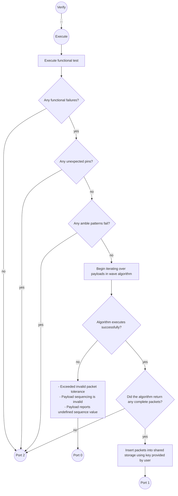

# PrimeHptpCapturePacketsTestMethod User Guide
[_TOC_]

This doc is intended to help you get started using the PrimeHptpCapturePacketsTestMethod, or otherwise known as ***HptpCapturePackets***.

# Terms used:
- **Payload**: Binary data. A subset of a packet. Multiple payloads are required to form a single packet. Payloads are generated from functional test execution's failure data.
- **Packet**:  Binary data. A collection of payloads.
- **HPTP**: High Performance Test Port. Name of the interface for data collection. 
- **DSOS**: Designated start of strobing. The first address in the pattern that strobes for payload data.
- **PPL**: Possible Payload Location. A group of four vectors that are strobing that the unit can use to report payload data.
- **Wave algorithm**: Algorithm used to combine payloads into a packet.
- **Vector address**: A static address that points to a line within your pattern.
- **Test count**: The amount of lines (or operations) that have been executed in your pattern. 

# Use Cases
Collection of fast raster packets for products utilizing HPTP interface.

# Parameters
| **Name**               | **Required?**                                                               | **Type**                | **Values**                                                                                                                                                                                                                                                                                                              |
|------------------------|-----------------------------------------------------------------------------|-------------------------|-------------------------------------------------------------------------------------------------------------------------------------------------------------------------------------------------------------------------------------------------------------------------------------------------------------------------|
| LevelsTC               | Yes                                                                         | String                  | Levels condition to apply for the functional test                                                                                                                                                                                                                                                                       |
| TimingsTC              | Yes                                                                         | String                  | Timings condition to apply for the functional test                                                                                                                                                                                                                                                                      |
| PatList                | Yes                                                                         | String                  | Plist to execute for the functional test                                                                                                                                                                                                                                                                                |
| PrePlist               | No                                                                          | String                  | Plist to execute before executing PatList                                                                                                                                                                                                                                                                               |
| Pins                   | Yes                                                                         | String                  | Pins to capture data on during functional test execution. Order of these pins is critical; define the pin containing the MSB of your payload as left-aligned in the string, pin containing LSB of your payload right-aligned in the string.                                                                             |
| MaskPins               | No                                                                          | String                  | Pins to mask for functional test execution.                                                                                                                                                                                                                                                                             |
| TotalCaptureCount      | No (default = 1000000)                                                      | Int                     | Maximum number of fails allowed to be captured by the functional test.                                                                                                                                                                                                                                                  |
| ApplyEndSequence       | No (default = disabled)                                                     | String                  | To apply the end sequence after test method execution.                                                                                                                                                                                                                                                                  |
| KeyForSharedStorage    | Yes                                                                         | String                  | Key to use to insert the concatenated vector data into SharedStorage.                                                                                                                                                                                                                                                   |
| Sequence               | Yes                                                                         | CommaSeperatedIntString | The expected sequence for incoming vectors for each packet.                                                                                                                                                                                                                                                             |
| DataBits               | Yes                                                                         | CommaSeperatedInteger   | Indexes of payload to use for packet data. Indexes consider the zero index as the LSB. Value constructed uses left most provided index as MSB.                                                                                                                                                                          |
| IdBits                 | Yes                                                                         | CommaSeperatedInteger   | Indexes of payload to use for sequencing. Determines which packet to append to in wave algorithm. Indexes consider the zero index as the LSB. Value constructed uses left most provided index as MSB.                                                                                                                   |
| ValidBits              | Yes                                                                         | CommaSeperatedInteger   | Indexes of payload to use as a valid value. The value created from these indexes must match at least one of your valid values.  Indexes consider the zero index as the LSB. Value constructed uses left most provided index as MSB.                                                                                     |
| ValidValues            | Yes                                                                         | CommaSeperatedString    | A list of binary values that correspond to the concatenated values of the ValidBits for some packet data. If you define ~n~ number of valid bits, you must define valid values with ~n~ number of bits. There is no limit to the # of values that can be defined in this parameter, but do not define duplicate values. |
| InvalidPacketTolerance | No (default = 0)                                                            | Int                     | Number of incomplete packets allowed after wave algorithm execution. If the number of incomplete packets exceed this value, exit port 0.                                                                                                                                                                                |
| AlignmentLabel         | No (default = string.Empty)                                                 | String                  | A field to provide the name of your AlignmentLabel if it's present in your patterns. Used to designate the first vector containing packet data.                                                                                                                                                                         |
| LabelOffset            | No (default = 0)                                                            | Int                     | If AlignmentLabelEnabled is set to true, this parameter will determine the offset from the label where packet data begins.                                                                                                                                                                                              |
| PacketSize             | No                                                                          | Int                     | The expected size of assembled data. Performs a simple error check during init to ensure your parameters of (# data pins) * (# of sequence values) create this size of packet.                                                                                                                                          |
| Timeout                | Optional (default = no timeout enabled. Will execute for as long as needed) | Int                     | The amount of time in (ms) to execute the test method before exiting out port 0                                                                                                                                                                                                                                         |
| ReversePacketOutput    | Optional (default = false)                                                  | String                  | "True"/"False". Determines if the packet is reversed with the MSB right aligned before inserting into SharedStorage.                                                                                                                                                                                                    |
| DetailedDebugPrints    | Optional (default = false)                                                  | String                  | "True", "False". Adds more verbose printing related to cycle data collected by the test method + values for payloads after unscrambling.                                                                                                                                                                                |                                                                                                                                                                               |                                                                                                                                                                                |                                                                                                                                                                                                                                                                                                       |                                                                                                                                                                                                                                                                                                        |

## Pins = 
The `Pins` parameter defines which pins are to be used for the collection of payload data.
git
The order of pins defined in Pins parameter affects the indexing of the payload when it's "unscrambled" or "flattened".

The first pin in this parameter (left aligned in par)


## Order of Data/Id/Valid bit parameters
The order of defined indexes affects the order of concatenation when creating Data/Id/Valid values for each payload.

The left most bit in each parameter is considered the MSB of your binary value. The right most bit of each parameter is the LSB of each binary value.

Ex.

The following payload is collected from functional test execution:


# Test method flow



# Background
The design of HPTP (High Performance Test Port) interface requires Array to modify how payload data is collected.

Previous products contained a sufficient amount of pins for their data collection interface to output a payload within a single vector of a pattern. This is not the case for HPTP. Due to this design change, multiple vectors are now needed for the collection of a single payload.

## Similarities to CapturePackets
1. Collection of payloads using functional test
2. Combines payloads into packets using Wave algorithm
3. Stores payloads into SharedStorage

## Differences from CapturePackets
1. Payload data is spread across four vectors.
2. Content for functional test execution can strobe for high and low.
    - CapturePackets/CaptureVectors used content that only strobes low. Test method always assumed failing strobes are "1"
    - Pattern reads are required to collect payload information.
4. No dedicated pins for Data/Id/Valid values. PDE instead provides the indexes to use for the Data/Id/Valid values when reading a payload.

# Content specifications
Content used for HPTP must adhere to the following requirements for the test method to function as intended.

## Designated start of strobing (DSOS)
Designated start of strobing (_DSOS_) is the first address in your content that strobes for payload data. The _DSOS_ and next three vectors of the pattern must contain strobes that the unit uses to report a payload. _DSOS_ is also the address for the first possible payload location (_PPL_) in your pattern.

A test instance calculates your _DSOS_ adding the location of your ```AlignmentLabel``` parameter to your ```LabelOffset``` parameter:

```AlignmentLabel address + LabelOffset = DSOS```

Content can still strobe for values before _DSOS_, but any failure before this address is considered an invalid state for the test method (exits port 2).

The test method aligns all possible payload locations (_PPLs_) using _DSOS_. If content's label or test method parameter uses a misaligned _DSOS_, all reported payloads will contain invalid information.

### Alignment Label
Users can create content with a label that marks their content's _DSOS_. The user can provide this label to the ```AlignmentLabel``` parameter of their test instance to mark this label as the starting location for _PPLs_.

### Label Offset

Used to mark the _DSOS_ relative to your ```AlignmentLabel```. If an label is not present in your patterns, this will offset from the very first vector in your pattern. This offset can be positive or negative.

If the offset is placed outside the the bounds of your pattern's vector data [0 -> length of pattern's vector data], the test instance will throw an exception and exit port -1.

| **Label**  | **Vector address** | **pin_00** | **pin_01** | **pin_02** | **pin_03** |
|------------|--------------------|------------|------------|------------|------------|
|            | 0                  |            |            |            |            |
|            | 1                  |            |            |            |            |
| SOME_LABEL | 2                  |            |            |            |            |
|            | 3                  |            |            |            |            |
|            | 4                  | L          | L          | L          | L          |
|            | 5                  | L          | L          | L          | L          |
|            | 6                  | L          | L          | L          | L          |
|            | 7                  | L          | L          | L          | L          |
|            | 8                  | L          | L          | L          | L          |
|            | 9                  | L          | L          | L          | L          |
|            | 10                 | L          | L          | L          | L          |
|            | 11                 | L          | L          | L          | L          |
|            | 12                 | ...        | ...        | ...        | ...        |


The label has been placed on vector address #2, but the pattern only begins strobing on vector address #4. We can add a ```LabelOffset = 2;``` parameter to the test instance to indicate that the pattern begins strobing for packet data two vectors after the location of ```SOME_LABEL```.

Otherwise, if the label exceeds the location of your intended _DSOS_:

| **Label**  | **Vector address** | **pin_00** | **pin_01** | **pin_02** | **pin_03** |
|------------|--------------------|------------|------------|------------|------------|
|            | 0                  |            |            |            |            |
|            | 1                  |            |            |            |            |
|            | 2                  |            |            |            |            |
|            | 3                  |            |            |            |            |
|            | 4                  | L          | L          | L          | L          |
|            | 5                  | L          | L          | L          | L          |
| SOME_LABEL | 6                  | L          | L          | L          | L          |
|            | 7                  | L          | L          | L          | L          |
|            | 8                  | L          | L          | L          | L          |
|            | 9                  | L          | L          | L          | L          |
|            | 10                 | L          | L          | L          | L          |
|            | 11                 | L          | L          | L          | L          |
|            | 12                 | ...        | ...        | ...        | ...        |

Providing a ```LabelOffset = -2``` corrects the location to begin on vector address #4.

## Possible payload location (PPL)
A possible payload location (_PPL_) is a sequence of four vectors that strobe for a payload. Failures on any vector in a _PPL_ indicate to the test instance that the entire group is to be used as a payload for packet generation.

### PPL starting test count
The test method always assumes that every four **test count** (a.k.a. cycle) beginning from _DSOS_ is a _PPL_.

The first test count for each _PPL_ is defined by the following expression:

```4n + DSOS = PPL start cycle```
Where _n_ is every _nth_ _PPL_ that can be contained in your pattern. In short, the start cycle of a PPL begins every four test count starting from _DSOS_.

Every failure reported by the unit is assumed to report a payload aligned to a _PPL_'s starting test count. Failure to align your content to your unit's start of payload reporting will cause invalid payloads to be generated by the test method.

**NOTE**: The test method assumes that the vector address and test count remain in sync until _DSOS_. JNZ instructions causing increments to your test count will cause the test method to collect invalid payload data.

### PPL strobes
The strobes for all _PPLs_ in your content must match the strobes defined from the first _PPL_ beginning at _DSOS_.

An assumption is made that all _PPLs_ are programmed to strobe for the same H/L values.

Failures on _PPLs_ that deviate from the first will cause the test method to generate invalid payloads on said _PPLs_.

Ex. Your unit has four pins for data collection: ```pin_00, pin_01, pin_02, pin_03```

The _DSOS_ for your pattern is defined on vector address [2]. Here is an example of the strobes for these for pins starting at _DSOS_:

| **Vector address** | **pin_00** | **pin_01** | **pin_02** | **pin_03** |
|--------------------|------------|------------|------------|------------|
| 0                  |            |            |            |            |
| 1                  |            |            |            |            |
| 2                  | L          | L          | L          | H          |
| 3                  | L          | L          | H          | L          |
| 4                  | L          | H          | L          | L          |
| 5                  | H          | L          | L          | L          |

If your unit can potentially report payload information for the next _PPL_ of your pattern (beginning at vector address 6), your pattern must contain the same four strobes beginning at _DSOS_:

| **Vector address** | **pin_00** | **pin_01** | **pin_02** | **pin_03** |
|--------------------|------------|------------|------------|------------|
| 6                  | L          | L          | L          | H          |
| 7                  | L          | L          | H          | L          |
| 8                  | L          | H          | L          | L          |
| 9                  | H          | L          | L          | L          |


# Collecting payloads from functional test
The test method queries TOS for all fails that occurred during pattern execution, then generates a list of payloads based off of the failing test count of each failure. 

## Determining PPL contains payload
A failure on any vector within a _PPL_ will cause the data for the entire _PPL_ to be used as a payload. If looping over _PPL_, every iteration that contains a strobe failure will is considered a payload reported by the unit.

## Data for a payload
If a _PPL_ contains a functional fail, all strobes of the four vectors of the _PPL_ is used as the payload's value.

Passing pins for a vector take the value of the passing strobe (L=0, H=1). If the pin fails, the value that caused the failed strobe is collected (L=1, H=0).

## Example payload collection

For the following example, lets say that we have a pattern whose _DSOS_ begins on vector address 0.

The first four strobes defined at the first _PPL_ beginning on _DSOS_ is as follows:

| **Vector address** | **pin_00** | **pin_01** | **pin_02** | **pin_03** |
|--------------------|------------|------------|------------|------------|
| 0                  | L          | L          | L          | H          |
| 1                  | L          | L          | H          | L          |
| 2                  | L          | H          | L          | L          |
| 3                  | H          | L          | L          | L          |

Every _PPL_ will strobe using the same values above. 

If our content contains a total of 16 vectors, each _PPL_ starts at addresses [0, 4, 8, 12].

TOS executes the pattern and reports the following data from a functional test execution. Red crosses (❌) mark locations where a pin failed a strobe. 

| **Vector address** | **pin_00** | **pin_01** | **pin_02** | **pin_03** |
|--------------------|------------|------------|------------|------------|
| 0                  | ✔️         | ✔️         | ✔️         | ✔️         |
| 1                  | ✔️         | ✔️         | ✔️         | ✔️         |
| 2                  | ✔️         | ✔️         | ✔️         | ✔️         |
| 3                  | ✔️         | ✔️         | ❌          | ✔️         |
|                    |            |            |            |            |
| 4                  | ✔️         | ✔️         | ✔️         | ✔️         |
| 5                  | ✔️         | ✔️         | ✔️         | ✔️         |
| 6                  | ✔️         | ✔️         | ✔️         | ✔️         |
| 7                  | ✔️         | ✔️         | ✔️         | ✔️         |
|                    |            |            |            |            |
| 8                  | ❌          | ✔️         | ✔️         | ❌          |
| 9                  | ❌          | ✔️         | ❌          | ❌          |
| 10                 | ❌          | ❌          | ❌          | ✔️         |
| 11                 | ✔️         | ✔️         | ✔️         | ❌          |
|                    |            |            |            |            |
| 12                 | ❌          | ❌          | ✔️         | ❌          |
| 13                 | ✔️         | ✔️         | ✔️         | ✔️         |
| 14                 | ✔️         | ✔️         | ✔️         | ✔️         |
| 15                 | ✔️         | ❌          | ❌          | ️   ❌      |

The second _PPL_, vectors 4-7, report no pin failures, therefore, no payload information is reported.

The below tables describe the payloads that are reported for this functional test execution:

**Payload 1 (vector addresses 0-3)**

| **Index in PPL** | **pin_00** | **pin_01** | **pin_02** | **pin_03** |
|------------------|------------|------------|------------|------------|
| 0                | ✔️         | ✔️         | ✔️         | ✔️         |
| 1                | ✔️         | ✔️         | ✔️         | ✔️         |
| 2                | ✔️         | ✔️         | ✔️         | ✔️         |
| 3                | ✔️         | ✔️         | ❌          | ✔️         |

**Payload 2 (vector addresses 8-11)**

| **Index in PPL** | **pin_00** | **pin_01** | **pin_02** | **pin_03** |
|------------------|------------|------------|------------|------------|
| 0                | ❌          | ✔️         | ✔️         | ❌          |
| 1                | ❌          | ✔️         | ❌          | ❌          |
| 2                | ❌          | ❌          | ❌          | ✔️         |
| 3                | ✔️         | ✔️         | ✔️         | ❌          |

**Payload 3 (vector addresses 12-15)**

| **Index in PPL** | **pin_00** | **pin_01** | **pin_02** | **pin_03** |
|------------------|------------|------------|------------|------------|
| 0                | ❌          | ❌          | ✔️         | ❌          |
| 1                | ✔️         | ✔️         | ✔️         | ✔️         |
| 2                | ✔️         | ✔️         | ✔️         | ✔️         |
| 3                | ✔️         | ❌          | ❌          | ️   ❌      |

The above tables of functional fails are then converted into binary values that represent the value reported by the unit.

L strobes are 0, H strobes are 1. If a unit fails a strobe, the opposite is collected.

Exclamation marks (❗) are values obtained due to failing strobes.

**Payload 1 (vector addresses 0-3)**

| **Index in PPL** | **pin_00** | **pin_01** | **pin_02** | **pin_03** |
|------------------|------------|------------|------------|------------|
| 0                | 0          | 0          | 0          | 1          |
| 1                | 0          | 0          | 1          | 0          |
| 2                | 0          | 1          | 0          | 0          |
| 3                | 1          | 0          | 1 ❗        | 0          |

**Payload 2 (vector addresses 8-11)**

| **Index in PPL** | **pin_00** | **pin_01** | **pin_02** | **pin_03** |
|------------------|------------|------------|------------|------------|
| 0                | 1 ❗        | 0          | 0          | 0 ❗        |
| 1                | 1 ❗        | 0          | 0 ❗        | 1 ❗        |
| 2                | 1 ❗        | 0 ❗        | 1 ❗        | 0          |
| 3                | 1          | 0          | 0          | 1 ❗        |

**Payload 3 (vector addresses 12-15)**

| **Index in PPL** | **pin_00** | **pin_01** | **pin_02** | **pin_03** |
|------------------|------------|------------|------------|------------|
| 0                | 1 ❗        | 1 ❗        | 0          | 0 ❗        |
| 1                | 0          | 0          | 1          | 0          |
| 2                | 0          | 1          | 0          | 0          |
| 3                | 1          | 1 ❗        | 1 ❗        | ️ 1 ❗      |

The next section will outline how these payloads are unscrambled so they can be indexed by the user.

# HPTP payload unscrambling
Payloads need to be unscrambled before indexing their values. The test method performs this unscrambling operation for you.

The payloads are unscrambled by using the following steps:
- Iterate over each pin in the Pins parameter of the test method, examining all of its values in for all four vectors
  - We iterate over the pins from right to left. Pin containing LSB should be the right most value, pin contain MSB as left most field
- Iterate pin's values for the 1st, 3rd, 2nd, and 4th vector in that order.
- Append each bit to a string
- Iterate over all pins, repeating previous two steps

The following python code demonstrates this algorithm

```python
payload = ""

# Each row is a vector. Each character within the row is a value for a pin.
# Alphabet in place of binary to make the algorithm easier to see.
vectorData = [
    "MIEA",
    "OKGC",
    "NJFB",
    "PLHD"
    ]

i = len(vectorData[0]) - 1 // interate over all pins
while (i >= 0): # iterate over each pin.
    payload += vectorData[0][i] # use the first vector value for the ith pin
    payload += vectorData[2][i] # use the third vector value for the ith pin
    payload += vectorData[1][i] # use the second vector value for the ith pin
    payload += vectorData[3][i] # use the fourth vector value for the ith pin
    i = i - 1

payload = payload[::-1] # reverse to have MSB as left-aligned
```

```python
>>> payload == "PONMLKJIHGFEDCBA"
True
```

The unscrambled payload can then be indexed by the user for the Data/Id/Valid bits for use in the Wave algorithm.

# Indexing values from payload (Data/Id/Valid values)
Each payload collected during functional test execution must be parsed for binary values for the wave algorithm.

These parameters are the parameters defining said values:

- DataBits: The data to be added to your packet's payload.
- IdBits: The sequence value of the payload. 
- ValidBits: If matching to the valid value defined in your test instance, marks the payload as valid. If not matching, the payload will not be used

The above parameters are comma seperated integers, each int representing an index in a payload. The parameters collects all the bits defined at the indexes in your parameter, then concatenates them into a binary value.

The zero index is the LSB of the payload.

The left most index of your parameter is the MSB of the value. The right most index is the LSB.

Indexes of the payload can be used multiple times in the construction of your binary values.

Ex.

A test instance defines the following parameters:  
- DataBits = "13-0";
- IdBits = "13-12";
- ValidBits = "15-14";

A payload is collected containing the following data (alphabet used for visual aid): **PONMLKJIHGFEDCBA**

The following values would be collected from the payload:

- Data: NMLKJIHGFEDCBA
- Id: NM
- Valid: PO

# Packet construction (Wave algorithm)
After extracting the values for each payload, the test method begins the construction of packets via the Wave algorithm.

The algorithm uses a stack containing all "packet streams", adding a new packet stream when the first defined user sequence value is detected. A stream is popped off the stack when it contains pattern data whose cycles advanced through all sequence values defined by the user. A cycle must advance the latest packet stream to the next sequence value from the previous cycle appended to that stream; it cannot be appended out of order. The algorithm expects that the nth cycle of pattern data advances the latest packet stream to the next defined sequence value until:
- a). A new packet head is detected (the nth cycle contains the first sequence value). Push a new packet stream onto the stack. Build on the latest packet stream.
- b). The latest packet has advanced through all sequence values. Pop it off. The popped sequence value is a complete packet. Build on the latest packet stream.

| **packet data** | **id bits** | **data bits** | **valid bits** |
|-----------------|-------------|---------------|----------------|
| 11 101 10       | 11          | 101           | 10             |
| 11 010 10       | 11          | 010           | 10             |
| 10 111 01       | 10          | 111           | 01             |
| 01 111 10       | 01          | 111           | 10             |
| 11 001 10       | 11          | 001           | 10             |
| 01 100 10       | 01          | 100           | 10             |
| 10 010 10       | 10          | 010           | 10             |
| 10 111 10       | 10          | 111           | 10             |
| 01 111 10       | 01          | 111           | 10             |
| 10 111 11       | 10          | 111           | 11             |
| 10 010 10       | 10          | 010           | 10             |
| 11 001 10       | 11          | 001           | 10             |
| 11 110 10       | 11          | 110           | 10             |
| 01 101 10       | 01          | 101           | 10             |
| 00 000 01       | 00          | 000           | 01             |
| 10 001 10       | 10          | 001           | 10             |
| 01 111 10       | 01          | 111           | 10             |
| 10 011 10       | 10          | 011           | 10             |

**Legend**:</br>
⚠️ - Start of new packet</br>
 ❗  - Most recent packet received the final sequence value. This packet will be popped from the stack and the most recent packet will resume generation.</br>
🟢🔴🔵🟣🟠 - A packet (different color for each unique packet)

**REMEMBER**: Our test instance's ```Sequence``` parameter provided the sequence values [3 -> 0b11, 1 -> 0b01, 2 -> 0b10]. A packet is completed when the most recent packet on the stack has recieved three cycles that progresses through the binary sequence values in the order provided by the user. So, a packet must recieve three cycles where the first cycle has a sequence value of 11, the second cycle's sequence value is 01, and the final cycle's sequence value is 10</br>

| **Is valid** | **Current Packet** | **Stack** | **Sequence Value** | **Data** |
|--------------|--------------------|-----------|--------------------|----------|
|              | 🟢⚠️               | 🟢⚠️      | 11                 | 101      |
|              | 🔴⚠️               | 🟢🔴⚠️    | 11                 | 010      |
| ❌            |                    |           |                    |          |
|              | 🔴                 | 🟢🔴      | 01                 | 111      |
|              | 🔵⚠️               | 🟢🔴🔵⚠️  | 11                 | 001      |
|              | 🔵                 | 🟢🔴🔵    | 01                 | 100      |
|              | 🔵❗                | 🟢🔴🔵❗   | 10                 | 010      |
|              | 🔴❗                | 🟢🔴❗     | 10                 | 111      |
|              | 🟢                 | 🟢        | 01                 | 111      |
| ❌            |                    |           |                    |          |
|              | 🟢❗                | 🟢❗       | 10                 | 010      |
|              | 🟣⚠️               | 🟣⚠️      | 11                 | 001      |
|              | 🟠⚠️               | 🟣🟠⚠️    | 11                 | 110      |
|              | 🟠                 | 🟣🟠      | 01                 | 101      |
| ❌            |                    |           |                    |          |
|              | 🟠❗                | 🟣🟠❗     | 10                 | 001      |
|              | 🟣                 | 🟣        | 01                 | 111      |
|              | 🟣❗                | 🟣❗       | 10                 | 011      |

Here are the final values for each packet:

| Packet #    | Packet Data |
|-------------|-------------|
| Packet 1 🔵 | 010 100 001 |
| Packet 2 🔴 | 111 111 010 |
| Packet 3 🟢 | 010 111 101 |
| Packet 4 🟠 | 001 101 110 |
| Packet 5 🟣 | 011 111 001 |

This packets will then be concatenated as a single string, in order of packets completed. This string is pushed to shared storage using the key "MyExampleKey" which was defined for the ```KeyForSharedStorage``` parameter for the test instance.
The final string for this instance would be: 011111001001101110010111101111111010010100001

## Algorithm fail states

### Incoming cycle is out of order
The algorithm does not have any tolerance, and will error out if these conditions are not met. 


| **Cycle** | **Is valid** | **Current Packet** | **Stack** | **Sequence Value** | **pin_02** | **pin_03** | **pin_04** |
|-----------|--------------|--------------------|-----------|--------------------|------------|------------|------------|
| 1         |              | 🟢⚠️               | 🟢⚠️      | 11                 | 1          | 0          | 1          |
| 2         |              | 🔴⚠️               | 🟢🔴⚠️    | 11                 | 0          | 1          | 0          |
| 3         | ❌            |                    |           |                    |            |            |            |
| 4         |              | 🔴                 | 🟢🔴      | 10   ❌             | 1          | 1          | 1          |
| 5         | ...          | ...                | ...       | ...                | ...        | ...        |            |
| 6         | ...          | ...                | ...       | ...                | ...        | ...        |            |

Using the test instance params defined for the previous example (sequence values defined are [11, 01, 10]), this example errors out due to the 4th cycle reporting a sequence value that is out of order for the 🔴 packet. 🔴 packet expects the second cycle appended to the stream to report a sequence value of ```01```, but instead, a sequence value of ```10``` was provided. At this point, the algorithm execution is considered invalid and the test method will return out of port 0.

### Timeout
The test method has a ```Timeout``` parameter which indicates the maximum amount of execution time in milliseconds that are allowed for the current test instance execution before the test instance exits out of port 0.

### Invalid packet tolerance exceeded


# TPL examples
```
Test PrimeHptpCapturePacketsTestMethod Example
{
    Patlist = "hptp_Plist";
    TimingsTc = "HptpCapturePackets::basic_timing_10MHz_20MHz";
    LevelsTc = "HptpCapturePackets::HptpCapturePacketsTC";
    KeyForSharedStorage = "PacketsReported_NoMissingCycles_P1";
    Pins = "xxHPCC_DPIN_Dig_slcA_A0,xxHPCC_DPIN_Dig_slcA_A1,xxHPCC_DPIN_Dig_slcA_A2";
    DataBits = "11-4";
    IdBits = "3,2";
    ValidBits = "1,0";
    ValidValues = "11";
    Sequence = "1,2,3";
    LogLevel = "Enabled";
    PacketSize = 24;
    AlignmentLabel = "Start"; # where cycle data begins in compiled patterns
    DetailedDebugPrints = "True";
}
```

## Exit Ports
The ***HptpCapturePackets*** test method supports the following exit ports:

| **Exit Port** | **Condition** | **Description**                                                                                                                                                                                                 |
|---------------|---------------|-----------------------------------------------------------------------------------------------------------------------------------------------------------------------------------------------------------------|
| **-2**        | ***Alarm***   | Any alarm condition                                                                                                                                                                                             |
| **-1**        | ***Error***   | Any software condition error                                                                                                                                                                                    |
| **0**         | ***Fail***    | - Amount of time lapsed exceeded the Timeout parameter<br/>- # of invalid packets exceeds InvalidPacketTolerance parameter<br/>- Invalid wave algorithm state.                                                  |
| **1**         | ***Pass***    | - Fails were found during functional test and decoded into packet data. The number of invalid packets did not exceed the InvalidPacketTolerance parameter.                                                      |
| **2**         | ***Fail***    | - Functional test had no errors<br/>- Unexpected pin failed (pin not defined in Data/Valid/Id Pin parameters)<br/>- No complete packets were generated<br/>- Fail occurred before designated start of strobing. |

## Version tracking
| **Date** | **Prime Version** | **Author**     | **Comments**                 |
|----------|-------------------|----------------|------------------------------|
| 5/6/2024 | 13.1              | Caio Fernandes | Introduction of test method. |