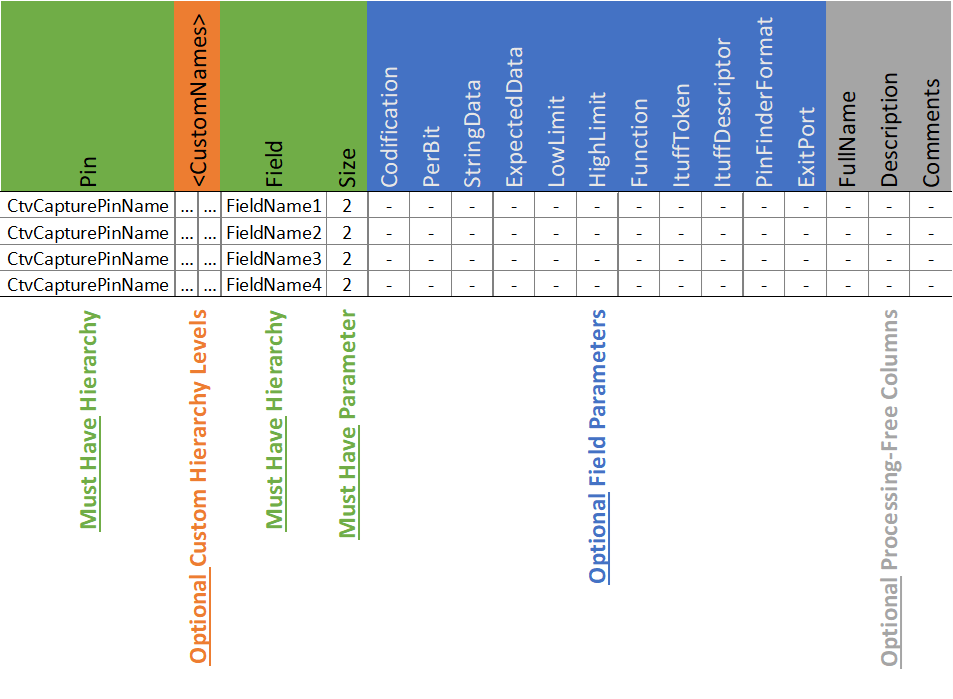

<h1>Prime Test-Method Specification REP</h1>

Revision 1.0.0

Dec 2022

[[_TOC_]]

## Introduction

The Test Method documented in here is a **PrimeFuncCaptureCtvTestMethod** extension (ITME) that can be used to postprocesses the CTVs based in a **ConfigurationFile** in csv format or any similar column separated file format.

`PrimeCtvDecoder` makes use of the `PrimeCtvServices` created by the same authors. These services can be used to extend the CTV decoding capabilities of any existing Test Method related to a Functional test (i.e. `Shmoo`, `VminSearch`, `TriggeredDC`, etc).

## Methodology

• Setup the **ConfigurationFile** as csv. More info on the examples below.

• Captured CTV bits are split based on the Configuration File's **Field** and **Size** parameters.

• Additional operations, processing or coding is supported an added support for registered Test Program Callbacks.

• The split CTVs can be printed in ITUFF as pipe separated string (`|`) with a corresponding `msunit` and `tssid` to support automated data processing and to support MCP products. The Metadata support is managed using Prime's `StringParsedMetadataHelper`.

• The split CTVs, can be compared against an **ExpectedData** or **<High|Low>Limits** defined in the Configuration File. Which **ExitPort** in case of mismatch can also be defined by the user.

## Errors and Exceptions

Throws Exception

• If missing any of the must have columns (**Pin**, **Field**, **Size**).

• If the **CtvCapturePins** do not match the **ConfigurationFile’s** **Pin** column.

• If the number of CTVs bits do not match the total **Size** parameter in the **ConfigurationFile**.

• If any non-supported column is added as **Field Parameter** in the **Configuration File** (Refer to **Field Parameters** section to see availability).

• If both **ExpectedData** parameter and **<High|Low>Limit** parameters are defined.

• If **DieIdRename** is defined and does not match the number of elements in **CtvCapturePins**.

• If **PerBit** and **ExpectedData** are used and **ExpectedData** is not `0` or `1`.

• If a column is referenced within `<>`, but it does not exist in the **ConfigurationFile** or is not an existing keyword (**Path** and **DieIdRename**).

• If the **ConfigurationFile** has empty rows.

• If any row in the **ConfigurationFile** has more or less elements than the file's header.

• If any **ItuffDescriptor** has more than `12` characters or contains any non-alphanumeric character (`_` is not a valid character).

• If any **ItuffDescriptor** is being called with a different set of **Field** names (not matching the number or names of columns from one `strgval` to another).

• If any **Field** name has more than `30` characters.

• If any **Field** name starts with a _non-alphabetic_ character.

• If any **Field** name contains a _non-alphanumeric_ character (`_`) is a valid character within the **Field** name, but not at the start).

• If a non-defined **Codification** is being used. Support is only provided for: `1Comp`, `2Comp`, `Gray`, `Reverse` and `SGray`.

## Test Instance Parameters

| **Parameter** | **Required?** | **Description** |
| ------ | ------ | ------ |
| **ConfigurationFile** | Yes | Input csv based on which the CTVs are decoded and postprocessed. |
| **CtvCapturePins** | Yes | Comma-separated list of pins to capture CTV data. |
| **LevelsTc** | Yes | Levels test condition. |
| **Patlist** | Yes | Plist name. Disclaimer: This test method processes CTV data only. All fail data related to pattern strobes will be completely ignored. |
| **TimingsTc** | Yes | Timings test condition. |
| **DieIdRename** | No | • Previously called **PinRename**. 

 • Comma-separated list of strings to rename the **CtvCapturePins**. 
 • If the **DieIdRename** is used, all ITUFF prints will include the `<0\|2>_tssid_<DieIdRename>` token to help split the data for each chip within the databases. It is recommended in MCP products with multiple dies to include tssid statement to the ITUFF. In such case, make sure the official die ID from the assembly drawings is used. For example: `U1`, `U2`, `U1.U3`, etc. 
 • Can be called within the **ConfigurationFile** using `<DieIdRename>` in **ItuffToken**, **ItuffDescriptor** or **StorageToken**. |
| **PerDieBinning** | No | Default: `DISABLED`. Used to assign per-TSSID `curfbin` if **DieIdRename** is also used. |

## Configuration File Columns

### Hierarchy Columns (Configuration File's columns before Field)

#### General Notes and Rules

• **Pin** and **Field** Parameters are required.

• There can be as many hierarchy columns between **Pin** and **Field** as needed.

• There cannot be two or more **Fields** with the same name within the same hierarchy path.

#### Parameters

| **Parameter** | **Required?** | **Description** |
| ------ | ------ | ------ |
| **Pin** | Yes | Tester channel from where the CTVs were collected. |
| **Field** | Yes | Name assigned to a specified split CTV section. |
| **\<Custom Hierarchy Level\>** | No | Any column header name, except from other defined parameters. 

  Any amount of columns between **Pin** and **Field** columns. 
 These columns are intended to facilitate the csv file management and to prevent duplicated **Field** names at the same hierarchy level. |

### Field Parameters (Configuration File's columns after Size)

#### General Notes and Rules

• All Parameters not documented as required can be optionally removed from the Configuration File.

• If a Parameter is defined in the Configuration File, but is not going to be used on a given **Field**, that cell should e filled with a dash symbol (`-`).

• Every Field which name starts with `offset` (***Regex**: `offset\d*`, case being ignored*) will be considered a non-action one. This is used when certain CTV bits should be ignored during the processing.

• Callbacks used in **Function** can point to pre-processed fields data using a relative or full path within square brackets (`[]`). The current field's **Hierarchy** will be used for relative paths. The keyword `this` can be used to point to the current field's data.

• To facilitate the Configuration File development, users can refer to other columns content within the Hierarchy as `<ColumnName>`. For example: `<Pin>`, `<Field>`, `<Path>`, `<DieIdRename>` or any other extra column added to support the file handling.

• Processing-Free columns are provided to facilitate the readability of the Configuration File. `Description`, `FullName` and `Comments` columns will be ignored if added in the file in the Field's Parameter section.

#### Parameters

| **Parameter** | **Required?** | **Description** |
| ------ | ------ | ------ |
| **Field** | Yes | Name assigned to a specified split CTV section. |
| **Size** | Yes | Bit length of the split CTV. |
| **Codification** | No | • As CTV data always comes inverted (`LSB`-`MSB`), every time a Field data is collected, the string is reversed to get a human readable number (`MSB`-`LSB`). 

 • The **Codification** column can be used if additional pre-processing is required prior conversion to decimal. 

 • Supported Codifications are: _One's Complement_ (`1Comp`), _Two's Complement_ (`2Comp`), _Gray Code_ (`Gray`), _String Reversal_ (`Reverse`) and _Signed Gray Code_ (`SGray`). |
| **PerBit** | No | `0-1` flag to indicated whether the data needs to be considered bit wise or as a whole. |
| **StringData** | No | Used to directly pass a string value to the **ItuffToken**. It also supports calls from Hierarchy content values using `<ColumName>`|
| **ExpectedData** | No | `Double` number used to compare the Field data against. If Field data is a `Double`, it is _strongly_ suggested to use **<Low\|High>Limit** instead. |
| **LowLimit** | No | `Double` number used to compare the Field data against an expected and exclusive **LowLimit**. It is independent from the **HighLimit**  |
| **HighLimit** | No | `Double` number used to compare the Field data against an expected and exclusive **HighLimit**. It is independent from the **LowLimit** |
| **Base** | No | `2, 10, or 16` | used to format the output data to according to the base number used. **2**, **10**, **16** represent binary, decimal and hex respectively. Take note that this conversion is expected to work with decimal rather than floating numbers. When floating number is used, the code will auto round the number prior to conversion.|
| **Function** | No | • Used to execute a pre-registered Test Program Callback. 

 • **Syntax**: `CallbackName(CallbackArguments)`. 

 • Any **Field** path within square brackets (`[]`) will be replace with the corresponding field's data before executing the Callback. 

 • The output of the Callback will be applied to the current Field. Because of that, we suggest to use them in fields with **Size** of `0` to avoid data corruption. |
| **ItuffToken** | No | • Groups the Fields to be printed in ITUFF. 

 • Used as postfix of the Test Instance Name on ITUFF. 
 • Uses `\|` as delimiter. |
| **ItuffDescriptor** | No | To add a _“Unit Of Measurement”_ (`msunit`) token that would be printed in ITUFF after the `strgval` in the format: `<0\|2>_msunit_SPMV1://[!ItuffDescriptor]\|//` 

 This feature is to be used with the `4_uddtype` token defined during LotStart. |
| **PinFinderFormat** | No | • Normally used in conjunction with **PerBit** and **ExpectedData** (`0` or `1`) to print failures in compliance with **PinFinder** ITUFF formatting. 
 • The intention is to provide a string like format that will represent the current failing pins from the per pin data string. 
 • The keyword `bit` can be used within `$$` signs to extract the corresponding pin index from the list of failing pins. It also supports basic equations to help address such scenarios where there is an offset that needs to be accounted. For example: `XXTX_MDFI_CLUSTER0_[$bit + 2$]`. 
 • If a single failing bit represents multiple bumps within the chip, it can be addressed using curly brackets. For example: `XX{TX\|RX}_MDFI_CLUSTER0_[23]`. In this case, the ITUFF will show two failing pins, `XXTX_MDFI_CLUSTER0_[23]` and `XXRX_MDFI_CLUSTER0_[23]`. 
 • It can be used even when **PerBit** is not set to `1`, but the `bit` keyword _should not_ be used. |
| **ExitPort** | No | • Assigned **ExitPort** used when failing a comparison against an **ExpectedData** or **<High\|Low>Limits**. 

 • **_Do not use ExitPort Higher than 6_**. 

 • If the column is not added or the cell is filled with `-`, any failure in such **Field** will be addressed through port 0. 

 |

## Ports

• All fail ports are user defined using **ExitPort** parameter in the Configuration File. If not defined in the file, any failure will be addressed through port `0`.

• Prime does not support a dynamic port definitions. If required, the user would have to create its own Test Method and add the extra ports as part of the `Execute` definition.

• If **ExitPort** is defined to be greater than 6, it would fail without a proper error management. Do not use **ExitPort** Higher than 6.

    [Returns(1, PortType.Pass, "Passed.")]
    [Returns(0, PortType.Fail, "Failed Port0")]
    [Returns(2, PortType.Fail, "Failed Port2")]
    [Returns(3, PortType.Fail, "Failed Port3")]
    [Returns(4, PortType.Fail, "Failed Port4")]
    [Returns(5, PortType.Fail, "Failed Port5")]
    [Returns(6, PortType.Fail, "Failed Port6")]

## Implementation (.mtpl Example)

    Test PrimeCtvDecoder DFX_MDFIC_CTVDEC_K_END_X_X_VMIN_X_TX_RCOMP
    {
        Patlist = "mdfic_tx_rcomp_list";
        TimingsTc = "BASE::tim_d11r11_1x_t100_s400";
        LevelsTc = "BASE::lvl_base_mdfi_nom";
        CtvCapturePins = "TDO";
        DieIdRename = "U1";
        ConfigurationFile = "./Modules/MIO_MDFIC/InputFiles/TestFileGenericPass.csv";
        LogLevel = "DISABLED";
        PerDieIdBinning = "DISABLED";
    }

## ITUFF printing

### **Regular printing**

    0_tname_<Module>::<InstanceName>_<ItuffToken>
    0_strgval_<Field1>|<Field2>|<Field3>|…

### **Printing with DieIdRename and ItuffDescriptor**

    4_uddtype_TOD_<ItuffDescriptor>_<Field1>,<Field2>,<Field3>,…
    …
    0_tname_<Module>::<InstanceName>_<ItuffToken>
    0_strgval_<Field1>|<Field2>|<Field3>|…
    0_msunit_SPMV1://[!ItuffDescriptor]|//
    0_tssid_<DieIdRename>

### **Test Failures**

    0_tname_<Module>::<InstanceName>_fc
    0_strgval_<PathFieldX>:<FieldX>|<PathFieldY>:<FieldY>|<PathFieldZ>:<FieldZ>|…
    0_tssid_<DieIdRename>

### **PinFinder Failures**
*IMPORTANT NOTE*

    The format is not decided by Prime team. It's an STTD decision.
    Please refer to EMIB section in PinFinder spec document by STTD.

Format in case of 1 pin print: (notice pin name duplication in tname and strgval)

    0_tname_<Module>::<InstanceName>|<Pin1>_failbump
    0_strgval_<Pin1>_failbump
    0_tssid_<DieIdRename>

Format for multiple pins print:
   
    0_tname_<Module>::<InstanceName>|<Pin1>_failbump
    0_strgval_<Pin2>...|<pinN>_failbump
    0_tssid_<DieIdRename>

## Input Configuration File Examples

[Generic](https://github.com/intel-restricted/applications.manufacturing.ate-test.prime.server.mdcxprime/files/9768925/TestFileGenericPass.csv)

[Codification](https://github.com/intel-restricted/applications.manufacturing.ate-test.prime.server.mdcxprime/files/9768928/TestFileCodification.csv)

[ExitPort](https://github.com/intel-restricted/applications.manufacturing.ate-test.prime.server.mdcxprime/files/9768927/TestFileExitPort.csv)

[Multiple DieId and Msunit](https://github.com/intel-restricted/applications.manufacturing.ate-test.prime.server.mdcxprime/files/9768924/TestFileMultipleDieIdMsunitCheck.csv)

[Functions or Callbacks](https://github.com/intel-restricted/applications.manufacturing.ate-test.prime.server.mdcxprime/files/9768921/TestFileFunctionPass.csv)
