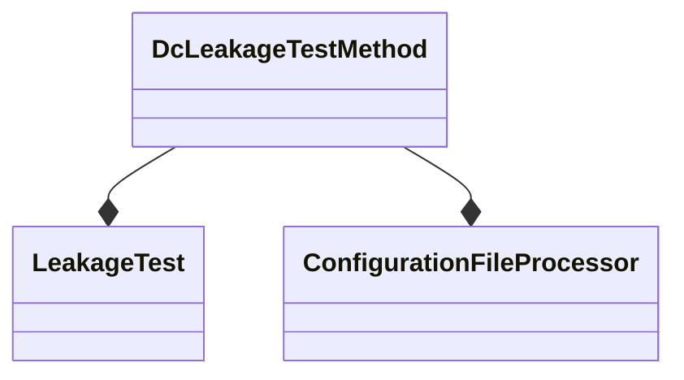

[[_TOC_]]

# Prerequisites

<p style="font-size: 20px;"><span style="color: #cf6679;">This Test Method is using Aleph initialization. Please refer to Aleph documentation</span></p>

[Link to Aleph Documentation](https://dev.azure.com/mit-us/PrimeWiki/_wiki/wikis/PrimeWiki.wiki/90055/PRIME-Environment-Variables?anchor=aleph_files)

**NOTE**: Aleph file being used for this test method is the PinService.json file.

# Description

This test class provides a framework to measure current leakage (LKG) on high-impedance I/O pins to VCC, VSS and adjacent pins. This test class does not support testing DPS pins.
DcLeakage allows executing a leakage low (VCC) and/or leakage high (VSS) test for each specified pin/pingroup.
Each leakage test sequentially does the following:

1. Places the DUT into a tri-state or high-impedance mode by executing a pre-conditioning pattern
2. Forces a voltage on the specified pin/pingroup using the PMU by level Test Condition.
3. Measures the actual current flow
4. Compares current flow against the user-supplied upper and lower limits
5. Records the results into ITUFF and console.

# Configuration File
Single Setting apply for Multiple Pin/PinGroup.<br>
<details><summary><font color="blue">Expand for detail</font></summary>
Set the Vss and Vcc limits for pinA, pinB, and pinGroupC. Then, execute the test.

```json
{
  "ConfigurationSets": [
    {
      "ConfigurationName": "MyDcLkgConfiguration",
      "Settings": [
        {
          "LimitsSettings": {
            "VssLimitHigh": 1.0,
            "VssLimitLow": 1.0,
            "VccLimitHigh": 1.0,
            "VccLimitLow": 1.0
          },
          "LeakageElements": [
            "pinA",
            "pinB",
            "pinGroupC",
          ]
        }
      ]
    }
  ]
}
```
</details>

Seperate Setting apply for Multiple Pin/PinGroup.<br>
<details><summary><font color="blue">Expand for detail</font></summary>
Set the Vss and Vcc limits to 1.0 for pinA and to 2.0 for pinB and pinGroupC. Then, execute the test.

```json
{
  "ConfigurationSets": [
    {
      "ConfigurationName": "MyDcLkgConfiguration",
      "Settings": [
        {
          "LimitsSettings": {
            "VccLimitHigh": 1.0,
            "VccLimitLow": 1.0,
            "VssLimitHigh": 1.0,
            "VssLimitLow": 1.0
          },
          "LeakageElements": [
            "pinA"
          ]
        },
        {
          "LimitsSettings": {
            "VccLimitHigh": 2.0,
            "VccLimitLow": 2.0,
            "VssLimitHigh": 2.0,
            "VssLimitLow": 2.0
          },
          "LeakageElements": [
            "pinB",
            "pinGroupC"
          ]
        }
      ]
    }
  ]
}
```
</details>

## Field details
- **ConfigurationName**:  a unique name for leakage settings.
- **Settings** : Vss and Vcc high and low limits. 
- **LeakageElements** : List of measured Pins or groups, which should be included in the LevelsTC.


## Test Parameters:
|ParameterName  |Details|
|--|--|
|TimingsTc  | Timing for Pre Conditions Plists execution  |
|LevelsTc| Levels for Pre Conditions Plists execution|
|TestType|Enum, Leakage Test execution mode , [Both, Vss , Vcc]|
|LkgHiPlist| Pre condition plist for LkgHi Test|
|LkgHiLevel| Level TC contains the measurements requests for lkgHi|
|LkgLoPlist| Pre condition plist for lkgLo Test|
|LkgLoLevel| Level TC contains the measurements requests for lkgLo|
|ConfigurationFile|Path for dc leakage configuration .json<br>The file name must end with <span style="color:red">".dcleak.json".</span>|
|Configuration|Configuration name from the listed file|
|DatalogLevel|Defines the logging level of the measurements.<br>Default value <span style="font-weight: bold; color:darkCyan">Compress</span>.<br>For more details look [Dc BussinessLogic](../../../../BusinessLogic/Dc/Readme.md)) documentation.|

## Test Sequence:

Dc Leakage test method no longer supports the conversion of .json, or any other input type, into measurement requests using SetPinAttribute.
Instead, all leakage measurements should be defined using a dedicated levels Test condition.
Using direct measurement by LevelsTc are much more efficient and allow users edit the levels on tester while understanding the sequence and measurement requests.

Each Level TC should contain the corresponded settings in the configuration file. 

Examples:
```csharp
Single Group Or Pin Measuremnet:

Current measurement of the pinGroup HPCC_DPIN_Dig_slcA_All.
Forcing a Voltage of 0.02V.
All the pins in the group will be measured in PARALLEL.

LevelsTestCondition ForceHiPinOrGroupExample_lvl
{
    HPCC_DPIN_Dig_slcA_All
    {
        StartMeasurement = True ;
        OPMode = "VSIM" ;
        PinModeSel = "PMU" ;
        SamplingCount = 1 ;
        SamplingRatio = 1 ;
        SamplingMode = "Average" ;
        VForce = 0.02V; 
        IRange = "IR40mA";
        IClampHi = 0.02A ;
        IClampLo = -0.02A ;
    }
}

The pinGroup DomainA_DPIN_PMU will be measured in parallel to the pin xxHPCC_DPIN_PMU_slcB_2Kohm since no SquenceBreak staement set between the blocks.

LevelsTestCondition  ParallelMeasurementExmaple_lvl
{
    DomainA_DPIN_PMU
    {
        StartMeasurement = True;
        OPMode = "VSIM" ;
        PinModeSel = "PMU" ;
        SamplingCount =  1 ;
        SamplingRatio = 1 ;
        SamplingMode = "Average" ;
        VForce = 0.02V; 
        IRange = "IR40mA";
        IClampHi = 0.02A ;
        IClampLo = -0.02A ;
    }
    xxHPCC_DPIN_PMU_slcB_2Kohm
    {
        StartMeasurement = True;
        OPMode = "VSIM" ;
        PinModeSel = "PMU" ;
        SamplingCount =  1 ;
        SamplingRatio = 1 ;
        SamplingMode = "Average" ;
        VForce = 0.02V; 
        IRange = "IR40mA";
        IClampHi = 0.02A ;
        IClampLo = -0.02A ;
    }
}

The pin xxHPCC_DPIN_PMU_slcB_2Kohm will be measured after DomainA_DPIN_PMU measurement done.

LevelsTestCondition  ParallelMeasurementExmaple_lvl
{
    DomainA_DPIN_PMU
    {
        StartMeasurement = True;
        OPMode = "VSIM" ;
        PinModeSel = "PMU" ;
        SamplingCount =  1 ;
        SamplingRatio = 1 ;
        SamplingMode = "Average" ;
        VForce = 0.02V; 
        IRange = "IR40mA";
        IClampHi = 0.02A ;
        IClampLo = -0.02A ;
    }
    SeaquenceBreak 0ms;
    xxHPCC_DPIN_PMU_slcB_2Kohm
    {
        StartMeasurement = True;
        OPMode = "VSIM" ;
        PinModeSel = "PMU" ;
        SamplingCount =  1 ;
        SamplingRatio = 1 ;
        SamplingMode = "Average" ;
        VForce = 0.02V; 
        IRange = "IR40mA";
        IClampHi = 0.02A ;
        IClampLo = -0.02A ;
    }
}
```
**Verify:**

1. Validate and Process test inputs.
2. Build LkgTest Object according to the given inputs.

LkgLevels and LkgPlists parameters are required!
Test Mode [Both] - Both LkgHi and LkgLo levelsTc and Plists should be supplied. 
Test Mode [VSS] -  LkgLo levelsTc and Plists should be supplied. 
Test Mode [VSS] - Both LkgHi levelsTc and Plists should be supplied. 

**Execute:**

1. Execute some setups before any measurement execution
2. Execute the required and available leakage Tests.
3. Results Processing.
4. Port set.

## Test Method Extensions:

```csharp
// Called at the beginning of the Execute()
// Every global setups for leakage measurements can be specified here.
void PreExecuteSetups();

/// Get a FunctionalTest to be executed before measuring leakage.
/// The default implementation will return a CaptureFailureTest.
/// In addition, in cases where the test Mode is Both and the given Plist is the same for both
/// only one Functional Object will be running for optimizing the execution.
ICaptureFailureTest GetLeakagePreConditionTest(DcLeakageType dcLeakageType);

/// Generate a DcTest for leakage measuring based on the given inputs. 
/// The default implementation creats a DcTest with DatalogLevel = DcDatalogLevel.COMPRESS.
IDcTest GetLeakageDcTest(DcLeakageType dcLeakageType);

/// Called as a part of Execute.
/// Default implementation will print the data to console in table format in case of Debug mode.
/// In addition, data will be printed to ituff using datalog dc formater.
void CustomPostProcessResults(IDcResult lkglowResults, IDcResult lkgHiResults);

/// Called as a part of datalogging stage, that string will be printed to console in Debug mode.
string GetDebugPrint(IDcResult evaluatedResults);

///  Retrieve the current test method exit port.
int GetExitPort();
```

## Test Method Components:


## Exit Ports
MarginSweep test method supports the following exit ports:
| **Exit Port** | **Condition**   | **Description**              |
| ------------- | --------------- | ---------------------------- |
| **0**         | ***Fail***      | Failed execution of preconditioning pattern            |
| **1**         | ***Pass***      | Passing condition            |
| **2**         | ***Fail***      | Failed Leakage High check            |
| **3**         | ***Fail***      | Failed Leakage Low Check            |

## Additional Dependencies
N/A

## Version Tracking
| Prime Version     | Prime ticket reference | **Comments** |
| ----------------- | ---------------------- | ------------ |
| 13.00.00          | #42619                 | Refactor of Dc Related Testmethods|
| 13.01.00          | #53842                 | Enabling compress mode for data output.|

## Acronyms
Definition of terms and acronyms used in this document:

  - **REP**: P**r**ime T**e**st-Method S**p**ecification
  - **HDMT**: High Density Modular Tester
  - **TPL**: Test Programming Language
  - **TOS**: Test Operating System
  - **LKG**: Leakage