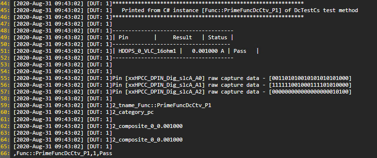

**prime Test-Method Specification REP**

November 2023

[[_TOC_]]

## REP for FuncDcCtv

This **REP** is intended to describe the FuncDcCtv Prime TestMethod.

In this document, you will find the below sections:

  - **Methodology** – A detailed description of this TestMethod intention and purpose

  - **Parameters** – A table describes each instance parameter (Name, Type, Default, Required?)

  - **Datalog output** – A detailed description of what is datalogged by his TestMethod

  - **Custom User Code hooks** – A list of functions available to the user code to override

  - **TPL Samples** – Examples of how to use this TestMethod in a TPL file

  - **Exit Ports** - A table describes each exit port

  - **Additional Dependencies** – More to consider for this TestMethod to operate

  - **Version tracking** – With author names, so you always have a name to address

  - **Acronyms** - Definition of acronyms used in this document

## Methodology

The FuncDcCtv test method provides capability to perform plist execution, capture CTV (Capture This Vector) data, and then capture raw Dc measurements (Voltage and Current).

### Verify

  - Validate limits (numeric with units)
  - Validate test condition exist and valid
  - Validate pins
  - Match number of pins to number of limits
  - Validate plist exists

### Execute

  - Execute functional test (preconditions the DUT) and capture CTV data
  - Apply DC Levels to HW (triggers DC measurement)
  - Gather the measured values
  - Match measured values against the provided limits
  - Print DC results to Datalog(ituff)
  - Process CTV data captured using extension vlass

## Test Instance Parameters

The table below lists and describes the test instance parameters supported by the Dc test method

| **Parameter Name** | **Required?** | **Type**        | **Values**                                                                                                                                                                                                                                                                                                                                         | **Comments**                                                                                                                                                                                                                                                                                                   |
| ------------------ | ------------- | --------------- |----------------------------------------------------------------------------------------------------------------------------------------------------------------------------------------------------------------------------------------------------------------------------------------------------------------------------------------------------|----------------------------------------------------------------------------------------------------------------------------------------------------------------------------------------------------------------------------------------------------------------------------------------------------------------|
| MeasurementTypes   | No            | String (choice) | Comma separated list of measurement types, Current(**default**) , Voltage or inital letter "C", "V"                                                                                                                                                                                                                                                | if is used only one measurement type, that will be applied to all pins                                                                                                                                                                                                                                         |
| DatalogLevel       | No            | String (choice) | FAIL_ONLY: Prints to Ituff only fail result.<br> ALL: Prints both fail and pass results.<br> COMPRESS: Prints all result in ituff compress format.<br> PINMAP_COMPRESS: Prints all result in ituff compress format with pinMapId.<br> PIN_DETAIL: Prints pin name and SuperPinGroup (if used), and Pin Channel as a comnt if pin failed. |<br>**NOTE**: Refer to [DC BusinessLogic](../../../../BusinessLogic/Dc/Readme.md) Wiki for more detail.
| Patlist            | Yes           | Plist           | Plist name to be executed                                                                                                                                                                                                                                                                                                                          |                                                                                                                                                                                                                                                                                                                |
| CtvPins            | Yes           | String          | Comma separated list of pins for which CTV data should be captured                                                                                                                                                                                                                                                                                 |                                                                                                                                                                                                                                                                                                                |
| Pins               | Yes           | String          | Comma separated list of pins for which DC measurements should be taken                                                                                                                                                                                                                                                                             |                                                                                                                                                                                                                                                                                                                |
| LowLimits          | No            | String          | Comma separated list of real numbers with units representing measurement low limits                                                                                                                                                                                                                                                                | Default value – empty string                                                                                                                                                                                                                                                                                   |
| HighLimits         | No            | String          | Comma separated list of real numbers with units representing measurement high limits                                                                                                                                                                                                                                                               | Default value – empty string                                                                                                                                                                                                                                                                                   |
| DcLevels           | Yes           | LevelsCondition | Levels test condition to be applied after the plist execution to setup and trigger DC measurements                                                                                                                                                                                                                                                 |                                                                                                                                                                                                                                                                                                                |
| LevelsTc           | Yes           | LevelsCondition | Levels test condition to be applied prior to pattern execution                                                                                                                                                                                                                                                                                     |                                                                                                                                                                                                                                                                                                                |
| TimingsTc          | Yes           | TimingCondition | Timing test condition to be applied prior to pattern execution                                                                                                                                                                                                                                                                                     |                                                                                                                                                                                                                                                                                                                |
| MaskPins           | No            | String          | Comma separated list of pins for which the fail data capture will be skipped                                                                                                                                                                                                                                                                       | Default value – empty string                                                                                                                                                                                                                                                                                   |
| AlarmPortRedirect  | No            | String (choice) | DISABLED  (**default**)<br>ENABLED                                                                                                                                                                                                                                                                                                                 | Default alarm port=[-2] behavior.<br>Enable the alarm port redirect to port=[3].                                                                                                                                                                                                                    |

## Console output (debug mode)

Measurement results can be printed to console in debug mode in form of
below table
When LogLevel is TEST_METHOD, CTV data is shown



Failing case results printout

## Datalog output

Dc results are logged to Ituff in “composite” format as shown below
```
2_tname_Func::PrimeFuncDcCtv_P1
2_category_pc
2_composite_0002028_0.001000
2_composite_0002020_0.002000
2_composite_0002004_0.003000
```

Example ituff with failing pin.
```
2_tname_Dc::Test_F0
2_category_fc
2_composite_0000002_0.0200000
2_tname_Dc::Test_F0
2_category_pc
2_composite_0000000_0.0020000
2_composite_0000001_0.0030000
```

**IMPORTANT**
The above datalog printout is executed by default from CustomPostProcessResults hook (see below )
In case user will override CustomPostProcessResults hook function there are few options for printing the results to datalog:
1. User will implement their own logic for results printout to Ituff as part of CustomPostProcessResults function implementation
2. To print the default datalog output in the above format (composite) user will call the IDcResult API  PrintToDatalog in CustomPostProcessResults implementation
```python
        void IFuncDcCtvExtensions.CustomPostProcessResults(FuncDcCtvTestInstanceResults results)
        {
            this.dcResultsHelper = this.dcResultsHelper ?? new DcResultsHelper(results.DcResults, this.perPinDcSetup);
            var areDcResultsWithinLimits = this.dcResultsHelper.AreAllDcResultsWithinLimits(this.dcPins, this.lowLimits, this.highLimits);
            results.ExitPort = (results.FunctionalResult && areDcResultsWithinLimits) ? TestMethodPassPort : TestMethodFailPort;
            this.DcResultsFormat.SetData(results.DcResults);
	    
            Prime.Base.ServiceStore<IDatalogService>.Service.WriteToItuff(this.DcResultsFormat, this.SessionContext);

            if (results.FailPinsName.Count > 0)
            {
                var failPinsInfo = new List<FailPinInfo>();

                foreach (var pinName in results.FailPinsName.Distinct())
                {
                    failPinsInfo.Add(DcCommon.CreateDcFailPinInfo(pinName, string.Empty, this.InstanceName));
                }

                DcCommon.DatalogFailPinInfo(failPinsInfo, this.SessionContext);
                DcCommon.StoreFailPinInfoToSharedStorage(failPinsInfo, this.SessionContext);
            }
        }
```
3. To print the default datalog output in the above format (composite) user will call the base class implementation of CustomPostProcessResults and then add its own:
```python
        void IDcExtensions.CustomPostProcessResults(IDcResult results)
        {
            base.CustomPostProcessResults(results)

            ///////////////////////////////////
            //  Rest of the user logic
            ///////////////////////////////////

        }
```

## Custom User Code Hooks

FuncDcCtv test method supports the following extensions:

```python
    public interface IFuncDcCtvExtensions
    {
        /// <summary>
        /// Called prior to any test in Execute to generate the test instance results object.
        /// </summary>
        /// <returns>The test instance results object.</returns>
        FuncDcCtvTestInstanceResults CreateTestInstanceResults();

        /// <summary>
        /// This function will be called after CTV data was successfully captured for custom post-processing of the CTVs.
        /// </summary>
        /// <param name="results">The object for holding the exit port, functional/CTV results, and DC results.</param>
        void CustomPostProcessCtvData(FuncDcCtvTestInstanceResults results);

        /// <summary>
        /// Called right after successful execution to allow the user to post process exit port, functional/CTV results, and DC results.
        /// </summary>
        /// <param name="results">The object for holding the exit port, functional/CTV results, and DC results.</param>
        void CustomPostProcessResults(FuncDcCtvTestInstanceResults results);

        /// <summary>
        /// Gets the list of pins to mask execution after execution. The test method will merge this list with the ones from the test instance parameter.
        /// </summary>
        /// <returns>The list of mask pins.</returns>
        List<string> GetDynamicPinMask();
    }
```

- CreateTestInstanceResults - Creates test instance results object that holds all results and the exit port (to be done early in Execute).

- CustomPostProcessCtvData - Allows user to override CTV results processing for attachment to test instance results object.  
Input is the test instance results object which includes functional test results, CTV results, DC results, and the exit port.

- CustomPostProcessResults - Allows user to post-process all results and override the exit port determined by the test method.  
Input is the test instance results object which includes functional test results, CTV results, DC results, and the exit port.

- GetDynamicPinMask- allows user to populate mask pins after TP load

Example implementations of those functions can be seen in Prime's SampleTP , user code section - Prime\UserSDK\SampleTP\UserCode

## TPL Samples

Here is an example of using the FuncDcCtv Test method

```python
Import PrimeFuncDcCtvTestMethod.xml;

Test PrimeFuncDcCtvTestMethod PrimeFuncDcCtvTest_P1
{
   Patlist = "HPCC_MTD_InstraSlice_1DOM_Plist";
   TimingsTc = "HPCC_MTD_IntraSlice_1DOM_tim_10MHz_TC";
   CtvPins = "HPCC_DPIN_Dig_slcA_All,HPCC_DPIN_Dig_slcB_All,HPCC_DPIN_Dig_slcC_All";
   FuncLevels = "HPCC_MTD_lvl_mid_TC";
   DcLevels = "HDDPS_TC";
   DcPins = "HDDPS_0_VLC_16ohm1";
   MeasurementType = "Current";
   LowLimits = "0A";
   HighLimits = "0.05A";
}
```
## Exit Ports

The Dc test method supports the following exit ports:

| **Exit Port** | **Condition** | **Description**                                                            |
| ------------- | ------------- | -------------------------------------------------------------------------- |
| **-2**        | ***Alarm***   | Any alarm condition                                                        |
| **-1**        | ***Error***   | Any software condition error                                               |
| **0**         | ***Fail***    | Failing condition. Results are out of limits or plist execution had failed |
| **1**         | ***Pass***    | Passing condition – results are within the limits                          |
| **3**         | ***Alarm***   | Any alarm condition if the AlarmPortRedirect is enabled.                   |

## Acronyms

Definition of acronyms used in this document:

  - **REP**: P**r**ime T**e**st-Method S**p**ecification
  - **HDMT**: High Density Modular Tester
  - **TPL**: Test Programming Language

## Version tracking

| **Date**                  | **Version**       | **Author**            | **Comments**                                                                   |
| ------------------------- | ----------------- | --------------------- | ------------------------------------------------------------------------------ |
| Aug 31<sup>st</sup>, 2020 | 1.0.0             | Lauren Mcdonald       | Initial version                                                                |
| May 18<sup>th</sup>, 2021 | 1.0.1             | Adam Malik            | Removed functional datalog printout documentation.                             |
| May 24<sup>th</sup>, 2021 | 1.0.2             | Didier Jimenez Retana | PR 2497: Allow the TriggeredDc test method to perform measurement type per Pin.|
| Jun  9<sup>th</sup>, 2021 | 1.0.3             | Kevin D. Krake        | Adding pin mask ability.                                                       |
| Sep 19<sup>th</sup>, 2021 | 1.0.4             | Slava Yablonovich     | Added DC results custom post process extension function.                       |
| Nov 15<sup>th</sup>, 2021 | 7.1               | Gadeer Awaisy         | Allow user to override PrintToDatalog                                          |
| Apr  6<sup>th</sup>, 2022 | 9.0               | Kevin D Krake         | Adding new Results method for exit port handling                               |
| Sep 13<sup>th</sup>, 2023 | 12.02.02          | Teoh, Khai Jie        | include fail pin name and fail channel printing to ituff. #39827               |
| Nov 21<sup>th</sup>, 2023 | 12.03.00          | Teoh, Khai Jie        | Disable Witch Project '2_tname_failchannel' and '3_binpinfails' printing to ituff.<br> #46008 |