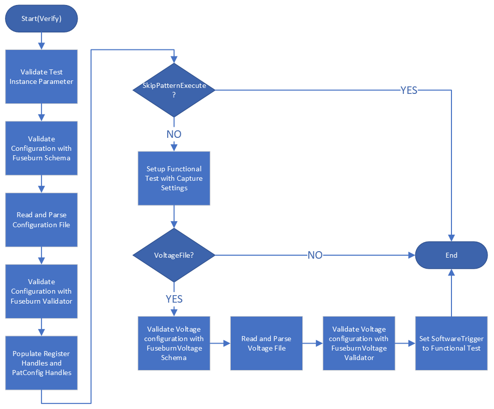
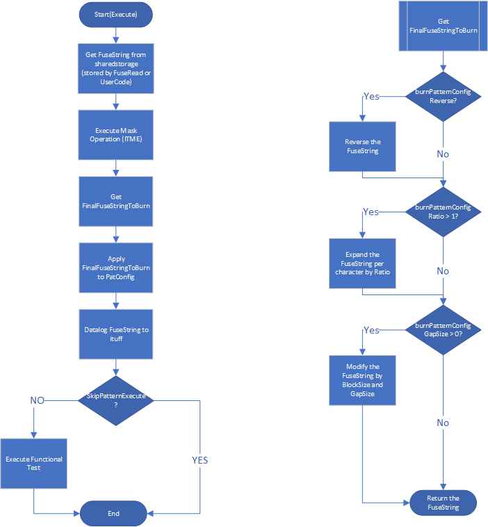

<h1>Prime Test-Method Specification REP</h1>

August 2025

[[_TOC_]]

## Important Notice
<font color="red">**From Prime v13.03.00 onward**</font><br>
- File-based mini flow is available starting from version 13.03.00. Please migrate from the code-based mini flow to the file-based format. <br>

### General FuseBurn Information
[Link (if the link is not working, proceed by manually navigating to FuseBurn Readme.md)](./../Readme.md) <br>

## Methodology
The FuseBurn TestMethod will get Fuse String that stored in sharedstorage by FuseRead TestMethod.

The Fuse String will then compare with Mask Value (ExecuteMask). see [Test Method Execute](#test-method-execute) for detail explanation.

The Fuse String after ExecuteMask will go through modification with parameter set in BurnPatternConfig. see [Test Method Execute](#test-method-execute) for detail explanation.

The formatted fuse string will pass to PatConfig for PatternModify then proceed to execute Functional Test.

Functional Test will execute with VBump (VForce) Software Trigger if enabled by providing FuseBurn voltage file.

## FuseBurnMask Structure JSON File Example
[Download](./.attachments/FuseBurnMask/sampleFuseBurn.json)
```json
{
    "Configurations": [
    {
        "Name": "ConfigMaskFuse",
        "DatalogFormat": "RLE",
        "Registers": [
        {
            "Name": "CPU0",
            "DataLabel": "Burn_Data_Label",
            "DataLabelOffset" : 0,
            "FuseGroupsToHide": "GROUP_A,GROUP_C",
            "Masks": [
            {
                "Name": "burn_staticMask",
                "FuseGroup": "GROUP_A",
                "BurnRange": "0,1-3,8-14,17-18",
                "Value": "101001"
            },
            {
                "Name": "burn_dynamicMask",
                "FuseGroup": "*",
                "BurnRange": "0,1-3,8-14,17-18",
                "Value": "11010110mmmmmmmmmmm",
                "Dynamic": [
                {
                    "FuseGroup": "GROUP_A",
                    "uservar":
                    {
                        "Name": "_UserVars.GL_FuseConfig_Data_site0"
                    }
                },
                {
                    "FuseGroup": "GROUP_B",
                    "sharedstorage":
                    {
                        "Name": "VAR1",
                        "Scope": "DUT"
                    }
                },
                {
                    "FuseGroup": "GROUP_C",
                    "DFF": {
                        "Name": "VOLT",
                        "Optype": "PBIC_S2",
                        "DieID": "DieID"
                    }
				}]
            }]
        }],
        "BurnPatternConfig":
        {
            "ReverseString": false,
            "Ratio": 1,
            "DataBlockSize": 3,
            "GapSize": 2,
            "PatternsRegex": "fuse_burn_pat_BSM1_pass"
        }
    }]
}
```
## FuseBurnMask Voltage Structure JSON File Example - Enable VBump Software Trigger.
[Download](./.attachments/FuseBurnMask/sampleFuseBurnVoltageFile.json) <br>
To enable functional test software trigger for vbump, user is required to provide json file with the following configuration.
|Attribute|Description|
|---------|-----------|
|Voltages|Required attribute. A container to hold Voltage attribute information.|
|Voltage|Required attribute. A container to hold operand information.|
|Name|Required attribute. Name of executing Operand.|
|Operand|Required attribute. Interger value and must not duplicate within a Voltage attribute.|
|PowerPin|Required attribute. Can define multiple pin name and voltage value. <br> At verify, <br> pin name will be check for pin existance and no duplicate pin name should exist within a operand. <br> voltage value can be either static or dynamic, cannot define both for a pin. For dynamic voltage value, only sharedstorage DUT and LOT is supported. verify will check the existance of the voltage value sharedstorage configuration. |
```json
{
  "Voltages": {
    "Voltage": [
      {
        "Name": "SNDC_VCCST_PreProgVoltage",
        "Operand": 1,
        "PowerPin": [
          {
            "Name": "VCCFUSE0_GPU0_LC",
            "Value": 0.5
          },
          {
            "Name": "VCCFUSE0_GPU1_LC",
            "sharedstorage": {
              "Name": "Fuse_Voltage_VCCST_Prog_BASE01",
              "Scope": "DUT"
            }
          }
        ]
      },
      {
        "Name": "SNDC_VCCFPGMx_PreProg",
        "Operand": 2,
        "PowerPin": [
          {
            "Name": "VCCFUSE0_GPU0_LC",
            "sharedstorage": {
              "Name": "Fuse_Voltage_VCCFPRGx_PreProg_BASE00",
              "Scope": "DUT"
            }
          },
          {
            "Name": "VCCFUSE0_GPU1_LC",
            "sharedstorage": {
              "Name": "Fuse_Voltage_VCCFPRGx_PreProg_BASE01",
              "Scope": "DUT"
            }
          }
        ]
      }
    ]
  }
}
```

## Test Instance Parameters
The table below lists and describes the test instance parameters supported by the FuseBurnMask test method.

| **Parameter Name**         | **Required?** | **Type**        | **Values**                                         | **Comments**                                                         |
| -------------------------- | ------------- | --------------- | -------------------------------------------------- | -------------------------------------------------------------------- |
|ConfigurationFile|Yes|File|Path to configuration file.|Able to use with "~HDMT_TPL_DIR".|
|ConfigName|Yes|String|Name of configuration in configuration file.|Can only define single name.|
|VoltageFile|No|File|Path to voltage file.|Able to use with "~HDMT_TPL_DIR". Provide this file to enable VBump Software Trigger.|
|RegisterNames|Yes|CommaSeparatedString|Name of register in configuration file.|Can define single or multiple name with comma delimiter.|
|SharedStorageKeyToRead|No|CommaSeparatedString|SharedStorage Key name.| Get fusestring from user provided sharedstorage key. The key must match number of 'RegisterNames'. Example, 'RegisterNames'="CPU0,PCH0", 'SharedStorageKeyToRead'="AnyKeyA,AnyKeyB". CPU0 will use fusestring of AnyKeyA, PCH0 will use fusestring of AnyKeyB.|
|MaskNames|Yes|CommaSeparatedString|Name of mask that valid for the register.|By default the test method only allow define single mask name, but user can use it as CommaSeparatedString to run multiple mask with CustomExecute.|
|Patlist|No|Plist|PatternList to execute.|Default will be empty.|
|PrePatlist|No|String|Pre PatternList to execute.|Default will be empty.|
|TimingsTc|No|TimingCondition|TimingsTc for pattern execution.|Default will be empty.|
|LevelsTc|No|LevelsCondition|LevelsTc for pattern execution.|Default will be empty.|
|MaskPins|No|CommaSeparatedString|Pin to mask.|Default will be empty.|
|MaxNumberOfFails|No|UnsignedInteger|Maximum number of failture to capture.|Default will set to 1.|
|SkipPatternExecute|No|Boolean|set ENABLED to setup functional test.|By default it is set to DISABLED.|
|SkipPatternOverride|No|Boolean|Override pattern. Set ENABLED to skip pattern modification. This only valid if the miniflow exit port is 1.|

## Test Method Verify
This section explain the verfiy process of FuseBurnMask TestMethod.

1. Validate the 'Required' test instance parameter. If test instance parameter *MaskPins*, it will check if the Pin exist.
2. Get configuration information by parsing the file that user provided with test instance parameter *ConfigurationFile*.
3. Validate configuration information with FuseBurn Schema.
4. Validate configuration information with FuseBurn Validator.
5. Setup Handler that consist of Register Data and Patconfig Handler.
    - Setup Register Handler for name of register user provided with test instance parameter *RegisterNames*. 
    - Setup PatConfig Handler with information from test instance parameter *BurnPatternSetName*, *Patlist* and from configuration information *BurnPatternConfig PatternsRegex*.
6. Setup Functional Test if test instance parameter *SkipPatternExecute* is set to ENABLED.
    - If test instance parameter *VoltageFile* is provided.
        - Validate voltage configuration information with FuseBurnVoltage Schema.
        - Validate voltage configuration information with FuseBurnVoltage Validator.
        - Set Software Trigger to Functional Test.<br>


Note: Starting from Prime v12.0.0 onwards, fuseDataLabel is an optional for every register defined in fuseDef file. When running Verify, fuseBurnMask will check if skipPatternExecute is disabled and fail appropriately. 
If it is disabled, fuseBurnMask is expecting fuseDataLabel to be defined, otherwise error will be thrown.

## Test Method Execute
This section explain the execute process of FuseBurnMask TestMethod. **This process is repeated for every register handler.

1. Get FuseString from sharedstorage that stored by FuseRead TestMethod.
    - The data is store with Key "fusestring_<registerName>" at DUT level.
    - You must either run FuseRead TestMethod first or have user code that store the fusestring with *Key* and *Context* mentioned above.
2. Run *CustomExecute* which ExecuteMask with provided test instance parameter *MaskNames*. This step can be customize with user code, see [Custom User Code Hooks](###custom-user-code-hooks).
    - Get Mask value of the register's mask name from configuration file.
    - Process fuse string if the Mask is with *FuseGroupsToHide* enabled. The bit will change to '0' depend on the Fuse Group address (the address is from fusedef).
    - Get Fuse Address related to the Mask *FuseGroup*.
    - Replace dynamic value ('m') in Mask value with respective storage value (can be from DFF, sharedstorage, uservar) that defined in Mask's *Dynamic*.
    - (If *BurnRange* is enabled) the burn range mask (MSB->LSB) will populate based on register size with the bit that *BurnRange* address will set as '1' while other set as '0'. 
    - (If *BurnRange* is enabled) the burn range mask will be post process to extract the string based on *FuseGroup* address.
    - (If *BurnRange* is enabled) the burn range mask will then perform AND-Bitwise with the mask value. see [AND-Bitwise Logic](###logic).
    - Update FuseBurnData with mask value. Bit that contain 's' will be remained as skip bit. 
    - Print FuseBurnData string that apply with the mask *FuseGroupsToHide*. The bit will change to '0' depend on the Fuse Group address (the address is from fusedef).
3. Get FinalFuseStringToBurn that applied with *BurnPatternConfig* information in configuration file. (ReverseString, Ratio, DataBlockSize, GapSize)
    - Reverse the fuse string if *BurnPatternConfig ReverseString* set to true.
    - Expand fuse string by ratio. The ratio is applied to per bit. Example, Ratio=2 FuseString='1010' -> FuseString='11001100'.
    - Post process the fuse string by Data Block Size and Gap Size (represented by 's'). Example, Fuse String '11001100' with Data Block Size=2 and Gap Size=1 will get '<font color="blue">11</font>**s**<font color="blue">00</font>**s**<font color="blue">11</font>**s**<font color="blue">00</font>'.
    - Update skip character from 's' to '_'.
4. Store FinalFuseStringToBurn to sharedstorage if setup in configuration file. [Detail at FuseBurn General Information page](#general-fuseburn-information)
5. Set the FinalFuseStringToBurn to PatConfig and Apply Pat Modify.
6. Datalog FuseString to ituff with strgVal and name will include name of register .
7. Execute Functional Test if *SkipPatternExecute* is set to ENABLED.
8. Return Execute Result.<br>



Without Miniflow or Without UserCode that extends CustomExecute Function which return port other than port 1 for passing port.

| No | PORT                  | SIMULATION     | SkipPatternExecute     | SkipPatternOverride     | EXECUTE FLOW                                       |
|    |                       |                | Instance Parameter     | nstance Parameter       |                                                    |
| -- | --------------------- | -------------- | ---------------------- | ----------------------  |-------------------------------------------------   |
| I  | 1                     | NON-SIMULATION | DISABLED               | DISABLED                | PATTERN MODIFICATION + EXECUTION PATTERN           |    
| II | 1                     | NON-SIMULATION | ENABLED                | ENABLED                 | SKIP PATTERN MODIFICATION + SKIP EXECUTION PATTERN |
| III| 1                     | SIMULATION     | DISABLED/ENABLED       | DISABLED                | PATTERN MODIFICATION + SKIP EXECUTION PATTERN      |
| IV | 1                     | SIMULATION     | DISABLED/ENABLED       | ENABLED                 | SKIP PATTERN MODIFICATION + SKIP EXECUTION PATTERN |

With Miniflow or with UserCode that extends CustomExecute Function which return port other than port 1 for passing port.

| No | PORT                  | SIMULATION     | SkipPatternExecute     | SkipPatternOverride     | EXECUTE FLOW                                                              |
|    |                       |                | Instance Parameter     | nstance Parameter       |                                                                           |
| -- | --------------------- | -------------- | ---------------------- | ----------------------  |-------------------------------------------------                          |
| I  | 1                     | NON-SIMULATION | DISABLED               | DISABLED                | PATTERN MODIFICATION + EXECUTION PATTERN                                  |    
| II | 1                     | NON-SIMULATION | ENABLED                | ENABLED                 | SKIP PATTERN MODIFICATION + SKIP EXECUTION PATTERN                        |
| III| <>1 – PASSING PORT    | NON-SIMULATION | DISABLED/ENABLED       | DISABLED/ENABLED        | EXIT AS PASSING PORT + SKIP PATTERN MODIFICATION + SKIP EXECUTION PATTERN |
| IV | <>1 – FAILING PORT    | NON-SIMULATION | DISABLED/ENABLED       | DISABLED/ENABLED        | EXIT AS FAILING PORT + SKIP PATTERN MODIFICATION + SKIP EXECUTION PATTERN |
| III| 1                     | SIMULATION     | DISABLED/ENABLED       | DISABLED                | PATTERN MODIFICATION + SKIP EXECUTION PATTERN                             |
| IV | 1                     | SIMULATION     | DISABLED/ENABLED       | ENABLED                 | SKIP PATTERN MODIFICATION + SKIP EXECUTION PATTERN                        |


## Logic
AND-Bitwise Logic
| Mask Value | Burn Range Mask Value | Result |
| ---------- | --------------------- | ------ |
|0|0|0|
|0|1|0|
|1|0|0|
|1|1|1|
|s|1|s (skip)|
** Mask value will contain '0','1' and 's'. Burn Range Mask value will contain '0' and '1' only.

## Custom User Code Hooks
Example - SampleTP - Test UserFuseBurnMaskCustomExecute CustomExecute_StaticMask_FullString_DatalogBinary_SkipPatternExecuteDisabled_P1

void IFuseBurnMaskExtensions.CustomExecute(FuseBurnMaskTestInstanceResults fuseBurnMaskTestInstanceResults)
```c++
    /// <summary>
    /// This is UserCode to customize FuseBurnMask TestMethod CustomExecute extension.
    /// The intention is execute multiple mask and exit with different port and add extra console printing during execute.
    /// </summary>
    [PrimeTestMethod]
    public class MaskCustomExecute : PrimeFuseBurnMaskTestMethod, IFuseBurnMaskExtensions
    {
        /// <inheritdoc/>
        void IFuseBurnMaskExtensions.CustomExecute(FuseBurnMaskTestInstanceResults fuseBurnMaskTestInstanceResults)
        {
            this.PrintStartMessage();

            // Here I can customize mask execution, and determine how I would like to exit different port based on different criteria.
            List<string> maskToExecute = this.MaskNames;
            foreach (var maskName in maskToExecute)
            {
                try
                {
                    fuseBurnMaskTestInstanceResults.ExecuteRegisterHandle.ExecuteMask(maskName);
                    fuseBurnMaskTestInstanceResults.ExitPort = 1;
                }
                catch (FatalException e)
                {
                    fuseBurnMaskTestInstanceResults.ExitPort = -1;
                    ServiceStore<IConsoleService>.Service.PrintError($"Error happened during fuse burn custom mask execution: {e.Message}");
                }
            }

            this.PrintEndMessage(fuseBurnMaskTestInstanceResults);
        }

        /// <summary>
        /// My Usercode function to print message.
        /// </summary>
        private void PrintStartMessage()
        {
            Prime.Base.ServiceStore<IConsoleService>.Service.PrintDebug(() => $"this message is from customize fuse burn execute mask. Executing for {this.MaskNames}", this.SessionContext);
        }

        /// <summary>
        /// My Usercode function to print end message with port status.
        /// </summary>
        /// <param name="fuseBurnMaskTestInstanceResults">TestInstance result of execute.</param>
        private void PrintEndMessage(FuseBurnMaskTestInstanceResults fuseBurnMaskTestInstanceResults)
        {
            Prime.Base.ServiceStore<IConsoleService>.Service.PrintDebug(() => $"Complete FuseBurn Execute. ExitPort=[{fuseBurnMaskTestInstanceResults.ExitPort}]", this.SessionContext);
        }
    }
```

## MiniFlow Extension API
[Download](./.attachments/FuseBurnMask/MiniFlowUserReferenceBurnMask.cs)
|API|Description|API Return|
|---------|---------|-----------|
|SessionContext |Get session context. |SessionContext. |
|RegisterName |Get RegisterName of handle. |String. Register name of handle. |
|CompareSharedStorage(string sharedStorageName, Context contextType, string valueToCompare) |Get storage value with provided storage information and compare with provided expected value. |Bool. True for storage value matched with expected value, otherwise False. |
|CompareUservar(string userVarName, string valueToCompare) |Get storage value with provided storage information and compare with provided expected value. |Bool. True for storage value matched with expected value, otherwise False. |
|SetSharedStorage(string valueToSet, string sharedStorageName, Context contextType, ResetPolicy resetPolicy) |Set provided value to the provided sharedstorage information. |Bool. True for value is set to sharedstorage, otherwise False. |
|ExitPort(int portNumber) |Set miniflow exit port. |Int. when this api is trigged, (depend on user miniflow design) miniflow will be exit and return to testmethod with provided exit port. |
|Datalog(string valueToDatalog) |Write provided value to ituff. |Bool. True for value is write to ituff. Example ituff: Datalog("HelloWorld") => 2_comnt_HelloWorld |
|ULTEncode() |Execute ULTEncode with information provided in configuration file.<br>[Detail at FuseBurn General Information page](#general-fuseburn-information)<br>The encoded string will be stored to the configured storage.<br><font color="red">This API must use with at least one MaskBurn.</font> |Bool. True for no execution error. If an execution error occurs, a test method exception will be thrown, immediately stopping the miniflow and test method, and exiting through port 0. |
|MaskBurn(string maskName) |Same as FuseBurn ExecuteMask. The name of mask must be valid and exist in configuration file. |Bool. True for no execution error, will throw exception if there is error during execution. |

[Download File-based miniflow Guide](./.attachments/FuseBurn/PrimeMiniFlow_UserGuides.pptx)

## Sample Console Printout
```
[A][TAL] StartTest PrimeFuseBurnMaskTestMethod::FUSEBURN::StaticMask_FuseGroups_DatalogRLE_PatternExecute_VBump_P1
[DUT: 1]
=========================
Running Verify() for test instance=[FUSEBURN::StaticMask_FuseGroups_DatalogRLE_PatternExecute_VBump_P1]
=========================
[DUT: 1]Below are the list of parameters and its value for this Instance:
[DUT: 1]BypassPort: -1
[DUT: 1]ConfigName: Config2
[DUT: 1]ConfigurationFile: ~HDMT_TPL_DIR/Modules/FuseBurn/FuseBurn/InputFiles/scenario2.fuseBurn.json
[DUT: 1]LevelsTc: FUSEBURN::basic_func_lvl_nom
[DUT: 1]LogLevel: PRIME_DEBUG
[DUT: 1]MaskNames: burn_fuseGroup
[DUT: 1]MaskPins:
[DUT: 1]MaxNumberOfFails: 1
[DUT: 1]MemoryAndTimeProfiling: DISABLED
[DUT: 1]Patlist: fuseLabel_plist
[DUT: 1]PrePatlist:
[DUT: 1]RegisterNames: CPU0_3
[DUT: 1]SkipPatternExecute: DISABLED
[DUT: 1]TimingsTc: FUSEBURN::basic_func_timing_10MHz_20MHz
[DUT: 1]VoltageFile: ~HDMT_TPL_DIR/Modules/FuseBurn/FuseBurn/InputFiles/fuseBurnVoltageFile.json
[DUT: 1]
[DUT: 1]================================================================
[DUT: 1]////////////////////////////////////////////////////////////////////////////////////////////////////////////////
[DUT: 1]!!! This is engineering version - Development of this test method is WIP - It must not be used in production !!!
[DUT: 1]////////////////////////////////////////////////////////////////////////////////////////////////////////////////
[DUT: 1]
[DUT: 1]Functional Test Enable Status=[ENABLED].
[DUT: 1]Test instance=[FUSEBURN::StaticMask_FuseGroups_DatalogRLE_PatternExecute_VBump_P1] verified using 37.622100 ms
[DUT: 1]
=========================
Running Execute() for test instance=[FUSEBURN::StaticMask_FuseGroups_DatalogRLE_PatternExecute_VBump_P1]
=========================
[DUT: 1]Fuse string value from FuseRead is [1011110000001111111] for register [CPU0_3].
[DUT: 1]Execute Mask for MaskFuseGroup=[GROUP_A]
[DUT: 1]STRING INDEX                    : 543210
[DUT: 1]COMPOSITE FUSE BURN STRING VALUE: 111111
[DUT: 1]MASK VALUE                      : 101001
[DUT: 1]FUSE BURN DATA                  : sssssssssssss101001
[DUT: 1]BurnPatternConfig ReverseString=[False].
[DUT: 1]Fuse Data now reformatted with ratio=[2].
[DUT: 1]New Fuse Data=[ssssssssssssssssssssssssss110011000011].
[DUT: 1]
[DUT: 1]Fuse Data now reformatted by BlockSize=[3] and GapSize=[2].
[DUT: 1]New Fuse Data=[ssssssssssssssssssssssssssssssssssssssssss1ss100ss110ss000ss11].
[DUT: 1]IMPORTANT: Fuse burn data will be written in reverse order; MSB of burn data is written at (Label+Offset).
[DUT: 1]
[DUT: 1]FUSE BURN DATA: 100101sssssssssssss
[DUT: 1]Printed to ituff:
[DUT: 1]2_tname_FUSEBURN::StaticMask_FuseGroups_DatalogRLE_PatternExecute_VBump_P1_CPU0_3
[DUT: 1]2_strgval_K13BABA2B
[DUT: 1]
[DUT: 1]PowerUpTc name is empty.
[DUT: 1]
[DUT: 1]PowerOnTC will not be applied. PowerOnTC Name is empty.
[DUT: 1]
[DUT: 1]Applied test condition=[FUSEBURN::basic_func_lvl_nom] but skipped by SmartTc.
[DUT: 1]
[DUT: 1]Applied test condition=[FUSEBURN::basic_func_timing_10MHz_20MHz] but skipped by SmartTc.
[DUT: 1]
[DUT: 1]Functional Test settings:
[DUT: 1]- Plist name=[fuseLabel_plist].
[DUT: 1]- Levels test condition=[FUSEBURN::basic_func_lvl_nom].
[DUT: 1]- Timings test condition=[FUSEBURN::basic_func_timing_10MHz_20MHz].
[DUT: 1]- No pin mask set.
[DUT: 1]- No edge counter pins set.
[DUT: 1]- Software trigger name=[FuseBurnFunctionTestSoftwareTrigger].
[DUT: 1]- No trigger map set.
[DUT: 1]- Failure settings:
[DUT: 1]  --Total failure capture=[1].
[DUT: 1]  --Per pattern failure capture=[0].
[DUT: 1]
[DUT: 1]Setting capture mode=[HdmtApi::captureMode::CaptureNFails] to domain=[DomainA_All_DPIN_Dig] with totalCaptureCount=[1].
[DUT: 1]Setting capture mode=[HdmtApi::captureMode::CaptureNFails] to domain=[DomainB_All_DPIN_Dig] with totalCaptureCount=[1].
[2022-Sep-19 13:05:55.393][A][HAL] Starting burst group execution.
[DUT: 1]Having a SoftwareTrigger event with payload=[1].
[DUT: 1]Setting pinName=[HDDPS_HC_nogang_12ohm1] VForce=[0.5].
[DUT: 1]Setting pinName=[HDDPS_LC_nogang_12ohm1] VForce=[0.6].
[DUT: 1]Having a SoftwareTrigger event with payload=[2].
[DUT: 1]Setting pinName=[HDDPS_HC_nogang_12ohm1] VForce=[0.7].
[DUT: 1]Setting pinName=[HDDPS_LC_nogang_12ohm1] VForce=[0.8].
[DUT: 1]Having a SoftwareTrigger event with payload=[3].
[DUT: 1]Having a SoftwareTrigger event with payload=[1].
[DUT: 1]Setting pinName=[HDDPS_HC_nogang_12ohm1] VForce=[0.5].
[DUT: 1]Setting pinName=[HDDPS_LC_nogang_12ohm1] VForce=[0.6].
[DUT: 1]Having a SoftwareTrigger event with payload=[2].
[DUT: 1]Setting pinName=[HDDPS_HC_nogang_12ohm1] VForce=[0.7].
[DUT: 1]Setting pinName=[HDDPS_LC_nogang_12ohm1] VForce=[0.8].
[DUT: 1]Having a SoftwareTrigger event with payload=[3].
[2022-Sep-19 13:05:55.433][A][HAL] Waiting 30000ms for execution to finish
[DUT: 1]Plist=[fuseLabel_plist] has finished burst index=[0] with result=[PASS].
[DUT: 1]Test instance=[FUSEBURN::StaticMask_FuseGroups_DatalogRLE_PatternExecute_VBump_P1] executed using 53.297486 ms
[DUT: 1]TestInstance=[FUSEBURN::StaticMask_FuseGroups_DatalogRLE_PatternExecute_VBump_P1] exit port=[1].
[2022-Sep-19 13:05:55.435][A][TAL] StopTest PrimeFuseBurnMaskTestMethod::FUSEBURN::StaticMask_FuseGroups_DatalogRLE_PatternExecute_VBump_P1
```

## TPL Samples
Here are a few test instance examples using the test method:
```c++
## Static Mask, fuseGroup, Datalog as RLE, pattern execute. SoftwareTrigger for vbump (Vforce).
Test PrimeFuseBurnMaskTestMethod StaticMask_FuseGroups_DatalogRLE_PatternExecute_VBump_P1
{
	ConfigurationFile = "~HDMT_TPL_DIR/Modules/FuseBurn/FuseBurn/InputFiles/scenario2.fuseBurn.json";
	VoltageFile = "~HDMT_TPL_DIR/Modules/FuseBurn/FuseBurn/InputFiles/fuseBurnVoltageFile.json";
	ConfigName = "Config2";
	MaskNames = "burn_fuseGroup";
	RegisterNames = "CPU0_3";
	Patlist = "fuseLabel_plist";
	LevelsTc = "FUSEBURN::basic_func_lvl_nom";
	TimingsTc = "FUSEBURN::basic_func_timing_10MHz_20MHz";
	LogLevel = "PRIME_DEBUG";
	SkipPatternExecute = "DISABLED";
}

## Static Mask, Enable Fusegroup, Enable BurnRange, with FusegroupToHide, with skip bits, Datalog as binary, simulation disabled.
Test PrimeFuseBurnMaskTestMethod StaticMask_Fusegroup_EnableBurnRange_WithFuseGroupToHide_WithSkipBits_DatalogBinary_SkipPatternExecuteDisabled_P1
{
	ConfigurationFile = "~HDMT_TPL_DIR/Modules/FuseBurn/FuseBurn/InputFiles/scenario7.fuseBurn.json";
	ConfigName = "Config7BurnRange";
	MaskNames = "burn_fuseGroup_FuseGroupToHide_WithSkipBits"; 
	RegisterNames = "CPU0_3";
	Patlist = "fuseLabel_plist";
	LevelsTc = "FUSEBURN::basic_func_lvl_nom";
	TimingsTc = "FUSEBURN::basic_func_timing_10MHz_20MHz";
	LogLevel = "PRIME_DEBUG";
	SkipPatternExecute = "DISABLED";
}

## Static Mask, MultiRegister, FullString, Datalog as binary, reverse pattern execute.
Test PrimeFuseBurnMaskTestMethod StaticMask_Fullstring_MultiRegisters_DatalogBinary_SkipPatternExecuteDisabled_Reverse_P1
{
	ConfigurationFile = "~HDMT_TPL_DIR/Modules/FuseBurn/FuseBurn/InputFiles/scenario4.fuseBurn.json";
	ConfigName = "Config4MultiRegister";
	MaskNames = "burn_full_string";
	RegisterNames = "CPU0_3,PCH0_3";
	Patlist = "fuseLabel_plist";
	LevelsTc = "FUSEBURN::basic_func_lvl_nom";
	TimingsTc = "FUSEBURN::basic_func_timing_10MHz_20MHz";
	LogLevel = "PRIME_DEBUG";
	SkipPatternExecute = "DISABLED";
}

## Dynamic Mask, FullString, MultiRegisters, Datalog as binary, simulation disabled.
Test PrimeFuseBurnMaskTestMethod DynamicMask_Fullstring_MultiRegisters_DatalogBinary_SkipPatternExecuteDisabled_P1
{
	ConfigurationFile = "~HDMT_TPL_DIR/Modules/FuseBurn/FuseBurn/InputFiles/scenario5.fuseBurn.json";
	ConfigName = "Config5DynamicMask"; 
	MaskNames = "DynamicMask_FullString"; 
	RegisterNames = "CPU0_3,PCH0_3"; 
	Patlist = "fuseLabel_plist";
	LevelsTc = "FUSEBURN::basic_func_lvl_nom";
	TimingsTc = "FUSEBURN::basic_func_timing_10MHz_20MHz";
	LogLevel = "PRIME_DEBUG";
	SkipPatternExecute = "DISABLED";
}

## Dynamic Mask, FuseGroup, MultiRegisters, Datalog as binary, simulation disabled.
Test PrimeFuseBurnMaskTestMethod DynamicMask_FuseGroup_MultiRegister_DatalogBinary_SkipPatternExecuteDisabled_P1
{
	ConfigurationFile = "~HDMT_TPL_DIR/Modules/FuseBurn/FuseBurn/InputFiles/scenario5.fuseBurn.json";
	ConfigName = "Config5DynamicMask"; 
	MaskNames = "DynamicMask_FuseGroup"; 
	RegisterNames = "CPU0_3,PCH0_3"; 
	Patlist = "fuseLabel_plist";
	LevelsTc = "FUSEBURN::basic_func_lvl_nom";
	TimingsTc = "FUSEBURN::basic_func_timing_10MHz_20MHz";
	LogLevel = "PRIME_DEBUG";
	SkipPatternExecute = "DISABLED";
}

## Dynamic Mask, FuseGroup, SingleRegister, Datalog as binary, simulation disabled. Get fusestring from custom sharedstorage.
Test PrimeFuseBurnMaskTestMethod DynamicMask_FuseGroup_MultiRegister_DatalogBinary_SkipPatternExecuteDisabled_P1
{
	ConfigurationFile = "~HDMT_TPL_DIR/Modules/FuseBurn/FuseBurn/InputFiles/scenario5.fuseBurn.json";
	ConfigName = "Config5DynamicMask"; 
	MaskNames = "DynamicMask_FuseGroup"; 
	RegisterNames = "CPU0_3"; 
	SharedStorageKeyToRead = "AnyCPUKey";
	Patlist = "fuseLabel_plist";
	LevelsTc = "FUSEBURN::basic_func_lvl_nom";
	TimingsTc = "FUSEBURN::basic_func_timing_10MHz_20MHz";
	LogLevel = "PRIME_DEBUG";
	SkipPatternExecute = "DISABLED";
}

## Dynamic Mask, FuseGroup, MultiRegisters, Datalog as binary, simulation disabled. Get fusestring from custom sharedstorage.
Test PrimeFuseBurnMaskTestMethod DynamicMask_FuseGroup_MultiRegister_DatalogBinary_SkipPatternExecuteDisabled_P1
{
	ConfigurationFile = "~HDMT_TPL_DIR/Modules/FuseBurn/FuseBurn/InputFiles/scenario5.fuseBurn.json";
	ConfigName = "Config5DynamicMask"; 
	MaskNames = "DynamicMask_FuseGroup"; 
	RegisterNames = "CPU0_3,PCH0_3"; 
	SharedStorageKeyToRead = "AnyCPUKey,AnyPCHKey";
	Patlist = "fuseLabel_plist";
	LevelsTc = "FUSEBURN::basic_func_lvl_nom";
	TimingsTc = "FUSEBURN::basic_func_timing_10MHz_20MHz";
	LogLevel = "PRIME_DEBUG";
	SkipPatternExecute = "DISABLED";
}
```

**More can be find at SampleTp fuseburn module.

## Exit Ports
Test method supports the following exit ports:
| **Exit Port** | **Condition**   | **Description**              |
| ------------- | --------------- | ---------------------------- |
| **0**         | ***Fail***      | Failing condition            |
| **1**         | ***Pass***      | Passing condition            |
| **2-9**       | ***Fail***      | Failing condition            |
User can overwrite the passing/failing condition with the mtpl file using the Property PassFail.
If you want to use more than port 9 for the exit port, you can do so by using usercode or submit request to Prime team.

<details><summary><span style="color: red; font-weight: bold;">For Prime 13.3 onward</span></summary>
If ExecuteMiniFlow/CustomExecute (ExecuteMask) not return ExitPort 1, it will print ituff of <span style="background-color: #F0F0F0;">2_tname_<test name>_bd1</span> and <span style="background-color: #F0F0F0;">2_strgval_<data></span> data of register size "9".<br>
For the register size that is more than 2000, it will split to mulitple _bd1, _bd2, etc...<br>
Example, when scenario above happened for Register size 10.<br>

2_tname_<ModuleName>::<TestInstanceName>_<span style="color: red; font-weight: bold;">P</span><span style="color: red;"><Not 1></span>_bd1<br>
2_strgval_9999999999

2_tname_<ModuleName>::<TestInstanceName>_<span style="color: red; font-weight: bold;">F</span><span style="color: red;"><Not 1></span>_bd1<br>
2_strgval_9999999999

</details>

## Additional Dependencies
N/A

## Debug Error Prompt by Json Schema
Before proceed to validate your input json file (configuration) against fuse burn mask schema, you should have your json file validated with <u>***any***</u> online json file validator so that it is syntax and format error free.

The General error message prompt at the console by Json Schema validator.
```c++
Prime.Base.Exceptions.TestMethodException: Errors in configuration files were found: [File [<Test Instance Parameter - ConfigurationFile>] has the following errors:
```

Look for the most inward error message
```c++
{
    ArrayItemNotValid: #/Configurations[0].Registers[0]
    {
        ArrayItemNotValid: #/Configurations[0].Registers[0].Masks[1]
        {
            ArrayItemNotValid: #/Configurations[0].Registers[0].Masks[1].Dynamic[0]
            {
                ...
            }
        }
    }
}
```
For case above, the actual error is from 3rd message.
```json
            ArrayItemNotValid: #/Configurations[0].Registers[0].Masks[1].Dynamic[0]
            {
                <The error message>
            }
```

### Attribute Not within valid option list
Input Example
```c++
    ...
    {
        "DatalogFormat": "HELLOWORLD",
    }	
    ...
```
Error Message: <font color="red">NotInEnumeration:</font> <font color="blue">#/Configurations[0].DatalogFormat</font>

Explanation: The *first configuration* (<font color="blue">#/Configurations[0]</font>, array start with 0) having error at its attribute <font color="blue">DatalogFormat</font> because "HELLOWORLD" is neither of valid <font color="blue">DatalogFormat</font> option "RLE", "BINARY", "HEX" or "DEFLATE".

###  Attribute is set to invalid data Type
```c++
    ...
    {
        "Name": "MEROM2",
        "DataLabel": "Burn_Data_Label",
        "DataLabelOffset" : "abc",
    }
    ...
```
Error Message: <font color="red">IntegerExpected:</font> <font color="blue">#/Configurations[0].Registers[1].DataLabelOffset</font>

Explanation: The *first configuration* (<font color="blue">#/Configurations[0]</font>, array start with 0) of its *second register* (<font color="blue">#/Configurations[0].Registers[1]</font>) having error at its attribute <font color="blue">DataLabelOffset</font> because "abc" is a string type and is not interger type.

## FAQ
Q: What does '^' of 'FUSE BURN RANGE SET VALUE' mean in console of fuseburn?
```
Example
[DUT: 1]Construct internal mask value   : 1100111111100001111
[DUT: 1]STRING INDEX                    : 1111111110000000000
[DUT: 1]                                : 8765432109876543210
[DUT: 1]COMPOSITE FUSE BURN STRING VALUE: 1000011110100001010
[DUT: 1]MASK VALUE                      : 1010011110111101010
[DUT: 1]FUSE BURN RANGE SET VALUE       : ^^  ^^^^^^^    ^^^^
[DUT: 1]FUSE BURN DATA                  : 1000011110100001010
```
A: It is burn range address indicator that set in configuration file. Example: "BurnRange": "0,1-3,8-14,17-18".

## Version Tracking
| Prime Version | Prime ticket reference | Comments |
| ------------- | ---------------------- | -------- |
| 13.03.00      | #58418                 | Implement File-Based MiniFlow. |
| 13.2.1        | #57271                 | DatalogFailPortItuff when Execution of ExecuteMiniFlow/CustomExecute (ExecuteMask) not return ExitPort 1.|
| 13.2.0        | #53469                 | Enable ULTEncode for MiniFlow. |
| 13.1.0        | #51636                 | Store FinalFuseStringToBurn (GetFinalFuseStringToBurn) to sharedstorage. 
| 13.1.0        | #52204 #54830          | Remove Engineering Header and Console Printing. |
| 13.1.0        | #48664                 | FuseMiniFlow by Extension. |
| 13.0.0        | #50536                 | Standardize the naming and configuration of FuseGroupToHide. |
| 13.0.0        | #43528                 | New test instance parameter 'SharedStorageKeyToRead' for getting fusestring from user provided sharedstorage key.|
| 11.1.0        | #27978                 | engineering version - Enhance to support VBUMP Software Trigger |
| 11.0.0        | #28956                 | engineering version |

## Acronyms
Definition of acronyms used in this document:

  - **REP**: P**r**ime T**e**st-Method S**p**ecification
  - **HDMT**: High Density Modular Tester
  - **TPL**: Test Programming Language
  - **TOS**: Test Operating System
  - **DFF**: Data Feed Forward
  - **VBump**: VForce