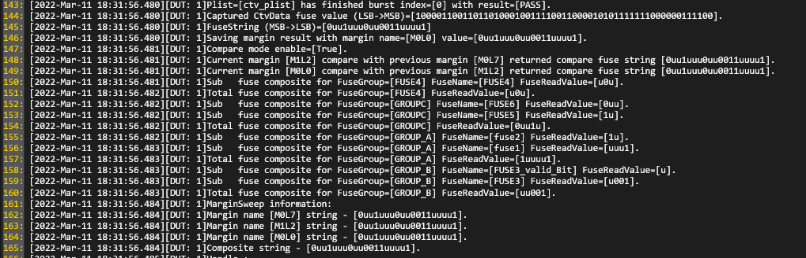
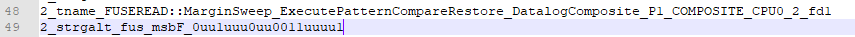
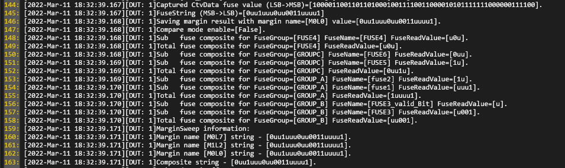
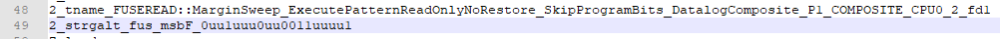
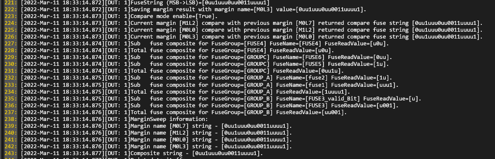
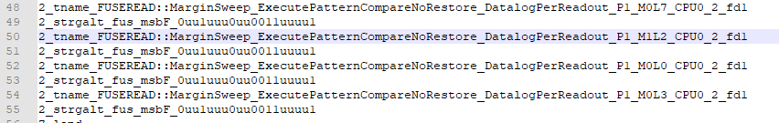
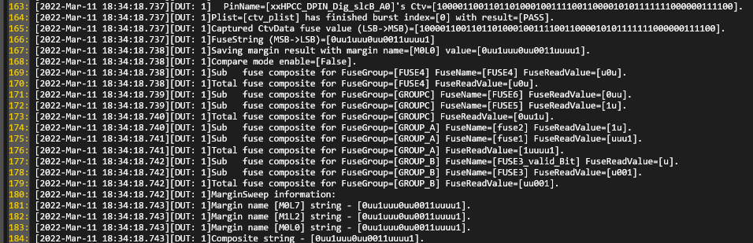
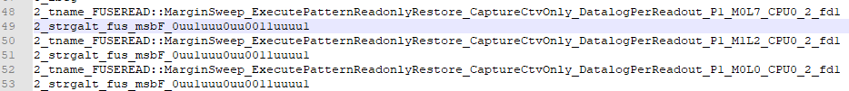

<h1>Prime Test-Method Specification REP</h1>

Jan 2024

[[_TOC_]]

## Important Notice
<font color="red">**From Prime v11.1 onward**</font><br>
- Fuseread testmethod no longer parse *.fuseread.json (configuration) file with AlephInit. The parsing will be at Verify(), please define the with test instance parameter 'ConfigurationFile'.<br>

## Methodology
The MarginSweep test method allow user to execute pattern using multiple margin settings defined in configuration file. MarginSweep features enable user to acquire ctv data and convert to fuse string, perform patterns modification, process margin result and datalog final composite string as result to ituff. Mainly relying on parameter defined in configuration file, test method will decide different flow of execution.

Flow of execution:

(Scenario of the flow here represent a test case where it begins with executing pattern, using CaptureFailureAndCtvPerPinTest mode as functional test, with multiple margin settings, perform pattern modify, print console log of any failure data captured, process margin result in compare mode to get final fuse composite string, restore original pattern data, and finally datalog to ituff.)

Verify:
- Validate test instance parameter.
- Validate capture pins from fuseDef json file.
- Setup fuse read handle based on configuration name, register name and execution mode from instance parameter.
- Setup patconfig handle.
- Setup functional test based using the captured pins, either in CaptureFailureAndCtvPerPinTest or CaptureCtvPerPinTest mode.

Execute:
- Apply test condition and functional test execution.
- Acquire all margin settings defined in json configuration file.
- Given if there are multiple margin settings, each setting will go through:
  - pattern modify execution, based on value acquired from margin setting.
  - print out failure data capture if there is any.
  - get ctv data, then process it using 1x/2x/3x algorithm (further explain below), and convert to fuse string. (This process will involve reversing fuse string from LSB->MSB (default) to MSB->LSB).
  - save fuse string along with margin name.
- Process margin result, comparing result of each margin which was saved earlier and generate final composite string.
- By Default, Fuse String is stored to sharedstorage with the key "fusestring_<registerName>". Unless user defined test instance parameter "SharedStorageKeyToStore". See "Test Instance Parameters" section for description.
- Given restore is enabled, test method will execute pattern modify again using value defined in configuration file (MarginDefaultValue).
* Please be aware this process will consume more test time.

## FuseRead Structure JSON File Example:

1. Scenario 1: Execute pattern -> compare margin result -> restore original pattern data -> datalog to ituff in composite mode.
```json
{
	"Configurations": [
		{
			"Name": "Config10",
			"Registers": [
			{
				"Name": "CPU0_2",
				"SimulationString": "1011110000001111111",
				"MarginSweep": {
					"EnableCompare": true,
					"ItuffPrintMode": "COMPOSITE",
					"EnableRestore": true,
					"MarginDefaultValue": "000000",
					"MarginSettings": [
					{
						"Name": "M0L7",
						"Value": "111011"
					},
					{
						"Name": "M1L2",
						"Value": "101010"
					},
					{
						"Name": "M0L0",
						"Value": "000000"
					}
				],
					"PatternModifyConfig": "PatternModify1"
				}
			}
		]
		}
	]
}
```

Console Output



Datalog Output



2. Scenario 2: Execute pattern, with bits skipping ('_') -> read only first margin setting -> no original pattern data restoration -> datalog to ituff in composite mode.
```json
{
    "Configurations": [
        {
            "Name": "Config10b",
			"Registers": [
				{
					"Name": "CPU0_2",
					"SimulationString": "1011110000001111111",
					"MarginSweep":
					{
						"EnableCompare": false,
						"ItuffPrintMode": "COMPOSITE",
						"EnableRestore": false,
						"MarginDefaultValue": "000000",
						"MarginSettings": [
							{
								"Name": "M0L7",
								"Value": "11_011"
							},
							{
								"Name": "M1L2",
								"Value": "101010"
							},
							{
								"Name": "M0L0",
								"Value": "0_0000"
							}
						],
						"PatternModifyConfig": "PatternModify1"
					}
				}
			]
        }
    ]
}
```

Console Output



Datalog Output



3. Scenario 3: Execute pattern -> compare margin result -> no pattern data restoration -> datalog to ituff in per_readout mode.
```json
{
    "Configurations": [
        {
            "Name": "Config11",
			"Registers": [
				{
					"Name": "CPU0_2",
					"SimulationString": "1011110000001111111",
					"MarginSweep":
					{
						"EnableCompare": true,
						"ItuffPrintMode": "PER_READOUT",
						"EnableRestore": false,
						"MarginDefaultValue": "000000",
						"MarginSettings": [
							{
								"Name": "M0L7",
								"Value": "111011"
							},
							{
								"Name": "M1L2",
								"Value": "101010"
							},
							{
								"Name": "M0L0",
								"Value": "000000"
							},
							{
								"Name": "M0L3",
								"Value": "000100"
							}
						],
						"PatternModifyConfig": "FuseConfig1"
					}
				}
			]
        }
    ]
}
```

Console Output



Datalog Output



4. Scenario 4: Execute pattern -> read only first margin setting -> restore original pattern data -> datalog to ituff in per readout mode.
```json
{
    "Configurations": [
        {
            "Name": "Config12",
			"Registers": [
				{
					"Name": "CPU0_2",
					"SimulationString": "1011110000001111111",
					"MarginSweep":
					{
						"EnableCompare": false,
						"ItuffPrintMode": "PER_READOUT",
						"EnableRestore": true,
						"MarginDefaultValue": "000000",
						"MarginSettings": [
							{
								"Name": "M0L7",
								"Value": "111011"
							},
							{
								"Name": "M1L2",
								"Value": "101010"
							},
							{
								"Name": "M0L0",
								"Value": "000000"
							}
						],
						"PatternModifyConfig": "FuseConfig1"
					}
				}
			]
        }
    ]
}
```

Console Output



Datalog Output



In json configuration file, MarginSweep section, user need to define taotal of 6 fields. Description mentioned as below:
1. EnableCompare:
   - TRUE (COMPARE): Compare aggregated result of each margin result. Eg: 2 margins (M0L1, M1L7), each margin result is saved and compared. Final result will be used as fuse composite string.
   A 'u' output character is used to indicate any mismatch bit exist in fuse composite string.
   - FALSE (READONLY): No comparison result is produced, and only (1) margin setting can be used. If multiple margin settings being defined, only the first margin setting will be process.

2. ItuffPrintMode:
   - COMPOSITE: Print only the final composite string.
   - PER_READOUT: Print each margin composite string.

3. EnableRestore:
   - TRUE: After pattern modify is executed, pattern data is restored to it's original data. 
   - FALSE: Keep pattern data modifed with last margin execution.

**With this parameter set to true, it is mandatory for user to define MarginDefaultValue, as test method will perform pattern modification again based on default value to restore the data.**

**Enabling restore also lead to test time increase.**

4. MarginDefaultValue:
   - Pattern modification data to be restored. Value must be defined when EnableRestore set to TRUE.
   - Otherwise, it could be keep empty. eg: "".

5. MarginSettings:
   - margin name: margin name for pattern modification. 
   - margin value: margin pin data to apply.

**Same margin values is allowed for different margin name.**

**Margin value allow bit '_' to perform pattern skip.** 

6. PatternModifyConfig:
   - Specify configuration name for pattern modify configuration.

## [Example] Voltage JSON File to Enable VBump Software Trigger.
[See Example. (if the link not working, proceed by manually navigate to FuseRead Readme.md)](./../../Readme.md) <br>

## Test Instance Parameters

The table below lists and describes the test instance parameters supported by the MarginSweep test method.

| **Parameter Name**         | **Required?** | **Type**        | **Values**                                         | **Comments**                                                         |
| -------------------------- | ------------- | --------------- | -------------------------------------------------- | -------------------------------------------------------------------- |
| ConfigurationFile          | Yes           | File            | Path to configuration file.                        | Able to use with "~HDMT_TPL_DIR".|
| Patlist                    | Yes           | Plist           | Plist name to be executed.                         |                                                                      |
| LevelsTc                   | Yes           | LevelsCondition | Levels test condition required for plist execution |                                                                      |
| TimingsTc                  | Yes           | TimingCondition | Timing test condition required for plist execution |                                                                      |
| Preplist                   | No            | String          | Preplist element to be executed                    | Default is empty.                                                    |
| MaskPins                   | No            | String          | Comma separated list of pins for which the fail data capture will be skipped | Default is empty string                    |
| ConfigName                 | Yes           | String          | FuseRead configuration name                        | Configuration name specified to execute marginSweep.                 |
| RegisterName               | Yes           | String          | FuseRead register name                             | Target register name to execute marginSweep.                         |
| SharedStorageKeyToStore        | No            | CommaSeparatedString | SharedStorage Key name.                       | Allow user to store fusestring to provided sharedstorage key.    |
| ExecutionMode                  | No            | String (choice) | ExecutePattern (Default), SimulationMode, UsePreviousData  | By default is in ExecutePattern mode. UsePreviousData is not supported. See below table for more details. |
| EnableCaptureFunctionalFailure | No        | String (choice) | False, True (Default)                              | False indicate CaptureCtvPerPinTest, true indicate CaptureFailureAndCtvPerPinTest. |
| DatalogMode                    | No            | String (choice) | ENABLED(Default), DISABLED                           | To enable or disable the datalogging in ituff. |
| FuseGroupToDatalog             | No            | CommaSeparatedString | Valid Register FuseGroupName | Default is empty. Use to datalog the fuse string of the FuseGroupName. |


Table for ExecutionMode:

| **ExecutionMode**             | **Pattern Executed?** | **Fuse String Source**                                          |
| ------------------------------| --------------------- | --------------------------------------------------------------- | 
| ExecutePattern(Default)       | Yes                   | Ctv from pattern execution.                                     |
| UsePreviousData               | No                    | Fuse string from previous fuseread instance.                    |
| SimulationMode                | Not supported         | Not supported.                                                  |
**Special Case

FuseGroupToDatalog

If test insteance parameter FuseGroupToDatalog is being defined, the fuse string value of the fusegroup defined will be:
- Printed to Ituff
- Stored in DUT scope shared storage(string type) in the format of "fuseread_<FuseGroupName>" or "fuseread_<dieIDName>_<FuseGroupName>".

if the FuseGroupName having backslash (\\), ex AAA\BBB_C, it is required to written as double backslash (\\\\) because single backslash is considered as programming syntax for escape.

Example for instance parameter. FuseGroupToDatalog = "AAA\\\BBB_C,XXX\\\YYY_Z";

Example for fuseDef file. "Name": "AAA\\\BBB_C";

The printing to ituff that include fuse group name will still appear as single backslash.
```
2_tname_<instance_name>_<registerName>_AAA\BBB_C
2_tname_<instance_name>_<registerName>_XXX\YYY_Z
```

## ConvertCtvDataToFuseString
Number of CTVs that are defined in the pattern is equivalent to total number of fuse-bits that are captured by fuseread. First captured vector is corresponding to "first" fuse read bit 0 (LSB). The last captured vector corresponds  to "last" fuse bit (MSB).
Hence, fuse string is arranged in LSB->MSB by default.

Using this fuse string, ConvertCtvDataToFuseString function will determine 1x/2x/3x decode using the algorithm below:

2x decode algorithm:

1 + 1 = 1

0 + 0 = 0

1 + 0 = u

0 + 1 = u

3x decode algorithm:

1 + 1 + 1 = 1

0 + 0 + 0 = 0 

Else Programmed to u

**Use case example:**

Given that fuse size is 19, defined in fuseDef file.
- 0011110000001111111
   - ctv data readout is also 19 bits. This is belongs to 1x and no further decode needed.
- 00111100000011111110101000011001111001
   - ctv data readout is 38 bits. 
   - 2x decode is performed and give fuse string result 0uu1uu00uu001111uu1
- 001111000000111111101010000110011110010001011011001100001
   - ctv data readout is 57 bits.
   - 3x decode is performed and give fuse string result 0uu1uuu0uu0011uuuu1

Before finishing up, fuse string result will convert to MSB->LSB arrangement, for post-processing and printout to ituff.

## Ituff Print Format

**Ituff format:**

2_tname_<instance_name>_<margin_name>_<fd#chunk_number_for_Aries_database_length>
2_strgalt_fus_msbF_<fuse_bits_values>
2_tname__<instance_name>_COMPOSITE_<fd#chunk_number_for_Aries_database_length>
2_strgalt_fus_msbF_<fuse_bits_values>

The 2_tname_ will have _fd<#> (“fuse data”) appended to the end of it, beginning with “_fd1”.  
This is necessary to support lengthy fuse strings, broken into chunks, to load successfully within the Aries database restrictions.  
The first chunk will have _fd1 appended to it, the second chunk _fd2, and so on.  
To reconstruct the original string the data associated with _fd1 is the first chunk of data and the strings following it in order should be appended to the end of the string. 
“Strgalt” chunk size is exactly 2,000 characters.

**Execution mode COMPARE, ituff datalog COMPOSITE Example:**


**Execution mode COMPARE, ituff datalog PER_READOUT Example:**


## Custom User Code Hooks
Example - SampleTP - Test CustomMarginSweep CustomMarginSweep_ExecutePatternCompareRestore_DatalogComposite_P1

void CustomDatalogFuseStringByFuseGroupName(IFuseReadHandle fuseReadHandle)
```c++
        /// <summary>
        /// Same DatalogFuseStringByFuseGroupName but with additional message printed.
        /// </summary>
        /// <param name="fuseReadHandle">Fuse read handler that contain test register information.</param>
        void IMarginSweepExtensions.CustomDatalogFuseStringByFuseGroupName(IFuseReadHandle fuseReadHandle)
        {
            foreach (var fuseGroupName in this.FuseGroupToDatalog.ToList())
            {
                var fuseString = fuseReadHandle.GetFuseStringByFuseGroup(fuseGroupName);
                FuseDataManager.SharedStorage.StoreFuseGroupToDatalogToSharedStorage(fuseGroupName, string.Empty, fuseString, this.SessionContext);
                if (this.DatalogMode == EnabledDisabledModes.ENABLED)
                {
                    FuseDataManager.Datalog.DatalogFuseGroupFuseStringToItuff(fuseReadHandle.GetRegisterName(), fuseString, fuseGroupName, this.SessionContext);
                }
            }
        }
```
## TPL Samples
Here are a few test instance examples using the MarginSweep test method:
```c++
Test PrimeFuseReadMarginSweepTestMethod MarginSweep_ExecutePatternCompareRestore_DatalogComposite_P1
{
	ConfigurationFile = "~HDMT_TPL_DIR/Modules/FuseRead/FuseRead/InputFiles/scenario10.fuseRead.json";
	Patlist = "ctv_plist";
    TimingsTc = "FUSEREAD::basic_func_timing_10MHz_20MHz";
    LevelsTc = "FUSEREAD::basic_func_lvl_nom";
	ConfigName = "Config10";
	RegisterName = "CPU0_2";
	ExecutionMode = "ExecutePattern";
	LogLevel = "PRIME_DEBUG";
	FuseGroupToDatalog = "GROUP_A,GROUP_B";
}

Test PrimeFuseReadMarginSweepTestMethod MarginSweep_ExecutePatternCompareRestore_DatalogComposite_StoreFuseStringToCustomSharedStorage_P1
{
	ConfigurationFile = "~HDMT_TPL_DIR/Modules/FuseRead/FuseRead/InputFiles/scenario10.fuseRead.json";
	Patlist = "ctv_plist";
    TimingsTc = "FUSEREAD::basic_func_timing_10MHz_20MHz";
    LevelsTc = "FUSEREAD::basic_func_lvl_nom";
	ConfigName = "Config10";
	RegisterName = "CPU0_2";
	SharedStorageKeyToStore = "AnyKeyCPU";
	ExecutionMode = "ExecutePattern";
	LogLevel = "PRIME_DEBUG";
	FuseGroupToDatalog = "GROUP_A,GROUP_B";
}

Test PrimeFuseReadMarginSweepTestMethod MarginSweep_ExecutePatternReadOnlyNoRestore_SkipProgramBits_DatalogComposite_P1
{
	ConfigurationFile = "~HDMT_TPL_DIR/Modules/FuseRead/FuseRead/InputFiles/scenario10b.flame.fuseRead.json";
	Patlist = "ctv_plist";
    TimingsTc = "FUSEREAD::basic_func_timing_10MHz_20MHz";
    LevelsTc = "FUSEREAD::basic_func_lvl_nom";
	ConfigName = "Config10b";
	RegisterName = "CPU0_2";
	ExecutionMode = "ExecutePattern";
	LogLevel = "PRIME_DEBUG";
}


Test PrimeFuseReadMarginSweepTestMethod MarginSweep_ExecutePatternCompareNoRestore_DatalogPerReadout_P1
{
	ConfigurationFile = "~HDMT_TPL_DIR/Modules/FuseRead/FuseRead/InputFiles/scenario11.flame.fuseRead.json";
	Patlist = "ctv_plist";
    TimingsTc = "FUSEREAD::basic_func_timing_10MHz_20MHz";
    LevelsTc = "FUSEREAD::basic_func_lvl_nom";
	ConfigName = "Config11";
	RegisterName = "CPU0_2";
	ExecutionMode = "ExecutePattern";
	LogLevel = "PRIME_DEBUG";
}

Test PrimeFuseReadMarginSweepTestMethod MarginSweep_ExecutePatternReadonlyRestore_CaptureCtvOnly_DatalogPerReadout_P1
{
	ConfigurationFile = "~HDMT_TPL_DIR/Modules/FuseRead/FuseRead/InputFiles/scenario12.flame.fuseRead.json";
	Patlist = "ctv_plist";
    TimingsTc = "FUSEREAD::basic_func_timing_10MHz_20MHz";
    LevelsTc = "FUSEREAD::basic_func_lvl_nom";
	ConfigName = "Config12";
	RegisterName = "CPU0_2";
	ExecutionMode = "ExecutePattern";
	EnableCaptureFunctionalFailure = "False";
	LogLevel = "PRIME_DEBUG";
}

Test PrimeFuseReadMarginSweepTestMethod ExecuteMarginSweep_SingleRegister_PreInstanceSetSimulationString_SimulationEnable_P1
{
	ConfigurationFile = "~HDMT_TPL_DIR/Modules/FuseRead/FuseRead/InputFiles/scenario12.flame.fuseRead.json";
	Patlist = "ctv_plist";
    TimingsTc = "FUSEREAD::basic_func_timing_10MHz_20MHz";
    LevelsTc = "FUSEREAD::basic_func_lvl_nom";
	ConfigName = "Config12";
	RegisterName = "CPU0_2";
	ExecutionMode = "SimulationMode";
	EnableCaptureFunctionalFailure = "False";
	LogLevel = "PRIME_DEBUG";
	PreInstance = "PrimeSetSimulationString(CPU0_2@1010110101010101010)";
}
```

## Exit Ports
MarginSweep test method supports the following exit ports:
| **Exit Port** | **Condition**   | **Description**              |
| ------------- | --------------- | ---------------------------- |
| **0**         | ***Fail***      | Failing condition            |
| **1**         | ***Pass***      | Passing condition            |
| **2-9**       | ***Fail***      | Failing condition            |
User can overwrite the passing/failing condition with the mtpl file using the Property PassFail.
If you want to use more than port 9 for the exit port, you can do so by using usercode or submit request to Prime team.

## Additional Dependencies
N/A

## Version Tracking
| Prime Version     | Prime ticket reference | **Comments** |
| ----------------- | ---------------------- | ------------ |
| 13.03.00          | #59279                 | Enhance fuse string fail to convert RLE format error message and should exit port 0.|
| 13.00.00          | #43528                 | New test instance parameter 'SharedStorageKeyToStore' for storing fusestring to user provided sharedstorage key.|
| 13.00.00          | #40512                 | Enhance to support UsePreviousData execution mode.|
| 12.00.00          | #35539                 | Enhance to support VBUMP Software Trigger like evergreen for FuseReadMarginSweepTM.|
| 12.00.00          | -                      | Removed Engineering printing to console. |
| 11.01.00          | #32055                 | Parse configuration file at testmethod instead of AlephInit. |
| 11.01.00          | #33560                 | Removal of SetSimulationString interface. |
| 11.01.00          | #33523                 | New logic for callback/preinstance of PrimeSetSimulationString. |
| 2.0.0 June, 2022  |                        | Added Test Method Extension/User Custom code for CustomDatalogFuseStringByFuseGroupName. Supported Prime 10.0.0 onward.|
| 1.0.1 March, 2022 |                        | Revamps description on convert ctv and configuration structure info. |
| 1.0.0 March, 2022 |                        | |

## Acronyms
Definition of acronyms used in this document:

  - **REP**: P**r**ime T**e**st-Method S**p**ecification
  - **HDMT**: High Density Modular Tester
  - **TPL**: Test Programming Language
  - **TOS**: Test Operating System
  - **DFF**: Data Feed Forward