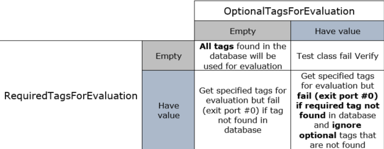

[[_TOC_]]

## REP for GfxEvaluate

This **REP** is intended to describe the GfxEvaluate Prime test method.

Prior to reading this REP, it is recommend to read the GfxAggregator SDK to get an overview of the GFX methodology and the infrastructure for it in PRIME :)

In this document, you will find the below sections:

  - **Methodology** – A detailed description of this test method intention and purpose

  - **Parameters** – A table describes each instance parameter (Name, Type, Default, Required?)

  - **Console output** – A detailed description of what is printed to console by this test method
  
  - **Datalog output** – A detailed description of what is printed to datalog by this test method

  - **Custom User Code hooks** – A list of functions available to the user code to override

  - **TPL Samples** – Examples of how to use this test method in a TPL file

  - **Exit Ports** - A table describes each exit port

  - **Additional Dependencies** – More to consider for this test method to operate

  - **Version tracking** – With author names, so you always have a name to address

  - **Acronyms** - Definition of acronyms used in this document

## Methodology

The GfxEvaluate test method is using to collect data from previous executions (such as PrimeGfxScoreBoard test method & AddTagBySkuName GfxAggregator API) to evaluate and calculate the final SKU (GFX recovery option).

Have to mention that the EIDs are collected from various contents which related to one specific area, which are stored (tagged) in GFX aggregator.

### Verify

- Validate input parameters.
	
	- The area and content are required parameters, so they cannot be empty strings, In case that some parameters are invalid an appropriate exception will be thrown. 

- Validate existence of the required data in the databases.

	- The recieved area name and content name must be exist in the shared storage, otherwise can`t find the appropriate EIDs for evaluation.

### Execute

- Evaluate SKU based on the collected data according to the required and optional tags that the user define.

- Tag EIDs pass/fail status in GFX aggregator.

- Update the EIDs statuses according to the evaluation result.

	o In case current area have derived areas (i.e. areas that use current areas as refArea), the test method will evaluate SKU for the main area

- Datalog HRY and evaluation result

	o In case current area have derived areas (i.e. areas that use current areas as failure refArea), the test method will datalog the SKU for the main area

- Write to SharedStorage the SKU result and failing recovery groups

## Test Instance Parameters

The table below lists and describes the test instance parameters supported by the GfxEvaluate test method

| **Parameter Name**            | **Required?** | **Type**        | **Description**                                                                                        | **Default value**                  | **Comments**                       			|
| ------------------            | ------------- | --------------- | ------------------------------------------------------------------------------------------------------ | ---------------------------------- | -------------------------------------------   |
| RequiredTagsForEvaluation                       | NO           | String           | Specify required tags to use for evaluation, fail if tag does not exist. Regex is supported |                                    |check the table which defines the relations between the status of the required and optional tags.                                    			|
| OptionalTagsForEvaluation                       | NO           | String           | Specify optiona tags to use for evaluation, ignore tags that does not exist. Regex is supported |                                    |check the table which defines the relations between the status of the required and optional tags.                                    			|
| Area                          | YES           | String          | Specify the area name to which the recovery groups and SKUs are relevant                               |                                    |                                   			|
| Content                       | YES            | String          | Specify the content name to which the recovery groups and SKUs are relevant                            |                                    |Content must be unique per area     			|
| Tag                           | NO            | String          | Specify the tag to mark the EID’s status of current instance in SharedStorage                          |                                    |                                  			    |
| StartSku                      | NO            | String          | Specify the start SKU for evaluation                                                                   |                                    |Read about the predefinition of the StartSku                                		    |
| EndSku                        | NO            | String          | Specify the end SKU for evaluation                                                                     |                                    |Read about the predefinition of the EndSku                                   			|
| ResultSkuKey                  | NO            | String          | Specify the name of the result SKU that will be written to SharedStorage                               |                                    |                                    			|
| FailRecoveryGroupsKey         | NO            | String          | Name of the fail recovery groups for the evaluated SKU that will be written to SharedStorage           |                                    |												|
| HryRawStringDatalog           | NO            | String          | Specify if HRY raw string is to be datalog                                                             |ENABLE                      |ENABLE/DISABLE									|
| HryTreeLevelDatalog           | NO            | Integer          | Specify up to which HRY tree level to datalog.                                                         | -1                          |means there will be no HRY tree level datalog. |

##Tags evaluation

With the instance parameters RequiredTagsForEvaluation and OptionalTagsForEvaluation, the user can specify which of the tags in the GFX infrastructure database will be used to perform the evaluation.

Following is how the test method handles different scenarios of specifying values in these parameters:

##Importing data from SharedStorage

The start and end SKU, could be placed at shared storage, and the instance parameters StartSku and EndSku contains its key at shared storage. 

The user should provide the keys according to the business logic input data.

SharedStorage's format: The SharedStorage's specific key follows the format S.<Context>.<Key>, where the Context is the context of the data (L=Lot, D=Dut, I=Ip), and the Key is the key in the respective table.

##Exporting data to SharedStorage

The evaluated SKU, exported to the SharedStorage specified in ResultSkuKey parameter, will be used down the flow in the TP for flow forking based on SKU. 

The evaluated FRG (Failed recovery groups), exported to the SharedStorage specified in FailRecoveryGroupsKey parameter, will be used down the flow in the TP for flow forking based on FRG. 

## Using pre-defenition for the "StartSku" and "EndSku" parameters

The “startSku”  && "endSku" instance parameters can be set globally in GfxStartOfDevice test method instance or locally in GfxEvaluate instance (in such case the global value is overwritten for that specific instance evaluation).

Besides that, if there is no pre-definition by the GfxStartOfDevice test method, and received an empty strings in the GfxEvaluate test method input, the global skus that been defined in the input files will be used. 

## SKU evaluation

The test method uses the collected EID’s pass/fail information in order to evaluate the corresponding SKU, which can be either:

**SKU** that match the start SKU:

- This is considered as passing die
	
- test method will exit on port 1

**SKU** that is within the boundaries of the start & end SKU (but does not match either):
		
- This is considered as recovered die
		
- test method will exit on port 2
	
**SKU** that match the end SKU:
		
- This is considered as recovered die

- test method will exit on port 3

**SKU** is defined in the SKU’s config file, but after the end SKU:
		
- This is considered as fail die

- test method will exit on port 4

**SKU** is defined in the SKU’s config file, but before the start SKU:
		
- This is considered as fail die
	
- test method will exit on port 5

**SKU** is not defined in the SKU’s config file:
		
- This is considered as fail die
	
- Datalog NO_VALID_SKU
	
- test method will exit on port 6

##TPL Samples

Example of an evaluation test method test in the .mtpl file:

	Test PrimeGfxEvaluatetest method GFXEvaluate_Execute_Pass_P2
	{
		LogLevel = "PRIME_DEBUG";
		Area = "GT_CHIPLETS";
		StartSku = "";
		EndSku = "";
		Tag = "EvalPass";
		ResultSkuKey = "";
		Content = "SCAN";
		RequiredTagsForEvaluation = "";
		OptionalTagsForEvaluation = "";
		HryTreeLevelDatalog = -1;
	}

## Console output (debug mode)

###Output for a passing test
		
	=========================
	Running Verify() for test instance=[GFX::GFXEvaluate_Execute_Pass_P2_Execute_Pass_P2]
	=========================
	[DUT: 1]Below are the list of parameters and its value for this Instance:
	[DUT: 1]Area: GT_CHIPLETS
	[DUT: 1]BypassPort: -1
	[DUT: 1]Content: SCAN
	[DUT: 1]EndSku:
	[DUT: 1]FailRecoveryGroupsKey:
	[DUT: 1]HryRawStringDatalog: ENABLED
	[DUT: 1]HryTreeLevelDatalog: -1
	[DUT: 1]LogLevel: PRIME_DEBUG
	[DUT: 1]MemoryAndTimeProfiling: DISABLED
	[DUT: 1]OptionalTagsForEvaluation:
	[DUT: 1]RequiredTagsForEvaluation: GT_*
	[DUT: 1]ResultSkuKey:
	[DUT: 1]StartSku:
	[DUT: 1]Tag: testWrite
	[DUT: 1]
	[DUT: 1]================================================================
	[DUT: 1]Test instance=[GFX::GFXEvaluate_Execute_Pass_P2_Execute_Pass_P2] verified using 835.801617 ms
	[DUT: 1]
	=========================
	Running Execute() for test instance=[GFX::GFXEvaluate_Execute_Pass_P2_Execute_Pass_P2]
	=========================
	[DUT: 1]Failed Recovery Groups for recovery 000000111 are:LNIECS_0, LNIECS_1, GT4_RC0
	[DUT: 1]Recovery Sku for recovery 000000111 is:3x8S01
	[DUT: 1]Printed to ituff:
	[DUT: 1]2_tname_GFX::GFXEvaluate_Execute_Pass_P2_Execute_Pass_P2_HRY_RAWSTR
	[DUT: 1]2_strgval_0000000000000004400000000000000400000004----------55555555555555555555555555555555555555555555555555555555555555555555555555555555555555555555555555555555555555555555555555555555555555555555555555555555555555555555555555555555555555555555555555555555555555555555555555555555555555555555555555555555555555555555555555555555555555555555555555555555555555555555555555555555555555555555555555555555555555555555555555555555555555555555555555555555555555555555555555555555555555555555555555555555555555555555555555555555555555555555555555555555555555555555555555555555555555555555555555555555555555555555555555555555555555555555555555555555555555555555555555555555555555555555555555555555555555555555555555555555555555555555555555555555555555555555555555555555555555555555555555555555555555555555555555555555555555555555555555555555555555555555555555555555555555555555555555555555555555555555555555555555555555555555555555555555555555555555555555555555555555555555555555555555555555555555555555555555555555555555555555555555555555
	[DUT: 1]2_tname_GFX::GFXEvaluate_Execute_Pass_P2_Execute_Pass_P2_SKU
	[DUT: 1]2_strgval_3x8S01
	[DUT: 1]2_tname_GFX::GFXEvaluate_Execute_Pass_P2_Execute_Pass_P2_FRG
	[DUT: 1]2_strgval_LNIECS_0|LNIECS_1|GT4_RC0
	[DUT: 1]2_tname_GFX::GFXEvaluate_Execute_Pass_P2_Execute_Pass_P2_FPID
	[DUT: 1]2_strgval_16|31|15|39
	[DUT: 1]2_tname_GFX::GFXEvaluate_Execute_Pass_P2_Execute_Pass_P2_TAGS
	[DUT: 1]2_strgval_GT_SCAN|GT_FUNC
	[DUT: 1]
	[DUT: 1]Test instance=[GFX::GFXEvaluate_Execute_Pass_P2_Execute_Pass_P2] executed using 281.476766 ms
	[DUT: 1]TestInstance=[GFX::GFXEvaluate_Execute_Pass_P2_Execute_Pass_P2] exit port=[2].
	[2022-Jun-20 10:29:23.301][A][TAL] StopTest PrimeGfxEvaluatetest method::GFX::GFXEvaluate_Execute_Pass_P2_Execute_Pass_P2  2022-Jun-20 10:29:23
	[2022-Jun-20 10:29:23.301][A][TAL] StartTest PrimeGfxScoreBoardtest method::GFX::GFXScoreboardGTFUNC1000_Execute_Fail_GT_FUNC_1000_P3  2022-Jun-20 10:29:23
	[DUT: 1]

###Output for a failing test (No tags found for evaluation)

	
	=========================
	Running Verify() for test instance=[GFX::GFXEvaluate_Execute_Fail_SKU_No_Tag_data_FNeg1]
	=========================
	[DUT: 1]Below are the list of parameters and its value for this Instance:
	[DUT: 1]Area: GT_PRIME
	[DUT: 1]BypassPort: -1
	[DUT: 1]Content: SCAN
	[DUT: 1]EndSku:
	[DUT: 1]FailRecoveryGroupsKey:
	[DUT: 1]HryRawStringDatalog: ENABLED
	[DUT: 1]HryTreeLevelDatalog: -1
	[DUT: 1]LogLevel: PRIME_DEBUG
	[DUT: 1]MemoryAndTimeProfiling: DISABLED
	[DUT: 1]OptionalTagsForEvaluation:
	[DUT: 1]RequiredTagsForEvaluation: My_+
	[DUT: 1]ResultSkuKey:
	[DUT: 1]StartSku:
	[DUT: 1]Tag: EvalPass
	[DUT: 1]
	[DUT: 1]================================================================
	[DUT: 1]Test instance=[GFX::GFXEvaluate_Execute_Fail_SKU_No_Tag_data_FNeg1] verified using 394.707777 ms
	[DUT: 1]
	=========================
	Running Execute() for test instance=[GFX::GFXEvaluate_Execute_Fail_SKU_No_Tag_data_FNeg1]
	=========================
	[DUT: 1]ERROR:
	|	Error in instance=[GFX::GFXEvaluate_Execute_Fail_SKU_No_Tag_data_FNeg1]:
	|	Prime.Base.Exceptions.FatalException occured : No tags found for evaluation
	[DUT: 1]STACK TRACE:

	   at Prime.GfxAggregator.Cs.GfxAggregator.EvaluateTags(String areaName, Regex reqiuredTagsRegEx, Regex optionalTagsRegEx, String startSku, String endSku)

	   at Prime.test methods.GfxEvaluate.PrimeGfxEvaluatetest method.Execute()

	   at Prime.Kernel.Itest method.Execute()

	   at Prime.Kernel.PrimeKernel.Execute()
	[DUT: 1]Printed to ituff:
	[DUT: 1]2_tname_GFX::GFXEvaluate_Execute_Fail_SKU_No_Tag_data_FNeg1_ERROR
	[DUT: 1]2_strgval_DEFLATE32_NWIN3CWCGAIIL3YF35QS4FJEB7QVEROEEJNV6YDIR42VQE45JSSI7P6ZVC2YENZB44TR7B7MYVPGBFQ4MCFL5RSVVV34DLCYXEN7JJHUUTOAMOX25CNHICXBZZO6IHCOE5CMISX3JRNB76YKOK3TLTCPDCV6F4ICQ4CJUVJK2224IARO7GBAL7NCIVHYFG4NQLTL7E44UJ7QKPXP4BXBIPARIFM3IOWHYGAGXEU4P6XDUIHIBZ5PETO66TNGE4R2GLPL35A3VCRWFFSIT6WC3RFBGON67XJPZUWJ555B7EDQ====
	[DUT: 1]
	[DUT: 1]Test instance=[GFX::GFXEvaluate_Execute_Fail_SKU_No_Tag_data_FNeg1] executed using 169.460923 ms
	[DUT: 1]TestInstance=[GFX::GFXEvaluate_Execute_Fail_SKU_No_Tag_data_FNeg1] exit port=[-1].
	[2022-Jun-23 16:56:10.370][A][TAL] StopTest PrimeGfxEvaluatetest method::GFX::GFXEvaluate_Execute_Fail_SKU_No_Tag_data_FNeg1  2022-Jun-23 04:56:10
	[2022-Jun-23 16:56:10.371][A][TAL] StartTest PrimeGfxScoreBoardtest method::GFX::GFXScoreboard_Execute_Pass_Result_SKU_0110_Adding_Tag_P2  2022-Jun-23 04:56:10
	[DUT: 1]
		
**Example when printing an error** (Eid not found while trying to update eid status)

During the evaluation we may encounter eids from multiple contents, but we get one content in the test instance parameters, so in debug mode when trying to update eid it may be not related to the recieved content, and according to that the following output will be shown: 

	[DUT: 1]Failed to find PartId <partId> in current area <area_name> and contnet <content_name>, when trying to update eid <eidId> status
	[DUT: 1]Failed to find PartId 0 in current area GT and contnet FUNC, when trying to update eid 23 status
		
		
## Datalog output

The test method have various datalog capabilities.

Using StrgvalFormat, where [0/2_tname_... & 0/2_strgval_...] are automatically determined.

First of all, we have always two configuration files, one contains the EID data and tyhe other have the SKU data, 
so, all the outputs that appears in the datalog are given by the users in addition to the dynamic data which calculated in run time, such as the status for every eid, the final sku and more...

Example of the input files:

**SKU** File example

	"Area": [
    {
      "Name": "GT_CHIPLETS", "UpsRecoveryGroupStorageKey": { "Name": "GTSREC" },
      "RecoveryGroups": [
        { "Name": "DISP" },
        { "Name": "UNS_REQ_GT4" },
        { "Name": "UNS_REQ_GT3_GT4" },
        { "Name": "UNS_REQ" },
        { "Name": "UNS_VID" },
        { "Name": "2ND_VID" },
        { "Name": "LNIECS_0" },
        { "Name": "LNIECS_1" },
        { "Name": "GT4_RC0" }
      ],
      "SKUs": [
        {"Group": "5x8",
          "SKU": [
            { "Name": "5x8S012", "Recovery": "000000000",
              "Fuses": [
                { "Name": "GTSKU", 	  "Value": "111" },
                { "Name": "GT_SLICE", "Value": "000" },
                { "Name": "SS_DIS",   "Value": "10101" },
                { "Name": "L3", 	  "Value": "111" },
                { "Name": "EU", 	  "Value": "10010101011" }
              ]
            }
          ]
        }
	]

**EID** File example

	"Area": [
	{
      "Name": "GT_CHIPLETS",
      "HryHierarchy": { "EidNotTestedSymbol": "8", "EidNotExistSymbol": "9",
        "HrySymbol": [
          { "Symbol": "4", "Status": "FAIL" },
          { "Symbol": "3", "Status": "FAIL" },
          { "Symbol": "2", "Status": "FAIL" },
          { "Symbol": "0", "Status": "FAIL" },
          { "Symbol": "1", "Status": "PASS" }
        ]
      },
      "Content": [
        {
          "Name": "SCAN",
          "EIDs": { "MaxSize": 8192,
            "Eid": [
              { "Id": "0", "PartId": "0", "RecoveryGroup": "COMPUTE0_DSS0", "HryLevels": "GT_CHIPLETS COMPUTE0_DSS0 GT_CHIPLETSCOMPTILE0-GT_CHIPLETSDSSM0-EUTOP0" },
              { "Id": "1", "PartId": "1", "RecoveryGroup": "COMPUTE0_DSS0", "HryLevels": "GT_CHIPLETS COMPUTE0_DSS0 GT_CHIPLETSCOMPTILE0-GT_CHIPLETSDSSM0-EUTOP1" },
              { "Id": "2", "PartId": "2", "RecoveryGroup": "COMPUTE0_DSS0", "HryLevels": "GT_CHIPLETS COMPUTE0_DSS0 GT_CHIPLETSCOMPTILE0-GT_CHIPLETSDSSM0-EUTOP6" },
              { "Id": "3", "PartId": "3", "RecoveryGroup": "COMPUTE0_DSS0", "HryLevels": "GT_CHIPLETS COMPUTE0_DSS0 GT_CHIPLETSCOMPTILE0-GT_CHIPLETSDSSM0-EUTOP7" },
              { "Id": "4", "PartId": "4", "RecoveryGroup": "COMPUTE0_DSS0", "HryLevels": "GT_CHIPLETS COMPUTE0_DSS0 GT_CHIPLETSCOMPTILE0-GT_CHIPLETSDSSM0-EUSIDE4" },
              { "Id": "5", "PartId": "5", "RecoveryGroup": "COMPUTE0_DSS0", "HryLevels": "GT_CHIPLETS COMPUTE0_DSS0 GT_CHIPLETSCOMPTILE0-GT_CHIPLETSDSSM0-EUSIDE5" }
			 ]
		}
	}
	
**Ituff examples**

**HRY** raw string datalog

This datalog is enabled by default.

To avoid this datalog, instance should be set with: HryRawStringDatalog = “DISABLED”.

Each EID status occupies one character where the location of the character represents the EID ID (zero based).

If a strgval greater than 4000 characters occurs, will generate more strgval pairings.

		Datalog format
		2_tname_<Module::Instance>_HRY_RAWSTR_<wrap counter>
		2_strgval_<HRY raw string>

		Note: When HryPerPattern is ENABLE, the format will include the pattern index (zero based) and the HRY raw string that is relevant to it.
		2_tname_<Module::Instance>_pattern_<index>_HRY_RAWSTR_1
		2_strgval_<HRY raw string>

		Example
		2_tname_GFX::GFXEvaluate_Execute_Pass_P2_HRY_RAWSTR_1
		2_strgval_0444141444140001999999991110404140044404

		When hry is greater than 4000 characters, the <wrap counter> will generate more tname/strgval pairings: 
		2_tname_GFX::GFXEvaluate_Execute_Pass_P2 _HRY_RAWSTR_2
		2_strgval_111… <up to 4000 characters>
		2_tname_GFX::GFXEvaluate_Execute_Pass_P2 _HRY_RAWSTR_3
		2_strgval_108… <up to 4000 characters>
		
###**SKU** datalog

This datalog is always enabled (not user configurable).

		2_tname_<Module name::Instance name>_SKU
		2_strgval_<SKU name>
		
###**FRG** datalog

This datalog is always enabled (not user configurable).

		2_tname_<Module name::Instance name>_FRG
		2_strgval_<Fail Recovery Groups, pipe-separated>
		
###**FEID** or **FPID** datalog

This datalog is always enabled (not user configurable).

When the given evaluated tags are of multiple contents, the FPID (Fail Partition ID) will be datalog instead of FEID (Fail Engine ID).

		2_tname_<Module name::Instance name>_FEID_1  
					<Wrap counter enabled for FEID & FPID>.
		2_strgval_<Fail EID’s, pipe-separated>
		
###**TAGS** datalog

		2_tname_ <Module name::Instance name>_TAGS
		2_strgval_<TAGS, pipe-separated>

Note:
 
When HryPerPattern is ENABLE, the format will include the pattern index (zero based) and the evaluation data that is relevant to it.

When evaluation found valid SKU:

		2_tname_GFX::GFXEvaluate_Execute_Pass_P2_Execute_Pass_P2_SKU
		2_strgval_5x8S012
		2_tname_GFX::GFXEvaluate_Execute_Pass_P2_Execute_Pass_P2_FRG
		2_strgval_DISP|LNIECS_1
		2_tname_GFX::GFXEvaluate_Execute_Pass_P2_Execute_Pass_P2_FEID
		2_strgval_32|31

When evaluation found no SKU:

		2_tname_GFX::GFXEvaluate_Execute_Pass_P2_Execute_Pass_P2_SKU
		2_strgval_NO_VALID_SKU
		2_tname_GFX::GFXEvaluate_Execute_Pass_P2_Execute_Pass_P2_FRG
		2_strgval_DISP|UNS_REQ_GT4|UNS_REQ_GT3_GT4|UNS_REQ|UNS_VID|2ND_VID|LNIECS_0|LNIECS_1|GT4_RC0
		2_tname_GFX::GFXEvaluate_Execute_Pass_P2_Execute_Pass_P2_FEID
		2_strgval_0|1|2|3|4|5|6|7|8|9|10|11|12|13|14|15|16|17|18|19|20|21|22|23|24|25|26|27|28|29|30|32|33|34|35|36|37|38|31|31|39|39
		
Example with no failure:

		2_tname_GFX::GFXEvaluate_Execute_Pass_P2_Execute_Pass_P2_SKU
		2_strgval_5x8S012
		2_tname_ GFX::GFXEvaluate_Execute_Pass_P2_Execute_Pass_P2_FEID_1
		2_strgval_NONE
		2_tname_ GFX::GFXEvaluate_Execute_Pass_P2_Execute_Pass_P2_FRG
		2_strgval_NONE
		2_tname_ GFX::GFXEvaluate_Execute_Pass_P2_Execute_Pass_P2_TAGS
		2_strgval_NONE

Example with some failure:

		2_tname_GFX::GFXEvaluate_Execute_Pass_P2_Execute_Pass_P2_SKU
		2_strgval_3x8S012
		2_tname_ GFX::GFXEvaluate_Execute_Pass_P2_Execute_Pass_P2_FEID_1
		2_strgval_31|39
		2_tname_ GFX::GFXEvaluate_Execute_Pass_P2_Execute_Pass_P2_FRG
		2_strgval_LNIECS_1|GT4_RC0
		2_tname_ GFX::GFXEvaluate_Execute_Pass_P2_Execute_Pass_P2_TAGS
		2_strgval_GTScanTag
		
**HRY tree level**

The HRY tree contains the eids in the leafs, and the other nodes contains the levels that every EID element has, 
such that the hry levels that been defined in the EID e,ement represents the path from the root to the appropriate leaf. 

This datalog is disabled by default (instance is setup with: HryTreeLevelDatalog = -1).

To get this datalog, instance should be set with HryTreeLevelDatalog value higher than -1 (where 0 is valid as it is the tree root).

The HRY tree level datalog format and structure are described earlier in this document.

In general, the HRY tree provides capability to group EID’s to logical levels so that each level holds the merged status of all the EID’s it includes.

(datalog example of hry tree up to level 2)

		2_tname_GFX::GFXEvaluate_Execute_Pass_P2_HRY_LEVEL0_GT_CHIPLETS
		2_strgval_4
		2_tname_GFX::GFXEvaluate_Execute_Pass_P2_HRY_LEVEL1_GT_CHIPLETS_COMPUTE0_DSS0
		2_strgval_4
		2_tname_GFX::GFXEvaluate_Execute_Pass_P2_HRY_LEVEL2_GT_CHIPLETS_COMPUTE0_DSS0_GT_CHIPLETSCOMPTILE0-GT_CHIPLETSDSSM0-EUTOP0
		2_strgval_0

## Exit Ports

The GfxEvaluate test method supports the following exit ports:

| **Exit Port** | **Condition** | **Description**                              |
| ------------- | ------------- | -------------------------------------------- |
| **-2**        | ***Alarm***   | Any hardware alarm. 						   |
| **-1**        | ***Error***   | Any test class error				 		   |
| **0**         | ***Fail***    | Any test class setup or logic failure (ex: config file parsing)|
| **1**         | ***Pass***    | Full passing die – the test method evaluated SKU is the same as the start SKU|
| **2**         | ***PASS***    | Recovered die – the test method evaluated SKU is within the boundaries of start & end SKU.|
| **3**         | ***PASS***    | Recovered die – the test method evaluated SKU is same as the end SKU|
| **4**         | ***Fail***    | Fail die - the test method evaluated SKU is defined in SKU config file but it is after the end SKU |
| **5**         | ***Fail***    | Fail die - the test method evaluated SKU is defined in SKU config file but it is before the start SKU|
| **6**         | ***Fail***    | Fail die - the test method evaluated SKU is not defined in SKU config file|
| **7**         | ***Fail***    | Fail die – DOA found							|

## Acronyms

Definition of acronyms used in this document:

  - **REP**: P**r**ime T**e**st-Method S**p**ecification
  - **EID**: E**n**gine **I**dentifier
  - **TP**: T**e**st Pr**o**gram
  - **HRY**: H**u**man R**e**adable Y**i**eld
  - **PID**: P**a**rtition **I**dentifier
  - **FRG**: F**a**iled **R**ecovery **G**roups
  - **TPL**: **T**est P**r**ogramming L**a**nguage
  - **DOA**: **D**ead O**n** A**r**rival
  

## Version tracking

| **Date**                  | **Version** | **Author**        | **Comments**    |
| ------------------------- | ----------- | ----------------- | --------------- |
| June 19th, 2022 | 1.0.0       | Awaisy, Gadeer| Initial version |