[[_TOC_]]

## REP for PacketRepair

This **REP** is intended to describe the PackeRepair Prime TestMethod.

## Methodology

This test method provides the capability to do repair and recovery for cache/array structures in graphics and display engines (GT & DE), using packet-based communications.

Recovery is a process, in which the test method steps through a sequence of voltages, to determine the highest SKU the unit can get. The list of possible SKUs, and voltages ranges are defined by user through an input file. 

A SKU consists of recovery groups. Each recovery group consists of EIDs and EUs as can be seen below. Please note that regardless of EUs/EIDs relation physically on the unit, in packet repair algorithms, EU can consist of multiple EIDs.

High level flow of PacketRepair methodology:

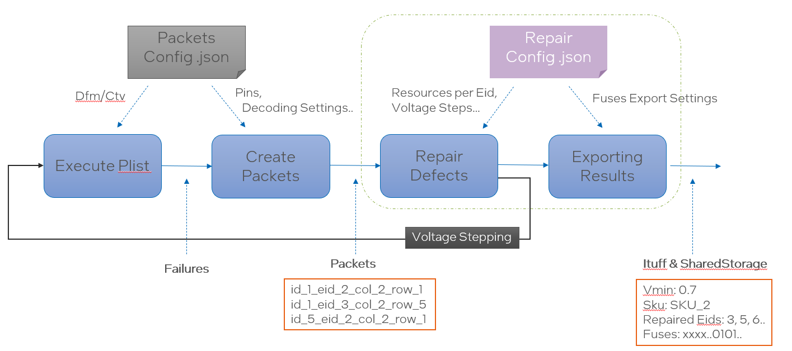

Remarks about the diagram above:
- "Execute Plist", and "Create Packets" steps are identical to PacketMonitor's process of packets creation. Please refer to PacketMonitor documentation for detailed info about packet creation.
  - These steps output (packets fields decoding) will be used as input to following step "Repair Defects".
- "Repair Defects" step will use packets fields to identify failing Eids and will do repair attempt based on available resources defined by user in "RepairConfig.json".
- The steps above will be run in loop (each time applying different voltage) - This is called "Voltage Stepping".
  - This loop stops according to certain logic which we will cover below.
- Once "Voltage Stepping" is done, results will be exported to ituff, shared storage (including Fuses). More details below.

### Repair Defects
#### Fields and defects extractions
In this step, we use the packets to determine failing Eids, and failing array cells within them.

Example of packets:

	id_1_eid_3_col_2_row_1_status_001
	id_2_eid_5_col_2_row_7_status_101
	id_55_eid_5_col_6_row_7_status_110

Each line represents a packet, and it's decoded fields. (See more info in PacketMonitor readme).

Not every field is used in packet repair to determine failing array cell. User will define which fields represents array cells.

This section in input file will tell the test method which fields are of interest.

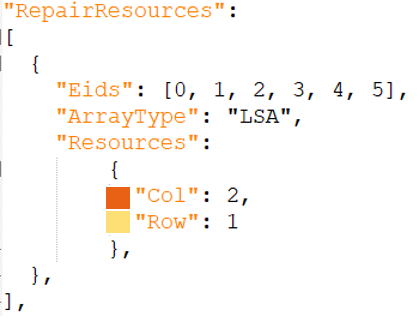

Every resource name defined under "Resources" is considered a field of interest. But existence is not forced - meaning that if a resource 'col' is not part of the decoded field of the packets code won't fail.

If a packet has no fields of interest at all, this packet is ignored and will not participate in repair process.

Example for a packet that will be ignored:

    id_1_eid_3_address_15_status_001

#### Repair using available resources
After identifying failing Eids, and each failing cell, repair process will start. In the repair process, code will try to repair Eids (by repairing failing cells within it) using the available resources.

From the example above, we can see that each Eids among: 0,1,2,3,4,5 - has 3 available resources: 2 x "Col" and 1 x "Row" resource.

Code will use all available resources to try to repair maximum number of Eids. 
- Eid is considered repaired only if no failing cells will remain after using resources.

##### Example of failing repair
Scneraio that leads to unrepaired Eid:

	id_1_eid_3_col_1_row_1_status_001
	id_1_eid_3_col_2_row_2_status_101
	id_1_eid_3_col_3_row_3_status_110
	id_1_eid_3_col_4_row_4_status_001

Since we have only 3 resources  (2 x "col" and 1 x "row"), we will remain with 1 failing cell in whatever way we used the resources.

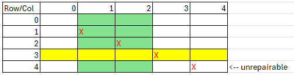

##### Example of successful repair
Scneraio that leads to repaired Eid:

	id_1_eid_3_col_1_row_1_status_001
	id_1_eid_3_col_2_row_2_status_101
	id_1_eid_3_col_3_row_3_status_110
	id_1_eid_3_col_4_row_3_status_001

Even though we have 4 defects, we can spot here that in the 3rd and 4rd packet, they share the same row (value 3), so one column resource can solve two defects.

Repair solution will be as follow:

	1x col used on col =1 (repair first defect)
	1x col used on col =2 (repair second defect)
	1x row used on row =3 (repair third and forth defect)

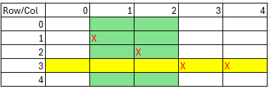

##### Non-greedy algorithm
Test method currently support only one repair algorithm, which is the non-greedy solution. This algorithm will start using resources based on order of definition, without specific prioritization.

For example, based on above example of RepairConfig, since "Col" resouce is defined before "Row" algorithm will start 'wasting' all "Col" resources before "Row".

Note that this algorithm can lead to situations in which resources are not optimally used to give best solution with less resources.

#### Repair and SKU
Let's remember that the reason behind repair is tofind out the best SKU we can get based on the available resources, and given defects.

After each repair attempt, SKU is calculated based on repaired Eids and non-repaired one. (SKUs are defined as part of the GFX infrastructure - please check out GFX documentation in Prime)

Below is an example of multi Eids failure, and repair attempt:

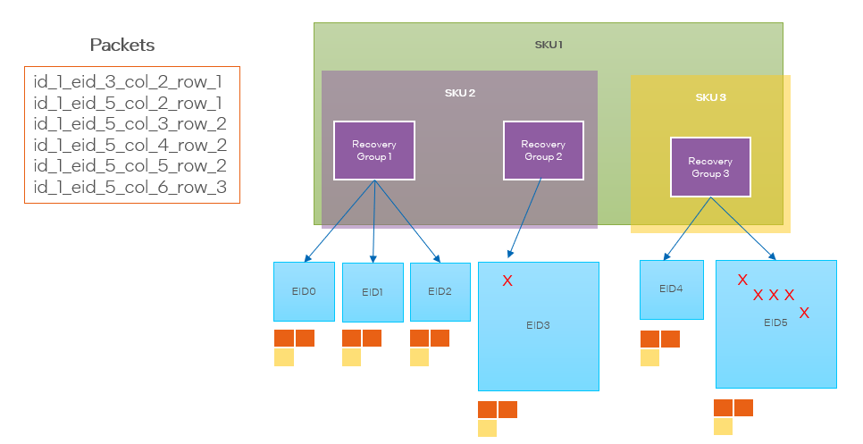

In this example we see the existing SKUs, and their respective recovery groups. We see also that Eid 3 could be repaired but Eid 5 couldn't. Thus, the final SKU  is "SKU 2".

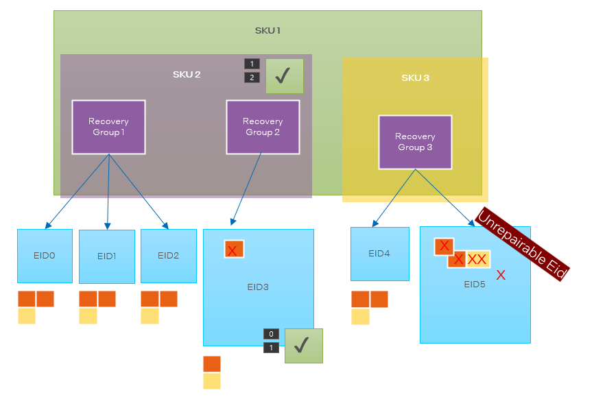

Note also that if  we used first row 2 we could fix 3 defects at once, but since we use non-greedy algorithm, this won't happen.  

### Voltage Stepper

This loop is intended to find the vmin of the best SKU this unit can get.

Each loop consist of the following:
- Apply next voltage value
- Run Plist
- Create packets
- Repair attempt
- Finding SKU based on repaired & unrepaired eids
  - If this is the first iteration, store this SKU as nominal SKU
  - Otherwise, check if the SKU is different than the nominal SKU
    - If yes, report previous step as Vmin
    - Otherwise, continue to next iteration

The loop will be based on values provided in repair config input file:

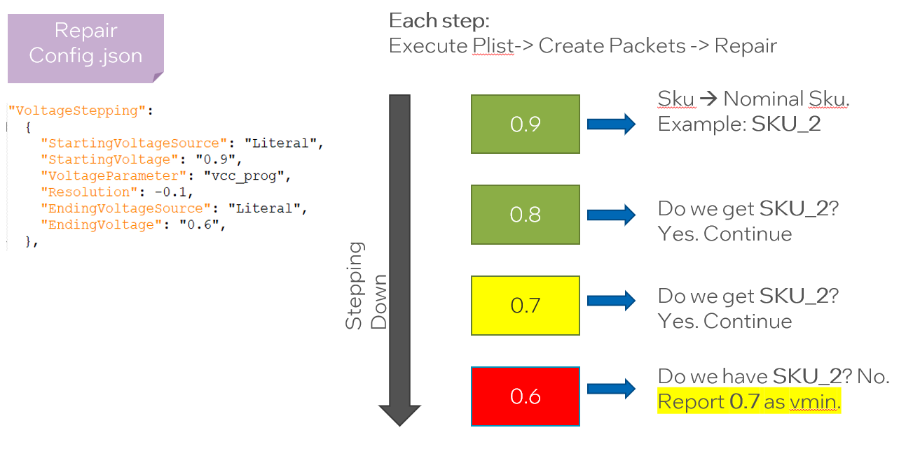

### Exporting Results

After voltage stepper is done, test method needs to export results to datalog, shared storage - including fuses values.

Results consist the following:
- Vmin
- Number of voltage steps performed
- Final SKU
- Failing recovery groups (RGs) of the final SKU
- Failing Eids of final SKU
- Failing Eids of every voltage step
- Fuses

More about the format and the target of those will be described below on output section.

#### Fuses

Fuses are constructed based on the resource repair of the latest step.

If we take the example above "successfull repair" we see that the repair solution utilizes 3 resources. Each resource has a repair value. Meaning that the fuses that we export should carry this informaiton.

Information that should be carried to fuses is defined by user in Repair Config file under "Fuses" section.

##### Example of fuse construction

Given this repair solution:

	Packets:
	id_1_eid_3_col_1_row_1_status_001
	id_1_eid_3_col_2_row_2_status_101
	id_1_eid_3_col_3_row_3_status_110
	id_1_eid_3_col_4_row_3_status_001

	Repairs:
	1x col used on col =1 (repair first defect)
	1x col used on col =2 (repair second defect)
	1x row used on row =3 (repair third and forth defect)

Note that dealing with the 3rd packet, resulted in solving the 4th packet is well (since they share same row =3).

So, If we connect each packet to the repair resource we get this:
	
	id_1_eid_3_col_1_row_1_status_001 ==> "Col" resource with value= 1
	id_1_eid_3_col_2_row_2_status_101 ==> "Col" resource with value= 2
	id_1_eid_3_col_3_row_3_status_110 ==> "Row" resource with value= 3

This means that we need to construct fuses values based on this repair + the strucure defined in .json file:
But before we do this, we need to the raw packet info (not the fields decoding of it), we have this info already from the packet creation process (see PacketMonitor documentation).

	01011001001001 ==> id_1_eid_3_col_1_row_1_status_001 ==> "Col" resource with value= 1
	01011010010001 ==> id_1_eid_3_col_2_row_2_status_101 ==> "Col" resource with value= 2
	01011011011001 ==> id_1_eid_3_col_3_row_3_status_110 ==> "Row" resource with value= 3

Why we need the raw representation of packets? because users need to take subsets of it to construct final fuse.

This is an example of Fuses section in RepairConfig.json file:

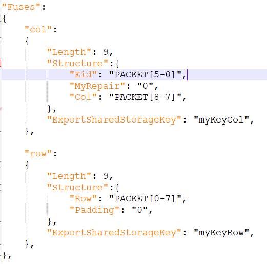

Within the "Structure" section, user can use "PACKET" keyword to denote to the raw packet, or an explicit binary value.

The fuse value will be constructed from a concatenation of all the values in the order of definition.

Note that the 'key' purpose under "Structure" like "Eid", "MyRepair" and "Col" from the example are used for debugging purposes when user want to see the building steps of the fuses in the console.

Let's take an example of one packet from the full example above:

	01011001001001 ==> id_1_eid_3_col_1_row_1_status_001 ==> "Col" resource with value= 1

Since we see that resource type is "Col" then we know that we should look under "col" (case in-sensitive) section to construct the fuse.

Let's see it constructed one by one:
- "Eid" -> subset of packet from 5 to 0 -> **010110**01001001 -> **010110** -> since left side value is larger, we know that we should reverse it. -> **011010**
- "MyRepair" -> explicit value of "0" -> **0**
- "Col" -> subset of packet from 8 to 7 -> 0101100**10**01001 -> **10** -> since left side value is larger, we know that we should reverse it. -> **01**

Final fuse value will be: "011010" + "0" + "01" -> **"011010001"**

##### Fuse to SharedStorage

There are 2 possible options to export fuses to SharedStorage:

- Specify "ExportSharedStorageKey" within specific Fuse section. E.g. under "col" section. (see above)
- Specifiy "ExportAllFusesSharedStorageKey" under "VoltageStepping" section

Example for "VoltageStepping" section:

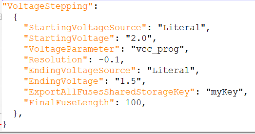

Full example of fuses exports from repair solution above:

	01011001001001 ==> fuse 011010001 (Col type)
	01011010010001 ==> fuse 011010000 (Col type) 
	01011011011001 ==> fuse 010110110 (Row type)

SharedStorage to be written:

	1) myKeyCol ==> 011010001 + 011010000 ==> 011010001011010000
	2) myKeyRow ==> 010110110
	3) myKey ==> (1) + (2) ==> 011010001011010000 + 010110110 ==> 011010001011010000010110110

Note that padding with x on the fuse value can possibly happen, if the final fuse length less than "FinalFuseLenth" from the repair config file.

### Repair conditions section

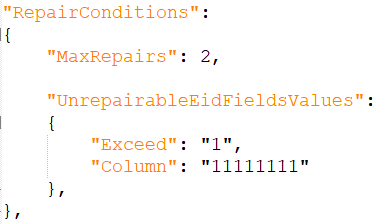

- MaxRepairs: maximum number resources to use. (even if we have more available).
- UnrepairableEidsFieldsValues: pairs of fields and value, when encountered during repair (while going over packets) specific Eid will be flagged as **unrepairable**.

## Test Instance Parameters

The table below lists and describes the test instance parameters supported by the PacketMonitor test method

| **Parameter Name**            | **Required?** | **Type**        | **Description**                                                                                        | **Default value**                  | **Comments**                       			|
| ------------------            | ------------- | --------------- | ------------------------------------------------------------------------------------------------------ | ---------------------------------- | -------------------------------------------   |
| Patlist                       | Yes           | Plist           | Plist name to be executed                                                                              |                                    |                                    			|
| TimingsTc                     | Yes           | TimingCondition | Levels test condition required for plist execution                                                     |                                    |                                    			|
| LevelsTc                      | Yes           | LevelsCondition | Timing test condition required for plist execution                                                     |                                    |                                   			|
| PrePlist                      | No            | String          | PrePlist name to be executed                                                                           |                                    |                                   			|
| MaskPins                      | No            | String          | Comma separated list of pins for which the fail data capture will be skipped                           |                                    |                                  				|
| ConfigFile		            | Yes           | File            | Resource Json file path                                                                                |                                    |                                   			|
| MaximumTotalFailures		        | NO            | UnsignedInteger | Number of maximum failures to capture                                                	               |  1                                  |                                   			|
| MaximumFailuresPerPattern		        | NO            | UnsignedInteger | Number of maximum failures to capture                                                	               |  1                                  |                                   			|
| Area                          | NO            | String          | Specify the area name to which the recovery groups and SKUs are relevant                               |                                    |                                   			|
| Content                       | NO            | String          | Specify the content name to which the recovery groups and SKUs are relevant                            |                                    |Content must be unique per area     			|
| ResultVminKey                 | NO            | String          | SharedStorage key to insert vmin into.                             |                                    |                                    			|
| ResultSkuKey                  | NO            | String          | SharedStorage key to insert final Sku name into.                                 |                                    |                                    			|
| FailRecoveryGroupsKey         | NO            | String          | SharedStorage key to insert failing recovery groups into.           |                                    |												|
| FailEidsKey         | NO            | String          | SharedStorage key to insert failing eids into.           |                                    |												|
| HryRawStringDatalog           | NO            | String          | Specify if HRY raw string is to be datalog                                                             |default ENABLE                      |ENABLE/DISABLE									|
| HryTreeLevelDatalog           | NO            | String          | Specify up to which HRY tree level to datalog.                                                         |default -1                          |means there will be no HRY tree level datalog. |
| LowestSkuAsNoSku           | NO            | String          | When enabled, if repair result was the lowest defined SKU, count this as NO_SKU_FOUND case.                                                        |default ENABLE                          |ENABLE/DISABLE |

## Output

### Ituff
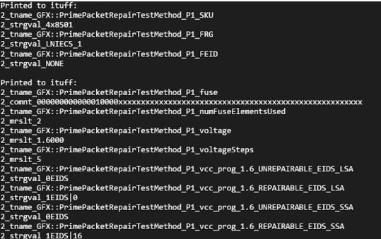

### SharedStorage
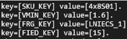

## Exit Ports

The PacketRepair test method supports the following exit ports:

| **Exit Port** | **Condition** | **Description**                              |
| ------------- | ------------- | -------------------------------------------- |
| **0**         | ***Fail***    | Decoding failure. 		 				   |
| **1**         | ***Pass***    | Passing condition. Plist execution passed without failures.                           |
| **2**         | ***Fail***    | Defective Eids found, but device is repairable to highest SKU.|
| **3**         | ***Fail***    | Defective Eids found, but device is repairable **NOT** to highest SKU.		   |
| **4**         | ***Fail***    | Defective Eids found, but device is **un**repairable, but got a SKU.     |
| **5**         | ***Fail***    | Defective Eids found, but device is **un**repairable, and got **NO** SKU.     |
| **6**         | ***Fail***    | DOA pin failure captured.      |
| **7**         | ***Fail***    | Errors found while creating packets. (before repair step).      |
| **8**         | ***Fail***    | Maximum repairs reached, and **NO** SKU found.      |

## Acronyms

Definition of acronyms used in this document:

  - **REP**: P**r**ime T**e**st-Method S**p**ecification
  - **HDMT**: High Density Modular Tester
  - **TPL**: Test Programming Language
  - **SHOPS**: **Sh**orts and **Op**en**s** test methodology

## Version tracking

| **Date**                  | **Version** | **Author**        | **Comments**    |
| ------------------------- | ----------- | ----------------- | --------------- |
| Oct 17th, 2024 | 1.0.0       | Dakwar, Wajde	  | Initial version |