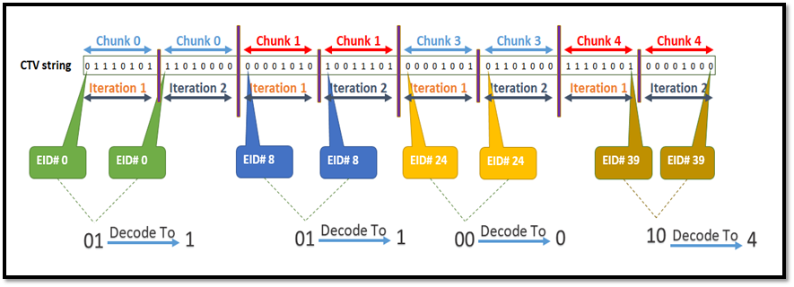
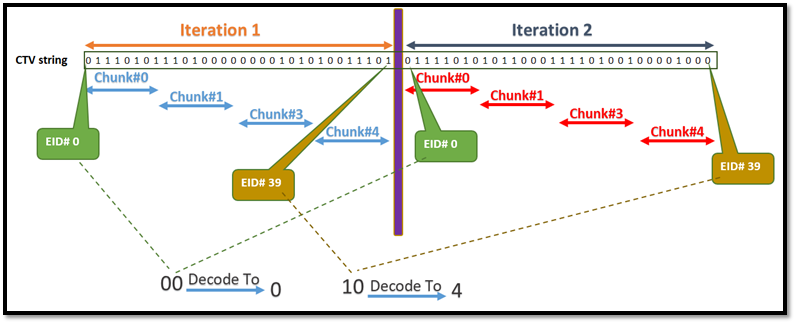

[[_TOC_]]

## REP for GfxScoreBoard

This **REP** is intended to describe the GfxScoreBoard Prime TestMethod.

Prior to reading this REP, it is recommend to read the GfxAggregator SDK to get an overview of the GFX methodology and the infrastructure for it in PRIME :)

In this document, you will find the below sections:

  - **Methodology** – A detailed description of this TestMethod intention and purpose

  - **Parameters** – A table describes each instance parameter (Name, Type, Default, Required?)

  - **Console output** – A detailed description of what is printed to console by this TestMethod

  - **Custom User Code hooks** – A list of functions available to the user code to override

  - **TPL Samples** – Examples of how to use this TestMethod in a TPL file

  - **Exit Ports** - A table describes each exit port

  - **Additional Dependencies** – More to consider for this TestMethod to operate

  - **Version tracking** – With author names, so you always have a name to address

  - **Acronyms** - Definition of acronyms used in this document

## Methodology

The GFXScoreboard TestMethod provides a template to execute a collection of data in order to perform the final SKU (GFX recovery option) evaluation.
Using this TestMethod, instance level EID’s data (pass/fail status) from various contents is collected and stored (tagged) in GFX service.
This TestMethod utilizes CTV based data collection (DMEM) to come up with a list of tested EID’s and their respective pass/fail status. 
The CTV’s are processed & analyzed according to paramaters provided by the JSON input file which will be described later in this REP.


### Verify

•	Validate input parameters
		o The area and content are required parameters, so they cannot be empty strings, In case that some parameters are invalid an appropriate exception will be thrown. 
		o The recieved area name and content name must be exist in the shared storage, otherwise can`t find the appropriate EIDs for evaluation.
•	Validate input CTV and DOA pins
•	Read config input file and validate it’s content
•	Initialize EidDynamicData object with the Area, content and the relevant EIDs
•	Initialize GfxDataSlicer object with the valid eids that their status needs to be evaluated 
•	Set the Functional test to the desirable FunctionalService (CTV and DFM or only CTV)


### Execute

•	ApplyTestConditions and execute the relevant functional test- if in mode of CTV and DFM, it will check also for DOA failures.
•	Get CTV data- collect all CTV data for the CTV pin and divide it to chuncks of *ExpectedCTVSize* lenght , if *HryPerPattern* variable is enabled also collect the CTV data for each failng pattern.
•   Update EID’s pass/fail status using the CTV data and according to *EidDecodeMethod* variable - ITERATE_THEN_CHUNK / CHUNK_THEN_ITERATE. 
	If DOA is detected, the EIDs are updated with DOA symbol. For further inforamtiom see *CTV decoding to get EID’s pass/fail status*
•	Tag EID’s pass/fail status in GFX service
•	Evaluate SKU based on the collected data
	o	In case current area have derived areas (i.e. areas that use current areas as refArea), the TestMethod will evaluate SKU also for these areas
•	Datalog HRY and evaluation result
	o	In case current area have derived areas (i.e. areas that use current areas as failure refArea), the TestMethod will datalog the SKU for these areas
•	Write to SharedStorage the SKU result and failing recovery groups


## Test Instance Parameters

The table below lists and describes the test instance parameters supported by the GfxScoreBoard TestMethod

| **Parameter Name**            | **Required?** | **Type**        | **Description**                                                                                        | **Default value**                  | **Comments**                       			|
| ------------------            | ------------- | --------------- | ------------------------------------------------------------------------------------------------------ | ---------------------------------- | -------------------------------------------   |
| Patlist                       | Yes           | Plist           | Plist name to be executed                                                                              |                                    |                                    			|
| TimingsTc                     | Yes           | TimingCondition | Levels test condition required for plist execution                                                     |                                    |                                    			|
| LevelsTc                      | Yes           | LevelsCondition | Timing test condition required for plist execution                                                     |                                    |                                   			|
| PrePlist                      | No            | String          | PrePlist name to be executed                                                                           |                                    |                                   			|
| MaskPins                      | No            | String          | Comma separated list of pins for which the fail data capture will be skipped                           |                                    |                                  				|
| CtvPinNames                   | Yes           | String          | Comma separated list of pins for which CTV data should be captured                                     |                                    |                                   			|
| DOAPinNames                   | NO            | String          | Comma separated list of pins for which DFM data should be captured                                     |                                    |                                    			|
| ConfigFile		            | Yes           | File            | Resource Json file path                                                                                |                                    |                                   			|
| Area                          | Yes           | String          | Specify the area name to which the recovery groups and SKUs are relevant                               |                                    |                                   			|
| Content                       | Yes           | String          | Specify the content name to which the recovery groups and SKUs are relevant                            |                                    |Content must be unique per area     			|
| Tag                           | NO            | String          | Specify the tag to mark the EID’s status of current instance in SharedStorage                          |                                    |                                  			    |
| StartSku                      | NO            | String          | Specify the start SKU for evaluation                                                                   |                                    |                                   		    |
| EndSku                        | NO            | String          | Specify the end SKU for evaluation                                                                     |                                    |                                    			|
| ResultSkuKey                  | NO            | String          | Specify the name of the result SKU that will be written to SharedStorage                               |                                    |                                    			|
| FailRecoveryGroupsKey         | NO            | String          | Name of the fail recovery groups for the evaluated SKU that will be written to SharedStorage           |                                    |												|
| HryRawStringDatalog           | NO            | String          | Specify if HRY raw string is to be datalog                                                             |default ENABLE                      |ENABLE/DISABLE									|
| HryTreeLevelDatalog           | NO            | String          | Specify up to which HRY tree level to datalog.                                                         |default -1                          |means there will be no HRY tree level datalog. |
| EidDecodeMethod               | NO            | String          | Specify the mode in which EID’s status is decoded from CTV                                             |default ITERATE_THEN_CHUNK          |ITERATE_THEN_CHUNK/CHUNK_THEN_ITERATE			|
| HryPerPattern                 | NO            | String          | Specify if HRY raw string should be datalog per pattern                                                |default DISABLE                     |ENABLE/DISABLE									|
| PatternNameCounterIndexes               | Yes           | String          | Map of indexes to be extracted for each limiting pattern name (using the configured pattern name mapping) for each corresponding target.|              |                                                                                                                                                               |
| BaseNumbers                   | Yes           | CommaSeparatedInteger         | A list of numbers with which all generated Scoreboard counters will be individually prefixed with.                                      |              |                                                                                                                                                               |
| MaxFailsNum                      | Yes           | UnsignedInteger | The max number of fails that can be processed.

##Importing data from SharedStorage

The start and end SKU, could be placed at shared storage, and the instance parameters StartSku and EndSku contains its key at shared storage. 

The user should provide the keys according to the buisness logic input data.

SharedStorage's format: The SharedStorage's specific key follows the format S.<Context>.<Key>, where the Context is the context of the data (L=Lot, D=Dut, I=Ip), and the Key is the key in the respective table.

## Configuration input file
```
{
    "Iterations": 2,
    "ChunkSize": 8,
    "ChunkIndex": "0,1,3,4",
    "ValueToDecodeMapping": [
        {
          "Value": "00",
          "Decode": "0"
        },
        {
          "Value": "01",
          "Decode": "1"
        },
        {
          "Value": "10",
          "Decode": "4"
        },
        {
          "Value": "11",
          "Decode": "4"
        }
      ],
    "DoaLabels": {
      "CaptureLocation": [
        {
          "StartLabel": "doa_start",
          "StopLabel": "doa_stop",
          "Domain": "DomainA_All_DPIN_Dig",
          "HrySymbol": "6"
        },
        {
          "StartLabel": "doa_start1",
          "StopLabel": "doa_stop1",
          "Domain": "DomainA_All_DPIN_Dig",
          "HrySymbol": "6"
        }
      ]
    }
}
```
| **Element Name**              | **Allowed Repetitions?** | **Attribute**   | **Description**                                                                                        | **Required**                  
| ------------------------------| ------------------------ | --------------- | ------------------------------------------------------------------------------------------------------ | ---------------------------------- |
| Iterations                    | Only once                |                 | Number of iteration the pattern preforms. Each iteration pass represents a different way the EID is tested.                                                                              |                                    |                                    	
| ChunkSize						| Only once				   |                 | Size of each CTV chunk per iteration. Chunk is consists of bits data, where each bit corresponds to respective EID.
| ChunkIndex					| Only once			       |                 | Chunks indexes that are relevant to current instance execution. Indexes can be given in any order and can be non-consecutive (depends on what the plist\patterns tests and exports as CTV)|
| ValueToDecodeMapping			| Multiple items		   |                 | Note that the number of elements must be equal to 2^<Iterations> so that all possible bit combination are covered.If any bit combination is missing, test method will fail Verify\INIT. |
|                               |                          |     value       | CTV bit combination to decode. Every bit represents an EID from specific iteration.
|                               |                          |     decode      | The symbol that represent the CTV bit combination.Must be single char matching one of the HRY symbols defined in EID’s definition config file.|
|DoaLabels						| Only once				   |	`			 | Hold CaptureLocation elements for DOA analysis.Needed only if DoaLabels element exist.
|CaptureLocation				| Multiple items		   |	StartLabel	 | Any failure between the labels in the domain will be considered at DOA failure.  
|                               |                          |      StopLabel  |
|                               |                          |      Domain	 |
|                               |                          |      HrySymbol  | Must be a single char that matches one of the HRY symbols defined in EID’s definition config file.

## CTV decoding to get EID’s pass/fail status

• Before the decoding, the TestMethod checkes that the captured CTV is deviding with *ExpectedCTVSize* :** ChunkSize * NumberOfChunks * Iterations **
  Where *NumberOfChunks* is the number of values in ChunkIndex. Else TestMethod will exit on fail port #0.

• Each chuck of CTV data holds number of ChunkSize bits, where every bit contributed data for specific EID status (respectively for the bit location).
  Every chunk# (per what is set in the ChunkIndex field) is analyzed as following:

i.		bit index goes from 0 to ChunkSize-1
ii.		The actual EID number is determined using the following formula: (chunk# * ChunkSize)+bit index
iii.	The EID [per-iteration] statuses are gathered together to perform a map value string
iv.		The final EID status is determined per what is described in the ValueToDecodeMapping

**Example**

For the above JSON file we would expect to have 64 CTV bits:
- ChunkSize = 8 (data of 8 different EIDs.)
- NumberOfChunks = 4 (0,1,3,4)
- Iterations = 2
 [= 8 * 4 * 2]
As we have 2 Iterations we expect to get statuses for 32 [=64\2] different EID’s (this does not necessarily mean we’ll get EID’s 0-31).
To understand the data of which EID’s we have, let’s look how ChunkIndex maps to EID:

|**ChunkIndex**| **EIDs** |
| ------------ | -------- | 
|      0       |  0 - 7   |
|      1       |  8 - 15  |
|      3       |  24 - 31 |
|      4       |  32 - 39 |


In the below figures we can see how statuses are begin calculated for EID#0 & EID#39 using the ValueToDecodeMapping, given in the above JSON file example.
There are 2 possible modes (set by ‘EidDecodeMethod’ instance parameter) of breaking down the captured CTV in order to get the bits for each EID:

**ITERATE_THEN_CHUNK**



**CHUNK_THEN_ITERATE**



## SKU evaluation
The TestMethod uses the collected EID’s pass/fail information in order to evaluate the corresponding SKU, which can be either:

	•	SKU that match the start SKU:
		o	This is considered as passing die
		o	Datalog the SKU
		o	TestMethod will exit on port #1
	•	SKU that is within the boundaries of the start & end SKU (but does not match either):
		o	This is considered as recovered die
		o	Datalog the SKU
		o	TestMethod will exit on port #2
	•	SKU that match the end SKU:
		o	This is considered as recovered die
		o	Datalog the SKU
		o	TestMethod will exit on port #3
	•	SKU is defined in the SKU’s config file, but after the end SKU:
		o	This is considered as fail die
		o	Datalog the SKU
		o	TestMethod will exit on port #4
	•	SKU is defined in the SKU’s config file, but before the start SKU:
		o	This is considered as fail die
		o	Datalog the SKU
		o	TestMethod will exit on port #5
	•	SKU is not defined in the SKU’s config file:
		o	This is considered as fail die
		o	Datalog NO_VALID_SKU
		o	TestMethod will exit on port #6


Notes:

•	The GFX service have default start & end SKU which can be override locally by the TestMethod's specified start & end SKU (using instance parameters ‘startSku’ & ‘endSku’).


## DOA (Dead-On-Arrival)

The DOA feature was introduced in order to avoid false-pass scenarios, in which the TestMethod reports the unit has a working GT, while in action the GT is not at all functional (i.e. dead on arrival).

To enable the DOA feature, user must:
	1.	Specify valid pin (or comma separated list of pins) in ‘DOAPinNames’ instance parameter.
		These pins will be used to configure the tester to collect all DFM data upon plist execution.
	2.	Specify 'DoaLabels' section in the TestMethod JSON config file, *ConfigFile*.
		This section can hold multiple definition of 'CaptureLocation' elements which have attributes to define start label, stop label, domain and HRY symbol.
		
During execute, the template will check if there is **at least one failure** at a location which matches one of the 'CaptureLocation' definitions. 
The template will stop on the first match, if found, and will use the relevant HrySymbol value for SKU evaluation and datalog actions. 
The instance execution will be considered as DOA failure and instance will exit on DOA fail port.


## HryPerPattern 

When *HryPerPattern* vriable is ENABLE, the TestMethod will collect also the CTV data per pattern, than, will  decode, evaluate and get final SKU for each pattern.
The TestMethod will datalog the SKU, FRG & FEID for each pattern  (for example see *Datalog output*).


## Datalog output

The TestMethod have various datalog capabilities.
Using StrgvalFormat, where [0/2_tname_... & 0/2_strgval_...] are automatically determined.

**HRY raw string**
This datalog is enabled by default.
To avoid this datalog, instance should be set with: HryRawStringDatalog = “DISABLED”
This string represents the EID’s pass/fail status as it was decoded by the template from captured CTV data. 
Each EID status occupies one character where the location of the character represents the EID ID. 
The values are the decoded value from JSON ValueToDecodeMapping element and from the corresponding HryHierarchy in the EID’s setup file for current area and content.

Continuing the above **Example** of CTV’s decoding to EID’s status, and assuming we have 40 EIDs defined in the EIDs config file, below is how HRY raw string is being calculated and datalog.
**Notes:** 
   - Per this example, EID’s 16-23 are not tested so they will be marked as such in the HRY raw string (9 in this example but user configurable in the EID’s config file using eid_not_tested_symbol attribute of HryHierarchy element)
		- For the case of EID’s that are not defined in the EID’s config file, the file support the ability for user to use the eid_not_exist_symbol attribute of HryHierarchy element, to specify how they will be marked
		- in case that DOA feature is enabled and doa found, the doa symbol will be used for HRY instead of any other 
		  Results

	
		Datalog format
		2_tname_<Module::Instance>_HRY_RAWSTR_<wrap counter>
		2_strgval_<HRY raw string>

		Note: When *HryPerPattern* vriable is ENABLE, the format will include the pattern index (zero based) and the HRY raw string that is relevant to it.
		2_tname_<Module::Instance>_pattern_<index>_HRY_RAWSTR_1
		2_strgval_<HRY raw string>

		Example
		2_tname_iVal_TPTESTS_GFX::GFXScoreboard_HRY_RAWSTR_1
		2_strgval_0444141444140001999999991110404140044404

		When hry is greater than 3900 characters, the <wrap counter> will generate more tname/strgval pairings: 
		2_tname_iVal_TPTESTS_GFX::GFXScoreboard _HRY_RAWSTR_2
		2_strgval_111… <up to 3900 characters>
		2_tname_iVal_TPTESTS_GFX::GFXScoreboard _HRY_RAWSTR_3
		2_strgval_108… <up to 3900 characters>
		
**SKU, FRG & FEID**
This datalog is always enabled (not user configurable).
The format for SKU, FRG & FEID datalog is:

		2_tname_<Module name::Instance name>_SKU
		2_strgval_<SKU name>
		2_tname_<Module name::Instance name>_FRG
		2_strgval_<Fail Recovery Groups, pipe-separated>
		2_tname_<Module name::Instance name>_FEID_1     Wrap counter enabled for FEID & FPID.
		2_strgval_<Fail EID’s, pipe-separated>

Notes: 
		•	When *HryPerPattern* vriable is ENABLE, the format will include the pattern index (zero based) and the evaluation data that is relevant to it.
		•	Wrap counter is not enabled for [SKU, FRG, TAGS]. If a strgval greater than 3900 characters occurs, an exception will be generated.
		
		2_tname_<Module name::Instance name>_pattern_<index>_SKU
		2_strgval_<SKU name>
		2_tname_<Module name::Instance name>_pattern_<index>_FRG
		2_strgval_<Fail Recovery Groups, pipe-separated>
		2_tname_<Module name::Instance name>_pattern_<index>_FEID_1
		2_strgval_<Fail EID’s, pipe-separated>

Example (when evaluation found valid SKU)

		2_tname_GFX::GfxScoreboard_ChunkThenIterate_SkuBetweenBoundaries_P2_SKU
		2_strgval_4x8S12
		2_tname_GFX::GfxScoreboard_ChunkThenIterate_SkuBetweenBoundaries_P2_FRG
		2_strgval_LNIECS_0,LNIECS_1,GT4_RC0
		2_tname_GFX::GfxScoreboard_ChunkThenIterate_SkuBetweenBoundaries_P2_FEID
		2_strgval_31,32,33,34,35,36,37,38,39

Example (when evaluation found no SKU)

		2_tname_GFX::GfxScoreboard_ChunkThenIterate_SkuIsNotDefined_F6_SKU
		2_strgval_NO_VALID_SKU
		2_tname_GFX::GfxScoreboard_ChunkThenIterate_SkuIsNotDefined_F6_FRG
		2_strgval_UNS_VID,LNIECS_1
		2_tname_GFX::GfxScoreboard_ChunkThenIterate_SkuIsNotDefined_F6_FEID
		2_strgval_24,31

**HRY tree level**

The HRY tree contains the eids in the leafs, and the other nodes contains the levels that every EID element has, 
such that the hry levels that been defined in the EID e,ement represents the path from the root to the appropriate leaf. 

This datalog is disabled by default (instance is setup with: HryTreeLevelDatalog = -1).

To get this datalog, instance should be set with HryTreeLevelDatalog value higher than -1 (where 0 is valid as it is the tree root).

The HRY tree level datalog format and structure are described earlier in this document.

In general, the HRY tree provides capability to group EID’s to logical levels so that each level holds the merged status of all the EID’s it includes.

Example-TBD


## TPL Samples

Example of Scoreboard test TestMethod in the .mtpl file:

Test PrimeGfxScoreBoardTestMethod GFXScoreboard_Execute_Pass_Down_To_SKU_4x8S01_P2
{
	Patlist = "gfx_doa_list";
    LevelsTc = "GFX::basic_func_lvl_nom";
    TimingsTc = "GFX::basic_func_timing_10MHz_20MHz";
    LogLevel = "PRIME_DEBUG";
	Area = "GT_PRIME";
	CtvPinName = "xxHPCC_DPIN_Dig_slcA_AA0";
	StartSku = "";
	FailRecoveryGroupsKey = "";
	ResultSkuKey = "";
	HryTreeLevelDatalog = 3;
	Content = "SCAN";
	ConfigFile = "~HDMT_TPL_DIR/Modules/GFX/GFX/InputFiles/GFXScoreboard.gfxscrbd.json";
}

## Console output (debug mode)

###Output for a passing test

=========================
Running Verify() for test instance=[GFX::GFXScoreboard_Execute_Pass_Down_To_SKU_4x8S01_P2]
=========================
[DUT: 1]Below are the list of parameters and its value for this Instance:
[DUT: 1]Area: GT_PRIME
[DUT: 1]BypassPort: -1
[DUT: 1]ConfigFile: ~HDMT_TPL_DIR/Modules/GFX/GFX/InputFiles/GFXScoreboard.gfxscrbd.json
[DUT: 1]Content: SCAN
[DUT: 1]CtvPinName: xxHPCC_DPIN_Dig_slcA_AA0
[DUT: 1]DOAPinNames:
[DUT: 1]EidDecodeMethod: ITERATE_THEN_CHUNK
[DUT: 1]EndSku:
[DUT: 1]FailEidsKey:
[DUT: 1]FailRecoveryGroupsKey: FRG
[DUT: 1]HryPerPattern: DISABLED
[DUT: 1]HryRawStringDatalog: ENABLED
[DUT: 1]HryTreeLevelDatalog: 3
[DUT: 1]LevelsTc: GFX::basic_func_lvl_nom
[DUT: 1]LogLevel: PRIME_DEBUG
[DUT: 1]MaskPins:
[DUT: 1]MemoryAndTimeProfiling: DISABLED
[DUT: 1]PassEidsKey:
[DUT: 1]Patlist: gfx_doa_list
[DUT: 1]PrePlist:
[DUT: 1]ResultSkuKey: SKU
[DUT: 1]StartSku: 5x8S012
[DUT: 1]Tag:
[DUT: 1]TimingsTc: GFX::basic_func_timing_10MHz_20MHz
[DUT: 1]
[DUT: 1]================================================================
[2022-Jul-06 15:55:44.430][DUT: 1]Test instance=[GFX::GFXScoreboard_Execute_Pass_Down_To_SKU_4x8S01_P2] verified using 506.478826 ms
,GFX::GFXScoreboard_Execute_Pass_Down_To_SKU_4x8S01_P2
[2022-Jul-06 15:55:46.698][DUT: 1]
=========================
Running Execute() for test instance=[GFX::GFXScoreboard_Execute_Pass_Down_To_SKU_4x8S01_P2]
=========================
[DUT: 1]PowerUpTc name is empty.
[DUT: 1]
[DUT: 1]PowerOnTC will not be applied. PowerOnTC Name is empty.
[DUT: 1]
[DUT: 1]Applied test condition=[GFX::basic_func_lvl_nom].
[DUT: 1]
[DUT: 1]Applied test condition=[GFX::basic_func_timing_10MHz_20MHz].
[DUT: 1]
[DUT: 1]Functional Test settings:
[DUT: 1]- Plist name=[gfx_doa_list].
[DUT: 1]- Levels test condition=[GFX::basic_func_lvl_nom].
[DUT: 1]- Timings test condition=[GFX::basic_func_timing_10MHz_20MHz].
[DUT: 1]- No pin mask set.
[DUT: 1]- No edge counter pins set.
[DUT: 1]- No software trigger set.
[DUT: 1]- No trigger map set.
[DUT: 1]- Ctv settings:
[DUT: 1]  --Ctv pins to capture=[xxHPCC_DPIN_Dig_slcA_AA0].
[DUT: 1]
[DUT: 1]Setting capture mode=[HdmtApi::CaptureMode::CaptureCTV] to domain=[DomainA_All_DPIN_Dig].
[DUT: 1]
[DUT: 1]Setting capture mode=[HdmtApi::CaptureMode::CaptureCTV] to domain=[DomainB_All_DPIN_Dig].
[DUT: 1]
[DUT: 1]Captured pattern=[gfx_doa1], domain=[DomainA_All_DPIN_Dig], parentPlist=[gfx_doa_list], patternId=[1], burstIndex=[0], vectorAddress=[1], cycle=[0].
[DUT: 1]Captured pattern=[gfx_doa1], domain=[DomainA_All_DPIN_Dig], parentPlist=[gfx_doa_list], patternId=[1], burstIndex=[0], vectorAddress=[1], cycle=[1].
[DUT: 1]Captured pattern=[gfx_doa1], domain=[DomainA_All_DPIN_Dig], parentPlist=[gfx_doa_list], patternId=[1], burstIndex=[0], vectorAddress=[1], cycle=[2].
[DUT: 1]Captured pattern=[gfx_doa1], domain=[DomainA_All_DPIN_Dig], parentPlist=[gfx_doa_list], patternId=[1], burstIndex=[0], vectorAddress=[1], cycle=[3].
[DUT: 1]Captured pattern=[gfx_doa1], domain=[DomainA_All_DPIN_Dig], parentPlist=[gfx_doa_list], patternId=[1], burstIndex=[0], vectorAddress=[1], cycle=[4].
[DUT: 1]Captured pattern=[gfx_doa1], domain=[DomainA_All_DPIN_Dig], parentPlist=[gfx_doa_list], patternId=[1], burstIndex=[0], vectorAddress=[1], cycle=[5].
[DUT: 1]Captured pattern=[gfx_doa1], domain=[DomainA_All_DPIN_Dig], parentPlist=[gfx_doa_list], patternId=[1], burstIndex=[0], vectorAddress=[1], cycle=[6].
[DUT: 1]Captured pattern=[gfx_doa1], domain=[DomainA_All_DPIN_Dig], parentPlist=[gfx_doa_list], patternId=[1], burstIndex=[0], vectorAddress=[1], cycle=[7].
[DUT: 1]Captured pattern=[gfx_doa1], domain=[DomainA_All_DPIN_Dig], parentPlist=[gfx_doa_list], patternId=[1], burstIndex=[0], vectorAddress=[1], cycle=[8].
[DUT: 1]Captured pattern=[gfx_doa1], domain=[DomainA_All_DPIN_Dig], parentPlist=[gfx_doa_list], patternId=[1], burstIndex=[0], vectorAddress=[1], cycle=[9].
[DUT: 1]Captured pattern=[gfx_doa1], domain=[DomainA_All_DPIN_Dig], parentPlist=[gfx_doa_list], patternId=[1], burstIndex=[0], vectorAddress=[1], cycle=[10].
[DUT: 1]Captured pattern=[gfx_doa1], domain=[DomainA_All_DPIN_Dig], parentPlist=[gfx_doa_list], patternId=[1], burstIndex=[0], vectorAddress=[1], cycle=[11].
[DUT: 1]Captured pattern=[gfx_doa1], domain=[DomainA_All_DPIN_Dig], parentPlist=[gfx_doa_list], patternId=[1], burstIndex=[0], vectorAddress=[1], cycle=[12].
[DUT: 1]Captured pattern=[gfx_doa1], domain=[DomainA_All_DPIN_Dig], parentPlist=[gfx_doa_list], patternId=[1], burstIndex=[0], vectorAddress=[1], cycle=[13].
[DUT: 1]Captured pattern=[gfx_doa1], domain=[DomainA_All_DPIN_Dig], parentPlist=[gfx_doa_list], patternId=[1], burstIndex=[0], vectorAddress=[1], cycle=[14].
[DUT: 1]Captured pattern=[gfx_doa1], domain=[DomainA_All_DPIN_Dig], parentPlist=[gfx_doa_list], patternId=[1], burstIndex=[0], vectorAddress=[1], cycle=[15].
[DUT: 1]Captured pattern=[gfx_doa1], domain=[DomainA_All_DPIN_Dig], parentPlist=[gfx_doa_list], patternId=[1], burstIndex=[0], vectorAddress=[1], cycle=[16].
[DUT: 1]Captured pattern=[gfx_doa1], domain=[DomainA_All_DPIN_Dig], parentPlist=[gfx_doa_list], patternId=[1], burstIndex=[0], vectorAddress=[1], cycle=[17].
[DUT: 1]Captured pattern=[gfx_doa1], domain=[DomainA_All_DPIN_Dig], parentPlist=[gfx_doa_list], patternId=[1], burstIndex=[0], vectorAddress=[1], cycle=[18].
[DUT: 1]Captured pattern=[gfx_doa1], domain=[DomainA_All_DPIN_Dig], parentPlist=[gfx_doa_list], patternId=[1], burstIndex=[0], vectorAddress=[1], cycle=[19].
[DUT: 1]Captured pattern=[gfx_doa1], domain=[DomainA_All_DPIN_Dig], parentPlist=[gfx_doa_list], patternId=[1], burstIndex=[0], vectorAddress=[1], cycle=[20].
[DUT: 1]Captured pattern=[gfx_doa1], domain=[DomainA_All_DPIN_Dig], parentPlist=[gfx_doa_list], patternId=[1], burstIndex=[0], vectorAddress=[1], cycle=[21].
[DUT: 1]Captured pattern=[gfx_doa1], domain=[DomainA_All_DPIN_Dig], parentPlist=[gfx_doa_list], patternId=[1], burstIndex=[0], vectorAddress=[1], cycle=[22].
[DUT: 1]Captured pattern=[gfx_doa1], domain=[DomainA_All_DPIN_Dig], parentPlist=[gfx_doa_list], patternId=[1], burstIndex=[0], vectorAddress=[1], cycle=[23].
[DUT: 1]Captured pattern=[gfx_doa1], domain=[DomainA_All_DPIN_Dig], parentPlist=[gfx_doa_list], patternId=[1], burstIndex=[0], vectorAddress=[1], cycle=[24].
[DUT: 1]Captured pattern=[gfx_doa1], domain=[DomainA_All_DPIN_Dig], parentPlist=[gfx_doa_list], patternId=[1], burstIndex=[0], vectorAddress=[1], cycle=[25].
[DUT: 1]Captured pattern=[gfx_doa1], domain=[DomainA_All_DPIN_Dig], parentPlist=[gfx_doa_list], patternId=[1], burstIndex=[0], vectorAddress=[1], cycle=[26].
[DUT: 1]Captured pattern=[gfx_doa1], domain=[DomainA_All_DPIN_Dig], parentPlist=[gfx_doa_list], patternId=[1], burstIndex=[0], vectorAddress=[1], cycle=[27].
[DUT: 1]Captured pattern=[gfx_doa1], domain=[DomainA_All_DPIN_Dig], parentPlist=[gfx_doa_list], patternId=[1], burstIndex=[0], vectorAddress=[1], cycle=[28].
[DUT: 1]Captured pattern=[gfx_doa1], domain=[DomainA_All_DPIN_Dig], parentPlist=[gfx_doa_list], patternId=[1], burstIndex=[0], vectorAddress=[1], cycle=[29].
[DUT: 1]Captured pattern=[gfx_doa1], domain=[DomainA_All_DPIN_Dig], parentPlist=[gfx_doa_list], patternId=[1], burstIndex=[0], vectorAddress=[1], cycle=[30].
[DUT: 1]Captured pattern=[gfx_doa1], domain=[DomainA_All_DPIN_Dig], parentPlist=[gfx_doa_list], patternId=[1], burstIndex=[0], vectorAddress=[1], cycle=[31].
[DUT: 1]Captured pattern=[gfx_doa1], domain=[DomainA_All_DPIN_Dig], parentPlist=[gfx_doa_list], patternId=[1], burstIndex=[0], vectorAddress=[1], cycle=[32].
[DUT: 1]Captured pattern=[gfx_doa1], domain=[DomainA_All_DPIN_Dig], parentPlist=[gfx_doa_list], patternId=[1], burstIndex=[0], vectorAddress=[1], cycle=[33].
[DUT: 1]Captured pattern=[gfx_doa1], domain=[DomainA_All_DPIN_Dig], parentPlist=[gfx_doa_list], patternId=[1], burstIndex=[0], vectorAddress=[1], cycle=[34].
[DUT: 1]Captured pattern=[gfx_doa1], domain=[DomainA_All_DPIN_Dig], parentPlist=[gfx_doa_list], patternId=[1], burstIndex=[0], vectorAddress=[1], cycle=[35].
[DUT: 1]Captured pattern=[gfx_doa1], domain=[DomainA_All_DPIN_Dig], parentPlist=[gfx_doa_list], patternId=[1], burstIndex=[0], vectorAddress=[1], cycle=[36].
[DUT: 1]Captured pattern=[gfx_doa1], domain=[DomainA_All_DPIN_Dig], parentPlist=[gfx_doa_list], patternId=[1], burstIndex=[0], vectorAddress=[1], cycle=[37].
[DUT: 1]Captured pattern=[gfx_doa1], domain=[DomainA_All_DPIN_Dig], parentPlist=[gfx_doa_list], patternId=[1], burstIndex=[0], vectorAddress=[1], cycle=[38].
[DUT: 1]Captured pattern=[gfx_doa1], domain=[DomainA_All_DPIN_Dig], parentPlist=[gfx_doa_list], patternId=[1], burstIndex=[0], vectorAddress=[1], cycle=[39].
[DUT: 1]Captured pattern=[gfx_doa1], domain=[DomainA_All_DPIN_Dig], parentPlist=[gfx_doa_list], patternId=[1], burstIndex=[0], vectorAddress=[1], cycle=[40].
[DUT: 1]Captured pattern=[gfx_doa1], domain=[DomainA_All_DPIN_Dig], parentPlist=[gfx_doa_list], patternId=[1], burstIndex=[0], vectorAddress=[1], cycle=[41].
[DUT: 1]Captured pattern=[gfx_doa1], domain=[DomainA_All_DPIN_Dig], parentPlist=[gfx_doa_list], patternId=[1], burstIndex=[0], vectorAddress=[1], cycle=[42].
[DUT: 1]Captured pattern=[gfx_doa1], domain=[DomainA_All_DPIN_Dig], parentPlist=[gfx_doa_list], patternId=[1], burstIndex=[0], vectorAddress=[1], cycle=[43].
[DUT: 1]Captured pattern=[gfx_doa1], domain=[DomainA_All_DPIN_Dig], parentPlist=[gfx_doa_list], patternId=[1], burstIndex=[0], vectorAddress=[1], cycle=[44].
[DUT: 1]Captured pattern=[gfx_doa1], domain=[DomainA_All_DPIN_Dig], parentPlist=[gfx_doa_list], patternId=[1], burstIndex=[0], vectorAddress=[1], cycle=[45].
[DUT: 1]Captured pattern=[gfx_doa1], domain=[DomainA_All_DPIN_Dig], parentPlist=[gfx_doa_list], patternId=[1], burstIndex=[0], vectorAddress=[1], cycle=[46].
[DUT: 1]Captured pattern=[gfx_doa1], domain=[DomainA_All_DPIN_Dig], parentPlist=[gfx_doa_list], patternId=[1], burstIndex=[0], vectorAddress=[1], cycle=[47].
[DUT: 1]Captured pattern=[gfx_doa1], domain=[DomainA_All_DPIN_Dig], parentPlist=[gfx_doa_list], patternId=[1], burstIndex=[0], vectorAddress=[1], cycle=[48].
[DUT: 1]Captured pattern=[gfx_doa1], domain=[DomainA_All_DPIN_Dig], parentPlist=[gfx_doa_list], patternId=[1], burstIndex=[0], vectorAddress=[1], cycle=[49].
[DUT: 1]Captured pattern=[gfx_doa1], domain=[DomainA_All_DPIN_Dig], parentPlist=[gfx_doa_list], patternId=[1], burstIndex=[0], vectorAddress=[1], cycle=[50].
[DUT: 1]Captured pattern=[gfx_doa1], domain=[DomainA_All_DPIN_Dig], parentPlist=[gfx_doa_list], patternId=[1], burstIndex=[0], vectorAddress=[1], cycle=[51].
[DUT: 1]Captured pattern=[gfx_doa1], domain=[DomainA_All_DPIN_Dig], parentPlist=[gfx_doa_list], patternId=[1], burstIndex=[0], vectorAddress=[1], cycle=[52].
[DUT: 1]Captured pattern=[gfx_doa1], domain=[DomainA_All_DPIN_Dig], parentPlist=[gfx_doa_list], patternId=[1], burstIndex=[0], vectorAddress=[1], cycle=[53].
[DUT: 1]Captured pattern=[gfx_doa1], domain=[DomainA_All_DPIN_Dig], parentPlist=[gfx_doa_list], patternId=[1], burstIndex=[0], vectorAddress=[1], cycle=[54].
[DUT: 1]Captured pattern=[gfx_doa1], domain=[DomainA_All_DPIN_Dig], parentPlist=[gfx_doa_list], patternId=[1], burstIndex=[0], vectorAddress=[1], cycle=[55].
[DUT: 1]Captured pattern=[gfx_doa1], domain=[DomainA_All_DPIN_Dig], parentPlist=[gfx_doa_list], patternId=[1], burstIndex=[0], vectorAddress=[1], cycle=[56].
[DUT: 1]Captured pattern=[gfx_doa1], domain=[DomainA_All_DPIN_Dig], parentPlist=[gfx_doa_list], patternId=[1], burstIndex=[0], vectorAddress=[1], cycle=[57].
[DUT: 1]Captured pattern=[gfx_doa1], domain=[DomainA_All_DPIN_Dig], parentPlist=[gfx_doa_list], patternId=[1], burstIndex=[0], vectorAddress=[1], cycle=[58].
[DUT: 1]Captured pattern=[gfx_doa1], domain=[DomainA_All_DPIN_Dig], parentPlist=[gfx_doa_list], patternId=[1], burstIndex=[0], vectorAddress=[1], cycle=[59].
[DUT: 1]Captured pattern=[gfx_doa1], domain=[DomainA_All_DPIN_Dig], parentPlist=[gfx_doa_list], patternId=[1], burstIndex=[0], vectorAddress=[1], cycle=[60].
[DUT: 1]Captured pattern=[gfx_doa1], domain=[DomainA_All_DPIN_Dig], parentPlist=[gfx_doa_list], patternId=[1], burstIndex=[0], vectorAddress=[1], cycle=[61].
[DUT: 1]Captured pattern=[gfx_doa1], domain=[DomainA_All_DPIN_Dig], parentPlist=[gfx_doa_list], patternId=[1], burstIndex=[0], vectorAddress=[1], cycle=[62].
[DUT: 1]Captured pattern=[gfx_doa1], domain=[DomainA_All_DPIN_Dig], parentPlist=[gfx_doa_list], patternId=[1], burstIndex=[0], vectorAddress=[1], cycle=[63].
[DUT: 1]Plist=[gfx_doa_list] has finished burst index=[0] with result=[PASS].
[DUT: 1]Captured pattern=[gfx_doa2], domain=[DomainA_All_DPIN_Dig], parentPlist=[gfx_doa_list], patternId=[1], burstIndex=[1], vectorAddress=[1], cycle=[0].
[DUT: 1]Captured pattern=[gfx_doa2], domain=[DomainA_All_DPIN_Dig], parentPlist=[gfx_doa_list], patternId=[1], burstIndex=[1], vectorAddress=[1], cycle=[1].
[DUT: 1]Captured pattern=[gfx_doa2], domain=[DomainA_All_DPIN_Dig], parentPlist=[gfx_doa_list], patternId=[1], burstIndex=[1], vectorAddress=[1], cycle=[2].
[DUT: 1]Captured pattern=[gfx_doa2], domain=[DomainA_All_DPIN_Dig], parentPlist=[gfx_doa_list], patternId=[1], burstIndex=[1], vectorAddress=[1], cycle=[3].
[DUT: 1]Captured pattern=[gfx_doa2], domain=[DomainA_All_DPIN_Dig], parentPlist=[gfx_doa_list], patternId=[1], burstIndex=[1], vectorAddress=[1], cycle=[4].
[DUT: 1]Captured pattern=[gfx_doa2], domain=[DomainA_All_DPIN_Dig], parentPlist=[gfx_doa_list], patternId=[1], burstIndex=[1], vectorAddress=[1], cycle=[5].
[DUT: 1]Captured pattern=[gfx_doa2], domain=[DomainA_All_DPIN_Dig], parentPlist=[gfx_doa_list], patternId=[1], burstIndex=[1], vectorAddress=[1], cycle=[6].
[DUT: 1]Captured pattern=[gfx_doa2], domain=[DomainA_All_DPIN_Dig], parentPlist=[gfx_doa_list], patternId=[1], burstIndex=[1], vectorAddress=[1], cycle=[7].
[DUT: 1]Captured pattern=[gfx_doa2], domain=[DomainA_All_DPIN_Dig], parentPlist=[gfx_doa_list], patternId=[1], burstIndex=[1], vectorAddress=[1], cycle=[8].
[DUT: 1]Captured pattern=[gfx_doa2], domain=[DomainA_All_DPIN_Dig], parentPlist=[gfx_doa_list], patternId=[1], burstIndex=[1], vectorAddress=[1], cycle=[9].
[DUT: 1]Captured pattern=[gfx_doa2], domain=[DomainA_All_DPIN_Dig], parentPlist=[gfx_doa_list], patternId=[1], burstIndex=[1], vectorAddress=[1], cycle=[10].
[DUT: 1]Captured pattern=[gfx_doa2], domain=[DomainA_All_DPIN_Dig], parentPlist=[gfx_doa_list], patternId=[1], burstIndex=[1], vectorAddress=[1], cycle=[11].
[DUT: 1]Captured pattern=[gfx_doa2], domain=[DomainA_All_DPIN_Dig], parentPlist=[gfx_doa_list], patternId=[1], burstIndex=[1], vectorAddress=[1], cycle=[12].
[DUT: 1]Captured pattern=[gfx_doa2], domain=[DomainA_All_DPIN_Dig], parentPlist=[gfx_doa_list], patternId=[1], burstIndex=[1], vectorAddress=[1], cycle=[13].
[DUT: 1]Captured pattern=[gfx_doa2], domain=[DomainA_All_DPIN_Dig], parentPlist=[gfx_doa_list], patternId=[1], burstIndex=[1], vectorAddress=[1], cycle=[14].
[DUT: 1]Captured pattern=[gfx_doa2], domain=[DomainA_All_DPIN_Dig], parentPlist=[gfx_doa_list], patternId=[1], burstIndex=[1], vectorAddress=[1], cycle=[15].
[DUT: 1]Captured pattern=[gfx_doa2], domain=[DomainA_All_DPIN_Dig], parentPlist=[gfx_doa_list], patternId=[1], burstIndex=[1], vectorAddress=[1], cycle=[16].
[DUT: 1]Captured pattern=[gfx_doa2], domain=[DomainA_All_DPIN_Dig], parentPlist=[gfx_doa_list], patternId=[1], burstIndex=[1], vectorAddress=[1], cycle=[17].
[DUT: 1]Captured pattern=[gfx_doa2], domain=[DomainA_All_DPIN_Dig], parentPlist=[gfx_doa_list], patternId=[1], burstIndex=[1], vectorAddress=[1], cycle=[18].
[DUT: 1]Captured pattern=[gfx_doa2], domain=[DomainA_All_DPIN_Dig], parentPlist=[gfx_doa_list], patternId=[1], burstIndex=[1], vectorAddress=[1], cycle=[19].
[DUT: 1]Captured pattern=[gfx_doa2], domain=[DomainA_All_DPIN_Dig], parentPlist=[gfx_doa_list], patternId=[1], burstIndex=[1], vectorAddress=[1], cycle=[20].
[DUT: 1]Captured pattern=[gfx_doa2], domain=[DomainA_All_DPIN_Dig], parentPlist=[gfx_doa_list], patternId=[1], burstIndex=[1], vectorAddress=[1], cycle=[21].
[DUT: 1]Captured pattern=[gfx_doa2], domain=[DomainA_All_DPIN_Dig], parentPlist=[gfx_doa_list], patternId=[1], burstIndex=[1], vectorAddress=[1], cycle=[22].
[DUT: 1]Captured pattern=[gfx_doa2], domain=[DomainA_All_DPIN_Dig], parentPlist=[gfx_doa_list], patternId=[1], burstIndex=[1], vectorAddress=[1], cycle=[23].
[DUT: 1]Captured pattern=[gfx_doa2], domain=[DomainA_All_DPIN_Dig], parentPlist=[gfx_doa_list], patternId=[1], burstIndex=[1], vectorAddress=[1], cycle=[24].
[DUT: 1]Captured pattern=[gfx_doa2], domain=[DomainA_All_DPIN_Dig], parentPlist=[gfx_doa_list], patternId=[1], burstIndex=[1], vectorAddress=[1], cycle=[25].
[DUT: 1]Captured pattern=[gfx_doa2], domain=[DomainA_All_DPIN_Dig], parentPlist=[gfx_doa_list], patternId=[1], burstIndex=[1], vectorAddress=[1], cycle=[26].
[DUT: 1]Captured pattern=[gfx_doa2], domain=[DomainA_All_DPIN_Dig], parentPlist=[gfx_doa_list], patternId=[1], burstIndex=[1], vectorAddress=[1], cycle=[27].
[DUT: 1]Captured pattern=[gfx_doa2], domain=[DomainA_All_DPIN_Dig], parentPlist=[gfx_doa_list], patternId=[1], burstIndex=[1], vectorAddress=[1], cycle=[28].
[DUT: 1]Captured pattern=[gfx_doa2], domain=[DomainA_All_DPIN_Dig], parentPlist=[gfx_doa_list], patternId=[1], burstIndex=[1], vectorAddress=[1], cycle=[29].
[DUT: 1]Captured pattern=[gfx_doa2], domain=[DomainA_All_DPIN_Dig], parentPlist=[gfx_doa_list], patternId=[1], burstIndex=[1], vectorAddress=[1], cycle=[30].
[DUT: 1]Captured pattern=[gfx_doa2], domain=[DomainA_All_DPIN_Dig], parentPlist=[gfx_doa_list], patternId=[1], burstIndex=[1], vectorAddress=[1], cycle=[31].
[DUT: 1]Captured pattern=[gfx_doa2], domain=[DomainA_All_DPIN_Dig], parentPlist=[gfx_doa_list], patternId=[1], burstIndex=[1], vectorAddress=[1], cycle=[32].
[DUT: 1]Captured pattern=[gfx_doa2], domain=[DomainA_All_DPIN_Dig], parentPlist=[gfx_doa_list], patternId=[1], burstIndex=[1], vectorAddress=[1], cycle=[33].
[DUT: 1]Captured pattern=[gfx_doa2], domain=[DomainA_All_DPIN_Dig], parentPlist=[gfx_doa_list], patternId=[1], burstIndex=[1], vectorAddress=[1], cycle=[34].
[DUT: 1]Captured pattern=[gfx_doa2], domain=[DomainA_All_DPIN_Dig], parentPlist=[gfx_doa_list], patternId=[1], burstIndex=[1], vectorAddress=[1], cycle=[35].
[DUT: 1]Captured pattern=[gfx_doa2], domain=[DomainA_All_DPIN_Dig], parentPlist=[gfx_doa_list], patternId=[1], burstIndex=[1], vectorAddress=[1], cycle=[36].
[DUT: 1]Captured pattern=[gfx_doa2], domain=[DomainA_All_DPIN_Dig], parentPlist=[gfx_doa_list], patternId=[1], burstIndex=[1], vectorAddress=[1], cycle=[37].
[DUT: 1]Captured pattern=[gfx_doa2], domain=[DomainA_All_DPIN_Dig], parentPlist=[gfx_doa_list], patternId=[1], burstIndex=[1], vectorAddress=[1], cycle=[38].
[DUT: 1]Captured pattern=[gfx_doa2], domain=[DomainA_All_DPIN_Dig], parentPlist=[gfx_doa_list], patternId=[1], burstIndex=[1], vectorAddress=[1], cycle=[39].
[DUT: 1]Captured pattern=[gfx_doa2], domain=[DomainA_All_DPIN_Dig], parentPlist=[gfx_doa_list], patternId=[1], burstIndex=[1], vectorAddress=[1], cycle=[40].
[DUT: 1]Captured pattern=[gfx_doa2], domain=[DomainA_All_DPIN_Dig], parentPlist=[gfx_doa_list], patternId=[1], burstIndex=[1], vectorAddress=[1], cycle=[41].
[DUT: 1]Captured pattern=[gfx_doa2], domain=[DomainA_All_DPIN_Dig], parentPlist=[gfx_doa_list], patternId=[1], burstIndex=[1], vectorAddress=[1], cycle=[42].
[DUT: 1]Captured pattern=[gfx_doa2], domain=[DomainA_All_DPIN_Dig], parentPlist=[gfx_doa_list], patternId=[1], burstIndex=[1], vectorAddress=[1], cycle=[43].
[DUT: 1]Captured pattern=[gfx_doa2], domain=[DomainA_All_DPIN_Dig], parentPlist=[gfx_doa_list], patternId=[1], burstIndex=[1], vectorAddress=[1], cycle=[44].
[DUT: 1]Captured pattern=[gfx_doa2], domain=[DomainA_All_DPIN_Dig], parentPlist=[gfx_doa_list], patternId=[1], burstIndex=[1], vectorAddress=[1], cycle=[45].
[DUT: 1]Captured pattern=[gfx_doa2], domain=[DomainA_All_DPIN_Dig], parentPlist=[gfx_doa_list], patternId=[1], burstIndex=[1], vectorAddress=[1], cycle=[46].
[DUT: 1]Captured pattern=[gfx_doa2], domain=[DomainA_All_DPIN_Dig], parentPlist=[gfx_doa_list], patternId=[1], burstIndex=[1], vectorAddress=[1], cycle=[47].
[DUT: 1]Captured pattern=[gfx_doa2], domain=[DomainA_All_DPIN_Dig], parentPlist=[gfx_doa_list], patternId=[1], burstIndex=[1], vectorAddress=[1], cycle=[48].
[DUT: 1]Captured pattern=[gfx_doa2], domain=[DomainA_All_DPIN_Dig], parentPlist=[gfx_doa_list], patternId=[1], burstIndex=[1], vectorAddress=[1], cycle=[49].
[DUT: 1]Captured pattern=[gfx_doa2], domain=[DomainA_All_DPIN_Dig], parentPlist=[gfx_doa_list], patternId=[1], burstIndex=[1], vectorAddress=[1], cycle=[50].
[DUT: 1]Captured pattern=[gfx_doa2], domain=[DomainA_All_DPIN_Dig], parentPlist=[gfx_doa_list], patternId=[1], burstIndex=[1], vectorAddress=[1], cycle=[51].
[DUT: 1]Captured pattern=[gfx_doa2], domain=[DomainA_All_DPIN_Dig], parentPlist=[gfx_doa_list], patternId=[1], burstIndex=[1], vectorAddress=[1], cycle=[52].
[DUT: 1]Captured pattern=[gfx_doa2], domain=[DomainA_All_DPIN_Dig], parentPlist=[gfx_doa_list], patternId=[1], burstIndex=[1], vectorAddress=[1], cycle=[53].
[DUT: 1]Captured pattern=[gfx_doa2], domain=[DomainA_All_DPIN_Dig], parentPlist=[gfx_doa_list], patternId=[1], burstIndex=[1], vectorAddress=[1], cycle=[54].
[DUT: 1]Captured pattern=[gfx_doa2], domain=[DomainA_All_DPIN_Dig], parentPlist=[gfx_doa_list], patternId=[1], burstIndex=[1], vectorAddress=[1], cycle=[55].
[DUT: 1]Captured pattern=[gfx_doa2], domain=[DomainA_All_DPIN_Dig], parentPlist=[gfx_doa_list], patternId=[1], burstIndex=[1], vectorAddress=[1], cycle=[56].
[DUT: 1]Captured pattern=[gfx_doa2], domain=[DomainA_All_DPIN_Dig], parentPlist=[gfx_doa_list], patternId=[1], burstIndex=[1], vectorAddress=[1], cycle=[57].
[DUT: 1]Captured pattern=[gfx_doa2], domain=[DomainA_All_DPIN_Dig], parentPlist=[gfx_doa_list], patternId=[1], burstIndex=[1], vectorAddress=[1], cycle=[58].
[DUT: 1]Captured pattern=[gfx_doa2], domain=[DomainA_All_DPIN_Dig], parentPlist=[gfx_doa_list], patternId=[1], burstIndex=[1], vectorAddress=[1], cycle=[59].
[DUT: 1]Captured pattern=[gfx_doa2], domain=[DomainA_All_DPIN_Dig], parentPlist=[gfx_doa_list], patternId=[1], burstIndex=[1], vectorAddress=[1], cycle=[60].
[DUT: 1]Captured pattern=[gfx_doa2], domain=[DomainA_All_DPIN_Dig], parentPlist=[gfx_doa_list], patternId=[1], burstIndex=[1], vectorAddress=[1], cycle=[61].
[DUT: 1]Captured pattern=[gfx_doa2], domain=[DomainA_All_DPIN_Dig], parentPlist=[gfx_doa_list], patternId=[1], burstIndex=[1], vectorAddress=[1], cycle=[62].
[DUT: 1]Captured pattern=[gfx_doa2], domain=[DomainA_All_DPIN_Dig], parentPlist=[gfx_doa_list], patternId=[1], burstIndex=[1], vectorAddress=[1], cycle=[63].
[DUT: 1]Plist=[gfx_doa_list] has finished burst index=[1] with result=[PASS].
[DUT: 1]Eid-0 updated with the status-0
[DUT: 1]Eid-1 updated with the status-0
[DUT: 1]Eid-2 updated with the status-0
[DUT: 1]Eid-3 updated with the status-0
[DUT: 1]Eid-4 updated with the status-0
[DUT: 1]Eid-5 updated with the status-0
[DUT: 1]Eid-6 updated with the status-0
[DUT: 1]Eid-7 updated with the status-0
[DUT: 1]Eid-8 updated with the status-0
[DUT: 1]Eid-9 updated with the status-0
[DUT: 1]Eid-10 updated with the status-0
[DUT: 1]Eid-11 updated with the status-0
[DUT: 1]Eid-12 updated with the status-0
[DUT: 1]Eid-13 updated with the status-0
[DUT: 1]Eid-14 updated with the status-0
[DUT: 1]Eid-15 updated with the status-0
[DUT: 1]Eid-24 updated with the status-0
[DUT: 1]Eid-25 updated with the status-0
[DUT: 1]Eid-26 updated with the status-0
[DUT: 1]Eid-27 updated with the status-0
[DUT: 1]Eid-28 updated with the status-0
[DUT: 1]Eid-29 updated with the status-0
[DUT: 1]Eid-30 updated with the status-0
[DUT: 1]Eid-31 updated with the status-4
[DUT: 1]Eid-32 updated with the status-4
[DUT: 1]Eid-33 updated with the status-0
[DUT: 1]Eid-34 updated with the status-0
[DUT: 1]Eid-35 updated with the status-0
[DUT: 1]Eid-36 updated with the status-0
[DUT: 1]Eid-37 updated with the status-0
[DUT: 1]Eid-38 updated with the status-0
[DUT: 1]Eid-39 updated with the status-0
[DUT: 1]Evaluate from startSku:5x8S012 to endSku:2x8S01
[DUT: 1]Evaluated recovery group: 000000110
[DUT: 1]Evaluation merged result: 000000110
[DUT: 1]Failed Recovery Groups for recovery 000000110 are:LNIECS_0, LNIECS_1
[DUT: 1]Recovery Sku for recovery 000000110 is:4x8S01
[DUT: 1]Printed to ituff:
[DUT: 1]2_tname_GFX::GFXScoreboard_Execute_Pass_Down_To_SKU_4x8S01_P2_HRY_RAWSTR
[DUT: 1]2_strgval_0000000000000000999999990000000440000000999999999955555555555555555555555555555555555555555555555555555555555555555555555555555555555555555555555555555555555555555555555555555555555555555555555555555555555555555555555555555555555555555555555555555555555555555555555555555555555555555555555555555555555555555555555555555555555555555555555555555555555555555555555555555555555555555555555555555555555555555555555555555555555555555555555555555555555555555555555555555555555555555555555555555555555555555555555555555555555555555555555555555555555555555555555555555555555555555555555555555555555555555555555555555555555555555555555555555555555555555555555555555555555555555555555555555555555555555555555555555555555555555555555555555555555555555555555555555555555555555555555555555555555555555555555555555555555555555555555555555555555555555555555555555555555555555555555555555555555555555555555555555555555555555555555555555555555555555555555555555555555555555555555555555555555555555555555555555555555555555555555555555555555555
[DUT: 1]2_tname_GFX::GFXScoreboard_Execute_Pass_Down_To_SKU_4x8S01_P2_SKU
[DUT: 1]2_strgval_4x8S01
[DUT: 1]2_tname_GFX::GFXScoreboard_Execute_Pass_Down_To_SKU_4x8S01_P2_FRG
[DUT: 1]2_strgval_LNIECS_0|LNIECS_1
[DUT: 1]2_tname_GFX::GFXScoreboard_Execute_Pass_Down_To_SKU_4x8S01_P2_FEID
[DUT: 1]2_strgval_31|32
[DUT: 1]
[DUT: 1]Test instance=[GFX::GFXScoreboard_Execute_Pass_Down_To_SKU_4x8S01_P2] executed using 305.070547 ms
[DUT: 1]TestInstance=[GFX::GFXScoreboard_Execute_Pass_Down_To_SKU_4x8S01_P2] exit port=[2].
,GFX::GFXScoreboard_Execute_Pass_Down_To_SKU_4x8S01_P2,2,Pass


###Output for a failing test (Sku is not defined)

=========================
Running Verify() for test instance=[GFX::GfxScoreboard_ChunkThenIterate_SkuIsNotDefined_F6]
=========================
[DUT: 1]Below are the list of parameters and its value for this Instance:
[DUT: 1]Area: GT_PRIME
[DUT: 1]BypassPort: -1
[DUT: 1]ConfigFile: ~HDMT_TPL_DIR/Modules/GFX/GFX/InputFiles/GfxScoreboard_NoDOA5Chunks.gfxscrbd.json
[DUT: 1]Content: SCAN
[DUT: 1]CtvPinName: xxHPCC_DPIN_Dig_slcA_AA0
[DUT: 1]DOAPinNames:
[DUT: 1]EidDecodeMethod: CHUNK_THEN_ITERATE
[DUT: 1]EndSku: 2x8S01
[DUT: 1]FailEidsKey:
[DUT: 1]FailRecoveryGroupsKey:
[DUT: 1]HryPerPattern: DISABLED
[DUT: 1]HryRawStringDatalog: ENABLED
[DUT: 1]HryTreeLevelDatalog: 3
[DUT: 1]LevelsTc: GFX::basic_func_lvl_nom
[DUT: 1]LogLevel: PRIME_DEBUG
[DUT: 1]MaskPins:
[DUT: 1]MemoryAndTimeProfiling: DISABLED
[DUT: 1]PassEidsKey:
[DUT: 1]Patlist: gfx_doa_list
[DUT: 1]PrePlist:
[DUT: 1]ResultSkuKey: GFX_SKU
[DUT: 1]StartSku: 5x8S012
[DUT: 1]Tag: GT_SCAN
[DUT: 1]TimingsTc: GFX::basic_func_timing_10MHz_20MHz
[DUT: 1]
[DUT: 1]================================================================
[DUT: 1]Test instance=[GFX::GfxScoreboard_ChunkThenIterate_SkuIsNotDefined_F6] verified using 537.439325 ms
[DUT: 1]
=========================
Running Execute() for test instance=[GFX::GfxScoreboard_ChunkThenIterate_SkuIsNotDefined_F6]
=========================
[DUT: 1]PowerUpTc name is empty.
[DUT: 1]
[DUT: 1]PowerOnTC will not be applied. PowerOnTC Name is empty.
[DUT: 1]
[DUT: 1]Applied test condition=[GFX::basic_func_lvl_nom].
[DUT: 1]
[DUT: 1]Applied test condition=[GFX::basic_func_timing_10MHz_20MHz].
[DUT: 1]
[DUT: 1]Functional Test settings:
[DUT: 1]- Plist name=[gfx_doa_list].
[DUT: 1]- Levels test condition=[GFX::basic_func_lvl_nom].
[DUT: 1]- Timings test condition=[GFX::basic_func_timing_10MHz_20MHz].
[DUT: 1]- No pin mask set.
[DUT: 1]- No edge counter pins set.
[DUT: 1]- No software trigger set.
[DUT: 1]- No trigger map set.
[DUT: 1]- Ctv settings:
[DUT: 1]  --Ctv pins to capture=[xxHPCC_DPIN_Dig_slcA_AA0].
[DUT: 1]
[DUT: 1]Setting capture mode=[HdmtApi::CaptureMode::CaptureCTV] to domain=[DomainA_All_DPIN_Dig].
[DUT: 1]
[DUT: 1]Setting capture mode=[HdmtApi::CaptureMode::CaptureCTV] to domain=[DomainB_All_DPIN_Dig].
[DUT: 1]
[DUT: 1]Captured pattern=[gfx_doa1], domain=[DomainA_All_DPIN_Dig], parentPlist=[gfx_doa_list], patternId=[1], burstIndex=[0], vectorAddress=[1], cycle=[0].
[DUT: 1]Captured pattern=[gfx_doa1], domain=[DomainA_All_DPIN_Dig], parentPlist=[gfx_doa_list], patternId=[1], burstIndex=[0], vectorAddress=[1], cycle=[1].
[DUT: 1]Captured pattern=[gfx_doa1], domain=[DomainA_All_DPIN_Dig], parentPlist=[gfx_doa_list], patternId=[1], burstIndex=[0], vectorAddress=[1], cycle=[2].
[DUT: 1]Captured pattern=[gfx_doa1], domain=[DomainA_All_DPIN_Dig], parentPlist=[gfx_doa_list], patternId=[1], burstIndex=[0], vectorAddress=[1], cycle=[3].
[DUT: 1]Captured pattern=[gfx_doa1], domain=[DomainA_All_DPIN_Dig], parentPlist=[gfx_doa_list], patternId=[1], burstIndex=[0], vectorAddress=[1], cycle=[4].
[DUT: 1]Captured pattern=[gfx_doa1], domain=[DomainA_All_DPIN_Dig], parentPlist=[gfx_doa_list], patternId=[1], burstIndex=[0], vectorAddress=[1], cycle=[5].
[DUT: 1]Captured pattern=[gfx_doa1], domain=[DomainA_All_DPIN_Dig], parentPlist=[gfx_doa_list], patternId=[1], burstIndex=[0], vectorAddress=[1], cycle=[6].
[DUT: 1]Captured pattern=[gfx_doa1], domain=[DomainA_All_DPIN_Dig], parentPlist=[gfx_doa_list], patternId=[1], burstIndex=[0], vectorAddress=[1], cycle=[7].
[DUT: 1]Captured pattern=[gfx_doa1], domain=[DomainA_All_DPIN_Dig], parentPlist=[gfx_doa_list], patternId=[1], burstIndex=[0], vectorAddress=[1], cycle=[8].
[DUT: 1]Captured pattern=[gfx_doa1], domain=[DomainA_All_DPIN_Dig], parentPlist=[gfx_doa_list], patternId=[1], burstIndex=[0], vectorAddress=[1], cycle=[9].
[DUT: 1]Captured pattern=[gfx_doa1], domain=[DomainA_All_DPIN_Dig], parentPlist=[gfx_doa_list], patternId=[1], burstIndex=[0], vectorAddress=[1], cycle=[10].
[DUT: 1]Captured pattern=[gfx_doa1], domain=[DomainA_All_DPIN_Dig], parentPlist=[gfx_doa_list], patternId=[1], burstIndex=[0], vectorAddress=[1], cycle=[11].
[DUT: 1]Captured pattern=[gfx_doa1], domain=[DomainA_All_DPIN_Dig], parentPlist=[gfx_doa_list], patternId=[1], burstIndex=[0], vectorAddress=[1], cycle=[12].
[DUT: 1]Captured pattern=[gfx_doa1], domain=[DomainA_All_DPIN_Dig], parentPlist=[gfx_doa_list], patternId=[1], burstIndex=[0], vectorAddress=[1], cycle=[13].
[DUT: 1]Captured pattern=[gfx_doa1], domain=[DomainA_All_DPIN_Dig], parentPlist=[gfx_doa_list], patternId=[1], burstIndex=[0], vectorAddress=[1], cycle=[14].
[DUT: 1]Captured pattern=[gfx_doa1], domain=[DomainA_All_DPIN_Dig], parentPlist=[gfx_doa_list], patternId=[1], burstIndex=[0], vectorAddress=[1], cycle=[15].
[DUT: 1]Captured pattern=[gfx_doa1], domain=[DomainA_All_DPIN_Dig], parentPlist=[gfx_doa_list], patternId=[1], burstIndex=[0], vectorAddress=[1], cycle=[16].
[DUT: 1]Captured pattern=[gfx_doa1], domain=[DomainA_All_DPIN_Dig], parentPlist=[gfx_doa_list], patternId=[1], burstIndex=[0], vectorAddress=[1], cycle=[17].
[DUT: 1]Captured pattern=[gfx_doa1], domain=[DomainA_All_DPIN_Dig], parentPlist=[gfx_doa_list], patternId=[1], burstIndex=[0], vectorAddress=[1], cycle=[18].
[DUT: 1]Captured pattern=[gfx_doa1], domain=[DomainA_All_DPIN_Dig], parentPlist=[gfx_doa_list], patternId=[1], burstIndex=[0], vectorAddress=[1], cycle=[19].
[DUT: 1]Captured pattern=[gfx_doa1], domain=[DomainA_All_DPIN_Dig], parentPlist=[gfx_doa_list], patternId=[1], burstIndex=[0], vectorAddress=[1], cycle=[20].
[DUT: 1]Captured pattern=[gfx_doa1], domain=[DomainA_All_DPIN_Dig], parentPlist=[gfx_doa_list], patternId=[1], burstIndex=[0], vectorAddress=[1], cycle=[21].
[DUT: 1]Captured pattern=[gfx_doa1], domain=[DomainA_All_DPIN_Dig], parentPlist=[gfx_doa_list], patternId=[1], burstIndex=[0], vectorAddress=[1], cycle=[22].
[DUT: 1]Captured pattern=[gfx_doa1], domain=[DomainA_All_DPIN_Dig], parentPlist=[gfx_doa_list], patternId=[1], burstIndex=[0], vectorAddress=[1], cycle=[23].
[DUT: 1]Captured pattern=[gfx_doa1], domain=[DomainA_All_DPIN_Dig], parentPlist=[gfx_doa_list], patternId=[1], burstIndex=[0], vectorAddress=[1], cycle=[24].
[DUT: 1]Captured pattern=[gfx_doa1], domain=[DomainA_All_DPIN_Dig], parentPlist=[gfx_doa_list], patternId=[1], burstIndex=[0], vectorAddress=[1], cycle=[25].
[DUT: 1]Captured pattern=[gfx_doa1], domain=[DomainA_All_DPIN_Dig], parentPlist=[gfx_doa_list], patternId=[1], burstIndex=[0], vectorAddress=[1], cycle=[26].
[DUT: 1]Captured pattern=[gfx_doa1], domain=[DomainA_All_DPIN_Dig], parentPlist=[gfx_doa_list], patternId=[1], burstIndex=[0], vectorAddress=[1], cycle=[27].
[DUT: 1]Captured pattern=[gfx_doa1], domain=[DomainA_All_DPIN_Dig], parentPlist=[gfx_doa_list], patternId=[1], burstIndex=[0], vectorAddress=[1], cycle=[28].
[DUT: 1]Captured pattern=[gfx_doa1], domain=[DomainA_All_DPIN_Dig], parentPlist=[gfx_doa_list], patternId=[1], burstIndex=[0], vectorAddress=[1], cycle=[29].
[DUT: 1]Captured pattern=[gfx_doa1], domain=[DomainA_All_DPIN_Dig], parentPlist=[gfx_doa_list], patternId=[1], burstIndex=[0], vectorAddress=[1], cycle=[30].
[DUT: 1]Captured pattern=[gfx_doa1], domain=[DomainA_All_DPIN_Dig], parentPlist=[gfx_doa_list], patternId=[1], burstIndex=[0], vectorAddress=[1], cycle=[31].
[DUT: 1]Captured pattern=[gfx_doa1], domain=[DomainA_All_DPIN_Dig], parentPlist=[gfx_doa_list], patternId=[1], burstIndex=[0], vectorAddress=[1], cycle=[32].
[DUT: 1]Captured pattern=[gfx_doa1], domain=[DomainA_All_DPIN_Dig], parentPlist=[gfx_doa_list], patternId=[1], burstIndex=[0], vectorAddress=[1], cycle=[33].
[DUT: 1]Captured pattern=[gfx_doa1], domain=[DomainA_All_DPIN_Dig], parentPlist=[gfx_doa_list], patternId=[1], burstIndex=[0], vectorAddress=[1], cycle=[34].
[DUT: 1]Captured pattern=[gfx_doa1], domain=[DomainA_All_DPIN_Dig], parentPlist=[gfx_doa_list], patternId=[1], burstIndex=[0], vectorAddress=[1], cycle=[35].
[DUT: 1]Captured pattern=[gfx_doa1], domain=[DomainA_All_DPIN_Dig], parentPlist=[gfx_doa_list], patternId=[1], burstIndex=[0], vectorAddress=[1], cycle=[36].
[DUT: 1]Captured pattern=[gfx_doa1], domain=[DomainA_All_DPIN_Dig], parentPlist=[gfx_doa_list], patternId=[1], burstIndex=[0], vectorAddress=[1], cycle=[37].
[DUT: 1]Captured pattern=[gfx_doa1], domain=[DomainA_All_DPIN_Dig], parentPlist=[gfx_doa_list], patternId=[1], burstIndex=[0], vectorAddress=[1], cycle=[38].
[DUT: 1]Captured pattern=[gfx_doa1], domain=[DomainA_All_DPIN_Dig], parentPlist=[gfx_doa_list], patternId=[1], burstIndex=[0], vectorAddress=[1], cycle=[39].
[DUT: 1]Captured pattern=[gfx_doa1], domain=[DomainA_All_DPIN_Dig], parentPlist=[gfx_doa_list], patternId=[1], burstIndex=[0], vectorAddress=[1], cycle=[40].
[DUT: 1]Captured pattern=[gfx_doa1], domain=[DomainA_All_DPIN_Dig], parentPlist=[gfx_doa_list], patternId=[1], burstIndex=[0], vectorAddress=[1], cycle=[41].
[DUT: 1]Captured pattern=[gfx_doa1], domain=[DomainA_All_DPIN_Dig], parentPlist=[gfx_doa_list], patternId=[1], burstIndex=[0], vectorAddress=[1], cycle=[42].
[DUT: 1]Captured pattern=[gfx_doa1], domain=[DomainA_All_DPIN_Dig], parentPlist=[gfx_doa_list], patternId=[1], burstIndex=[0], vectorAddress=[1], cycle=[43].
[DUT: 1]Captured pattern=[gfx_doa1], domain=[DomainA_All_DPIN_Dig], parentPlist=[gfx_doa_list], patternId=[1], burstIndex=[0], vectorAddress=[1], cycle=[44].
[DUT: 1]Captured pattern=[gfx_doa1], domain=[DomainA_All_DPIN_Dig], parentPlist=[gfx_doa_list], patternId=[1], burstIndex=[0], vectorAddress=[1], cycle=[45].
[DUT: 1]Captured pattern=[gfx_doa1], domain=[DomainA_All_DPIN_Dig], parentPlist=[gfx_doa_list], patternId=[1], burstIndex=[0], vectorAddress=[1], cycle=[46].
[DUT: 1]Captured pattern=[gfx_doa1], domain=[DomainA_All_DPIN_Dig], parentPlist=[gfx_doa_list], patternId=[1], burstIndex=[0], vectorAddress=[1], cycle=[47].
[DUT: 1]Captured pattern=[gfx_doa1], domain=[DomainA_All_DPIN_Dig], parentPlist=[gfx_doa_list], patternId=[1], burstIndex=[0], vectorAddress=[1], cycle=[48].
[DUT: 1]Captured pattern=[gfx_doa1], domain=[DomainA_All_DPIN_Dig], parentPlist=[gfx_doa_list], patternId=[1], burstIndex=[0], vectorAddress=[1], cycle=[49].
[DUT: 1]Captured pattern=[gfx_doa1], domain=[DomainA_All_DPIN_Dig], parentPlist=[gfx_doa_list], patternId=[1], burstIndex=[0], vectorAddress=[1], cycle=[50].
[DUT: 1]Captured pattern=[gfx_doa1], domain=[DomainA_All_DPIN_Dig], parentPlist=[gfx_doa_list], patternId=[1], burstIndex=[0], vectorAddress=[1], cycle=[51].
[DUT: 1]Captured pattern=[gfx_doa1], domain=[DomainA_All_DPIN_Dig], parentPlist=[gfx_doa_list], patternId=[1], burstIndex=[0], vectorAddress=[1], cycle=[52].
[DUT: 1]Captured pattern=[gfx_doa1], domain=[DomainA_All_DPIN_Dig], parentPlist=[gfx_doa_list], patternId=[1], burstIndex=[0], vectorAddress=[1], cycle=[53].
[DUT: 1]Captured pattern=[gfx_doa1], domain=[DomainA_All_DPIN_Dig], parentPlist=[gfx_doa_list], patternId=[1], burstIndex=[0], vectorAddress=[1], cycle=[54].
[DUT: 1]Captured pattern=[gfx_doa1], domain=[DomainA_All_DPIN_Dig], parentPlist=[gfx_doa_list], patternId=[1], burstIndex=[0], vectorAddress=[1], cycle=[55].
[DUT: 1]Captured pattern=[gfx_doa1], domain=[DomainA_All_DPIN_Dig], parentPlist=[gfx_doa_list], patternId=[1], burstIndex=[0], vectorAddress=[1], cycle=[56].
[DUT: 1]Captured pattern=[gfx_doa1], domain=[DomainA_All_DPIN_Dig], parentPlist=[gfx_doa_list], patternId=[1], burstIndex=[0], vectorAddress=[1], cycle=[57].
[DUT: 1]Captured pattern=[gfx_doa1], domain=[DomainA_All_DPIN_Dig], parentPlist=[gfx_doa_list], patternId=[1], burstIndex=[0], vectorAddress=[1], cycle=[58].
[DUT: 1]Captured pattern=[gfx_doa1], domain=[DomainA_All_DPIN_Dig], parentPlist=[gfx_doa_list], patternId=[1], burstIndex=[0], vectorAddress=[1], cycle=[59].
[DUT: 1]Captured pattern=[gfx_doa1], domain=[DomainA_All_DPIN_Dig], parentPlist=[gfx_doa_list], patternId=[1], burstIndex=[0], vectorAddress=[1], cycle=[60].
[DUT: 1]Captured pattern=[gfx_doa1], domain=[DomainA_All_DPIN_Dig], parentPlist=[gfx_doa_list], patternId=[1], burstIndex=[0], vectorAddress=[1], cycle=[61].
[DUT: 1]Captured pattern=[gfx_doa1], domain=[DomainA_All_DPIN_Dig], parentPlist=[gfx_doa_list], patternId=[1], burstIndex=[0], vectorAddress=[1], cycle=[62].
[DUT: 1]Captured pattern=[gfx_doa1], domain=[DomainA_All_DPIN_Dig], parentPlist=[gfx_doa_list], patternId=[1], burstIndex=[0], vectorAddress=[1], cycle=[63].
[DUT: 1]Captured pattern=[gfx_doa1], domain=[DomainA_All_DPIN_Dig], parentPlist=[gfx_doa_list], patternId=[1], burstIndex=[0], vectorAddress=[1], cycle=[64].
[DUT: 1]Captured pattern=[gfx_doa1], domain=[DomainA_All_DPIN_Dig], parentPlist=[gfx_doa_list], patternId=[1], burstIndex=[0], vectorAddress=[1], cycle=[65].
[DUT: 1]Captured pattern=[gfx_doa1], domain=[DomainA_All_DPIN_Dig], parentPlist=[gfx_doa_list], patternId=[1], burstIndex=[0], vectorAddress=[1], cycle=[66].
[DUT: 1]Captured pattern=[gfx_doa1], domain=[DomainA_All_DPIN_Dig], parentPlist=[gfx_doa_list], patternId=[1], burstIndex=[0], vectorAddress=[1], cycle=[67].
[DUT: 1]Captured pattern=[gfx_doa1], domain=[DomainA_All_DPIN_Dig], parentPlist=[gfx_doa_list], patternId=[1], burstIndex=[0], vectorAddress=[1], cycle=[68].
[DUT: 1]Captured pattern=[gfx_doa1], domain=[DomainA_All_DPIN_Dig], parentPlist=[gfx_doa_list], patternId=[1], burstIndex=[0], vectorAddress=[1], cycle=[69].
[DUT: 1]Captured pattern=[gfx_doa1], domain=[DomainA_All_DPIN_Dig], parentPlist=[gfx_doa_list], patternId=[1], burstIndex=[0], vectorAddress=[1], cycle=[70].
[DUT: 1]Captured pattern=[gfx_doa1], domain=[DomainA_All_DPIN_Dig], parentPlist=[gfx_doa_list], patternId=[1], burstIndex=[0], vectorAddress=[1], cycle=[71].
[DUT: 1]Captured pattern=[gfx_doa1], domain=[DomainA_All_DPIN_Dig], parentPlist=[gfx_doa_list], patternId=[1], burstIndex=[0], vectorAddress=[1], cycle=[72].
[DUT: 1]Captured pattern=[gfx_doa1], domain=[DomainA_All_DPIN_Dig], parentPlist=[gfx_doa_list], patternId=[1], burstIndex=[0], vectorAddress=[1], cycle=[73].
[DUT: 1]Captured pattern=[gfx_doa1], domain=[DomainA_All_DPIN_Dig], parentPlist=[gfx_doa_list], patternId=[1], burstIndex=[0], vectorAddress=[1], cycle=[74].
[DUT: 1]Captured pattern=[gfx_doa1], domain=[DomainA_All_DPIN_Dig], parentPlist=[gfx_doa_list], patternId=[1], burstIndex=[0], vectorAddress=[1], cycle=[75].
[DUT: 1]Captured pattern=[gfx_doa1], domain=[DomainA_All_DPIN_Dig], parentPlist=[gfx_doa_list], patternId=[1], burstIndex=[0], vectorAddress=[1], cycle=[76].
[DUT: 1]Captured pattern=[gfx_doa1], domain=[DomainA_All_DPIN_Dig], parentPlist=[gfx_doa_list], patternId=[1], burstIndex=[0], vectorAddress=[1], cycle=[77].
[DUT: 1]Captured pattern=[gfx_doa1], domain=[DomainA_All_DPIN_Dig], parentPlist=[gfx_doa_list], patternId=[1], burstIndex=[0], vectorAddress=[1], cycle=[78].
[DUT: 1]Captured pattern=[gfx_doa1], domain=[DomainA_All_DPIN_Dig], parentPlist=[gfx_doa_list], patternId=[1], burstIndex=[0], vectorAddress=[1], cycle=[79].
[DUT: 1]Plist=[gfx_doa_list] has finished burst index=[0] with result=[PASS].
[DUT: 1]Captured pattern=[gfx_doa2], domain=[DomainA_All_DPIN_Dig], parentPlist=[gfx_doa_list], patternId=[1], burstIndex=[1], vectorAddress=[1], cycle=[0].
[DUT: 1]Captured pattern=[gfx_doa2], domain=[DomainA_All_DPIN_Dig], parentPlist=[gfx_doa_list], patternId=[1], burstIndex=[1], vectorAddress=[1], cycle=[1].
[DUT: 1]Captured pattern=[gfx_doa2], domain=[DomainA_All_DPIN_Dig], parentPlist=[gfx_doa_list], patternId=[1], burstIndex=[1], vectorAddress=[1], cycle=[2].
[DUT: 1]Captured pattern=[gfx_doa2], domain=[DomainA_All_DPIN_Dig], parentPlist=[gfx_doa_list], patternId=[1], burstIndex=[1], vectorAddress=[1], cycle=[3].
[DUT: 1]Captured pattern=[gfx_doa2], domain=[DomainA_All_DPIN_Dig], parentPlist=[gfx_doa_list], patternId=[1], burstIndex=[1], vectorAddress=[1], cycle=[4].
[DUT: 1]Captured pattern=[gfx_doa2], domain=[DomainA_All_DPIN_Dig], parentPlist=[gfx_doa_list], patternId=[1], burstIndex=[1], vectorAddress=[1], cycle=[5].
[DUT: 1]Captured pattern=[gfx_doa2], domain=[DomainA_All_DPIN_Dig], parentPlist=[gfx_doa_list], patternId=[1], burstIndex=[1], vectorAddress=[1], cycle=[6].
[DUT: 1]Captured pattern=[gfx_doa2], domain=[DomainA_All_DPIN_Dig], parentPlist=[gfx_doa_list], patternId=[1], burstIndex=[1], vectorAddress=[1], cycle=[7].
[DUT: 1]Captured pattern=[gfx_doa2], domain=[DomainA_All_DPIN_Dig], parentPlist=[gfx_doa_list], patternId=[1], burstIndex=[1], vectorAddress=[1], cycle=[8].
[DUT: 1]Captured pattern=[gfx_doa2], domain=[DomainA_All_DPIN_Dig], parentPlist=[gfx_doa_list], patternId=[1], burstIndex=[1], vectorAddress=[1], cycle=[9].
[DUT: 1]Captured pattern=[gfx_doa2], domain=[DomainA_All_DPIN_Dig], parentPlist=[gfx_doa_list], patternId=[1], burstIndex=[1], vectorAddress=[1], cycle=[10].
[DUT: 1]Captured pattern=[gfx_doa2], domain=[DomainA_All_DPIN_Dig], parentPlist=[gfx_doa_list], patternId=[1], burstIndex=[1], vectorAddress=[1], cycle=[11].
[DUT: 1]Captured pattern=[gfx_doa2], domain=[DomainA_All_DPIN_Dig], parentPlist=[gfx_doa_list], patternId=[1], burstIndex=[1], vectorAddress=[1], cycle=[12].
[DUT: 1]Captured pattern=[gfx_doa2], domain=[DomainA_All_DPIN_Dig], parentPlist=[gfx_doa_list], patternId=[1], burstIndex=[1], vectorAddress=[1], cycle=[13].
[DUT: 1]Captured pattern=[gfx_doa2], domain=[DomainA_All_DPIN_Dig], parentPlist=[gfx_doa_list], patternId=[1], burstIndex=[1], vectorAddress=[1], cycle=[14].
[DUT: 1]Captured pattern=[gfx_doa2], domain=[DomainA_All_DPIN_Dig], parentPlist=[gfx_doa_list], patternId=[1], burstIndex=[1], vectorAddress=[1], cycle=[15].
[DUT: 1]Captured pattern=[gfx_doa2], domain=[DomainA_All_DPIN_Dig], parentPlist=[gfx_doa_list], patternId=[1], burstIndex=[1], vectorAddress=[1], cycle=[16].
[DUT: 1]Captured pattern=[gfx_doa2], domain=[DomainA_All_DPIN_Dig], parentPlist=[gfx_doa_list], patternId=[1], burstIndex=[1], vectorAddress=[1], cycle=[17].
[DUT: 1]Captured pattern=[gfx_doa2], domain=[DomainA_All_DPIN_Dig], parentPlist=[gfx_doa_list], patternId=[1], burstIndex=[1], vectorAddress=[1], cycle=[18].
[DUT: 1]Captured pattern=[gfx_doa2], domain=[DomainA_All_DPIN_Dig], parentPlist=[gfx_doa_list], patternId=[1], burstIndex=[1], vectorAddress=[1], cycle=[19].
[DUT: 1]Captured pattern=[gfx_doa2], domain=[DomainA_All_DPIN_Dig], parentPlist=[gfx_doa_list], patternId=[1], burstIndex=[1], vectorAddress=[1], cycle=[20].
[DUT: 1]Captured pattern=[gfx_doa2], domain=[DomainA_All_DPIN_Dig], parentPlist=[gfx_doa_list], patternId=[1], burstIndex=[1], vectorAddress=[1], cycle=[21].
[DUT: 1]Captured pattern=[gfx_doa2], domain=[DomainA_All_DPIN_Dig], parentPlist=[gfx_doa_list], patternId=[1], burstIndex=[1], vectorAddress=[1], cycle=[22].
[DUT: 1]Captured pattern=[gfx_doa2], domain=[DomainA_All_DPIN_Dig], parentPlist=[gfx_doa_list], patternId=[1], burstIndex=[1], vectorAddress=[1], cycle=[23].
[DUT: 1]Captured pattern=[gfx_doa2], domain=[DomainA_All_DPIN_Dig], parentPlist=[gfx_doa_list], patternId=[1], burstIndex=[1], vectorAddress=[1], cycle=[24].
[DUT: 1]Captured pattern=[gfx_doa2], domain=[DomainA_All_DPIN_Dig], parentPlist=[gfx_doa_list], patternId=[1], burstIndex=[1], vectorAddress=[1], cycle=[25].
[DUT: 1]Captured pattern=[gfx_doa2], domain=[DomainA_All_DPIN_Dig], parentPlist=[gfx_doa_list], patternId=[1], burstIndex=[1], vectorAddress=[1], cycle=[26].
[DUT: 1]Captured pattern=[gfx_doa2], domain=[DomainA_All_DPIN_Dig], parentPlist=[gfx_doa_list], patternId=[1], burstIndex=[1], vectorAddress=[1], cycle=[27].
[DUT: 1]Captured pattern=[gfx_doa2], domain=[DomainA_All_DPIN_Dig], parentPlist=[gfx_doa_list], patternId=[1], burstIndex=[1], vectorAddress=[1], cycle=[28].
[DUT: 1]Captured pattern=[gfx_doa2], domain=[DomainA_All_DPIN_Dig], parentPlist=[gfx_doa_list], patternId=[1], burstIndex=[1], vectorAddress=[1], cycle=[29].
[DUT: 1]Captured pattern=[gfx_doa2], domain=[DomainA_All_DPIN_Dig], parentPlist=[gfx_doa_list], patternId=[1], burstIndex=[1], vectorAddress=[1], cycle=[30].
[DUT: 1]Captured pattern=[gfx_doa2], domain=[DomainA_All_DPIN_Dig], parentPlist=[gfx_doa_list], patternId=[1], burstIndex=[1], vectorAddress=[1], cycle=[31].
[DUT: 1]Captured pattern=[gfx_doa2], domain=[DomainA_All_DPIN_Dig], parentPlist=[gfx_doa_list], patternId=[1], burstIndex=[1], vectorAddress=[1], cycle=[32].
[DUT: 1]Captured pattern=[gfx_doa2], domain=[DomainA_All_DPIN_Dig], parentPlist=[gfx_doa_list], patternId=[1], burstIndex=[1], vectorAddress=[1], cycle=[33].
[DUT: 1]Captured pattern=[gfx_doa2], domain=[DomainA_All_DPIN_Dig], parentPlist=[gfx_doa_list], patternId=[1], burstIndex=[1], vectorAddress=[1], cycle=[34].
[DUT: 1]Captured pattern=[gfx_doa2], domain=[DomainA_All_DPIN_Dig], parentPlist=[gfx_doa_list], patternId=[1], burstIndex=[1], vectorAddress=[1], cycle=[35].
[DUT: 1]Captured pattern=[gfx_doa2], domain=[DomainA_All_DPIN_Dig], parentPlist=[gfx_doa_list], patternId=[1], burstIndex=[1], vectorAddress=[1], cycle=[36].
[DUT: 1]Captured pattern=[gfx_doa2], domain=[DomainA_All_DPIN_Dig], parentPlist=[gfx_doa_list], patternId=[1], burstIndex=[1], vectorAddress=[1], cycle=[37].
[DUT: 1]Captured pattern=[gfx_doa2], domain=[DomainA_All_DPIN_Dig], parentPlist=[gfx_doa_list], patternId=[1], burstIndex=[1], vectorAddress=[1], cycle=[38].
[DUT: 1]Captured pattern=[gfx_doa2], domain=[DomainA_All_DPIN_Dig], parentPlist=[gfx_doa_list], patternId=[1], burstIndex=[1], vectorAddress=[1], cycle=[39].
[DUT: 1]Captured pattern=[gfx_doa2], domain=[DomainA_All_DPIN_Dig], parentPlist=[gfx_doa_list], patternId=[1], burstIndex=[1], vectorAddress=[1], cycle=[40].
[DUT: 1]Captured pattern=[gfx_doa2], domain=[DomainA_All_DPIN_Dig], parentPlist=[gfx_doa_list], patternId=[1], burstIndex=[1], vectorAddress=[1], cycle=[41].
[DUT: 1]Captured pattern=[gfx_doa2], domain=[DomainA_All_DPIN_Dig], parentPlist=[gfx_doa_list], patternId=[1], burstIndex=[1], vectorAddress=[1], cycle=[42].
[DUT: 1]Captured pattern=[gfx_doa2], domain=[DomainA_All_DPIN_Dig], parentPlist=[gfx_doa_list], patternId=[1], burstIndex=[1], vectorAddress=[1], cycle=[43].
[DUT: 1]Captured pattern=[gfx_doa2], domain=[DomainA_All_DPIN_Dig], parentPlist=[gfx_doa_list], patternId=[1], burstIndex=[1], vectorAddress=[1], cycle=[44].
[DUT: 1]Captured pattern=[gfx_doa2], domain=[DomainA_All_DPIN_Dig], parentPlist=[gfx_doa_list], patternId=[1], burstIndex=[1], vectorAddress=[1], cycle=[45].
[DUT: 1]Captured pattern=[gfx_doa2], domain=[DomainA_All_DPIN_Dig], parentPlist=[gfx_doa_list], patternId=[1], burstIndex=[1], vectorAddress=[1], cycle=[46].
[DUT: 1]Captured pattern=[gfx_doa2], domain=[DomainA_All_DPIN_Dig], parentPlist=[gfx_doa_list], patternId=[1], burstIndex=[1], vectorAddress=[1], cycle=[47].
[DUT: 1]Captured pattern=[gfx_doa2], domain=[DomainA_All_DPIN_Dig], parentPlist=[gfx_doa_list], patternId=[1], burstIndex=[1], vectorAddress=[1], cycle=[48].
[DUT: 1]Captured pattern=[gfx_doa2], domain=[DomainA_All_DPIN_Dig], parentPlist=[gfx_doa_list], patternId=[1], burstIndex=[1], vectorAddress=[1], cycle=[49].
[DUT: 1]Captured pattern=[gfx_doa2], domain=[DomainA_All_DPIN_Dig], parentPlist=[gfx_doa_list], patternId=[1], burstIndex=[1], vectorAddress=[1], cycle=[50].
[DUT: 1]Captured pattern=[gfx_doa2], domain=[DomainA_All_DPIN_Dig], parentPlist=[gfx_doa_list], patternId=[1], burstIndex=[1], vectorAddress=[1], cycle=[51].
[DUT: 1]Captured pattern=[gfx_doa2], domain=[DomainA_All_DPIN_Dig], parentPlist=[gfx_doa_list], patternId=[1], burstIndex=[1], vectorAddress=[1], cycle=[52].
[DUT: 1]Captured pattern=[gfx_doa2], domain=[DomainA_All_DPIN_Dig], parentPlist=[gfx_doa_list], patternId=[1], burstIndex=[1], vectorAddress=[1], cycle=[53].
[DUT: 1]Captured pattern=[gfx_doa2], domain=[DomainA_All_DPIN_Dig], parentPlist=[gfx_doa_list], patternId=[1], burstIndex=[1], vectorAddress=[1], cycle=[54].
[DUT: 1]Captured pattern=[gfx_doa2], domain=[DomainA_All_DPIN_Dig], parentPlist=[gfx_doa_list], patternId=[1], burstIndex=[1], vectorAddress=[1], cycle=[55].
[DUT: 1]Captured pattern=[gfx_doa2], domain=[DomainA_All_DPIN_Dig], parentPlist=[gfx_doa_list], patternId=[1], burstIndex=[1], vectorAddress=[1], cycle=[56].
[DUT: 1]Captured pattern=[gfx_doa2], domain=[DomainA_All_DPIN_Dig], parentPlist=[gfx_doa_list], patternId=[1], burstIndex=[1], vectorAddress=[1], cycle=[57].
[DUT: 1]Captured pattern=[gfx_doa2], domain=[DomainA_All_DPIN_Dig], parentPlist=[gfx_doa_list], patternId=[1], burstIndex=[1], vectorAddress=[1], cycle=[58].
[DUT: 1]Captured pattern=[gfx_doa2], domain=[DomainA_All_DPIN_Dig], parentPlist=[gfx_doa_list], patternId=[1], burstIndex=[1], vectorAddress=[1], cycle=[59].
[DUT: 1]Captured pattern=[gfx_doa2], domain=[DomainA_All_DPIN_Dig], parentPlist=[gfx_doa_list], patternId=[1], burstIndex=[1], vectorAddress=[1], cycle=[60].
[DUT: 1]Captured pattern=[gfx_doa2], domain=[DomainA_All_DPIN_Dig], parentPlist=[gfx_doa_list], patternId=[1], burstIndex=[1], vectorAddress=[1], cycle=[61].
[DUT: 1]Captured pattern=[gfx_doa2], domain=[DomainA_All_DPIN_Dig], parentPlist=[gfx_doa_list], patternId=[1], burstIndex=[1], vectorAddress=[1], cycle=[62].
[DUT: 1]Captured pattern=[gfx_doa2], domain=[DomainA_All_DPIN_Dig], parentPlist=[gfx_doa_list], patternId=[1], burstIndex=[1], vectorAddress=[1], cycle=[63].
[DUT: 1]Captured pattern=[gfx_doa2], domain=[DomainA_All_DPIN_Dig], parentPlist=[gfx_doa_list], patternId=[1], burstIndex=[1], vectorAddress=[1], cycle=[64].
[DUT: 1]Captured pattern=[gfx_doa2], domain=[DomainA_All_DPIN_Dig], parentPlist=[gfx_doa_list], patternId=[1], burstIndex=[1], vectorAddress=[1], cycle=[65].
[DUT: 1]Captured pattern=[gfx_doa2], domain=[DomainA_All_DPIN_Dig], parentPlist=[gfx_doa_list], patternId=[1], burstIndex=[1], vectorAddress=[1], cycle=[66].
[DUT: 1]Captured pattern=[gfx_doa2], domain=[DomainA_All_DPIN_Dig], parentPlist=[gfx_doa_list], patternId=[1], burstIndex=[1], vectorAddress=[1], cycle=[67].
[DUT: 1]Captured pattern=[gfx_doa2], domain=[DomainA_All_DPIN_Dig], parentPlist=[gfx_doa_list], patternId=[1], burstIndex=[1], vectorAddress=[1], cycle=[68].
[DUT: 1]Captured pattern=[gfx_doa2], domain=[DomainA_All_DPIN_Dig], parentPlist=[gfx_doa_list], patternId=[1], burstIndex=[1], vectorAddress=[1], cycle=[69].
[DUT: 1]Captured pattern=[gfx_doa2], domain=[DomainA_All_DPIN_Dig], parentPlist=[gfx_doa_list], patternId=[1], burstIndex=[1], vectorAddress=[1], cycle=[70].
[DUT: 1]Captured pattern=[gfx_doa2], domain=[DomainA_All_DPIN_Dig], parentPlist=[gfx_doa_list], patternId=[1], burstIndex=[1], vectorAddress=[1], cycle=[71].
[DUT: 1]Captured pattern=[gfx_doa2], domain=[DomainA_All_DPIN_Dig], parentPlist=[gfx_doa_list], patternId=[1], burstIndex=[1], vectorAddress=[1], cycle=[72].
[DUT: 1]Captured pattern=[gfx_doa2], domain=[DomainA_All_DPIN_Dig], parentPlist=[gfx_doa_list], patternId=[1], burstIndex=[1], vectorAddress=[1], cycle=[73].
[DUT: 1]Captured pattern=[gfx_doa2], domain=[DomainA_All_DPIN_Dig], parentPlist=[gfx_doa_list], patternId=[1], burstIndex=[1], vectorAddress=[1], cycle=[74].
[DUT: 1]Captured pattern=[gfx_doa2], domain=[DomainA_All_DPIN_Dig], parentPlist=[gfx_doa_list], patternId=[1], burstIndex=[1], vectorAddress=[1], cycle=[75].
[DUT: 1]Captured pattern=[gfx_doa2], domain=[DomainA_All_DPIN_Dig], parentPlist=[gfx_doa_list], patternId=[1], burstIndex=[1], vectorAddress=[1], cycle=[76].
[DUT: 1]Captured pattern=[gfx_doa2], domain=[DomainA_All_DPIN_Dig], parentPlist=[gfx_doa_list], patternId=[1], burstIndex=[1], vectorAddress=[1], cycle=[77].
[DUT: 1]Captured pattern=[gfx_doa2], domain=[DomainA_All_DPIN_Dig], parentPlist=[gfx_doa_list], patternId=[1], burstIndex=[1], vectorAddress=[1], cycle=[78].
[DUT: 1]Captured pattern=[gfx_doa2], domain=[DomainA_All_DPIN_Dig], parentPlist=[gfx_doa_list], patternId=[1], burstIndex=[1], vectorAddress=[1], cycle=[79].
[DUT: 1]Plist=[gfx_doa_list] has finished burst index=[1] with result=[PASS].
[DUT: 1]Eid-0 updated with the status-0
[DUT: 1]Eid-1 updated with the status-0
[DUT: 1]Eid-2 updated with the status-0
[DUT: 1]Eid-3 updated with the status-0
[DUT: 1]Eid-4 updated with the status-0
[DUT: 1]Eid-5 updated with the status-0
[DUT: 1]Eid-6 updated with the status-0
[DUT: 1]Eid-7 updated with the status-0
[DUT: 1]Eid-8 updated with the status-0
[DUT: 1]Eid-9 updated with the status-0
[DUT: 1]Eid-10 updated with the status-0
[DUT: 1]Eid-11 updated with the status-0
[DUT: 1]Eid-12 updated with the status-0
[DUT: 1]Eid-13 updated with the status-0
[DUT: 1]Eid-14 updated with the status-0
[DUT: 1]Eid-15 updated with the status-0
[DUT: 1]Eid-16 updated with the status-0
[DUT: 1]Eid-17 updated with the status-0
[DUT: 1]Eid-18 updated with the status-0
[DUT: 1]Eid-19 updated with the status-0
[DUT: 1]Eid-20 updated with the status-0
[DUT: 1]Eid-21 updated with the status-0
[DUT: 1]Eid-22 updated with the status-0
[DUT: 1]Eid-23 updated with the status-0
[DUT: 1]Eid-24 updated with the status-1
[DUT: 1]Eid-25 updated with the status-0
[DUT: 1]Eid-26 updated with the status-0
[DUT: 1]Eid-27 updated with the status-0
[DUT: 1]Eid-28 updated with the status-0
[DUT: 1]Eid-29 updated with the status-0
[DUT: 1]Eid-30 updated with the status-0
[DUT: 1]Eid-31 updated with the status-1
[DUT: 1]Eid-32 updated with the status-0
[DUT: 1]Eid-33 updated with the status-0
[DUT: 1]Eid-34 updated with the status-0
[DUT: 1]Eid-35 updated with the status-0
[DUT: 1]Eid-36 updated with the status-0
[DUT: 1]Eid-37 updated with the status-0
[DUT: 1]Eid-38 updated with the status-0
[DUT: 1]Eid-39 updated with the status-0
[DUT: 1]Evaluate from startSku:5x8S012 to endSku:2x8S01
[DUT: 1]Evaluated recovery group: 000010010
[DUT: 1]Evaluation merged result: 000010010
[DUT: 1]Failed Recovery Groups for recovery 000010010 are:UNS_VID, LNIECS_1
[DUT: 1]Recovery Sku for recovery 000010010 is:NO_VALID_SKU
[DUT: 1]Printed to ituff:
[DUT: 1]2_tname_GFX::GfxScoreboard_ChunkThenIterate_SkuIsNotDefined_F6_HRY_RAWSTR
[DUT: 1]2_strgval_0000000000000000000000001000000100000000999999999955555555555555555555555555555555555555555555555555555555555555555555555555555555555555555555555555555555555555555555555555555555555555555555555555555555555555555555555555555555555555555555555555555555555555555555555555555555555555555555555555555555555555555555555555555555555555555555555555555555555555555555555555555555555555555555555555555555555555555555555555555555555555555555555555555555555555555555555555555555555555555555555555555555555555555555555555555555555555555555555555555555555555555555555555555555555555555555555555555555555555555555555555555555555555555555555555555555555555555555555555555555555555555555555555555555555555555555555555555555555555555555555555555555555555555555555555555555555555555555555555555555555555555555555555555555555555555555555555555555555555555555555555555555555555555555555555555555555555555555555555555555555555555555555555555555555555555555555555555555555555555555555555555555555555555555555555555555555555555555555555555555555555
[DUT: 1]2_tname_GFX::GfxScoreboard_ChunkThenIterate_SkuIsNotDefined_F6_SKU
[DUT: 1]2_strgval_NO_VALID_SKU
[DUT: 1]2_tname_GFX::GfxScoreboard_ChunkThenIterate_SkuIsNotDefined_F6_FRG
[DUT: 1]2_strgval_UNS_VID|LNIECS_1
[DUT: 1]2_tname_GFX::GfxScoreboard_ChunkThenIterate_SkuIsNotDefined_F6_FEID
[DUT: 1]2_strgval_24|31
[DUT: 1]
[DUT: 1]Test instance=[GFX::GfxScoreboard_ChunkThenIterate_SkuIsNotDefined_F6] executed using 364.657030 ms
[DUT: 1]TestInstance=[GFX::GfxScoreboard_ChunkThenIterate_SkuIsNotDefined_F6] exit port=[6].
,GFX::GfxScoreboard_ChunkThenIterate_SkuIsNotDefined_F6,6,Pass


## Exit Ports

The GfxScoreBoard TestMethod supports the following exit ports:


| **Exit Port** | **Condition** | **Description**                              |
| ------------- | ------------- | -------------------------------------------- |
| **-2**        | ***Alarm***   | Any hardware alarm. 						   |
| **-1**        | ***Error***   | Any test class error				 		   |
| **0**         | ***Fail***    | Any test class setup or logic failure (ex: config file parsing)|
| **1**         | ***Pass***    | Full passing die – the TestMethod evaluated SKU is the same as the start SKU|
| **2**         | ***PASS***    | Recovered die – the TestMethod evaluated SKU is within the boundaries of start & end SKU.|
| **3**         | ***PASS***    | Recovered die – the TestMethod evaluated SKU is same as the end SKU|
| **4**         | ***Fail***    | Fail die - the TestMethod evaluated SKU is defined in SKU config file but it is after the end SKU |
| **5**         | ***Fail***    | Fail die - the TestMethod evaluated SKU is defined in SKU config file but it is before the start SKU|
| **6**         | ***Fail***    | Fail die - the TestMethod evaluated SKU is not defined in SKU config file|
| **7**         | ***Fail***    | Fail die – DOA found							|

## Acronyms

Definition of acronyms used in this document:

  - **REP**: P**r**ime T**e**st-Method S**p**ecification
  - **HDMT**: High Density Modular Tester
  - **TPL**: Test Programming Language
  - **CTV**: **C**apture **T**his **V**ector
  - **DMEM**: **D**igital acquisition **MEM**ory

## Version tracking

| **Date**                  | **Version** | **Author**        | **Comments**    |
| ------------------------- | ----------- | ----------------- | --------------- |
| Jul 6<sup>th</sup>, 2022  | 1.0.0       | Khoo, Ming Soon   | Initial version |
