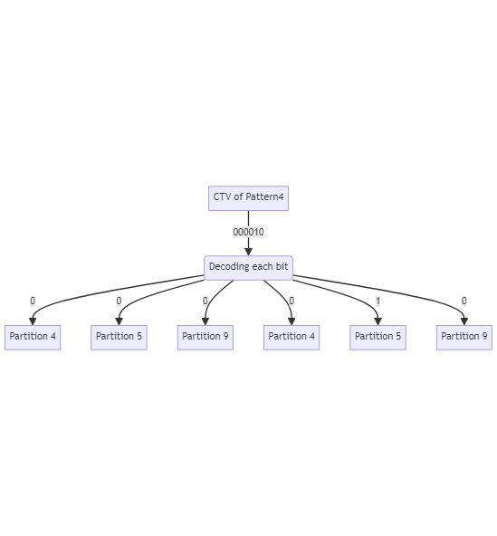

[[_TOC_]]

## REP for GfxScoreBoard

This **REP** is intended to describe the GfxSsnScoreBoardScoreBoard Prime TestMethod.

Prior to reading this REP, it is recommend to read the GfxAggregator SDK to get an overview of the GFX methodology and the infrastructure for it in PRIME.

In this document, you will find the below sections:

  - **Methodology** – A detailed description of this TestMethod intention and purpose

  - **Parameters** – A table describes each instance parameter (Name, Type, Default, Required?)

  - **Console output** – A detailed description of what is printed to console by this TestMethod

  - **Custom User Code hooks** – A list of functions available to the user code to override

  - **TPL Samples** – Examples of how to use this TestMethod in a TPL file

  - **Exit Ports** - A table describes each exit port

  - **Additional Dependencies** – More to consider for this TestMethod to operate

  - **Version tracking** – With author names, so you always have a name to address

  - **Acronyms** - Definition of acronyms used in this document

## Methodology
> PR [#7474](https://dev.azure.com/mit-us/PRIME/_git/PRIME/pullrequest/7474)  
> Ticket [#40871](https://dev.azure.com/mit-us/PRIME/_workitems/edit/40871)

Support new PTL DFX architecture in GFX scoreboard metholodogy. The defects should be captured in different way that cannot be done in existing GFX test methods.  

Full discussion and requirements confirmatation can be found in ticket. 
  
New test method (TM) will be created that implements GFX scoreboard methodology to support the new PTL DFX. Test method will execute plist,
capture ctv data and decode it based on the config provided in input file to decide which EIDs have failed. 

Once decoding is done, test method
will create a tag with those failing EIDs, and will calculate the SKU and print it to ituff and to shared storage  key provided in instance parameter.
Moreover, other GFX related prints will be performed, see [parameters](###parameters) section below for more information.

## Test Instance Parameters
## Interface
### Parameters

| **Parameter Name**            | **Required?** | **Type**        | **Common GFX Param**        |**Description**                                                                                        | **Default value**                  | **Comments**                       			|
| ------------------            | ------------- | --------------- | --------------------------- | ------------------------------------------------------------------------------------------------------ | ---------------------------------- | -------------------------------------------   |
| Patlist                       | Yes           | Plist           | No                          | Plist name to be executed                                                                              |                                    |                                    			|
| TimingsTc                     | Yes           | TimingCondition | No                          | Levels test condition required for plist execution                                                     |                                    |                                    			|
| LevelsTc                      | Yes           | LevelsCondition | No                          | Timing test condition required for plist execution                                                     |                                    |                                   			|
| PrePlist                      | No            | String          | No                          | PrePlist name to be executed                                                                           |                                    |                                   			|
| MaskPins                      | No            | String          | No                          | Comma separated list of pins for which the fail data capture will be skipped                           |                                    |                                  				|
| CtvPinName                    | Yes           | String          | No                          | Pin name for which CTV data should be captured                                     |                                    |                                   			|
| ConfigFile		            | Yes           | File            | No                          | Path to .json input file that describes the CTV mapping to partitions (eids)                                                                                |                                    |                                   			|
| PatternsToIgnore		        | Yes           | File            | No                          | Comma separated patterns regexes to ignore when decoding failures. Note that those won't be disabled on plist level.                                                                                 |                                    |                                   			|
| Area                          | Yes           | String          | Yes                         |  the area name to which the recovery groups and SKUs are relevant                               |                                    |                                   			|
| Content                       | Yes           | String          | Yes                         |  Specify the content name to which the recovery groups and SKUs are relevant                            |                                    |Content must be unique per area     			|
| Tag                           | NO            | String          | Yes                         |  Specify the tag to mark the EID’s status of current instance in SharedStorage                          |                                    |                                  			    |
| StartSku                      | NO            | String          | Yes                         |  Specify the start SKU for evaluation                                                                   |                                    |                                   		    |
| EndSku                        | NO            | String          | Yes                         |  Specify the end SKU for evaluation                                                                     |                                    |                                    			|
| ResultSkuKey                  | NO            | String          | Yes                         |  Specify the name of the result SKU that will be written to SharedStorage                               |                                    |                                    			|
| FailRecoveryGroupsKey         | NO            | String          | Yes                         |  Name of the fail recovery groups for the evaluated SKU that will be written to SharedStorage           |                                    |												|
| HryRawStringDatalog           | NO            | String          | Yes                         |  Specify if HRY raw string is to be datalog                                                             |default ENABLE                      |ENABLE/DISABLE									|
| HryTreeLevelDatalog           | NO            | String          | Yes                         |  Specify up to which HRY tree level to datalog.                                                         |default -1                          |means there will be no HRY tree level datalog. |
| PatternNameCounterIndexes     | Yes           | String          | No                          | Map of indexes to be extracted for each limiting pattern name (using the configured pattern name mapping) for each corresponding target.|              |                                                                                                                                                               |
| BaseNumbers                   | Yes           | CommaSeparatedInteger| No                                   | A list of numbers with which all generated Scoreboard counters will be individually prefixed with.                                      |              |                                                                                                                                                               |
| MaxFailsNum                   | Yes           | UnsignedInteger	   | No                          		| The max number of fails that can be processed.


* Notes
  * **Required common GFX parameters:** Area, Content, Tag, StartSku, EndSku, ResultSkuKey, FailRecoveryGroupsKey, HryRawStringDatalog, HryTreeLevelDatalog  
## Configuration input file
Example of input:
```json
{
"EidMapping":
 [
   {
     "PatternName": "Pattern 1.*",
     "CTVEidMappingOrder": [0, 2, 3];
   },
   {
     "PatternName": "Pattern 4",
     "CTVEidMappingOrder": [4, 5, 9];
   },
 …
 ]
}
```
## CTV decoding to get EID’s pass/fail status
This pseudocode shows decoding steps after we executed a plist, and iterate over all captured CTVs per pattern.  

```c
string ctvString = GetCapturedCtvsPerPattern(currentPattern)
if(ctvString.size() % NumOfPartitions(currentPattern) != 0) // as defined in input file
 PrintErrorAndExitPort0();

foreach(bit in ctvString)
 if (bit == '1')
    MarkPartitionAsFailing(currentPattern, IndexInCtvString(bit)) // partition will be determined by performing (index % NumOfPartitionsForThisPattern). See input file.

```

### Example



After decoding we know that **partition 5 has failed.**
## Assumptions & Behavior
1) If CTV captured on any pattern that has no mapping in the .json file, TM should exit from port 0.  
   The expectation is that if those kind of patterns exist, they should be added to "PatternsRegexesToIgnore" paremeter.

1) If CTV length in a specific pattern is not divisible by the number of partitions, TM should fail with a clear error message.
   For example, if pattern 1 has this partition mapping: {31, 55, 102} and we received ctv of length of 5 (00010), test method will fail.

1) Partitions that didn't appear as failing after decoding all the CTVs will  be marked as passing when creating the GFX tag and when calculating the SKU.


1) All CTVs in plist are intended for the decoding. If decoding failured for any reason (e.g. length not matchig partitions, or no matching pattern section in input..) TM will exit from port 0.
## SKU evaluation
The TestMethod uses the collected EID’s pass/fail information in order to evaluate the corresponding SKU, which can be either:

	•	SKU that match the start SKU:
		o	This is considered as passing die
		o	Datalog the SKU
		o	TestMethod will exit on port #1
	•	SKU that is within the boundaries of the start & end SKU (but does not match either):
		o	This is considered as recovered die
		o	Datalog the SKU
		o	TestMethod will exit on port #2
	•	SKU that match the end SKU:
		o	This is considered as recovered die
		o	Datalog the SKU
		o	TestMethod will exit on port #3
	•	SKU is defined in the SKU’s config file, but after the end SKU:
		o	This is considered as fail die
		o	Datalog the SKU
		o	TestMethod will exit on port #4
	•	SKU is defined in the SKU’s config file, but before the start SKU:
		o	This is considered as fail die
		o	Datalog the SKU
		o	TestMethod will exit on port #5
	•	SKU is not defined in the SKU’s config file:
		o	This is considered as fail die
		o	Datalog NO_VALID_SKU
		o	TestMethod will exit on port #6


Notes:

•	The GFX service have default start & end SKU which can be override locally by the TestMethod's specified start & end SKU (using instance parameters ‘startSku’ & ‘endSku’).


## Datalog output

The TestMethod have various datalog capabilities.
Using StrgvalFormat, where [0/2_tname_... & 0/2_strgval_...] are automatically determined.

**HRY raw string**
This datalog is enabled by default.
To avoid this datalog, instance should be set with: HryRawStringDatalog = “DISABLED”
This string represents the EID’s pass/fail status as it was decoded by the template from captured CTV data. 
Each EID status occupies one character where the location of the character represents the EID ID. 
The values are the decoded value from JSON ValueToDecodeMapping element and from the corresponding HryHierarchy in the EID’s setup file for current area and content.

Continuing the above **Example** of CTV’s decoding to EID’s status, and assuming we have 40 EIDs defined in the EIDs config file, below is how HRY raw string is being calculated and datalog.
**Notes:** 
   - Per this example, EID’s 16-23 are not tested so they will be marked as such in the HRY raw string (9 in this example but user configurable in the EID’s config file using eid_not_tested_symbol attribute of HryHierarchy element)
		- For the case of EID’s that are not defined in the EID’s config file, the file support the ability for user to use the eid_not_exist_symbol attribute of HryHierarchy element, to specify how they will be marked
		- in case that DOA feature is enabled and doa found, thedoa symbol will be used for HRY instead of any other 
		  Results
	
		Datalog format
		2_tname_<Module::Instance>_HRY_RAWSTR_<wrap counter>
		2_strgval_<HRY raw string>

		Note: When *HryPerPattern* vriable is ENABLE, the format will include the pattern index (zero based) and the HRY raw string that is relevant to it.
		2_tname_<Module::Instance>_pattern_<index>_HRY_RAWSTR_1
		2_strgval_<HRY raw string>

		Example
		2_tname_iVal_TPTESTS_GFX::GFXScoreboard_HRY_RAWSTR_1
		2_strgval_0444141444140001999999991110404140044404

		When hry is greater than 3900 characters, the <wrap counter> will generate more tname/strgval pairings: 
		2_tname_iVal_TPTESTS_GFX::GFXScoreboard _HRY_RAWSTR_2
		2_strgval_111… <up to 3900 characters>
		2_tname_iVal_TPTESTS_GFX::GFXScoreboard _HRY_RAWSTR_3
		2_strgval_108… <up to 3900 characters>
		
**SKU, FRG & FEID**
This datalog is always enabled (not user configurable).
The format for SKU, FRG & FEID datalog is:

		2_tname_<Module name::Instance name>_SKU
		2_strgval_<SKU name>
		2_tname_<Module name::Instance name>_FRG
		2_strgval_<Fail Recovery Groups, pipe-separated>
		2_tname_<Module name::Instance name>_FEID_1     Wrap counter enabled for FEID & FPID.
		2_strgval_<Fail EID’s, pipe-separated>

Notes: 
		•	When *HryPerPattern* vriable is ENABLE, the format will include the pattern index (zero based) and the evaluation data that is relevant to it.
		•	Wrap counter is not enabled for [SKU, FRG, TAGS]. If a strgval greater than 3900 characters occurs, an exception will be generated.
		
		2_tname_<Module name::Instance name>_pattern_<index>_SKU
		2_strgval_<SKU name>
		2_tname_<Module name::Instance name>_pattern_<index>_FRG
		2_strgval_<Fail Recovery Groups, pipe-separated>
		2_tname_<Module name::Instance name>_pattern_<index>_FEID_1
		2_strgval_<Fail EID’s, pipe-separated>

Example (when evaluation found valid SKU)

		2_tname_GFX::GfxScoreboard_ChunkThenIterate_SkuBetweenBoundaries_P2_SKU
		2_strgval_4x8S12
		2_tname_GFX::GfxScoreboard_ChunkThenIterate_SkuBetweenBoundaries_P2_FRG
		2_strgval_LNIECS_0,LNIECS_1,GT4_RC0
		2_tname_GFX::GfxScoreboard_ChunkThenIterate_SkuBetweenBoundaries_P2_FEID
		2_strgval_31,32,33,34,35,36,37,38,39

Example (when evaluation found no SKU)

		2_tname_GFX::GfxScoreboard_ChunkThenIterate_SkuIsNotDefined_F6_SKU
		2_strgval_NO_VALID_SKU
		2_tname_GFX::GfxScoreboard_ChunkThenIterate_SkuIsNotDefined_F6_FRG
		2_strgval_UNS_VID,LNIECS_1
		2_tname_GFX::GfxScoreboard_ChunkThenIterate_SkuIsNotDefined_F6_FEID
		2_strgval_24,31

**HRY tree level**

The HRY tree contains the eids in the leafs, and the other nodes contains the levels that every EID element has, 
such that the hry levels that been defined in the EID e,ement represents the path from the root to the appropriate leaf. 

This datalog is disabled by default (instance is setup with: HryTreeLevelDatalog = -1).

To get this datalog, instance should be set with HryTreeLevelDatalog value higher than -1 (where 0 is valid as it is the tree root).

The HRY tree level datalog format and structure are described earlier in this document.

In general, the HRY tree provides capability to group EID’s to logical levels so that each level holds the merged status of all the EID’s it includes.

## Scoreboard
### Introduction
The scoreboard feature makes use of optional Test Method parameters to configure scoreboard logging on the same plist execution (**important**: using scoreboarding ability doesn't add another execution of the plist). This is done in order to log failing patterns by their corresponding Scoreboard counters. This might be useful, for example, for the purpose of TTR. 

A scoreboard counter is a string of characters (typically integer numbers) that represents the full name of a failing pattern. Scoreboard counters are logged into Prime's Shared Storage for later retrieval by a specialized Test Method instance. A scoreboard counter will be prefixed with a base number, which can be used as an identifier for the source of the content in cases where the same pattern might be used for different types of content.

The feature itself is turned on or off by the "BaseNumbers" parameter. The default value for BaseNumbers is empty which means no Scoreboarding is performed. Any valid comma separated list of integers enables Scoreboarding and makes the other Scoreboard parameters required in order to function properly.

### Construction of Scoreboard Counters
The "BaseNumbers" and "PatternNameCounterIndexes" parameters are used to define how a scoreboard counter will be constructed. The PatternNameCounterIndexes will produce the right-hand side of the counter. It's a comma-separated string of integers, where each integer represents a character in the pattern name. Positive numbers, starting at 0, map to characters at the start of the pattern name and forward. Negative numbers starting at -1 map to characters at the end of the pattern name and backward. Refer to the following example:

<table>
<tr>
<td>
PatternNameCounterIndexes = “3,4,-3,5,-1,-2,-3”<br>
Pattern Name = d00<span style="color:lightgreen"><b>277</b></span>25U0064205_013636_EA04dp_2txxx_ux1xb5x0xxxxx0xxx_ul1_pdv_pbdatastrobe_<span style="color:red"><b>642</b></span><br>
Result = <span style="color:lightgreen"><b>27</b></span><span style="color:red"><b>6</b></span><span style="color:lightgreen"><b>7</b></span><span style="color:red"><b>246</b></span>
</td>
</tr>
</table>

Positive indexes are represented, for the purpose of this example, in green color on the pattern name, and negative indexes are represented in red. Once the right-hand side of the counter is constructed, the "BaseNumbers" indicates a number with which it will be prefixed. The next example builds on the previous one while incorporating the base number.


<table>
<tr>
<td>
BaseNumbers = <span style="color:yellow"><b>"1674,506"</b></span><br>
PatternNameCounterIndexes = “3,4,-3,5,-1,-2,-3”<br>
Pattern Name = d00<span style="color:lightgreen"><b>277</b></span>25U0064205_013636_EA04dp_2txxx_ux1xb5x0xxxxx0xxx_ul1_pdv_pbdatastrobe_<span style="color:red"><b>642</b></span><br>
Scoreboard Counter 1= <span style="color:yellow"><b>1674</b></span><span style="color:lightgreen"><b>27</b></span><span style="color:red"><b>6</b></span><span style="color:lightgreen"><b>7</b></span><span style="color:red"><b>246</b></span><br>
Scoreboard Counter 2= <span style="color:yellow"><b>506</b></span><span style="color:lightgreen"><b>27</b></span><span style="color:red"><b>6</b></span><span style="color:lightgreen"><b>7</b></span><span style="color:red"><b>246</b></span>
</td>
</tr>
</table>

### Maximum number of processed scoreboard counters
The "MaxFailsNum" parameter defines the maximum number of counters that will be processed during the Scoreboard execution of the plist. This parameter is zero by default, if no other positive value is passed, then the maximum possible integer value will be used. So for example, if MaxFailsNum = 2, then only up to 2 counters will be logged even if more than two patterns fail in the plist.


## TPL Samples
    
	// Simple test example

	Test PrimeGfxSsnScoreBoardTestMethod PrimeGfxSsnScoreBoardTestMethod_Execute_SimpleTest_Pass_P6
    {
    	Patlist = "gfx_ssn_list";
        LevelsTc = "Gfx::basic_func_lvl_nom";
        TimingsTc = "Gfx::basic_func_timing_10MHz_20MHz";
        LogLevel = "Enabled";
        Area = "GT_PRIME";
        CtvCapturePin = "xxHPCC_DPIN_Dig_slcA_AA0";
        StartSku = "";
        EndSku = "";
        FailRecoveryGroupsKey = "FRG";
        Tag = "PTL_TAG";
        ResultSkuKey = "SKU";
        HryTreeLevelDatalog = -1;
        Content = "SCAN";
        InputFile = "~HDMT_TPL_DIR/TestPrograms/Gfx/Modules/Gfx/InputFiles/GfxSsnScoreboard.gfxssnscrbd.json";
    }

	// Example with scoreboarding enabled

	Test PrimeGfxSsnScoreBoardTestMethod PrimeGfxSsnScoreBoardTestMethod_Execute_ScoreboardingOn_Pass_P6
    {
    	Patlist = "gfx_ssn_list";
        LevelsTc = "Gfx::basic_func_lvl_nom";
        TimingsTc = "Gfx::basic_func_timing_10MHz_20MHz";
        LogLevel = "Enabled";
        Area = "GT_PRIME";
        CtvCapturePin = "xxHPCC_DPIN_Dig_slcA_AA0";
        StartSku = "";
        EndSku = "";
        FailRecoveryGroupsKey = "FRG";
        Tag = "PTL_TAG";
        ResultSkuKey = "SKU";
        HryTreeLevelDatalog = -1;
        Content = "SCAN";
        InputFile = "~HDMT_TPL_DIR/TestPrograms/Gfx/Modules/Gfx/InputFiles/GfxSsnScoreboard.gfxssnscrbd.json";
	    BaseNumbers = "1";
        MaxFailsNum = 10;
        PatternNameCounterIndexes = "21,0,3,5,-1,-4,5";
	}

	    

## Exit Ports
Most of the exit ports are based on the SKU calculation. See 'SKU evaluation' section above.
The generic fail exit port is 0 for this test method.

## Acronyms

Definition of acronyms used in this document:

  - **REP**: P**r**ime T**e**st-Method S**p**ecification
  - **HDMT**: High Density Modular Tester
  - **TPL**: Test Programming Language
  - **CTV**: **C**apture **T**his **V**ector
  - **DMEM**: **D**igital acquisition **MEM**ory

## Version tracking

| **Date**                  | **Version** | **Author**        | **Comments**    |
| ------------------------- | ----------- | ----------------- | --------------- |
| Oct 3<sup>th</sup>, 2023  | 1.0.0       | Dakwar, Wajde     | Initial version |
| Jan 2<sup>nd</sup>, 2023  | 1.1         | Dakwar, Wajde     | Full capabilities based on Ticket #40871. |
| Oct 22<sup>nd</sup>, 2024  | 1.2         | Dakwar, Wajde     | Scoreboarding capability is added based on Ticket #53296. |
