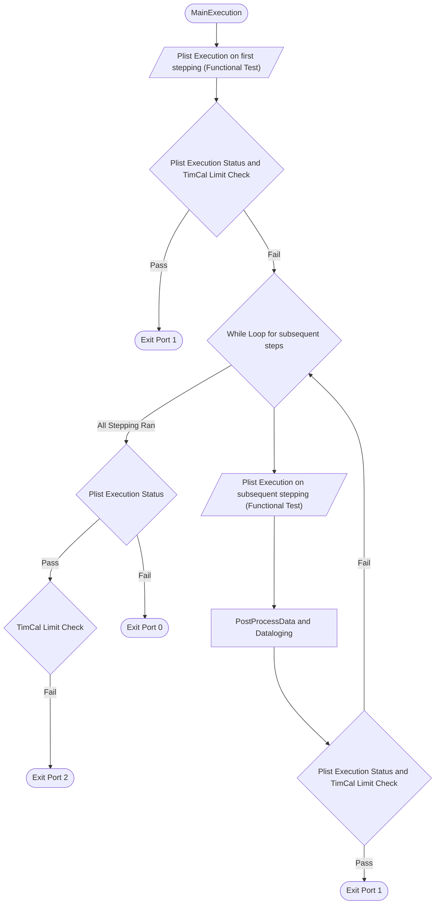

<h1>Prime Test-Method Specification REP</h1>
Revision 1.0.0

This Test Method is inherit from MPE PGM PCH Team.

March 2024

[[_TOC_]]

## Methodology
The Prime HptpTimingCalibration test method moves forward the strobe offset of the TX pins to the optimal point (center of eye width).
The Prime HptpTimingCalibration test method utilize the Full Speed Loopback Pattern, and require Patmod file.

## Note about timing calibration mode parameters
There are concern about confusing parameters ```XAxisDriveOffsetParameter``` and ```YAxisStrobeOffsetParameter``` which is designated for RX based mode, but also able to cater for TX based mode by just invert it's parameters assignment. [#60347](https://dev.azure.com/mit-us/PRIME/_workitems/edit/60347/)

Configure as RX Based,
```
XAxisDriveOffsetParameter = "hptp_rx_drv_offset_param";
YAxisStrobeOffsetParameter = "hptp_tx_stb_offset_param";
```

Configure as TX Based,
```
XAxisDriveOffsetParameter = "hptp_tx_stb_offset_param"
YAxisStrobeOffsetParameter = "hptp_rx_drv_offset_param";
```

---

Hence in Prime <b>v13.2.2 and onwards</b>, we are introducing 3 new parameters to replace ```XAxisDriveOffsetParameter``` and ```YAxisStrobeOffsetParameter```, ```XAxisDriveOffsetParameter``` and ```YAxisStrobeOffsetParameter``` will remain as it is, and to be remove in future. <br>
The new parameters are as below,
- ```CalibrationMode```
- ```SmallCalibrationOffsetParameter```
- ```LargeCalibrationOffsetParameter```

Configure as RX Based,
```
CalibrationMode = "RX_BASED";
SmallCalibrationOffsetParameter = "hptp_rx_drv_offset_param";
LargeCalibrationOffsetParameter = "hptp_tx_stb_offset_param";
```

Configure as TX Based,
```
CalibrationMode = "TX_BASED";
SmallCalibrationOffsetParameter = "hptp_tx_stb_offset_param";
LargeCalibrationOffsetParameter = "hptp_rx_drv_offset_param";
```

Please consider to move to new parameters, as there it is less confusing and less work when ```XAxisDriveOffsetParameter``` and ```YAxisStrobeOffsetParameter``` removed.

## Test Instance Parameters

The table below lists and describes the test instance parameters supported by the HptpTimingCalibration test method

| **Parameter Name** | **Required?** | **Type** | **Default Value** | **Comments** |
| ------------------ | ------------- | -------- | ----------------- | -------------|
|MaskPins            | No | String | | Gets or sets comma separated pins for mask. |
|TimingCalibratePins | No | String | | Gets or sets comma separated pins for timing calibration. |
|TimingCalibrationNames | No | String | | Gets or sets comma separated Params for timing calibration. (it is TimingCalibrateTxNames, for Backward Competibility) |
|TimingCalibrateTxNames | No | String | | Gets or sets comma separated TX Params for timing calibration. |
|TimingCalibrateRxNames | No | String | | Gets or sets comma separated RX Params for timing calibration. |
|TimingCalPatmodConfiguration | No | String | | Gets or sets the configuration to patch the termination codes in the timing calibration pattern, or input for TermShift patmod mode |
|StartLargeOffset | No | String | | Gets or sets the static value for the starting point in the Y axis for the 1D shmoo. |
|XAxisDriveOffsetParameter | No | String | | Gets or sets the name of the global drive offset parameter for the RX pins. XAxisDriveOffsetParameter is deprecated, please use SmallCalibrationOffsetParameter and LargeCalibrationOffsetParameter. |
|YAxisStrobeOffsetParameter | No | String | | Gets or sets the name of the global strobe offset parameter for the TX pins. YAxisStrobeOffsetParameter is deprecated, please use SmallCalibrationOffsetParameter and LargeCalibrationOffsetParameter. |
|Patlist | No | Plist | | Gets or sets Patlist to execute the plist timing calibration on. |
|TimingsTc | No | TimingCondition | | Gets or sets TimingsTc for plist execution. |
|LevelsTc | No | LevelsCondition | | Gets or sets LevelsTc to plist execution. |zz
|TimingCalibrationRange | No | String | | Gets or sets the maximun swing range for the timing calibration to take place. |
|CalTDRRegisterFieldSequence | No | String | | Gets or sets the field sequence value of the cal tdr register to be patmod into the pattern. |
|OutputTokenPrefix | No | String | | Gets or sets the prefix used in the output timing token. |
|OutputTokenPostfix | No | String | | Gets or sets the postfix used in the output timing token. |
|EyeWidthLimit | No | String | | Gets or sets the eyewidth limit. |
|ResetToNominal | No | Enum | TRUE | Gets or sets the option to restore the timing specs after the test is executed. |
|MaxCaptures | No | Integer | 9999 | Gets or sets maximum number of captures admited before pattern execution is stopped. |
|ExecutionMode | Yes | Enum(TIMING_CALIBRATION,TIMING_OVERRIDE,TERMSHIFTCODE_PATMOD,VOX_OVERRIDE,PATMOD_AND_TIMING_OVERRIDE) | TIMING_CALIBRATION | The Execution Mode of Calibration and Override. |
|TimingOverrideDriveParams | No | String | | Gets or sets the name of the global drive offset parameter for Timing Override. |
|TimingOverrideDriveValues | No | String | | Gets or sets comma separated values for the name of the perpin strobe offset param, can be a number or SharedstorageToken. |
|TimingOverrideDriveOffset | No | String | | Gets or sets the value for additional offset require for drive param. |
|TimingOverrideStrobeParams | No | String | | Gets or sets comma separated params of the name of the perpin strobe offset parameter. |
|TimingOverrideStrobeValues | No | String | | Gets or sets comma separated values for the name of the perpin strobe offset param, can be a number or SharedstorageToken. |
|VoxTxOverridePins | No | String | | Gets or sets comma separated values for the name of the perpin strobe offset param, can be a number or SharedstorageToken. |
|VoxRxOverridePins | No | String | | Gets or sets comma separated values for the name of the perpin strobe offset param, can be a number or SharedstorageToken. |
|VoxTxOverrideParams | No | String | | Gets or sets comma separated values for the name of the perpin strobe offset param.|
|VoxRxOverrideParams | No | String | | Gets or sets comma separated values for the name of the perpin strobe offset param.|
|VoxSupplyParam | No | String | | Gets or sets Vox Supply Parameter.|
| CalibrationMode | No | Enum(TX_BASED, RX_BASED) | TX_BASED | Gets or sets calibration mode. |
| SmallCalibrationOffsetParameter | No | String | | Gets or sets the name of the global drive/strobe offset parameter. Use along with LargeCalibrationOffsetParameter and CalibrationMode parameters. |
| LargeCalibrationOffsetParameter | No | String | | Gets or sets the name of the global drive/strobe offset parameter. Use along with SmallCalibrationOffsetParameter and CalibrationMode parameters. |

## Execute FlowChart


This is the flowchart focusing how the port exiting works

Port 1 generally will break the looping while Plist execution and TimCal Limit status are passing.

Port 0 is when all stepping was run, Plist execution and TimCal Limit status are still failing.

Port 2 is when all stepping was run, Plist execution is passing but TimCal Limit status is failing.

*note, if there is any pin is failing, Plist execution should be flag as fail.


## Flow Visualization
First Iteration of execution loop


Consecutive Iteration of execution loop


## Datalog output

ituff output:
```
0_strgval_TimingCal|<TimingCalibrationPin>|<RXName>|<BestRXOffset>|<TXName>|<LowerMargin>|<UpperMargin>|<BestOffset>|<Eye width>|<PinCalibrationStatus>|<OverallCalibrationStatus>|<CalTDRRegsiterFieldSequence1>>|<CalTDRRegsiterFieldSequence2>…
```

ituff output for Prime v13.2.2 and onwards,
```
0_strgval_TimingCal|<TimingCalibrationPin>|<LargeOffsetName>|<BestLargeOffset>|<SmallOffsetName>|<LowerMargin>|<UpperMargin>|<BestSamlleOffset>|<Eye width>|<PinCalibrationStatus>|<OverallCalibrationStatus>|<CalTDRRegsiterFieldSequence1>>|<CalTDRRegsiterFieldSequence2>…
```

RX based (e.g on TX0 pin):
Did strobing on < *TimingCalibrationPin* > using value < *BestOffset* > on < *TimingCalibrationNames* > was successful(< *PinCalibrationStatus* >)


## Datalog output Design (expecting sticky data)
The Ituff print of the <font color="yellow">eyewidth</font> will only show, and stick on the first passing information, the info can easily associate with the first passing <font color="green">pin status</font>, the <font color="purple">StartLargeOffSet</font> also be tied to the first passing info.

Example from user console log: <br>
Calibration failed with StartLargeOffset = 2.5E-10s<br>
2_tname_SIO_HPTP::HPTP_X_TIMCAL_E_START_X_X_NOM_X_700_TX1_TimingCalData<br>
2_strgval_TIMINGCAL|HPTP_DATA_TX_7|hptp_rx7_drv_offset_param|<font color="purple">2.5E-10</font>|hptp_tx7_stb_offset_param|5.5E-10|5.5E-10|5.5E-10|<font color="yellow">0</font>|<font color="green">False</font>|False|43|20|10|49|53|FAILLIMIT<br>

Calibration failed with StartLargeOffset = 3E-10s<br>
2_tname_SIO_HPTP::HPTP_X_TIMCAL_E_START_X_X_NOM_X_700_TX1_TimingCalData<br>
2_strgval_TIMINGCAL|HPTP_DATA_TX_7|hptp_rx7_drv_offset_param|<font color="purple">3E-10</font>|hptp_tx7_stb_offset_param|5.5E-10|5.5E-10|5.5E-10|<font color="yellow">0</font>|<font color="green">False</font>|False|43|20|10|49|53|FAILLIMIT<br>

Calibration failed with StartLargeOffset = 3.5E-10s<br>
2_tname_SIO_HPTP::HPTP_X_TIMCAL_E_START_X_X_NOM_X_700_TX1_TimingCalData<br>
2_strgval_TIMINGCAL|HPTP_DATA_TX_7|hptp_rx7_drv_offset_param|<font color="purple">3.5E-10</font>|hptp_tx7_stb_offset_param|5.5E-10|5.5E-10|5.5E-10|<font color="yellow">0</font>|<font color="green">False</font>|False|43|20|10|49|53|FAILLIMIT<br>

Calibration failed with StartLargeOffset = 4E-10s<br>
2_tname_SIO_HPTP::HPTP_X_TIMCAL_E_START_X_X_NOM_X_700_TX1_TimingCalData<br>
2_strgval_TIMINGCAL|HPTP_DATA_TX_7|hptp_rx7_drv_offset_param|<font color="purple">4E-10</font>|hptp_tx7_stb_offset_param|7.5E-10|9.5E-10|8.5E-10|<font color="yellow">2.0000000000000003E-10</font>|<font color="green">True</font>|False|43|20|10|49|53|FAILLIMIT<br>

Calibration failed with StartLargeOffset = 4.5E-10s<br>
2_tname_SIO_HPTP::HPTP_X_TIMCAL_E_START_X_X_NOM_X_700_TX1_TimingCalData<br>
2_strgval_TIMINGCAL|HPTP_DATA_TX_7|hptp_rx7_drv_offset_param|<font color="purple">4E-10</font>|hptp_tx7_stb_offset_param|7.5E-10|9.5E-10|8.5E-10|<font color="yellow">2.0000000000000003E-10</font>|<font color="green">True</font>|False|43|20|10|49|53|FAILLIMIT<br>

Calibration failed with StartLargeOffset = 5E-10s<br>
2_tname_SIO_HPTP::HPTP_X_TIMCAL_E_START_X_X_NOM_X_700_TX1_TimingCalData<br>
2_strgval_TIMINGCAL|HPTP_DATA_TX_7|hptp_rx7_drv_offset_param|<font color="purple">4E-10</font>|hptp_tx7_stb_offset_param|7.5E-10|9.5E-10|8.5E-10|<font color="yellow">2.0000000000000003E-10</font>|<font color="green">False</font>|False|43|20|10|49|53|FAILLIMIT<br>

Calibration failed with StartLargeOffset = 5.5E-10s<br>
2_tname_SIO_HPTP::HPTP_X_TIMCAL_E_START_X_X_NOM_X_700_TX1_TimingCalData<br>
2_strgval_TIMINGCAL|HPTP_DATA_TX_7|hptp_rx7_drv_offset_param|<font color="purple">4E-10</font>|hptp_tx7_stb_offset_param|7.5E-10|9.5E-10|8.5E-10|<font color="yellow">2.0000000000000003E-10</font>|<font color="green">False</font>|False|43|20|10|49|53|FAILLIMIT<br>

Calibration failed with StartLargeOffset = 6E-10s<br>
2_tname_SIO_HPTP::HPTP_X_TIMCAL_E_START_X_X_NOM_X_700_TX1_TimingCalData<br>
2_strgval_TIMINGCAL|HPTP_DATA_TX_7|hptp_rx7_drv_offset_param|<font color="purple">4E-10</font>|hptp_tx7_stb_offset_param|7.5E-10|9.5E-10|8.5E-10|<font color="yellow">2.0000000000000003E-10</font>|<font color="green">False</font>|False|43|20|10|49|53|FAILLIMIT<br>

Calibration failed with StartLargeOffset = 6.5E-10s<br>
2_tname_SIO_HPTP::HPTP_X_TIMCAL_E_START_X_X_NOM_X_700_TX1_TimingCalData<br>
2_strgval_TIMINGCAL|HPTP_DATA_TX_7|hptp_rx7_drv_offset_param|<font color="purple">4E-10</font>|hptp_tx7_stb_offset_param|7.5E-10|9.5E-10|8.5E-10|<font color="yellow">2.0000000000000003E-10</font>|<font color="green">False</font>|False|43|20|10|49|53|FAILLIMIT<br>

Calibration failed with StartLargeOffset = 7E-10s<br>
2_tname_SIO_HPTP::HPTP_X_TIMCAL_E_START_X_X_NOM_X_700_TX1_TimingCalData<br>
2_strgval_TIMINGCAL|HPTP_DATA_TX_7|hptp_rx7_drv_offset_param|<font color="purple">4E-10</font>|hptp_tx7_stb_offset_param|7.5E-10|9.5E-10|8.5E-10|<font color="yellow">2.0000000000000003E-10</font>|<font color="green">False</font>|False|43|20|10|49|53|FAILLIMIT<br>


## SharedStorage Token
1. The sharedstorages below are created after the calibration, 
```

  HPTP_TIMINGCAL_< *TimingCalibrateTxNames* >_< *BestTXOffset* > -> Double Datatype

  HPTP_TIMINGCAL_< *TimingCalibrateRxNames* >_< *BestRXOffset* > -> Double Datatype
```
2. The CalTDRRegisterFieldSequence will split and try to get from sharedstorage if the field is string, the sharedstorage would coming mainly from EyeDiagram. It will fail out at execution if the field cannot be found or parse.

3. The condition on whether the SharedStorage will save the information is determined by the <font color="yellow">current Pin status</font>, regardless of whether the pin was passed on the previous stepping.

2_tname_SIO_HPTP::HPTP_X_TIMCAL_E_START_X_X_NOM_X_700_TX1_TimingCalData<br>
2_strgval_TIMINGCAL|HPTP_DATA_TX_0|hptp_rx0_drv_offset_param|4E-10|hptp_tx0_stb_offset_param|7.999999999999999E-10|9.999999999999999E-10|8.999999999999999E-10|1.9999999999999993E-10|True|False|43|20|10|49|53|FAILLIMIT<br>
2_tname_SIO_HPTP::HPTP_X_TIMCAL_E_START_X_X_NOM_X_700_TX1_TimingCalData<br>
2_strgval_TIMINGCAL|HPTP_DATA_TX_1|hptp_rx1_drv_offset_param|4E-10|hptp_tx1_stb_offset_param|7E-10|9E-10|7.999999999999999E-10|2.0000000000000003E-10|True|False|43|20|10|49|53|FAILLIMIT<br>
2_tname_SIO_HPTP::HPTP_X_TIMCAL_E_START_X_X_NOM_X_700_TX1_TimingCalData<br>
2_strgval_TIMINGCAL|HPTP_DATA_TX_2|hptp_rx2_drv_offset_param|3.5E-10|hptp_tx2_stb_offset_param|7E-10|9E-10|7.999999999999999E-10|2.0000000000000003E-10|True|False|43|20|10|49|53|FAILLIMIT<br>
2_tname_SIO_HPTP::HPTP_X_TIMCAL_E_START_X_X_NOM_X_700_TX1_TimingCalData<br>
2_strgval_TIMINGCAL|HPTP_DATA_TX_3|hptp_rx3_drv_offset_param|7E-10|hptp_tx3_stb_offset_param|7.5E-10|9E-10|8.249999999999999E-10|1.5E-10|True|False|43|20|10|49|53|FAILLIMIT<br>
2_tname_SIO_HPTP::HPTP_X_TIMCAL_E_START_X_X_NOM_X_700_TX1_TimingCalData<br>
2_strgval_TIMINGCAL|HPTP_DATA_TX_4|hptp_rx4_drv_offset_param|4.5E-10|hptp_tx4_stb_offset_param|7.5E-10|9.5E-10|8.5E-10|2.0000000000000003E-10|True|False|43|20|10|49|53|FAILLIMIT<br>
2_tname_SIO_HPTP::HPTP_X_TIMCAL_E_START_X_X_NOM_X_700_TX1_TimingCalData<br>
2_strgval_TIMINGCAL|HPTP_DATA_TX_5|hptp_rx5_drv_offset_param|5E-10|hptp_tx5_stb_offset_param|7.5E-10|9.5E-10|8.5E-10|2.0000000000000003E-10|True|False|43|20|10|49|53|FAILLIMIT<br>
2_tname_SIO_HPTP::HPTP_X_TIMCAL_E_START_X_X_NOM_X_700_TX1_TimingCalData<br>
2_strgval_TIMINGCAL|HPTP_DATA_TX_6|hptp_rx6_drv_offset_param|3.5E-10|hptp_tx6_stb_offset_param|7E-10|9.999999999999999E-10|8.5E-10|2.999999999999999E-10|True|False|43|20|10|49|53|FAILLIMIT<br>
2_tname_SIO_HPTP::HPTP_X_TIMCAL_E_START_X_X_NOM_X_700_TX1_TimingCalData<br>
2_strgval_TIMINGCAL|HPTP_DATA_TX_7|hptp_rx7_drv_offset_param|4E-10|hptp_tx7_stb_offset_param|7.5E-10|9.5E-10|8.5E-10|2.0000000000000003E-10|<font color="yellow">False</font>|False|43|20|10|49|53|FAILLIMIT<br>
 
Saved "HPTP_TIMINGCAL_hptp_tx0_stb_offset_param_700_TX" = 8.999999999999999E-10 for pin HPTP_DATA_TX_0.<br>
Saved "HPTP_TIMINGCAL_hptp_rx0_drv_offset_param_700_TX" = 4E-10 for pin HPTP_DATA_TX_0.<br>
Saved "HPTP_TIMINGCAL_hptp_tx1_stb_offset_param_700_TX" = 7.999999999999999E-10 for pin HPTP_DATA_TX_1.<br>
Saved "HPTP_TIMINGCAL_hptp_rx1_drv_offset_param_700_TX" = 4E-10 for pin HPTP_DATA_TX_1.<br>
Saved "HPTP_TIMINGCAL_hptp_tx2_stb_offset_param_700_TX" = 7.999999999999999E-10 for pin HPTP_DATA_TX_2.<br>
Saved "HPTP_TIMINGCAL_hptp_rx2_drv_offset_param_700_TX" = 3.5E-10 for pin HPTP_DATA_TX_2.<br>
Saved "HPTP_TIMINGCAL_hptp_tx3_stb_offset_param_700_TX" = 8.249999999999999E-10 for pin HPTP_DATA_TX_3.<br>
Saved "HPTP_TIMINGCAL_hptp_rx3_drv_offset_param_700_TX" = 7E-10 for pin HPTP_DATA_TX_3.<br>
Saved "HPTP_TIMINGCAL_hptp_tx4_stb_offset_param_700_TX" = 8.5E-10 for pin HPTP_DATA_TX_4.<br>
Saved "HPTP_TIMINGCAL_hptp_rx4_drv_offset_param_700_TX" = 4.5E-10 for pin HPTP_DATA_TX_4.<br>
Saved "HPTP_TIMINGCAL_hptp_tx5_stb_offset_param_700_TX" = 8.5E-10 for pin HPTP_DATA_TX_5.<br>
Saved "HPTP_TIMINGCAL_hptp_rx5_drv_offset_param_700_TX" = 5E-10 for pin HPTP_DATA_TX_5.<br>
Saved "HPTP_TIMINGCAL_hptp_tx6_stb_offset_param_700_TX" = 8.5E-10 for pin HPTP_DATA_TX_6.<br>
Saved "HPTP_TIMINGCAL_hptp_rx6_drv_offset_param_700_TX" = 3.5E-10 for pin HPTP_DATA_TX_6.<br>
Saved "HPTP_TIMINGCAL_hptp_tx7_stb_offset_param_700_TX" = <font color="yellow">0</font> for pin HPTP_DATA_TX_7.<br>
Saved "HPTP_TIMINGCAL_hptp_rx7_drv_offset_param_700_TX" = <font color="yellow">0</font> for pin HPTP_DATA_TX_7.<br>


## Custom User Code Hooks
N/A

## TPL Samples
**TPL Sample1:**

HptpTimingCalibration Test Method(default configuration):
```python
Import PrimeHptpTimingCalibrationTestMethod.xml;

Test PrimeHptpTimingCalibrationTestMethod HPTPTimingCal_TX_Based_P1
{
	LogLevel = "Enabled";
	LevelsTc = "HptpTimingCalibration::basic_hptp_lvl_nom"; 
	Patlist = "passing_plist"; 
	YAxisStrobeOffsetParameter = "strobe_tx_offset_param";
	StartLargeOffset = "0.3E-9";
	XAxisDriveOffsetParameter = "drive_rx_offset_param";
	MaxCaptures = 600;
	TimingCalibrationRange = "0:0.1e-9:14"; 
	TimingCalPatmodConfiguration = "FULLSPEED_LB_DEFAULT"; 
	TimingCalibratePins = "xxHPCC_DPIN_Dig_slcA_AA6,xxHPCC_DPIN_Dig_slcA_AA7";
	TimingCalibrationNames = "t_func_rx0_dfx_dpins_drv_e1_offset_param,t_func_rx1_dfx_dpins_drv_e1_offset_param";
	TimingCalibrateRxNames = "t_func_tx0_dfx_dpins_stb_e5_offset_param,t_func_tx1_dfx_dpins_stb_e5_offset_param";
	TimingsTc = "HptpTimingCalibration::basic_hptp_timing_0p667ns"; 
	CalTDRRegisterFieldSequence = "10, 10, 42, 43, 42";
	EyeWidthLimit = "0.3E-9";
	OutputTokenPrefix = "prefix1_";
	OutputTokenPostfix = "_postfix1";
}
```

## Exit Ports

The test method supports the following exit ports:


| **Exit Port** | **Condition**   | **Description**              |
| ------------- | --------------- | ---------------------------- |
| **0**         | ***Fail***      | Failing condition            |
| **1**         | ***Pass***      | Passing condition            |
| **2**         | ***Fail***      | Failing condition            |

  
## Additional Dependencies

Patmod configurations that is in patmod input file need to be load in as aleph file.

## Version tracking

| **Date**       | **Version** | **Author**   | **Comments** |
| -------------- | ----------- | ------------ | ------------ |
| Sept, 2025      | 13.3.x.x    | Chen, Dong H | https://dev.azure.com/mit-us/PRIME/_workitems/edit/62309/ |
| June, 2025      | 13.3.0      | Lee, Yeong Jui | https://dev.azure.com/mit-us/PRIME/_workitems/edit/59209/ |
| May, 2025      | 13.2.2      | Lee, Yeong Jui | https://dev.azure.com/mit-us/PRIME/_workitems/edit/60620/ |
| May, 2025      | 13.2.2      | Khoh, Chen Tat | https://dev.azure.com/mit-us/PRIME/_workitems/edit/60347/ |
| March, 2025 | 13.02.00       | Lee, Yeong Jui|https://dev.azure.com/mit-us/PRIME/_workitems/edit/52774|
| September, 2024 | 13.02.00       | Lee, Yeong Jui|https://dev.azure.com/mit-us/PRIME/_workitems/edit/52824/|
| March, 2024 | 13.01.00       | Lee, Yeong Jui|              |
| March, 2024 | 0.0.0       | Ooi, Shin Yee|              |

## Acronyms

Definition of acronyms used in this document:

  - **REP**: P**r**ime T**e**st-Method S**p**ecification
  - **HDMT**: High Density Modular Tester
  - **TPL**: Test Programming Language
  - **TOS**: Test Operating System