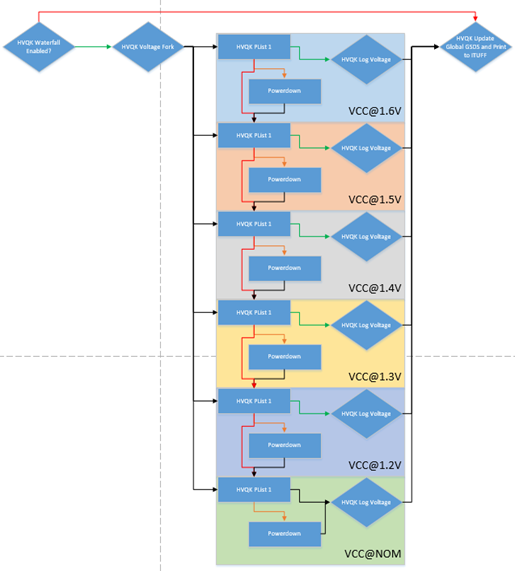

[[_TOC_]]

## REP for Hvqk

This **REP** is intended to describe the Hvqk Prime TestMethod.

In this document, you will find the below sections:

  - **Methodology** – A detailed description of this TestMethod intention and purpose

  - **Parameters** – A table describes each instance parameter (Name, Type, Default, Required?)

  - **Datalog output** – A detailed description of what is datalogged by his TestMethod

  - **Custom User Code hooks** – A list of functions available to the user code to override

  - **TPL Samples** – Examples of how to use this TestMethod in a TPL file

  - **Exit Ports** - A table describes each exit port

  - **Additional Dependencies** – More to consider for this TestMethod to operate

  - **Version tracking** – With author names, so you always have a name to address

  - **Acronyms** - Definition of acronyms used in this document

## Methodology
HVQK is a Quality and Reliability (QnR) test screen in HVM programs which stresses the DUT in order to detect latent defects. It is an integral part of the overall Qualification strategy for a product. Having a robust HVQK solution is part of the MTR, or Minimum Test Requirements, utilized to approve product release qualification. The amount of stress applied to the DUT is utilized for several key QnR Metrics which both measure the health of the process and the reliability of the product. Determining the amount of stress is the key requirement of each program. HVQK is a waterfall flow where the voltage stresses applied are descending, step to step. Each power domain can have its own waterfall flow (e.g., Core, Graphics, etc.)




The test class algorithm manipulates the power pins (domains) per voltage_step, executes a plist, and then loops to the next voltage_step until a stop condition is found. 

Step 0: Resolve first waterfall step in voltage_start XML element in input file – it can be either explicit value or expression.  This is done during verify. The resolved value will be the first voltage_step executed in the algorithm.

Step 1: For the current voltage_step, apply all voltages in the vforce elements utilizing the sub-elements to specify pin, value, pattern override (if designated), and levels block (if designated).

Step 2: Execute the plist to determine pass or fail. Please note that some patterns can trigger a voltage change mid-burst execution. 

Step 3: If the pattern execution is a pass, continue to step 3a. If the execution resulted in an alarm, skip to Step 4. If the execution returned a plist failure, skip to Step 5

Step 3a: Assign the voltageToken the value of the current voltage_step and exit port 1. 

Step 4. Determine the value of alarm_action for the current voltage_step. If this switch is set to CONTINUE, proceed to Step 4a. If the switch is set to EXIT, exit port -2. 

Step 4a. Apply the powerDownOnClamp levels followed by the powerUpOnClamp levels – this will clear out the clamp. 

Step 4b. If this is the last voltage_step, assign the voltageToken a value of “-1” and exit port 2.

Step 4c. If this is not the last voltage_step, index to the next voltage_step and return to Step 1.

Step 5: Determine the value of plist_exec_fail action for this instance. If this switch is set to CONTINUE, proceed to Step 5a. If the switch is set to EXIT, skip to Step 3a.

Step 5a. If this is the last voltage_step, assign the voltageToken a value of “-1” and exit port 2.

Step 5b. If this is not the last voltage_step, index to the next voltage_step and return to Step 1.

Step 5c. If this is the voltage_step with the plist_exec_failure_action set to FAIL, note the voltage step, continue waterfall according to plist_exec_fail and exit port 3.

Step 6: If DTS process fail and stress is pass, then exit port 0.

::: mermaid
flowchart TD
    A(Start) --> B(Create an ordered list of voltage step. Index to the voltage start)
    B --> C(Force the voltages on all pins in the current voltage step)
    C --> D(Execute Plist Result)
    
    D --> G{PASS}
    G --> J(Set voltage token = voltage step)
   
    J --> |Port1|P(Is DTS Fail and stress is Pass?)
    P --> |Yes| Q(Port 0)
    P --> |No| R(Port 1)

    D --> E{FAIL}
    E --> H(plist_exec_failure_action)
    H -->|FAIL| M(Port 3)
    H -->|Continue| K
    H -->|Exit| J
    J --> |Port2| N


    D --> F{ALARM}
    F --> |Continue|O(Power Down and Power Up)
    F --> |Not Continue| I(Port -2)

    
   
    O --> K{Is this the last voltage step?}
    K -->|No| B
    K -->|Yes| N(Stop the test, port  2)
::: 

## Test Instance Parameters

The table below lists and describes the test instance parameters supported by the Hvqk test method

| **Parameter Name** | **Required?** | **Type** | **Values** | **Default Value** | **Comments** |
| ------------------ | ------------- | -------- | ---------- | ------------ | -----|
| VoltageStepConfigFile  | Yes           | String          | Input file which defines HVQK waterfall steps. Each step defines its details.|              |
| Patlist                | Yes           | Plist           | Plist name to be executed                                                    |              |
| LevelsTc               | Yes           | LevelsCondition | Levels test condition required for plist execution                           |              |
| TimingTc               | Yes           | TimingCondition | Timing test condition required for plist execution                           |              |
| PowerDownLevel         | No            | String          | Optional set of PowerDown level when alert happened                          |              |
| PowerUpLevel           | No            | String          | Optional set of PowerUp level when alert happened                            |              |
| DtsConfigurationName           | No            | String          | Configuration when DTS processing is needed.(Aleph Input file)       |              |
| AlarmHandleDelay       | No            | Integer         | Optional set of time(millisecond) delay when alert happened                  |              |
| MaskPins       | No            | String         | Comma separated pins for mask                        |              |
*Hvqk TM and HvqkManager TM verify will trigger metadata population if its empty. HVQK metadata file is read from a uservar "HVQKVars.PATH_TO_METADATA"

For DtsProcessing, please refer the wiki page under ServicesSDK\DtsProcessingService.

## Json File Sample for HVQK Metadata
``` json
{PRIME Ticket 37369: [BRITA] Flow Trace Broken for SRF Power On TP - Prime v10
	"VoltageIndicators": [
		{
			"Name": "IA",
			"VoltageSteps": {
				"1.6": 7,
				"1.5": 6,
				"1.4": 5,
				"1.3": 4,
				"1.2": 3,
				"1.1": 2,
				"1.0": 1
			}
		},
		{
			"Name": "GT",
			"VoltageSteps": {
				"1.6": 7,
				"1.5": 6,
				"1.4": 5,
				"1.3": 4,
				"1.2": 3,
				"1.1": 2,
				"1.0": 1
			}
		}
    ],
	"HvqkInstances": [
		{
			"Name": "IA",
			"InstancesMapping": [
				"IA1",
				"IA2",
				"IA3",
				"IA4"
			]
		},
		{
			"Name": "GT",
			"InstancesMapping": [
				"GT1",
				"GT2",
				"GT3"
			]
		}
	]
}
```
## Json File Sample for HVQK Instance Config
``` json
{
	"DomainName" : "IA",
	"InstanceName" : "IA1",
	"VoltageStart" : "HVQKVars.Start_Voltage", 
	"VoltageStop" : "HVQKVars.Stop_Voltage",
	"Pin": [ "HDDPS_HC_nogang_12ohm1" ],
	"VoltageSteps": [
		{
			"Name": "1.6",
			"AlarmAction" : "CONTINUE",
			"PlistExecFailAction" : "CONTINUE",
			"Vforce": {
				"LevelsBlockDirect": ["HVQK::basic_func_lvl_nom", "HVQK::basic_func_lvl_nom"],
			},
			"SharedStorage" : {
				"TokenName" : "StorageOnPass",
				"TokenValue" : "Voltage1.6_PASS",
				"Condition" : "PASS",
			}
		},
		{
			"Name": "1.5",
			"AlarmAction" : "CONTINUE",
			"PlistExecFailAction" : "CONTINUE",
			"Vforce": {
				"ForceValue" : 1.4
			},
			"SharedStorage" : {
				"TokenName" : "StorageOnFail",
				"TokenValue" : "Voltage1.5_FAIL",
				"Condition" : "FAIL",
			}
		},
		{
			"Name": "1.4",
			"AlarmAction" : "CONTINUE",
			"PlistExecFailAction" : "CONTINUE",
			"Vforce": {
				"ForceValue" : 1.2
			}
		},
		{
			"Name": "1.3",
			"AlarmAction" : "CONTINUE",
			"PlistExecFailAction" : "CONTINUE",
			"Vforce": {
				"ForceValue" : 0.5
			}
		},
		{
			"Name": "1.2",
			"AlarmAction" : "EXIT",
			"PlistExecFailAction" : "CONTINUE",
			"Vforce": {
				"ForceValue" : 1.2,
				"PlistOverride" : "passing_plist"
			}
		},
		{
			"Name": "1.1",
			"AlarmAction" : "EXIT",
			"PlistExecFailAction" : "CONTINUE",
			"Vforce": {
				"ForceValue" : 1.1
			}
		},
    ]
}
```

SharedStorage section can be added to any voltage step to define the value that will be stored in the SharedStorage given that the defined condition is fulfilled for that voltage step execution. Only one SharedStorage object is expected for each voltage step, if one or more are defined shared storage data will be taken from the last one.

- TokenName: This will be used as key in the SharedStorage service.
- TokenValue: Value that will be inserted under the shared storage key provided by `TokenName`.
- Condition: This determines when to store the value in the shared storage service. Allow options are:
  - PASS: Plist execution passed and no alarm was thrown.
  - FAIL: Either plist execution failed OR an alarm was thrown.
  - ALWAYS: Stores into service regardless of plist or alarm result.

## Json File Sample for HVQK Instance Config with Software Trigger
```
{
	"DomainName" : "IA",
	"InstanceName" : "IA1",
	"VoltageStart" : "HVQKVars.Start_Voltage", 
	"VoltageStop" : "HVQKVars.Stop_Voltage",
	"Pin": [ "HDDPS_HC_nogang_12ohm1" ],
	"VoltageSteps": [
		{
			"Name": "1.6",
			"AlarmAction" : "CONTINUE",
			"PlistExecFailAction" : "CONTINUE",
			"Vforce": {
				"LevelsBlockDirect": ["HVQK::basic_func_lvl_nom", "HVQK::basic_func_lvl_nom"],
				"TriggerItem": "Hvqk::ExternalTrigger16"
				}
		},
		{
			"Name": "1.5",
			"AlarmAction" : "CONTINUE",
			"PlistExecFailAction" : "CONTINUE",
			"Vforce": {
					"TriggerItem": "Hvqk::ExternalTrigger15"
				}
		},
		{
			"Name": "1.4",
			"AlarmAction" : "CONTINUE",
			"PlistExecFailAction" : "CONTINUE",
			"Vforce": {
					"TriggerItem": "Hvqk::ExternalTrigger14"
				}
		},
		{
			"Name": "1.3",
			"AlarmAction" : "CONTINUE",
			"PlistExecFailAction" : "CONTINUE",
			"Vforce": {
					"TriggerItem": "Hvqk::ExternalTrigger13"
				}
		},
		{
			"Name": "1.2",
			"AlarmAction" : "EXIT",
			"PlistExecFailAction" : "CONTINUE",
			"Vforce": {
					"TriggerItem": "Hvqk::ExternalTrigger12",
					"PlistOverride" : "passing_plist"
				}
		},
		{
			"Name": "1.1",
			"AlarmAction" : "EXIT",
			"PlistExecFailAction" : "CONTINUE",
			"Vforce": {
					"TriggerItem": "Hvqk::ExternalTrigger11"
				}
		},
    ]
}
```

**Note

-VoltageStart and VoltageStop are dynamic parameter with able to accepting value as static number, or a uservar.


## Datalog output
Currently the fail and pass execution ituff print will be similar to functional test method. <br>

⚠ TOS3 ONLY <br>
In the event of tester alarm, additional info of executing plist and executed burst ID will be print to ituff in the following format, <br>
<0|2>\_\<TestInstanceName\>\_\<StepIndicator\> <br>
<0|2>\_HVQK_CLAMP\_Plist_\<PlistName\>\_BurstId_\<BurstIdNumber\>

## Custom User Code Hooks
Hvqk test method supports the following extensions:

### void ExecutePreStepUserCode()
- this is usercode allow to intercept right before the stress is applied.

### void ExecutePrePlistUserCode()
- this is usercode that allow to intercept right before the plist is executed.

### void ExecutePostPlistUserCode()
- this is usercode that allow to intercept right after the plist is executed.

### void ExecutePostStepUserCode()
- this is usercode allow to intercept right after the stress is applied.

## TPL Samples
```
Test PrimeHvqkTestMethod HvqkCore_Core1Pass_P1
{
    VoltageStepConfigFile = "~HDMT_TPL_DIR/Modules/HVQK/HVQK/InputFiles/CORE_CORE1.hvqk.config.json";
    Patlist = "failures_plist";
    LevelsTc = "HVQK::basic_func_lvl_nom";
    TimingsTc = "HVQK::basic_func_timing_10MHz_20MHz";
	PowerDownLevel = "";
	PowerUpLevel = "";
	AlarmHandleDelay = "";
}
```

## Exit Ports

The Hvqk test method supports the following exit ports:


| **Exit Port** | **Condition**   | **Description**                                |
| ------------- | --------------- | ---------------------------------------------- |
| **-2**        | ***Alarm***     | Alarm condition                                |
| **0**         | ***Fail***      | Failing condition on DTS Fail but stress Pass  |
| **1**         | ***Pass***      | Passing condition                              |
| **2**         | ***Pass***      | Plist Execution Failed On Lowest Voltage       |
| **3**         | ***Pass***      | Plist Execution Failed On User Configured VMax |

  
## Additional Dependencies

N/A

## Version tracking

| **Date**       | **Version** | **Author**   | **Comments** |
| -------------- | ----------- | ------------ | ------------ |
| June, 2025 | 13.3.0 | Liu Tao | [60848](https://dev.azure.com/mit-us/PRIME/_workitems/edit/60848): [SORT][HVQK] DTS fails Port issue fix |
| January, 2025 | 13.2.0 | Maria Hernandez | [47495](https://dev.azure.com/mit-us/PRIME/_workitems/edit/47495): [SORT][HVQK] Sort vmax enabling |
| December, 2024 | 13.1.0       | Khoh, Chen Tat| [54585](https://dev.azure.com/mit-us/PRIME/_workitems/edit/54585): [PrimeHvqkTestMethod] If hardware alarm happened, no CTV data was collected, hence there's no DTS reading data |
| November, 2024 | 13.1.0       | Lee, Yeong Jui| [54410](https://dev.azure.com/mit-us/PRIME/_workitems/edit/54410): [PrimeHvqkTestMethod] Hardware alarm failing port[0] is incorrect while processing DTS failed, failing port should be [-2] |
| July, 2024 | 13.1.0 | Tiow, Hian Seng | [51942](https://dev.azure.com/mit-us/PRIME/_workitems/edit/51942/): PrimeHVQK wiki json config is not accurate enough and could mislead wrong input files of HVQK module. |
| April, 2024 | 13.1.0       | Lee, Yeong Jui| [48983](https://dev.azure.com/mit-us/PRIME/_workitems/edit/48983/): [Sort][HVQK] MaskPins parameter needed for PrimeHvqkTestMethod template |
| October, 2023 | 13.0.0       | Lee, Yeong Jui| [39334](https://dev.azure.com/mit-us/PRIME/_workitems/edit/39334/): Create new extension and adding DtsProcessing Capabilities to Hvqk TM |
| April, 2022 | 1.0.0       | Lee, Yeong Jui|              |

## Acronyms

Definition of acronyms used in this document:

  - **REP**: P**r**ime T**e**st-Method S**p**ecification
  - **HDMT**: High Density Modular Tester
  - **TPL**: Test Programming Language
  - **TOS**: Test Operating System