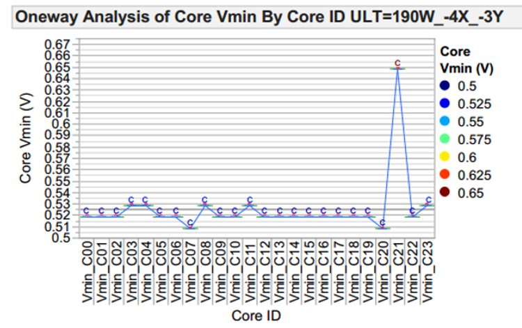
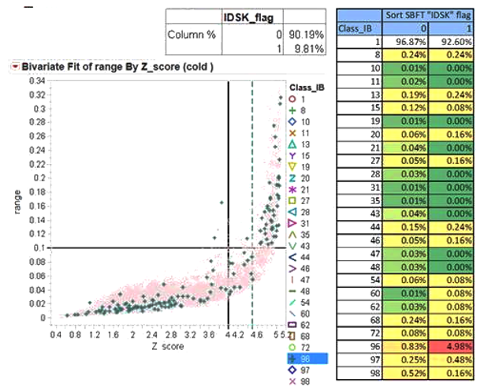
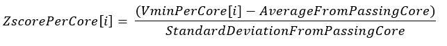
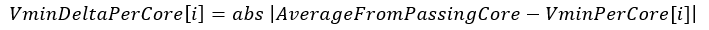

**prime Test-Method Specification REP**

Revision 2.0.0

Oct 2022

[[_TOC_]]

##REP for IDSK

The Intra Die Statistical Kill (IDSK) is a unified standard statistical model for high volume manufacturing to measure Intra/inter-die core/slice performance and perform defeature as a POR method once an outlier core has been identified.

## Methodology

The IDSK infrastructure is going to measure intra/inter-die core/slice performance, providing different methods to analyze the Vmin behavior and giving the user the option to set which conditions will be considered for the defeature/kill of a core. One of the methods will be the standard statistical model IDSK (Intra Die Statistical Kill).

The IDSK is a statistical method used to analyze the performance between cores/slice based on the Vmin values per core, providing information to establish a core(s)/slice disablement. The structural defects can be pointed using this software solution since it detects the cores/slice that may not necessarily fail in the tests (patterns) but are outliers of the Vmin distribution. The algorithm takes the standard deviation and the mean value of the distribution to define the core/slice defeature.
The information provided by these statistics helps the unit performance analysis to examine the correlation and accuracy of the FAB process and to understand yield issues.

The figure \[1\] is an example of a unit with a Vmin core distribution which contains an outlier value which corresponds to core 23 with a Vmin of 0.65 V, in this case of study, core 21 was de-featured by IDSK because was over the 4 sigma limit, so future tests or customer will not be able to operate this core resource. 



***Figure 1*.** Core minimum voltage vs core identifier number. An Outlier core in a unit Vmin distribution at SORT.

Once per core/slice Vmin distribution is acquired, IDSK test computes the mean, the covariance, the standard deviation and finally the Z-score for each core/slice Vmin and tags the ones with a 4 sigma delta from mean, updating valid core tracking structure and disabling possible bad cores/slice.



***Figure 2*.** Evaluation of the parameters from the IDSK methodology to identify an outlier core based on the Z-score (X axis) and the Vmin delta (or range in the Y axis).

Equation 1 & 2 below are the equations for calculating before the
screening process to find out the outlier core.



***Equation 1*.** Z-score Calculation



***Equation 2*.** Vmin Delta Calculation

##Test Instance Parameters

The table below lists and describes the test instance parameters supported by the Idsk test method

| **Parameter Name** | **Required?** | **Type** | **Comments**                                     |
| ------------------ | ------------- | -------- | ------------------------------------------------ |
| VminInput          | Yes           | String   | Incoming VMIN string                             |
| OutlierVector      | Yes           | String   | Outgoing tracking structure GSDS                 |
| BitLogic           | Yes           | Choice   | Kill for zscore AND/OR vmin\_delta. Values are AND(Default) or OR |
| StdDevFloor        | Yes           | Double   | Minimum standard deviation allowed               |
| StdDevCeiling      | Yes           | Double   | Maximum standard deviation allowed               |
| ZscoreLimit        | Yes           | Double   | Sigma kill limit                                 |
| VminDelta          | Yes           | Double   | Maximum vmin difference allowed                  |

## Datalog output

The following values will be printed to the ituff concatenated with a “|”. All double values will be rounded to four digits.

### Ituff Data
| **Data**         | **Description** |
| ---- | --------- | 
| Mean                       | Mean of all valid Vmin values  provided  |
| Standard Deviation         | Std deviation parameter calculated in idsk test |
| standardDeviationFixed         | Std deviation after user provided Ceiling an Floor are applied  |
| IDSK Cores to Kill        | IDSK cores identified to be defeatured in the tracking structure (different from the XOR between the incoming core configuration and the outlier cores identified) |
| InputVminValues        | All vmin values provided (not just valid ones) |
| Median        | Median value for all the enabled cores|
| Max         | Highest Vmin core value from all the enabled cores |
| Min         | Lowest Vmin core value from all the enabled cores |
| FlagForOutliers         | 1 if outlier was detected 0 if no outliers were detected |

### Datalog Print
(0/2)\_tname\_(InstanceName)

(0/2)\_strgval\_
<mark style="background-color: red; color:white">Mean</mark>|
<mark style="background-color: lightblue">standardDeviation</mark>|
<mark style="background-color: magenta">standardDeviationFixed</mark>|
<mark style="background-color: yellow">IDSK Cores to Kill</mark>|
<mark style="background-color: lightgrey">InputVminValues</mark>|
<mark style="background-color: lightgreen">Median</mark>|
<mark style="background-color: orange">Max</mark>|
<mark style="background-color: lavender">Min</mark>|
<mark style="background-color: pink">FlagForOutliers</mark>

<span class="anchor"></span>**Example:**

Input:
```python
Import PrimeIdskTestMethod.xml;

Test PrimeIdskTestMethod Test1
{
	BitLogic = "OR";
	OutlierVector = "IDSKOutput";
	StdDevCeiling = 0.2;
	StdDevFloor = 0.02;
	VminDelta = 0.1;
	VminInput = "IDSKInput";
	ZscoreLimit = 1.8;
    LogLevel = "TEST_METHOD";
}
```
Where IDSKInput = 0.3,0.55,0.6,0.6,0.7,0.7,0.7,0.7,0.6,0.55,0.6,0.99,-999,-666


__Result:__

2\_tname\_Test1

2\_strgval\_<mark style="background-color: red; color:white">0.6325</mark>|
<mark style="background-color: lightblue">0.1512</mark>|
<mark style="background-color: magenta">0.1512</mark>|
<mark style="background-color: yellow">10000000000111</mark>|
<mark style="background-color: lightgrey">0.3,0.55,0.6,0.6,0.7,0.7,0.7,0.7,0.6,0.55,0.6,0.99,-999,-666</mark>|
<mark style="background-color: lightgreen">0.6</mark>|
<mark style="background-color: orange">0.99</mark>|
<mark style="background-color: lavender">0.3</mark>|
<mark style="background-color: pink">1</mark>


__Key:__

<mark style="background-color: red; color:white">Mean</mark>|
<mark style="background-color: lightblue">standardDeviation</mark>|
<mark style="background-color: magenta">standardDeviationFixed</mark>|
<mark style="background-color: yellow">IDSK Cores to Kill</mark>|
<mark style="background-color: lightgrey">InputVminValues</mark>|
<mark style="background-color: lightgreen">Median</mark>|
<mark style="background-color: orange">Max</mark>|
<mark style="background-color: lavender">Min</mark>|
<mark style="background-color: pink">FlagForOutliers</mark>
## Custom User Code Hooks

Here is the list of functions available to the user code to override.

\<TBD\>

## TPL Samples

Here are a few test instance examples using the Idsk test method.

For more examples please check the Hybrid Sample Test program in the
PRIME user SDK directory.

**TPL Sample1**:

```python
Import PrimeIdskTestMethod.xml;

Test PrimeIdskTestMethod Test1
{
	BitLogic = "OR";
	OutlierVector = "IDSKGOutput";
	StdDevCeiling = 0.025;
	StdDevFloor = 0.01;
	VminDelta = 0.1;
	VminInput = "IDSKInput";
	ZscoreLimit = 4.5;
    LogLevel = "TEST_METHOD";
}
```
## Exit Ports

The Idsk test method supports the following exit ports:


| **Exit Port** | **Condition** | **Description**              |
| ------------- | ------------- | ---------------------------- |
| **-2**        | ***Alarm***   | Any alarm condition          |
| **-1**        | ***Error***   | Any software condition error |
| **0**         | ***Fail***    | Failing condition            |
| **1**         | ***Pass***    | Passing condition            |

## Additional Dependencies

More dependencies to consider for this TestMethod to well operate:

This method depends on SharedStorage key to get vmin input string and output bit vector. 
In order to use EVG's GSDS, routing Evergreen GSDSs to Prime must be enabled through the .env file.

```python
ROUTE_GSDS_TO_PRIME = "TRUE";
```

* If GSDS is not routed to Prime (not recommended) you can create any user code Test Method to copy the GSDS value to/from the SharedStorage key.

## Version tracking


| **Date**      | **Version** | **Author**       | **Comments**    |
| ------------- | ----------- | ---------------- | --------------- |
| Jun 9th, 2020 | 1.0.0       | Humberto Ramirez | Initial Release |
| Oct 20th, 2022 | 2.0.0       | Lauren McDonald  | Update to sync with previous EVG behaviour |
|               |             |                  |                 |

## Acronyms

Definition of acronyms used in this document:

  - **REP**: P**r**ime T**e**st-Method S**p**ecification
  - **HDMT**: High Density Modular Tester
  - **TPL**: Test Programming Language
  - **TOS**: Test Operating System