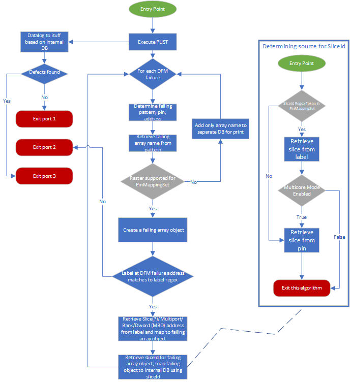
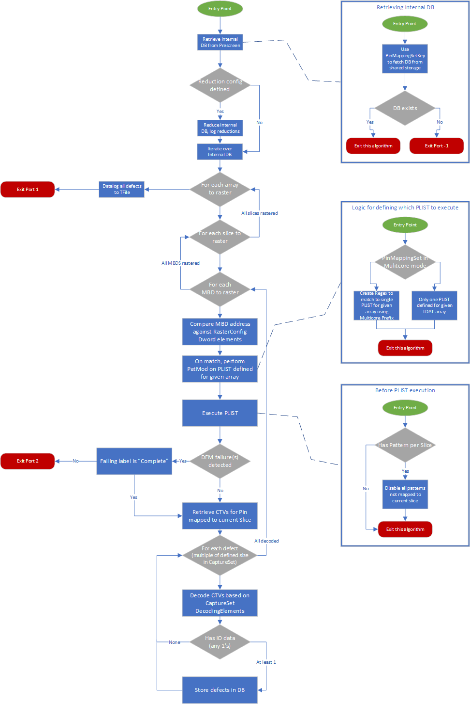

**prime Test-Method Specification REP**

Apr 2022

[[_TOC_]]

## REP for LSARaster

This **REP** is intended to describe the LSARaster Prime TestMethod.

## Introduction

LSARaster Test Method is a generic Raster, Prescreen and HRY Test Method for LSA arrays.

It has 2 modes of operation:
	<br />**Prescreen** – Map Failure Data Instance failures with PBIST Fail labels to failed arrays based on Metadata configuration.
	<br />**Raster** – Perform raster on all arrays found in a previous Prescreen instance.

## User Interface Parameters

The table below lists and describes the user interface parameters supported by the LSARaster test method


| **Parameter Name** | **Required?** | **Type** | **Default** | **Description** | **Used by mode RASTER** | **Used by mode PRE-SCREEN** |
| ------------------ | :-------------: | -------- | ----------- | --------------- | :---------------------: | :-------------------------: |
| ExecutionMode      | NO        | ENUM   | PRESCREEN | Sets the instance mode of PrimeLSARasterTestMethod. | 🗸 |  🗸 |
| TfileRasterPrint   | NO        | String | True     | Enables printing to raster tfile. | 🗸 |   |
| Patlist            | NO        | String |          | Plist to use when running LsaRaster in PRESCREEN mode. |   | 🗸 |
| TimingsTc          | YES       | String |          | Name of a timing block to use for pattern execution | 🗸 |  🗸 |
| LevelsTc           | YES       | String |          | Name of a levels block to use for pattern execution | 🗸 | 🗸 |
| PrePlist           | NO        | String |          | PrePlist callback to plist execution. |  | 🗸 |
| MaskPins           | NO        | String |          | Comma separated list of pins for which the fail data capture will be skipped| | 🗸 |
| MetadataConfigPath | YES       | String |          | Path to the configuration required for all modes. Contains info on identifying ArrayName, Slice, Decoding CTVs, etc. | 🗸 |  🗸 |
| HryMapPath         | NO        | String |          | Path to HryMap file. Required when in Prescreen and PrescreenPrintMode is set to CTV_Mode. |  | 🗸 |
| RasterConfigPath   | NO        | String |          | Path to JSON file that contains the setup information for the Ldat arrays. | 🗸 | |
| PinMappingSetName  | YES       | String |          | PinMappingSet to use when decoding Failure Data Instance failures to specified arrays. | 🗸 | 🗸 |
| ReductionConfigSetName | NO    | String |          | ReductionConfigSet to use during Raster execution; optional if user needs to reduce internalDB. | 🗸 |  |
| PrescreenMapName   | NO        | String |          | Name used to store Internal DB in SharedStorage. Must be the same between Prescreen and Raster instances. | 🗸 | 🗸 |
| PrescreenPrintMode | NO        | ENUM   | FAILMODE | PASS_MODE = Print only pass/fail indicator to ituff <br /> FAIL_MODE = Print fail info to ituff <br /> CTV_MODE = Decode CTV data into Hry info based on HryTableConfig| | 🗸 |
| PrescreenHryFlowToken | YES    | String |          | HRY Flow token name to be printed to ITUFF. | | 🗸 |
| PrescreenHryFrequencyToken | YES | String |        | HRY Frequency token name to be printed to the ITUFF. | | 🗸 |
| PrescreenMafLimit  | NO        | Integer| 0        | Maximum number of arrays to store for Raster Testing. | | 🗸 |
| OutputTag          | NO        | String |          | Name used to upload defect info to an iCRepair instance. | 🗸 | |
| RasterMapSimulation| NO        | String |          | Formatted string to use when faking an internal DB that would normally be generated by Prescreen| 🗸 | |

**Notes**
* When running on a class socket, a Fivr condition must be specified using the FivrCondition common parameters, FivrConditionName and FivrConditionPlistParamName, to indicate wich FivrContion should be applied and the name of the parameter pointing to the plist to execute.

## Test Method Exit Ports

The LSA Raster test method supports the following exit ports:

| **Exit Condition** | **Detailed Description** | **Port Number** |
| :----------------: | ------------------------ | :-------------: |
| ***Alarm*** | Any hardware alarm | **-2** |
| ***Error*** | Any test class error, software errors, or software execution fails.  If instance times out after 30 seconds, it will return this port. | **-1** |
| ***Fail***  | **PRESCREEN MODE:** Preamble failure during prescreen execution <br /> **RASTER MODE:** Ldat array not found in Raster configuration. | **0**  |
| ***Pass***  | **PRESCREEN MODE:** No defects found <br /> **RASTER MODE:** Successful raster of arrays | **1**  |
| ***Fail***  | **PRESCREEN MODE:** Pattern failed on vector with no label, or pattern failed on label that doesn’t match MBD naming convention (case insensitive). ( <span style="color:red">FAIL\|IO_MBD\|STROBE_ME_MBD</span>) <br /> **RASTER MODE:** Failing cycle detected on non-complete label (busy fail, etc) in any domain. | **2** |
| ***Pass***  | **PRESCREEN MODE:** Arrays detected for raster | **3**  |

## Implementation

### Verify logic (all modes)

#### Verify
During init, LSARaster will check for all required params for the current execution mode. If the parameter requirements for a given mode are met the instance will deserialize each configuration into its own object, then perform a check to ensure all required elements are present. <br>
If the TM instance detects any missing parameters or malformed inputs, the TM will fail verify.

### Unit reset
**User does not need to take any action in order to reset** the internal DB or the Defect DB for Repair between units.
LSARaster has a Reset Policy in place to clear both in between each unit. This data is all stored on the Shared Storage with a "DUT" access context, meaning it can be accessed even across all IPs of the same DUT. 

### Prescreen Mode

#### Verify
* Validity check for all instance parameters required by Prescreen mode. Refer to the list of parameters required by Prescreen mode in the [User Interface Parameters](#user-interface-parameters) section.
* Verify that the PinMappingSetName has a valid entry in the metadata file.

#### Execute
* Unless RasterMapSimulation is used, LSARaster in PRESCREEN mode must be placed somewhere in the flow **before** the corresponding RASTER instance using the same PrescreenMapName. Prescreen generates a DB of failing arrays unless otherwise specified by the PinMappingSet used.
* Prescreen mode will run the PLIST from Patlist param and capture all Failure Data Instance failures. 
  + For each Failure Data Instance failure, the Test Method will fetch the name of the array from the pattern name using the **ArrayNameRegex** defined in the Configurations for a given PinMappingSet.
  + If Raster mode is supported for the current PinMappingSet, for each failure, the Test Method fetches the DWORD address from the failing label of the Failure Data Instance failure using the **PrescreenLabelRegex**, also defined within the PinMappingSet configuration section
  + Once an object representing the failed array is created, the failure is mapped to a “root key”. The root key is defined by the current product the Test Method is performing raster on
    - Ex. If the Test Method is dealing with BigCore products, the root key used will be “Slice”, if the Test Method is dealing with ATOM products, the root key used will be “Module”
  + The captured failing arrays and addresses will then be stored in internal DB under a key defined by the PrescreenMapName param.
* Next, Prescreen will log the HRY data depending on the selected **PrescreenPrintMode option**. For PrescreenPrintMode = FAILMODE or PASSMODE, no special setup is needed. Please refer to Ituff format section for details on what is printed to Ituff. PrescreenPrintMode = CTVMODE requires additional setup and input file – [details below](#hry-ctv-mode-config-file-(prescreen-mode)).

<br />**Execution flow** 



#### Ituff format
LSARaster in PRESCREEN mode generates ITUFF based on the PrescreenPrintMode, PrescreenHryFlowToken, PrescreenHryFreqToken and PrescreenMafLimit parameters.
Note: RootKey is product dependent, BigCore uses SliceID, ATOM uses Module

**PrescreenPrintMode = PASSMODE**

```
2_tname_HRY_IA_LSA_<PrescreenHryFlowToken>_<PrescreenHryFreqToken>
2_mrslt_1
```

**PrescreenPrintMode = FAILMODE**

For each array, if the failing array count is below the MAF limit it will print

```
2_tname_HRY_IA_LSA_< PrescreenHryFlowToken >_< PrescreenHryFreqToken >_<RootKey>_FC
2_mrslt_0
```

and for each failing array

```
2_tname_HRY_IA_LSA_<ArrayName>_< PrescreenHryFlowToken >_< PrescreenHryFreqToken >_<RootKey>
2_mrslt_0
```

If above the MAF Limit, for each slice the following will be printed

```
2_tname_HRY_IA_LSA_<ArrayName>_<PrescreenHryFlowToken>_<PrescreenHryFreqToken>_<RootKey>
2_mrslt_<PrescreenMafLimit>
```

**PrescreenPrintMode = CTVMODE**

```
2_tname _<Test instance name>_ HRY_RAWSTR
2_ strgval _<HRY String>
```

### Raster Mode

#### Verify
The Test Method will parse ‘RasterConfigFilePath”, validate its content against the metadata file and prepare several objects needed for execute.

#### Execute
Unless RasterMapSimulation is used, the LSARaster in RASTER mode is used in conjunction with Prescreen mode to raster the arrays Prescreen mode has flagged. 
If no CTV is captured, while the corresponding Prescreen instance has found defects, this is an error case and will print out to T-file the following line: ‘#NonValid_[DWORD],[BANK],0x000,0x00000000’

<u>Raster flow:</u>

&nbsp;&nbsp;&nbsp;1. Retrieve internal DB from previous Prescreen instance <br>
&nbsp;&nbsp;&nbsp;2. Iterate over all arrays failed in Prescreen <br>
&nbsp;&nbsp;&nbsp;&nbsp;&nbsp;&nbsp;&nbsp;&nbsp;&nbsp;a. First verify that RasterExists is not = False in RasterConfig (array skipped) <br>
&nbsp;&nbsp;&nbsp;&nbsp;&nbsp;&nbsp;&nbsp;&nbsp;&nbsp;b. For each failing array iterate over each failing slice (or module) <br>
&nbsp;&nbsp;&nbsp;&nbsp;&nbsp;&nbsp;&nbsp;&nbsp;&nbsp;&nbsp;&nbsp;&nbsp;&nbsp;&nbsp;&nbsp;i. For each failing slice, iterate over all failing MBD addresses <br>
&nbsp;&nbsp;&nbsp;&nbsp;&nbsp;&nbsp;&nbsp;&nbsp;&nbsp;&nbsp;&nbsp;&nbsp;&nbsp;&nbsp;&nbsp;&nbsp;&nbsp;&nbsp;1. For each MBD address, match to a DwordElement specified in RasterConfig <br>
&nbsp;&nbsp;&nbsp;&nbsp;&nbsp;&nbsp;&nbsp;&nbsp;&nbsp;&nbsp;&nbsp;&nbsp;&nbsp;&nbsp;&nbsp;&nbsp;&nbsp;&nbsp;&nbsp;&nbsp;&nbsp;a. These DwordElements may contain more PatTargets than Multiport, Bank, Dword, but we only need to match to the MBD values for now <br>
&nbsp;&nbsp;&nbsp;&nbsp;&nbsp;&nbsp;&nbsp;&nbsp;&nbsp;&nbsp;&nbsp;&nbsp;&nbsp;&nbsp;&nbsp;&nbsp;&nbsp;&nbsp;2. For each PatModifyElement in DwordElement, apply a pattern modify as specified by the PatModConfigSetName for the given array <br>
&nbsp;&nbsp;&nbsp;&nbsp;&nbsp;&nbsp;&nbsp;&nbsp;&nbsp;&nbsp;&nbsp;&nbsp;&nbsp;&nbsp;&nbsp;&nbsp;&nbsp;&nbsp;&nbsp;&nbsp;&nbsp;a. The Test Method will search for the configuration name with the combination of “PatModConfigSetName + _ + PatModifyElement” within an ALEPH file <br>
&nbsp;&nbsp;&nbsp;&nbsp;&nbsp;&nbsp;&nbsp;&nbsp;&nbsp;&nbsp;&nbsp;&nbsp;&nbsp;&nbsp;&nbsp;&nbsp;&nbsp;&nbsp;&nbsp;&nbsp;&nbsp;b. Apply the value specified in the PatModifyElement <br>
&nbsp;&nbsp;&nbsp;&nbsp;&nbsp;&nbsp;&nbsp;&nbsp;&nbsp;&nbsp;&nbsp;&nbsp;&nbsp;&nbsp;&nbsp;&nbsp;&nbsp;&nbsp;3. Execute the PLIST <br>
&nbsp;&nbsp;&nbsp;&nbsp;&nbsp;&nbsp;&nbsp;&nbsp;&nbsp;&nbsp;&nbsp;&nbsp;&nbsp;&nbsp;&nbsp;&nbsp;&nbsp;&nbsp;4. Ensure the execution ended on a “Complete” label if there are any Failure Data Instance failures <br>
&nbsp;&nbsp;&nbsp;&nbsp;&nbsp;&nbsp;&nbsp;&nbsp;&nbsp;&nbsp;&nbsp;&nbsp;&nbsp;&nbsp;&nbsp;&nbsp;&nbsp;&nbsp;5. Parse and decode CTV data into defects using specified CaptureSet for the given array in the RasterConfig file <br>
&nbsp;&nbsp;&nbsp;3. Once all arrays, slices/module, and their MBD addresses have been iterated over, submit all collected defect data to TFile <br>
&nbsp;&nbsp;&nbsp;4. Submit defect data to the Shared Storage using key “OutputTag” for iCRepair <br>
&nbsp;&nbsp;&nbsp;&nbsp;&nbsp;&nbsp;&nbsp;&nbsp;&nbsp;a. If data already exists on this tag, it will be overwritten <br>

##### Multiple Slices/Modules With a Single Plist
This feature allows for the rastering of multiple modules/slices with a single plist. It's enabled by the "SlicesTotal" token in the [CaptureConfigSets](#captureconfigsets) section of the [Metadata File](#metadata-file) when its value is greater than 1.

When rastering multiple slices/modules the LSARaster Test Method will process CTVs by segments of bits, one segment per slice/module. The number of bits per slice that must be processed from the total amount of CTVs is determined from the "Length" token of the "CaptureConfigSets" section.

When CTVs are received, the LSARaster Test Method validates that the total number of CTVs is equal to the number of slices multiplied by the "Length" value, otherwise an exception will be thrown. Since this feature is expected to be used with serial rastering, the Test Method will check that the corresponding PinMapping has the same pin and HRY name for all slices/modules, otherwise an exception will be thrown.

This feature is available for both ATOM and Big Core products.

#### T-file format
Note there should not be any duplicate defects printed.  If there are no defects (Tfile string should contain “0x” to represent a hex address) then there should be no printing to the T-file for that unit.  

If there is a non-valid CTV string from raster (empty CTV), you should see “#NonValid” printed to Tfile.

For BigCore
```python
Array: <ArrayName>
Slice: <Slice>
<Dword>,<Bank>,<FailAddress>,<FailIO>
<Dword>,<Bank>,<FailAddress>,<FailIO>
```

For ATOM
```python
Array: <ArrayName>
Module: <Module>
<Core>,<Dword>,<Bank>,<FailAddress>,<FailIO>
<Core>,<Dword>,<Bank>,<FailAddress>,<FailIO>
```

Note: When running the test instance in a SORT socket, the EI_X_COORDINATE and the EI_Y_COORDINATE will be printed to the Tfile to identify each DUT. In the case of running the TP in a CLASS socket, the VisualId will be printed as DUT identifier.

#### RasterMapSimulation
If the user of this Test Method wants to perform raster on a location (Array, Slice/Module, MBD) without the need for Prescreen flagging it for raster, the RasterMapSimulation param can be used to fake the internal raster map to target locations defined by the user.
The TM parameter takes in a formatted string following the example below:

```
ArrayNameA,RootKey,Multiport#|Bank#|Dword#;ArrayNameB,RootKey,Multiport#|Bank#|Dword#
```

Each “location” is specified by array name, root key (depending on the product), and MBD address. Each value of a location is delimited by commas [ , ], the MBD values are delimited by pipes [ | ], and each location is delimited by commas [ ; ]. Here are requirements to follow when formatting the given string:
* The last location of the simulation string cannot end with a semicolon, the Test Method will attempt to parse an empty string and throw an error
* No spaces are allowed within the string
* Ensure that the slice/module for each location is defined within the PinMappingSet
* Ensure the slice/module for each location is typed exactly as its equivalent within the PinMappingSet
* Ensure that the array name is defined within the RasterConfig
* Ensure that the array name for each location is typed exactly as its equivalent within the RasterConfig
* Ensure that the MBD address values are present within the RasterConfig

Extra notes:

* The Test Method has no limit on how many locations can be submitted to the RasterMap
* The Test Method cannot combine a simulated database with one created by Prescreen mode

**To enable this functionality**, enter a valid string into the RasterMapSimulation param that follows the requirements described above. If no string is present, the Test Method will attempt to pull from the PrescreenMapName instead.

<br />**Execution flow**



## Input Files

### Metadata file
Metadata file constructs from 3 independent sections:
* PatModConfigSets 
* CaptureConfigSets 
* SlicePinMapping 

```json
{
  "Setup": {
    "PatModConfigSets": {
      ...
    },
    "CaptureConfigSets": {
      ...
    },
    "SlicePinMapping": {
      ...
    },
}
```

#### PatModConfigSet
PatModConfigSet defines a group of pattern modify to use when targeting an MBD address for a particular array in Raster mode. An array in the RasterConfig will refer to one of these PatModConfigSets by name, defining the pat mods to use before execution.

Next is a list of PatternModifiers – one per PatTarget: Multiport/Bank/Dword/IOMask (/MaxDefectsCount) while for multiple IOMasks it is allowed to have more than one defined, each with an index: IOMask_0, IOMask_1, IOMask_2, etc.

Multiport, Bank, Dword and IOMask are required PatTargets. MaxDefectsCount is optional and will modify the pattern opcode “MOV RX, Y” – X is the value of the register, Y is the value of the PatTarget defined in the RasterConfig.

Although the Test Method was designed to take the PatTargets listed above, the Test Method will also take extra PatTargets, as long as they’re defined within the ALEPH file and values are given within the RasterConfig.

When performing a pat mod using a PatModConfigSet, the Test Method will search for the combined name of the “main key” and a PatternModifier within the ALEPH files.  Ex. Array_A uses LSA_RASTER_PAT_MODIFY_SET_CORE, we’re targeting PatTargets Multiport, Bank, Dword, IOMask. The Test Method looks for the names LSA_RASTER_PAT_MODIFY_SET_CORE_Multiport, LSA_RASTER_PAT_MODIFY_SET_CORE_Bank, LSA_RASTER_PAT_MODIFY_SET_CORE_Dword, LSA_RASTER_PAT_MODIFY_SET_CORE_IOMask in the ALEPH files. Once these names are found, the Test Method will then look into the RasterConfig file for the values it needs for each PatTarget in order to perform the PatMod.

```json
"PatModConfigSets": {
      "LSA_RASTER_PAT_MODIFY_SET_CORE": [ "MaxDefectsCount", "Multiport", "Bank","Dword", "IOMask" ],
      "LSA_RASTER_PAT_MODIFY_SET_CBO": [ "MaxDefectsCount", "Multiport", "Bank", "Dword", "IOMask" ],
      "LSA_RASTER_PAT_MODIFY_SET_SA": [ "MaxDefectsCount", "Multiport", "Bank", "Dword", "IOMask" ]
    },
```

#### CaptureConfigSets
Defines the metadata for the CTV capture data, each CaptureSet is identified by a name and RasterConfig file will point to this CaptureSet by this name.<br />
The first token is "SlicesTotal" - this token is optional. If its value is greater than 1, Raster will be done for multiple modules/slices with a single plist.
Next is the Length element – this is the length of a single defect data, the whole CTV capture from a given pin must be a multiple of this length.<br />
Next is list of DecodingElements – one per decoding type-- [except for FailIO for ATOM products](#metadata-product-specific-setup): FailAddress/Dword/ Bank/FailIO. The Start and End properties of each DecodingElement define which ctvBits are designated to each DecodingElement value.<br />
```json
    "CaptureConfigSets": {
      "LSA_RASTER_CAPTURE_DECODING_SET_CORE": { 
        "SlicesTotal": 4,
        "Length": 82,
        "DecodingElements": { 
          "FailAddress": {
            "Start": 30,
            "End": 41
          },
          "Dword": {
            "Start": 42,
            "End": 45
          },
          "Bank": {
            "Start": 46,
            "End": 49
          },
          "FailIO": {
            "Start": 50,
            "End": 81
          }
        }
      },
      "LSA_RASTER_CAPTURE_DECODING_SET_SA": {
        "Length": 52,
        "DecodingElements": {
          "FailAddress": {
            "Start": 0,
            "End": 11
          },
          "Dword": {
            "Start": 12,
            "End": 15
          },
          "Bank": {
            "Start": 16,
            "End": 19
          },
          "FailIO": {
            "Start": 20,
            "End": 51
          }
        }
      }
    },
```

#### SlicePinMappings
Defines the metadata for the pin mappings and configuration per family of arrays. Each PinMappingsSet is identified by its name which is a free string, but it must be the same value as PinMappingSetName Test Method’s parameter value for the instance using this PinMappingsSet.

Also, PinMappingSets can define if this pin mapping set supports multicore by setting MulticorePatternEnabled to true.

```json
"SlicePinMapping": {
      "4_CORES": { 
        "MulticorePatternEnabled": false,
        ...
      },
      "CCF_SLICE_0": {
        "MulticorePatternEnabled": false,
        ...
      },
      "CCF_SLICE_1": {
        "MulticorePatternEnabled": false,
        ...
      },
      "CCF_SLICE_2": {
        "MulticorePatternEnabled": false,
        ...
      },
      "CCF_SLICE_3": {
        "MulticorePatternEnabled": false,
        ...
      },
      "4_SLICES_CBO": {
        "MulticorePatternEnabled": false,
        ...
    }
  }
```

PinMappingsSet element

&nbsp;&nbsp;&nbsp;&nbsp;This element has three sections:
  * MulticorePatternEnabled – indicates whether parallel execution is enabled or not
  * Configurations – defines the execution run time configuration for the current PinMappingsSet
  * PinMappings – defines the mappings from pin (or pattern) to a SliceId.

```json
    "4_CORES": { 
        "MulticorePatternEnabled": false,
        "Configurations": {
         ...
        },
        "PinMappings": 
         ...
      },
```

**MulticorePatternEnabled element**

This condition indicates if the parallel execution is enabled.
* When set to TRUE, the cores will be rastered in parallel and so the captures will be done in parallel as well.
* When it is set to FALSE the slices will be read serially, as well as the captures.


**Configuration element**

Defines the execution run time configuration for the current PinMappingsSet. Has the following fields:

* ArrayNameRegex – Regex to fetch the failing array name from the pattern name in Prescreen mode. The Test Method will pull the first grouping defined within the RegEx as the name of the failing array
* IsRasterModeSupported – true/false, does this pin set support Raster or only Prescreen & HRY.
* IsGetDwordFromFailIoIndex – TRUE/FALSE
  * TRUE – FailIO is one chunk of 32 bits per DWORD, when a FailIO index is found then override the DWORD based on the matching chunk location.
Example with FailIO of 2 dwords (= 64 bits, 32 per DWORD): 0x<span style="color:#04B6FC">00000000</span><span style="color:#A304FC">00000010</span> <br />
In this case the Dword value will be 1 since Dword <span style="color:#04B6FC">0</span> was all 0’s and the actual fail IO was in the second chunk of 32 bit.
  * FALSE – Use DWORD data retrieved in Prescreen.
* PrescreenLabelRegex – Regex to fetch the failing address from the failing label in Prescreen mode, it needs to be consistent with the tags used in the pattern.
* LabelRegexTokens – Using the groups defined in the PrescreenLabelRegex, map each found group to its corresponding token – MULTIPORT/BANK/DWORD/(SLICE)
  * The order of these tokens define which group (items within parentheses) is mapped to which token Ex. If the first token in this list was Slice, the first group defined in the PrescreenLabelRegex would be mapped to the Slice token. The Test Method expects the # of groupings within the RegEx to match the # of tokens defined within the LabelRegExTokens.
```json
"Configurations": {
          "ArrayNameRegex": "[a-zA-Z0-9]+_[a-zA-Z0-9]+_[a-zA-Z0-9]+_[a-zA-Z0-9]+_[a-zA-Z0-9]+_[a-zA-Z0-9]+_[a-zA-Z0-9]+_([a-zA-Z0-9]+_[a-zA-Z0-9]+_?[a-zA-Z0-9]*)_[a-zA-Z0-9]+_[a-zA-Z0-9]+_[a-zA-Z0-9]+_[a-zA-Z0-9]+",
          "IsRasterModeSupported": true,
          "IsGetDwordFromFailIoIndex": false,
          "PreScreenLabelRegex": "_MBD_([0-9]+)_([0-9]+)_([0-9]+)",
          "LabelRegExTokens": [
            "MULTIPORT",
            "BANK",
            "DWORD"
          ]
        },
```

**PinMappings element**

Defines the mappings from pin (or pattern) to a SliceId/Module and the HRY. SliceId/Module is allowed to be any string but whatever is printed here goes directly to T-file’s slice datalog.

When in multicore mode, PatName cannot be defined (error will be thrown), nor HryName. HryNamePrefix needs to be defined instead and a range can be used when defining SliceId/Module. The amount of PLIST defined for a given array must be the same as the amount defined in the SliceId/Module range.

PinMappings cannot have a mix of SliceId/Module, all of them must contain either SliceId or Module.
```json
"PinMappings": [ 
          {
            "SliceId": "0",
            "PinName": "NOAB_00",
            "HryName": "C0"
          },
          {
            "SliceId": "1",
            "PinName": "NOAB_01",
            "HryName": "C1"
          },
          {
            "SliceId": "2",
            "PinName": "NOAB_02",
            "HryName": "C2"
          },
          {
            "SliceId": "3",
            "PinName": "NOAB_03",
            "HryName": "C3"
          }
]
```

Range SliceId/Module example:
```json
"PinMappings": [ 
          {
            "SliceId": "0-3",
            "PinName": "NOAB_00",
            "HryName": "C"
          }
]
```

One thing to keep in mind when defining range sliceId is that two numbers have to be defined in ascending order, "0-3" for example.
PinName is the same across the sliceIds, while HryName will get populated accordingly (C0, C1, C2, C3 in this case).

The Test Method will automatically determine what type of product is being raster by whether PinMappings contain SliceId or Module. More on that in the following section.

#### Metadata Product-specific Setup
**Product specific setup:**
The MetadataConfig file needs to be set up according to the product this TM is running on

ATOM products:
* PinMappings must include Module for a given PinMappingSet
* For Prescreen, PinMappingSet requires a grouping within the RegEx for the SliceId RegEx token, but the Test Method will interpret and display the retrieved value as Core
  * Have Slice defined in LabelRegexTokens, but this will map to the failure’s core
* ATOM arrays must use a CaptureSet where decoding elements must include different IOMasks for each core 
  * IOMasks for each core must follow this naming scheme:
    * IOMask_(name of core)
    * IOMask delimited by an underscore is required for the Test Method to recognize that a given decoding element is an IOMask
    * The name of the core can be any string
    * Each IOMask decoding element name must be unique
* The total amount of cores for a given array corresponds to the number of FailIO decoding elements defined in the CaptureSet it uses
  * Ex. IOMask_0 -> 3 are defined for a CaptureSet (total of 4 FailIO decoding elements), arrays that use this CaptureSet are assumed to have 4 cores
  
 
BigCore products:
* PinMappings must include SliceId or PatName
* BigCore runs must use a CaptureSet where decoding elements can only include one IOMask
* All arrays found during Prescreen in ATOM (using Module for PinMappings) can use more than one FailIO for a CaptureSet, but they must all follow this naming schema:
  * Start with “FailIO”, same casing
  * Delimited by an underscore
  * Any string that does not contain the delimiter character (“_”)
  * Ex. Valid examples: FailIO_Core1, FailIO_Core2, FailIO_FunCore, FailIO_RandomCore
  * Ex. Invalid examples: Core1_FailIO, FailIO, FailIO_Core1_2, failio_Core1
* The second section of this delimited string will be the name of the core the section the decoding element is mapped to


### Raster config file
The raster config file specifies the pattern modification and execution details for a specific instance.

The config file is formed by LdatArrays elements, each element specifies the following elements:

ArrayName - To identify the data. The failing array from prescreen needs to match one of these names to run Raster. The same name cannot be repeated in this file.

RasterExists – Additional parameter to exclude an array from raster.  It is assumed that any arrays that arrive in raster from HRY are meant to be rastered and *must be defined in the rasterconfig*, so if this is undefined or true, raster will attempt to run.  It is an error condition if the array is not defined at all (no plist, etc).  The console will print the issue.

PlistName – Name(s) of the PLIST(s) to run in order to test the array. 

For Multicore to run this name must include HRY name mapped to a given slice from the PinMappings. The number of slices defined in the MetadataConfig file must be either inside the SliceRange defined in the configuration file or must match the number of PLIST.

PatModConfigSetName and CaptureSetName – Names of the sets to use for this array; act as a pointer to names defined in the MetadataConfig file.

SliceRange - Optional string that follows the format: "min-max". If defined, this will determine the range in which to check the slice count.

DwordElement - Section containing pattern modification details.

ReductionConfigSet: Section containing info on how to reduce internal database in case of MAF failures.

```json
{
  "Setup": {
    "LdatArrays": {
      "bpu_bme": {
        "RasterExists": "true",
        "PlistName": [ "arr_pbist_mclk_x_mcis_core_raster_lsa_bpu_bme_indirect_list" ],
        "PatModConfigSetName": "LSA_RASTER_PAT_MODIFY_SET_CORE",
        "CaptureSetName": "LSA_RASTER_CAPTURE_DECODING_SET_CORE",
        "DwordElement": [
          ...
        ]
      },
      "bpu_bmo": {
        "PlistName": [ "arr_pbist_mclk_x_mcis_core_raster_lsa_bpu_bmo_indirect_list" ],
        "PatModConfigSetName": "LSA_RASTER_PAT_MODIFY_SET_CORE",
        "CaptureSetName": "LSA_RASTER_CAPTURE_DECODING_SET_CORE",
        "DwordElement": [
          ...
          ]
     }
    "ReductionConfigSets": {
      "Example_Set": {
          ...
      }
    }
  }
}


```

#### Dword element
The DwordElement is a section of the config that contains the values needed for performing PatMods on specific MBD addresses. When performing raster on a specified MBD address, the Test Method will match that address against one of the PatModifyElement objects. Once a match is found, the matching PatModifyElement will be used to perform the pat mods. 

The PatTargets defined within a PatModConfigSet are a subset of the PatTargets defined within a DwordElement object. If an array uses a PatModConfigSet that contains a PatTarget(s) that are not defined within the DwordElement objects for that particular array, the Test Method will error out of port -1.

Note how we use the values for the PatTargets Multiport, Bank, Dword as the values used to match against the current MBD address, and as the value used for the PatMod.

```json
"DwordElement": [
          {
            "PatModifyElement": [
              {
                "PatTarget": "MaxDefectsCount",
                "Value": "0x103"
              },
              {
                "PatTarget": "Multiport",
                "Value": "0x0"
              },
              {
                "PatTarget": "Bank",
                "Value": "0x0"
              },
              {
                "PatTarget": "Dword",
                "Value": "0x0"
              },
              {
                "PatTarget": "IOMask",
                "Value": "0xFF000000"
              }
            ]
          },
          {
            "PatModifyElement": [
              {
                "PatTarget": "MaxDefectsCount",
                "Value": "0x103"
              },
              {
                "PatTarget": "Multiport",
                "Value": "0x0"
              },
              {
                "PatTarget": "Bank",
                "Value": "0x0"
              },
              {
                "PatTarget": "Dword",
                "Value": "0x1"
              },
              {
                "PatTarget": "IOMask",
                "Value": "0xFFFFFF00"
              }
            ]
          },
          {
            "PatModifyElement": [
              {
                "PatTarget": "MaxDefectsCount",
                "Value": "0x103"
              },
              {
                "PatTarget": "Multiport",
                "Value": "0x1"
              },
              {
                "PatTarget": "Bank",
                "Value": "0x0"
              },
              {
                "PatTarget": "Dword",
                "Value": "0x0"
              },
              {
                "PatTarget": "IOMask",
                "Value": "0xFF000000"
              }
            ]
          },
          {
            "PatModifyElement": [
              {
                "PatTarget": "MaxDefectsCount",
                "Value": "0x103"
              },
              {
                "PatTarget": "Multiport",
                "Value": "0x1"
              },
              {
                "PatTarget": "Bank",
                "Value": "0x0"
              },
              {
                "PatTarget": "Dword",
                "Value": "0x1"
              },
              {
                "PatTarget": "IOMask",
                "Value": "0xFFFF0000"
              }
            ]
          }
        ]
```

#### ReductionConfigSet
```json
    "ReductionConfigSets": {
      "Example_Set": {
        "MaxCoresCount": 2,
        "ArrayMaxCount": 2,
        "ArrayMAFMax": 3,
        "ArrayPriority": ["bpu_bme", "bpu_bmo", "bpu_glh"],
        "MaxMBDsCount": {
          "bpu_bme": 2,
          "bpu_bmo": 5,
          "bpu_glh": 10
        },
        "ItuffPrint": true
      }
    }
  }
}
```
MaxCoresCount – The maximum number of cores that can fail for a given array.

ArrayMaxCount – Defines the maximum # of arrays the Test Method will raster per slice. This value must be less than the value defined for ArrayMAFMax.

ArrayMAFMax – If the # of failing arrays for a given slice exceeds this amount, the slice will be completely removed from the RasterMap; the slice won't be rastered. This value must be greater than the value defined for ArrayMaxCount.

ArrayPriority – If the # of failing arrays exceeds ArrayMaxCount, but is still less than ArrayMAFMax, the ArrayPriority defines which arrays to prioritize keeping for raster when deciding removal of arrays. This is a subset of all arrays defined within the RasterConfig.

MaxMBDsCount – Defines the maximum # of MBD the Test Method will raster per array, per slice.

ItuffPrint – Whether to print the RasterMap reductions to Ituff.

<br />

### HRY Configuration File (Prescreen, CTV mode)

The HRY configuration file is an autogenerated file required when running PrimeLSARasterTestMethod in Prescreen mode, with PrescreenPrintMode set to CTV_MODE. The information required to decode the CTV data is within this file.  

This file is composed of three main sections:
* CtvToHryMapping
* Criterias
* Algorithms

On each section, the relevant elements for PrimeLSARasterTestMethod are described. As this configuration file is autogenerated, there are some elements that are remanents from the HSR file (elements without a description in this documentation), which use the same file format.

#### CtvToHryMapping
This section allows to map the CTV data one to one with the HRY data. Two elements are part of this section ctv_data and hry_data.
For example 0 typically means pass and 1 means fail.

```xml
<CtvToHryMapping>
    <Map ctv_data="0" hry_data="0" />
    <Map ctv_data="1" hry_data="1" />
</CtvToHryMapping>
```

#### Criterias
The criteria provides the configuration needed to parse the CTVs.  
There are five relevant elements in this section
* hry_index – Enumerates the HRY bits that will be read and consolidated as result, this is called “HRY rastering”.
* pin – Fail pin in which the results will be read.
* ctv_index_range – Range of positions within the CTV capture data, from which the results will be read.
* condition – A triplet (or more than one separated by a pipe) made up of the pin within the CTV capture data, the range denoting the position of the bits in the ctv that will be read, and an expected value which refers to the engine status.  
  * The condition is met when the bits in the positions indicated by the range, in the CTV of the given pin, are equal to the expected value. If more than one triplet is given, then the condition is met if both triplets satisfy the condition.
  * if the condition is met, the test result is added to the HRY string. The value can be a 0 for pass or 1 for fail.
  * if the condition is not met, an 8 (or the value indicated at hry_output_on_condition_fail) is written.
* hry_output_on_condition_fail – Indicates the value that will be written in case the condition is not met.

<br />

#### Algorithms

This section has four elements, but only the “ctv_size” is relevant for PrimeLSARasterTestMethod.
* ctv_size – Represents the CTV size or a multiple of it. This value is used to cross-check that the CTVs in the pattern have the expected size.

#### Example

```xml
<CtvToHryMapping>
    <Map ctv_data="0" hry_data="0" />
    <Map ctv_data="1" hry_data="1" />
</CtvToHryMapping>

<Criterias>
    <Criteria hry_index="0"  pin="P001" ctv_index_range="2"  condition="P001,0-1,00|P001,3,1"    hry_output_on_condition_fail="8" bypass_global="HSR.HRY_Global_1" />
    <Criteria hry_index="1"  pin="P001" ctv_index_range="6"  condition="P001,4-5,00|P001,7,1"    hry_output_on_condition_fail="8" bypass_global="HSR.HRY_Global_1" />
    <Criteria hry_index="2"  pin="P001" ctv_index_range="10"  condition="P001,8-9,00|P001,11,1"    hry_output_on_condition_fail="8" bypass_global="HSR.HRY_Global_1" />
    <Criteria hry_index="3"  pin="P001" ctv_index_range="14"  condition="P001,12-13,00|P001,15,1"    hry_output_on_condition_fail="8" bypass_global="HSR.HRY_Global_1" />
</Criterias>

<Algorithms>
    <Algorithm index="0" name="" pat_modify_label="" ctv_size="36" />
</Algorithms>
```

For the given CTV in the pin P001 = <span style="color:#0A74D3">00</span><span style="color:#04B6FC">0</span>0<span style="color:#2C9374">00</span><span style="color:#6DF353">0</span>1<span style="color:#B69806">00</span><span style="color:#EEC80B">1</span>1<span style="color:#B03405">10</span><span style="color:#F2965B">0</span><span style="color:#E46615">0</span>00100000000000000000
The HRY string will be - **0018**
* Index 0 
  * The bit 2 at P001's CTV is <span style="color:#04B6FC">0</span>, meaning the result is 0
  * The bits from the range 0-1 are <span style="color:#0A74D3">00</span>, which is consistent with the expected data, so the value from the result will be added to the HRY string
* Index 1
  * The bit 6 at P001's CTV is <span style="color:#6DF353">0</span>, so the result is 0
  * The condition for Range 4-5 at P001 is <span style="color:#2C9374">00</span>, as expected, meaning a 0 will the added to the HRY string
* Index 2
  * The bit 10 at P001's CTV is <span style="color:#EEC80B">1</span>, the result then is 1
  * The condition for Range 8-9 at P001 is <span style="color:#B69806">00</span> as expected, then a 1 will be added to the HRY string 
* Index 3
  * The bit 14 at P001's CTV is <span style="color:#F2965B">0</span>, meaning the result is 0
  * The bits from the range 12-13 are <span style="color:#B03405">10</span>, this condition is not met.
  * The bit on the position 15 is <span style="color:#E46615">0</span> and not 1 as expected, in this case none of the conditions were met, then an 8 will be added to the HRY string

#### Global TimeOut
Global Time out is a feature to avoid hang when data processing is taking more time as expected by tester,
time out feature is enabled if user have defined the uservar **TimeOutLimit** in miliseconds as double value.
Also the user can set **TimeOutLimit** using sharingStorageService with a value as "uint" value.
Example:
```C#
Prime.Base.ServiceStore<ISharedStorageService>.Service.InsertRowAtTable("TimeOutLimit", (uint)this.TimeOut, Context.DUT, ResetPolicy.RESET_AT_DEVICE_START, this.SessionContext);
```

Time out feature verify during execution of data-processing, if time limit is reached from the start of unit execution,
the execution is aborted and ended the test, salving the previos instances results.

TimeOut feature is disabled if user execute the instances stand alone!, it is disabled if DeviceStart time is defined but not DeviceEnd,
The user can see if this case was catched with this print in console with debug mode:
```
[DUT: 1_IPA]TimeOut disabled, instance execution as stand alone!
```

#### Global timeOut console output

Console output if time limit is reached.

```
[2023-Oct-30 09:48:16.433][A][TAL][DUT: 1] StartTest PrimeLSARasterTestMethod::LSARaster::<TestInstanceName>
[2023-Oct-30 09:48:18.362][A][HAL][DUT: 1] Starting burst group execution.
[2023-Oct-30 09:48:28.838][A][HAL][DUT: 1] Waiting 30000ms for execution to finish
[2023-Oct-30 09:48:37.807][A][HAL][DUT: 1] Starting burst group execution.
[2023-Oct-30 09:48:37.807][A][HAL][DUT: 1] Waiting 30000ms for execution to finish
[DUT: 1]ERROR:
|	Error in instance=[LSARaster::<TestInstanceName>]:
|	Prime.Base.Exceptions.TestMethodException occured : Failed by TimeOut, TimeOutLimit=[10000], Current Time=[23552.5544].
[DUT: 1]STACK TRACE:
   at Prime.TestMethods.TimeOutFeaturesExtensions.ThrowTimeOutException(Double myTimeOutValue, Double elapsedTime)

   at Prime.TestMethods.TimeOutFeaturesExtensions.TimeOutMonitor(Thread myThread, Task myTask, CancellationTokenSource tokenSource, ISessionContextProviderContainer context)

   at Prime.TestMethods.TimeOutFeaturesExtensions.ForEachTimeOutReturnList[T,T1,T2,T3](IDictionary`2 dic, Func`5 func, T2 p)

   at Prime.TestMethods.LSARaster.PrimeLSARasterTestMethod.ExportDefectsToRepair(String outputTag, Dictionary`2 db)

   at Prime.TestMethods.LSARaster.PrimeLSARasterTestMethod.Execute()

   at Prime.TestMethods.TestMethodBase.Prime.Kernel.ITelemetryAwareTestMethod.InnerExecute()

   at Prime.Kernel.PrimeKernel.InnerExecute()

   at Prime.Kernel.PrimeKernel.Execute()
[2023-Oct-30 09:48:39.614][A][TAL][DUT: 1] StopTest PrimeLSARasterTestMethod::LSARaster::<TestInstanceName>
```
## Version tracking

| **Date**                  | **Version** | **Author**                    | **Comments**                                                                                                      |
|---------------------------|-------------|-------------------------------|-------------------------------------------------------------------------------------------------------------------|
| Jan 06, 2022              | 8.0         | Gamez Miranda, Jose M         | First revision                                                                                                    |
| Apr 07, 2022              | 9.0         | Rojas Rojas, Maria N          | HRY documentation updated                                                                                         |
| Oct 18<sup>th</sup>, 2023 | 12.3        | Didier Armando Jimenez Retana | [Prime global processing results timeout to avoid hang](https://dev.azure.com/mit-us/PRIME/_workitems/edit/38198) |
| March 1, 2024             | 13.1        | Caio Fernandes                | Updating port descriptions                                                                                        | 

## Acronyms

Definition of acronyms used in this document:

  - **CTV**: Capture This Vector
  - **DB**: Data Base
  - **DUT**: Device Under Test
  - **DWORD**: Double Word (32 bits)
  - **HRY**: Human Readable Yield
  - **ITUFF**: Intel Tester Universal File Format.
  - **JSON**: JavaScript Object Notation
  - **LSA**: Large Signal Arrays
  - **MBD**: Multiport-Bank-Dword
  - **PBIST**: Programmable Built-In Self Test
  - **PLIST**: Pattern List
  - **REP**: P**r**ime T**e**st-Method S**p**ecification
  - **TC**: Test Condition
  - **XML**: Extensible Markup Language format