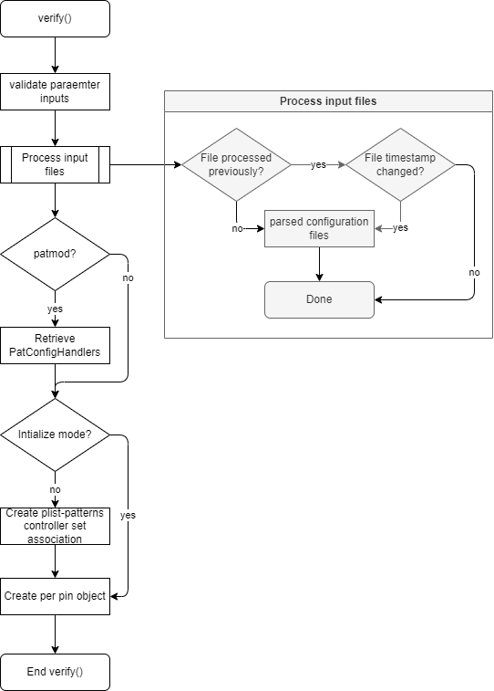
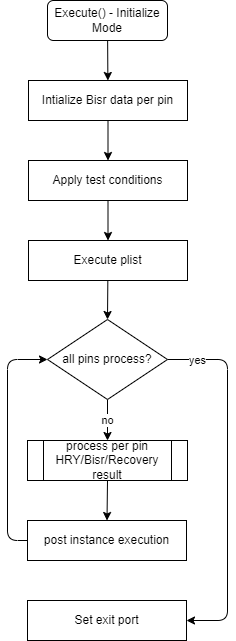

***************************
<span style="color: RED"> **!!! Test method is under user validation -  Consult product team if it needs to be used in production !!!** </span>
***************************

[[_TOC_]]

Note: The Prime Mbist Test Method is yet to be validated. If you have any feedback, please send an email to dong.h.chen@intel.com and andrea.gomez.montero@intel.com.

Additional notes:
1. The Hry config format has changed. If you need the script to convert your old file to the new format please send an email to dong.h.chen@intel.com or andrea.gomez.montero@intel.com.


## REP for Mbist

This **REP** is intended to describe the Mbist Prime TestMethod.

# Introduction

The Memory Built-in Self-Test, also known as MBIST, is a mechanism inside semiconductor dies that allows them to self-test to identify defective memories and to auto-repair them. It usually works together with BIRA (Built-In Repair Analysis) to identify the defective memory cells and with BISR (Built-In Self-Repair) which helps to automatically fix or reconfigure the defective segments.


# Methodology

The Mbist test method is desgined to test and decode the result from Tessent Shell Mbist. The test method executes test pattern list and retrieves data from predefined ctv pin(s). Data is then decoded to a human readable format and set to HRY (Human Readable Yield) string in either KitchenSink or HRY mode. In additiona, test method also support BISR (Built-in Self Repair) and BIRA (Built-in Repair Analysis), as well as VFDM (Virtual Fuse Dynamic Modification) for arrays with column repairs using virtual fuse.

# Test Instance Parameters

The table below describes the test instance parameters supported by the Mbist test method.

| **Parameter Name**            | **Required?** | **Type**          | **Values**        |  **Comments**     |
| ----------------------------- | --------------| ----------------- | ----------------- | ----------------- |
| Patlist                       | Yes            | Plist            |                   | Patlist to execute. |
| TimingsTc                     | Yes            | TimingCondition  |                   | TimingsTc for plist execution. |
| LevelsTc                      | Yes            | LevelsCondition  |                   | Symbol of the levels file. |
| ApplyEndSequence              | No             | String           | Disabled, Enabled | ApplyEndSequence at the end of the test. |
| PrePlist                      | No             | String           |                   | PrePlist callback to plist execution. |
| MaskPins                      | No             | String           |                   | Comma separated pins for mask. |
| FailCaptureCount              | No             | Integer          |                   | FailCaptureCount. Setting this value to 1 will 
set stop-on-first-fail. |
| PrintToItuff                  | No             | String           |  hry, bisrcompfail | The PrintToItuff parameter indicates which values 
should be printed to the ituff. |
| RecoveryModeDownbin           | No             | String           | Disabled, Enabled | Set the recovery mode of the test instance. Default: Disabled |
| BisrMode                      | No*             | String          | **compress** - compress fuse,<br> **patmod** - pattern modify on Bisr pattern,<br> **birabuild** - bira correction,<br> **uncompress** - uncompress fuse data,<br> **skipcompresscheck** - Mbist read fuse mode | ***`*BisrMod is required when 'MbistTestMode' is set to 'Initialize' or`<br>`Bisr patterns are presented in plist`***<br>Multiple selection is allowed. Modes used to store BISR data,  however, "compress" and "uncompress" is mutually excluded. |
| DffOperation                  | No             | String           |  **write** - write to DFF,<br> **read** - read from DFF,<br> **bisr** - read/write bisr string combined with the 'read/write' option, **recovery** - read/write on recovery                 | Multiple selection is allowed. The Dff Operation indicates the cases in which the read/write to Dff should be used. |
| DffSocket                     | No             | String           | SDS, SDT, CLASS_COLD, CLASS_HOT, ALL | Dff socket type. |
| MappingConfigurationFile      | Yes            | String           |                   | Mapping configuration file. |
| VfdmConfigurationFile         | No             | String           |                   | Vfdm configuration file. |
| ClearVariables                | No             | String           |  **all** - clear all data in each category below<br>**hry** - clears HRY data,<br> **bisr** - clears bisr data, **vmin** - clears Vmin data, **vfdm** - clears vfdm data, **recovery** - clears recovery data             |Multiple selection is allowed. The ClearVariables indicate which values set by the current test method will be cleared. |
| MbistTestMode                 | No             | String            | This parameter indicates the Mbist Test mode. The default value is Hry. Possible modes are:<br>**Hry** - This mode is used when running PRE/Raster/Post for any repair. Only supports single execution.<br>**PostRepair** - This mode is used when retesting logic in a separate instance that runs on all memories previously recorded as 'repairable' or 'Y'.<br>**KitchenSink** - This mode is used when running multiple patterns without the need to check the output for each individual pin. It does not update the Hry token.<br>**RepairShareBira** - Retest after Hry for repair sharing to allow memories that fail to update Failing memories to repairable or unrepairable.<br>**Initialize** - Initializes all the values indicated in the ClearVariables parameter and exitst the test method using port 1. | This parameter indicates the Mbist Test mode. Default: Hry |
| ItuffNameExtenstion           | No             | String           |                   | The ItuffNameExtenstion parameter is added to the 
hry tag when printing to the ituff. |
| LookupTableConfigurationFile  | No             | String           |                   | Hry LookupTableConfigurationFile. |
| RecoveryConfigurationFile     | No             | String           |                   | RecoveryConfigurationFile. |
| IgnoreResetFail               | No             | String           | Disabled, Enabled | To ignore reset fail. Default: Disabled |
| DynamicFuseSizeOnFLAME        | No             | String           | Disabled, Enabled | To turn on/off dynamic fuse sizing globally. Default: Disabled |

## User Input Configuration Files
There are three types of input configuration files for the test method to operate. Configuration file data are stored in an internal database and referencing by absolute file path and name.

|FileType|Require|Description |
|:-|:-:|:-|
|[HRY Lookup Table](#hry-lookup-table-configuration-file) | Y | Load from test instance if parameter is populated, MUST provide in at least one of the test instances |
|[Mapping File](#mapping-configuration-file) | Y | Load from test instance if parameter is populated |
|[Recovery File](#recovery-configuration-file) | N | Load from test instance if parameter is populated |

## Hry Lookup Table Configuration File
Hry Lookup Table configuration file is an auto-generate file when plist is built from TVPV Flash tool. The file path MUST at least declare in one of the Mbist test instance. This configuration file contains essential information used to decode the CTV data output from pattern execution for both HRY and Bisr.

The configuration file structure could be separated into 4 major sections.

1) **MemoryLocationToPowerDomain**: This section consists of two elements of Hry information - the controller memory location & the associated power supply name.
2) **BISR Chain Information**: Provides details on the components of each BISR chain.
3) **BISR Repair Share Information**: This section is optional, it contains data on which controller memories share the same fuse register. Typical usage is when there is not enough fuse bits for all the memories.
4) **Controller Group Information**: Outlines the specifics of each controller within the set, which may pertain to either Memory controllers or BISR controllers. This section also includes:
    - The associated test patterns, such as algorithmic, BIRA, and BISR patterns.
    - Definitions for the meaning of each bit or set of bits output by the memory algorithm and/or BIRA test patterns.

<!-- <details> -->
<summary>Hry configuration file Json property definition</summary>


  |JsonProperty Key		    |DataType	|Required|Default|Description									                |Example|
  |:----------------------|:-------:|:------:|:-----:|:-------------------------------------------|:------|
  |**Version**				        |Double 	|Y		|1.0	|Hry lookup table version number				          |1.0|
  |**MemoryLocationToPowerDomain**  |Object		|Y		|-		|List of the controller memories and their associated DPS name  |{ "MEM1" : "V1", "MEM2" : "V1", ...} |
  ||	
  |**BisrChain**			    |Object		|Y		|-		|Bisr chain data||
  |*\<BisrChainName\>*	    |Object		|Y		|-		|User defined bisr chain name					            |"PM5_BP6"|
  |<ul>**BufferSize**			    |Integer	|Y		|-		|Number of bits to store failing memory data      |10|
  |<ul>**ZeroCounterBits**    |Integer	|Y		|-		|Number of bits to store number of passing memories    |5|
  |<ul>**FuseBoxSize**		    |Integer	|Y		|-		|Physical fuse size - maximum number of bits could be stored  |200|
  |<ul>**FuseBoxAddressBits**	|Integer	|Y		|-		|Number of address bits required to access fuse box		    |10|
  |<ul>**MaxFuseBoxProgrammingSessions**|Integer|Y|-		|Number fuse box programming sessions  |1|
  |<ul>**Chain**				      |Array		|Y		|-		|A list of number of bits per bisr chain 		      |["40","500"]|
  |<ul>**TotalLength**		    |Integer	|Y		|-		|total fuse bit length 							              |540|
  ||
  |**BisrRepairShare**	  |Object		|N		|-		|Repair share bits information|
  |*\<BisrControllerName\>*	|Object		|Y		|-		|User defined bisr controller/chain name		      |"PM5_BP6"|
  |<ul>*\<RegisterName\>:\<MemoryNames\>*	|- |N		|-		|Controller memory register name and List of controller memory names pair |"MEM_REG_NAME":["MEM1","MEM2",...]|
  ||
  |**ControllerGroups** |Object		|Y		|-		|Controller group header||
  |*\<CaptureCount\>* |Integer	|Y		|-		|number of ctv bits to be captured for current controller set|88|
  |<ul>**Type** |String		|Y		|-		|Controller set type - Choice:<br>GoId<br>Bisr<br>RaBits<br>ExtractBira<br>BisrCompressFuse||
  |<ul>**Patterns** |Array		|Y		|-		|pattern names||
  |The following section valid when<br> 'Type' does **NOT EQUAL** to "Bisr" or "BisrCompressFuse"|
  |<ul>**Controllers** |Object   |Y    | - | controller set header | |
  |<ul><ul>*\<MemoryControllerName\>* |Object	|Y|-		|memory controller name							              |"MEU0_BP0_WBP0"|
  |<ul><ul><ul>**PreStatus** |Object		|Y		|-		|List of pre-status bits on current controller in Range-Pin form	    |{"Range":"0-1"/"0,1", "LogicalPin": "\<PinName\>"}|
  |<ul><ul><ul>**PostStatus** |Object		|Y		|-		|List of post-status bits on current controller	 in Range-Pin form    |{"Range":"0-1/"0,1"", "LogicalPin": "\<PinName\>"}|
  |<ul><ul><ul>**AlgoSelect** |String		|Y		|-		|AlgoSelect bit range in Range-Pin form |{"Range":"0-1/"0,1"", "LogicalPin": "\<PinName\>"}|
  |<ul><ul><ul>**PAlgoSelect** |String		|N		|-		|PAlgoSelect bit range in Range-Pin form |{"Range":"0-1/"0,1"", "LogicalPin": "\<PinName\>"}|
  |<ul><ul><ul>**Memories** |Object		|N		|-		|controller memories list in the form of "index":"bit-range" pair |""|	
  |<ul><ul><ul><ul>\<MemoriesIndex\>:\<Range\>|6|Object	|N|-		|Memory index and bit range-pin |{"1": {"Range":"0-1"/"0,1", "LogicalPin": "\<PinName\>"}},<br>{"2": {"Range":"2-3", "LogicalPin": "\<PinName\>"}}|	
  |<ul><ul><ul>**BiraRegs** |Object		|N		|-		|Bira register information						            |""|	
  |<ul><ul><ul><ul>*\<BisrControllerName\>*|Object	|N	|-		|bisr controller name							                |"PM0_BP6"|	
  |<ul><ul><ul><ul>**BiraName** |String		|N		|-		|Bira register name||	
  |<ul><ul><ul><ul>**BisrName** |String		|N		|-		|Bisr register name||	
  |<ul><ul><ul><ul>**Capture** |Oject		|N		|-		|controller ctv capture bit range in Range-pin form |{"Range":"0-1"/"0,1", "LogicalPin": "\<PinName\>"}|	
  |<ul><ul><ul><ul>**Replace** |String		|N		|-		|bits to be replaced in bisr data				          |"10" or "29-21"|
  |The following section valid when<br> 'Type' **EQUAL** to "Bisr" or "BisrCompressFuse"|
  |<ul>**isrControllers** |Object   |Y    | - | controller set header | |
  |<ul>*\<BisrControllerName\>*|Object	|Y	|-		|Bisr Controller Name, requires when Type = "Bisr"|"PM0_BP3"|
  |<ul><ul>**Capture** |Oject		|Y		|-		|Bisr capture data ctv bit range and pin |{"Range":"0-1"/"0,1", "LogicalPin": "\<PinName\>"}|	
  |<ul><ul>**CaptureComments** |String		|Y		|-		|Bisr register names				          |"BISR_REG1,BISR_REG_2,..."|	
<!-- </details><br> -->

[Hry_lookup_table_configuration_file_example.json](./.attachments/SSN_MBIST_HRY_list.json)

## Mapping Configuration File
Mapping configuration file is an user created file that contains information serves as a guide for the MBIST test method. This file outlines:

1) **Pin Mapping Information**: Specifies which pin the CTV data is captured and how it should be processed. Also, the power supply pin name to actual socket file pin channel name.
2) **UseDieNameInTag**: .
3) **DFF/SharedStorage Tokens**: Lists the tokens used to access previously stored or processed HRY, BISR, and recovery data within Data Feed Forward (DFF) or Shared Storage systems.
4) **BIRA Correction Information**: An optional section that is only necessary if the MBIST design requires corrections to the shift-out data due to design issues or bugs.

<!-- <details> -->
<summary>Mapping configuration file Json property definition</summary>

|PropertyName|Type|Description|Example|
|:-|-|:-|:-|
|**Version**            |Double | version number |
|**DiePinDefinition**   |Object	|This section defines die and pin information |
|<ul>*\<DieName\>*          |Object	|Die name |"U1.U1"|
|<ul><ul>**CtvPinMapping**      |Object	|Ctv logcial pin name to physical pin name mapping ||
|<ul><ul><ul>*\<CTVLogicalPinName\>:\<CtvPhysicalPinName/>*   |String	|One or more ctv pins per die<br>**`Important`**: `CtvLogicalPinName MUST match what have been defined in Hry configuration file`|"LogicalPin1": "xxTDO"|
|<ul><ul>**DpsPinToDomains**      |Object	|Dps logcial pin name to physical pin name mapping ||
|<ul><ul><ul>*\<DpsLogicalPinName\>:\<DpsPhysicalPinName/>*   |String	|One or more Dps pins per die<br>**`Important`**: `DpsLogicalPinName MUST match what have been defined in Hry configuration file`|"VCCSA": "VCCSA"|
|<ul><ul>**NameSpace**      |String	| Fuse namespace per die. Single die: optional, multi-die: required ||
|**UseDieNameInTag** |Boolean	|An indicator to use the 'DieName' as part of the name or ID to be prepend to DFF or SharedStorage tag, set it to true for multi die scenario, false for single die scenario<br>***`MUST set to True in multi-die mode`*** |'True' or 'False'|
|<ul>**DefaultTagDefinition** | Object | This section defines the 'tag' and 'bisrChain' information ||
|<ul><ul>**HryTagsByType** | Object | This section defines the 'tag' information for Hry and/or KitchenSink ||
|<ul><ul><ul>**Hry** and/or **KitchenSink** | Object | This section defines the 'tag' information for Hry and/or KitchenSink ||
|<ul><ul><ul><ul>**SharedStorage**  |string	|SharedStorage tag name | |
|<ul><ul><ul><ul>**Ituff**  |string	|Ituff  tag to be prepend to 'tname' ituff token | |
|<ul><ul><ul><ul>**Dff**  |string	|Dff tag name| |
|<ul><ul>**Recovery** | Object | This section defines the 'tag' information for Recovery ||
|<ul><ul><ul>**SharedStorage**  |string	|SharedStorage tag name | |
|<ul><ul><ul>**Ituff**  |string	|Ituff  tag to be prepend to 'tname' ituff token | |
|<ul><ul><ul>**Dff**  |string	|Dff tag name| |
|<ul><ul>**Vmin** | Object | This section defines the 'tag' information for Vmin ||
|<ul><ul><ul>**SharedStorage**  |string	|SharedStorage tag name | |
|<ul><ul><ul>**Ituff**  |string	|Ituff  tag to be prepend to 'tname' ituff token | |
|<ul><ul><ul>**Dff**  |string	|Dff tag name| |
|<ul><ul>**GtAggregator** | Object | This section defines the 'tag' information for GT aggregator ||
|<ul><ul><ul>**SharedStorage**  |string	|SharedStorage tag name (value is a list of the HRY memories from HRY configuration file)| |
|<ul><ul><ul>**Ituff**  |string	|Ituff  tag to be prepend to 'tname' ituff token | |
|<ul><ul><ul>**Dff**  |string	|Dff tag name| |
|<ul><ul>**RegisterName** | Object | This section defines the register name to be used by VFDM ||
|<ul><ul><ul>**HCS**  |string	|HCS tag name | "TEST.TEST.TESTHCS" |
|<ul><ul><ul>**FDS**  |string	|FDS tag name | "TEST.TEST.TESTFDS"|
|<ul><ul>**BisrChains** |Object	|Bisr Chain header | |
|<ul><ul><ul>*\<BisrControllerName\>*	|Object	|User defined bisr controller/chain name    |"PM5_BP6"|
|<ul><ul><ul><ul>**SharedStorage**  |string	|SharedStorage tag name | |
|<ul><ul><ul><ul>**Ituff**  |string	|Ituff  tag to be prepend to 'tname' ituff token | |
|<ul><ul><ul><ul>**Dff**  |Object	|Dff tag definition - `attribute name MUST match what defines in test instance 'DffSocket' parameter`| |
|<ul><ul><ul><ul><ul>**ALL**  |string	|Dff tag - applies to All Dff socket types | |
|<ul><ul><ul><ul><ul>**SDS**  |string	|Dff tag for SDS socket | |
|<ul><ul><ul><ul><ul>**SDS**  |string	|Dff tag for SDT socket | |
|<ul><ul><ul><ul><ul>**CLASS**  |string	|Dff tag for CLASS socket | |
|<ul><ul><ul><ul><ul>**CLASS_HOT**  |string	|Dff tag for CLASS_HOT socket | |
|<ul><ul><ul><ul>**BisrVirtualFuse**  |Object	|Bisr virtual fuse definition| |
|<ul><ul><ul><ul><ul>**NameSpace**  |string	|virtual fuse namespace name<br>`This parameter will be overwritten by 'NameSpace' under die definition in multi-die mode` |  |
|<ul><ul><ul><ul><ul>**Tag**  |string	|virtual fuse tag name | |
|<ul><ul><ul><ul><ul>**FuseName**  |string	|Fuse name, for multi fuse name scenario, use comma to separate each | |
|<ul><ul><ul><ul>**FusePadding**  |String	|Maximum number of bits to be limited in fuse string - `MUST equal or less than 'FuseBoxSize' in BisrChain section in HRY configuration file`| |
|<ul><ul><ul><ul>**VfdmRepair**  |Boolean	|indicator whether to perform vfdm repair| *"true"*, "false" |
|<ul><ul><ul><ul>**VfdmReverse**  |Boolean	| indicator whether to reverse vfdm fuse string,<br>Reverse will only enable when all three of the following conditions are met<br>1) BisrMode MUST incldue "padbisr"<br>2) Bisr pattern(s) exists<br>3) There is at least one repairable HRY memory| "true", *"false"* |
|<ul><ul><ul><ul>**CorrectBira**       |Object	|Bira correction header ||
|<ul><ul><ul><ul><ul>*\<BisrRegisterName\>*	|Object	| Bisr register name ||
|<ul><ul><ul><ul><ul>**Enabled** |String	|A bisr register name reference to add offset to, it MUST pair with 'Offset' |"BISR_REG1"|
|<ul><ul><ul><ul><ul>**Offset** |integer|An offset value to be added to the register | 1 |
|<ul><ul><ul><ul><ul>**Input**  |Array	|A range of bit location to be taken from input bisr ctv data |[5,4,3,2,1]|
|<ul><ul><ul><ul><ul>**Output** |Array	|A bit location to be corrected to |[1,3,5,4,2]|

<!-- </details><br> -->

[Sample Mapping configuration file.json](./.attachments/SSN_SharedStoragetoDffMap.json)

## Recovery Configuration File

<!-- DHC  -->
To enable recovery mode, the following items need to be set
1) RecoveryConfigurationFile needs to have a valid recovery configuration file.
2) RecoveryModeDownbin needs to set to 'Enabled'.
3) Recovery configuration file MUST include in the 'initialize' test instance (test with MbistTestMode=Initialize)

The Recovery Configuration File is created by the user and specifies which IPs contain defective memories that are eligible for recovery. The file includes:

1) **Recovery Tokens and Collateral Information**: Identifies the IPs within the die that the recovery process should target. 
2) **IPs**: Details the information for each IP or CORE relevant to recovery, including:

<!-- <details> -->
<summary>Recovery configuration json property definition</summary>

|PropertyName|Type|Description|Example|
|-|-|-|-|
|**RecoveryToken**  |Array	|Recovery core ID/name |["CORE0","CORE1","CORE2",] |
|**ErrorValue**     |Integer|The value to be logged in recovery result when there is error during recovery flow |9|
|**FailValue**      |Integer|The value to be logged in recovery result when there is a fail during recovery flow |1|
|**PassValue**      |Integer|The value to be logged in recovery result when in passing condition |0|
|**DesignIps**      |Object	|Ip section header | |
|<ul>*\<CoreName\>*|Object|Core ID/name |CORE1|
|<ul><ul>**Type**    |String|Specifies the type of recovery execution, which can be either 'full' or 'partial' ||
|<ul><ul>**Required**    |Array| Lists the memories that are essential for the IP to function and must pass |["CTRL1_MEM1","CTRL2_MEM1"]|
|<ul><ul>**RecoveryOptions**    |Array|A dictionary of recovery options, providing a list of optional memories that can be recovered<br>in the form of   "Index":[List of memories] |{"1":["CTRL1_MEM1","CTRL2_MEM1"]}|

<!-- </details><br> -->

[Sample Recovery configuration file.json](./.attachments/soc_recovery.json)

## Test Instance Parameter Setting

- The table below shows when MbistTestMode = "Initialize" combines with the following parameter setting
  
  

<!--
|MbistTestMode|BisrMode|ClearVariables|DffOperation|Behavior|
|:-|-|-|-|:-|
|Initialize (default)|N/A|N/A|N/A|<li>HRY<ul><li>Initializes all controller memories <font color="Darkorange">from sharedstorage</font></li><li>Stores initialized Hry string to sharedStorage</li></ul><li>Recovery - No action<li>Bisr - Initialize raw and fuse data to '0's |
|Initialize |N/A|<font color="Darkorange">all, hry|N/A|<li>HRY<ul><li>Initializes HRY all memories<font color="Darkorange">to 'U' (untested)</font></li></ul>|
||N/A|all, hry+<font color="Darkorange">recovery</font>|N/A|<li>Recovery<ul><li>Initializes recovery token data to 'Pass'</li><li>Write recovery token data to sharedstorage</li></ul>|
||None or Any|all, <font color="Darkorange">bisr</font>|N/A|<li>Bisr (default)<ul><li>Initializes Bisr raw data to '0' and fuse data to empty string</li><li>Initialized sharedstorage bisr raw and fuse data to '0's</li></ul>|
||<font color="Darkorange">Uncompress+</font> | all, <font color="Darkorange">bisr</font>|N/A|<li>Bisr (In addition to default)<ul><li>Get raw and fuse data from <font color="Darkorange">sharedstorage</font> if exists</li><li>Decode chain raw and fuse data read from Dff</li><li>Update new decoded data to <font color="Darkorange">sharedstorage</font></li></ul>|
||<font color="Darkorange">Uncompress+</font>|all, <font color="Darkorange">bisr</font>|bisr & <font color="Darkorange">write</font>|<li>Bisr (In addition to Bisr 'uncomrpess')<li>Update new decoded data to sharedstorage & <font color="Darkorange">Dff</font></li>|
||<font color="Darkorange">Uncompress+</font>|all, <font color="Darkorange">bisr</font>|bisr & <font color="Darkorange">read</font>|<li>Bisr (In addition to 'uncompress')<ul><li>Instead of get raw and fuse data from sharedstorage, it gets data from <font color="Darkorange">Dff</font></li><li>Update new decoded data to <font color="Darkorange">sharedstorage</font> only</li></ul>|
||<font color="Darkorange">Uncompress+patmode</font>|all, <font color="Darkorange">bisr</font>|bisr & <font color="Darkorange">write</font>|<li>Bisr (In addition to correspondent 'uncompress' flow)<li>Apply pattern modify using 'RawData' data</li>|
||<font color="Darkorange">Uncompress+patmode</font>|all, <font color="Darkorange">bisr</font>|bisr & <font color="Darkorange">read</font>|<li>Bisr (In addition to correspondent 'uncompress' flow)<li>Apply pattern modify using 'RawData' data</li>|
||<font color="Darkorange">compress+</font>|all, <font color="Darkorange">bisr</font>|N/A|<li>Bisr (In addition to default)<ul><li>Get raw and fuse data from <font color="Darkorange">sharedstorage</font> if exists</li><li>Decompress fuse string from <font color="Darkorange">sharedstorage</font></li><li>Update new decoded data to <font color="Darkorange">sharedstorage</font></li></ul>|
||<font color="Darkorange">compress+</font>|all, <font color="Darkorange">bisr</font>|bisr & <font color="Darkorange">write</font>|<li>Bisr (In addition to 'compress' flow)<li>Update new decoded data to <font color="Darkorange">sharedstorage and Dff</font></li>|
||<font color="Darkorange">compress+</font>|all, <font color="Darkorange">bisr</font>|bisr & <font color="Darkorange">read</font>|<li>Bisr (In addition to 'compress' flow)<ul><li>Instead of get raw and fuse data from sharedstorage, it gets data from <font color="Darkorange">Dff</font></li><li>Update new decoded data to <font color="Darkorange">sharedstorage</font> only</li></ul>|
||<font color="Darkorange">compress + patmod</font>|all, <font color="Darkorange">bisr</font>|bisr & <font color="Darkorange">write</font>|<li>Bisr (In addition to correspondent 'compress' flow)<ul><li>Applies pattern modify using decompressed bisr fuse data</li></ul>|
||compress + patmod |all, <font color="Darkorange">bisr</font>|bisr & <font color="Darkorange">read</font>|<li>Bisr (In addition to correspondent 'uncompress' flow)<ul><li>Applies pattern modify using decompressed bisr fuse data</li></ul>|
|HRY (Executes HRY flow)|N/A|N/A|N/A|<li>Recovery - if enabled (recovery configuration file exists)</li><ul><li>Gets global recovery string from <font color="Darkorange">sharedstorage</font></li></ul><li>Executes recovery flow|
||N/A|N/A|<font color="Darkorange">rec & read</font>|<li>Recovery - if enabled (recovery configuration file exists)</li><li>Gets global recovery string from <font color="Darkorange">Dff</font></li><li>Executes recovery flow|
||N/A|all, <font color="Darkorange">recovery</font>|N/A|<li>Recovery - if enabled (recovery configuration file exists)</li><ul><li>Initializes global recovery tokens to 'Pass'<li>Writes initialized global recovery token data to <font color="Darkorange">sharedstorage</font></li><li>Executes recovery flow</li></ul>|
||N/A|all, <font color="Darkorange">recovery</font>|<font color="Darkorange">rec & write</font>|<li>Recovery - if enabled (recovery configuration file exists)</li><ul><li>Initializes global recovery tokens to 'Pass'<li>Writes initialized global recovery token data to <font color="Darkorange">sharedstorage and Dff</font></li><li>Executes recovery flow</li></ul>|
||<font color="Darkorange">uncompress</font>|all, <font color="Darkorange">bisr</font>|N/A|<li>Bisr flow will only execute if both <mark><font color="Maroon">"Bisr pattern(s) exists" AND "HRY result is 'repairable'"</font></mark></li><ul><li>Reads bisr previous result from <font color="Darkorange">sharedstorage</font> if exists</li><li>Execute bisr flow</li><li>Writes bisr result to <font color="Darkorange">sharedstorage</font></li></ul>|
||<font color="Darkorange">uncompress</font>|all, <font color="Darkorange">bisr</font>|<font color="Darkorange">bisr & read</font>|<li>Bisr flow will only execute if both <mark><font color="Maroon">"Bisr pattern(s) exists" AND "HRY result is 'repairable'"</font></mark></li><ul><li>Reads bisr previous result from <font color="Darkorange">Dff</font> if exists</li><li>Execute bisr flow</li><li>Writes bisr result to <font color="Darkorange">sharedstorage</font></li></ul>|
||<font color="Darkorange">uncompress</font>|all, <font color="Darkorange">bisr</font>|<font color="Darkorange">bisr & write</font>|<li>Bisr flow will only execute if both <mark><font color="Maroon">"Bisr pattern(s) exists" AND "HRY result is 'repairable'"</font></mark></li><ul><li>Reads bisr previous result from <font color="Darkorange">sharedstorage</font> if exists</li><li>Execute bisr flow</li><li>Writes bisr result to <font color="Darkorange">sharedstorage and Dff</font></li></ul> |
||<font color="Darkorange">compress</font>|all, <font color="Darkorange">bisr</font>|<font color="Darkorange">bisr & write</font>|<li>Bisr flow will only execute if both <mark><font color="Maroon">"Bisr pattern(s) exists" AND "HRY result is 'repairable'"</font></mark><br><ul><li>Execute flow is the same as 'uncompress' flow except the following</li><li>Execute bisr flow</li><li>Writes bisr result to <font color="Darkorange">sharedstorage and Dff</font></li></ul> |
|KitchenSink|N/A|N/A|Runs kitchen sink plist|
|RepairShareBira|N/A|N/A|Same combination as in 'HRY'.|
|PostRepair|N/A|N/A|Same combination as in 'HRY'.|
-->

**Important Notes:**
- **Initialize** mode with ClearVariables set to all: Instance should be placed at the beginning of the flow. **Warning**: Setting ClearVariables to 'all' clears everything from previous tests.
- *ClearVariables, DffOperation* allow more than one options to be entered
- BisrMode 
  - Needs to be set if *ClearVariables* contains 'bisr'
  - 'uncompress' and 'compress' is mutually excluded.

## Flows
### Suggested test program flow
- It is required to an 'initialize' Mbist test instance at the beginning of the Mbist test flow.
  - This test instance is to initialize Hry memories, bisr chains, vfdm, and recovery
  - This test instance could be inserted multiple times to reset all previously saved information
  - Setting on this test instance is as      

```csharp
          CSharpTest PrimeMbistTestMethod ALL_ALL_REPAIR_K_BEGIN_X_X_X_LFM_INITIALIZE
          {
              BypassPort = -1;
              LevelsTc = "BASE::lvl_base_basic_allps";
              TimingsTc = "BASE::cbb_tim_d11r11_1x_t100_h1400";
              Patlist = "arr_mbist_base_x_f1_tito_hry_x_begin_all_xsarom_list";
              MappingConfigurationFile = GetEnvironmentVariable("~HDMT_TP_BASE_DIR") + "./Modules/ARR_MBISTREP/InputFiles/SharedStorageToDFFMap_Base.json";
              LookupTableConfigurationFile = GetEnvironmentVariable("~HDMT_TP_BASE_DIR") + "./Modules/ARR_MBISTREP/InputFiles/MBIST_HRY_list.json";# Set to 'Initialize'
              MbistTestMode = "Initialize"; 
              ClearVariables = "all";
              BisrMode = "compress";
              LogLevel = "Enabled";
              # Optional parameter, but it is required if recovery is planned in the subsequent flow
              RecoveryConfigurationFile = ".\\Modules\\ARR_MBISTREP\\InputFiles\\Mbist_Core_recovery.json"; 
          }
```

- It is necessary to have another 'initialize' Mbist test instance to write to dff/vfdm if user wants to update bisr result to dff/vfdm
  - Setting on this test instance is as
  - `IMPORTANT`: do not set the clearVariable, otherwise, data will be cleared.
```csharp
          CSharpTest PrimeMbistTestMethod ALL_ALL_REPAIR_K_BEGIN_X_X_X_LFM_WRITEDFF
          {
              BypassPort = -1;
              LevelsTc = "BASE::lvl_base_basic_allps";
              TimingsTc = "BASE::cbb_tim_d11r11_1x_t100_h1400";
              Patlist = "arr_mbist_base_x_f1_tito_hry_x_begin_all_xsarom_list";
              MappingConfigurationFile = GetEnvironmentVariable("~HDMT_TP_BASE_DIR") + "./Modules/ARR_MBISTREP/InputFiles/SharedStorageToDFFMap_Base.json";
              LookupTableConfigurationFile = GetEnvironmentVariable("~HDMT_TP_BASE_DIR") + "./Modules/ARR_MBISTREP/InputFiles/MBIST_HRY_list.json";
              # set to 'Initialize' 
              MbistTestMode = "Initialize";
              BisrMode = "compress";
              # must set to 'bisr,write' to write bisr result to dff
              DffOperation = "bisr,write";
              DffSocket = "SDS";
              LogLevel = "Enabled";
}
```


- Typical test flows

   


### Verify flow includes the following major processes
  - Processes all available configuration files of the test instance
  - Creates Plist patterns pair - plist patterns association is no longer need to be defined in the HRY configuration file. Instead, the association will be built in verify, and the ctv bit location per pattern will be updated accordingly.
  - Retrieves 'PatConfigHandler' per bisr chain if 'patmod' is enabled.

    

### Execution flow
  - MbistTestMode = Initialize

    

  - MbistTestMode = Others

    

  - MbistTestMode = Main execution flow
  
## Datalog Output
- To be updated

## Exit Ports

The Mbist test method supports the following exit ports:

| **Exit Port** | **Condition** | **Description**                                                           |
| ------------- | ------------- | ------------------------------------------------------------------------- |
| **-2**        | ***Alarm***   | Any alarm condition.                                                      |
| **-1**        | ***Error***   | Any software condition error.                                             |
| **0**         | ***Fail***    | Failing condition. Plist Failures captured. |
| **1**         | ***Pass***    | Passing condition. |
| **2**         | ***Pass***    | Passing condition. Repairable Array. |
| **3**         | ***Pass***    | Passing condition. Recovery. |
| **4**         | ***Pass***    | Passing condition. Repair and Recovery Array. |
| **5**         | ***Fail***    | Failing condition. Configuration Error Condition. |
| **6**         | ***Fail***    | Failing condition. Undetermined/Missing Corner Case. |
| **7**         | ***Fail***    | Failing condition. Faile DTS Monitor. |
| **8**         | ***Fail***    | Failing condition. Reset Failures. |
| **9**         | ***Fail***    | Failing condition. Bisr Chain Compression Failure. |

## Additional Dependencies

More dependencies to consider for this TestMethod to well operate:

  - VFDM.
  - Vmin search.

## Version tracking

| **Date**                    | **Version** | **Author**      | **Comments**                                                              |
| --------------------------- | ----------- | --------------- | ------------------------------------------------------------------------- |
| Feb 8<sup>th</sup>, 2024    | 1.0.0       | Dong Chen/Andrea Gomez      | Initial Version.                                              |
| Sept 16<sup>th</sup>, 2024  | 2.0.0       | Dong Chen/Johnny Mata Vega  | Major change to support SSN feature. |
| Mar 20<sup>th</sup>, 2025  | 13.2.0       | Lee, Yeong Jui  | [#56702](https://dev.azure.com/mit-us/PRIME/_workitems/edit/56702) Non linear bit support on BitRange Object. |


## Acronyms

Definition of acronyms used in this document:

- **REP**: P**r**ime T**e**st-Method S**p**ecification
- **HDMT**: High Density Modular Tester
- **TPL**: Test Programming Language
- **MBIST**: Memory Built-in Self Test
- **HRY**: Human Readable Yield
- **BISR**: Built-in Self Repair
- **BIRA**: Built-in Repair Analyzer
- **SSN**: Streamming Scan Network