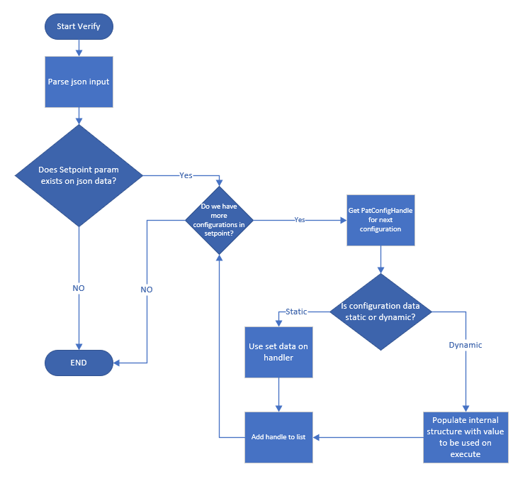
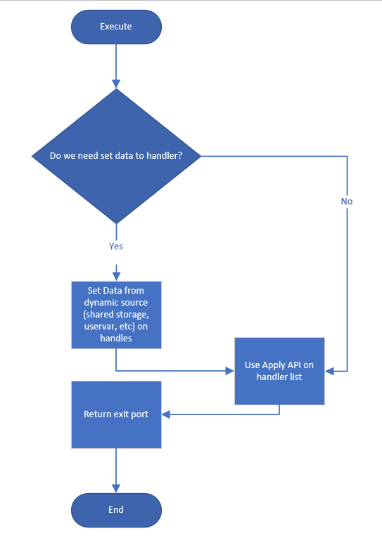

**prime Test-Method Specification REP**

Revision 1.0.0

Oct 2020

[[_TOC_]]

## REP for PatConfig

This **REP** is intended to describe the PatConfig Prime TestMethod.

In this document, you will find the below sections:

  - **Methodology** – A detailed description of this TestMethod intention and purpose

  - **Parameters** – A table describes each instance parameter (Name, Type, Default, Required?)

  - **Datalog output** – A detailed description of what is datalogged by his TestMethod

  - **Custom User Code hooks** – A list of functions available to the user code to override

  - **TPL Samples** – Examples of how to use this TestMethod in a TPL file

  - **Exit Ports** - A table describes each exit port

  - **Additional Dependencies** – More to consider for this TestMethod to operate

  - **Version tracking** – With author names, so you always have a name to address

  - **Acronyms** - Definition of acronyms used in this document 
<div style="text-align: justify">

## Methodology
The PatConfig test method allow users to apply a regular pattern modify or fuse modify on pin information.

This test method allows users to apply a set of pattern modifies grouped on set points. 
Users will configure a JSON file with the names to corresponding configurations of PatConfigService.
Aditionally users can set data to override default data from service.
The test method will get the handle of the configurations from PatConfig Service and apply input data to such handles.





**Raw and Dynamic data.**

Data can be obtained from different sources and will be set on the handle during verify or execute type depending on the source.

| **Source**                      | **Set Time** | **Example** |
| --------------                  | -----------  | ----------- |
| Raw data                        | Verify       | 100001 <br> 1+ <br> H+ |
| Dynamic data (SharedStorage)    | Execute      | DUT.MyString1 <br> IP.MyString2 <br> LOT.MyString3 |
| Dynamic data (UserVar)          | Execute      | MyCollection.UserVarName |
| Dynamic data (DFF)              | Execute      | DieId.OPType.DFFName.<Field Name (Optional)> <br>  CURRENT.CURRENT.MyDFF<br>U4.CURRENT.MyDFF.MyField<br>U4.PBIC.MyDFF<br><br> Use CURRENT keyword for DieID or Optype If the user want to cuurent socket value and not set explicit|

**Notes:**

  - For Verify phase, dynamic data can be empty; however, it must have a value during Execute phase.

**JSON File example:**

These files are arranged as lists of SetPoints, each one containing a list of Configurations names.
Pattern modifications (configurations) are applied in the order shown in the SetPoint.
Setpoints element are :
- Configuration: the name of the configuration that we want to apply.
- InPKGApplyToPKGOnly: Optional parameter, if exist and true only PKG modifications will be applied, if false or not exist all modification that belongs to the configuration will be applied. This is relevant only if the instance is in PKG Level.
- ToBeStored: Optional boolean parameter, if set to True the data of this configuration will be stored when it is applied so that it can be reapplied later using the PatConfigReApply Test Method. 
- ConfigurationElement: optional field, if exist the data will be applied to this element inside the configuration.
- Data Define raw data to apply, this field can be removed only if the configuration has default data.
In the case of managing dynamic data such as UserVars or SharedStorage, the user is required to use the corresponding token instead of the Data token.
When managing UserVar data the format for the value shall be "CollectionName.UserVarName".
For the case of managing SharedStorage data, the format of the value shall be "Context.SharedStorageKey".


```json
{
    "SetPoints": [
        {
            "Name": "SetPoint1",
            "Configurations": [
                {
                    "Configuration": "test1",
                    "Data": "1010"
                },
                {
                    "Configuration": "test3",
                    "Data": "1+"
                },
                {
                    "Configuration": "test2"
                },
                {
                    "Configuration": "test4",
                    "ConfigurationElement": "subTest1",
                    "Data": "1010"
                }
            ]
        },
        {
            "Name": "SetPoint2",
            "Configurations": [
                {
                    "Configuration": "test1",
                    "Uservar": "MyCollection.MyValue"
                },
                {
                    "Configuration": "test1",
                    "SharedStorage": "Dut.MyKey"
                },
                {
                    "Configuration": "test1",
                    "DFF": "SSID.OPCODE.Name"
                }
            ]
        },
        {
            "Name": "SetPoint3",
            "Configurations": [
                {
                    "Configuration": "test1"
                }
            ]
        },
        {
            "Name": "SetPoint4",
            "InPKGApplyToPKGOnly" : true,
            "ToBeStored" : true,
            "Configurations": [
                {
                    "Configuration": "test1",
                    "Data": "1010"
                },
                  {
                    "Configuration": "test2"
                }
            ]
        }
    ]
}
```

**Interleaved data modification**


PrimePatConfigTestMethod supported overriding continuous streaming data. Now introducing the Interleave feature that supports a non-continuous pattern overriding.
The input for the conventional streaming is the raw data and the ratio.
For the same raw data, the interleave override needs to have two additional parameters-

“DataBlockSize”- the number of continuous bits that the raw data I divided to and
 
 “GapSize”- the number of ‘skipped’ bits that will not be overridden by the data (gap is located between two blocks)

So for the inputs below the pattern modification will be as such:

- Raw data:01101

- Ratio:1

- Data block size:3

- Gap size:2


| **Label**    				| **Pattern vector** | **Index**        | **Conventional streaming**  | **Interleave** |
| --------------------- 	| -------------		 | ---------------  |---------------------------- | ------------   |
| FUSE_OVERRIDE_LABEL_NAME  | 1000           	 | 0          		|    1                        |   1            |
|               			| 1001          	 | 1          		|    0                        |   0            |
|                 		 	| 1002            	 | 2           		|    1                    	  |   1            |  
| 	               		  	| 1003            	 | 3          		|    1						  |   X            |
|               			| 1004          	 | 4          		|    0                        |   X            |
|                 		 	| 1005            	 | 5           		|                       	  |   1            |  
| 	               		  	| 1006            	 | 6          		|  						      |   0            |	

To enable the interleave feature, the setpoint element should include two new parameters: “DataBlockSize” and “GapSize”. 
```json
{
  "SetPoints": [
    {
      "Name": "SetPoint_OneElement_Interleave",
      "Configurations": [
        {
          "Configuration": "MyFuseConfig_OneElement",
          "Data": "1111111111100000",
          "DataBlockSize":"3",
          "GapSize":"2"
        }
      ]
    }
]
}
```
Some notes:


•	The data modification process is done LSB->MSB as the writing to pattern process is done.

•	 The block size is multiplied by the ratio while the gaps size is not affected by the ratio.

•	The fuse size is adjusted to include the modified data with gaps


Example: 


 


## Test Instance Parameters

The table below lists and describes the test instance parameters supported by the PatConfig test method

| **Parameter Name**    | **Required?** | **Type**        | **Values**                                                                                                                            | **Comments** |
| --------------------- | ------------- | --------------- |---------------------------------------------------------------------------------------------------------------------------------------| ------------ |
| ConfigurationFile     | Yes           | String          | Name of file that contains the definition for the SetPoints (list of configurations)                                                  |              |
| SetPoint              | Yes           | String          | SetPoint name to be executed. This supports the InputData BusinessLogic format.                                                       |              |
| Plist                 | No            | Plist           | Plist name to be executed	                                                                                                            
| RegEx                 | No            |String          | Regular expression to reduce the number of patterns that define in the configuration. The regex will be applied to all configurations 


**Notes:**

  - Plist parameter is optional, this means configurations can be applied to a plist or pattern regex.

## Datalog output

This test Method does not create a datalog

## Custom User Code Hooks

Here is the list of functions available to the user code to override.

\<TBD\>


## TPL Samples

Here are a few test instance examples using the PatConfig test method

TPL Sample1: \<One SetPoint with Plist, many configurations under SetPoint.\> 

```javascript
Import PrimePatConfigTestMethod.xml;

Test PrimePatConfigTestMethod PinDataTest1_P1
{
    ConfigurationFile = "~HDMT_TPL_DIR/Modules/PatConfig/InputFiles/patConfigTestMethod.json";
    SetPoint = "SetPoint1";
    Plist = "patConfigPlist1";
}
```


TPL Sample1: \<One SetPoint no Plist, many configurations under SetPoint.\> 

```javascript
Import PrimePatConfigTestMethod.xml;

Test PrimePatConfigTestMethod PinDataTest2_P1
{
    ConfigurationFile = "~HDMT_TPL_DIR/Modules/PatConfig/InputFiles/patConfigTestMethod.json";
    SetPoint = "SetPoint1";
}
```

## Exit Ports

The PatConfig test method supports the following exit ports:

| **Exit Port** | **Condition**   | **Description**              |
| ------------- | --------------- | ---------------------------- |
| **-1**        | ***Error***     | Any software condition error |
| **0**         | ***Fail***      | Failing condition            |
| **1**         | ***Pass***      | Passing condition            |

## Additional Dependencies

More dependencies to consider for this TestMethod to well operate:

  - All provided configurations must be previously configured on PatConfig service either for regular pattern modifications or for FuseConfig modifications.
  - If no data is set on JSON file for test method, default data needs to be defined on PatConfig service configurations.

## Version tracking


| **Date**       | **Version** | **Author**      | **Comments** |
| -------------- | ----------- | --------------  | ------------ |
| Oct 07th, 2020 | 1.0.0       | Esteban Ortega  |              |
| Oct 07th, 2020 | 1.0.1       | Horacio Hidalgo | Minor fixes  |
| Jul 27th, 2021 | 1.0.2       | Ariel Mata | Adding ReApply feature  |
| Feb 13th, 2025 | 1.0.3       | Yuval Azriel | Adding Interleave feature  |
## Acronyms

Definition of acronyms used in this document:

  - **REP**: P**r**ime T**e**st-Method S**p**ecification
  - **HDMT**: High Density Modular Tester
  - **TPL**: Test Programming Language
  - **TOS**: Test Operating System
  - **JSON**: JavaScript Object Notation
</div>