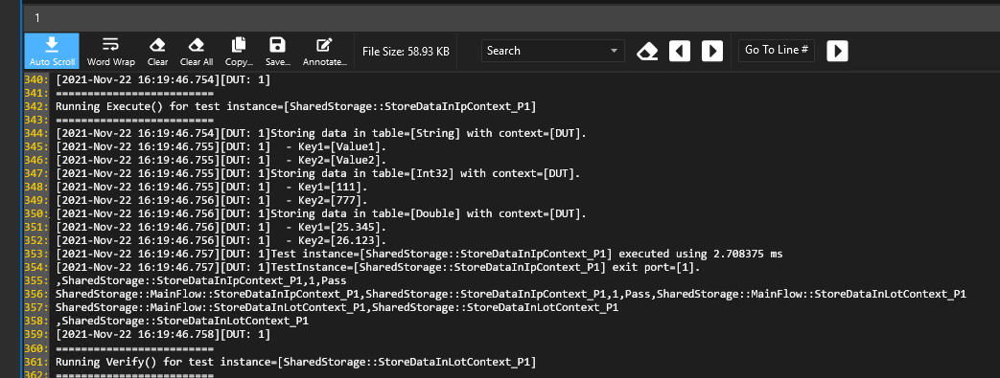

**prime Test-Method Specification REP**

Revision 1.0.0

NOV 2021

[[_TOC_]]

## REP for SharedStorageInserter

This **REP** is intended to describe the SharedStorageInserter Prime TestMethod.

In this document, you will find the below sections:

  - **Methodology** – A detailed description of this TestMethod intention and purpose.

  - **Parameters** – A table describes each instance parameter (Name, Type, Default, Required?)

  - **Console output** – A detailed description of what is printed in console by his TestMethod.

  - **Datalog output** – A detailed description of what is datalogged by his TestMethod.

  - **TPL Samples** – Examples of how to use this TestMethod in a TPL file.

  - **Json file** – Example of json file required for this Test method.

  - **Exit Ports** - A table describes each exit port.

  - **Version tracking** – With author names, so you always have a name to address.

## Methodology

This is a new feature enabled for Prime. This test method provides an easy way to insert shared storage's keys of primitive types with default values through provided json file.

## Parameters
The table below lists and describes the test instance parameters supported by the SharedStorageInserter test method

| **Parameter Name**    | **Required?** | **Type**        | **Values**                     | **Comments** |
| --------------------- | ------------- | --------------- | ------------------------------ | ------------ |
| Path                  | Yes           | String          | File path with values to store.|              |
| Scope                 | Yes           | String (choice) | DUT (**default**), IP, LOT     | Scope or context to store data into sharedStorage             |


## Console output (debug mode)

Measurement results can be printed to console in debug mode in form of below table



Overwriting case.


## Datalog output

This test Method does not create a datalog.

## TPL Samples

Here are a few test instance examples using the Dc test method  
**SharedStorageInserter implementation:**

Next examples are setting the same variables for DUT, LOT and IP context.

```python
Import PrimeSharedStorageInserterTestMethod.xml;
Test PrimeSharedStorageInserterTestMethod StoreDataInDutContext_P1
{
   LogLevel = "PRIME_DEBUG";
   Path = "~HDMT_TPL_DIR\\Modules\\SHAREDSTORAGE\\SharedStorage\\InputFiles\\MyVariables.json";
}

Test PrimeSharedStorageInserterTestMethod StoreDataInIpContext_P1
{
   LogLevel = "PRIME_DEBUG";
   Path = "~HDMT_TPL_DIR\\Modules\\SHAREDSTORAGE\\SharedStorage\\InputFiles\\MyVariables.json";
   Scope = "IP";
}

Test PrimeSharedStorageInserterTestMethod StoreDataInLotContext_P1
{
   LogLevel = "PRIME_DEBUG";
   Path = "~HDMT_TPL_DIR\\Modules\\SHAREDSTORAGE\\SharedStorage\\InputFiles\\MyVariables.json";
   Scope = "LOT";
}
```
## Json File

SharedStorageInserter uses the following schema file which allows only three primitive types (string, double and integer) of data that can be registered in SharedStorage through this test method.

### Schema file

```python
{
    "$schema": "http://json-schema.org/draft-04/schema#",
    "type": "object",
    "properties": {
        "string": {
            "type": "object",
            "minItems": 1,
            "additionalProperties": false,
            "patternProperties": { "^[A-Za-z_][A-Za-z0-9_]*$": { "type": "string" } },
            },
        "integer": {
            "type": "object",
            "minItems": 1,
            "additionalProperties": false,
            "patternProperties": { "^[A-Za-z_][A-Za-z0-9_]*$": { "type": "integer" } },
            },
        "double": {
            "type": "object",
            "minItems": 1,
            "additionalProperties": false,
            "patternProperties": { "^[A-Za-z_][A-Za-z0-9_]*$": { "type": "number" } },
            },
        },
    "additionalProperties": false,
}

```

### Json file example.
The user should provide the path of a valid json file with the dictionary data to store. The file will be validated with the schema definition described above.

The following is a example of a valid json file that can be consumed by SharedStorageInserter.

```python
{
  "string": {
    "MyNameKey1": "MyStringValue1",
    "MyNameKey2": "MyStringValue2",
    "MyNameKey3": "MyStringValue3",
  },
  "integer": {
    "Key1": 111,
    "Key2": 777
  },
  "double": {
    "Key1": 25.345,
    "Key2": 26.123
  }
}

```

**NOTE**: If the key already exists in SharedStorage, the existing value will be overwritten.

## Exit Ports

The SharedStorageInserter test method supports the following exit ports:

| **Exit Port** | **Condition** | **Description**                              |
| ------------- | ------------- | -------------------------------------------- |
| **-2**        | ***Alarm***   | Any alarm condition                          |
| **-1**        | ***Error***   | Any software condition error                 |
| **1**         | ***Pass***    | Passing condition                            |

## Version tracking

| **Date**                  | **Version** | **Author**            | **Comments**    |
| ------------------------- | ----------- | --------------------- | --------------- |
| Nov 22<sup>nd</sup>, 2021 | 7.1.00      | Didier Jimenez Retana | PR 3435: Add PrimeSharedStorageInserterTestMethod.|