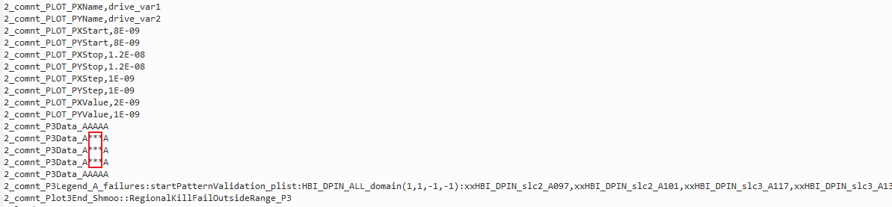
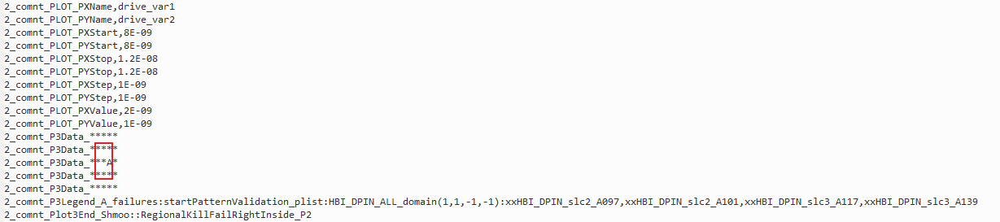

**Prime Test-Method Specification REP**

Revision 1.1.2

Oct 2023

[[_TOC_]]

## REP for Shmoo

This **REP** is intended to describe the Shmoo Prime Test Method.

In this document, you will find the below sections:

  - **Methodology** – A detailed description of this Test Method intention and purpose

  - **Parameters** – A table describing each instance parameter (Name, Type, Default, Required?)

  - **Datalog output** – A detailed description of what is datalogged by this Test Method

  - **Custom User Code hooks** – A list of functions available to the user code to override

  - **Optional Features** – Optional features of this Test Method

  - **TPL Samples** – Examples of how to use this Test Method in a TPL file

  - **Exit Ports** - A table describing each exit port

  - **Additional Dependencies** – More to consider for this Test Method to operate

  - **Version tracking** – With author names, so you always have a name to address

  - **Acronyms** - Definition of acronyms used in this document

## Methodology

A shmoo plot is an electrical engineering concept used to visualize the performance of a device or circuit over a range of conditions. It is commonly employed in testing electronic components to evaluate their behavior under different combinations of operating parameters, such as voltage, temperature, frequency, or current. The plot typically has two axes, where each axis represents a varying test parameter (e.g., voltage vs. frequency).

The **purpose** of the Shmoo Test Method is to identify the boundaries within which the device under test functions correctly. Consequently, this helps on identifying conditions where a device may consistently fail. 

The Shmoo Test Method has two axes, providing the capability to perform up to two-dimensional iterations over a range of x/y points. Each iteration consists of executing the same functional test with a provided plist, using the values of each point in the plot as the test parameters which are the only ones that change throughout the executions. 

The values in the plot depend on the type of the X and Y axis, refer to [ShmooAxisTypes](###ShmooAxisTypes) to see the supported ones. Users can select from this list of axis types, or implement their own custom axis. The execution behavior is dependent upon the axis type. Users are provided also with the ability of extending the Test Method to perform customize logic before, during and after each point execution, among other functionalities.

To see examples of how the point values in the plot are obtained, review the [TPL Samples](#tpl%20samples) section.

#### Flow of Execution

### Verify()

:::mermaid
graph TD
    Start(Start)
    Start-->InternalTmInit
    InternalTmInit[Internal TM Initialization]-->GetXAxisPoints["Get X axis points to run - GetXAxisPoints*(string XAxisRange)"]
    GetXAxisPoints-->GetXShmooAxis["Get shmoo object for X axis"]
    GetXShmooAxis-->GetYAxisPoints["Get Y axis points to run - GetYAxisPoints*(string YAxisRange)"]
    GetYAxisPoints-->GetYShmooAxis["Get shmoo object for Y axis"]
    GetYShmooAxis-->CreateDataObjects["Create X and Y axes data objects"]
    CreateDataObjects-->FuncTest["Get functional test to execute - GetFunctionalTest*(string patlist, string levelsTc, string timingsTc)"]
:::
(*) Starred items are extendable via user code extensions.

### Execute()

:::mermaid
graph TD
    Start(Start)
    Start-->TestInstance[CreateTestInstanceResults*]
    TestInstance-->PreExecute[PreExecute*]
    PreExecute-->PrePointExecute[PrePointExecute*]
    PrePointExecute-->SkipCheck{Skip This Point?}
    SkipCheck-->|YES|MorePoints{More Points\n to Execute?}
    SkipCheck-->|NO|PinMask[SetPinMask for point result]
    PinMask-->PointExecute[PointExecute*]
    PointExecute-->PostPointExecute[PostPointExecute*]
    PostPointExecute-->MorePoints
    MorePoints-->|YES|PrePointExecute[PrePointExecute*]
    MorePoints-->|NO|PrintPlotToItuff[PrintPlotToItuff]
    PrintPlotToItuff-->PostExecute[PostExecute*]
    PostExecute-->End(End)
:::
(*) Starred items are extendable via user code extensions.

## Test Instance Parameters

The table below lists and describes the test instance parameters supported by the Shmoo Test Method.

### X Axis Parameters: 

| **Parameter Name** | **Required?** | **Type**        | **Values**                                                                                                                                                                                                                                                                                                                                                                                        | **Comments**                                                                                                                            |
| ------------------ | ------------- | --------------- | ------------------------------------------------------------------------------------------------------------------------------------------------------------------------------------------------------------------------------------------------------------------------------------------------------------------------------------------------------------------------------------------------- | --------------------------------------------------------------------------------------------------------------------------------------- |
| XAxisParam         | Yes           | String          | This is the X axis parameter to apply points values on, before executing the plist at each iteration.                                                                                                                                                                                                                                                                                             |                                                                                                                                         |
| XAxisParamType     | Yes           | String (choice) | Supported values are limited to the [ShmooAxisTypes](###ShmooAxisTypes) enum.                                                                                                                                                                                                                                                                                                                     | Note that for shmoo loop to function, XAxisParamType must not be None.                                                                  |
| XAxisRange         | Yes           | String          | This string is passed to GetXAxisPoints(…) method to generate the x-points. Supported formats are: <br> 1. `<StartPoint>:<Resolution>:<NumberOfPoints>` to generate a sequence of points (the resolution specifies the increment or step size between consecutive values in this range). Example: 0:3:4 generates the sequence 0,3,6,9.<br> 2. A comma separated list of the actual point values. | Note that the scale of this input is in base units (i.e. volts, seconds, etc.)                                                          |
| XAxisDatalogPrefix | No            | String (choice) | Base (default) <br>Nano <br>Micro <br>Milli                                                                                                                                                                                                                                                                                                                                                       | This string determines what scale to apply to the X axis for ituff prints (i.e. seconds, nanoseconds, milliseconds, microseconds, etc.) |
| XAxisDatalogName   | No            | String          | This string is used during datalog prints to label the X axis. Useful for when XAxisParam is too long for tname prints.                                                                                                                                                                                                                                                                           | Defaults to the same string as XAxisParam.                                                                                              |

### Y Axis Parameters:
| **Parameter Name** | **Required?**                 | **Type**        | **Values**                                                                                                                                                                                                                                                                                                                                                                                            | **Comments**                                                                                                                            |
| ------------------ | ----------------------------- | --------------- | ----------------------------------------------------------------------------------------------------------------------------------------------------------------------------------------------------------------------------------------------------------------------------------------------------------------------------------------------------------------------------------------------------- | --------------------------------------------------------------------------------------------------------------------------------------- |
| YAxisParam         | No                            | String          | This is the Y axis parameter to apply points values on, before executing the plist at each iteration.                                                                                                                                                                                                                                                                                                 |                                                                                                                                         |
| YAxisParamType     | Yes if YAxisParam is provided | String (choice) | Supported values are limited to the [ShmooAxisTypes](###ShmooAxisTypes) enum.                                                                                                                                                                                                                                                                                                                         | Default value: None.                                                                                                                    |
| YAxisRange         | Yes if YAxisParam is provided | String          | This string is passed to GetYAxisPoints(…) method to generate the y-points. <br>Supported formats are: <br> 1. `<StartPoint>:<Resolution>:<NumberOfPoints>` to generate a sequence of points (the resolution specifies the increment or step size between consecutive values in this range). Example: 0:3:4 generates the sequence 0,3,6,9.<br> 2. A comma separated list of the actual point values. | Note that the scale of this input is in base units (i.e. volts, seconds, etc.)                                                          |
| YAxisDatalogPrefix | No                            | String (choice) | Base (default) <br>Nano <br>Micro <br>Milli                                                                                                                                                                                                                                                                                                                                                           | This string determines what scale to apply to the Y axis for ituff prints (i.e. seconds, nanoseconds, milliseconds, microseconds, etc.) |
| YAxisDatalogName   | No                            | String          | This string is used during datalog prints to label the Y axis. Useful for when YAxisParam is too long for tname prints.                                                                                                                                                                                                                                                                               | Defaults to the same string as YAxisParam.                                                                                              |

### General Inputs:
| **Parameter Name**     | **Required?** | **Type**        | **Values**                                                                      | **Comments**                                                                                                                                                                                                                                                                                   |
| ---------------------- | ------------- | --------------- | ------------------------------------------------------------------------------- | ---------------------------------------------------------------------------------------------------------------------------------------------------------------------------------------------------------------------------------------------------------------------------------------------- |
| PowerDownBetweenPoints | No            | String (choice) | ENABLED <br>DISABLED                                                            | Determines whether or not a power-down is applied after a point execution.                                                                                                                                                                                                                     |
| PlotMode               | No            | String (choice) | Normal (default) <br>Custom                                                     | Normal mode will use the format defined in the PrintFormat parameter. Custom mode will give the user the control over symbols, legend keys and info to be printed through an extension method. The format used for Custom mode is ShmooHub but with some strict formatting on the legend keys. |
| PrintFormat            | No            | String (choice) | ShmooHub (default)<br>ARIES<br>ECADS                                            | ShmooHub mode will use ShmooHub format. ARIES will follow ARIES print format. ECADS will follow ECADS print format.                                                                                                                                                                            |
| RegionalKillLimits     | No            | String          | Comma separated list of doubles in the format: `<XMin>, <XMax>, <YMin>, <YMax>` | Inclusive limits used for Regional Kill. When using 1D (one-dimensional) shmoo, only x values are required.                                                                                                                                                                                    |
| ExecutionMode          | No            | String (choice) | AllPin (default) <br>PerPin                                                     |                                                                                                                                                                                                                                                                                                |
| ShmooPins              | No            | String          | Comma separated list of pins                                                    | It must be defined if ExecutionMode is PerPin.                                                                                                                                                                                                                                                 |

### Inherited Via FunctionalTest:

| **Parameter Name** | **Required?** | **Type**        | **Values**                                                                   | **Comments**             |
| ------------------ | ------------- | --------------- | ---------------------------------------------------------------------------- | ------------------------ |
| Patlist            | Yes           | Plist           | Plist name to be executed at each Shmoo point                                |                          |
| LevelsTc           | Yes           | LevelsCondition | Levels test condition required for plist execution                           |                          |
| TimingTc           | Yes           | TimingCondition | Timing test condition required for plist execution                           |                          |
| MaskPins           | No            | String          | Comma separated list of pins for which the fail data capture will be skipped | Default is Empty String. |

### Special Cases:
#### Voltage Axis Configuration
A voltage axis has a special format for input parameters which is made up of subparameters denoted by format `--<subparametername>=`. These subparameters apply for XAxisParam and YAxisParam parameters.

| **Sub Parameter Name** | **Required?** | Values                            | **Comments**                                                                                                                                                                                                   |
| ---------------------- | ------------- | --------------------------------- | -------------------------------------------------------------------------------------------------------------------------------------------------------------------------------------------------------------- |
| domains                | Yes           | Space separated list of domains   | Domains to be used to create internal voltage object. Domains must be defined in separate ALEPH configuration file.                                                                                            |
| fivrcondition          | Yes           | String                            | FIVR condition name. Must be defined in ALEPH configuration file.                                                                                                                                              |
| overrides              | No            | Comma separated list of overrides | Voltage overrides. Overrides should be in the format:  `<domain>:<value>,...,<domainN>:<valueN>`.                                                                                                              |
| dlvrpins               | No            | Space separated list of dlvrpins  | List of dlvrpins to be used in the creation of the internal voltage object. The pin names are checked against shared storage and uservars to populate the pin attributes required for voltage object creation. |


## Enums
### ShmooAxisTypes
The `ShmooAxisTypes` enum defines the types of axes that can be used in a Shmoo test. Each type specifies a different method for varying the test conditions along the X or Y axis.
See usage examples in [TPL Samples section](###TPL Samples).

| **Shmoo Axis Type** | **Description Format**                                                        | **Comments**                                                                                                                                                                                   |
| ------------------- | ----------------------------------------------------------------------------- | ---------------------------------------------------------------------------------------------------------------------------------------------------------------------------------------------- |
| None                | N/A                                                                           | Shmoo Axis is unused.                                                                                                                                                                          |
| UserDefined         | N/A                                                                           | Shmoo execution functions can be overwritten using extensions. <br>A UserDefined Axis will not execute anything unless overwritten by user code.                                               |
| TimingTestCondition | Timing Test conditions to apply to. Unit: Seconds (S).                        | This type uses timing test conditions defined in the `.tcg` file.                                                                                                                              |
| LevelsTestCondition | Levels Test conditions to apply to. Unit: Voltages (V).                       | This type uses level test conditions defined in the `.tcg` file.                                                                                                                               |
| PatConfig           | Name of Configurations as defined in user's *patmod.json file                 | This type uses pattern configurations.                                                                                                                                                         |
| PatConfigSetpoint   | Name of Module:Group pairs as defined in user's *PatConfigSetpoints.json file | This type uses setpoints. [Notes on PatConfig related setup files in PatConfigService documentation](https://dev.azure.com/mit-us/PrimeWiki/_wiki/wikis/PrimeWiki.wiki/80676/PatconfigService) |
| VoltageConfig       | Voltage domains and FIVR conditions as defined in aleph files                 | [Notes on voltage related configuration files in VoltageService documentation](https://dev.azure.com/mit-us/PrimeWiki/_wiki/wikis/PrimeWiki.wiki/80681/VoltageService(VoltageService))         |

### ExecutionModes
| **Execution Mode** | **Description**                                                                 |
| ------------------ | ------------------------------------------------------------------------------- |
| AllPin             | Execute shmoo with all pins.                                                    |
| PerPin             | Execute shmoo with the pins defined in the test instance parameter "ShmooPins". |


## Console output

**Example 1** (ExecutionMode = "AllPin"):
```
Y\X  |  0.4  |  0.5  |  0.6  |  0.7
0.2  |   *       *       *       *  
0.4  |   _       *       *       *  
0.6  |   *       *       _       *  
0.8  |   *       *       *       *  
```


**Example 2** (ExecutionMode = "PerPin"; ShmooPins = "xxHPCC_DPIN_Dig_slcA_AA0,xxHPCC_DPIN_Dig_slcA_AA1"):
```
Shmoo plot for pin=xxHPCC_DPIN_Dig_slcA_AA0
  Y\X  |    0    |  1E-06  |  2E-06  |  3E-06
    0  |    B         B         B         *   
1E-06  |    C         C         *         *   
2E-06  |    E         *         *         *   
3E-06  |    *         *         *         *   

Shmoo plot for pin=xxHPCC_DPIN_Dig_slcA_AA1
  Y\X  |    0    |  1E-06  |  2E-06  |  3E-06
    0  |    A         A         A         *   
1E-06  |    D         D         *         *   
2E-06  |    *         *         *         *   
3E-06  |    *         *         *         *   
```


 ## Datalog output

### ShmooHub Example:
**Example 1** (ExecutionMode = "AllPin"):  
```
2_tname_Shmoo::PrimeShmooTestMethodTwoDimensional_P1_SSTP
2_strgval_X_10e-9S_Y_5e-9S
2_tname_Shmoo::PrimeShmooTestMethodTwoDimensional_P1_ShmooParams
2_strgval_drive_var1^0^3E-06^1E-06^drive_var2^0^3E-06^1E-06_ShmooHub
2_tname_Shmoo::PrimeShmooTestMethodTwoDimensional_P1_ShmooResults
2_strgval_****_****_****_****
2_tname_Shmoo::PrimeShmooTestMethodOneDimensional_P1_SSTP
2_strgval_X_10e-9S
2_tname_Shmoo::PrimeShmooTestMethodOneDimensional_P1_ShmooParams
2_strgval_drive_var1^0^3E-06^1E-06_ShmooHub
2_tname_Shmoo::PrimeShmooTestMethodOneDimensional_P1_ShmooResults
2_strgval_****
2_tname_Shmoo::PrimeShmooTestMethodOneDimensionalWithFailures_F0_SSTP
2_strgval_X_10e-9S
2_tname_Shmoo::PrimeShmooTestMethodOneDimensionalWithFailures_F0_ShmooParams
2_strgval_drive_var1^0^3^1_ShmooHub
2_tname_Shmoo::PrimeShmooTestMethodOneDimensionalWithFailures_F0_ShmooResults
2_strgval_AAAA
2_tname_Shmoo::PrimeShmooTestMethodOneDimensionalWithFailures_F0^LEGEND^A
2_strgval_failures:failures_burstoff_plist:DomainA_All_DPIN_Dig(1101,100,-1,-1):xxHPCC_DPIN_Dig_slcA_AA0,xxHPCC_DPIN_Dig_slcA_AA1
```
 
Above is an example of ituff outputs for a 4x4 2D shmoo with all passes, a 1D shmoo with all passes, and a 1D shmoo with all failures.

ShmooHub prints in the following format:

```c++
2_tname_{tname}_SSTP
2_strgval_X_{XAxisInitialValue}_Y_{YAxisInitialValue}
2_tname_{tname}_ShmooParams
2_strgval_drive_{XAxisParamName}^{XAxisStart}^{XAxisStop}^{XAxisResolution}^{YAxisParamName}^{YAxisStart}^{YAxisStop}^{YAxisResolution}_ShmooHub
2_tname_{tname}_ShmooResults
2_strgval_{Results}
2_tname_{tname}^LEGEND^{ResultsFailCharacters}
2_strgval_{LegendInfo}
```

**Example 2** (ExecutionMode = "PerPin"; ShmooPins = "xxHPCC_DPIN_Dig_slcA_AA0,xxHPCC_DPIN_Dig_slcA_AA1"):
```
2_tname_Shmoo::PrimeShmooTestMethodTwoDimensionalPerPinFailuresShmooHubPrint_P2_SSTP
2_strgval_X_10e-9S_Y_5e-9S
2_tname_Shmoo::PrimeShmooTestMethodTwoDimensionalPerPinFailuresShmooHubPrint_P2_ShmooParams
2_strgval_AriesX^0^3E-06^1E-06^AriesY^0^3E-06^1E-06_ShmooHub
2_tname_Shmoo::PrimeShmooTestMethodTwoDimensionalPerPinFailuresShmooHubPrint_P2_xxHPCC_DPIN_Dig_slcA_AA0_ShmooResults
2_strgval_BBB*_CC**_E***_****
2_tname_Shmoo::PrimeShmooTestMethodTwoDimensionalPerPinFailuresShmooHubPrint_P2_xxHPCC_DPIN_Dig_slcA_AA1_ShmooResults
2_strgval_AAA*_DD**_****_****
```

Above is an example of ituff outputs for a 4x4 2D shmoo with some points pass and some points fail.

ShmooHub prints in the following format:

```c++
2_tname_{tname}_SSTP
2_strgval_X_{XAxisInitialValue}_Y_{YAxisInitialValue}
2_tname_{tname}_ShmooParams
2_strgval_drive_{XAxisParamName}^{XAxisStart}^{XAxisStop}^{XAxisResolution}^{YAxisParamName}^{YAxisStart}^{YAxisStop}^{YAxisResolution}_ShmooHub
2_tname_{tname}_{shmoo_pin}_ShmooResults
2_strgval_{Results}
2_tname_{tname}^LEGEND^{ResultsFailCharacters}
2_strgval_{LegendInfo}
```

### ECADS Example:
Below are two examples of ituff output for a 4x4 2D shmoo printed in ECADS mode.

ECADS format includes:
```
2_comnt_PLOT_PXName,{Name of X parameter}

2_comnt_PLOT_PYName,{Name of Y parameter}

2_comnt_PLOT_PXStart,{Value where X starts}

2_comnt_PLOT_PYStart,{Value where Y starts}

2_comnt_PLOT_PXStop,{Value where X ends}

2_comnt_PLOT_PYStop,{Value where Y ends}

2_comnt_PLOT_PXStep,{Number of steps X takes without including first point}

2_comnt_PLOT_PYStep,{Number of steps Y takes without including first point}

2_comnt_PLOT_PXValue,{Initial value of X before Shmoo was ran}

2_comnt_PLOT_PYValue,{Initial value of Y before Shmoo was ran}
```

**Example 1** (ExecutionMode = "AllPin"):  
```
2_tname_Shmoo::PrimeShmooTestMethodTwoDimensionalFailuresEcadsPrint_F0
2_comnt_Plot3Start_Shmoo::PrimeShmooTestMethodTwoDimensionalFailuresEcadsPrint_F0
2_comnt_PLOT_PXName,EcadsX
2_comnt_PLOT_PYName,EcadsY
2_comnt_PLOT_PXStart,0
2_comnt_PLOT_PYStart,0
2_comnt_PLOT_PXStop,3E-06
2_comnt_PLOT_PYStop,3E-06
2_comnt_PLOT_PXStep,3
2_comnt_PLOT_PYStep,3
2_comnt_PLOT_PXValue,1E-08
2_comnt_PLOT_PYValue,5E-09
2_comnt_P3Data_AA**
2_comnt_P3Data_B***
2_comnt_P3Data_****
2_comnt_P3Data_****
2_comnt_P3Legend_A_failures:failures_plist:DomainA_All_DPIN_Dig(1101,100,-1,-1):xxHPCC_DPIN_Dig_slcA_AA1
2_comnt_P3Legend_B_failures:failures_plist:DomainA_All_DPIN_Dig(1101,100,-1,-1):xxHPCC_DPIN_Dig_slcA_AA0
2_comnt_Plot3End_Shmoo::PrimeShmooTestMethodTwoDimensionalFailuresEcadsPrint_F0
```


**Example 2** (ExecutionMode = "PerPin"; ShmooPins = "xxHPCC_DPIN_Dig_slcA_AA0,xxHPCC_DPIN_Dig_slcA_AA1"):
```
2_tname_Shmoo::PrimeShmooTestMethod2DPerPinFailuresEcads_P2
2_comnt_Plot3Start_Shmoo::PrimeShmooTestMethod2DPerPinFailuresEcads_P2_perpin_xxHPCC_DPIN_Dig_slcA_AA0
2_comnt_PLOT_PXName,AriesX
2_comnt_PLOT_PYName,AriesY
2_comnt_PLOT_PXStart,0
2_comnt_PLOT_PYStart,0
2_comnt_PLOT_PXStop,3E-06
2_comnt_PLOT_PYStop,3E-06
2_comnt_PLOT_PXStep,3
2_comnt_PLOT_PYStep,3
2_comnt_PLOT_PXValue,1E-08
2_comnt_PLOT_PYValue,5E-09
2_comnt_P3Data_BBB*
2_comnt_P3Data_CC**
2_comnt_P3Data_E***
2_comnt_P3Data_****
2_comnt_P3Legend_A_failures:failures_plist:DomainA_All_DPIN_Dig(1001,101,-1,-1):xxHPCC_DPIN_Dig_slcA_AA1
2_comnt_P3Legend_B_failures:failures_plist:DomainA_All_DPIN_Dig(1101,102,-1,-1):xxHPCC_DPIN_Dig_slcA_AA0
2_comnt_P3Legend_C_failures:failures_plist:DomainA_All_DPIN_Dig(101,100,-1,-1):xxHPCC_DPIN_Dig_slcA_AA0
2_comnt_P3Legend_D_failures:failures_plist:DomainA_All_DPIN_Dig(1101,90,-1,-1):xxHPCC_DPIN_Dig_slcA_AA1
2_comnt_P3Legend_E_failures:failures_plist:DomainA_All_DPIN_Dig(1101,100,-1,-1):xxHPCC_DPIN_Dig_slcA_AA0
2_comnt_Plot3End_Shmoo::PrimeShmooTestMethod2DPerPinFailuresEcads_P2

2_tname_Shmoo::PrimeShmooTestMethod2DPerPinFailuresEcads_P2
2_comnt_Plot3Start_Shmoo::PrimeShmooTestMethod2DPerPinFailuresEcads_P2_perpin_xxHPCC_DPIN_Dig_slcA_AA1
2_comnt_PLOT_PXName,AriesX
2_comnt_PLOT_PYName,AriesY
2_comnt_PLOT_PXStart,0
2_comnt_PLOT_PYStart,0
2_comnt_PLOT_PXStop,3E-06
2_comnt_PLOT_PYStop,3E-06
2_comnt_PLOT_PXStep,3
2_comnt_PLOT_PYStep,3
2_comnt_PLOT_PXValue,1E-08
2_comnt_PLOT_PYValue,5E-09
2_comnt_P3Data_AAA*
2_comnt_P3Data_DD**
2_comnt_P3Data_****
2_comnt_P3Data_****
2_comnt_P3Legend_A_failures:failures_plist:DomainA_All_DPIN_Dig(1001,101,-1,-1):xxHPCC_DPIN_Dig_slcA_AA1
2_comnt_P3Legend_B_failures:failures_plist:DomainA_All_DPIN_Dig(1101,102,-1,-1):xxHPCC_DPIN_Dig_slcA_AA0
2_comnt_P3Legend_C_failures:failures_plist:DomainA_All_DPIN_Dig(101,100,-1,-1):xxHPCC_DPIN_Dig_slcA_AA0
2_comnt_P3Legend_D_failures:failures_plist:DomainA_All_DPIN_Dig(1101,90,-1,-1):xxHPCC_DPIN_Dig_slcA_AA1
2_comnt_P3Legend_E_failures:failures_plist:DomainA_All_DPIN_Dig(1101,100,-1,-1):xxHPCC_DPIN_Dig_slcA_AA0
2_comnt_Plot3End_Shmoo::PrimeShmooTestMethod2DPerPinFailuresEcads_P2
```


### ARIES Example:

Below are examples of ituff outputs for different dimensions shmoo printed in ARIES mode.

**Example 1** (ExecutionMode = "AllPin"):

```
2_tname_Shmoo::PrimeShmooTestMethodOneDimensionalFailuresAriesPrint_F0_SSTP
2_strgval_X_10e-9S
2_tname_Shmoo::PrimeShmooTestMethodOneDimensionalFailuresAriesPrint_F0_drive_var1_0_3E-06_1E-06
2_rawbinary_msbF_0001
```

Above is an example of an ituff output for a 1x4 1D shmoo.

```
2_tname_Shmoo::PrimeShmooTestMethodTwoDimensionalFailuresAriesPrint_F0_SSTP
2_strgval_X_10e-9S_Y_5e-9S
2_tname_Shmoo::PrimeShmooTestMethodTwoDimensionalFailuresAriesPrint_F0_AriesX_0_3E-06_1E-06_AriesY_0_3E-06_1E-06
2_rawbinary_msbF_0011
2_rawbinary_msbF_0111
2_rawbinary_msbF_1111
2_rawbinary_msbF_1111
```

Above is an example of an ituff output for a 4x4 2D shmoo.


**Example 2** (ExecutionMode = "PerPin"; ShmooPins = "xxHPCC_DPIN_Dig_slcA_AA0,xxHPCC_DPIN_Dig_slcA_AA1"):

```
2_tname_Shmoo::PrimeShmooTestMethod2DPerPinFailuresAries_P2_SSTP
2_strgval_X_10e-9S_Y_5e-9S
2_tname_Shmoo::PrimeShmooTestMethod2DPerPinFailuresAries_P2_xxHPCC_DPIN_Dig_slcA_AA0_AriesX_0_3E-06_1E-06_AriesY_0_3E-06_1E-06
2_rawbinary_msbF_0001
2_rawbinary_msbF_0011
2_rawbinary_msbF_0111
2_rawbinary_msbF_1111

2_tname_Shmoo::PrimeShmooTestMethod2DPerPinFailuresAries_P2_SSTP
2_strgval_X_10e-9S_Y_5e-9S
2_tname_Shmoo::PrimeShmooTestMethod2DPerPinFailuresAries_P2_xxHPCC_DPIN_Dig_slcA_AA1_AriesX_0_3E-06_1E-06_AriesY_0_3E-06_1E-06
2_rawbinary_msbF_0001
2_rawbinary_msbF_0011
2_rawbinary_msbF_1111
2_rawbinary_msbF_1111
```


## Custom User Code Hooks

Shmoo test method supports the following extensions:

### Extensions used in Verify
```c++
/// <summary>
/// Class to define extendable methods.
/// </summary>
public interface IShmooExtensions
{
        /// <summary>
        /// Method to be implemented by user to return all the points in the x-axis range that TestMethod should iterate over.
        /// </summary>
        /// <param name="pointValue">string from test method parameter "XAxisRange". It usually contains the needed information
        /// so user can generate the list of double points for this axis. User is responsible for string format.</param>
        /// <returns>List of double points values for x-axis to iterate over.</returns>
        List<double> GetXAxisPoints(string pointValue);

        /// <summary>
        /// Method to be implemented by user to return all the points in the y-axis range that TestMethod should iterate over.
        /// </summary>
        /// <param name="pointValue">string from test method parameter "YAxisRange". It usually contains the needed information
        /// so user can generate the list of double points for this axis. User is responsible for string format.</param>
        /// <returns>List of double points values for y-axis to iterate over.</returns>
        List<double> GetYAxisPoints(string pointValue);

        /// <summary>
        /// Extension to allow modification of plist execution settings, for example set capture pins or disable incremental mode (starting from last failing pattern).
        /// </summary>
        /// <param name="patlist">The plist name to build the IFunctionalTest.</param>
        /// <param name="levelsTc">The levels test condition name to build the IFunctionalTest.</param>
        /// <param name="timingsTc">The timings test condition name to build the IFunctionalTest.</param>
        /// <returns>The IFunctionalTest object build as per user requirements.</returns>
        IFunctionalTest GetFunctionalTest(string patlist, string levelsTc, string timingsTc);
```

### Extensions used in Execute
```csharp

        /// <summary>
        /// Extension to allow user to run custom code prior to plist execution on a specific shmoo point.
        /// </summary>
        /// <param name="point">The shmoo point to apply the custom code to.</param>
        /// <param name="functionalTest">Functional test object that contains execution data for the plist.</param>
        /// <returns>
        /// <c>true</c> if the custom code was successfully applied and the shmoo point is relevant for the test; 
        /// otherwise, <c>false</c> if the shmoo point should be skipped.
        /// </returns>
        bool PrePointExecute(ShmooPoint point, IFunctionalTest functionalTest);

        /// <summary>
        /// Extension to allow user to run custom code after plist execution on a specific shmoo point.
        /// </summary>
        /// <param name="point">The shmoo point to apply the custom code to.</param>
        /// <param name="functionalTest">Functional test object that contains execution data for the plist.</param>
        void PostPointExecute(ShmooPoint point, IFunctionalTest functionalTest);

        /// <summary>
        /// Extension to allow user to override the code that runs on a specific shmoo point. By default, the provided plist will be executed.
        /// </summary>
        /// <param name="point">The shmoo point to apply the custom code to.</param>
        /// <param name="results">The object for holding the exit port, and the normal/regional functional results.</param>
        /// <returns><c>true</c> if the shmoo point has passed; otherwise, <c>false</c> if the shmoo point has failed.</returns>
        /// <remarks>The return value of this function will impact the exit port of the instance.</remarks>
        bool PointExecute(ShmooPoint point, ShmooTestInstanceResults results);

        /// <summary>
        /// Extension to allow user to run custom code after all shmoo points have been executed, and determines the final exit port.
        /// </summary>
        /// <param name="functionalTest">Functional test object that contains execution data for the plist.</param>
        /// <param name="results">The object for holding the exit port, and the normal/regional functional results.</param>
        /// <remarks>
        /// By default, if at least one Shmoo point fails, the instance will exit from port 0. 
        /// Otherwise, the instance will exit from port 1.
        /// </remarks>
        void PostExecute(IFunctionalTest functionalTest, ShmooTestInstanceResults results);

        /// <summary>
        /// Extension to allow user to run custom code before any shmoo points are executed.
        /// </summary>
        /// <param name="functionalTest">Functional test object that contains execution data for the plist.</param>
        void PreExecute(IFunctionalTest functionalTest);

        /// <summary>
        /// Called prior to any test in Execute to generate the test instance results object.
        /// </summary>
        /// <returns>The test instance results object.</returns>
        ShmooTestInstanceResults CreateTestInstanceResults();

        /// <summary>
        /// Gets the list of pins to mask execution after execution. The test method will merge this list with the ones from the test instance parameter.
        /// </summary>
        /// <returns>The list of mask pins.</returns>
        List<string> GetDynamicPinMask();
}
```


## TPL Samples

In this section you can find test instance examples using the Shmoo Test Method.

1. 2D shmoo using ShmooAxisType: TimingTestCondition.
The following example demonstrates a 2D Shmoo test using the `ShmooAxisType` of `TimingTestCondition`. This test iterates over timing parameters defined in the test conditions.

```c++
CSharpTest PrimeShmooTestMethod PrimeShmooTestMethodTwoDimensional_P1
{
   Patlist = "passing_plist";
   TimingsTc = "Shmoo::basic_func_timing_10MHz_20MHz";
   LevelsTc = "Shmoo::basic_func_lvl_nom";
   XAxisParam = "drive_var1";
   XAxisRange = "0:0.000001:4";
   YAxisParam = "drive_var2";
   XAxisParamType = "TimingTestCondition";
   YAxisRange = "0:0.000001:4";
   YAxisParamType = "TimingTestCondition";
   PowerDownBetweenPoints = "DISABLED";
   LogLevel = "Enabled";
}
```

The `XAxisRange` and `YAxisRange` parameters with values "0:0.000001:4" generate the list of values "0, 1E-06, 2E-06, 3E-06" for both the X-axis and Y-axis. Which form the following plot:
```
Y\X |     0 | 1E-06 | 2E-06 | 3E-06 
    0 |     *       *       *       *  
1E-06 |     *       *       *       *  
2E-06 |     *       *       *       *  
3E-06 |     *       *       *       *
```

The values in the plot are used to iterate over the functional test by setting the SpecSet variables `drive_var1` (using the X-axis values) and `drive_var2` (using the Y-axis values) which belong to timing test conditions. The specified timing test condition is applied to the functional test before each execution, allowing the Shmoo test to systematically vary the timing parameters along both axes.


2. 1D shmoo using ShmooAxisType: TimingTestCondition.
The following example defines a 1D Shmoo test using the `ShmooAxisType` of `TimingTestCondition`. This test iterates over a single timing parameter defined in the test conditions.

```c++
Test PrimeShmooTestMethod OneDimensionalShmoo_P1
{
   Patlist = "startPatternValidation_plist";
   TimingsTc = "Shmoo::basic_functional_timing_10MHz_20MHz";
   LevelsTc = "Shmoo::SampleFunctionalTestMethodTC";
   XAxisParam = "drive_var1";
   XAxisRange = "8e-9:1e-9:4";
   XAxisDatalogPrefix = "Nano";
   XAxisParamType = "TimingTestCondition";
   YAxisParam = "";
   YAxisRange = "";
   PowerDownBetweenPoints = "ENABLED";
   LogLevel = "Enabled";
}
```


3.  2D shmoo using ShmooAxisType: PatConfig.
The following example demonstrates a 2D Shmoo test using the `ShmooAxisType` of `PatConfig`. This test iterates over two pattern configurations defined in the `patmod.json` file.

```c++
Test PrimeShmooTestMethod PrimeShmooTestMethodTwoDimensionAriesPatConfig_P1
{
   Patlist = "passing_plist";
   TimingsTc = "Shmoo::basic_func_timing_10MHz_20MHz";
   LevelsTc = "Shmoo::basic_func_lvl_nom";
   XAxisParam = "PinDataStorable";
   XAxisRange = "0:1:4";
   XAxisParamType = "PatConfig";
   YAxisParam = "PinDataStorable2";
   YAxisRange = "0:1:4";
   YAxisParamType = "PatConfig";
   PrintFormat = "ARIES";
   LogLevel = "Enabled";
}
```

The `XAxisParam` "PinDataStorable" is defined in the `patmod.json` file as follows:
```json
{
  "Configurations": [
    {
      "Name": "PinDataStorable",
      "ConfigurationElement": [
        {
          "Pin": ["xxHPCC_DPIN_Dig_slcA_A2"],
          "Type": "PINDATA",
          "StartAddress": ["31"],
          "StartAddressOffset": [0],
          "EndAddress": ["62"],
          "EndAddressOffset": [0],
          "IsChannelLink": false,
          "PatternsRegEx": [
            ".*passing.*"
          ],
          "Plists": [ "passing_plist" ]
        }
      ]
    },
... 
```

So the `XAxisRange` "0:1:4" generates the list of values: 0, 1, 2, 3. These values are then converted into binary format: 00, 01, 10, 11. The binary values are stored in `PatConfigHandle` objects using `SetData` calls, and finally the `PatCofigService` applies these handles to the patterns specified in the `patmod.json` file corresponding to the `XAxisParam` "PinDataStorable".

This process allows the Shmoo test to systematically vary the pattern configurations along the X-axis and Y-axis, enabling a comprehensive analysis of the device under test (DUT) across different test conditions.


4. 2D shmoo using ShmooAxisType: PatConfigSetPoint.
The following example demonstrates a 2D Shmoo test using the `ShmooAxisType` of `PatConfigSetPoint`. This test iterates over two Module:Group pairs defined in the `PatConfigSetpoints.json` file.
```c++
Test PrimeShmooTestMethod PrimeShmooTestMethodTwoDimensionPatConfigSetpoint_P1
{
   Patlist = "passing_plist";
   TimingsTc = "Shmoo::basic_func_timing_10MHz_20MHz";
   LevelsTc = "Shmoo::basic_func_lvl_nom";
   XAxisParam = "Shmoo:shmoo_freq";
   XAxisRange = "400MHz,500MHz,600MHz,800MHz";
   XAxisParamType = "PatConfigSetPoint";
   YAxisParam = "Shmoo:shmoo_freq2";
   YAxisRange = "400MHz,500MHz,600MHz,800MHz";
   YAxisParamType = "PatConfigSetPoint";
   LogLevel = "Enabled";
}
```

The `XAxisParam` "Shmoo:shmoo_freq" (Module:Group pair) is defined in the `PatConfigSetpoints.json` file as follows:
```json
{
  "Module": "Shmoo",
  "Groups": [
    {
      "Name": "shmoo_freq",
      "Default": "667MHz",
      "SetPoints": [
        {
          "Configurations": [
            {
              "Data": "00000000000000000000000000001110",
              "Name": "PinDataStorable"
            }
          ],
          "Name": "1200MHz"
        },
        {
          "Configurations": [
            {
              "Data": "00000000000000000000000000001010",
              "Name": "PinDataStorable"
            }
          ],
          "Name": "800MHz"
        },
        {
          "Configurations": [
            {
              "Data": "00000000000000000000000000000100",
              "Name": "PinDataStorable"
            }
          ],
          "Name": "533MHz"
        },
        {
          "Configurations": [
            {
              "Data": "00000000000000000000000000000000",
              "Name": "PinDataStorable"
            }
          ],
          "Name": "400MHz"
        },
        {
          "Configurations": [
            {
              "Data": "00000000000000000000000000000110",
              "Name": "PinDataStorable"
            }
          ],
          "Name": "1067MHz"
        },
        {
          "Configurations": [
            {
              "Data": "00000000000000000000000000001100",
              "Name": "PinDataStorable"
            }
          ],
          "Name": "600MHz"
        },
        {
          "Configurations": [
            {
              "Data": "00000000000000000000000000001000",
              "Name": "PinDataStorable"
            }
          ],
          "Name": "500MHz"
        },
        {
          "Configurations": [
            {
              "Data": "00000000000000000000000000000010",
              "Name": "PinDataStorable"
            }
          ],
          "Name": "667MHz"
        }
      ]
    },
...
```

The `XAxisRange` "400MHz,500MHz,600MHz,800MHz" specifies the setpoint names to be used for the X-axis, names that are specified in the `PatConfigSetpoints.json` file. These setpoints are used to iterate over the functional test by applying the corresponding set point configuration to each of the `PatConfigSetPointHandle` objects in every test execution. 


5. 2D shmoo using ShmooAxisType: VoltageConfig.
The following example demonstrates a 2D Shmoo test using the `ShmooAxisType` of `VoltageConfig`. This test iterates over voltage domains and fivr conditions defined in the aleph files.

```c++
Test PrimeShmooTestMethod PrimeShmooTestMethodTwoDimensionVoltageConfigFivrAndDlvr_P1
{
   Patlist = "Fivr_Plist";
   TimingsTc = "Shmoo::basic_func_timing_10MHz_20MHz";
   LevelsTc = "Shmoo::basic_func_lvl_nom";
   XAxisParam = "--domains=FIVR_VLOAD_CORE0_LC --fivrcondition=FIVR_VLOAD_CORE01_Literal";
   XAxisRange = "0:1:4";
   XAxisParamType = "VoltageConfig";
   YAxisParam = "--domains=FIVR_VLOAD_CORE0_LC --fivrcondition=FIVR_VLOAD_CORE01_Literal --dlvrpins=HDDPS_VLC_16ohm1 --overrides=FIVR_VLOAD_CORE0_LC:0.70";
   YAxisRange = "0:1:4";
   YAxisParamType = "VoltageConfig";
   LogLevel = "Enabled";
}
```

The `YAxisParam` "--domains=FIVR_VLOAD_CORE0_LC --fivrcondition=FIVR_VLOAD_CORE01_Literal --dlvrpins=HDDPS_VLC_16ohm1 --overrides=FIVR_VLOAD_CORE0_LC:0.70" is composed of a domain, FIVR condition and DLVR pins defined in the aleph files as follows:

##### fivrCondition.json
```json
{
  "Conditions": [
    {
      "name": "FIVR_VLOAD_CORE01_Literal",
      "domains": [
        {
          "name": "FIVR_VLOAD_CORE0_LC",
          "voltage": {
            "type": "Literal",
            "value": "0.75"
          }
        },
        ...
      ]
    },
...
```

##### voltageDomain.json
```json
{
  "$schema": "VoltageServiceDomainConfiguration.schema.json",
  "Domains": [
    {
      "name": "FIVR_VLOAD_CORE0_LC",
      "pattern_modify": {
        "initial_voltage": {
          "multiplier": 256,
          "configuration": "Single_Fuse_Group_1",
          "number_of_targets": 1
        }
      },
      "default_value": 0.7
    },
    ...
  ],
  "DlvrPins": [
    {
      "pin_name": "HDDPS_VLC_16ohm1",
      "voltage_expression": [
        {
          "expression_name": "First_Expression",
          "expression_value": "max(FIVR_VLOAD_CORE0_LC,FIVR_VLOAD_CORE1_LC)+0.5"
        },
        {
          "expression_name": "Second_Expression",
          "expression_value": "min(FIVR_VLOAD_CORE0_LC,FIVR_VLOAD_CORE1_LC)+0.5"
        }
      ],
      "min": 0.5,
      "max": 2.0,
      "step_size": 0.1
    }
  ]
}
```

The `YAxisParam` values are used to generate a voltage test object. The overrides specify a new voltage value for specific domains to be applied as the initial voltage. In this case 0.70, is applied to the "FIVR_VLOAD_CORE0_LC" domain as its initial voltage, instead of the 0.75 specified in the "fivrCondition.json" file. The `dlvrpins` are used as rail configuration names.

The `YAxisRange` "0:1:4" generates the list of values: 0, 1, 2, 3. These values are used for the y-axis to iterate over the functional test by applying them as voltage values to the domains specified in the `YAxisParam`, i.e. "FIVR_VLOAD_CORE0_LC". If multiple domains are specified, the voltage for all domains is applied using the same range value for the current test execution. For example, during the iteration/test execution with the value 0, the voltage value applied to all specified domains corresponds to 0, and so on for the other range values. During this phase, the rail configurations are also executed if any are specified.

## Advanced Features

### Regional Kill
Regional kill mode is activated when the user provides an input for `RegionalKillLimits` in the format: `<XMin>, <XMax>, <YMin>, <YMax>`.

The minimum and maximum values are used as a boundary that points are compared to inclusively. If there is a failure within this boundary, the test will exit through port 2. If there are no failures within the boundary, the test will exit through port 3.



The image above shows an example of an ituff output for a 3x3 regional kill region in a 2D shmoo plot, where failures occur outside the specified limits. In this case, the test exits through port 3.




The image above shows an example of an ituff output for a 3x3 regional kill region in a 2D shmoo plot, where failures occur inside the specified limits. In this case, the test exits through port 2.

### Tname Scale Customization
By default, values will be printed to ituff using scientific notation in their base units (seconds, volts, etc.) 

To print values to ituff using non-base units (nanoseconds, millivolts, etc.), users should provide a desired scalar for the respective axis using the `XAxisDatalogPrefix` and `YAxisDatalogPrefix` parameters. 

#### Example of MTPL Using Non-Default Scalar on Output
##### MTPL File:
```c++
Test PrimeShmooTestMethod PrimeShmooTestMethodOneDimensionalWithFailures_F0
{
   Patlist = "failures_burstoff_plist";
   TimingsTc = "Shmoo::basic_func_timing_10MHz_20MHz";
   LevelsTc = "Shmoo::basic_func_lvl_nom";
   XAxisParam = "drive_var1";
   XAxisRange = "0:0.000001:4";
   XAxisParamType = "TimingTestCondition";
   XAxisDatalogPrefix = "Micro";
   YAxisParam = "";
   YAxisRange = "";
   PowerDownBetweenPoints = "DISABLED";
   LogLevel = "Enabled";
}
```
##### Datalog Output:
```
2_tname_Shmoo::PrimeShmooTestMethodOneDimensionalWithFailures_F0_SSTP
2_strgval_X_10e-9S
2_tname_Shmoo::PrimeShmooTestMethodOneDimensionalWithFailures_F0_ShmooParams
2_strgval_drive_var1^0^3^1_ShmooHub
2_tname_Shmoo::PrimeShmooTestMethodOneDimensionalWithFailures_F0_ShmooResults
2_strgval_AAAA
2_tname_Shmoo::PrimeShmooTestMethodOneDimensionalWithFailures_F0^LEGEND^A
2_strgval_failures:failures_burstoff_plist_burst_1:DomainA_All_DPIN_Dig(1101,100,-1,-1):xxHPCC_DPIN_Dig_slcA_AA0,xxHPCC_DPIN_Dig_slcA_AA1
```
As can be seen, the scalar is applied to `drive_var1`, converting it from a scale of 0.000001s to 1us.

For reference, this is how the output looks without specifying a scalar:
```
2_tname_Shmoo::PrimeShmooTestMethodOneDimensionalWithFailures_F0_SSTP
2_strgval_X_10e-9S
2_tname_Shmoo::PrimeShmooTestMethodOneDimensionalWithFailures_F0_ShmooParams
2_strgval_drive_var1^0^3E-06^1E-06_ShmooHub
2_tname_Shmoo::PrimeShmooTestMethodOneDimensionalWithFailures_F0_ShmooResults
2_strgval_AAAA
2_tname_Shmoo::PrimeShmooTestMethodOneDimensionalWithFailures_F0^LEGEND^A
2_strgval_failures:failures_burstoff_plist_burst_1:DomainA_All_DPIN_Dig(1101,100,-1,-1):xxHPCC_DPIN_Dig_slcA_AA0,xxHPCC_DPIN_Dig_slcA_AA1

```

### Axis Name Customization
By default, axes will use their parameter name (`XAxisParam` and `YAxisParam`) as the axis name during Tname prints. This can cause issues with the strgval format's 128-character limit on Tnames if the parameter names are exceedingly long or include a list of parameters.

Users can customize an axis's name for datalogging by using the `XAxisDatalogName` and `YAxisDatalogName` parameters.

#### Example of MTPL Using Custom Names for X and Y Axes
##### MTPL File:
```c++
Test PrimeShmooTestMethod PrimeShmooTestMethodTwoDimensionalCustomAxisNames_P1
{
   Patlist = "startPatternValidation_plist";
   TimingsTc = "Shmoo::basic_functional_timing_10MHz_20MHz";
   LevelsTc = "Shmoo::SampleFunctionalTestMethodTC";
   XAxisParam = "drive_var1";
   XAxisRange = "8e-9:1e-9:4";
   YAxisParam = "drive_var2";
   XAxisParamType = "TimingTestCondition";
   YAxisRange = "8e-9:1e-9:4";
   YAxisParamType = "TimingTestCondition";
   XAxisDatalogName = "CustomXName";
   YAxisDatalogName = "CustomYName";
   PowerDownBetweenPoints = "DISABLED";
   LogLevel = "Enabled";
}
```

##### Datalog Output:
```
2_tname_Shmoo::PrimeShmooTestMethodTwoDimensionalCustomAxisNames_P1_SSTP
2_strgval_X_10e-9S_Y_5e-9S
2_tname_Shmoo::PrimeShmooTestMethodTwoDimensionalCustomAxisNames_P1_ShmooParams
2_strgval_CustomXName^0^3E-06^1E-06^CustomYName^0^3E-06^1E-06_ShmooHub
2_tname_Shmoo::PrimeShmooTestMethodTwoDimensionalCustomAxisNames_P1_ShmooResults
2_strgval_****_****_****_****
```

This feature is useful for shortening Tnames to below the 128-character limit for certain test plans. 

### User Defined Shmoo Axis
Shmoo loops operate over shmoo axis objects for X and Y axes. By default, the supported axis types correspond to the `ShmooAxisType` enum mentioned previously. However, users can define custom axes by overriding the `GetXAxis()` and `GetYAxis()` functions.

Below is an example snippet of user code that overrides the default Shmoo behavior by adding a new user-defined type and overriding an existing type. 

#### Main User Code File:
```csharp

    /// <summary>
    /// This class is intended to overwrite the test method PrimeShmooTestMethod.
    /// </summary>
    [PrimeTestMethod]
    public class Shmoo : PrimeShmooTestMethod, IShmooExtensions
    {
        /// <summary>
        /// Initializes a new instance of the <see cref="Shmoo"/> class.
        /// </summary>
        public Shmoo(ShmooAxisFactory shmooAxisFactory, IEnumerable<ShmooPrinter> shmooPrinter, ITestConditionService testConditionService, IFunctionalService functionalService, IPinService pinService, IPlistService plistService, IDatalogService datalogService)
            : base(shmooAxisFactory, shmooPrinter, testConditionService, functionalService, pinService, plistService)
        {
            this.datalogService = datalogService;
            this.shmooAxisFactory = shmooAxisFactory;
        }

        /// <summary>
        /// Enum for X/Y Axis Type parameters. Used for special user defined types.
        /// </summary>
        public enum AxisType
        {
            /// <summary>
            /// Axis is a FIVR Voltage Target Type.
            /// </summary>
            FIVR,

            /// <summary>
            /// Axis is a PatConfig Type.
            /// </summary>
            PatConfig,
        }

        /// <summary>
        /// Gets or sets X parameter type.
        /// </summary>
        public AxisType XType { get; set; } = AxisType.PatConfig;

        /// <summary>
        /// Gets or sets Y parameter type.
        /// </summary>
        public AxisType YType { get; set; } = AxisType.PatConfig;

        /// <inheritdoc/>
        public override void CustomVerify()
        {
            this.XAxisData.Axis = this.GetAxis(this.XAxisParam, this.XType, this.XAxisParamType);
            this.YAxisData.Axis = this.GetAxis(this.YAxisParam, this.YType, this.YAxisParamType);
        }

        private IShmooAxis GetAxis(string axisParameter, AxisType axisType, ShmooAxisType defaultAxisType)
        {
            switch (axisType)
            {
                case AxisType.FIVR:
                    return new CustomAxisFivr(axisParameter, this.SessionContext, this.datalogService);
                case AxisType.PatConfig:
                    return new CustomAxisPatConfig(axisParameter, this.SessionContext, this.datalogService);
                default:
                    return this.shmooAxisFactory.GetShmooAxisByType(axisParameter, defaultAxisType, this.LevelsTc, this.TimingsTc, this.Patlist);
            }
        }
    }
```

Users can then provide a definition for the axis objects by inheriting from the `IShmooAxis` base class:

```csharp
  internal class CustomAxisFivr : IShmooAxis
    {
        public CustomAxisFivr(string axisParameter, ISessionContextProviderContainer sessionContext, IDatalogService datalogService)
        {
            this.SessionContext = sessionContext;
            this.datalogService = datalogService;
            this.OriginalValue = "NaN";
            this.AxisInput = axisParameter;
            this.Units = string.Empty;
            var toPrint = this.datalogService.GetItuffComntWriter();
    toPrint.AddData("CustomVerifyCalledFivr");
            this.datalogService.WriteToItuff(toPrint, this.SessionContext);
        }

        public string OriginalValue { get; private set; }

        public string AxisInput { get; private set; }

        public string Units { get; private set; }

        public ISessionContextProviderContainer SessionContext { get; }

        public bool PrePointExecute(string axisValue, IFunctionalTest functionalTest)
        {
            var toPrint = this.datalogService.GetItuffComntWriter();
    toPrint.AddData("CustomPrePointExecuteCalledFivr");
            this.datalogService.WriteToItuff(toPrint, this.SessionContext);
            return true;
        }
        
        public void PostExecute()
        {
            var toPrint = this.datalogService.GetItuffComntWriter();
    toPrint.AddData("CustomPostExecuteCalledFivr");
            this.datalogService.WriteToItuff(toPrint, this.SessionContext);
        }

        public bool PreExecute()
        {
            var toPrint = this.datalogService.GetItuffComntWriter();
    toPrint.AddData("CustomPreExecuteCalledFivr");
            this.datalogService.WriteToItuff(toPrint, this.SessionContext);
            return true;
        }
    }
```

### MTPL Example for User-Defined Shmoo Axis
The following MTPL example demonstrates the use of user-defined Shmoo axis types. Note that the values given for `XAxisParamType` and `YAxisParamType` are the newly added `PatConfig` and `FIVR` types, respectively:

```
Test Shmoo PrimeShmooTestMethodUserCode_P1
{
   Patlist = "failures_burstoff_plist";
   TimingsTc = "Shmoo::basic_func_timing_10MHz_20MHz";
   LevelsTc = "Shmoo::basic_func_lvl_nom";
   XAxisParam = "xparam";
   XAxisRange = "1:5:1";
   XAxisDatalogPrefix = "Nano";
   YAxisParam = "yparam";
   YAxisRange = "1:5:1";
   XAxisParamType = "PatConfig";
   YAxisParamType = "FIVR";
   PowerDownBetweenPoints = "DISABLED";
   LogLevel = "Enabled";
}
```

## Exit Ports

The Shmoo Test Method supports the following exit ports:

| **Exit Port** | **Condition** | **Description**                                                                    |
| ------------- | ------------- | ---------------------------------------------------------------------------------- |
| **-2**        | ***Alarm***   | Any alarm condition                                                                |
| **-1**        | ***Error***   | Any software condition error                                                       |
| **0**         | ***Fail***    | Execution has failed for all Shmoo points.                                         |
| **1**         | ***Pass***    | Execution has passed for all Shmoo points.                                         |
| **2**         | ***Pass***    | Execution has passed for at least one point and has failed for at least one point. |
| **3**         | ***Pass***    | Regional kill mode was used and failure was not found inside the limits.           |

## Additional Dependencies

More dependencies to consider for this Test Method to well operate:

  - N/A.

## Version tracking

| **Date**                  | **Version** | **Author**           | **Comments**                                                                          |
| ------------------------- | ----------- | -------------------- | ------------------------------------------------------------------------------------- |
| Jan 3<sup>rd</sup>, 2021  | 1.0.0       | Wajde Dakwar         | Initial Version.                                                                      |
| Jun 9<sup>th</sup>, 2021  | 1.0.1       | Kevin D. Krake       | Adding pin masking ability.                                                           |
| Dec 19<sup>th</sup>, 2021 | 1.0.2       | Lauren McDonald      | Refactoring to require explicit axis types in order make future type additions easier |
| Jan 14<sup>th</sup>, 2022 | 1.0.2       | Lauren McDonald      | Changing names of parameters to prevent overlap with existing usercode                |
| Feb 9<sup>th</sup>, 2022  | 1.0.3       | Lauren McDonald      | Adding ECADS print mode                                                               |
| Feb 11<sup>th</sup>, 2022 | 1.0.4       | Lauren McDonald      | Adding patconfig and patconfig setpoint support                                       |
| Feb 24<sup>th</sup>, 2022 | 1.0.5       | Lauren McDonald      | Adding Regional kill                                                                  |
| Apr 8<sup>th</sup>, 2022  | 1.0.6       | Lauren McDonald      | Adding Voltage type axis                                                              |
| Apr 9<sup>th</sup>, 2022  | 1.1.0       | Kevin D Krake        | Adding new Results method for exit port handling                                      |
| Apr 28<sup>th</sup>, 2022 | 1.1.1       | Lauren McDonald      | Changing ShmooHubFormat to match with newly supported Trace Format                    |
| May 4<sup>th</sup>, 2022  | 1.1.2       | Lauren McDonald      | Changing port behavior to match with previous Evergreen behavior                      |
| Oct 20<sup>th</sup>, 2022 | 1.1.3       | ong, Ping Ping       | Adding PerPin Mode feature.                                                           |
| Oct 2<sup>nd</sup>, 2023  | 1.1.4       | Lauren McDonald      | Updated base IShmooAxis interface to allow for user inheritance.                      |
| Oct 25<sup>th</sup>, 2024 | 13.01.00    | Raquel Pinto Rosales | Updated documentation.                                                                |

## Acronyms

Definition of acronyms used in this document:

  - **REP**: P**r**ime T**e**st-Method S**p**ecification
  - **TPL**: Test Programming Language