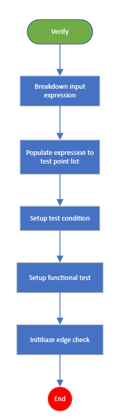
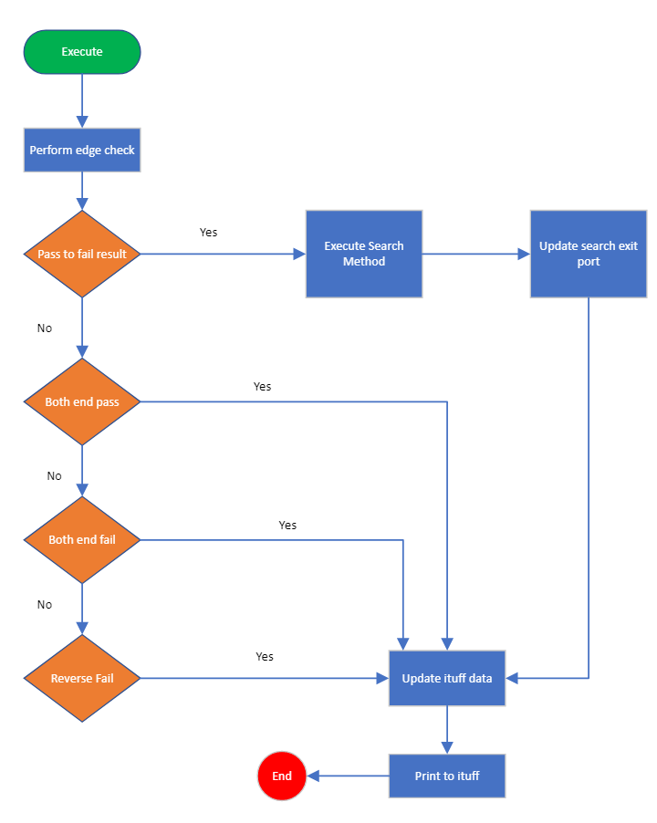
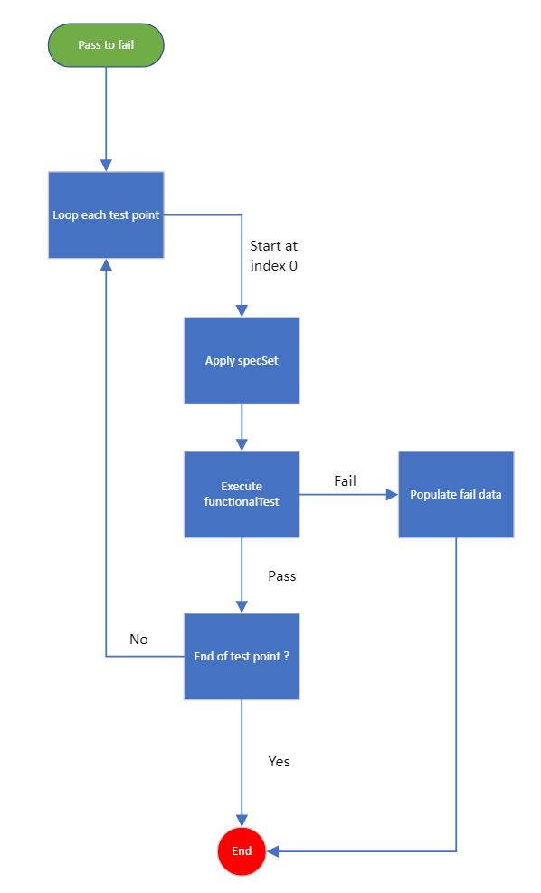
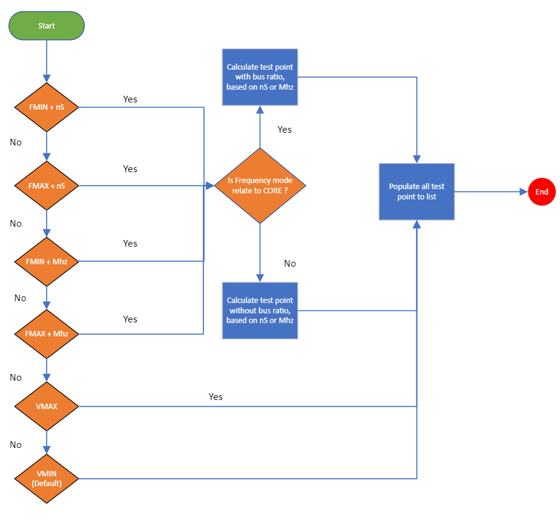

**Prime Test-Method Specification REP**

Revision 1.0.2

February 2025

[[_TOC_]]

## Introduction
The purpose of this test class is to provide voltage searches either through linear or binary searching, in which it is often use in silicon debug. Given user is able to specify low and high value, 
test method will execute pattern along these values, until it meet the condition either pattern execute passed or failed. This condition is set according to search direction describe as below: PASS_TO_FAIL or FAIL_TO_PASS, also refers as a transition.

With VMIN and VMAX search type specify, this helps to prioritize either low or high value shall be execute first.

In this document, you will find the below sections:

  - **Methodology** – A detailed description of this TestMethod intention and purpose

  - **Parameters** – A table describes each instance parameter (Name, Type, Default, Required?)

  - **Datalog output** – A detailed description of what is datalogged by his TestMethod

  - **Custom User Code hooks** – A list of functions available to the user code to override

  - **TPL Samples** – Examples of how to use this TestMethod in a TPL file

  - **Exit Ports** - A table describes each exit port

  - **Additional Dependencies** – More to consider for this TestMethod to operate

  - **Version tracking** – With author names, so you always have a name to address

  - **Acronyms** - Definition of acronyms used in this document 

## Methodology

SimpleSearchTestMethod applied search using linear or binary search methods, each value that search through perform specSet modification and regular functional test, then capture the result.
Execution stop once pass_to_fail transition found, and proceed to datalog the result captured that includes total test point executed and failure info.

Boundary check is added as there could exist both end pass or both end fail cases, this can be turn on or off using SKIP_EDGE_CHECK parameter for TTR effort. When either these cases is met, test method will exit directly.
Further test cases are explained at Boundary Check below.

At the end of Execute, testmethod will restore the modified SpecSet value to the value before modification.

Verify()



Execute()




### Boundary Check
A default boundary check is implemented in the test method or known as default edge check, to guarantee such that only certain conditions are allowed.
This involve checking the very low end and high end test point (full range coverage). 
Test method will not perform searches when edge check failed.

Default boundary check valid conditions:
1. Pass_to_fail transition - This is valid condition, meaning lower values are passing, and the very high end failed.
2. Both end pass transition - Pass condition as both lower and higher end passed.
3. Both end fail transition - Fail condition as both lower and higher end failed.
4. Pass_to_fail reverse transition - Invalid condition, as lower end failed and higher end pass.

* Note that if Binary search enable, default edge check will be perform regardless SKIP_EDGE_CHECK enable or not.

### Linear search
Simple test point search until a transition found between pass and fail. Either pass_to_fail, or fail_to_pass transition is allowed.
As test point is build during template Verify, executing pass_to_fail will search from index 0 in ascending order. While a fail_to_pass search is reverse, descending indexes to 0.



As describe in test instance parameter, test point/values expression were translated using format low value: high value: resolution. the test point will be build during Verify() and structure as a list.
The order of the list is determine by VMIN/VMAX, pairing with PASS_TO_FAIL or FAIL_TO_PASS, then searches will be happening down the list.

To helps visualize this further, here is the table on SimpleSearch execution order using different parameter settings.
The template follow this search table to group FMIN, FMAX, VMIN and VMAX.

| Search Type (Period Type) \ Search Direction | PASS_TO_FAIL | FAIL_TO_PASS |
|---------------|--------------|--------------|
| FMAX (nS)          | High test point to low test point | Low test point to high test point |
| FMIN (Mhz)         | High test point to low test point | Low test point to high test point |
| VMIN               | High test point to low test point | Low test point to high test point |
| FMIN (nS)          | Low test point to high test point | High test point to low test point |
| FMAX (Mhz)         | Low test point to high test point | High test point to low test point |
| VMAX               | Low test point to high test point | High test point to low test point |

- FMAX (nS), FMIN (Mhz), VMIN logic will be group together.
- FMIN (nS), FMAX (Mhz), VMAX is another group.

For example using search value expression "0.2,0.42,0.04":
1. Running in VMAX + PASS_TO_FAIL or VMIN + FAIL_TO_PASS, execution order is 0.2 -> 0.24 -> 0.28 -> 0.32-> 0.36 -> 0.40 -> 0.42.
2. Running in VMIN + PASS_TO_FAIL or VMAX + FAIL_TO_PASS, execution order is 0.42 -> 0.38 -> 0.34 -> 0.30 -> 0.26 -> 0.22 -> 0.2.
* Last test point is included.

### Binary Search
Binary search divide searches into two halves, through findings the middle index.
It determine at which half of the test point pass/fail the functional test, till passing index matching the middle index.

Test point (next/middle index) = (passing index + failing index) / 2. 

Consider passing index = 0 and failing index = 10, next test point will fall under test point at index 5.

### FMIN & FMAX calculation
In general, FMIN & FMAX testpoint are relatively the same as VMIN & VMAX, except they are first converted to either period (nS) or frequency (Mhz), based on period type selected before search started.

Examples below show the conversion/calculation happen for period and frequency respectively.
1. nS : user input low/high/increment * 1.0e-9 * bus ratio.
            
            Example: lowest point user define is 0.5 and bus ratio is 10, so 0.5 * 1.0e-9 * 10 = 5e-09.
2. Mhz: user input low/high/increment * 1.0e-6.

            Example: lowest point user define is 2.0, so 2.0 * 1.0e-6 = 2.0e-06.

The result will be store into testpoint list into an order according to the table above, which then consume by linear/binary searching during Execute.

* Note that bus ratio will take into consideration when Core mode selected, otherwise ignored.

Flowchart


## Test Instance Parameters


| Parameter Name       | Required                    | Type   | Values                                    | Comment                                                                                                                                                             |
|----------------------|-----------------------------|--------|-------------------------------------------|---------------------------------------------------------------------------------------------------------------------------------------------------------------------|
| Patlist              | Yes                         | Plist           | Plist name to be executed.                        |  |
| LevelsTc             | Yes                         | LevelCondition  | Levels test condition to be executed. |                                                                       |
| TimingsTc            | Yes                         | TimingCondition | Timings test condition to be executed.                          |     |
| ValuesExpression     | Yes                         | String          | Search value in format low point: high point: resolution.              | Search point specify to build for search execution, resolution is not allow in negative value. Eg: 0.6,1.2,0.05 |
| SearchParam          | Yes                         | String          | SpecSet of the level to be modify.    | SpecSet value that applies to test point point, before functional test execution.
| SearchMethod         | No. Default Linear.         | String (Choice) | Linear or Binary                         | Search algorithm linear execute each search point, while binary divide search interval by half. |
| SearchDirection      | No. Default PASS_TO_FAIL.   | String (Choice) | PASS_TO_FAIL or FAIL_TO_PASS | PASS_TO_FAIL search from passing till first failure found, FAIL_TO_PASS search from failing to first passing point. |
| SearchType           | No. Default VMIN            | String (Choice) | VMIN, VMAX, FMIN or FMAX  | Prioritize VMIN or VMAX, FMIN or FMAX when searching the values. When pass_to_fail and VMIN is selected, value searching from high to low. For VMAX, it will be low to high. Fail_to_pass reverse the searching order. Table attached as below. |
| SkipEdgeCheck        | No. Default is Enable       | String (Choice) | Enable or Disable | Disable will force template to perform default edge check. Enable will skip and return a pass on edge check. |
| FrequencyMode           | No. Default is Disable       | String (Choice) | Enable or Disable | Enable to perform Code speed mode, otherwise FSB when executing FMIN or FMAX. |
| PeriodFormat       | No. Default is Enable       | String (Choice) | Enable or Disable |  Enable will perform searches using period (nS), disable will perform in  frequency (mhz). |
| BusRatio             | No. Default is empty string       | String | Numeric value in string | Bus ratio value is required when Core mode is enabled, otherwise it is ignored. |


## Datalog output

Example of PASS_TO_FAIL, VMIN search, with all passing pattern.
```
2_tname_
2_mrslt_0.6000
2_comnt_Number_of_test_points_13
```

Example of PASS_TO_FAIL, VMIN, with fail pattern.
```
2_tname_
2_pttrn_compress_02
2_fdpmv_5
2_fcpmv_-1
2_fsdmv_-1
2_vcont_5
2_faildata_{8024}
[2023-Jun-01 18:44:01.201][DUT: 1]Printed to Ituff:
2_tname_
2_mrslt_1.1500
2_comnt_Number_of_test_points_3
```

## TPL Samples

Example 1: Linear search, PASS_TO_FAIL, VMIN. By default, edge check is skipped.

```
Test PrimeSimpleSearchTestMethod Linear_P2F_VMIN_P1
{
    Patlist = "passing_scan_hry";
    LevelsTc = "basic_func_lvl_nom";
    TimingsTc = "basic_func_timing_10MHz_20MHz";
    SearchType = "VMIN";
    SearchParam = "vil";
    SearchDirection = "PASS_TO_FAIL";
    SearchMethod = "LINEAR";
    ValuesExpression = "0.6,1.2,0.05";
    LogLevel = "Enabled";
}
```


Example 2: Linear search, PASS_TO_FAIL, VMAX. By default, edge check is skipped.

```
Test PrimeSimpleSearchTestMethod Linear_P2F_VMAX_P1
{
    Patlist = "passing_scan_hry";
    LevelsTc = "basic_func_lvl_nom";
    TimingsTc = "basic_func_timing_10MHz_20MHz";
    SearchType = "VMAX";
    SearchParam = "vil";
    SearchDirection = "PASS_TO_FAIL";
    SearchMethod = "LINEAR";
    ValuesExpression = "0.6,1.2,0.05";
    LogLevel = "Enabled";
}
```


Example 3: Linear search, FAIL_TO_PASS, VMIN, with edge check enable.

```
Test PrimeSimpleSearchTestMethod Linear_P2F_VMIN_EdgeCheck_P1
{
    Patlist = "passing_scan_hry";
    LevelsTc = "basic_func_lvl_nom";
    TimingsTc = "basic_func_timing_10MHz_20MHz";
    SearchType = "VMIN";
    SearchParam = "vil";
    SearchDirection = "FAIL_TO_PASS";
    SearchMethod = "LINEAR";
    ValuesExpression = "0.6,1.2,0.05";
    SkipEdgeCheck = "DISABLED";
    LogLevel = "Enabled";
}
```


Example 4: Binary search, PASS_TO_FAIL, VMIN, with edge check force enable.

```
Test PrimeSimpleSearchTestMethod Binary_P2F_VMIN_P1
{
    Patlist = "passing_scan_hry";
    LevelsTc = "basic_func_lvl_nom";
    TimingsTc = "basic_func_timing_10MHz_20MHz";
    SearchType = "VMIN";
    SearchParam = "vil";
    SearchDirection = "PASS_TO_FAIL";
    ValuesExpression = "0.6,1.2,0.05";
    SearchMethod = "BINARY";
    LogLevel = "Enabled";
}
```


Example 5: Binary search, fail to pass, invalid edge check, reverse pass to fail. Exit port 0.
```
Test PrimeSimpleSearchTestMethod Binary_EdgeCheck_Invalid_P0
{
    Patlist = "passing_scan_hry";
    LevelsTc = "basic_func_lvl_nom";
    TimingsTc = "basic_func_timing_10MHz_20MHz";
    SearchType = "VMIN";
    SearchParam = "vil";
    ValuesExpression = "0.6,1.2,0.05";
    SearchDirection = "FAIL_TO_PASS";
    SearchMethod = "BINARY";
    LogLevel = "Enabled";
}
```

Example 6: Linear search, pass to fail, FMIN, FSB mode with period mode.
```
Test PrimeSimpleSearchTestMethod Linear_P2F_FMIN_FSBPeriod_P1
{
    Patlist = "search_patlist";
    LevelsTc = "basic_func_lvl_nom";
    TimingsTc = "basic_func_timing_10MHz_20MHz";
    SearchType = "FMIN";
    SearchParam = "drive_var1";
    SearchDirection = "PASS_TO_FAIL";
    SearchMethod = "LINEAR";
    ValuesExpression = "6,20,0.5";
    FrequencyMode = "DISABLED";
    PeriodFormat = "ENABLED";
    LogLevel = "Enabled";
}
```
Example 7: Linear search, fail to pass, FMAX, core mode with frequency mode.
```
Test PrimeSimpleSearchTestMethod Linear_F2P_FMAX_CoreFreq_P1
{
    Patlist = "search_patlist";
    LevelsTc = "basic_func_lvl_nom";
    TimingsTc = "basic_func_timing_10MHz_20MHz";
    SearchType = "FMAX";
    SearchParam = "drive_var1";
    SearchDirection = "FAIL_TO_PASS";
    SearchMethod = "LINEAR";
    ValuesExpression = "6,20,0.5";
    FrequencyMode = "ENABLED";
    PeriodFormat = "DISABLED";
    BusRatio = "20";
    LogLevel = "Enabled";
}
```
Example 8: Binary search, pass to fail, fmax, FSB and frequency mode.
```
Test PrimeSimpleSearchTestMethod Binary_P2F_FMAX_FSBFreq_P1
{
    Patlist = "search_patlist";
    LevelsTc = "basic_func_lvl_nom";
    TimingsTc = "basic_func_timing_10MHz_20MHz";
    SearchType = "FMAX";
    SearchParam = "drive_var1";
    SearchDirection = "PASS_TO_FAIL";
    SearchMethod = "BINARY";
    ValuesExpression = "6,20,0.5";
    FrequencyMode = "DISABLED";
    PeriodFormat = "DISABLED";
    LogLevel = "Enabled";
}
```

Test 9: Core mode enabled, bua ratio missing. Expect to exit port -1.
```
Test PrimeSimpleSearchTestMethod Verify_MissingBusRatio_FNEG1
{
    Patlist = "search_patlist";
    LevelsTc = "basic_func_lvl_nom";
    TimingsTc = "basic_func_timing_10MHz_20MHz";
    SearchType = "FMAX";
    SearchParam = "drive_var1";
    SearchDirection = "PASS_TO_FAIL";
    SearchMethod = "LINEAR";
    ValuesExpression = "6,20,0.5";
    FrequencyMode = "ENABLED";
    PeriodFormat = "ENABLED";
    LogLevel = "Enabled";
}
```

## Exit Ports

The Sample Rate test method supports the following exit ports:


|****Exit** Port**|**Condition**  |**Description**  |
|--|--|--|
| -1|Error  | Any software error  |
| 0 | Fail  | Reverse fail or both end fail |
| 1 | Pass  | Pass port |
| 2 | Pass  | Both end pass  |

**Acronyms**
Definition of acronyms used in this document:

**REP**: Prime Test-Method Specification.
**DUT**: Device Under Test.
**TPL:** Test Programming Language

## Version tracking

| **Date**                  | **Version** | **Author**        | **Comments**    |
| ------------------------- | ----------- | ----------------- | --------------- |
| June 1<sup>st</sup>, 2023 | 1.0.0 | Tiow, Hian Seng | Added simpleSearchTestMethod |
| November 6<sup>th</sup>, 2023 | 1.0.1 | Tiow, Hian Seng | Added FMIN & FMAX |
| February 25<sup>th</sup>, 2025 | 1.0.2 | Teoh, Khai Jie | The testmethod will always restore SpecSet after Execute.<br> #56575 |