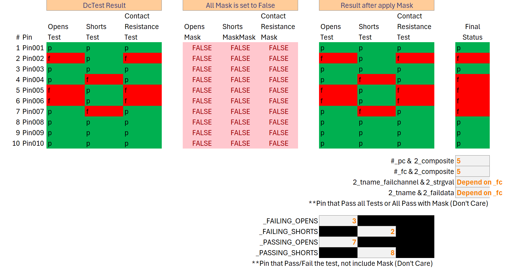
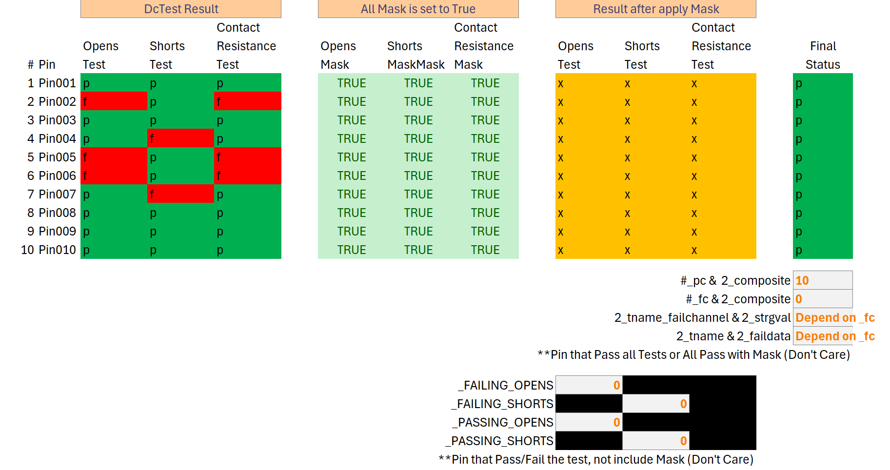
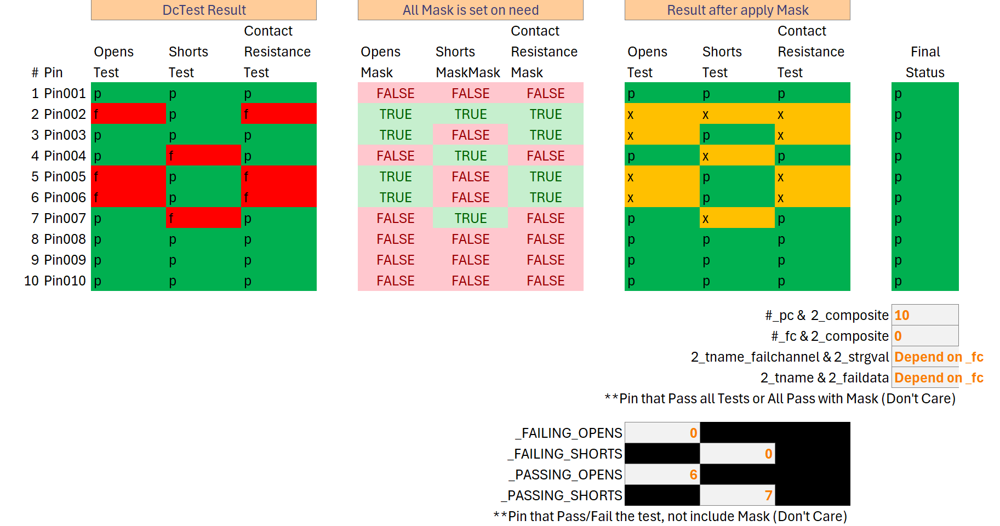

# PrimeContactResistanceTestMethod

[[_TOC_]]

## Overview

The **PrimeContactResistanceTestMethod** class is designed to perform three distinct tests within a single framework: signal pin **Shorts**, **Opens**, and **contact resistance** (**CRES**) tests. Users can incorporate multiple instances of this class into the device test program flow to conduct various tests as needed. This document provides a detailed guide on how to utilize this test class effectively.

## Parameter Table

| Name                   | Required |  Type  | Description |
| :--------------------- | :------: | :----: | :---------- |
| **LevelsTc**           |   Yes    | String | The name of _leveltc_ to be applied on _PMU_ for **CRES** measurement. When in **TWOPOINT** mode, two _leveltc_ will be used, and the name defined here will be the first _leveltc_, and the name suffixed with `_twopoint` will be used as the second `leveltc`.           |
| **SetupFilePath**      |   Yes    | String | The path of the configuration file which defines the pins to be tested and all related passing criterias.|
| **Mode**               |    No    | String | Choices of `ONEPINT` or `TWOPOINT`, default is `ONEPOINT`, this parameter is case-sensitive.|
| **DatalogItems**       |    No    | String | Switches used to enable specific iTUFF logging. Avaliable switches: `CresBaseLimit`, `TwoPointVoltage`. If more than one switch are selected, seperete them with commas. By default no switch is enabled. |
| ApplyEndSequence       |    No    | String | DISABLED or ENABLED, when enabled, test method will apply _EndSequence_ at the end of the test. |

## Methodology

**Contact Resistance**, or **CRES**, measures the resistance between the SIU probes and the bumps, determining the quality of the connection. This test method will provide you with the function to get the **CRES** on either _pin group_ or _individual pin_ level.

The test method is developed and executed with the assumption that users are operating the _Parametric Measurement Unit (PMU)_ in the _HDMT_ tester slot in _ISVM (Current Source, Voltage Measure)_ mode. This setup allows for the calculation of **CRES** by applying a forced current $I_{force}$ and measuring the corresponding voltage $U_{raw}$, in accordance with _Ohm's Law_.

To configure a _PMU_ to operate in _ISVM_ mode, you must create a **unique** _level_ definition for each _individual pin_ or _pin group_ using the `StartMeasurement` attribute. Below is an example of a _level_ definition named `ContactResistanceLevelExample` covering 2 channels. In this example, channel `DomainA_DPIN_PMU` is configured to work on a _pin group_, while channel `xxHPCC_DPIN_PMU_slcB_Short` is set for a _single pin_. Both are configured with an $I_{force}$ of $0.001 A$. You can simply provide the name `ContactResistanceLevelExample` to the `LevelsTc` parameter of this test method. The test method will apply this _level_ and then measure the voltage to calculate **CRES**.

``` python
Levels ContactResistanceLevel
{
    ###### Pin group 1  ######
    DomainA_DPIN_PMU
    {
        OPMode = "ISVM";
        IRange = "IR1mA";
        IForce = 0.001A;
        VClampHi = 2V;
        VClampLo = -1.5V;
        StartMeasurement = True;
        PreMeasurementDelay = 100us;
        SamplingCount = 1;
        SamplingRatio = 1; 
        SamplingMode = "Trace";
        PinModeSel = "PMU";
    }

    SequenceBreak 1mS;
    ###### Pin 1  ######
    xxHPCC_DPIN_PMU_slcB_Short
    {
        OPMode = "ISVM";
        IRange = "IR1mA";
        IForce = 0.001A;
        VClampHi = 2V;
        VClampLo = -1.5V;
        StartMeasurement = True;
        PreMeasurementDelay = 20us;
        SamplingCount = 1;
        SamplingRatio = 1;
        PinModeSel = "PMU";
    }
}
```

| :zap: IMPORTANT                                                        |
| :---------------------------------------------------------------------- |
| In the _level_ definition, you should make sure `OPMode` set to `ISVM`. |

| :zap: IMPORTANT                                                                                                |
| :-------------------------------------------------------------------------------------------------------------- |
| Make sure `VClampHi` and `VClampLo` are properly set, so that no unexpected hardware alarms would be triggered. |

### Open Short CRES Test Calculation

For the specific _pin_ or _pin group_ being tested, the test method retrieves the raw measured voltage value, $U_{raw}$, from the _PMU_. It then calculates the **CRES** result using the following formula:

$$
R_{cres} = \frac{U_{raw} - U_{base}}{I_{force}}
$$

The value of $U_{base}$ is sourced from the `BaseReading` configuration for the specific pin under test, as specified in the [SetupFile](#setup-file-syntax). The file path (URL) for this setup file must be provided to the test method via the `SetupFilePath` parameter.

With the raw voltage reading $U_{raw}$ and the calculated **CRES** value $R_{cres}$, a PASS or FAIL determination can be made. In addition to `BaseReading`, parameters such as `ContactResistanceLimit`, `ShortsLimit`, and `OpensLimit` are also configured and associated with each _individual pin_ or _pin group_ under test. For each _pin_ or _pin group_, the following checks will be performed:

| Test Type | Criteria                           | If Criteria Met, Then?                                        |
| :-------: | :--------------------------------- | :------------------------------------------------------------ |
|   Open    | $Abs(U_{raw}) > OpensLimit$        | Circuit OPEN, we fail at OPEN test.                           |
|   Short   | $Abs(U_{raw}) < ShortsLimit$       | Circuit SHORT, we fail at SHORT test.                         |
|   CRES    | $R_{res} < ContactResistanceLimit$ | CRES greater than predefined threshold, We fail at CRES test. |

If a channel (individual pin or pin groups) passed all these 3 tests listed in the table above, then this channel will be categoried to the **PassPins**, otherwise, if any of the 3 tests fails, this channel will be categoried to **FailPins**. At the end of the test instance execution, information in category **PassPins** and **FailPins** will be printed out to _iTUFF_.

### OnePoint Mode vs TwoPoint Mode

| :memo: NOTE |
| :---------- |
| The `Mode` feature has been supported since version _V13.02.00_. This feature introduced two operating modes: `ONEPOINT` and `TWOPOINT`. Previously, it was effectively in `ONEPOINT` mode, but with the feature support, users are now allowed to select the new `TWOPOINT` mode. |

| :zap: IMPORTANT |
| :---------- |
| The `TWOPOINT` operating mode was introduced from the **SPEXCRES** test method in the **SPEX** library, and the method for calculating **CRES** differs from that of **Evergreen**, which use the formula $R_{res} = \frac{U_{raw_2} - U_{raw_1}}{I_{force_2} - I_{force_1}}$. |

If you don't specifically configure `Mode` to `TWOPOINT`, the test method will automatically operate in `ONEPOINT` mode, as detailed in the [preceding section](#open-short-cres-test-calculation). The primary distinction between the `ONEPOINT` and `TWOPOINT` modes is that in `TWOPOINT`, the test method applies **two** different _levels_ and obtains **two** voltage measurements for each _individual pin_ or _pin group_. It then conducts the **Open**/**Short**/**CRES** tests using the data from these **two** current-voltage pairs.

In `TWOPOINT` operating mode, since two _levels_ need to be executed, but the input parameter `LevelsTc` currently allow for only one _level_ name to be provided, the test method will internally **deduce** the name of the second _level_. For example, if the user inputs the _level_ name via parameter `LevelsTc` as `cres_level`, then in `TWOPOINT` mode, the _level_ named `cres_level` will be executed first, yielding the initial test results $U_{raw_1}$ and $I_{force_1}$. Subsequently, the test method will execute the _level_ named `cres_level_twopoint` to obtain the second set of test results $U_{raw_2}$ and $I_{force_2}$. As you can see, the method by which the test method internally deduces the _level_ name for the second execution is by appending the `_twopoint` suffix to the _level_ name provided by the user via `LevelsTc` parameter.

After we got the $U_{raw_1}$, $I_{force_1}$ and $U_{raw_2}$, $I_{force_2}$, the $U_{raw}$ and $I_{force}$ in `TWOPOINT` mode will be calculated according to the following formula:

$$
U_{raw} = \frac{U_{raw_1} + U_{raw_2}}{2}
$$

$$
I_{force} = \frac{I_{force_1} + I_{force_2}}{2}
$$

With the newly calculated voltage and current values, all subsequent decision logic will be consistent with the `ONEPOINT` mode, as described in the [previous chapter](#open-short-cres-test-calculation).

### Datalog & SharedStorage

This test method outputs various information to iTUFF. Additionally, the `DatalogItems` parameter allows you to specify which categories of information should be printed.

The DatalogItems parameter offers several built-in datalog type switches. Users can enable specific types of datalog output to iTUFF by passing the corresponding switch names to this parameter. When parsing the datalog type switches provided by the user, the `DatalogItems` parameter is case-insensitive. To enable multiple datalog types simultaneously, different names can be separated by commas.

| :memo: NOTE |
| :---------- |
| The `DatalogItems` parameter has been supported since version _V13.02.00_. |

#### BaseReading and ContactResistanceLimit Configuration

During the _verification_ stage of the test method, if `CresBaseLimit` is passed to `DatalogItems`, then the `BaseReading` and `ContactResistanceLimit` data read from [SetupFile](#setup-file-syntax) will be printed to iTUFF in the _composite_ data format.

Suppose we have a test instance named `ContactResistance::PrimeContactResistanceTestMethod_Example_Instance`, and in the **SetupFile** only one `Channel` `8000` is defined with `BaseReading` set as `0` and `ContactResistanceLimit` set as `999`. With `DatalogItems = CresBaseLimit`, you will get the following iTUFF outputs.

``` log
2_tname_ContactResistance::PrimeContactResistanceTestMethod_Example_Instance
2_category_goldenbase
2_composite_8000_0.0000000
2_msunit_V
2_tname_ContactResistance::PrimeContactResistanceTestMethod_Example_Instance
2_category_limit
2_composite_8000_999.0000000
2_msunit_O
```

#### Raw Data of PassPins/FailPins

Besides, as mentioned in the section [Open Short CRES Test Calculation](#open-short-cres-test-calculation), the **PassPins** and **FailPins** information will also be printed to iTUFF by default. To be noted, the output formats are different between **OnePoint** and **TwoPoint** mode.

Suppose we have three channels defined in the **SetupFile**, channel `8000`, `8001` and `8002`, and only `8000` passed all tests.

In **OnePoint** mode, you will see the following prints in iTUFF.

``` log
2_tname_ContactResistance::PrimeContactResistanceTestMethod_Example_Instance_TESTSHORTSOPENS_DC
2_category_pc
2_composite_8000_1.3999939
2_msunit_V
2_tname_ContactResistance::PrimeContactResistanceTestMethod_Example_Instance_TESTSHORTSOPENS_DC
2_category_fc
2_composite_8001_1.8999863
2_composite_8002_0.0000000
2_msunit_V
```

As you can see, a suffix `_TESTSHORTSOPENS_DC` is appended to the `tname`, and the composite data format is `<Channel>_<floatNumber>`, where the `<floatNumber>` is the raw voltage measurement reading $U_{raw}$ for this channel, the unit of the data is `V`. Data of **PassPins** are placed into the `pc` category, **FailPins** into the `fc` category.

If there is no **PassPins**, then there will be no `pc` category printed to iTUFF, the same rule applies to `fc` category.

Please note that the values provided here are for illustrative purposes only and are not derived from actual measurements or calculations.

In **TwoPoint** mode, there will be two raw voltage measurement reading for each _pin_ or _pin group_, i.e., $U_{raw_1}$ and $U_{raw_2}$. By default, these two raw voltage data will not be printed to iTUFF. The calculated **CRES** $R_{cres}$ will be printed instead, as the following example.

``` log
2_tname_ContactResistance::PrimeContactResistanceTestMethod_Example_Instance_CRES
2_category_pc
2_composite_8000_3.2341283
2_msunit_O
2_tname_ContactResistance::PrimeContactResistanceTestMethod_Example_Instance_CRES
2_category_fc
2_composite_8001_54.209877
2_composite_8002_93.098709
2_msunit_O
```

Compared with the iTUFF output in **OnePoint** mode, you will see the suffix also changed to `_CRES` and the data unit now is `O`, which means _Ohms_.

In the **TwoPoint** mode, if you need the two raw volatage measurements $U_{raw_1}$ and $U_{raw_2}$ to be printed to iTUFF, you can pass the `TwoPointVoltage` switch to the parameter `DatalogItems`, then you will see the corresponding outputs, as the following example.

``` log
2_tname_ContactResistance::PrimeContactResistanceTestMethod_Example_Instance_FIRSTPOINT
2_category_pc
2_composite_8001_3.2341283
2_msunit_V
2_tname_ContactResistance::PrimeContactResistanceTestMethod_Example_Instance_FIRSTPOINT
2_category_fc
2_composite_8001_0.1239870
2_composite_8002_2.0982789
2_msunit_V
2_tname_ContactResistance::PrimeContactResistanceTestMethod_Example_Instance_SECONDPOINT
2_category_pc
2_composite_8001_4.9089790
2_msunit_V
2_tname_ContactResistance::PrimeContactResistanceTestMethod_Example_Instance_SECONDPOINT
2_category_fc
2_composite_8001_1.2098732
2_composite_8002_3.2347978
2_msunit_V
```

#### **FailPins** Channel Information

The _Pin Name_ and the _Pin Channel_ information of **FailPins** will also be printed to iTUFF with the format of string value, the data format is `{FailPin1Name}_{FailPin1ChannelNumber}|{FailPin2Name}_{FailPin2ChannelNumber}|...`. Also, a prefix `failchannel_` will also be added to the _tname_.

Here is an example of iTUFF output with 2 pin failure.

``` log
2_tname_failchannel_ContactResistance::PrimeContactResistanceTestMethod_OpensAndCresTestsFail_Example
2_strgval_xxHPCC_DPIN_PMU_slcA_Short_0008000|xxHPCC_DPIN_PMU_slcA_50ohm3_0008003
```

Besides, **FailPins** information will also be inserted to **SharedStorage** with _key_ `FAILPININFO`. The inserted data is a dictionary of **Fain Pin** list data type, and the _key_ of the dictionary is **instance name**. An example as follows:

``` json
{
  "ContactResistance::PrimeContactResistanceTestMethod_OpensAndCresTestsFail_Example": [
    {
      "FailPinName": "xxHPCC_DPIN_PMU_slcA_Short",
      "FailChannelNumber": "0008000",
      "InstanceName": "ContactResistance::PrimeContactResistanceTestMethod_OpensAndCresTestsFail_Example"
    },
    {
      "FailPinName": "xxHPCC_DPIN_PMU_slcA_50ohm3",
      "FailChannelNumber": "0008003",
      "InstanceName": "ContactResistance::PrimeContactResistanceTestMethod_OpensAndCresTestsFail_Example"
    }
  ]
}
```

| :memo: NOTE |
| :---------- |
| This fail pin printing to **iTUFF** and **SharedStorage** behavior will **NOT** be affected by the **WITCH** project. Even there is no _boolean_ user var name `__shared__::WitchProjectVars.Print` existing or the user var not being set to `True`, this **FailPins** information will always be printed to **iTUFF** and **SharedStorage**. |

#### Failed **CRES** Test Resistance

All **CRES** failed test pins will be printed to _iTUFF_, the _tname_ will has a suffix `fprX`. If the number of channels that fail the test is large, the data will be split into multiple records and printed to iTUFF. The `X` in the suffix of _tname_ is the sequence number of the record. `X` starts counting from 1. The data format is `{FailPin1Name}_{CRESValue1}|{FailPin2Name}_{CRESValue2}|...`. The following is an example.

``` log
2_tname_ContactResistance::PrimeContactResistanceTestMethod_OpensAndCresTestsFail_F3_fpr1
2_strgval_12|xxHPCC_DPIN_PMU_slcA_Short|1405.46729478711|xxHPCC_DPIN_PMU_slcA_50ohm3|899.066062|xxHPCC_DPIN_PMU_slcA_1Kohm|1113.86949768945|xxHPCC_DPIN_PMU_slcA_2Kohm|1188.63397179883|xxHPCC_DPIN_PMU_slcA_10Kohm|1403.47794979883|xxHPCC_DPIN_PMU_slcA_20Kohm|6241.46609579883
2_tname_ContactResistance::PrimeContactResistanceTestMethod_OpensAndCresTestsFail_F3_fpr2
2_strgval_12|xxHPCC_DPIN_PMU_slcA_180Kohm|1175.18626979883|xxHPCC_DPIN_PMU_slcA_1Mohm1|1246.54130479883|xxHPCC_DPIN_PMU_slcA_1Mohm2|1380.11790979883|xxHPCC_DPIN_PMU_slcA_DiodeNeg|1219.26510779883|xxHPCC_DPIN_PMU_slcA_DiodePos|1412.53505079883|xxHPCC_DPIN_PMU_slcA_Open|1216.60007979883
```

#### Failed **Open**/**Short** Test Channels

Channels failed at **Open**/**Short** tests will also be printed to _iTUFF_, with the format of `faildata`, and the _tname_ will be suffixed with `_opens` and `_shorts` respectively. In the data format, different channels will be seperated by commas. Below are two examples, correspoinding to **Open** and **Short**.

``` log
2_tname_ContactResistance::PrimeContactResistanceTestMethod_OpensAndCresTestsFail_F3_opens
2_faildata_{8009,8010}
```

``` log
2_tname_ContactResistance::PrimeContactResistanceTestMethod_AllTestsFail_F2_shorts
2_faildata_{8000,8002,8004,8006,8007,8008,8009,8011,8012,8013,8014,8015}
```

This `faildata` token will be used by the **PinFinder** tool.

#### **Open**/**Short** Test **Pass**/**Fail** Pin Count

The pass/fail pin count for **Open** and **Short** test will also be printed to _iTUFF_, with the _tname_ suffixed with `_FAILING_OPENS`, `_FAILING_SHORTS`, `_PASSING_OPENS` and `_PASSING_SHORTS` respectively. Here is an example.

```python
2_tname_ContactResistance::PrimeContactResistanceTestMethod_OpensAndCresTestsFail_FAILING_OPENS
2_mrslt_1
2_tname_ContactResistance::PrimeContactResistanceTestMethod_OpensAndCresTestsFail_FAILING_SHORTS
2_mrslt_0
2_tname_ContactResistance::PrimeContactResistanceTestMethod_OpensAndCresTestsFail_PASSING_OPENS
2_mrslt_11
2_tname_ContactResistance::PrimeContactResistanceTestMethod_OpensAndCresTestsFail_PASSING_SHORTS
2_mrslt_13
```

The pin count information above will also be written to **ShareStorage**, with the _key_ `PinCounts_NumberOfFailingOpens`, `PinCounts_NumberOfFailingShorts`, `PinCounts_NumberOfPassingOpens` and `PinCounts_NumberOfPassingShorts` respectively.

### Setup File Syntax

Here is a brief example of a **SetupFile** to help you quickly understand the syntax.

``` json
{
  "XIUs": [
    {
      "Name": "XIU_1",
      "Pins": [
        {
          "Channel": 8056,
          "Name": "xxHPCC_DPIN_PMU_slcB_Short",
          "BaseReading": 0,
          "ContactResistanceLimit": 999,
          "OpensMask": false, # optional parameter, default value => false
          "ShortsMask": true, # optional parameter, default value => false
          "ContactResistanceMask": true # optional parameter, default value => false
        },
        ...
      ],
      "PinGroups": [
        {
          "Name": "xxHPCC_DPIN_PMU_slcB_Short", # This can be a pin or a pin group
          "ShortsLimit": 0.25,
          "OpensLimit": 1.49
        },
        ...
      ]
    },
    {
      "Name": "XIU_2",
      "Pins": [
        ...
      ],
      "PinGroups": [
        ...
      ]
    }
    ...
  ]
}
```

The **SetupFile** includes a list of `XIU` objects, each with the following fields:

* **Name**: This field contains `XIU` names or a _regex expression_.
* **Pin Groups**: This is a list of _pin groups_ on which the **Short**, **Open**, and **CRES** tests will be conducted.
* **Pins**: This section lists pin-specific configurations.

Each `Pin` object includes three `boolean` options: `ContactResistanceMask`, `OpensMask`, and `ShortsMask`. These options determine whether the **CRES**, **Open**, and **Short** tests will be **bypassed** for that pin. If an option is set to `true`, the corresponding test will be skipped. The default configuration values are as follows:

``` cpp
ContactResistanceMask = true,
ContactResistanceLimit = 999,
OpensMask = false,
ShortsMask = false,
BaseReading = 0,
```

<details><summary><font color="blue">Expand for detailed behavior for ContactResistanceMask, OpensMask and ShortsMasks</font></summary>

Assuming following scenario<br>
<br>
<br>
<br>
</details>


In the `Pins` list of **SetupFile**, duplicated `Pin` `Name`s and `Channel` numbers are allowed to support multiple DUT testing through merged setupfile/pin socket file. #38899

| :memo: NOTE |
| :---------- |
| If a _pin_ is specified in the `Pins` list but does not belong to any of the _pin group_ listed in `PinGroups`, no test will be performed on it. Conversely, if a _pin_ within a _pin group_ defined in the `PinGroups` list lacks a configuration matching its `Name` and `Channel` defined in the `Pins` list, the **CRES** test for that _pin_ will default to predetermined configuration values. Consequently, the **CRES** test will be **bypassed**, while the **Open** and **Short** tests will still be carried out. |

Although there are multiple different **XIU** objects in the configuration file, when the test method is executed, only one will be selected for use through regular expression matching. The `Name` of **XIU** defined in a **XIU** object will be used as a regular expression to match the **XIU** ID in tester. The first matched **XIU** object will be selected and used. If no **XIU** objects matched, then an _software exception_ will be thrown. If you enabled the debug print of the test method, you will see the seleted XIU object `Name` field printed to console.

## Behavior in Verify Stage

In the verify stage, test method will firstly try to get the **XIU** id currently installed in tester. If it failed, exception would be thrown.

After this, all parameters passed by users will be validated, including:

* `LevelsTc` MUST exist, if in `TWOPOINT` mode, `LevelsTc_twopoint` MUST exist too.
* `SetupFile` MUST exist, and no syntax error exists in the setup file content.
* Based on current **XIU** installed in tester, a valid **XIU** object in SetupFile could be seleted.
* If any `DatalogItems` provided, the name of the Datalog switches MUST be valid.

If any of the items above failed, a _software exeception_ will be thrown.

## TPL Samples

Here are a few test instance examples using the Contact Resistance test method:

``` java
Import PrimeContactResistanceTestMethod.xml;
Test PrimeContactResistanceTestMethod PrimeContactResistanceTestMethod_AllTestsPass_P1
{
   LevelsTc = "ContactResistance::SecondContactResistanceTestMethodTC";
   SetupFilePath = "~HDMT_TPL_DIR/Modules/ContactResistance/ContactResistance/InputFiles/AllTestsPassV2.json";
   Mode = "TWOPOINT"
   DatalogItems = "CresBaseLimit,TwoPointVoltage"
}
```

## Exit Ports

| Exit Port | Condition | Description                                                       |
| :-------: | :-------: | :---------------------------------------------------------------- |
|    -2     |   Alarm   | Any alarm condition.                                              |
|    -1     |   Error   | Any software condition error.                                     |
|     0     |   Fail    | Failing condition.                                                |
|     1     |   Pass    | All Opens, shorts and contact resistance tests pass condition.    |
|     2     |   Fail    | Shorts tests failing. Opens and Cres tests might have failed too. |
|     3     |   Fail    | Opens tests failing. CRES tests might have failed too.            |
|     4     |   Fail    | Contact Resistance tests failing.                                 |

## References

#38899 <br />
#39812 <br />
#39827 <br />
#46008 <br />
#57834 <br />

* [PinFinder Web App](http://pinfinder.intel.com/PinFinder)
* [PinFinder SPEC](http://pinfinder.intel.com/PinFinder/avacado/pf_spec)

## Version Tracking

|            Date            |        Author        | Comments                                                                                           |
| :------------------------: | :------------------: | :------------------------------------------------------------------------------------------------- |
| Jan  31<sup>st</sup>, 2022 |     Andrea Gomez     | Initial version                                                                                    |
| July 15<sup>th</sup>, 2022 |    Chen Tat, Khoh    | Ituff faildata to comply PinFinder tools format.                                                   |
| June  2<sup>nd</sup>, 2023 |     Andrea Gomez     | Print raw data in pc or fc depending on whether the pin passes all tests.                          |
| June  8<sup>th</sup>, 2023 |     Andrea Gomez     | Pins list in configuration file can now be empty or have duplicated pin names and channel numbers. |
| Sep  13<sup>th</sup>, 2023 |    Khai Jie, Teoh    | Include fail pin name and fail channel printing to ituff.<br /> #39827                             |
| Sep  29<sup>th</sup>, 2023 |     Andrea Gomez     | Remove unnecessary ituff print.                                                                    |
| Nov  21<sup>th</sup>, 2023 |    Khai Jie, Teoh    | Disable Witch Project '2_tname_failchannel' and '3_binpinfails' printing to ituff.<br /> #46008    |
| Aug  22<sup>th</sup>, 2024 | Raquel Pinto Rosales | Documentation enhancement                                                                          |
| Mar  11<sup>th</sup>, 2025 |      Wang, Quzhi     | Adopt CRES from SPEX library and update documents. <br /> #57834                                   |
| Mar  20<sup>th</sup>, 2025 |    Khai Jie, Teoh    | Add information about Masks (Open, Short, ContactResistance) logic.                                |
