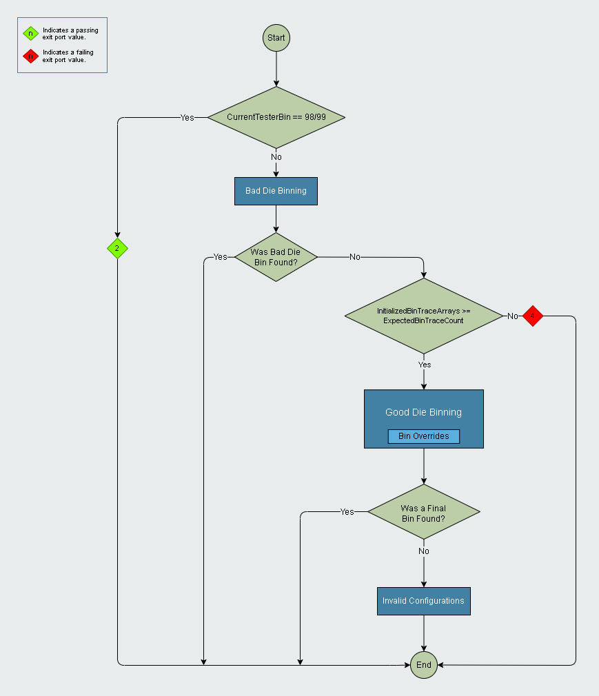
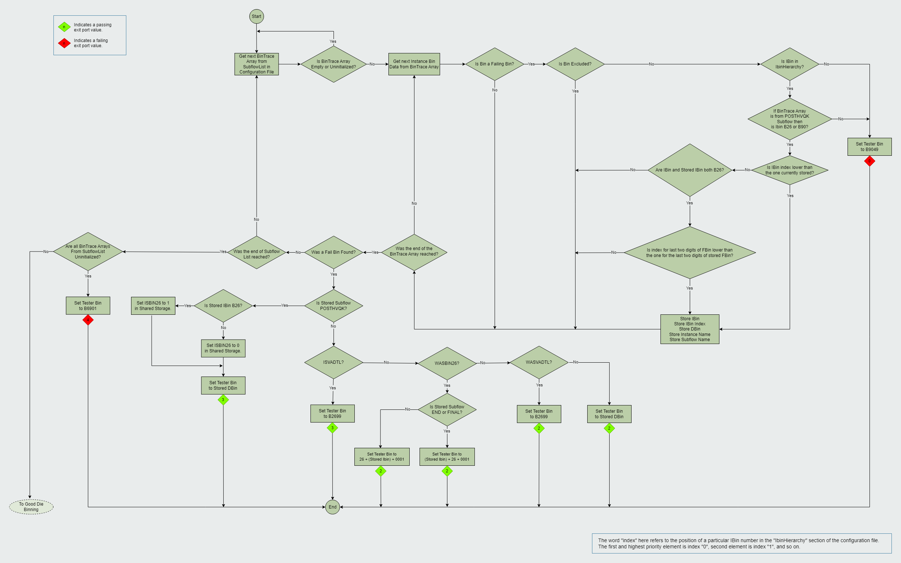
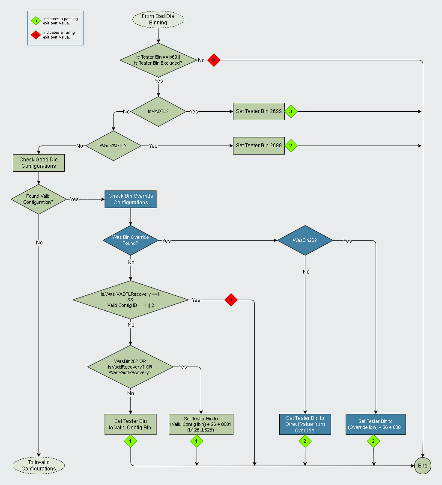
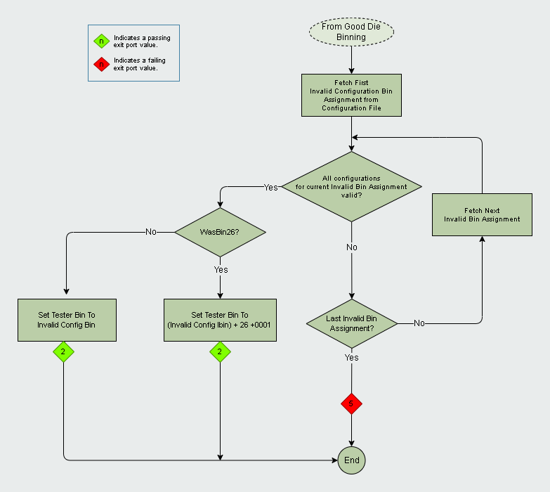

**Prime Test-Method Specification REP**

[[_TOC_]]

## REP for SortSetBin Test Method

This **REP** is intended to describe the behavior and features of the SortSetBin Prime Test Method.

# Introduction

The SortSetBin Test Method is designed to provide a way to calculate the final bin, with a standardized binning logic, in a Sort Test Progam which uses Forced Flow Methodology. The calculated bin value is then set into the tester.
IMPORTANT: All possible bin value outcomes must be defined in the Test Program Bin Definition file (.bdef), otherwise the tester will fail when trying to set an undefined value.

# Prerequisites and Dependencies

The SortSetBin Test Method assumes 8-Digit Binning format is used throughout the Test Program as specified on the table below:

| 1st Digit | 2nd Digit | 3rd Digit | 4th Digit | 5th Digit | 6th Digit | 7th Digit | 8th Digit |
|---------|---------|---------|---------|---------|---------|---------|---------|
| IB | IB | | | | | | |
| FB | FB | FB | FB | | | | |
| DB | DB | DB | DB | DB | DB | DB | DB |

As can be seen the first 2 digits represent the Interface Bin (IB), the first four digits represent the Functional Bin (FB). All 8 digits make up the Data Bin (DB) and Data Bin matches exactly to the 8-digit counter defined for the test exit port.

The SortSetBin Test Method also depends on the usage of the complementary SortBinTrace Test Method to capture the BinTrace Data necessary for final bin calculation. Please refer to the SortBinTrace Test Method documentation for further details.

# User Interface Parameters

The table below lists and describes the user interface parameters provided by the SortSetBin Test Method.

| **Parameter Name** | **Mandatory?** | **Type** | **Description** |
|--------------------|----------------|----------|-----------------|
| ConfigurationFile  | Yes            | String   | Specifies the path to the Test Method configuration file.|
| BinStorageKeyPrefix | No            | String   | Defines a prefix for the Shared Storage Keys where the final bin values are stored. See [Final Bin Data Storage](#final-bin-data-storage) for details.|
| ExpectedBinTraceCount | Yes            | Integer   | Defines the minimum number of expected BinTrace arrays that should be initialized to ensure that any die binned as good ran the full TP flow. See [Execute](#execute) for details.|

# SortSetBin Test Method Exit Ports

The SortSetBin Test Method supports the following exit ports.

| **Port Number** | **Exit Condition** | **Description** |
|-----------------|--------------------|-----------------|
|**-2**           |***Alarm***         |Any hardware alarm.|
|**-1**           |***Error***         |Any software error or software execution failure.|
|**0**            |***Fail***          |IB not found in configuration file, invalid bin for POSTHVQK or another code failure.|
|**1**            |***Pass***          |Good Die.|
|**2**            |***Pass***          |Valid Bad Die|
|**3**            |***Pass***          |Bin 26 that will reroute to HVQK flows.|
|**4**            |***Fail***          |Unassigned Bin or Incomplete Flow Execution.|
|**5**            |***Fail***          |No Matching Die Configuration.|

# Implementation

## Verify

During Verify, the file specified in *ConfigurationFile* will be parsed and checked for proper structure and values. See section [Configuration File](#configuration-file) for details on file structure and data requirements.

## Execute

The following figure depicts the overall flow of the Binning Algorithm during Execute.

<!--- This editable graphics file contains the relevant flowchart --->
<!--- and it should be edited with VS Code + the Draw.io Extension --->
<!--- since it's not a regular image. --->
<center>



</center>

As can be seen, the algorithm consists of three main subflows (in blue): the Bad Die Binning Algorithm, Good Die Binning Algorithm (which includes logic for Bin Overrides) and Invalid Configurations. The details of each subflow, including exit ports and bin values, will be covered in the following sections.

At the start of the flow the Test Method will check if the current bin is an alarm bin (b98/b99) and if so will give priority to that bin by exiting through port 2. Another check is performed if no Bad Die Bin was found to ensure that any die binned as good ran the full TP flow, if the amount of initialized BinTrace Arrays is equal to or greater than the value of Instance Parameter "ExpectedBinTraceCount" then execution continues to set a Good Die Bin, otherwise the Test Method errors out through port 4.

The [Configuration File](#configuration-file) provides the necessary inputs for the binning algorithm.

### Bad Die Binning Algorithm

The following image details the flow, logic and exit ports for the Bad Die Binning algorithm.

<!--- This editable graphics file contains the relevant flowchart --->
<!--- and it should be edited with VS Code + the Draw.io Extension --->
<!--- since it's not a regular image. --->
<center>



</center>

The Bad Die Binning logic is managed with two levels of hierarchy. The first level is the Subflow level and the second level is the bin level.

Subflow level hierarchy is specified by the [SubflowList Section](#subflowlist-section) of the Configuration File which details what BinTrace Arrays to analyze and their order of hierarchy. It's assumed that there is a 1-to-1 relationship between a Subflow and it's corresponding BinTrace Array (i.e. One BinTrace Array represents one Subflow of the Test Program and contains its corresponding BinTrace Data.).

The second level of hierarchy defines the bin to select when multiple bad bins exist within a BinTrace Array, this level of hierarchy is applied within a Subflow and is also defined in the Configuration File, see [IbinHierarchy Section](#ibinhierarchy-section) for details.

The Bad Die Binning algorithm will only traverse the BinTrace Arrays specified in the Configuration File, there are no hardcoded arrays for any specific Socket and they must be specified in the desired order of hierarchy.

When determining whether a BinTrace Array belongs to a certain flow, such as POSTHVQK, the algorithm will look into the BinTrace Array Name to determine if it contains the following strings: "POST" for POSTHVQK Flow, "END" for END Flow and "FINAL" for FINAL Flow. This comparison is **not** case-sensitive.

### Good Die Binning Algorithm

If no Bad Die bin was found on the Bad Die Binning Algorithm then the Good Die Binning Algorithm is executed to find a Good Die Bin to set. This algorithm also includes logic for Bin Overrides as in Sort there are scenarios where a Good Die must be overridden to a Bad Failing bin. If for example, a die has no bad bins identified, and a good die configuration is found but the die happens to be non-shippable, a bad bin must be applied. In addition, certain parametric bins are applied ONLY on Good Die as the lowest priority fail bin(e.g. SICC parametric bin).

The following image details the flow, logic and exit ports for the Good Die Binning algorithm. Bin Overrides logic is highlighted with blue-shaded nodes.

<!--- This editable graphics file contains the relevant flowchart --->
<!--- and it should be edited with VS Code + the Draw.io Extension --->
<!--- since it's not a regular image. --->
<center>



</center>

As depicted in the image above, there is a check performed on the current bin value at the start of the algorithm. The current bin must either be bin 69 or it must be excluded in the [Bin Exclusions Section](#binexclusions-section) of the Configuration File. If these conditions are not met then the Good Die binning is aborted and the Test Method exits through port 0.

Another possible error condition is if a Valid Configuration is found with no Bin Override where IsVADTLRecovery or WasVADTLRecovery are 1 but the IBin for the selected Valid Configuration is 1 or 2 as this is an invalid condition. Under these circumstances the algorithm will also abort binning and exit through port 0.

Note that the logic for Bin Overrides is only applied if a matching Good Die Configuration is found.

For more details regarding the configuration file sections involved here, see [Good Die Bin Assignments Section](#gooddiebinassignments-section) and [Bin Overrides Section](#binoverrides-section).

### Invalid Configurations

The flowchart below details the Invalid Configurations logic, which is executed at the end of the flow, when no Bad Die, Good Die or Bin Override values have been found .

<!--- This editable graphics file contains the relevant flowchart --->
<!--- and it should be edited with VS Code + the Draw.io Extension --->
<!--- since it's not a regular image. --->
<center>



</center>

The algorithm goes through the list of Invalid Configuration Bin Assignments from the Configuration File in the order they were defined. For each one of those Bin Assignments all of its configurations are evaluated, if all configurations are valid then the specified Bin Value is applied. If no Invalid Bin Assignment is found to have all valid configurations then execution is stopped and the Test Method exits through port 5.

For more details about Invalid Configurations see the [Invalid Configurations](#invalidconfigurationbinassignments-section) of the Configuration File.

# Ituff Output

The Test Method will output ituff data whenever a final bin is selected without any unexpected software errors. There are three main categories for the ituff data format: Bad Die Bin, Good Die Bin and No Matching Die Configuration.

## BadDie

The Bad Die Bin format is used when a bad bin is selected by the Bad Die Binning, Bin Override or Invalid Configurations logic. The format is as follows:

```xml
2_tname_<CurrentInstanceName>
2_strgval_<DataBin>|<BinSelectionInstanceName>|ISBIN26_<Value>_WASBIN26_<Value>_ISVADTL_<Value>_WASVADTL_<Value>
```

The first line simply has the tname token with the Current Instance Name. The second line is a strgval token followed by three sections separated by a pipe character ('|'). The first section prints the selected DataBin value. The following section is the Name of The Instance that is ultimately responsible for the final bin value, this may or may not be the current instance name. The final section prints out all current values for Status Tokens such as "ISBIN26" and others.

## GoodDie

The Good Die Bin format is used when a Good Die bin is selected during the Good Die Binning logic and looks as follows:

```xml
2_tname_<CurrentInstanceName>
2_strgval_<DataBin>|ISBIN26_<Value>_WASBIN26_<Value>_ISVADTL_<Value>_WASVADTL_<Value>
```

The only difference from the Bad Die Bin format is that the Bin Selection Instance Name is not present.

For both Bad Die or Good Die Bin ituff outputs there is an additional case when VADTL Recovery status tokens are used. The use of these tokens is optional, so they will only be logged if they are populated. The token names are user-configurable via the VADTL Test Method, so the names may vary. The following is an example of the ituff format for a Good Die case where VADTL Recovery tokens are populated.

```xml
2_tname_<CurrentInstanceName>
2_strgval_<DataBin>|ISBIN26_<Value>_WASBIN26_<Value>_ISVADTL_<Value>_WASVADTL_<Value>_<IsVadtlRecoveryTokenName>_<Value>_<WasVadtlRecoveryTokenName>_<Value>
```

The same logging of VADTL Recovery status token values applies to the Bad Die Bin format when VADTL Recovery tokens exist.

## Error Handling

When the Test Method instance exits through port 5 because no matching Die Configuration was found, the second line of the ituff output will consist of a "NoMatchFound" identifier as well as the current value for all Configuration Keys that were defined in the [Configuration File](#configurationkeys-section) as seen in the example below:

```xml
2_tname_<CurrentInstanceName>
2_strgval_NoMatchFound|<ConfigurationKeyName>_<Value>_<ConfigurationKeyName>_<Value>
```

Ituff output may also include an error description for cases where an understood error was found. The output in those cases would print in the format of the following examples.

```xml
// Bad Die
2_tname_<CurrentInstanceName>
2_strgval_<DataBin>|Error_<ErrorDescription>|<BinSelectionInstanceName>|ISBIN26_<Value>_WASBIN26_<Value>_ISVADTL_<Value>_WASVADTL_<Value>

//Good Die
2_tname_<CurrentInstanceName>
2_strgval_<DataBin>|Error_<ErrorDescription>|ISBIN26_<Value>_WASBIN26_<Value>_ISVADTL_<Value>_WASVADTL_<Value>

//No Bin was set
2_tname_<CurrentInstanceName>
2_strgval_Error_<ErrorDescription>
```

The following table details the error scenarios that are currently supported.

| Error Description | Cause |
|---------|---------|
| AllBinTraceArraysUninitialized| All BinTrace Arrays were uninitialized.|
| HardBinNotInIbinHierarchy| During Bad Die Binning a BinTrace Array contained a bin for which the Hardbin was not defined in the "IbinHierarchy" section of the configuration file.|
| PostHvqkBinNot26or90| During Bad Die Binning the POSTHVQK BinTrace Array contained a bin which was not b26 or b90.|
| MinBinTraceCountNotMet| The minimum number of BinTrace Arrays that should be initialized as defined by the "ExpectedBinTraceCount" Test Method parameter was not met.|
| BinSetOutsideEvaluatedBinTraces| At the start of Good Die Binning the current tester bin was different than b69 and it was not excluded in the "BinExclusions" section of the configuration file.|
| VADTLRecoveryInvalidConfig| During Good Die Binning either IsVADTLRecovery or WasVADTLRecovery are true and the Valid Config IBin is 1 or 2.|

# Final Bin Data Storage

In order for the user or other Test Methods to read and/or post-process the Final Bin results, the Test Method stores the relevant values into Prime's Shared Storage. The following table provides the data values and their respective **default** storage locations.

| Bin Data | Default Storage Key | Storage Type | Storage Context |
|---|---|---|---|
| IBin | SortBinner_IB | Integer | DUT
| FBin | SortBinner_FB | Integer | DUT
| DBin | SortBinner_DB | Integer | DUT

The user may modify these storage keys via the "BinStorageKeyPrefix" Test Method Parameter. For example, if BinStorageKeyPrefix is set to "SDS_", then the Storage keys will be "SDS_SortBinner_IB", "SDS_SortBinner_FB" and "SDS_SortBinner_DB" respectively. Note that the Test Method will not add a delimiter such as an underscore character to separate the prefix from the default Key Name, the user should be careful to include a delimiter at the end of the specified prefix.

It's important to note that if there are multiple SortCheckBin or SortSetBin instances for which the "BinStorageKeyPrefix" parameter is not used or the prefix is not unique, each ongoing instance will overwrite the respective bin values at the end of instance execution, therefore, the user needs to exercise caution to prevent data loss.

# Configuration File

The SortSetBin Test Method only requires one type of Configuration File, however multiple Configuration files can be created in order to get the desired differences in behavior depending on flow and socket location. The file must be a .json file. There are 6 main sections as outlined below:

```json
{
    "IbinHierarchy": [ ... ],
    "SubflowList": [
        ...
    ],
    "ConfigurationKeys": [
        ...
    ],
    "BinOverrides": [
        ...
    ],
    "GoodDieBinAssignments": [
        ...
    ],
    "InvalidConfigurationBinAssignments": [
        ...
    ],
    "BinExclusions": [
        ...
    ]
}
```

The actual content of each section has been replaced with [...] in order to simplify and better represent the overall structure of the file. See below for details of each section.

## IbinHierarchy Section

This section specifies the Ibin hierarchy used in the [Bad Die Binning Algorithm](#bad-die-binning-algorithm) to select a bad bin when multiple bins are found in the BinTrace Array(s). The Ibins are specified from the highest hierarchy to the lowest one. See the following example:

```json
"IbinHierarchy": [8,88,26,90,98,99,10,15,30,53,35,19,31,28,52,23,33,60,62,65,20,22,81,82,41,42,85,86,12,44,45,61,63,21,24,66,43,27,64,39,25,9,32,11,13,51,16,34,54,14,38,97,36,37,40,46,47,48,50,55,56,57,58,59,67,68,70,71,72,73,74,75,76,77,78,80,79,83,84,87,91,92,93,49,95,96,94,29,7,17,18,69,89],
```

This section is mandatory. It must contain all failing Ibins (7-99) with no duplicates and no passing Ibins (1-6). Any failure to comply with these requirements will cause the Test Method to fail during Verify.

## SubflowList Section

This section specifies the Subflow hierarchy used in the [Bad Die Binning Algorithm](#bad-die-binning-algorithm) as the first level of hierarchy to determine which BinTrace Arrays have more significance than others. The Subflows are specified from the highest hierarchy to the lowest one and are generally expected to match the TP subflow order. See the following example:

```json
"SubflowList": [
  "BEGIN",
  "PREHVQK",
  "STRESS",
  "POSTHVQK",
  "END"
],
```

This Section is mandatory and must contain at least one Subflow to check. Any failure to comply with these requirements will cause the Test Method to fail during Verify. The user must be careful to use the same case-sensitive names here as the ones used in the BinTrace Test Method to create the BinTrace Arrays, otherwise the Test Method will assume the array was never initialized and could cause unwanted behavior.

## ConfigurationKeys Section

This section specifies the Keys under which the valid value for a configuration name can be found within the Shared Storage. All *ConfigurationName* and *Key* tokens must be of type string. See the example below:

```json
"ConfigurationKeys":[
  {
    "ConfigurationName": "CoreConfig",
    "Key": "CoreSelect"
  },
  {
    "ConfigurationName": "GTConfig",
    "Key": "GT_SKU_Short"
  },
  {
    "ConfigurationName": "VminRepair",
    "Key": "VminRepair"
  },
  {
    "ConfigurationName": "SICC_Kill",
    "Key": "SICC_Kill"
  },
  {
    "ConfigurationName": "IDV_kill",
    "Key": "IDV_kill"
  }
],
```

From the example above the valid value for configuration 'CoreConfig' should be found in the SharedStorage as a String under the 'CoreSelect' Key.

The Configuration Keys for BinOverrides, GoodDieBinAssignments and InvalidConfigurationBinAssignments can be specified here.

Configuration Keys support two types of sources for the data to be fetched from, "SharedStorage" and "DFF" as seen here:

```json
"ConfigurationKeys":[
  {
    "ConfigurationName": "CoreConfig",
    "Key": "CoreSelect",
    "Source": "SharedStorage"
  },
  {
    "ConfigurationName": "GTConfig",
    "Key": "GT_SKU_Short",
    "Source": "DFF"
  },
  {
    "ConfigurationName": "VminRepair",
    "Key": "VminRepair",
    "Source": "SharedStorage"
  },
  {
    "ConfigurationName": "SICC_Kill",
    "Key": "SICC_Kill",
    "Source": "DFF"
  },
  {
    "ConfigurationName": "IDV_kill",
    "Key": "IDV_kill",
    "Source": "DFF"
  }
],
```
Specifying the source is optional, the default source type is "SharedStorage".

This section is mandatory, however it can be empty if no BinOverrides, GoodDieBinAssignments nor InvalidConfigurationBinAssignments are defined. The correct population of the valid configuration values inside these Keys is not the responsibility of the SortSetBin Test Method and must be guaranteed by the user and/or other Test Methods, otherwise failures will occurr during Execute.

## BinOverrides Section

This section contains the Bin Override configurations used in the [Good Die Binning Algorithm](#good-die-binning-algorithm) to select a particular override bin value. The bin values should be defined from the highest hierarchy to the lowest one since the algorithm will go through them in that order when attempting to select one. See the example below:

```json
"BinOverrides":[
  {
    "BinValue": 18010001,
    "BinOverrideConfigurations": [
      {
        "ConfigurationName": "SICC_Kill",
        "ConfigurationValue": "1"
      }
    ]
  },
  {
    "BinValue": 7010001,
    "BinOverrideConfigurations": [
      {
        "ConfigurationName": "IDV_kill",
        "ConfigurationValue": "5,7,10-20,22-26,30"
      }
    ]
  }
],
```

It's important to note that unlike other similar sections. this one is completely optional, also keep in mind that the Bin Overrides logic described here is only applied if a matching Good Die Configuration is found beforehand.

The Bin Overrides logic will select the first bin value from this list for which ***all*** of its defined configurations (in the *BinOverrideConfigurations* subsection) are valid. A configuration is considered valid if the *ConfigurationValue* equals the valid configuration value defined in the [ConfigurationKeys Section](#configurationkeys-section).

For example, bin 18010001 will be evaluated first for configuration validity based on the order they were defined here. Configuration *SICC_Kill* of this bin override is checked first, assume the value in Shared Storage retrieved from the Key defined in [ConfigurationKeys Section](#configurationkeys-section) does NOT equal the *ConfigurationValue* of 1 that is given here. Therefore not ***all*** configurations for bin 18010001 are valid and the bin is discarded.

Next up would be bin 7010001, if in the same validation fashion *IDV_kill* is found to be valid then bin 7010001 is selected and applied.

A *ConfigurationValue* token for a particular configuration can be given the explicit value of "N/A", in this case it will be ignored and simply considered valid for that particular bin. The *ConfigurationValue* token also supports list and ranges of values that can be matched. In this format the *ConfigurationValue* can have a list of numeric values, a range of values in the form "LowerLimit-HigherLimit" where both limits are inclusive, or an expression which combines both values and ranges. All items within this string expression should be integer numbers, values such as "1x6,5", "1,3-5-7,9" or "A,z" will fail during Verify because they are incomplete, have improper syntax or contain items that cannot be converted to an integer.

ConfigurationValue tokens also support "different than" matching, see the following example:

```json
"BinOverrides":[
  {
    "BinValue": 18010001,
    "BinOverrideConfigurations": [
      {
        "ConfigurationName": "SICC_Kill",
        "ConfigurationValue": "!=2,!=5"
      }
    ]
  }
],
```

In that example the configuration will be valid if the value in storage is different than all the listed values. "Different than" matching can be used to specify one or more values and all must be prefixed with the "!=" expression.

All specified *ConfigurationName* tokens must have their corresponding Key definitions in the [ConfigurationKeys Section](#configurationkeys-section), otherwise the Test Method will fail during Verify. All specified *BinValue* tokens must provide the full 7-8 digit bin to set or the Test Method will fail during Verify.

*BinValue* tokens must be of type integer. *ConfigurationName* and *ConfigurationValue* tokens must be assigned values of type string.

## GoodDieBinAssignments Section

This section contains the Good Die Bin Assignment configurations used in the [Good Die Binning Algorithm](#good-die-binning-algorithm) to select a particular Good Die Bin value. The Bin values should be defined from the highest hierarchy to the lowest one since the algorithm will go through them in that order when attempting to select one. See the example below:

```json
"GoodDieBinAssignments":[
  {
    "BinValue": 1010001,
    "GoodDieConfigurations": [
      {
        "ConfigurationName": "CoreConfig",
        "ConfigurationValue": "4"
      },
      {
        "ConfigurationName": "GTConfig",
        "ConfigurationValue": "DSS4"
      },
      {
        "ConfigurationName": "VminRepair",
        "ConfigurationValue": "0"
      }
    ]
  },
  {
    "BinValue": 1980001,
    "GoodDieConfigurations": [
      {
        "ConfigurationName": "CoreConfig",
        "ConfigurationValue": "4"
      },
      {
        "ConfigurationName": "GTConfig",
        "ConfigurationValue": "DSS4"
      },
      {
        "ConfigurationName": "VminRepair",
        "ConfigurationValue": "1-12,14,16"
      }
    ]
  }
],
```

The Good Die Binning Algorithm will select the first Bin value from this list for which ***all*** of its defined configurations (in the *GoodDieConfigurations* subsection) are valid. A configuration is considered valid if the *ConfigurationValue* equals the valid configuration value defined in the [ConfigurationKeys Section](#configurationkeys-section).

For example, Bin 1010001 will be evaluated first for configuration validity based on the order they were defined here. Configuration *CoreConfig* of this Bin is checked first, assume the value in Shared Storage retrieved from the Key defined in [ConfigurationKeys Section](#configurationkeys-section) does NOT equal the *ConfigurationValue* of 4 that is given here. Therefore not ***all*** configurations for Bin 101 are valid and the Bin is discarded.

Next up would be Bin 1980001, if in the same validation fashion all *CoreConfig*, *GTConfig* and *VminRepair* are found to be valid then Bin 1980001 is selected and used.

A *ConfigurationValue* token for a particular configuration can be given the explicit value of "N/A", in this case it will be ignored and simply considered valid for that particular Bin. The *ConfigurationValue* token also supports list and ranges of values that can be matched. In this format the *ConfigurationValue* can have a list of numeric values, a range of values in the form "LowerLimit-HigherLimit" where both limits are inclusive, or an expression which combines both values and ranges. All items within this string expression should be integer numbers, values such as "1x6,5", "1,3-5-7,9" or "A,z" will fail during Verify because they are incomplete, have improper syntax or contain items that cannot be converted to an integer.

ConfigurationValue tokens also support "different than" matching, see the following example:

```json
"GoodDieBinAssignments":[
  {
    "BinValue": 1010001,
    "GoodDieConfigurations": [
      {
        "ConfigurationName": "CoreConfig",
        "ConfigurationValue": "!=4,!=6"
      }
    ]
  }
],
```

In that example the configuration will be valid if the value in storage is different than all the listed values. "Different than" matching can be used to specify one or more values and all must be prefixed with the "!=" expression.

This section is mandatory, however it can be empty. All specified *ConfigurationName* tokens must have their corresponding Key definitions in the [ConfigurationKeys Section](#configurationkeys-section), otherwise the Test Method will fail during Verify. All specified *BinValue* tokens must provide the full 7-8 digit bin to set or the Test Method will fail during Verify.

*BinValue* tokens must be of type integer. *ConfigurationName* and *ConfigurationValue* tokens must be assigned values of type string.

## InvalidConfigurationBinAssignments Section

The InvalidConfigurationBinAssignments section contains the Invalid Bin Assignment configurations used at the [Invalid Configurations Flow](#invalid-configurations) to select an Invalid Bin value when no Bad Die bin, Good Die bin or Bin Override values were found. The Bin values should be defined from the highest hierarchy to the lowest one since the algorithm will go through them in that order when attempting to select one. See the following example:

```json
"InvalidConfigurationBinAssignments":[
  {
    "BinValue": 49010001,
    "InvalidConfigurations": [
      {
        "ConfigurationName": "CoreConfig",
        "ConfigurationValue": "2"
      },
      {
        "ConfigurationName": "GTConfig",
        "ConfigurationValue": "DSS3"
      },
      {
        "ConfigurationName": "VminRepair",
        "ConfigurationValue": "N/A"
      }
    ]
  },
  {
    "BinValue": 49020001,
    "InvalidConfigurations": [
      {
        "ConfigurationName": "CoreConfig",
        "ConfigurationValue": "2-8,12,16"
      },
      {
        "ConfigurationName": "GTConfig",
        "ConfigurationValue": "DSS2"
      },
      {
        "ConfigurationName": "VminRepair",
        "ConfigurationValue": "N/A"
      }
    ]
  }
],
```

This section has the same overall structure as the [GoodDieBinAssignments Section](#gooddiebinassignments-section) described above and an Bin is selected with the same criteria detailed above as well.

This section is mandatory, however it can be empty. All specified *ConfigurationName* tokens must have their corresponding Key definitions in the [ConfigurationKeys Section](#configurationkeys-section), otherwise the Test Method will fail during Verify. All specified *BinValue* tokens must provide the full 7-8 digit bin to set or the Test Method will fail during Verify.

*BinValue* tokens must be of type integer. *ConfigurationName* and *ConfigurationValue* tokens must be assigned values of type string.

## BinExclusions Section

This section contains the exclusion definitions used by the [Bad Die Binning Algorithm](#bad-die-binning-algorithm) to ignore a particular bad bin found in a BinTrace Array. See the example below:

```json
"BinExclusions":
[
  9,
  12,
  17,
  37,
  1725,
  3798,
  86200001,
  86211111
]
```

All BinExclusion values must be of type integer.

A Bin Exclusion will only be evaluated for a particular Bin if both the Bin Exclusion and the Bin have the same, even or odd, number of digits, i.e., bin exclusions with an odd number of digits will only exclude bins with an odd number of digits and bin exclusions with an even number of digits will only exclude bins with an even number of digits.

A bad bin will be ignored if its first digits match all digits of one of the exclusions defined here provided the even/odd requirement noted above is true. For example, since number "9" is defined here then all **7-digit** bins that **begin** with number "9" (IB9 bins) will be excluded by the Test Method because both have an odd number of digits and there is a match. This is a very broad exclusion, so if more granularity is desired it can be achieved by providing more digits. For example, since exclusion "1725" is defined here then only **8-digit** bins that **begin** exactly with the numbers "1725" will be excluded because both have an even number of digits and there is a match. Similarly the exclusion of "86211111" will only exclude that one particular bin and no more.

The following table aims to clarify more specific usage examples and how the even/odd requirement comes into play to target specific (IB, FB, DB) exclusions for both 7-digit and 8-digit bins.

| BinExclusion Configuration Value | Exclusion Target | Excluded Binn(s) | Notes
|---------|---------|---------|---------|
| 7 | IB (7-Digit Bins) | 7XXXXXX | Exclusion by range. |
| 712 | FB (7-Digit Bins) | 712XXXX | Exclusion by range. |
| 7123456 | DB (7-Digit Bins) | 7123456 | Only this specific bin is excluded.|
| 12 | IB (8-Digit Bins) | 12XXXXXX |Exclusion by range. |
| 1234 | FB (8-Digit Bins) | 1234XXXX |Exclusion by range. |
| 12345678 | DB (8-Digit Bins) | 12345678 | Only this specific bin is excluded.|

As can be seen on these examples, the use of Bin Exclusions with an odd number of digits allows targetting 7-digit bins only, while the specific number of digits (1, 3, 7) allows targeting IB, FB or DB exclusions respectively. Similarly the use of Bin Exclusions with an even number of digits allows targetting 8-digit bins only, while the specific number of digits (2, 4, 8) allows targeting IB, FB or DB exclusions.

# Acronyms

Definition of acronyms used in this document:

  - **DB** or **DBin**: Data Bin
  - **FB** or **FBin**: Functional Bin
  - **IB** or **IBin**: Interface Bin
  - **POSTHVQK**: Post-High Voltage Quick Kill
  - **REP**: P**r**ime T**e**st-Method S**p**ecification
  - **TP**: Test Program