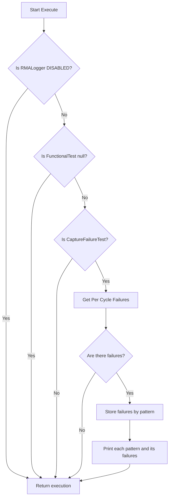

Prime Test-Method Specification REP

Revision 1.0.0

January 2025

[[_TOC_]]

## Methodology
The `SortRMALogger` class is a test method designed to log Readable Memory Address (RMA) data to ITUFF based on the specified capture mode. It allows for the enabling or disabling of RMA logging, which is crucial for debugging and analysis during testing. The class inherits from `PrimeFunctionalTestMethod` and implements the `IFunctionalExtensions` interface, providing additional functionality to process failure data. The core logic within the `Execute()` method checks the capture mode and, if enabled, retrieves failure data from the functional test, organizes it by pattern, and writes the results to ITUFF.

Notes: The `CustomVerify()` method ensures that the `RMATupleMapping` parameter is specified before execution, throwing an `ArgumentException` if it is not. The `PatternToTuple()` method is utilized to map the pattern names to their respective tuples based on the provided mapping.

## Test Instance Parameters

| **Parameter Name**      | **Required?** | **Type**          | **Values**                     | **Comments**                                                                 |
|-------------------------|----------------|-------------------|-------------------------------|------------------------------------------------------------------------------|
| RMALogger               | No             | RMALoggerMode     | ENABLED, DISABLED             | Gets or sets RMA Logger capture mode. If DISABLED (default), no RMA data will be printed to the ITUFF. |
| RMATupleMapping         | No             | CommaSeparatedInteger |      1,2,3,4,5,6,7       | Gets or sets the mapping for extracting a pattern's tuple.                 |

## Exit Ports

The `SortRMALogger` test method supports the following exit ports:

| **Exit Port**          | **Condition**         | **Description**              |
|------------------------|-----------------------|------------------------------|
| **-2**                 | ***Alarm***           | Any alarm condition          |
| **-1**                 | ***Error***           | Any software condition error |
| **1**                  | **Pass**              | PASS PORT                    |
| **0**                  | **Fail**              | FAIL PORT                    |

## Algorithm Flow

## Errors Conditions
The `SortRMALogger` class may throw the following exceptions:

- **ArgumentException**: "Please specify a valid RMATupleMapping param." This occurs in the `CustomVerify()` method if `RMATupleMapping` is an empty string.
- If the `Execute()` method encounters a failure in the functional test, it will not throw an exception but will return the execution number as the Exit Port. The returned number will be the Exit Port value, which can be either 1 (Pass) or 0 (Fail) depending on the execution outcome.
