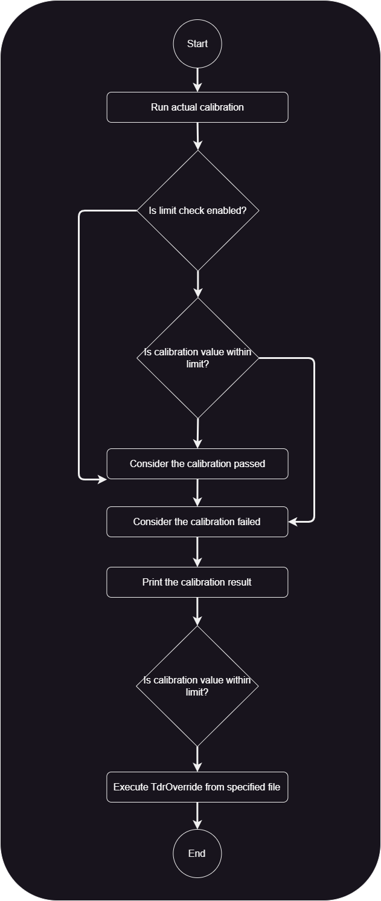

Prime Test-Method Specification REP

March 2023

[[_TOC_]]

# Methodology
The test method will do TIU Time-Domain Reflectometry (TDR) Calibration and store it into a calibration file. The test method can be set to either perform calibration every time it runs or to only calibrate the TIU if it hasn't been calibrated before, bypassing the calibration step if the TIU is already calibrated. The test method can also be configured to check the calibrated value falls within specified limit and will exit through port 0 if it fails the limit check. The calibration file is generated and saved into "D:\Calibration" path by default, but the destination folder can be overwritten through UserVar "RunTimeLibraryVars.iCGL_XiuCalPath". Effectively, the file path by default is formatted as "D:\Calibration\TDRFile_[\<*TIUName*\>]_[\<*PinGroup*\>].txt"

This methodology does not support offline execution, as such the test method will always bypass the execution and exit to port 1 when it detects that the instance is running on an offline tester.

# Test Instance Parameters

| **Parameter Name** | **Required?** | **Type** | **Values** | **Comments** |
|--------------------| ------------- | -------- | ---------- | ------------ |
| TdrHiLimit | No | String | A string representing a double value with unit that serves as upper limit of the calibrated value. (e.g. "10mS") | If this value is defined, `TdrLoLimit` must be defined. If this value is not defined, calibrated value will not be checked against the limit. |
| TdrLoLimit | No | String | A string representing a double value with unit that serves as lower limit of the calibrated value. (e.g. "3mS") | If this value is defined, `TdrHiLimit` must be defined. If this value is not defined, calibrated value will not be checked against the limit. |
| AlwaysExecute | No | String (Choice) | TRUE <br> FALSE | Determines whether to calibrate the TIU regardless of its current calibration status. Default value is set to "TRUE". When set to "TRUE", this parameter ensures that the calibration is always carried out. If set to "FALSE", the process may be skipped under certain conditions. |
| PinGroups | Yes | String | Comma separated list of pingroups to be calibrated. | Take note that if `TdrHiLimit` and `TdrLoLimit` are defined, they are applied to all of the pingroups in this list. This parameter does not involves itself in TdrOverrides operation. |
| IgnoredPins | No | String | Comma separated list of pins to be ignored during calibration process. | If there are pins that will be overridden by the file specified by `TdrOverrides`, these should be added to the ignored list as they might intefere with the calibration process. This parameter does not involves itself in TdrOverrides operation. |
| LoadDataFromFile   | No | String (Choice) | "TRUE" or "FALSE" | Determines whether to load previous data from calibration file or perform a new calibration. Default value is set to "FALSE". More information on calibration files can be found in the [Methodology section](#methodology). This parameter does not involves itself in TdrOverrides operation. |
| TdrOverrides | No | String | This parameter supports three options for TDR calibration overrides:<br> -  `pingroup` to apply these values to<br> - `file` to load these values from<br> - `ignoredpins` to exclude from override process | Provides a way to manually override TDR calibration values. By specifying a valid file path for TdrOverrides, you can provide custom calibration values for specific pin groups or pins during the TDR calibration process. These overrides will be used instead of the default calibration values. <br>Example: --pingroup=SomePinGroup --file=file.txt --ignoredpins=IgnoreThisPin |
| CustomFileName | No | String | The custom file name to use. | This will be used with each pin group name for the final file name=[TDRFile\_\<*CustomFileName*\>\_\<*pinGroup*\>]. If it's empty, the default file name=[TDRFile\_\<*effectiveTiuName*\>\_\<*pinGroup*\>] will be used. |
| ExecutionMode | No | String (choice) | Synchronous <br> KickOff <br> Catch | Determines if TDR calibration should occur synchronously with the init flow or be run as a background process during the init flow. Default value is set to "Synchronous". |

## ExecutionMode: Ability to run TDR calibration concurrently with init flow
`ExecutionMode` provides the ability to run the TDR calibration in a background thread while init flow continues with its regular execution. This execution mode accepts three values:

- **Synchronous:** Default mode of execution. Init flow will continue with its regular execution after TIU has been calibrated.
- **KickOff:** Concurrent TDR calibration. A KickOff instance must be added at the beginning of the init flow to start the calibration process.
- **Catch:** Concurrent TDR calibration. A Catch instance must be added at the end of the init flow to conclude the calibration process.

**<span style="color:Tomato ">NOTE:</span>** Every KickOff calibration must be paired with a Catch calibration. Please ensure your TP has a 1:1 relation.

## TdrOverrides: Overriding the calibration values with files.
TdrOverrides is designed to load previously generated TDR values that are known to work effectively. This parameter takes 3 options.

| **Option Name** | **Required?** | **Comments** |
| ----------------|----------------|----------- |
| --file | Yes | Use this option to specify the file to load the override values. |
| --pingroup | Yes | Use this option to specify the pingroup to load value into. This can be the same pingroup defined as the test method parameter or a different one. Be mindful that if it is the same then the calibrated value will get overridden with the one in the file. Pin group should be formatted as a comma separated list of values. (e.g. "all_VLC_1600ohm, all_VLC_160ohm") |
| --ignoredpins | No | Use this option to specify the list of pins to ignore when loading the value from the file. Do not ignore pins that you want to override. You probably want to ignore the pins that have been calibrated if the pingroup defined in the `tdrOverrides` is the same as the one in the test method parameter. Ignored pins should be formatted as a comma separated list of values. (e.g. "HDDPS_VLC_1600ohm1, HDDPS_VLC_160ohm2") |

**Example 1:**
```
TdrOverrides = "--file=file.txt --pingroup=SomePinGroup --ignoredPins=PinsToIgnore"
```

After normal calibration is performed based on the other test method parameters, the test method will load the calibration values for "SomePinGroup" from "file.txt", except for "PinsToIgnore".
This file is actually the same file as the TDR file generated by TOS when normal calibration is done. The file should contain the pins and the calibrated TDR value. If somehow there are pins that are part of the specified pingroup but not does not exists in the file, the TDR value for the pin will not be loaded into the hardware.

Given the OTPL below:
``` Perl
Test PrimeTdrCalibrationTestMethod PrimeTdrCalibrationTestMethod_OnePinGroup_P1
{
	AlwaysExecute = "FALSE";
	PinGroups = "PinGroupForNormalCalibration";
	TdrOverrides = "--file=TdrFile.txt --pingroup=PinGroupToOverride"
}
```

If the *PinGroupForNormalCalibration* has 3 pins:
```
P001
P002
P003
```

While *PinGroupToOverride* has 2 pins:
```
P004
P005
```

The file *TdrFile.txt* should contain TDR values for P004 and P005. If the file missed P004, only P005 will be loaded into the hardware and P004 will remain uncalibrated.

**Example 2:**
``` Perl
Test PrimeTdrCalibrationTestMethod PrimeTdrCalibrationTestMethod_OnePinGroup_P1
{
	AlwaysExecute = "FALSE";
	PinGroups = "PinGroupForCalibration";
	IgnoredPins = "P003";
	TdrOverrides = "--file=TdrFile.txt --pingroup=PinGroupForCalibration"
}
```

If *PinGroupForCalibration* contains 3 pins:
```
P001
P002
P003
```

The *TdrFile.txt* should contain TDR values for *P003* as this is the one being listed as part of the IgnoredPins.
The normal calibration will ignore P003 and it will remain uncalibrated. The override procedure will load the value for P003.

# OTPL Sample:

``` Perl
# Always Calibrate single Pingroup with one single pin ignored, check if the value is out of limit.
Test PrimeTdrCalibrationTestMethod PrimeTdrCalibrationTestMethod_OnePinGroup_P1
{
	TdrHiLimit = "0.5";
	TdrLoLimit = "0.1";
	AlwaysExecute = "TRUE";
	PinGroups = "all_VLC_1600ohm";
	IgnoredPins = "HDDPS_VLC_1600ohm1";
}
```

``` Perl
# Only calibrate single Pingroup with one single pin ignored if the TIU has not been calibrated before.
Test PrimeTdrCalibrationTestMethod PrimeTdrCalibrationTestMethod_OnePinGroup_P1
{
	AlwaysExecute = "FALSE";
	PinGroups = "all_VLC_1600ohm";
	IgnoredPins = "HDDPS_VLC_1600ohm1";
}
```

``` Perl
# Only calibrate single Pingroup with one single pin ignored if the TIU has not been calibrated before, override with value from file.
Test PrimeTdrCalibrationTestMethod PrimeTdrCalibrationTestMethod_OnePinGroup_P1
{
	AlwaysExecute = "FALSE";
	PinGroups = "all_VLC_1600ohm";
	IgnoredPins = "HDDPS_VLC_1600ohm1";
	TdrOverrides = "--file=TdrFile.txt --pingroup=PinGroupToOverride"
}
```

``` Perl
# Kicks off concurrent tdr calibration for single Pingroup with one single pin ignored.
Test PrimeTdrCalibrationTestMethod PrimeTdrCalibrationTestMethod_OnePinGroup_P1
{
	ExecutionMode = "Kickoff";
	PinGroups = "all_VLC_1600ohm";
	IgnoredPins = "HDDPS_VLC_1600ohm1";
}
```

``` Perl
# Catches concurrent tdr calibration for single Pingroup with one single pin ignored.
Test PrimeTdrCalibrationTestMethod PrimeTdrCalibrationTestMethod_OnePinGroup_P1
{
	ExecutionMode = "Catch";
	PinGroups = "all_VLC_1600ohm";
	IgnoredPins = "HDDPS_VLC_1600ohm1";
}
```

# Execution Details


1. The test method will always run normal calibration first. The calibration is done based on the parameter _TdrHiLimit, TdrLoLimit, AlwaysExecute, PinGroups, IgnoredPins, and LoadDataFromFile_.
2. In this stage, it is best to ignore the pins that are going to be overidden. These pins are overridden for a reason, they might intefere with the normal calibration process if not ignored.
3. Once the calibration is done (not using TDR calibration file/ LoadDataFromFile = FALSE), TOS will generate the TDR calibration file. The calibration file will only contain pins that undergoes normal calibration and not ignored. It will not contain the pins or value that has been overridden as override hasn't occur at this point.
4. If the calibrtion was done by loading from file (LoadDataFromFile = TRUE), there will be no new TDR calibration file generated by TOS.
5. The test method will print the calibration results. This calbration result will only contain pins that undergoes normal calibration and not ignored. It will not contain the pins or values that have been overidden as override hasn't occur at this point.
6. The test method will load the TDR values from the specified file in TdrOverrides option _--file_. Any values that comes from this file will never be saved into the calibration file or result printout.

# Exit Ports

The CallbacksRegistrar test method supports the following exit ports:

| **Exit Port** | **Condition** | **Description**                               |
| ------------- | ------------- | --------------------------------------------- |
| **-2**        | ***Alarm***   | Any alarm condition                           |
| **-1**        | ***Error***   | Any software condition error                  |
| **0**         | ***Fail***    | Any failing condition; e.g Failed limit check |
| **1**         | ***Pass***    | Passing condition                             |

# Version tracking
| **Date**          | **Version** | **Author**        | **Comments**                       |
| ----------------- | ----------- | ----------------- | ---------------------------------- |
| October 29, 2021  | 7.0.0       | Yusof, Adam Malik | Initial doc                        |
| November 24, 2022 | 12.0.0      | Yusof, Adam Malik | Offline Tester Handling            |
| March 8, 2023     | 12.0.1      | Humberto Ramirez  | Add support to overrride pins      |
| June 19, 2023     | 12.1.0      | Yusof, Adam Malik | More information on Tdr Override   |
| Agust 7, 2024     | 13.1.0      | Maria Hernandez   | Include concurrent Tdr calibration |
