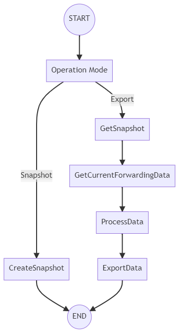

**prime Test-Method Specification REP**

Apr 2021

[[_TOC_]]

# Introduction

The Test Method provides capabilities to Export data from the VminForwarding Service results. It has a "service-wide" domain data access within all domains, instances and corners. It provides processing mechanisms like Interpolation and exporting capabilities such as UPS passing flow token export.

# Dependencies

- VminForwarding Service configuration file should be already loaded prior the execution.
- Since the Test Method is for Export values from VminForwarding corner's data, a Test Method with execution of Store methods at the VminForwarding Service should exist prior the execution.

# Methodology
The Test Method enables an extensible way of extract, transform and publish data from the results of the VminForwarding Service to Ituff tokens, with the results of each domain, frequency and minimum voltage operation value, as configured by the user. All the processes behind the transformation is outside the service boundaries allowing the user to extend the basic functionality or adding new data transformations.

Step 1: Get and save the data via a data "snapshot" from the VminForwarding Service's "IVminForwardingExportHandler.GetProcessedCornersData" method call. This is the current "search" phase data.

Step 2: Get updated data, after the re-test of pivot corners, via a new "snapshot" (at "check" phase).

Step 3: Apply a transformation, processing the data with the base snapshot data and the new "updated" data from the check phase.

Step 4: With the output of the processing, generate an output in order to export the results.

# Execution flow

<u>Flow chart for main Execute</u>:

# Test instance parameters

The table below lists and describes the test instance parameters supported by the VminSearch test method

<table>
<thead>
<tr class="header">
<th><strong>Parameter Name</strong></th>
<th><strong>Type</strong></th>
<th><strong>Description</strong></th>
<th><strong>Comments</strong></th>
<th><strong>Default value</strong></th>
</tr>
</thead>
<tbody>
<tr class="odd">
<td>OperationMode</td>
<td>OperationMode</td>
<td>Execution operation mode.</td>
<td><b>Snapshot</b>: saves the current state of the VminForwarding data. <b>Export</b>: execute an export process with the data of a previous snapshot value and the current data of the VminForwarding.</td>
<td>Is always required to set</td>
</tr>
<tr class="even">
<td>SnapshotKey</td>
<td>String</td>
<td>The shared storage key to save or extract the VminForwarding Service snapshot data.</td>
<td>Several instances with different SnapshotKey values can be executed and saved.</td>
<td>Is always required to set</td>
</tr>
<tr class="odd">
<td>PreProcessMode</td>
<td>PreProcessMode</td>
<td>Preprocessing mode to transform the data prior to the Export.</td>
<td><b>None</b>: no data transformation. <b>Interpolation</b>: Interpolator mechanism, explained below in detail.  <b>InterpolationWithForwardingUpdate</b>: Same Interpolator mechanism, but updating the VminForwarding corner's data with the results.</td>
<td>PreProcessMode.None</td>
</tr>
<tr class="even">
<td>ExportType</td>
<td>ExportType</td>
<td>The export operation type.</td>
<td><b>SharedStorageUPSTokens</b>: passing flow to UPS tokens at shared storage variables.</td>
<td>ExportType.SharedStorageUPSTokens</td>
</tr>
<tr class="odd">
<td>ExportKeys</td>
<td>CommaSeparatedString</td>
<td>Shared Storage's string table keys to save the Exporting results.</td>
<td>The quantity of keys depends on the ExportType implementation.</td>
<td>String.Empty</td>
</tr>
<tr class="even">
<td>MaxFlowNumber</td>
<td>Integer</td>
<td>Maximum expected flow number.</td>
<td>Used mostly for export validation purposes.</td>
<td>1</td>
</tr>
<tr class="odd">
<td>PreProcessInput</td>
<td>String</td>
<td>Configuration string for the preprocessing mechanism. The value depends on the PreProcessMode implementation.</td>
<td>An implementation of the preprocessing algorithm may require some extra configuration token/values.</td>
<td>String.Empty</td>
</tr>
<tr class="odd">
<td>InterpolatorSettingsFlags</td>
<td>String</td>
<td>A comma-separated string of flags for configuration, that if listed are parsed as boolean flags. Available values: ForwardingUpdate, AdjustToLowerPivotVoltage, SaveTokenValuesBeforeInterpolator</td>
<td><b>ForwardingUpdate</b>: updates the VminForwarding corner's data with the results.  <b>AdjustToLowerPivotVoltage</b>: adjust the corner's voltage value to interpolate in case the interpolation calculation brings a lower value than the first pivot (with a lower frequency). If that condition is met, the value of the first pivot is used in the interpolated corner, ensuring a correct voltage curve starting from the first pivot.  <b>SaveTokenValuesBeforeInterpolator</b>: enables to save the UPS export tokens for frequency name and value before the Interpolator processing.
 The format of the token will be the same as the existent frequency name and value tokens.
 The key names used are the same as defined in the current parameter "ExportKeys" with a suffix:
 <ul>
<li>For frequency value token: "_beforeInterpolator_freqValue"</li>
<li>For frequency name token : "_beforeInterpolator_freqId"</li>
</ul>
If die notation was used in the VminForwardingConfiguration file, then a '_' and the dieId must be added to the suffix:
 <ul>
<li>For frequency value token: "_beforeInterpolator_freqValue_U1.U2"</li>
<li>For frequency name token : "_beforeInterpolator_freqId_U1.U2"</li>
</ul>
</td>
<td>String.Empty</td>
</tr>
<tr class="odd">
<td>IncludeDisabledCornerAtExport </td>
<td>Boolean </td>
<td>A value indicating whether the Export procedure should check if the corner was disabled in one point.</td>
<td>If True(1) and the corner was disabled at one point in the voltage history, the Disabled value is Exported instead.</td>
<td>Boolean.FALSE</td>
</tr>
<tr class="odd">
<td> FrequencyPrintMultiplier </td>
<td> Double </td>
<td>Multiplier to be applied to the frequency values printed into the export token with frequency values..</td>
<td>Example: If frequency is 3200Hz multiplier should be 0.001 if the frequency is needed in KHz. So the token will print 3.2</td>
<td>1.0</td>
</tr>
<tr class="odd">
<td>AddAllFlowExpansion</td>
<td>Boolean </td>
<td>A value indicating whether the export token with frequency ids will save all flows from 1 to the MaxFlowNumber</td>
<td>If True(1) the token will save all flows information. If maximum flow is greater than passing flow the test method will fill out the table and save also that flows.</td>
<td>Boolean.FALSE</td>
</tr>
<tr class="odd">
<td>ExportDataLog</td>
<td>Boolean </td>
<td>A value indicating whether the search and check values will be export the same as the interpolation results.</td>
<td>For SharedStorageUPSTokens type the export tokens will be: <b>exportkey1_baseData_freqValue</b> and <b>exportkey1_currentData_freqValue</b> for the frequency Value tokens and <b>exportkey2_baseData_freqId</b> and <b>exportkey2_currentData_freqId</b> for the frequency Id tokens
</td>
<td>Boolean.FALSE</td>
</tr>
<tr class="odd">
<td>AllowBypassCorners</td>
<td>Boolean </td>
<td>All corners from all domains set in the VminForwarding Service configuration file are expected to be tested and the Test Method enforces the validation by default. This parameter indicates whether bypassed (non-tested) corners will be printed with a value of -9.999 instead of throwing an exception</td>
<td>A False (default) value throws an exception if a corner was non-tested / bypassed. If True a value of -9.999 will be printed for the non-tested / bypassed corners.</td>
<td>Boolean.FALSE</td>
</tr>
<tr class="odd">
<td>PrintOnlyPassingFlowAtFrequencyNameToken</td>
<td>Boolean </td>
<td>A value indicating whether the Export token for all flows with frequency name includes only the passing flow onwards data, leaving the lower failed flows with empty data, but with the flow separator.</td>
<td>A False (default) value prints all the flows of the table. If True only the passing flow until the maximum flow indicated will be printed.</td>
<td>Boolean.FALSE</td>
</tr>
</table>

The table below lists the parameter required depending on each operation mode.

| **Operation Mode** | **Required Parameters** |
|--|--|
| _Snapshot_ | SnapshotKey   PreProcessMode |
| _Export_ | SnapshotKey   PreProcessMode   PreProcessInput   ExportType    ExportKeys   MaxFlowNumber |

# Process modes
A transformation of data can be applied before exporting the values. This is done by a PreProcess implementation.

## Empty
No transformation to the data. The same "current" data is returned as the result.

## Interpolator
Applies an adjustment to corners values, based in voltage changes on retested "Pivot" corners. The execution occurs per domain/instance individually.

### Parameters
- **SnapshotKey**: key to get a previous snapshot at "Search" step.
- **InterpolatorSettingsFlags** (optional): flags to enable interpolator settings. 
- **PreProcessInput**: contains the Interpolator map, defining the Pivot-pair corners and the Linked corners. The values must be specified starting with the corners referenced by the lower pivots, continuing to the highest ones. (i.e. first define the corners affected by F1-F5, next the ones affected by F5-F8). The expected format is: [Domain]:[TargetCorner]@[FirstPivot]-[SecondPivot],[TargetCorner2]@[FirstPivot]-[SecondPivot];[Domain2]:....
  - **Example** :  IA:F2@F1-F4,F3@F1-F4|DDR:F2@F1-F3
  - **Tokens**:
  
  | **Name**                     | **Token** |
  |------------------------------|-----------|
  | Domain definition start      | : |
  | Pivots definition start     | @ |
  | Pivots information separator | - |
  | Corner information separator | , |
  | Domain Separator             | \| |

### Methodology
   The Interpolator methodology follows a Test Program methodology in testing vmin values. It requires the use of VminForwardingService corner's data at two points:
   - The first point is the Base data, acquired by a Snapshot just before the end of the **Search** phase, where all the corners are tested.
   - This second point with updated data, is taken before a second test phase but only with some 'pivot' corners, named the **Check** phase. 
   - If one pivot have a disabled value (at search or check phase) the referenced corner is also automatically disabled.

### Requirements
1. Search data: All corners tested in different voltages/flows/frequencies (also disabled). This is the "Base Snapshot".
2. Check data: only selected 'pivot' corners retested. The pivot corners may be updated to new voltages/flows/frequencies (also disabled). This is the "Current Values Snapshot".
3. Transform: defining a Interpolator map, links the pivot corners to the referenced corners.

| **Linked** | **Pivot #1** | **Pivot #2** |
| ------------- | ------------- | ----------
| **IA@F2** | **IA@F1**  |  **IA@F3**  |
| **IA@F4** | **IA@F3**  |  **IA@F6**  |
| **IA@F5** | **IA@F3**  |  **IA@F6**  |

- Check if any Pivot corner have a disabled value at search or check phase. This scenario disables automatically the Linked corner.
- Check if any Pivot corner changed from the Base snapshot (Search) to the Current snapshot data (Check). If there's a change, the linked corners must be updated using a linear calculation based in the voltage different between the two values for each Pivot. The resulted interpolated value is **added** to the **current** linked corner's voltage, using the formula:

$y=y_{1} + (x - x_{1}) \frac{(y_{2}-y_{1})}{(x_{2}-x_{1})}$

Where:
- $y$ = result voltage$\Delta$ to add to current linked corner's voltage.
- $y_{1}$ = voltage$\Delta$ for pivot corner 1.
- $y_{2}$ = voltage$\Delta$ for pivot corner 2.
- $x$ = current corner's frequency to interpolate to.
- $x_{1}$ = frequency at pivot corner 1.
- $x_{2}$ = frequency at pivot corner 2.

### Usage Flow
1. Execute the **Search** and store the values at the VminForwarding Service.
2. Execute a VminForwadingExport instance with OperationMode = "Snapshot": this saves the current VminForwarding base data.
3. Execute the Search again buy only for the pivot corners (**Check**).
4. Execute a VminForwadingExport instance with OperationMode = "Export" and PreProcessMode = "Interpolation": this will take another "Snapshot" VminForwarding data but with the updated values.
5. The Interpolation algorithm is executed and results exported.

## Interpolator with Forwarding value update
Same as the Interpolator implementation, but the updated corners are also updated back to the VminForwarding Service storage.

# Export modes
 Allows to export the resulting data from the Process step.

## UPS Passing flow token
 Exports the passing flow (the maximum flow registered for each domain) to a fixed string token. Two tokens are generated and saved into a Shared Storage's string variable, with the keys taken from the **ExportKeys** parameter. If die notation was used in the VminForwardingConfiguration file, the an UPS token per dieId will be saved to the SharedStorage. To access this per die tokens, the user must consult the SharedStorage by using the provided Export keys with an '_' and the dieId as a sufix (all dots '.' in the die name must be changed for the letter 'P'), for example if the provided keys are "Key1" and "Key2", to look for the UPS token with the data for the die U1.U2, the user must access the SharedStorage with the keys "Key1_U1PU2" and "Key2_U1PU2". 
The tokens are ordered descending by frequency (from higher to lower value).

### Parameters
- **ExportKeys**: shared storage's string keys to export the tokens.

### Steps
1. Check and calculate the passing flow on each power domain: per domain the maximum flow is checked an saved.
2. Adjust all corner to the same passing flow: 

   - If the corner's last flow is different from the domain passing flow. This is done for each instance:
      - Call the VminForwardingService's GetVoltagesForFrequencyChange to obtain a voltage for the flow via Linear Calculation   between the Current corner's data, the corner's FrequencyChangeSource and the corner's frequency for the flow.
      - Update the voltage value with the obtained.
   - All the corners in all instances will be updated at the passing flow of their domain.

3. Export the UPS token:
  Once all the domain's instances are "flattened" to the same passing flow, the data export occurs.

   - Main format: DOMAIN1:frequency3^voltage3%frequency2^voltage2%frequency1^voltage1=DOMAIN2:...

   - Format of token \#1: includes the frequency value and exported to the first key of the ExportKeys parameter.

     **IA:3100^1.100%1900^0.917%1400^0.811%1000^0.510%850^0.428%800^0.400**

   - Format of token \#2: includes the corner's frequency name and exported to the second key of the ExportKeys parameter.

     **IA:F6^1.100%F5^0.917%F4^0.811%F3^0.510%F2^0.428%F1^0.400**

# Test Method Execution Examples
  Using Interpolator and UPS Passing flow token export on the IA domain. Example for one instance with the next Pivot configuration:

| **Linked** | **Pivot #1** | **Pivot #2** |
| ------------- | ------------- | ----------
| **IA@F2** | **IA@F1**  |  **IA@F3**  |
| **IA@F4** | **IA@F3**  |  **IA@F6**  |
| **IA@F5** | **IA@F3**  |  **IA@F6**  |

1. Search and Check with 1 flow.

<table>
<tr>
<th>1. Search</th><th>2. Check (pivots F3/F6 updated)</th>
</tr>
<tr>
<td>

| Flow | F1 | F2 | F3 | F4 | F5 | F6 |
|--|--|--|--|--|--|--|
|1|0.4@800|0.51@1000|0.7@1200|0.85@1500|0.92@2000|1.1@3200|

</td>
<td>

| Flow | F1 | F2 | F3 | F4 | F5 | F6 |
|--|--|--|--|--|--|--|
|1|0.4@800|0.51@1000|**0.73**@1200|0.85@1500|0.92@2000|**1.13**@3200|

</td>
</tr>
<tr>
<th>4. Interpolator (F4,F5 updated)</th><th>4. Export (Flow 1)</th>
</tr>
<tr>
<td>

| Flow | F1 | F2 | F3 | F4 | F5 | F6 |
|--|--|--|--|--|--|--|
|1|0.4@800|0.51@1000|0.73@1200|**0.906**@1500|**1.018**@2000|1.13@3200|

</td>
<td>

| Flow | F1 | F2 | F3 | F4 | F5 | F6 |
|--|--|--|--|--|--|--|
|**1**|**0.4@800**|**0.51@1000**|**0.73@1200**|**0.906@1500**|**1.018@2000**|**1.13@3200**|

</td>
</tr>
</table>

2. Search and Check with 2 flows.

<table>
<tr>
<th>1. Search</th><th>2. Check (pivot F6 updated)</th>
</tr>
<tr>
<td>

| Flow | F1 | F2 | F3 | F4 | F5 | F6 |
|--|--|--|--|--|--|--|
|1|0.4@800|0.51@1000|0.7@1200|0.85@1500|-9.999@2000|-9.999@3200|
|2|?@800|?@850|?@1000|?@1400|0.88@1900|1.0@3100|

</td>
<td>

| Flow | F1 | F2 | F3 | F4 | F5 | F6 |
|--|--|--|--|--|--|--|
|1|0.4@800|0.51@1000|0.7@1200|0.85@1500|-9.999@2000|-9.999@3200|
|2|?@800|?@850|?@1000|?@1400|0.88@1900|**1.1**@3100|

</td>
</tr>
<tr>
<th>4. Interpolator (F4,F5 updated)</th><th>4. Export (Flow 2)</th>
</tr>
<tr>
<td>

| Flow | F1 | F2 | F3 | F4 | F5 | F6 |
|--|--|--|--|--|--|--|
|1|0.4@800|0.51@1000|0.7@1200|**0.866**@1500|-9.999@2000|-9.999@3200|
|2|?@800|?@850|?@1000|?@1400|**0.917**@1900|1.1@3100|

</td>
<td>

| Flow | F1 | F2 | F3 | F4 | F5 | F6 |
|--|--|--|--|--|--|--|
|1|0.4@800|0.51@1000|0.7@1200|0.866@1500|-9.999@2000|-9.999@3200|
|**2**|**0.4@800**|**0.428@850**|**0.51@1000**|**0.811@1400**|**0.917@1900**|**1.1@3100**|

</td>
</tr>
</table>

3. Search and Check with 2 flows and resolving missing values from sources.

<table>
<tr>
<th>1. Search</th><th>2. Check (pivots F3/F6 updated)</th>
</tr>
<tr>
<td>

| Flow | F1 | F2 | F3 | F4 | F5 | F6 |
|--|--|--|--|--|--|--|
|1|**0.4@800**|**0.51@1000**|**0.7@1200**|**0.85@1500**|**0.92@2000**|-9.999@3200|
|2|?@800|?@850|?@1100|?@1400|?@1900|**0.9@3100**|

</td>
<td>

| Flow | F1 | F2 | F3 | F4 | F5 | F6 |
|--|--|--|--|--|--|--|
|1|0.4@800|0.51@1000|0.7@1200|0.85@1500|0.92@2000||
|2|?@800|?@850|**0.71**@1100|?@1400|?@1900|**1.0**@3100|

</td>
</tr>
<tr>
<th>4. Interpolator (F2/F4/F5 updated)</th><th>4. Export (Flow 2)</th>
</tr>
<tr>
<td>

| Flow | F1 | F2 | F3 | F4 | F5 | F6 |
|--|--|--|--|--|--|--|
|1|0.4@800|**0.583**@1000|0.7@1200|**0.958**@1500|**1.025**@2000||
|2|?@800|?@850|0.71@1100|?@1400|?@1900|1.0@3100|

</td>
<td>

| Flow | F1 | F2 | F3 | F4 | F5 | F6 |
|--|--|--|--|--|--|--|
|1|0.4@800|0.583@1000|0.7@1200|0.958@1500|1.025@2000||
|**2**|**0.4@800**|**0.446@850**|**0.71@1100**|**0.896@1400**|**1.012@1900**|**1.0@3100**|

</td>
</tr>
</table>

**_Note for Export to Flow 2_** : since a flow change is need, the corner's source for frequency change from the VminForwarding Service is used to execute the Linear Calculation for the corner's frequency. For this examples the next configuration is used: 

| **Corner** | **Frequency Change source reference** |
|--|--|
| F6 | F5 |
| F5 | F4 |
| F4 | F3 |
| F3 | F2 |
| F2 | F1 |
| F1 | F2 |

# Exit ports

The VminForwardingExport test method supports the following exit ports:

| **Exit Port** | **Condition** | **Description**                                                                    |
| ------------- | ------------- | ---------------------------------------------------------------------------------- |
| **0**        | ***Error***   | Any software condition error                                                      
| **1**         | ***Pass***    | Passing condition. |