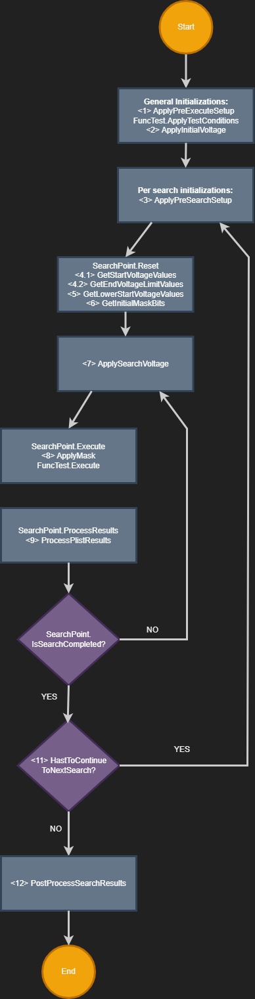
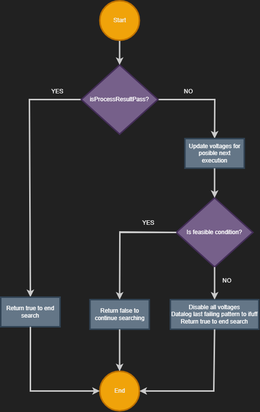
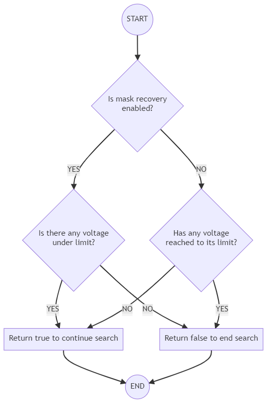
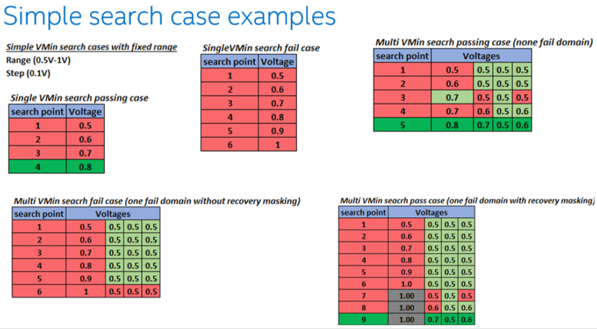

**prime Test-Method Specification REP**

Aug 2020

[[_TOC_]]

# Introduction

The main purpose of this Test Method is to characterize operational voltages of a DUT ‘Device under testing’, executing one content (i.e. plist ‘pattern list’) under specific conditions (e.g. frequency, masking, etc.).

Such characterization is done through a search methodology to find the minimum voltage settings necessary to pass executed content at conditions under testing.

The only base Vmin search algorithm implemented for this Test Method is a linear one, from fail to pass voltage conditions (either from low to high or from high to low voltage values). The Test method can be extended to enable specific additional features, for example, to complement the same algorithm to support a ‘Multi-Vmin’ parallel search.

# Methodology

VminSearch Test Method provides the capability to find Vmin (minimum operational voltages) values for the corresponding content (pattern list) and test conditions under testing. The base implementation provides the capability to repeat the complete search flow multiple times. The basic algorithm is shown in the following flow charts:

<u>Flow chart for main Execute</u>:



Notes:

  - **"Reset point test object"** takes care of the following initializations for conditions of the search:

    - Reset plist functional object
    - Get dynamic start voltage values (direct voltage, from storage or from user extension)
       - If repeated targets are specified, the voltage values are linked using the highest voltage among all. Even if a target is disabled, the other repeated/linked targets can continue the execution to its defined limit.
    - Get dynamic end voltage limits (direct voltage, from storage or from user extension)
    - Set default port to 0 
    - Set search point executions count to 0
    - Get initial mask value (default to all targets enabled, or from user extension). If a voltage target position gets masked here its corresponding voltage is set to -8888

<!-- end list -->

  - **"Apply voltages"** is provided as an extension. There is a default implementation either for DPS or FIVR modes, but the user can override it if this default doesn’t work due to product-specific requirements and need to have their own implementation.

  - **"Execute point test"** takes care of plist execution, and provide an extension (called before plist execution) to effectively apply the current tracked mask value (sending its current value and the functional object required for the user code to implement it according to content and
    product requirements)
  - **" Process results"** calls to user code extension provided to implement decoding of plist results to a bit array, indicating which target indexes failed in previous execution (sending the functional object which can be used to extract raw results to be decoded according to content and product requirements). The default behavior, if there is no implemented extension, is setting the decode result bit array as fail in all indexes.

<u>Flow chart for decide if search is completed and update voltages for next point</u>:



Notes:

In the action **"Update voltages for possible next execution"** the following considerations are taken:

  - Already disabled voltages (-9999 or -8888) are not modified.
  - Step size is added to all enabled voltages indexes that are set as fail in bit array set during **" Process results"** action.
  - If, after adding the step size to an enabled voltage, the new value is higher than the corresponding end limit, the tracking mask value gets updated for the corresponding index, and the voltage is set to -9999
  - If repeated targets are specified, the voltage values are linked using the highest voltage among all. Even if a target is disabled, the other repeated/linked targets can continue the execution to its defined limit.

<u>Flow chart to decide if another search point is feasible</u>:



Vmin search examples shown in the following image follows described methodology:



# Test Instance Parameters

The table below lists and describes the test instance parameters supported by the VminSearch test method

<table>
<thead>
<tr class="header">
<th><strong>Parameter Name</strong></th>
<th><strong>Required?</strong></th>
<th><strong>Type</strong></th>
<th><strong>Description</strong></th>
<th><strong>Comments</strong></th>
</tr>
</thead>
<tbody>
<tr class="odd">
<td>Patlist</td>
<td>Yes</td>
<td>Plist</td>
<td>Plist name to be executed</td>
<td></td>
</tr>
<tr class="even">
<td>LevelsTc</td>
<td>Yes</td>
<td>LevelsCondition</td>
<td>Levels test condition required for plist execution</td>
<td></td>
</tr>
<tr class="odd">
<td>TimingTc</td>
<td>Yes</td>
<td>TimingCondition</td>
<td>Timing test condition required for plist execution</td>
<td></td>
</tr>
<tr class="even">
<td>PrePlist</td>
<td>No</td>
<td>String</td>
<td>PrePlist callback to plist execution</td>
</tr>
<tr class="odd">
<td>MaskPings</td>
<td>No</td>
<td>String</td>
<td>Comma separated string indicating which pins must be target for the current search if any.</td>
<td>Default value is an empty string</td>
</tr>
<tr class="even">
<td>VoltageTargets</td>
<td>Yes</td>
<td>String</td>
<td>Comma separated list of search targets, either DPS pins or FIVR domains, depending of the mode used to set the voltages to the DUT areas being targeted to characterize by the content (plist) being executed.</td>
<td>Default mode will set voltages using direct applying to a DPS pin changing its Vforce level attribute value. To switch to FIVR mode (based in pattern modify settings) the keyword <strong>fivr_mode_on</strong> must be contained as item in the list provided in parameter <strong>FeatureSwitchSettings</strong></td>
</tr>
<tr class="odd">
<td>StartVoltages</td>
<td>Yes</td>
<td>String</td>
<td>Reference to be used to define search start voltage values. Its format should be a comma separated list of either double values, or reference keys that must exist in the shared storage service as doubles. The number of items separated by comma must match the number of items separated by comma in the <strong>VoltageTargets</strong> parameter.</td>
<td><p>Extension is provided to override these values:</p>
<p>List&lt;double&gt; GetStartVoltageValues(List&lt;string&gt; startVoltageKeys)</p></td>
</tr>
<tr class="even">
<td>EndVoltageLimits</td>
<td>Yes</td>
<td>String</td>
<td>Reference to be used to define end voltage limit values (highest possible values to try by the search loop if a lower passing point has not been found). Its format should be a comma separated list of either double values, or reference keys that must exist in the shared storage service as doubles. The number of items separated by comma must match the number of items separated by comma in the <strong>VoltageTargets</strong> parameter.</td>
<td><p>Extension is provided to override these values:</p>
<p>List&lt;double&gt; GetEndVoltageLimitValues(List&lt;string&gt; endVoltageLimitKeys)</p></td>
</tr>
<tr class="odd">
<td>StartVoltagesForRetry</td>
<td>No</td>
<td>String</td>
<td>Reference to be used to define a set of lower start voltage values for overshoot capability. Its format should be a comma separated list of either double values, or reference keys that must exist in the shared storage service as doubles. The number of items separated by comma must match the number of items separated by comma in the <strong>VoltageTargets</strong> parameter</td>
</tr>
<tr class="even">
<td>StepSize</td>
<td>Yes</td>
<td>String</td>
<td>Voltage value to add to any of the voltage targets if, for any search point, the plist result reports a fail status for that target. It represents the search resolution. Same step size is used for all defined voltage targets.</td>
<td></td>
</tr>
<tr class="odd">
<td>FeatureSwitchSettings</td>
<td>No</td>
<td>String</td>
<td><p>Comma separated list of key words used to enable or disabled specific features that can be switched (ON/OFF) to change a specific behavior in the search code flow.</p>
<p>Supported switches:</p>
<p><strong>recovery_mask_off</strong> (disable recovery mask tracking in multi-Vmin search algorithm)</p>
<p><strong>start_on_first_fail_off</strong> (disable start on first fail mode for plist execution)</p>
<p><strong>fivr_mode_on</strong> (switch to set voltages using FIVR pattern modify method instead of DPS)</p>
<p><strong>print_per_target_increments</strong> (enables  the printing of the voltage increments per target under the token tname_postfix_it)</p>
<p><strong>print_scoreboard_counters</strong> (enables  the printing of the scoreboard counters for the current instance object under the token tname_postfix_scrb)</p>
<p><strong>print_result_for_all_searches</strong> (enables the printing for all individual search results. This option is mostly useful when the multi pass option is enabled or there can be more than one repetition per search)</p>
<p><strong>high_to_low_search</strong> (switch to allow perform a search from high to low voltage values)</p>
<p><strong>print_execution_info</strong> (prints execution info - failing patterns occurrences and BurstId)</p>
</td>
<td>Default parameter value is populated with dummy values (“<strong>recovery_mask_on,start_on_first_fail_on,fivr_mode_off</strong>”) just to hint the user about the available options.</td>
</tr>
<tr class="even">
<td>FivrCondition</td>
<td>No</td>
<td>String</td>
<td>A FIVR condition name used to apply all related pattern modifications before the search execute begins. It will used as input to FIVR voltage apply method all domains and corresponding values defined for given condition from a pre-loaded configuration file.</td>
<td></td>
</tr>
<tr class="odd">
<td>MultiPassMasks</td>
<td>No</td>
<td>CommaSeparatedString</td>
<td>A comma separated string containing in each of its elements the mask configuration for multi pass execution</td>
<td>The default value is an empty string. An example of this parameter would be "1100,0011". This string means that there will be two multi pass, where the elements represented by '1' will be mask (ignored) for that specific multi pass and the elements represented by '0' will be enabled for that same multi pass.</td>
</tr>
<tr class="even">
<td>BaseNumbers</td>
<td>No</td>
<td>CommaSeparatedInteger</td>
<td>A list of numbers with which all generated Scoreboard counters will be individually prefixed with.</td>
<td>Refer to <a href="#construction-of-scoreboard-counters">Construction of Scoreboard Counters</a> for more details.</td>
</tr>
<tr class="odd">
<td>ScoreboardEdgeTicks</td>
<td>No</td>
<td>Integer</td>
<td>The number of resolution ticks to step down when scoreboard mode is enabled.</td>
<td>The default value is 0, which means no Scoreboarding is performed. Any value higher than 0 turns on the Scoreboard feature, making the other Scoreboard parameters required.
Refer to <a href="#execution-voltage-and-start-pattern-selection-for-scoreboard-run">Execution voltage and start pattern selection for Scoreboard run</a> for more details.</td>
</tr>
<tr class="even">
<td>PatternNameCounterIndexes</td>
<td>No</td>
<td>String</td>
<td>A comma separated string of integers which map characters in the pattern name to produce a scoreboard counter.</td>
<td>Refer to <a href="#construction-of-scoreboard-counters">Construction of Scoreboard Counters</a> for more details.</td>
</tr>
<tr class="odd">
<td>MaxFailsNum</td>
<td>No</td>
<td>Unsigned Integer</td>
<td>The maximum number of fails that can be processed for scoreboard counters. This parameter is zero by default, if no other positive value is passed, then the maximum possible integer value will be used.</td>
<td>Refer to <a href="#maximum-number-of-processed-scoreboard-counters">Maximum number of processed scoreboard counters</a> for more details.</td>
</tr>
<tr class="even">
<td>MaxRepetitionCount</td>
<td>No</td>
<td>Unsigned Integer</td>
<td>The maximum number of repetitions that can be executed for a single search.</td>
<td>The default value is 0. If some other value is assigned, that value will determine the maximum number of repetitions including the first  execution.</td>
</tr>
</tbody>
</table>

# Test Class Members

The table below lists and describes the test class public members available for the user when extending functionality:

<table>
<thead>
<tr class="header">
<th><strong>Member Name</strong></th>
<th><strong>Type</strong></th>
<th><strong>Description</strong></th>
</tr>
</thead>
<tbody>
<tr class="odd">
<td>IVminSearchExtensions</td>
<td>TestMethodExtension</td>
<td>Provide access all VminSearch Extension methods</td>
</tr>
<tr class="even">
<td>TestMethodExtension</td>
<td>Console</td>
<td>Provide access to a Console Service instance. If PrimeLogLevel = DISABLED the reference is null. Calls to this object should be qualified by the null-conditional operator (this.Console<b>?</b>.MethodName)</td>
</tr>
<tr class="odd">
<td>BitArray</td>
<td>CurrentMultiPassMask</td>
<td>Array containing the current multi pass mask</td>
</tr>
<tr class="even">
<td>List<double></td>
<td>VoltageValues</td>
<td>The voltage values required to be applied for current search point.</td>
</tr>
<tr class="odd">
<td>BitArray</td>
<td>SearchMask</td>
<td>Array containing the mask for each target at current search point.</td>
</tr>
<tr class="even">
<td>BitArray</td>
<td>InitialSearchMask</td>
<td>Array containing the initial search mask for each target at current search</td>
</tr>
</tbody>
</table>

# Test Class Methods

The table below lists and describes the test class public methods available for the user:

<table>
<thead>
<tr class="header">
<th><strong>Method Name</strong></th>
<th><strong>Signature</strong></th>
<th><strong>Description</strong></th>
</tr>
</thead>
<tbody>
<tr class="odd">
<td>BasePostProcessSearchResults</td>
<td>public int BasePostProcessSearchResults(List<SearchResultData> searchResults)</td>
<td>Provide the default implementation of the PostProcessSearchResults</td>
</tr>
</tbody>
</table>

# Skipped Searches
Searches could be skipped under the following conditions:
- There are no enabled bits in mask.
- The start voltage is out of the search range comparing only against the end voltage limit.
- There are no valid start voltage values.

When a search is skipped, its execution count is zero.

# Datalog output

1)  First failing pattern from last execution if the search finish
    without finding a plist passing condition

        Example:

        2\_tname\_VminSearch::test\_instance\_name
        2\_category\_1
        2\_fdpmv\_10
        2\_fcpmv\_-1
        2\_fsdmv\_-1
        2\_pttrn\_domain\_name:pattern\_name:plist\_name
        2\_vcont\_1
        2\_faildata\_524339

2)  Search results and used search boundaries independently of the search result, Below are the supported formats:
                                
    Format #1: Basic (Legacy) Format
    This format provides a straightforward representation of search results, including Vmin values, start and end points, and the number of iterations.
    
        Structure:
        Vmin0_.._VminN: Voltage minimum values for each tier.
        Start0_.._StartN: Starting values for each tier.
        End0_...EndN: Ending values for each tier.
        Iterations: Number of iterations performed.

        Example:
        "0.600_0.500_-8888_0.700|0.500_0.500_0.500_0.500|0.800_0.800_0.800_0.800|5"  
 
    Format #2: Hermes Format
    The Hermes format extends the basic format by incorporating additional tier-specific Vmin values.
 
        Structure:
        VminTier0_..VminTier0N:VminTier0.._VminTier0N: Voltage minimum values for each tier, with additional tier-specific values.
        Start0_.._StartN: Starting values for each tier.
        End0_...EndN: Ending values for each tier.
        Iterations: Number of iterations performed.
 
        Example:
        "0.600_0.500_-8888_0.700:0.700_0.500_-8888_-9999|0.500_0.500_0.500_0.500|0.800_0.800_0.800_0.800|5"  
 
    Format #3: Vmin Normalizer
    The Vmin Normalizer format includes original Vmin values, forward Vmin values, and fuse Vmin values.
    
        Structure:
        OrigVmin0_.._OrigVminN: Original voltage minimum values.
        Start0_.._StartN: Starting values for each tier.
        End0_...EndN: Ending values for each tier.
        Iterations: Number of iterations performed.
        FwrVmin0_..._FwdVminN: Forward voltage minimum values.
        FuseVmin0_.._FuseVminN: Fuse voltage minimum values.
 
        Example:
        "0.600_0.500_-8888_0.700|0.500_0.500_0.500_0.500|0.800_0.800_0.800_0.800|5|0.600_0.500_-8888_0.700|0.600_0.500_-8888_0.700"  

    Format #4: Vmin Normalizer + Hermes
    This format combines the Vmin Normalizer and Hermes formats, providing a comprehensive view of the data.
 
        Structure:
        OrigVmin0_.._OrigVminN: Original voltage minimum values, with additional tier-specific values.
        Start0_.._StartN: Starting values for each tier.
        End0_...EndN: Ending values for each tier.
        Iterations: Number of iterations performed.
        FwrVmin0_..._FwdVminN: Forward voltage minimum values.
        FuseVmin0_.._FuseVminN: Fuse voltage minimum values.
 
        Example:
        "0.600_0.500_-8888_0.700:0.700_0.500_-8888_0.720|0.500_0.500_0.500_0.500|0.800_0.800_0.800_0.800|5|0.600_0.500_-8888_0.700|0.600_0.500_-8888_0.700"

Each of the items separated by a pipe "|" symbol could have a multi-voltage format (multiple voltage values which match the quantity and order defined as targets of the instance). Each voltage of the
the corresponding item is separated by an underscore "\_" symbol.

\-9999 means that the corresponding target didn’t find a passing voltage (failed all the whole search range)

\-8888 means that the corresponding target was ignored at all search points (and was expected to be masked, not failing at any search point).

Example:

2\_tname\_module\_name::test\_instance\_name
2\_strgval\_-9999\_0.700\_-8888\_0.600|0.900\_0.600\_0.500\_0.550|1.000\_1.000\_1.000\_1.000|2

Example for a skipped search:

2\_tname\_module\_name::test\_instance\_name
2\_strgval\_9999\_9999\_9999\_9999|0.550\_0.500\_1.100\_0.500|1.000\_1.000\_1.000\_1.000|0

3) Limiting patterns printing

Format: **limiting_patterns**

This information is printed when the parameter "PatternNameCounterIndexes" is not empty. In that case, the datalog method will print the string extracted for each limiting pattern name (using the configured pattern name mapping) for each corresponding target, and it will print "na" when no limiting pattern is found. For this token, the separator character for the value of each target is '^'.

Example:

    2\_tname\_module\_name::test\_instance\_name\_lp
    2\_strgval\_123^345^na^789

if "print_execution_info" is added to the "FeatureSwitchSettings" instance parameter additional lines as below are printed to ituff

    2\_tname\_module\_name::test\_instance\_name\_lp\_occurrences
    2\_strgval\_2^1^na^2
    2\_tname\_module\_name::test\_instance\_name\_lp\_burstID
    2\_strgval\_1^1^na^1

The numbers printed are 0 based indexes indicated the occurrence of the failing pattern in the burst sequence.
For example if pattern "patA" appears more than one time in the plist the occurrence number will give additional information about which exactly "patA" was failing

4) Voltage increments per target printing

Format: **per_target_increments**

This information is printed when the FeatureSwitchSettings contains the option "print_per_target_increments". This feature will add the string _\_it_ to the instance name postfix.

Example:

    2\_tname\_module\_name::test\_instance\_name\_it
    2\_strgval\_1_2_0_3

5) Scoreboard counters printing

Format: **scoreboard_counters**

This information is printed when the FeatureSwitchSettings parameter contains the option "print_scoreboard_counters". This feature will add the string _\_scrb_ to the instance name postfix.

Example:

    2\_tname\_module\_name::test\_instance\_name\_scrb
    2\_strgval\_619123\_619345

If limiting pattern occurrences printout is enbled through PrintPatternsOccurrences parameter additional lines as below are printed to ituff

    2\_tname\_module\_name::test\_instance\_name\_scrb\_occurrences
    2\_strgval\_2^1
    2\_tname\_module\_name::test\_instance\_name\_scrb\_burstID
    2\_strgval\_1^1

The numbers printed are 0 based indexes indicated the occurrence of the failing pattern in the burst sequence.
For example if pattern "patA" appears more than one time in the plist the occurrence number will give additional information about which exactly "patA" was failing


6) Print all individual searches

This information is printed when FeatureSwitchSettings parameter contains the option "print_results_for_all_searches". When enabled, all results will be printed to the ituff. 

    Example:
    2_tname_module_name::test_instance_name_M1R1
    2_strgval_0.500_0.700_-8888|0.500_0.500_0.500|1.000_1.000_1.000
    2_tname_module_name::test_instance_name_M1R2
    2_strgval_0.600_0.600_-8888|0.500_0.500_0.500|1.000_1.000_1.000
    2_tname_module_name::test_instance_name_M2R1
    2_strgval_-8888_0.600_0.800|0.500_0.500_0.500|1.000_1.000_1.000


# Custom User Code Hooks
The following is a list of all the customer's available extensions, which are called either during Verify() or Execute() of the base test method:
```csharp
Verify()
  0.1  IVoltage GetSearchVoltageObject(List<string> targets, string plistName);
  0.2  IFunctionalTest GetFunctionalTest(string patlist, string levelsTc, string timingsTc, string prePlist);
  0.3  bool IsSinglePointMode();
  0.4  bool IsCheckOfResultBitsEnabled();
Execute()
  1  int GetBypassPort();
  2  void ApplyPreExecuteSetup(string plistName);
  3  void ApplyInitialVoltage(IVoltage voltageObject);
  4  void ApplyPreSearchSetup(string plistName);
  5  List<double> GetStartVoltageValues(List<string> startVoltageKeys);
  6  List<double> GetEndVoltageLimitValues(List<string> endVoltageLimitKeys);
  7  List<double> GetLowerStartVoltageValues(List<string> lowerStartVoltageKeys);
  8  BitArray GetInitialMaskBits();
  9  void ApplySearchVoltage(IVoltage voltageObject, List<double> voltageValues);
  10 void ApplyMask(BitArray maskBits, IFunctionalTest functionalTest);
  11 BitArray ProcessPlistResults(bool plistExecuteResult, IFunctionalTest functionalTest);
  12 bool HasToContinueToNextSearch(List<SearchResultData> searchResults, IFunctionalTest functionalTest);
  13 int PostProcessSearchResults(List<SearchResultData> searchResults);
  14 bool HasToRepeatSearch(List<SearchResultData> searchResults);
  15 void ExecuteScoreboard(string executionIdentifier, bool isLastSearchPointPass);
```
To get a description of each of the available extension functions, the corresponding interface definition file can be consulted directly in the source code released with prime:
```
    prime_release_path\src\TestMethods\VminSearch\src\IVminSearchExtensions.cs
```


# Optional Features
## Scoreboard
### Introduction
The scoreboard feature makes use of optional Test Method parameters to configure an additional execution of the pList at the end of a Vmin search. This is done in order to log failing patterns by their corresponding Scoreboard counters. This might be useful, for example, for the purpose of TTR. 

A scoreboard counter is a string of characters (typically integer numbers) that represents the full name of a failing pattern. Scoreboard counters are logged into Prime's Shared Storage for later retrieval by a specialized Test Method instance. A scoreboard counter will be prefixed with a base number, which can be used as an identifier for the source of the content in cases where the same pattern might be used for different types of content.

This additional execution of the plist is configured to execute all patterns regardless of the plist execution approach of the search itself.

The feature itself is turned on or off by the "BaseNumbers" parameter. The default value for BaseNumbers is empty which means no Scoreboarding is performed. Any valid comma separated list of integers enables Scoreboarding and makes the other Scoreboard parameters required in order to function properly.

### Construction of Scoreboard Counters
The "BaseNumbers" and "PatternNameCounterIndexes" parameters are used to define how a scoreboard counter will be constructed. The PatternNameCounterIndexes will produce the right-hand side of the counter. It's a comma-separated string of integers, where each integer represents a character in the pattern name. Positive numbers, starting at 0, map to characters at the start of the pattern name and forward. Negative numbers starting at -1 map to characters at the end of the pattern name and backward. Refer to the following example:

<table>
<tr>
<td>
PatternNameCounterIndexes = “3,4,-3,5,-1,-2,-3”<br>
Pattern Name = d00<span style="color:lightgreen"><b>277</b></span>25U0064205_013636_EA04dp_2txxx_ux1xb5x0xxxxx0xxx_ul1_pdv_pbdatastrobe_<span style="color:red"><b>642</b></span><br>
Result = <span style="color:lightgreen"><b>27</b></span><span style="color:red"><b>6</b></span><span style="color:lightgreen"><b>7</b></span><span style="color:red"><b>246</b></span>
</td>
</tr>
</table>

Positive indexes are represented, for the purpose of this example, in green color on the pattern name, and negative indexes are represented in red. Once the right-hand side of the counter is constructed, the "BaseNumbers" indicates a number with which it will be prefixed. The next example builds on the previous one while incorporating the base number.


<table>
<tr>
<td>
BaseNumbers = <span style="color:yellow"><b>"1674,506"</b></span><br>
PatternNameCounterIndexes = “3,4,-3,5,-1,-2,-3”<br>
Pattern Name = d00<span style="color:lightgreen"><b>277</b></span>25U0064205_013636_EA04dp_2txxx_ux1xb5x0xxxxx0xxx_ul1_pdv_pbdatastrobe_<span style="color:red"><b>642</b></span><br>
Scoreboard Counter 1= <span style="color:yellow"><b>1674</b></span><span style="color:lightgreen"><b>27</b></span><span style="color:red"><b>6</b></span><span style="color:lightgreen"><b>7</b></span><span style="color:red"><b>246</b></span><br>
Scoreboard Counter 2= <span style="color:yellow"><b>506</b></span><span style="color:lightgreen"><b>27</b></span><span style="color:red"><b>6</b></span><span style="color:lightgreen"><b>7</b></span><span style="color:red"><b>246</b></span>
</td>
</tr>
</table>

### Maximum number of processed scoreboard counters
The "MaxFailsNum" parameter defines the maximum number of counters that will be processed during the Scoreboard execution of the plist. This parameter is zero by default, if no other positive value is passed, then the maximum possible integer value will be used. So for example, if MaxFailsNum = 2, then only up to 2 counters will be logged even if more than two patterns fail in the plist.

### Execution voltage and start pattern selection for Scoreboard run
The additional execution of the pList for Scoreboarding is performed at a particular voltage and at a specific start pattern. Both the execution voltage and start pattern are determined from the search results as well as the "ScoreboardEdgeTicks" Test Method parameter. The value of ScoreboardEdgeTicks basically indicates how many search point steps (or ticks) to go back to for the Scoreboard run.

Consider the following example, where the steps and final result for a single-target search are as follows:
<table>
<tr>
<td><b>Search Point</b></td><td><b>Core0 Voltage</b></td><td><b>Failing Pattern</b></td>
</tr><tr>
<td>1</td><td>0.5 V (<span style="color:red"><b>Fail</b></span>)</td><td>Pat1</td>
</tr><tr>
<td>2</td><td>0.6 V (<span style="color:red"><b>Fail</b></span>)</td><td>Pat2</td>
</tr><tr>
<td>3</td><td>0.7 V (<span style="color:red"><b>Fail</b></span>)</td><td>Pat3</td>
</tr><tr>
<td>4</td><td>0.8 V (<span style="color:red"><b>Fail</b></span>)</td><td>Pat3</td>
</tr><tr>
<td>5</td><td>0.9 V (<span style="color:lightgreen"><b>Pass</b></span>)</td><td>N/A</td>
</tr><tr>
<td><b>Final Result</b></td><td><b>0.9 V</b></td><td>N/A</td>
</tr>
</table>

For the purposes of the example assume the following relevant parameters:
```
StartVoltages = "0.5"
EndVoltageLimits = "1.0"
StepSize = "0.1"
ScoreboardEdgeTicks = 1
```
As can be seen, the search begins at 0.5 V and has to increment 4 times before finally passing at 0.9 V. Since ScoreboardEdgeTicks is equal to 1, then the Scoreboard run would have to go back one tick from the final result. Given that the StepSize is 0.1 then going back one tick means going from 0.9 V (the final result) back to 0.8 V for the Scoreboard execution voltage. As for the starting pattern, since on the 4th search point on the table above the search failed on "Pat3" for 0.8 V, then the start pattern will be Pat3.

Now consider the following, more complex, scenario for a Multi-Vmin search with 3 targets:
<table>
<tr>
<td><b>Search Point</b></td><td><b>Core0 Voltage</b></td><td><b>Core1 Voltage</b></td><td><b>Core2 Voltage</b></td><td><b>Failing Pattern</b></td>
</tr><tr>
<td>1</td><td>0.5 V (<span style="color:red"><b>Fail</b></span>)</td><td>0.5 V (<span style="color:red"><b>Fail</b></span>)</td><td>0.5 V (<span style="color:red"><b>Fail</b></span>)</td><td>Pat1</td>
</tr><tr>
<td>2</td><td>0.6 V (<span style="color:red"><b>Fail</b></span>)</td><td>0.6 V (<span style="color:red"><b>Fail</b></span>)</td><td>0.6 V (<span style="color:lightgreen"><b>Pass</b></span>)</td><td>Pat2</td>
</tr><tr>
<td>3</td><td>0.7 V (<span style="color:red"><b>Fail</b></span>)</td><td>0.7 V (<span style="color:lightgreen"><b>Pass</b></span>)</td><td>0.6 V (<span style="color:lightgreen"><b>Pass</b></span>)</td><td>Pat3</td>
</tr><tr>
<td>4</td><td>0.8 V (<span style="color:red"><b>Fail</b></span>)</td><td>0.7 V (<span style="color:lightgreen"><b>Pass</b></span>)</td><td>0.6 V (<span style="color:lightgreen"><b>Pass</b></span>)</td><td>Pat3</td>
</tr><tr>
<td>5</td><td>0.9 V (<span style="color:lightgreen"><b>Pass</b></span>)</td><td>0.7 V (<span style="color:lightgreen"><b>Pass</b></span>)</td><td>0.6 V (<span style="color:lightgreen"><b>Pass</b></span>)</td><td>N/A</td>
</tr><tr>
<td><b>Final Result</b></td><td><b>0.9 V</b></td><td><b>0.7 V</b></td><td><b>0.6 V</b></td><td>N/A</td>
</tr>
</table>

With the following parameters:
```
StartVoltages = "0.5,0.5,0.5"
EndVoltageLimits = "1.0,1.0,1.0"
StepSize = "0.1"
ScoreboardEdgeTicks = 2
```

Now there are three search targets, namely Core0, Core1, and Core2. Also, the value of "ScoreboardEdgeTicks" is now 2. It's important to remember that, under Multi-Vmin scenarios, the execution voltage will be independent for each target, but the starting pattern will not.

Starting with voltage analysis, consider the search point progression for Core0, the final result is 0.9 V, since the Scoreboard run has to go back 2 ticks, this means going back to 0.7 V per the 0.1 V step size. Moving on to Core1, the final result is 0.7 V, going back 2 ticks means a voltage of 0.5 V. Next up is Core2, for which the final result is 0.6 V. Here the algorithm cannot go back two ticks, which would give 0.4 V, because the Start Voltage for Core2 was of 0.5 and a lower voltage cannot be used. Hence Core2 is not interesting for scoreboard data collection, so, the last known passing voltage of 0.6 V is selected, and its position is set for masking. In summary Scoreboard will run at 0.7 V, 0.5 V and 0.6 V for Core0, Core1 and Core2 targets respectively.

Now for the starting pattern, which must be common to all targets, the earliest possible pattern is selected according to the selected execution voltages (0.7, 0.5, 0.6). Given that Core0 ran at 0.7 V on Search Point 3, it can be seen from the table above that the failing pattern was "Pat3". Core1 ran at 0.5 V on Search Point 1 and the failing pattern was "Pat1" and Core 2 is out of this analysis. Therefore the earliest pattern is Pat1 which is set as the start pattern.

Now consider the following scenario:

<table>
<tr>
<td><b>Search Point</b></td><td><b>Core0 Voltage</b></td><td><b>Core1 Voltage</b></td><td><b>Core2 Voltage</b></td><td><b>Failing Pattern</b></td>
</tr><tr>
<td>1</td><td>0.5 V (<span style="color:red"><b>Fail</b></span>)</td><td>0.5 V (<span style="color:red"><b>Fail</b></span>)</td><td>0.5 V (<span style="color:red"><b>Fail</b></span>)</td><td>Pat1</td>
</tr><tr>
<td>2</td><td>0.6 V (<span style="color:red"><b>Fail</b></span>)</td><td>0.6 V (<span style="color:red"><b>Fail</b></span>)</td><td>0.6 V (<span style="color:red"><b>Fail</b></span>)</td><td>Pat2</td>
</tr><tr>
<td>3</td><td>0.7 V (<span style="color:red"><b>Fail</b></span>)</td><td>0.7 V (<span style="color:red"><b>Fail</b></span>)</td><td>0.7 V (<span style="color:red"><b>Fail</b></span>)</td><td>Pat3</td>
</tr><tr>
<td>4</td><td>0.8 V (<span style="color:red"><b>Fail</b></span>)</td><td>0.8 V (<span style="color:red"><b>Fail</b></span>)</td><td>0.8 V (<span style="color:red"><b>Fail</b></span>)</td><td>Pat3</td>
</tr><tr>
<td>5</td><td>0.9 V (<span style="color:lightgreen"><b>Pass</b></span>)</td><td>0.9 V (<span style="color:red"><b>Fail</b></span>)</td><td>0.9 V (<span style="color:red"><b>Fail</b></span>)</td><td>Pat4</td>
</tr><tr>
<td>6</td><td>0.9 V (<span style="color:lightgreen"><b>Pass</b></span>)</td><td>1.0 V (<span style="color:red"><b>Fail</b></span>)</td><td>1.0 V (<span style="color:red"><b>Fail</b></span>)</td><td>Pat4</td>
</tr><tr>
<td>7</td><td>0.9 V (<span style="color:lightgreen"><b>Pass</b></span>)</td><td>1.0 V (<span style="color:red"><b>Fail</b></span>)</td><td>1.1 V (<span style="color:red"><b>Fail</b></span>)</td><td>Pat4</td>
</tr><tr>
<td><b>Final Result</b></td><td><b>0.9 V</b></td><td><b>-9999 V</b></td><td><b>-9999 V</b></td><td>N/A</td>
</tr>
</table>

With the following parameters:
```
StartVoltages = "0.5,0.5,0.5"
EndVoltageLimits = "1.0,1.0,1.1"
StepSize = "0.1"
ScoreboardEdgeTicks = 2
```

The parameters are essentially the same as the previous example with the difference that Core2 has an EndVoltageLimit of 1.1 V instead of 1.0 V. But also and most importantly, Core1 and Core2 failed all the way through to their respective End Voltage Limits. In these cases where at least one target fails through all the search range, the analysis to decide the start pattern and voltages to apply is quite different. In this particular example, only the failing targets (those in -9999) are interesting for scoreboard data collection. So each of them is set to the voltage which was applied just before they were tagged with -9999. Thus, Core1 is set to 1.0 V and Core2 is Set to 1.1V. For the non-failing targets, which are not of interest for scoreboard data collection, all of them are set to the maximum voltage from the failing targets, 1.1V in this case for Core0, and their positions are set for masking. As for the starting pattern, the logic remains the same, so Pat4 is selected.

## Multipass
Multi pass feature makes use of optional Test Method parameters to enable or disable specific targets for the current search. Whenever multi-pass is enabled, every search is assigned a special identifier with the following format MX, where x is the number corresponding to that multi-pass.

Example
Consider you have five targets, but you want to break them into smaller quantities. In that case, the user may use the MultiPassMasks parameter to indicate how to execute those searches.

As this parameter is empty by default, all targets will be enabled unless otherwise is indicated.
<table>
<tr>
<td><b>Core0</b></td><td><b>Core1</b></td><td><b>Core2</b></td><td><b>Core3</b></td><td><b>Core4</b></td>
</tr>
<tr>
<td><span style="color:lightgreen"><b>0</b></td><td><span style="color:lightgreen"><b>0</b></td><td><span style="color:lightgreen"><b>0</b></td><td><span style="color:lightgreen"><b>0</b></td><td><span style="color:lightgreen"><b>0</b></td>
</tr>
</table>

To break this search into several multi-pass that enables first Core0 and Core1, then Core2 and Core3 and lastly Core4, MultiPassMasks parameter should be written as

MultiPassMasks = "00111,11001,11110";

Where the elements represented by '1' indicate that the specific target will be ignored for that current multi-pass. So then, the searches would look like

**Multi pass 1 (M1)**
<table>
<tr>
<td><b>Core0</b></td><td><b>Core1</b></td><td><b>Core2</b></td><td><b>Core3</b></td><td><b>Core4</b></td>
</tr>
<tr>
<td><span style="color:lightgreen"><b>0</b></td><td><span style="color:lightgreen"><b>0</b></td><td><span style="color:red"><b>1</b></td><td><span style="color:red"><b>1</b></td><td><span style="color:red"><b>1</b></td>
</tr>
</table>

**Multi pass 2 (M2)**
<table>
<tr>
<td><b>Core0</b></td><td><b>Core1</b></td><td><b>Core2</b></td><td><b>Core3</b></td><td><b>Core4</b></td>
</tr>
<tr>
<td><span style="color:red"><b>1</b></td><td><span style="color:red"><b>1</b></td><td><span style="color:lightgreen"><b>0</b></td><td><span style="color:lightgreen"><b>0</b></td><td><span style="color:red"><b>1</b></td>
</tr>
</table>

**Multi pass 3 (M3)**
<table>
<tr>
<td><b>Core0</b></td><td><b>Core1</b></td><td><b>Core2</b></td><td><b>Core3</b></td><td><b>Core4</b></td>
</tr>
<tr>
<td><span style="color:red"><b>1</b></td><td><span style="color:red"><b>1</b></td><td><span style="color:red"><b>1</b></td><td><span style="color:red"><b>1</b></td><td><span style="color:lightgreen"><b>0</b></td>
</tr>
</table>

## Overshoot
This feature is enabled through Test Method Parameter called LowerStartVoltagesForRetry. This parameter is empty by default and can be used as mentioned in the table **Test Instance Parameters**. Whenever a valid value is assigned to it, there will be an overshoot if the search is completed in the first execution. This means that the search will start all over again but with lower start voltage values.

After this, the search continues normally. For a better understanding take into consideration the following example.

<table>
<tr>
<td><b>Search Point</b></td><td><b>Core0</b></td><td><b>Core1</b></td><td><b>Core2</b></td><td><b>Core3</b></td><td><b>Core4</b></td>
</tr>
<tr>
<td>1</td><td>0.5 V (<span style="color:lightgreen"><b>Pass</b></span>)</td><td>0.5 V (<span style="color:lightgreen"><b>Pass</b></span>)</td><td>0.5 V (<span style="color:lightgreen"><b>Pass</b></span>)</td><td>0.5 V (<span style="color:lightgreen"><b>Pass</b></span>)</td><td>0.5 V (<span style="color:lightgreen"><b>Pass</b></span>)</td>
</tr>
<tr>
<td>1</td><td>0.3 V (<span style="color:lightgreen"><b>Pass</b></span>)</td><td>0.3 V (<span style="color:red"><b>Fail</b></span>)</td><td>0.3 V (<span style="color:red"><b>Fail</b></span>)</td><td>0.3 V (<span style="color:red"><b>Fail</b></span>)</td><td>0.3 V (<span style="color:lightgreen"><b>Pass</b></span>)</td>
</tr>
<tr>
<td>1</td><td>0.3 V (<span style="color:lightgreen"><b>Pass</b></span>)</td><td>0.4 V (<span style="color:lightgreen"><b>Pass</b></span>)</td><td>0.4 V (<span style="color:red"><b>Fail</b></span>)</td><td>0.4 V (<span style="color:lightgreen"><b>Pass</b></span>)</td><td>0.3 V (<span style="color:lightgreen"><b>Pass</b></span>)</td>
</tr>
<tr>
<td>1</td><td>0.3 V (<span style="color:lightgreen"><b>Pass</b></span>)</td><td>0.4 V (<span style="color:lightgreen"><b>Pass</b></span>)</td><td>0.5 V (<span style="color:lightgreen"><b>Fail</b></span>)</td><td>0.4 V (<span style="color:lightgreen"><b>Pass</b></span>)</td><td>0.3 V (<span style="color:lightgreen"><b>Pass</b></span>)</td>
</tr>
</table>


## Repetition
Repetition is enabled whenever the Test Method parameter called MaxRepetitionCount is assigned a valid value. The implementation for this feature allows repeating a search whenever a specific condition is met. This condition is assigned by the user through the extension **HasToRepeatSearch**.

Every execution from the repetition is assigned an special identifier that reads as RX where x is the number of that current repetition. Take into consideration the following example

**Repetition 1 (R1)**
<table>
<tr>
<td><b>Search Point</b></td><td><b>Core0</b></td><td><b>Core1</b></td><td><b>Core2</b></td><td><b>Core3</b></td><td><b>Core4</b></td>
</tr>
<tr>
<td>1</td><td>0.5 V</td><td>0.5 V</td><td>0.5 V</td><td>0.5 V</td><td>0.5 V</td>
</tr>
<tr>
<td>2</td><td>0.6 V</td><td>0.5 V</td><td>0.5 V</td><td>0.6 V</td><td>0.5 V</td>
</tr>
</table>

**Repetition 2 (R2)**
<table>
<tr>
<td><b>Search Point</b></td><td><b>Core0</b></td><td><b>Core1</b></td><td><b>Core2</b></td><td><b>Core3</b></td><td><b>Core4</b></td>
</tr>
<tr>
<td>1</td><td>0.5 V</td><td>0.5 V</td><td>0.5 V</td><td>0.5 V</td><td>0.5 V</td>
</tr>
<tr>
<td>2</td><td>0.5 V</td><td>0.6 V</td><td>0.6 V</td><td>0.5 V</td><td>0.6 V</td>
</tr>
<tr>
<td>3</td><td>0.5 V</td><td>0.7 V</td><td>0.6 V</td><td>0.5 V</td><td>0.6 V</td>
</tr>
</table>

**Repetition 3 (R3)**
<table>
<tr>
<td><b>Search Point</b></td><td><b>Core0</b></td><td><b>Core1</b></td><td><b>Core2</b></td><td><b>Core3</b></td><td><b>Core4</b></td>
</tr>
<tr>
<td>1</td><td>0.5 V</td><td>0.5 V</td><td>0.5 V</td><td>0.5 V</td><td>0.5 V</td>
</tr>
<tr>
<td>2</td><td>0.5 V</td><td>0.5 V</td><td>0.5 V</td><td>0.6 V</td><td>0.5 V</td>
</tr>
</table>


# TPL Samples

Here are a few test instance examples using the VminSearch test method

**TPL Sample1: Multi Vmin simple case**

```python
Import PrimeVminSearchTestMethod.xml;

Test PrimeVminSearchTestMethod testInstanceName
{
   Patlist = "plist_name";
   LevelsTc = "level_test_condition_name";
   TimingsTc = "timing_test_condition_name";
   VoltageTargets = "DPS0,DPS1,DPS2,DPS3";
   StartVoltages = "C0,C1,C2,C3";
   EndVoltageLimits = "1.0,1.0,1.0,1.0";
   StepSize = "0.1";
   FeatureSwitchSettings = "start_on_first_fail_off";
   LogLevel = "PRIME_DEBUG";
}
```

More tpl examples of this Test Method can be consulted in Sample TP included with Prime release under VminSearch module folder:

  - Tpl definitions:
    .\\UserSDK\\SampleTP\\Modules\\VminSearch\\VminSearch.mtpl

  - User code extensions examples:
    UserSDK\\SampleTP\\Modules\\VminSearch\\CustomCode\\...

# Exit Ports

The VminSearch test method supports the following exit ports:

| **Exit Port** | **Condition** | **Description**                                                                    |
| ------------- | ------------- | ---------------------------------------------------------------------------------- |
| **-2**        | ***Alarm***   | Any alarm condition                                                                |
| **-1**        | ***Error***   | Any software condition error                                                       |
| **0**         | ***Fail***    | Failing condition. Search didn’t find a plist passing voltage condition.           |
| **1**         | ***Pass***    | Passing condition. Search ended passing the plist at a specific voltage condition. |

# Additional Dependencies

More dependencies to consider for this TestMethod to well operate:

  - If voltages are set in FIVR mode all corresponding infrastructure should be initialized through configuration files (details provided in Voltage service wiki documentation)
  - Multi Vmin (having more than one voltage target) makes sense only if the voltage targets can be set to independent values at any time and the decode extension can effectively be implemented to identify independently which the corresponding index is failing after the plist is executed.
  - Multi Vmin gets completed with apply masking extension, but it is optional, as it is intended to provide recovery capability.

# Version tracking

| **Date**   | **Prime release** | **Author**    | **Comments** |
| ---------- | ----------- | ------------- | ------------ |
| July 2020 | 2.00.00       | Daniel Víquez | 1st version             |
| August 2020 | v2.01.00     | Javier Alpízar | Multiple Search capability added |
| October, 2020 | v3.00.00     | Daniel Víquez | Refactor of functional test interactions and extensions naming update |

#Acronyms

Definition of acronyms used in this document:

  - **DUT**: Device Under Testing
  - **DPS**: Digital Power Supply 
  - **FIVR**: Fully Integrated Voltage Regulator
  - **HDMT**: High Density Modular Tester
  - **REP**: P**r**ime T**e**st-Method S**p**ecification
  - **TPL**: Test Programming Language
  - **TTR**: Test Time Reduction