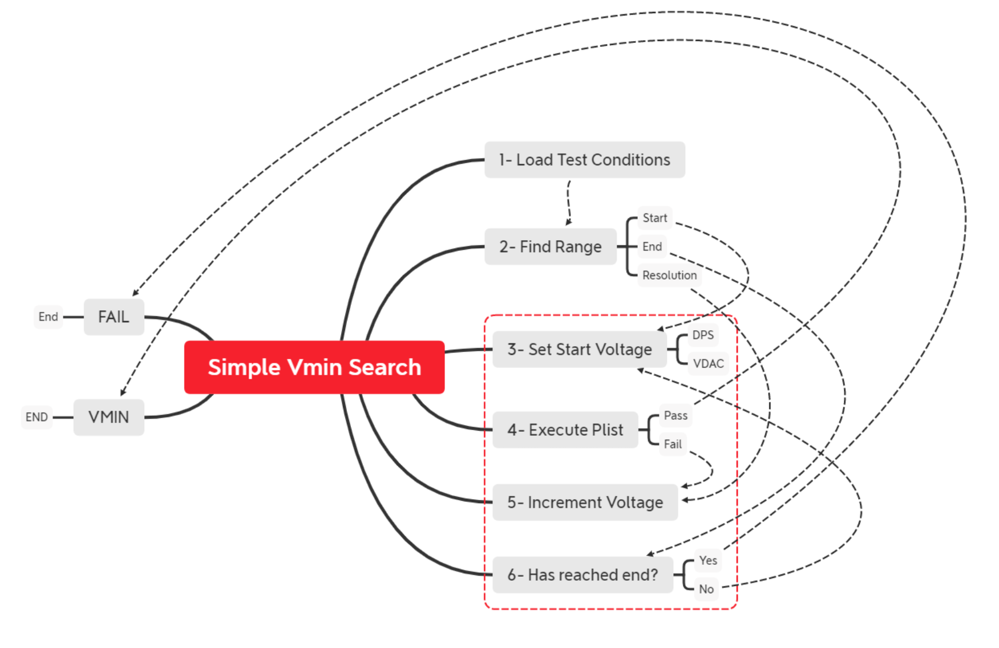
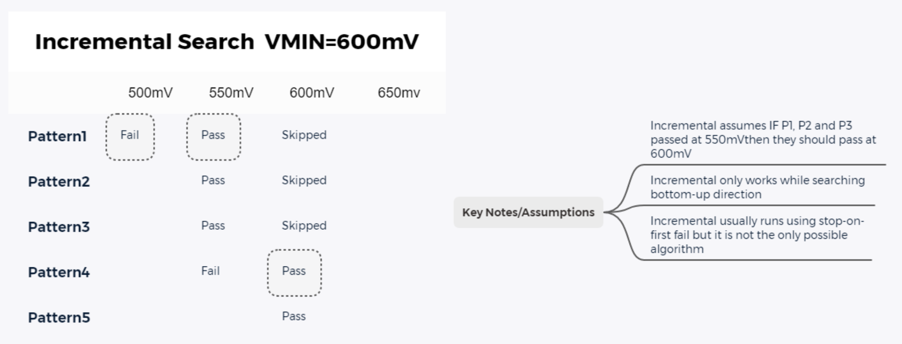
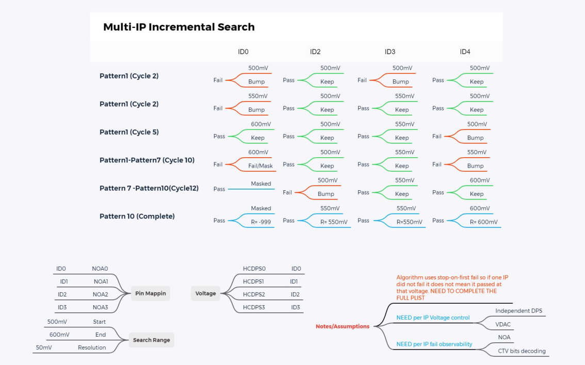

# DDG Prime VminTC

*Revision: June 26, 2025*

## Table of Contents

- [Introduction](#introduction)
- [Test Modes](#test-modes)
- [Search Algorithms](#search-algorithms)
- [Architecture Overview](#architecture-overview)
- [Parameters](#parameters)
  - [ApplyEndSequence](#applyendsequence)
  - [BaseNumbers](#basenumbers)
  - [CornerIdentifiers](#corneridentifiers)
  - [CtvPins](#ctvpins)
  - [DtsConfiguration](#dtsconfiguration)
  - [EnableScoreboardOnMonitorOnly](#enablescoreboardonmonitoronly)
  - [EndVoltageLimits](#endvoltagelimits)
  - [ExecutionMode](#executionmode)
  - [FailCaptureCount](#failcapturecount)
  - [FeatureSwitchSettings](#featureswitchsettings)
  - [FivrCondition](#fivrcondition)
  - [FlowIndex](#flowindex)
  - [FlowIndexCallbackName](#flowindexcallbackname)
  - [ForwardingMode](#forwardingmode)
  - [InitialMaskBits](#initialmaskbits)
  - [LevelsTc](#levelstc)
  - [LimitGuardband](#limitguardband)
  - [MaskPins](#maskpins)
  - [MaxFailsNum](#maxfailsnum)
  - [MaxRepetitionCount](#maxrepetitioncount)
  - [MultiPassMasks](#multipassmasks)
  - [PatternNameCounterIndexes](#patternnamecounterindexes)
  - [Patlist](#patlist)
  - [PinMap](#pinmap)
  - [PostInstancePlist](#postinstanceplist)
  - [PreloadParameters](#preloadparameters)
  - [PrePlist](#preplist)
  - [PrintPatternsOccurrences](#printpatternsoccurrences)
  - [RecoveryMode](#recoverymode)
  - [RecoveryOptions](#recoveryoptions)
  - [RecoveryTimingsTc](#recoverytimingstc)
  - [RecoveryTrackingIncoming](#recoverytrackingincoming)
  - [RecoveryTrackingOutgoing](#recoverytrackingoutgoing)
  - [ScoreboardBaseNumber](#scoreboardbasenumber) (Deprecated - use BaseNumbers)
  - [ScoreboardEdgeTicks](#scoreboardedgeticks)
  - [ScoreboardPerPatternFails](#scoreboardperpatternfails)
  - [StartVoltages](#startvoltages)
  - [StartVoltagesForRetry](#startvoltagesforretry)
  - [StartVoltagesOffset](#startvoltagesoffset)
  - [StepSize](#stepsize)
  - [TestMode](#testmode)
  - [TimingsTc](#timingstc)
  - [TriggerLevelsCondition](#triggerlevelscondition)
  - [TriggerMap](#triggermap)
  - [VminResult](#vminresult)
  - [VoltageConverter](#voltageconverter)
  - [VoltageTargets](#voltagetargets)
  - [VoltagesOffset](#voltagesoffset)
- [Forwarding and Recovery](#forwarding-and-recovery)
- [Feature Switches](#feature-switches)
- [Exit Ports](#exit-ports)
- [Common Usage Patterns](#common-usage-patterns)
- [Token Format Reference](#token-format-reference)
- [Hermes Mode](#hermes-mode)
- [Troubleshooting](#troubleshooting)
- [References](#references)

## Introduction

VminTC is an extension of PRIME VminSearch that enables advanced configurations and seamless integration with DDG DieRecovery and VminForwarding services. This test class is designed for voltage characterization and optimization in Intel silicon testing environments.

This documentation is intended for:

- Test engineers implementing voltage characterization
- Product engineers analyzing Vmin results  
- Integration engineers connecting VminTC with other test infrastructure

## Test Modes

The TestClass supports four main modes:

| Mode | Description |
|:-----|:------------|
| SingleVmin | Supports Vmin searching for a single DPS/FIVR/DLVR rail |
| MultiVmin | Supports searching multiple DPS/FIVR/DLVR pins (requires DieRecovery configuration) |
| Functional | Executes a single-point (static voltage) test condition |
| Scoreboard | Executes a single-point test with scoreboard data collection |

## Search Algorithms

### Simple Search



The simple search algorithm applies a linear fail-to-pass search approach to find the minimum operating voltage. The test starts at the StartVoltage and progressively increases the voltage until no failure is detected.

### Incremental Search



The incremental search algorithm is also a linear fail-to-pass algorithm, but each iteration restarts at the first failing pattern from the previous iteration.

### Multi-IP Incremental Search



Multi-IP search extends the incremental approach to multiple voltage domains or IP blocks simultaneously. This algorithm tracks the minimum voltage for each domain independently, enabling efficient characterization of complex systems.

## Architecture Overview

VminTC builds upon the Prime VminSearch Test Method framework, extending it with additional capabilities for die recovery and voltage forwarding. The implementation follows these key principles:

1. **Service Integration**: Deep integration with Prime and DDG services such as DieRecovery, VminForwarding, DefeatureTracking, and DTS
2. **Flexible Configuration**: Extensive parameter system for customizing test behavior
3. **Multiple Testing Modes**: Support for different voltage search algorithms and testing approaches
4. **Recovery Options**: Various recovery strategies for handling failures and optimizing test flows

### DDG Trackers/SKU Files and Prime DefeatureTrackingService

VminTC supports two primary tracking systems:

1. **Legacy DDG Trackers**: Supported for backward compatibility
2. **Prime DefeatureTrackingService**: Provides enhanced flexibility and new minQTY rule capabilities

Key differences:

- DDG trackers are loaded through JSON files using DieRecoveryBase
- DefeatureTrackingService uses ALEPH for configuration
- DefeatureTrackingService supports tracker groups using the syntax: `TrackingName@GroupName`
- DefeatureTrackingService does not support the "InitialValue" field or defeaturing additional elements after running rules

For comprehensive information on Prime services, refer to: <https://goto.intel.com/primewiki>

## Parameters

### ApplyEndSequence

Controls whether to apply an end sequence at the completion of the test.

**Type**: Enum  
**Required**: No  
**Default**: DISABLED  
**Allowed Values**: DISABLED, ENABLED

**Example**:

```perl
ApplyEndSequence = "ENABLED";
```

### BaseNumbers

A comma-separated list of numbers used to prefix scoreboard counters. This parameter replaces the deprecated ScoreboardBaseNumber parameter.

**Type**: CommaSeparatedInteger  
**Required**: For Scoreboard mode  
**Default**: Empty string  
**Format**: Comma-separated list of integers

**Usage Notes**:

- Required when ExecutionMode is set to "SearchWithScoreboard"
- Each number should be unique to avoid conflicts
- Used in combination with ScoreboardEdgeTicks and PatternNameCounterIndexes

**Examples**:

```perl
BaseNumbers = "12345";  # Single base number
BaseNumbers = "12345,12346,12347";  # Multiple base numbers
```

### CornerIdentifiers

A comma-separated string that specifies corner identifiers predefined in the forwarding table. If you want to track RecoveryTrackers but not Vmin, this parameter must be empty. Supports compressed/ranged format: CR[5-0]@F1.

**Type**: String (comma-separated)  
**Required**: No  
**Default**: Empty string  
**Format**: Supports compressed/ranged format: `CORE[5-0]@F1`

**Examples**:

```perl
CornerIdentifiers = "CR0@F1,CR1@F1";
CornerIdentifiers = "CR[5-0]@F1";
```

### EnableScoreboardOnMonitorOnly

Controls whether scoreboard functionality is only enabled during monitor mode or across all execution modes.

**Type**: Boolean  
**Required**: No  
**Default**: false  
**Format**: Boolean (true/false)

**Usage Notes**:

- When set to true, scoreboard features are only active in monitor mode
- When set to false, scoreboard features are available in all execution modes
- Used with ExecutionMode parameter to control scoreboard behavior

**Examples**:

```perl
EnableScoreboardOnMonitorOnly = true;   # Only enable in monitor mode
EnableScoreboardOnMonitorOnly = false;  # Enable in all modes
```

### ExecutionMode

Specifies the mode of execution for the test method, controlling how the test interacts with scoreboards and recovery systems.

**Type**: String  
**Required**: No  
**Default**: "Search"  
**Format**: String value from predefined options

**Valid Values**:

- "Search": Standard voltage search mode
- "SearchWithScoreboard": Search mode with scoreboard functionality enabled
- "Monitor": Monitor-only mode without voltage searching

**Usage Notes**:

- When set to "SearchWithScoreboard", requires BaseNumbers parameter
- Monitor mode is typically used for validation without voltage modification
- Controls behavior of EnableScoreboardOnMonitorOnly parameter

**Examples**:

```perl
ExecutionMode = "Search";                # Standard search mode
ExecutionMode = "SearchWithScoreboard";  # Search with scoreboard
ExecutionMode = "Monitor";               # Monitor-only mode
```

### FlowIndexCallbackName

Specifies a callback function name for handling flow index operations during test execution.

**Type**: String  
**Required**: No  
**Default**: Empty string  
**Format**: String containing callback function name

**Usage Notes**:

- Used for advanced flow control and callback mechanisms
- Must match a valid callback function defined in the test environment
- Typically used in conjunction with complex test flows

**Examples**:

```perl
FlowIndexCallbackName = "MyFlowCallback";
FlowIndexCallbackName = "";  # No callback
```

### PreloadParameters

Controls whether to preload parameters during test initialization to improve performance.

**Type**: Boolean  
**Required**: No  
**Default**: false  
**Format**: Boolean (true/false)

**Usage Notes**:

- When enabled, parameters are loaded into memory during initialization
- Can improve performance for tests with complex parameter sets
- May increase memory usage during test execution

**Examples**:

```perl
PreloadParameters = true;   # Enable parameter preloading
PreloadParameters = false;  # Disable parameter preloading
```

### PrePlist

Specifies a pre-execution plist to run before the main voltage search operations.

**Type**: String  
**Required**: No  
**Default**: Empty string  
**Format**: String containing plist name

**Usage Notes**:

- Executes before the main search algorithm begins
- Useful for setup operations or initial conditioning
- Must reference a valid plist defined in the test environment

**Examples**:

```perl
PrePlist = "Setup_Plist";
PrePlist = "";  # No pre-plist
```

### PrintPatternsOccurrences

Controls whether to print pattern occurrence information during test execution.

**Type**: Boolean  
**Required**: No  
**Default**: false  
**Format**: Boolean (true/false)

**Usage Notes**:

- When enabled, provides detailed pattern execution information
- Useful for debugging and analysis of pattern behavior
- May impact performance when enabled

**Examples**:

```perl
PrintPatternsOccurrences = true;   # Enable pattern occurrence printing
PrintPatternsOccurrences = false;  # Disable pattern occurrence printing
```

### TriggerLevelsCondition

Specifies the condition for triggering level changes during voltage search operations.

**Type**: String  
**Required**: No  
**Default**: Empty string  
**Format**: String containing trigger condition expression

**Usage Notes**:

- Used to define complex trigger conditions for level modifications
- Can reference voltage levels, pattern results, or other test conditions
- Supports logical expressions and comparisons

**Examples**:

```perl
TriggerLevelsCondition = "voltage > 0.8";
TriggerLevelsCondition = "";  # No trigger condition
```

### TriggerMap

Defines a mapping between triggers and their associated actions during voltage search operations.

**Type**: String  
**Required**: No  
**Default**: Empty string  
**Format**: String containing trigger-to-action mappings

**Usage Notes**:

- Maps specific trigger conditions to corresponding actions
- Used in conjunction with TriggerLevelsCondition parameter
- Supports complex trigger-response patterns

**Examples**:

```perl
TriggerMap = "trigger1:action1,trigger2:action2";
TriggerMap = "";  # No trigger mapping
```

### VoltageConverter

Specifies a voltage converter function to transform voltage values during test execution.

**Type**: String  
**Required**: No  
**Default**: Empty string  
**Format**: String containing converter function name

**Usage Notes**:

- Used to apply voltage transformations or scaling
- Must reference a valid converter function in the test environment
- Typically used for voltage domain-specific conversions

**Examples**:

```perl
VoltageConverter = "MyVoltageConverter";
VoltageConverter = "";  # No voltage conversion
```

### VoltagesOffset

Specifies voltage offset values to apply during voltage search operations.

**Type**: String  
**Required**: No  
**Default**: Empty string  
**Format**: Comma-separated list of voltage offset values

**Usage Notes**:

- Applied as offsets to the base voltage values during search
- Can be used for voltage compensation or calibration
- Supports multiple offsets for different voltage domains

**Examples**:

```perl
VoltagesOffset = "0.05";         # Single offset
VoltagesOffset = "0.05,0.03";    # Multiple offsets
VoltagesOffset = "";             # No offset
```

**Usage By Test Mode**:

| TestMode   | Description |
|:-----------|:-----------------------------------------------------------------------------------------|
| SingleVmin | Supports multiple IDs if you want to start and/or update more than one corner. In the case of multiple start values, the test class will use the maximum as the starting point. |
| MultiVmin  | Expects the number of CornerIdentifiers to match the number and order of VoltageTargets. |
| Functional | Uses this parameter to modify the static voltage condition. When you enter a list of CornerIdentifiers, FlowNumber, VoltageTargets, and EndVoltageLimits, the static voltage condition will be modified to use values from the VminForwardingTable. If the voltage in VminForwardingTable is negative (incoming bad or masked), it will default the VoltageTarget pin/fivr/dlvr to the EndVoltageLimits. |
| Scoreboard | Uses this parameter to modify the static voltage condition. When you enter a list of CornerIdentifiers, FlowNumber, VoltageTargets, and EndVoltageLimits, the static voltage condition will be modified to use values from the VminForwardingTable. If the voltage in VminForwardingTable is negative (incoming bad or masked), it will default the VoltageTarget pin/fivr/dlvr to the EndVoltageLimits. |

### CtvPins

A comma-separated string containing pin names for CTV capture data processing. Data is expected to be processed by PinMap decoders. Supports compressed/ranged format: NOA0[5-0].

**Type**: String (comma-separated)  
**Required**: No  
**Default**: Empty string  
**Format**: Pin names or pin groups, supports compressed/ranged format

**Examples**:

```perl
CtvPins = "TDO";
CtvPins = "STF[31:0]";
```

### DtsConfiguration

Enables the DTS monitor based on configuration from the DTSBase input file.

**Type**: String  
**Required**: No  
**Default**: Empty string  
**Format**: Configuration name from DTSBase

**Example**:

```perl
DtsConfiguration = "ConfigurationName";
```

### EndVoltageLimits

A comma-separated string containing end limit voltage expressions.

**Type**: String (comma-separated)  
**Required**: No  
**Default**: Empty string  
**Format**: Single value, list of values, or tokens/expressions

**Usage By Test Mode**:

| TestMode   | Description                                                                            |
|:-----------|:---------------------------------------------------------------------------------------|
| SingleVmin | If multiple values are provided, it will select the lowest voltage.                        |
| MultiVmin  | If a single value is provided, it will expand the value to match the number of VoltageTargets. |

**Usage Notes**:

- Can use double values, SharedStorage keys, or DFF tokens with prefix "D."
- Use of DFF token requires 'v' character as separator
- Final value calculates the minimum of PredictedEndVoltage and EndVoltageLimits

**Examples**:

```perl
EndVoltageLimits = "1.0";  # Single value
EndVoltageLimits = "1.0,1.1,1.0,1.1";  # Multiple values
EndVoltageLimits = "[D.TOKEN_NAME_]";  # DFF token name
EndVoltageLimits = "[TOKEN_NAME_]-0.003";  # SharedStorage token with expression
EndVoltageLimits = "[TOKEN_NAME0],[TOKEN_NAME1],[TOKEN_NAME2],[TOKEN_NAME3]";  # Multiple tokens
```

### FailCaptureCount

Specifies the number of capture failures to set in capture settings. The default value of 1 will enable stop-on-first-fail behavior. Any value greater than 1 will run the full plist unless used in combination with ReturnOn plist options.

**Type**: Integer (unsigned)  
**Required**: No  
**Default**: 1  
**Format**: Positive integer value

**Example**:

```perl
FailCaptureCount = 77;
```

----

### FeatureSwitchSettings

Accepts comma-separated values to configure multiple VminSearch options and behavior switches.

**Type**: String (comma-separated)  
**Required**: No  
**Default**: Empty string  
**Format**: Comma-separated list of feature switches and/or key=value pairs

### FivrCondition

Specifies the initial FIVR condition as defined in ALEPH *.fivrCondition.json. This condition is applied prior to search point voltage.

**Type**: String  
**Required**: No  
**Default**: Empty string  
**Format**: Condition name from ALEPH configuration

**Example**:

```perl
FivrCondition = "ConditionName"; # FIVR and DLVR share similar setup settings
```

### FlowIndex

Specifies the test instance flow number required for VminForwardingTable (depending on mode). This parameter can accept a single digit FlowNumber or a comma-separated string with one number for each CornerIdentifier. The parameter can also dynamically resolve the current index using the corresponding flow domains.

**Type**: String  
**Required**: No  
**Default**: Empty string  
**Format**: Single flow index or comma-separated flow indices

**Examples**:

```perl
FlowIndex = "1";     # Same flow index is set for all corners
FlowIndex = "1,2,3"; # Per corner-id flow number
```

### ForwardingMode

Configures how VminTC interacts with VminForwarding and DieRecovery services.

**Type**: Enum  
**Required**: No  
**Default**: None  
**Allowed Values**: InputOutput, Input, Output, None

**Mode Descriptions**:

| Mode        | Description |
|:----------- |:------      |
| InputOutput | Retrieves initial tracking from die recovery and vmin forwarding table and updates both after test completion. |
| Input       | Retrieves initial tracking from die recovery and vmin forwarding table but does NOT update tables after search completion.|
| Output      | Sets start voltage from instance parameter regardless of VminForwarding value and updates DieRecovery and VminForwarding.|
| None        | Does not use DieRecovery or VminForwarding to start search and does not update when search is completed. |

**Examples**:

```perl
ForwardingMode = "InputOutput";
ForwardingMode = "Input";
ForwardingMode = "Output";
ForwardingMode = "None";
```

### InitialMaskBits

Sets the initial DieRecovery mask for the instance. When ForwardingMode is Merge or Monitor, the BitArray will be set using a bitwise OR operation.

**Type**: String  
**Required**: No  
**Default**: Empty string  
**Format**: Binary string (e.g., "1110" for running single core)

**Example**:

```perl
InitialMaskBits = "1110"; # running single core
```

### LevelsTc

Specifies the levels setup test condition.

**Type**: String (LevelsCondition)  
**Required**: Yes  
**Default**: None  
**Format**: Test condition name

**Example**:

```perl
LevelsTc = "SomeLevels";
```

### LimitGuardband

An optional parameter for implementing voltage guardband limits.

**Type**: String  
**Required**: No  
**Default**: Empty string  
**Format**: Single value, list of values, or tokens/expressions

#### With VminForwarding Enabled

Used in combination with VminForwarding SearchGuardbandEnabled. If this parameter is set while the instance is running in search mode with forwarding enabled (excluding point test modes), the final vmin result will be compared against the stored value in the forwarding table. When active, **ANY VoltageTarget where result - forwardedvalue > limitguardband** will cause the instance to **exit port 0**.

#### With VminForwarding Disabled

If this parameter is set for an instance with no forwarding mode, the final vmin result will be compared against the start voltage. **ANY VoltageTarget where result - start > limitguardband** will cause the instance to **exit port 0**.

Like StartVoltages and EndVoltageLimits, this parameter can accept a single value, list of values, and supports DFF, Uservars, and/or SharedStorage tokens and expressions.

**Examples**:

```perl
LimitGuardband = "0.05";                    # Single value
LimitGuardband = "0.05,0.06,0.05,0.06";     # Multiple values
LimitGuardband = "[D.TOKEN_NAME]";          # DFF token name
LimitGuardband = "[TOKEN_NAME]-0.003";      # SharedStorage token with expression
LimitGuardband = "[TOKEN_NAME0],[TOKEN_NAME1],[TOKEN_NAME2],[TOKEN_NAME3]"; # Multiple SharedStorage tokens
```

### MaskPins

Sets initial mask pins. **Note: PinMap settings may override your initial MaskPins configuration.**

**Type**: String (comma-separated)  
**Required**: No  
**Default**: Empty string  
**Format**: Comma-separated pin names or pin groups

**Examples**:

```perl
MaskPins = "Pin1,Pin2"; # Individual pins
MaskPins = "PinGroup";  # Pin group
```

### MaxRepetitionCount

Specifies the maximum number of times a search can be repeated for recovery purposes. This parameter defaults to zero, meaning no repetition will be executed for any search.

**Type**: Integer (unsigned)  
**Required**: No  
**Default**: 0  
**Format**: Positive integer value

**Example**:

```perl
MaxRepetitionCount = 3;
```

### MultiPassMasks

Enables a multi-pass search with different mask configurations for each pass.

**Type**: String (comma-separated)  
**Required**: No  
**Default**: Empty string  
**Format**: Comma-separated binary strings representing masks for each pass

**Usage Notes**:

- Supported for Functional and MultiVmin modes only
- Masked incoming cores for each pass will print -8888 as result
- Currently prints vmin data as separate tname sections

**Example**:

```perl
MultiPassMasks = "0011,1100";  # 4-core product testing 2 cores at a time
```

### PatternNameCounterIndexes

A comma-separated string containing indexes that point to digits used for scoreboard counters.

**Type**: String (comma-separated integers)  
**Required**: No  
**Default**: Empty string  

**Examples**:

```perl
PatternNameCounterIndexes = "1,2,3,4,5,6,7";    # Tuple
PatternNameCounterIndexes = "8,9,10,11,12,13,14"; # TID
```

### Patlist

Specifies the main pattern list for testing.

**Type**: String  
**Required**: Yes  
**Default**: Empty string  

**Example**:

```perl
Patlist = "plist_name";
```

### PinMap

List of PinMap configurations as defined in DieRecovery.
Supports compressed/ranged format: PCORE[5-0].

**Type**: String (comma-separated)  
**Required**: For MultiVmin mode  
**Default**: Empty string  
**Format**: Supports compressed/ranged format: `PCORE[5-0]`

**Usage By Test Mode**:

| TestMode   | Description                                                                                               |
|:-----------|:----------------------------------------------------------------------------------------------------------|
| SingleVmin | Optional. Use to set incoming mask for a related domain (not search rail) and use RecoveryMode. |
| MultiVmin  | Required for all test modes/configurations.                                                  |
| Functional | Optional. Use to set incoming mask for a related domain (not search rail) and use RecoveryMode. |
| Scoreboard | Optional. Use to set incoming mask for a related domain (not search rail) and use RecoveryMode. |

**Examples**:

```perl
PinMap = "loaded_pinmap_name";
PinMap = "map1,map2";  # Multiple pinmaps (not recommended)
```

### PostInstancePlist

Executes a PLIST without reloading/applying test conditions or PatConfigs.

**Type**: String  
**Required**: No  
**Default**: Empty string  

**Usage Notes**:

- Typically used for unit shutdown and DTS read out operations
- If parameter is empty but "IP_CPU_BASE::RunTimeLibraryVars.PostInstancePlist" uservar is set, it will use that value
- When a DTS configuration is used and instance exits Port 0, it will collect CTV data and log DTS information

**Example**:

```perl
PostInstancePlist = "ShutdownPlist";
```

### RecoveryMode

Configures how VminTC handles recovery scenarios.

**Type**: Enum  
**Required**: No  
**Default**: Default  
**Allowed Values**: Default, RecoveryPort, RecoveryLoop, RecoveryTimingRetest, NoRecovery

**Mode Descriptions**:

| Mode                      | Description                                      |
|:------------------------- |:------------------------------------------------|
| Default                   | No repetition. Continues to next search on pass. |
| RecoveryPort              | No repetition. Uses Port 3 and special DieRecovery update rules. |
| RecoveryLoop              | Repeats search until rules pass or MaxRepetitionCount has been reached. |
| RecoveryTimingRetest      | Repeats when search fails, applying second timing from RecoveryTimingsTc. |
| NoRecovery                | Returns fail if any non-masked target fails. No chance for recovery. |

See the [Forwarding and Recovery](#forwarding-and-recovery) section for detailed behavior of each mode.

**Example**:

```perl
RecoveryMode = "RecoveryLoop";
```

### RecoveryOptions

The name of the SKU-based DieRecovery rules defining valid results.

**Type**: String  
**Required**: No  
**Default**: Empty string  

**Usage Notes**:

- If left empty, any failing result will be considered a rules failure
- See DieRecovery documentation for details on rule configuration

**Example**:

```perl
RecoveryOptions = "SKU_rule";
```

### RecoveryTimingsTc

Specifies a new timing condition for RecoveryTimingRetest mode.

**Type**: String  
**Required**: For RecoveryTimingRetest mode  
**Default**: Empty string  

**Example**:

```perl
RecoveryTimingsTc = "AlternativeTiming";
```

### RecoveryTrackingIncoming

Specifies a list of DieRecovery tracking structures used to read incoming mask bits.

**Type**: String (comma-separated)  
**Required**: For RecoveryMode usage  
**Default**: Empty string  
**Format**: Supports compressed/ranged format: `TCORE[5-0]`

**Usage Notes**:

- Used in conjunction with ForwardingMode, RecoveryMode, PinMap, and InitialMaskBits
- Configurations must be previously loaded by DieRecovery during initialization

**Examples**:

```perl
RecoveryTrackingIncoming = "CR1,CR0";  # Individual trackers
RecoveryTrackingIncoming = "CR[1-0]";  # Compressed format
```

### RecoveryTrackingOutgoing

Specifies a list of DieRecovery tracking structures to be updated with test results.

**Type**: String (comma-separated)  
**Required**: For updating recovery data  
**Default**: Empty string  
**Format**: Supports compressed/ranged format: `TCORE[5-0]`

**Examples**:

```perl
RecoveryTrackingOutgoing = "CR1,CR0";  # Individual trackers
RecoveryTrackingOutgoing = "CR[1-0]";  # Compressed format
```

### ScoreboardBaseNumber

**⚠️ DEPRECATED**: This parameter is deprecated. Use `BaseNumbers` instead.

Datalog base number for Scoreboard mode. It must be used in combination with ScoreboardEdgeTicks and PatternNameCounterIndexes.

**Type**: String  
**Required**: For Scoreboard mode  
**Default**: Empty string  
**Format**: Numeric value expected to be unique

``` Perl
ScoreboardBaseNumber = "12345"; # this number is expected to be unique
```

**Migration Note**: Replace with `BaseNumbers` parameter which supports comma-separated values.

### ScoreboardEdgeTicks

Specifies the number of ticks for Scoreboard mode while running search. This parameter is not used in Functional mode.

**Type**: Integer (unsigned)  
**Required**: No  
**Default**: 0  
**Format**: Positive integer value

**Example**:

```perl
ScoreboardEdgeTicks = 3;
```

### MaxFailsNum

Specifies the maximum number of failures to be processed for scoreboard mode. A value of 0 means no scoreboard data. A negative number defaults to the maximum number (large number).

**Type**: Integer (unsigned)  
**Required**: No  
**Default**: 0  
**Format**: Integer value

**Example**:

```perl
MaxFailsNum = 20;
```

### ScoreboardPerPatternFails

Sets per-pattern capture limit while running on scoreboard mode. Default is 1; meaning one vector cycle per pattern.

**Type**: Integer (unsigned)  
**Required**: No  
**Default**: 1  
**Format**: Positive integer value

``` Perl
ScoreboardPerPatternFails = 1;
```

### StepSize

Search resolution. Same for all rails. It MUST be a positive (non zero) value.

**Type**: Double  
**Required**: Yes  
**Default**: None  
**Format**: Positive decimal value (in volts)

``` Perl
StepSize = 0.01;
```

### StartVoltages

Start voltages expression. Using Forwarding modes this value will be modified.
If start voltage is NEGATIVE and mask_negative_start_voltages option is not being used, the start voltage will default to the EndVoltage.

**Type**: String (comma-separated)  
**Required**: No  
**Default**: Empty string  
**Format**: Single value, list of values, or tokens/expressions

``` Perl
    StartVoltages = "0.5"; # Single value.
    StartVoltages = "0.5,0.6,0.5,0.6"; # Multiple values.
    StartVoltages = "[D.TOKEN_NAME_]"; # DFF token name.
    StartVoltages = "[TOKEN_NAME_]-0.003"; # SharedStorage token name using expression.
    StartVoltages = "[TOKEN_NAME0],[TOKEN_NAME1],[TOKEN_NAME2],[TOKEN_NAME3]"; # Multiple SharedStorage tokens.
```

### StartVoltagesForRetry

Comma-separated string with predicted start voltages for Overshoot voltage.

**Type**: String (comma-separated)  
**Required**: No  
**Default**: Empty string  
**Format**: Single value, list of values, or tokens/expressions

**Usage Notes**:

- Tokens in [] can contain keys from Uservar, SharedStorage, and DFF with prefix "D."
- If the first iteration passes at StartVoltage, search restarts from LowerStartVoltageKeys

**Examples**:

```perl
StartVoltagesForRetry = "0.5";  # Single value
StartVoltagesForRetry = "0.5,0.6,0.5,0.6";  # Multiple values
StartVoltagesForRetry = "[D.TOKEN_NAME_]";  # DFF token name
StartVoltagesForRetry = "[TOKEN_NAME_]-0.003";  # SharedStorage token with expression
StartVoltagesForRetry = "[TOKEN_NAME0],[TOKEN_NAME1],[TOKEN_NAME2],[TOKEN_NAME3]";  # Multiple tokens
```

### StartVoltagesOffset

Comma-separated string with per-rail StartVoltages offset.

**Type**: String (comma-separated)  
**Required**: No  
**Default**: Empty string  
**Format**: Single value, list of values, or tokens/expressions

**Usage By Test Mode**:

| TestMode   | Description                                                                            |
|:-----------|:---------------------------------------------------------------------------------------|
| SingleVmin | If multiple values are passed, it will pick the highest non-failing voltage.            |
| MultiVmin  | If single value is passed, it will expand the value to match number of VoltageTargets. |

**Usage Notes**:

- Applied regardless if voltages come from parameter or VminForwarding
- Use of DFF token requires 'v' character as separator
- Final value will calculate max of PredictedStartVoltage and StartVoltage

**Examples**:

```perl
StartVoltagesOffset = "-0.01";  # Single value for all targets
StartVoltagesOffset = "-0.01,0.1";  # Value per target
```

### TestMode

Configures which test execution mode to use.

**Type**: Enum  
**Required**: Yes  
**Default**: None  
**Allowed Values**: MultiVmin, SingleVmin, Functional, Scoreboard

See the [Test Modes](#test-modes) section for detailed behavior of each mode.

**Example**:

```perl
TestMode = "MultiVmin";
```

### TimingsTc

Timings test condition.

**Type**: String (TimingCondition)  
**Required**: Yes  
**Default**: None  
**Format**: Test condition name

```perl
TimingsTc = "Timings";
```

### VminResult

Comma-separated key names for storing search results in SharedStorage.

**Type**: String (comma-separated)  
**Required**: No  
**Default**: Empty string  

**Usage Notes**:

- Stores values in SharedStorage using the specified key names with Context.DUT
- Results are stored in the order corresponding to VoltageTargets

**Example**:

```perl
VminResult = "Core0Vmin,Core1Vmin,Core2Vmin,Core3Vmin";
```

### VoltageTargets

Comma-separated list of voltage targets for the search.

**Type**: String (comma-separated)  
**Required**: Yes  
**Default**: Empty string  

**Usage Notes**:

- For DPS pins, use the pin name
- For FIVR domains, prefix with "FIVR:"
- For DLVR domains, prefix with "DLVR:"

**Example**:

```perl
VoltageTargets = "VCC,FIVR:Core0,FIVR:Core1,DLVR:SA";
```

## Forwarding and Recovery

## Forwarding Modes

VminTC supports four forwarding modes that control how it interacts with the VminForwarding service:

| Mode        | Start Values From | Updates Table |
|:------------|:-----------------|:--------------|
| InputOutput | VminForwarding    | Yes           |
| Input       | VminForwarding    | No            |
| Output      | Parameters        | Yes           |
| None        | Parameters        | No            |

## Recovery Modes and Rules

The following tables detail the behavior of each recovery mode based on search results and recovery rules.

### Default Mode

| Rules - PreTest | Search Results | Rules - TestResults | Rules - Standard | Port | Update | Notes                                     |
|:----------------|:---------------|:--------------------|:-----------------|:-----|:-------|:------------------------------------------|
| Pass            | Pass           | x                   | Pass             | 1    | yes    | No Change                                 |
| Pass            | Pass           | x                   | Fail             | 2    | no     | No Change                                 |
| Pass            | Fail           | x                   | Pass             | 0    | yes    | No Change                                 |
| Pass            | Fail           | x                   | Fail             | 0    | no     | No Change                                 |
| Fail            | Pass           | Pass                | x                | 1    | yes*   | Use TestResults instead of Standard rules |
| Fail            | Pass           | Fail                | x                | 2    | no     | Use TestResults instead of Standard rules |
| Fail            | Fail           | Pass                | x                | 2    | no     | Use TestResults instead of Standard rules |
| Fail            | Fail           | Fail                | x                | 0    | no     | Use TestResults instead of Standard rules |

### RecoveryPort Mode

| Rules - PreTest | Search Results | Rules - TestResults | Rules - Standard | Port | Update | Notes                                     |
|:----------------|:---------------|:--------------------|:-----------------|:-----|:-------|:------------------------------------------|
| Pass            | Pass           | x                   | Pass             | 1    | yes    | No Change                                 |
| Pass            | Pass           | x                   | Fail             | 2    | no     | No Change                                 |
| Pass            | Fail           | x                   | Pass             | 3    | yes    | No Change                                 |
| Pass            | Fail           | x                   | Fail             | 0    | no     | No Change                                 |
| Fail            | Pass           | Pass                | x                | 1    | yes*   | Use TestResults instead of Standard rules |
| Fail            | Pass           | Fail                | x                | 2    | no     | Use TestResults instead of Standard rules |
| Fail            | Fail           | Pass                | x                | 3    | no     | Use TestResults instead of Standard rules |
| Fail            | Fail           | Fail                | x                | 0    | no     | Use TestResults instead of Standard rules |

**Notes**:

- "no" with recovery_update_always will update only OutgoingTrackers with the TestResults, not other IP
- Rules - Standard: (OutgoingTrackers OR TestResults) + UntestedTrackersFromRule
- Rules - PreTest: OutgoingTrackers + UntestedTrackersFromRule
- Rules - TestResults: TestResults + 0's for UntestedTrackers
- DieRecoveryBase EnablePreTestCheck default is 'True' but can be globally turned off using parameter

## Feature Switches

The `FeatureSwitchSettings` parameter accepts a comma-separated list of options to configure VminTC behavior. These switches are grouped into two categories: ON/OFF Switches and Options with Values.

### ON/OFF Switches

| Switch | Description | Default | Example Use Case |
|:-------|:------------|:--------|:----------------|
| disable_masked_targets | Runs patconfig to disable core/slice/ip associated with the voltage_target | OFF | Disabling unused cores during testing |
| disable_pairs | Similar to disable_masked_targets, this setting will disable core/slice/ip but using pairs for even-odd index | OFF | '10000000' will become '11110000' |
| disable_quadruplets | Similar to disable_pairs, this setting will disable core/slice/ip quadruplets | OFF | '10000000' will become '11110000' |
| fivr_mode_on | Sets FIVR mode 'ON' or 'OFF' | OFF | '10000000' will become '11110000' |
| start_on_first_fail_[on/off] | Sets incremental search 'ON' or 'OFF' | ON | Enabling/disabling incremental search |
| ignore_masked_results[on/off] | Ignores decoded results from masked elements | OFF | Filtering out results from disabled cores |
| print_per_target_increments | Enables logging of per target increments | OFF | Detailed debugging of voltage increments |
| print_results_for_all_searches | Prints all multi-pass and recovery loops as different ituff lines | OFF | Detailed logging of multiple search passes |
| print_scoreboard_counters | Prints scoreboard counters in addition to increment tfail | OFF | Enhanced failure debugging |
| per_pattern_printing | Prints per pattern vmin result | OFF | Detailed pattern-level debugging |
| recovery_update_always | Updates DieRecovery tracker regardless of passing or fail condition | OFF | Force tracker updates even on failures |
| vmin_update_always | Updates VminForwarding for passing and/or failing instances | OFF | Force forwarding updates even on failures |
| vmin_update_on_pass | While using RecoveryPort updates VminForwarding for passing instances only | OFF | Special recovery mode for serial testing |
| return_on_global_sticky_error | Modifies capture settings for GlobalStickyError | OFF | Enhanced error handling |
| force_recovery_loop | Forces recovery loop execution when the last search loop fails | OFF | Always attempt recovery |
| incremental_recovery_loop | Stores the last failing pattern for the next REPEAT cycle | OFF | Optimized recovery for FUNCTIONAL/SCOREBOARD modes |
| datalog_as_mrslt | Datalogs vmin result using _mrslt format | OFF | Alternative datalog format |
| mask_negative_start_voltages | Converts negative start voltages to voltage target mask | OFF | Automatic masking of invalid voltage domains |
| all_negative_start_set_to_end | If all start voltages are negative, sets them to end voltage limit | OFF | Handling invalid start voltages |
| ignore_invalid_initial_mask | Ignores test failure due to InvalidInitialMask | OFF | NPU0 or GT0 setup with RecoveryLoop |

### Options with Values

#### frequency_scaling_factor

Adjusts the VminForwarding result using linear interpolation.

**Default**: None  
**Format**: Double value or token  
**Usage Notes**: Scaling factor is applied to all results before updating VminForwarding

**Examples**:

```perl
FeatureSwitchSettings = "frequency_scaling_factor=1.05";
FeatureSwitchSettings = "frequency_scaling_factor=G.U.D.SomeScalingFactor";
```

#### skip_pre_burst_plist

Controls PreBurstPList behavior for handling failures.

**Default**: None  
**Usage Notes**:

- During Verify, reads and stores the original/initial plist options
- At each search start, restores plist options to original state
- After plist execution, if plist fails and it's not an amble, replaces the original PreBurstPList with the indicated option

**Examples**:

```perl
FeatureSwitchSettings = "skip_pre_burst_plist=";  # Remove option
FeatureSwitchSettings = "skip_pre_burst_plist=IP_CPU::set_voltage";
```

#### skip_test

Skips test/plist execution, updating VminResult and VminForwarding using StartVoltages.

**Default**: None  
**Format**: Integer (exit port > 0)  
**Usage Notes**: User must enter the skip exit port (greater than 0)

**Example**:

```perl
FeatureSwitchSettings = "skip_test=1";
```

**ITUFF Output**:

```perl
2_tname_instance_PS
2_strgval_L1
```

## Exit Ports

VminTC defines specific exit ports with the following meanings:

| Port | Description |
|:-----|:------------|
| 0    | Test failed and recovery failed or was not attempted |
| 1    | Test passed successfully |
| 2    | Test passed but recovery failed |
| 3    | Test failed but recovery succeeded |

The exit port behavior can be modified by certain feature switches and recovery modes. See the [Forwarding and Recovery](#forwarding-and-recovery) section for details on how different recovery modes affect port selection.

## Token Format Reference

VminTC supports various token formats for dynamic parameter values. This section explains the supported token formats and their usage.

### SharedStorage Tokens

Use square brackets to reference values from SharedStorage:

```perl
"[TokenName]"  # Standard reference to a SharedStorage token
```

### Uservar Tokens

Use G.U.D. prefix to reference values from Uservars:

```perl
"G.U.D.UsrVarName"  # Reference to a Uservar
```

### DFF Tokens

Use D. prefix inside square brackets to reference values from DFF:

```perl
"[D.TokenName]"  # Reference to a DFF token
```

### Expression Tokens

Basic arithmetic expressions are supported:

```perl
"[TokenName]+0.05"  # Add 0.05 to the token value
"[TokenName]-0.01"  # Subtract 0.01 from the token value
```

### Compressed Range Format

For parameters that accept lists of pins, trackers, or identifiers, use compressed ranges:

```perl
"CORE[7-0]"    # Expands to CORE7,CORE6,CORE5,CORE4,CORE3,CORE2,CORE1,CORE0
"CR[3-0]@F1"   # Expands to CR3@F1,CR2@F1,CR1@F1,CR0@F1
```

## Common Usage Patterns

## Basic SingleVmin Search

```perl
TestMode = "SingleVmin";
Patlist = "some_pattern_list";
LevelsTc = "nominal_levels";
VoltageTargets = "VCC";
ForwardingMode = "None";
StartVoltages = "0.9";
EndVoltageLimits = "0.7";
StepSize = "0.01";
FeatureSwitchSettings = "start_on_first_fail_on";
```

## MultiVmin Search with Forwarding and Recovery

```perl
TestMode = "MultiVmin";
Patlist = "core_test_patterns";
LevelsTc = "nominal_levels";
VoltageTargets = "FIVR:Core0,FIVR:Core1,FIVR:Core2,FIVR:Core3";
ForwardingMode = "InputOutput";
FlowIndex = "1";
CornerIdentifiers = "CR0@F1,CR1@F1,CR2@F1,CR3@F1";
PinMap = "PCORE[3-0]";
RecoveryTrackingIncoming = "CORE[3-0]";
RecoveryTrackingOutgoing = "CORE[3-0]";
RecoveryMode = "RecoveryLoop";
MaxRepetitionCount = "2";
RecoveryOptions = "CORE_SKU";
EndVoltageLimits = "0.7";
StepSize = "0.01";
```

## Functional Mode with VminForwarding

```perl
TestMode = "Functional";
Patlist = "functional_test";
LevelsTc = "nominal_levels";
VoltageTargets = "FIVR:Core0,FIVR:Core1";
ForwardingMode = "Input";
FlowIndex = "1";
CornerIdentifiers = "CR0@F1,CR1@F1";
PinMap = "PCORE[1-0]";
RecoveryTrackingIncoming = "CORE[1-0]";
```

## Scoreboard Mode with Per-Pattern Analysis

```perl
TestMode = "Scoreboard";
Patlist = "scoreboard_patterns";
LevelsTc = "nominal_levels";
VoltageTargets = "VCC";
ForwardingMode = "Input";
FlowIndex = "2";
CornerIdentifiers = "CR0@F2";
PatternNameCounterIndexes = "1,2,3,4,5,6,7";
ScoreboardPerPatternFails = "10";
FeatureSwitchSettings = "print_scoreboard_counters,per_pattern_printing";
```

## Multi-Pass Testing Configuration

```perl
TestMode = "MultiVmin";
Patlist = "core_test";
LevelsTc = "nominal_levels";
VoltageTargets = "FIVR:Core0,FIVR:Core1,FIVR:Core2,FIVR:Core3";
MultiPassMasks = "0011,1100";  # Test cores 0-1 then 2-3
ForwardingMode = "InputOutput";
FlowIndex = "1";
CornerIdentifiers = "CR0@F1,CR1@F1,CR2@F1,CR3@F1";
PinMap = "PCORE[3-0]";
FeatureSwitchSettings = "print_results_for_all_searches";
```

## DTS Monitoring Configuration

```perl
TestMode = "SingleVmin";
Patlist = "thermal_test";
LevelsTc = "nominal_levels";
VoltageTargets = "VCC";
DtsConfiguration = "CoreThermalConfig";
CtvPins = "TDO";
PostInstancePlist = "thermal_shutdown";
```

## Hermes Mode

Hermes Mode is a specialized operating mode in VminTC that combines Search and Check tests into a single test instance to optimize test execution efficiency and performance.

### Overview

Hermes Mode provides the following key benefits:

- Reduces test time by eliminating separate test instances requiring reset
- Simplifies the speed-flow test execution order
- Enables more efficient voltage and frequency testing with specialized pattern management
- Supports testing optimization with short and long pattern lists in a single execution

### Configuration Requirements

Hermes Mode requires two levels of enablement:

1. **Global Enablement**: Set by VminForwardingBase Test Method.

   ```perl
   EnableHermesMode = "True";  # Enables Hermes Mode globally
   ```

2. **Compatible Pattern Lists**: Requires specific pattern list structure with short and long pattern lists

   ```perl
   # Master pattern list with short and long subref patterns
   Patlist = "domain_plist_freqcorner_master";
   ```

### Pattern List Structure

To support Hermes Mode, pattern lists must follow this structure:

1. A master pattern list that references short and long sub-pattern lists
2. Short pattern lists (with suffix `_short__0`) containing limiting patterns
3. Long pattern lists (with suffix `_long__1`) containing supplementary patterns

- The master pattern list can include references to both short and long, short only or long only patterns.
- Scoreboard on edge will be executed only on the long patterns.
- If Hermes Mode is enabled, any monolithic pattern list result (not using '__') will go to the Tier1 (Level1 / Check result in VminForwarding).

Example pattern structure:

```perl
# Master pattern list
level1 = level0.add(Plb("arr_cdie_mbist_vccc_plist_f1_master"))
level1.add(PreExecRefPList("arr_mbist_core_reset"))
level1.add(RefPlb("arr_cdie_mbist_vccc_plist_f1_short__0"))
level1.add(RefPlb("arr_cdie_mbist_vccc_plist_f1_long__1"))
```

### VminForwarding Integration

When Hermes Mode is enabled, VminForwarding will handle results from both short and long patterns as follows:

1. Short patterns will be processed as Level0 results and VminForwarding will update the Level0 and L1 results.
2. Long patterns will be processed as Level1 results, updating the VminForwarding table as L1 results only.

### Implementation

To convert an existing VminTC implementation to use Hermes Mode:

1. Remove separate search instances
2. Replace pattern list with master pattern list
3. Add required feature switches

### Output Format

With Hermes Mode enabled, ITUFF output includes separate Vmin results for short and long patterns:

```perl
# Normal mode (monolithic)
1.060_1.050_1.060_1.060_-8888_-8888|0.550_0.550_0.550_0.550_0.550_0.550|1.300_1.300_1.300_1.300_1.300_1.300|140

# Hermes Mode (short:long)
1.170_1.130_1.130_1.140_-8888_-8888:1.170_1.140_1.150_1.150_-8888_-8888|0.450_0.450_0.450_0.450_0.450_0.450|1.200_1.200_1.200_1.200_1.200_1.200|195
```

- If the main plist contains Short only, the output will set L0 and L1 with matching values.
- If the main plist contains Long only, the output will set L0 at StartVoltages and L1 will reflect your vmin results.

The format is: `Level0_vmin_results:Level1_vmin_results|StartVoltages|EndVoltages|Iterations`

### Considerations

- Hermes Mode is disabled by default
- Downstream sockets (CSM, PHM) typically run in monolithic mode
- Early (PO) implementations may use short patterns for preamble and long patterns for main tests
- Production implementations often use PUP/NPR to optimize short/long pattern content

## Troubleshooting

## Common Issues and Solutions

### Invalid Initial Mask

**Symptom**: Test fails with "Invalid initial mask" error

**Causes**:

- All cores/slices have been masked, making test execution impossible
- Configuration error in PinMap or InitialMaskBits

**Solutions**:

- Verify that at least one valid core/slice is enabled
- Use `ignore_invalid_initial_mask` switch when testing configurations that might have all units disabled (e.g., GT0)
- Check incoming mask values from RecoveryTrackingIncoming

### VminForwarding Update Failures

**Symptom**: Test passes but VminForwarding data is not updated

**Causes**:

- ForwardingMode set incorrectly
- Default behavior only updates on ports 1 and 3

**Solutions**:

- Verify ForwardingMode is set to "InputOutput" or "Output"
- Use `vmin_update_always` switch to update regardless of exit port
- Check that CornerIdentifiers and FlowIndex are properly configured

### Unexpected Voltage Application

**Symptom**: Applied voltages don't match expected values

**Causes**:

- StartVoltagesOffset affecting initial values
- VminForwarding providing unexpected values
- EndVoltageLimits constraints being applied

**Solutions**:

- Check debug output for applied voltage values
- Verify VminForwarding data with separate diagnostic
- Use "mask_negative_start_voltages" to handle invalid forwarded values

### Recovery Loop Not Executing

**Symptom**: Test fails without attempting recovery

**Causes**:

- MaxRepetitionCount set to 0
- RecoveryMode not set correctly
- Recovery rules not properly configured

**Solutions**:

- Set MaxRepetitionCount > 0
- Verify RecoveryMode is set to "RecoveryLoop"
- Use "force_recovery_loop" to bypass rule checks

### Pattern-Specific Failures

**Symptom**: Test fails only on specific patterns

**Causes**:

- Thermal sensitivity
- Frequency-specific issues
- Pattern-specific implementation problems

**Solutions**:

- Enable DTS monitoring
- Use "per_pattern_printing" to identify failing patterns
- Configure "incremental_recovery_loop" to optimize retesting

## Debugging Strategies

### Enable Detailed Logging

```perl
FeatureSwitchSettings = "print_per_target_increments,print_results_for_all_searches,per_pattern_printing";
```

### Test with Simplified Configuration

Start with a basic configuration and add complexity incrementally:

```perl
TestMode = "SingleVmin";
Patlist = "simple_test";
LevelsTc = "nominal_levels";
VoltageTargets = "VCC";
ForwardingMode = "None";
StartVoltages = "0.9";
EndVoltageLimits = "0.7";
```

### Isolate Problem Domains

Use MultiPassMasks to test problematic domains individually:

```perl
MultiPassMasks = "1000,0100,0010,0001";  # Test each core separately
```

## References

- [Prime Test Method Specification](https://goto.intel.com/primewiki)
- [DieRecovery Service Documentation](https://goto.intel.com/prime-services)
- [VminForwarding Service Guide](https://goto.intel.com/vminforwarding)
- [DDG Test Infrastructure](https://goto.intel.com/ddg-infrastructure)
